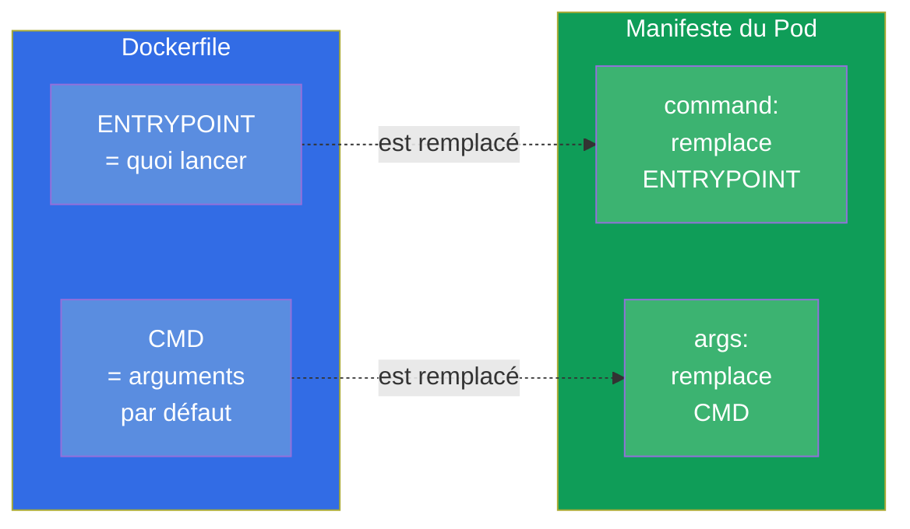
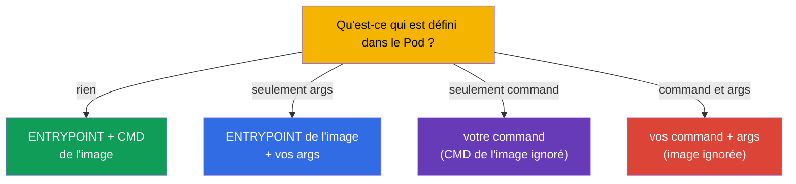
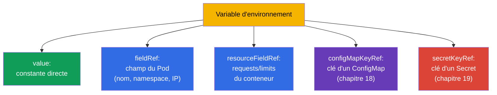

[Русская версия](ru.md) · [Eng version](README.md) · [Versión en español](es.md) · [Deutsche Version](de.md) · [ქართული ვერსია](ge.md) · [繁體中文版](tw.md) · [日本語版](jp.md)

# Chapitre 17. Commandes, arguments et variables d'environnement

> **Ce qui suit.** Nous entamons la partie 3 - la configuration des applications. Avant de
> sortir les configs dans des ConfigMap et des Secret (chapitres 18-19), il faut comprendre
> la base : comment définir pour un conteneur la commande de démarrage, les arguments et les
> variables d'environnement. C'est le domaine Environment/Config (CKAD, 25%) et Workloads
> (CKA). Le sujet paraît simple, mais `command`/`args` dans Kubernetes et
> `ENTRYPOINT`/`CMD` dans Docker se confondent en permanence - et cela coûte des points et
> des Pods cassés.

## 17.1. ENTRYPOINT/CMD dans Docker et leur reflet dans Kubernetes

Quand on construit une image dans Docker, on y définit ce qu'il faut lancer : `ENTRYPOINT`
(le programme exécutable lui-même) et `CMD` (les arguments par défaut). Kubernetes les
remplace par ses propres champs :



Retenez la correspondance - elle est souvent demandée :

| Docker | Kubernetes | Rôle |
|--------|-----------|------|
| `ENTRYPOINT` | `command` | le programme exécutable |
| `CMD` | `args` | ses arguments |

## 17.2. command et args dans un Pod

```yaml
spec:
  containers:
  - name: app
    image: busybox
    command: ["sleep"]       # remplace ENTRYPOINT
    args: ["3600"]           # remplace CMD
```

Règles de remplacement (voilà justement le piège courant) :

- seul `args` est défini - on prend l'`ENTRYPOINT` de l'image + vos `args` ;
- seul `command` est défini - on prend votre `command`, le `CMD` de l'image est ignoré ;
- les deux sont définis - on utilise les deux, l'image est totalement ignorée ;
- rien n'est défini - l'`ENTRYPOINT` et le `CMD` de l'image s'appliquent.



De façon impérative, la commande se définit via `--command -- ...` :

```bash
kubectl run busy --image=busybox --command -- sleep 3600
# tout ce qui suit -- devient command
```

## 17.3. Deux formes d'écriture : exec et shell

La commande peut s'écrire de deux manières, et la différence est de fond.

- **Forme exec** (liste de chaînes) - se lance directement, sans shell. C'est la bonne façon
  dans Kubernetes : les signaux (SIGTERM) atteignent le processus, le PID 1 est votre
  application.

```yaml
command: ["sh", "-c", "echo hello"]
args: ["--port", "8080"]
```

- **Forme shell** (une seule chaîne) - dans Docker, elle se lance via `/bin/sh -c`. Dans
  Kubernetes, pour l'interpolation des variables ou les pipes, on utilise un `sh -c`
  explicite :

```yaml
command: ["sh", "-c", "echo $HOSTNAME && sleep 3600"]
```

> **Pourquoi c'est important.** S'il faut la substitution de variables d'environnement, des
> pipes ou plusieurs commandes - enveloppez dans `sh -c "..."`. Sans shell, `$VAR` ne sera
> pas développé et `|` ne fonctionnera pas - c'est une cause fréquente du « la commande ne
> fait pas ce qui était attendu ».

## 17.4. Variables d'environnement : env

La façon la plus simple de passer de la configuration à un conteneur, ce sont les variables
d'environnement via `env` :

```yaml
spec:
  containers:
  - name: app
    image: nginx
    env:
    - name: COLOR
      value: "blue"
    - name: GREETING
      value: "hello world"
```

```bash
# De façon impérative, à la création
kubectl run web --image=nginx --env="COLOR=blue" --env="MODE=prod"
```

Les simples paires `name/value` conviennent aux valeurs statiques. Mais souvent il faut
prendre une valeur **dynamiquement** - depuis les champs du Pod lui-même, depuis les
ressources ou depuis un ConfigMap/Secret. Pour cela, il y a `valueFrom`.

## 17.5. valueFrom : sources dynamiques de variables

`valueFrom` permet de remplir une variable non pas avec une constante, mais depuis une
source.



**Downward API** - le mécanisme qui donne au Pod des informations sur lui-même (`fieldRef`,
`resourceFieldRef`) :

```yaml
    env:
    - name: MY_POD_NAME
      valueFrom:
        fieldRef:
          fieldPath: metadata.name
    - name: MY_POD_IP
      valueFrom:
        fieldRef:
          fieldPath: status.podIP
    - name: MY_NODE_NAME
      valueFrom:
        fieldRef:
          fieldPath: spec.nodeName
    - name: MY_CPU_LIMIT
      valueFrom:
        resourceFieldRef:
          containerName: app
          resource: limits.cpu
```

Ainsi l'application connaît son nom, son IP, son nœud, ses limites - sans rien coder en
dur. `configMapKeyRef` et `secretKeyRef` (prendre la valeur dans un ConfigMap/Secret)
seront traités dans les chapitres suivants.

> **Important : que verra le Pod si on modifie le ConfigMap/Secret ?** Les variables
> d'environnement (`configMapKeyRef`, `secretKeyRef`, `envFrom`) sont substituées **une
> seule fois - au moment du démarrage du conteneur**. Si l'on modifie ensuite le ConfigMap
> ou le Secret, le Pod déjà lancé **continuera de voir l'ancienne valeur** : les variables
> env ne sont pas mises à jour rétroactivement. Pour récupérer la nouvelle, il faut
> recréer le Pod - par exemple, `kubectl rollout restart deployment/<name>`. C'est un piège
> fréquent : « j'ai corrigé le ConfigMap, et l'application est quand même sur l'ancienne
> valeur ».
>
> Le **montage** d'un ConfigMap/Secret en tant que volume se comporte autrement (chapitre
> 18) : là, le kubelet met périodiquement à jour les fichiers dans le conteneur quand
> l'objet change (avec un délai de l'ordre de la minute), et aucun redémarrage n'est
> nécessaire - mais l'application doit **relire le fichier elle-même**. Exception - le
> montage via `subPath` : ces fichiers ne sont pas mis à jour du tout. Autrement dit, la
> mise à jour « à chaud » de la configuration sans redémarrage n'est possible que via un
> volume (pas `subPath`) et à condition que l'application sache relire sa config.

## 17.6. Variables d'environnement et ordre de développement

Les variables peuvent se référencer entre elles via `$(VAR)` (à ne pas confondre avec le
`$VAR` du shell) :

```yaml
    env:
    - name: HOST
      value: "db"
    - name: PORT
      value: "5432"
    - name: DSN
      value: "$(HOST):$(PORT)"     # → db:5432
```

Kubernetes développe `$(VAR)` pour les variables déclarées **plus tôt** dans la liste. Une
référence à une variable pas encore déclarée ne sera pas développée. Pour afficher un
`$(...)` littéral, on échappe par doublement : `$$(...)`.

## 17.7. Vérification : ce qui est réellement arrivé dans le conteneur

Le débogage de la configuration revient toujours à « et qu'y a-t-il vraiment à
l'intérieur ? » :

```bash
# Voir les variables d'environnement du conteneur
kubectl exec <pod> -- env

# Voir quelle commande est réellement définie
kubectl get pod <pod> -o jsonpath='{.spec.containers[0].command}'
kubectl get pod <pod> -o jsonpath='{.spec.containers[0].args}'

# Description complète
kubectl describe pod <pod>
```

`kubectl exec <pod> -- env` est le moyen le plus rapide de s'assurer que les variables
(y compris celles issues d'un ConfigMap/Secret) sont bien arrivées dans le conteneur. Face
à la plainte « l'application ne voit pas la config », c'est par là qu'on commence.

## 17.8. Comment cela s'applique en production

- **Env - pour une petite configuration, ConfigMap/Secret - pour le reste.** Deux ou trois
  variables directement dans le manifeste, c'est normal ; mais la vraie configuration
  (beaucoup de paramètres, communs à plusieurs Pods, données sensibles) est sortie dans des
  ConfigMap et des Secret (chapitres 18-19), et tirée dans le Pod via `valueFrom`. Coder la
  config en dur dans le manifeste du déploiement est une mauvaise pratique.
- **Downward API pour l'observabilité.** Via le Downward API, les applications récupèrent
  leur nom, leur nœud, leur namespace - cela part dans les logs et les métriques pour le
  traçage : le log montre immédiatement quel Pod et sur quel nœud a généré l'entrée.
- **Application 12-factor.** La pratique de stocker la configuration dans l'environnement
  (et non dans le code) fait partie de la méthodologie 12-factor app : une seule et même
  image fonctionne en dev/stage/prod, seules les variables changent. Cela rend les images
  portables.
- **Forme exec et arrêt correct.** En prod, la commande s'écrit en forme exec pour que
  SIGTERM atteigne l'application et qu'elle s'arrête gracefully lors d'un déploiement ou
  d'une mise à l'échelle. La forme shell sans `exec` peut « avaler » le signal, et le Pod
  sera tué brutalement au bout du timeout.
- **Aucun secret en clair dans env.** Les mots de passe et les tokens ne s'écrivent pas en
  valeur dans `env` - on les prend dans un Secret (chapitre 19), sinon ils fuitent dans les
  manifestes, dans git et dans `kubectl describe`.

## 17.9. Mini-glossaire

- **command** - remplace l'ENTRYPOINT de l'image (quoi lancer).
- **args** - remplace le CMD de l'image (les arguments).
- **ENTRYPOINT/CMD** - quoi lancer et avec quels arguments, défini dans l'image.
- **forme exec** - la commande sous forme de liste, sans shell (la bonne pour les signaux).
- **forme shell** - la commande via `sh -c` (nécessaire pour les variables, les pipes).
- **env** - les variables d'environnement du conteneur.
- **valueFrom** - remplissage d'une variable depuis une source (champ du Pod, ressources,
  CM/Secret).
- **Downward API** - accès du Pod aux informations sur lui-même (`fieldRef`,
  `resourceFieldRef`).
- **`$(VAR)`** - référence à une variable déclarée précédemment dans le manifeste.

## 17.10. Bilan du chapitre

- Kubernetes remplace l'ENTRYPOINT de l'image par le champ `command`, et le CMD - par le
  champ `args`.
- Règles : seulement args → ENTRYPOINT+args ; seulement command → votre command ; les deux →
  l'image est ignorée ; rien → l'image telle quelle.
- La forme exec (liste) lance sans shell et délivre correctement les signaux ; pour les
  variables/pipes, il faut un `sh -c` explicite (forme shell).
- Les variables d'environnement se définissent via `env` (name/value) ou `valueFrom`
  (dynamiquement).
- `valueFrom` prend les valeurs dans les champs du Pod/les ressources (Downward API) ou dans
  un ConfigMap/Secret.
- `$(VAR)` développe les variables déclarées précédemment ; `$$` échappe.
- La vérification de l'état réel - `kubectl exec -- env` et du jsonpath sur command/args.

## 17.11. À quoi cela sert : à l'examen et dans le travail réel

**À l'examen.** « Définis la commande/les arguments d'un conteneur », « ajoute une variable
d'environnement », « expose le nom du Pod/du nœud via le Downward API » sont des exercices
fréquents. Il est critique de ne pas confondre `command`/`args` avec ENTRYPOINT/CMD et de
savoir vérifier le résultat via `kubectl exec -- env`. C'est le fondement des exercices sur
ConfigMap/Secret (chapitres 18-19).

**Dans le travail réel.** La configuration par l'environnement est la base des images
portables (12-factor) : une seule image pour tous les environnements. Le Downward API donne
à l'application le contexte pour les logs et les métriques. Une forme exec correcte de la
commande assure un arrêt propre lors des déploiements. Et l'habitude de ne pas mettre les
secrets directement dans `env` est une question de sécurité.

## 17.12. Questions d'auto-évaluation

1. Quels champs Kubernetes correspondent à l'ENTRYPOINT et au CMD de l'image ?
2. Que va-t-il se lancer si l'on définit seulement `args` ? Et seulement `command` ? Et les
   deux ?
3. En quoi la forme exec d'une commande diffère-t-elle de la forme shell et quand a-t-on
   besoin de chacune ?
4. Comment passer via `valueFrom` le nom du Pod et son IP dans une variable ?
5. Qu'est-ce que le Downward API et qu'apporte-t-il à l'application ?
6. Comment les références `$(VAR)` se développent-elles dans `env` et comment afficher un
   `$(...)` littéral ?
7. Comment vérifier rapidement quelles variables sont réellement arrivées dans le conteneur ?

## Pratique

Nous avons appris à définir la commande et à passer la config par l'environnement. Ensuite,
nous sortirons la configuration dans des objets à part : ConfigMap (chapitre 18) pour les
données ordinaires et Secret (chapitre 19) pour les données sensibles. Les commandes, les
arguments et les variables se travaillent dans les TP sur la configuration.

🧪 TP 105 (commandes, arguments, variables d'environnement) : [tasks/cka/labs/105](../../labs/105/README_FR.MD)

🎮 Killercoda (dans le navigateur, sans installation) : [Use ConfigMap as env vars](https://killercoda.com/chadmcrowell/course/ckad/configmap-envvars) · [Use Secret as env vars](https://killercoda.com/chadmcrowell/course/ckad/secret-envvars) · [Run busybox with sleep](https://killercoda.com/chadmcrowell/course/ckad/busybox-sleep)

---
[Sommaire](../README_FR.md) · [Chapitre 16](../16/fr.md) · [Chapitre 18](../18/fr.md)
