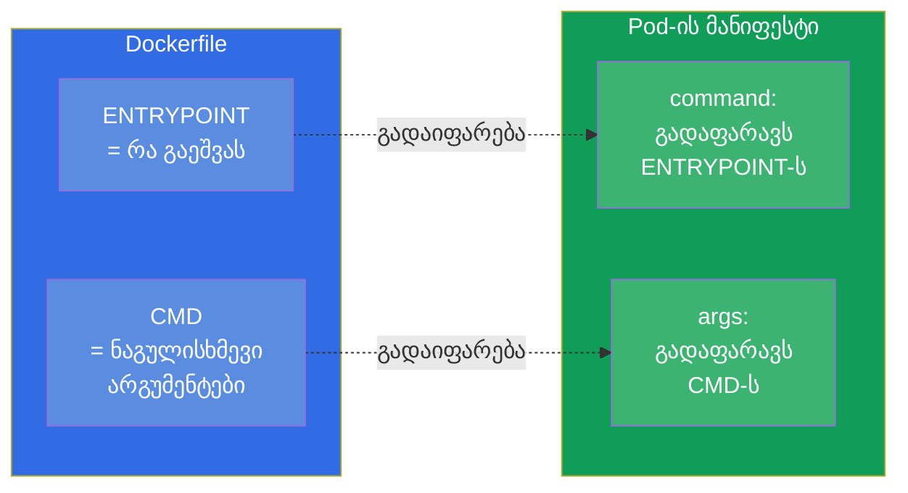
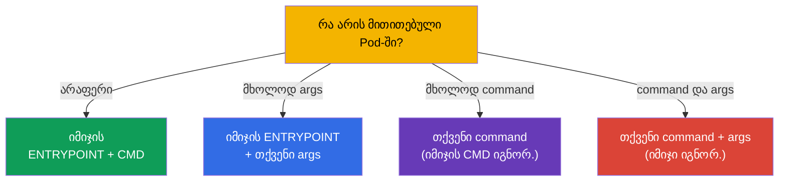
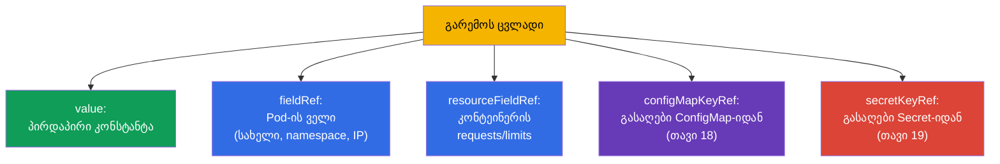

[Русская версия](ru.md) · [Eng version](README.md) · [Versión en español](es.md) · [Version française](fr.md) · [Deutsche Version](de.md) · [繁體中文版](tw.md) · [日本語版](jp.md)

# თავი 17. ბრძანებები, არგუმენტები და გარემოს ცვლადები

> **რა იქნება შემდეგ.** ვიწყებთ მესამე ნაწილს - აპლიკაციების კონფიგურაციას. სანამ კონფიგებს
> ConfigMap-სა და Secret-ში გავიტანთ (თავები 18-19), საბაზისო რამ უნდა გავიგოთ: როგორ დავუსახოთ
> კონტეინერს გაშვების ბრძანება, არგუმენტები და გარემოს ცვლადები. ეს არის დომენი Environment/Config
> (CKAD, 25%) და Workloads (CKA). თემა მარტივად გამოიყურება, მაგრამ `command`/`args` Kubernetes-ში
> და `ENTRYPOINT`/`CMD` Docker-ში მუდმივად ერევა - და ეს ქულებად და გატეხილ Pods-ად ჯდება.

## 17.1. ENTRYPOINT/CMD Docker-ში და მათი ასახვა Kubernetes-ში

როცა იმიჯს Docker-ში აწყობენ, მასში სვამენ, რა უნდა გაეშვას: `ENTRYPOINT` (თავად
გამშვები პროგრამა) და `CMD` (ნაგულისხმევი არგუმენტები). Kubernetes მათ თავისი
ველებით გადაფარავს:



დაიმახსოვრეთ შესაბამისობა - მისი კითხვა უყვართ:

| Docker | Kubernetes | როლი |
|--------|-----------|------|
| `ENTRYPOINT` | `command` | გამშვები პროგრამა |
| `CMD` | `args` | არგუმენტები მისთვის |

## 17.2. command და args Pod-ში

```yaml
spec:
  containers:
  - name: app
    image: busybox
    command: ["sleep"]       # გადაფარავს ENTRYPOINT-ს
    args: ["3600"]           # გადაფარავს CMD-ს
```

გადაფარვის წესები (სწორედ ესაა ხშირი ხაფანგი):

- მითითებულია მხოლოდ `args` - აიღება იმიჯის `ENTRYPOINT` + თქვენი `args`;
- მითითებულია მხოლოდ `command` - აიღება თქვენი `command`, იმიჯის `CMD` იგნორირდება;
- მითითებულია ორივე - გამოიყენება ორივე, იმიჯი სრულად იგნორირდება;
- არაფერი არ არის მითითებული - მუშაობს იმიჯის `ENTRYPOINT` და `CMD`.



იმპერატიულად ბრძანებას `--command -- ...`-ით სვამენ:

```bash
kubectl run busy --image=busybox --command -- sleep 3600
# ყველაფერი -- ის შემდეგ ხდება command
```

## 17.3. ჩაწერის ორი ფორმა: exec და shell

ბრძანება ორი ხერხით შეიძლება ჩაიწეროს და განსხვავება არსებითია.

- **Exec-ფორმა** (სტრიქონების სია) - ეშვება პირდაპირ, გარსის გარეშე. Kubernetes-ში სწორედ ასეა
  სწორი: სიგნალები (SIGTERM) აღწევს პროცესამდე, PID 1 - თქვენი აპლიკაციაა.

```yaml
command: ["sh", "-c", "echo hello"]
args: ["--port", "8080"]
```

- **Shell-ფორმა** (ერთი სტრიქონი) - Docker-ში ეშვება `/bin/sh -c`-ის საშუალებით. Kubernetes-ში
  ცვლადების ინტერპოლაციისთვის ან პაიპებისთვის იყენებენ ცხად `sh -c`-ს:

```yaml
command: ["sh", "-c", "echo $HOSTNAME && sleep 3600"]
```

> **რატომ არის ეს მნიშვნელოვანი.** თუ საჭიროა გარემოს ცვლადების ჩანასმა, პაიპები ან რამდენიმე
> ბრძანება - შეახვიეთ `sh -c "..."`-ში. გარსის გარეშე `$VAR` არ გაიხსნება, ხოლო `|` არ
> იმუშავებს - ეს არის ხშირი მიზეზი იმისა, რომ „ბრძანება მოსალოდნელივით არ მუშაობს“.

## 17.4. გარემოს ცვლადები: env

კონტეინერში კონფიგის გადაცემის ყველაზე მარტივი ხერხი - გარემოს ცვლადები `env`-ის საშუალებით:

```yaml
spec:
  containers:
  - name: app
    image: nginx
    env:
    - name: COLOR
      value: "blue"
    - name: GREETING
      value: "hello world"
```

```bash
# იმპერატიულად შექმნის დროს
kubectl run web --image=nginx --env="COLOR=blue" --env="MODE=prod"
```

მარტივი წყვილები `name/value` სტატიკური მნიშვნელობებისთვის გამოდგება. მაგრამ ხშირად საჭიროა
მნიშვნელობის **დინამიკურად** აღება - თავად Pod-ის ველებიდან, რესურსებიდან ან ConfigMap/Secret-იდან.
ამისთვის არსებობს `valueFrom`.

## 17.5. valueFrom: ცვლადების დინამიკური წყაროები

`valueFrom` საშუალებას იძლევა ცვლადი შეივსოს არა კონსტანტით, არამედ წყაროდან.



**Downward API** - მექანიზმი, რომელიც Pod-ს თავის შესახებ ინფორმაციას აწვდის (`fieldRef`,
`resourceFieldRef`):

```yaml
    env:
    - name: MY_POD_NAME
      valueFrom:
        fieldRef:
          fieldPath: metadata.name
    - name: MY_POD_IP
      valueFrom:
        fieldRef:
          fieldPath: status.podIP
    - name: MY_NODE_NAME
      valueFrom:
        fieldRef:
          fieldPath: spec.nodeName
    - name: MY_CPU_LIMIT
      valueFrom:
        resourceFieldRef:
          containerName: app
          resource: limits.cpu
```

ასე იგებს აპლიკაცია თავის სახელს, IP-ს, Node-ს, ლიმიტებს - ჰარდკოდის გარეშე. `configMapKeyRef`-სა და
`secretKeyRef`-ს (მნიშვნელობის აღება ConfigMap/Secret-იდან) შემდეგ თავებში გავარჩევთ.

> **მნიშვნელოვანია: რას დაინახავს Pod, თუ ConfigMap/Secret შეიცვლება?** გარემოს ცვლადები
> (`configMapKeyRef`, `secretKeyRef`, `envFrom`) ჩაისმება **ერთხელ - კონტეინერის
> გაშვების მომენტში**. თუ შემდეგ ConfigMap-ს ან Secret-ს შევცვლით, უკვე გაშვებული Pod
> **გააგრძელებს ძველი მნიშვნელობის ხედვას**: env-ცვლადები უკუსვლით არ განახლდება.
> ახლის ასაღებად Pod ხელახლა უნდა შეიქმნას - მაგალითად,
> `kubectl rollout restart deployment/<name>`. ეს ხშირი ხაფანგია: „ConfigMap გავასწორე, აპლიკაცია
> კი მაინც ძველი მნიშვნელობითაა“.
>
> სხვაგვარად იქცევა ConfigMap/Secret-ის **მიმაგრება** ტომად (თავი 18): იქ kubelet
> ობიექტის შეცვლისას პერიოდულად აახლებს ფაილებს კონტეინერში (დაახლოებით წუთის დაგვიანებით),
> და გადატვირთვა საჭირო არ არის - მაგრამ აპლიკაციამ **თავად უნდა წაიკითხოს ფაილი ხელახლა**.
> გამონაკლისია `subPath`-ით მიმაგრება: ასეთი ფაილები საერთოდ არ განახლდება. ესე იგი
> კონფიგურაციის „ცოცხალი“ განახლება რესტარტის გარეშე შესაძლებელია მხოლოდ ტომის საშუალებით (არა `subPath`) და
> იმ პირობით, რომ აპლიკაციას კონფიგის ხელახლა წაკითხვა შეუძლია.

## 17.6. გარემოს ცვლადები და გახსნის რიგი

ცვლადებს ერთმანეთზე მითითება შეიძლება `$(VAR)`-ის საშუალებით (არ აგერიოთ shell-ის `$VAR`-თან):

```yaml
    env:
    - name: HOST
      value: "db"
    - name: PORT
      value: "5432"
    - name: DSN
      value: "$(HOST):$(PORT)"     # → db:5432
```

Kubernetes `$(VAR)`-ს ხსნის იმ ცვლადებისთვის, რომლებიც სიაში **უფრო ადრეა** გამოცხადებული. მითითება
ჯერ არგამოცხადებულ ცვლადზე არ გაიხსნება. ბუკვალური `$(...)`-ის გამოსატანად ეკრანირებას
გაორმაგებით აკეთებენ: `$$(...)`.

## 17.7. შემოწმება: რა მოხვდა რეალურად კონტეინერში

კონფიგურაციის გამართვა ყოველთვის მიდის კითხვამდე „და რა არის სინამდვილეში შიგნით?“:

```bash
# ვნახოთ კონტეინერის გარემოს ცვლადები
kubectl exec <pod> -- env

# ვნახოთ, რომელი ბრძანებაა რეალურად მითითებული
kubectl get pod <pod> -o jsonpath='{.spec.containers[0].command}'
kubectl get pod <pod> -o jsonpath='{.spec.containers[0].args}'

# სრული აღწერა
kubectl describe pod <pod>
```

`kubectl exec <pod> -- env` - ყველაზე სწრაფი ხერხი დავრწმუნდეთ, რომ ცვლადები
(მათ შორის ConfigMap/Secret-იდან) მართლაც მივიდა კონტეინერამდე. საჩივრებზე „აპლიკაცია
კონფიგს ვერ ხედავს“ სწორედ აქედან იწყებენ.

## 17.8. როგორ იყენებენ ამას პროდაქშენში

- **Env - მცირე კონფიგურაციისთვის, ConfigMap/Secret - დანარჩენისთვის.** ორიოდე
  ცვლადი პირდაპირ მანიფესტში - ნორმალურია; მაგრამ ნამდვილ კონფიგურაციას (ბევრი პარამეტრი,
  რამდენიმე Pod-ისთვის საერთო, სენსიტიური მონაცემები) გაიტანენ ConfigMap-სა და Secret-ში (თავები
  18-19), ხოლო Pod-ში ითრევენ `valueFrom`-ის საშუალებით. კონფიგის ჰარდკოდი დეპლოის მანიფესტში - ცუდი
  პრაქტიკაა.
- **Downward API დაკვირვებადობისთვის.** აპლიკაციები Downward API-ის საშუალებით იღებენ თავის სახელს,
  Node-ს, namespace-ს - ეს მიდის ლოგებსა და მეტრიკებში ტრასირებისთვის: ლოგზე მაშინვე ჩანს, რომელმა
  Pod-მა და რომელ Node-ზე დააგენერირა ჩანაწერი.
- **12-ფაქტორიანი აპლიკაცია.** პრაქტიკა, კონფიგურაცია გარემოში (და არა კოდში) ინახებოდეს, -
  12-factor app მეთოდოლოგიის ნაწილია: ერთი და იგივე იმიჯი მუშაობს dev/stage/prod-ში, იცვლება
  მხოლოდ ცვლადები. ეს იმიჯებს გადატანადს ხდის.
- **exec-ფორმა და კორექტული დასრულება.** პროდში ბრძანებას exec-ფორმით წერენ, რომ
  SIGTERM აპლიკაციამდე მიდიოდეს და ის gracefully სრულდებოდეს გამოშვების/მასშტაბირების დროს.
  Shell-ფორმას `exec`-ის გარეშე შეუძლია სიგნალის „შეჭმა“ და Pod ტაიმაუტით ხისტად მოიკვლება.
- **არავითარი სეკრეტი env-ში პირდაპირ.** პაროლებსა და ტოკენებს `env`-ში მნიშვნელობად არ წერენ -
  მათ Secret-იდან იღებენ (თავი 19), თორემ ისინი გაედინება მანიფესტებში, git-სა და `kubectl describe`-ში.

## 17.9. მინი-ლექსიკონი

- **command** - გადაფარავს იმიჯის ENTRYPOINT-ს (რა გაეშვას).
- **args** - გადაფარავს იმიჯის CMD-ს (არგუმენტები).
- **ENTRYPOINT/CMD** - რა და რომელი არგუმენტებით გაეშვას, მითითებული იმიჯში.
- **exec-ფორმა** - ბრძანება სიით, გარსის გარეშე (სწორია სიგნალებისთვის).
- **shell-ფორმა** - ბრძანება `sh -c`-ის საშუალებით (საჭიროა ცვლადებისთვის, პაიპებისთვის).
- **env** - კონტეინერის გარემოს ცვლადები.
- **valueFrom** - ცვლადის შევსება წყაროდან (Pod-ის ველი, რესურსები, CM/Secret).
- **Downward API** - Pod-ის წვდომა თავის შესახებ ინფორმაციაზე (`fieldRef`, `resourceFieldRef`).
- **`$(VAR)`** - მითითება ადრე გამოცხადებულ ცვლადზე მანიფესტის შიგნით.

## 17.10. თავის შეჯამება

- Kubernetes იმიჯის ENTRYPOINT-ს გადაფარავს ველით `command`, ხოლო CMD-ს - ველით `args`.
- წესები: მხოლოდ args → ENTRYPOINT+args; მხოლოდ command → თქვენი command; ორივე → იმიჯი
  იგნორირდება; არაფერი → იმიჯი როგორც არის.
- exec-ფორმა (სია) ეშვება გარსის გარეშე და სიგნალებს სწორად აწვდის; ცვლადებისთვის/პაიპებისთვის
  საჭიროა ცხადი `sh -c` (shell-ფორმა).
- გარემოს ცვლადები სვამენ `env`-ით (name/value) ან `valueFrom`-ით (დინამიკურად).
- `valueFrom` მნიშვნელობებს იღებს Pod-ის ველებიდან/რესურსებიდან (Downward API) ან
  ConfigMap/Secret-იდან.
- `$(VAR)` ხსნის ადრე გამოცხადებულ ცვლადებს; `$$` ეკრანირებს.
- რეალური მდგომარეობის შემოწმება - `kubectl exec -- env` და jsonpath command/args-ზე.

## 17.11. როგორ გამოგადგებათ: გამოცდაზე და რეალურ სამუშაოში

**გამოცდაზე.** „დაუსახე კონტეინერს ბრძანება/არგუმენტები“, „დაამატე გარემოს ცვლადი“,
„გადაატარე Pod-ის/Node-ის სახელი Downward API-ის საშუალებით“ - ხშირი დავალებებია. კრიტიკულია არ აგერიოთ
`command`/`args` და ENTRYPOINT/CMD და შეძლოთ შედეგის შემოწმება `kubectl exec -- env`-ით.
ეს არის საფუძველი ConfigMap/Secret-ის დავალებებისთვის (თავები 18-19).

**რეალურ სამუშაოში.** კონფიგურაცია გარემოს საშუალებით - გადატანადი იმიჯების საფუძველია
(12-factor): ერთი იმიჯი ყველა გარემოსთვის. Downward API აპლიკაციას აძლევს კონტექსტს ლოგებისა და
მეტრიკებისთვის. ბრძანების სწორი exec-ფორმა უზრუნველყოფს კორექტულ დასრულებას გამოშვებების დროს.
ხოლო ჩვევა, სეკრეტები `env`-ში პირდაპირ არ ჩავდოთ, - უსაფრთხოების საკითხია.

## 17.12. თვითშემოწმების კითხვები

1. Kubernetes-ის რომელი ველები შეესაბამება იმიჯის ENTRYPOINT-სა და CMD-ს?
2. რა გაეშვება, თუ მხოლოდ `args` მიეთითება? ხოლო თუ მხოლოდ `command`? ხოლო ორივე?
3. რითი განსხვავდება ბრძანების exec-ფორმა shell-ფორმისგან და როდის არის საჭირო თითოეული?
4. როგორ გადავცეთ `valueFrom`-ის საშუალებით ცვლადში Pod-ის სახელი და მისი IP?
5. რა არის Downward API და რას აძლევს ის აპლიკაციას?
6. როგორ იხსნება მითითებები `$(VAR)` `env`-ის შიგნით და როგორ გამოვიტანოთ ბუკვალური `$(...)`?
7. როგორ შევამოწმოთ სწრაფად, რომელი ცვლადები მოხვდა რეალურად კონტეინერში?

## პრაქტიკა

ვისწავლეთ ბრძანების დასახვა და კონფიგის გადაცემა გარემოს საშუალებით. შემდეგ კონფიგურაციას
ცალკე ობიექტებში გავიტანთ: ConfigMap (თავი 18) ჩვეულებრივი მონაცემებისთვის და Secret
(თავი 19) სენსიტიურისთვის. ბრძანებები, არგუმენტები და ცვლადები მუშავდება კონფიგურაციის
ლაბებში.

🧪 ლაბი 105 (ბრძანებები, არგუმენტები, გარემოს ცვლადები): [tasks/cka/labs/105](../../labs/105/README_GE.MD)

🎮 Killercoda (ბრაუზერში, ინსტალაციის გარეშე): [Use ConfigMap as env vars](https://killercoda.com/chadmcrowell/course/ckad/configmap-envvars) · [Use Secret as env vars](https://killercoda.com/chadmcrowell/course/ckad/secret-envvars) · [Run busybox with sleep](https://killercoda.com/chadmcrowell/course/ckad/busybox-sleep)

---
[სარჩევი](../README_GE.md) · [თავი 16](../16/ge.md) · [თავი 18](../18/ge.md)
