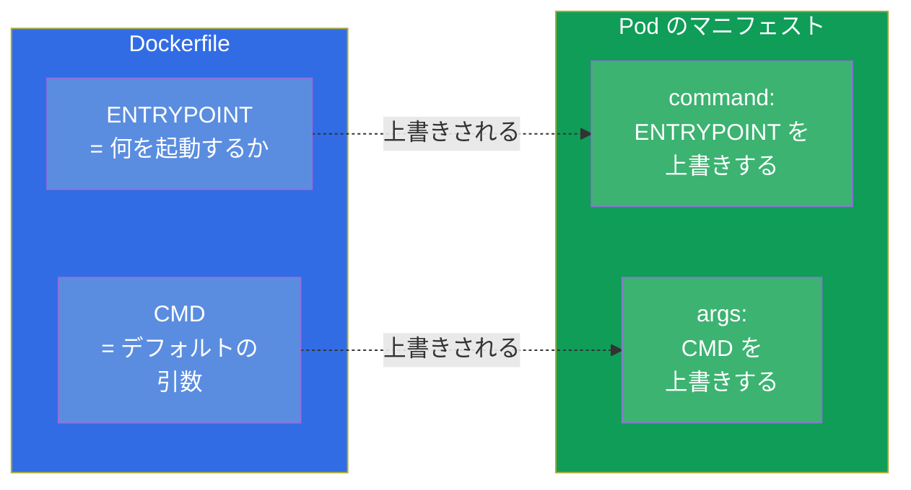
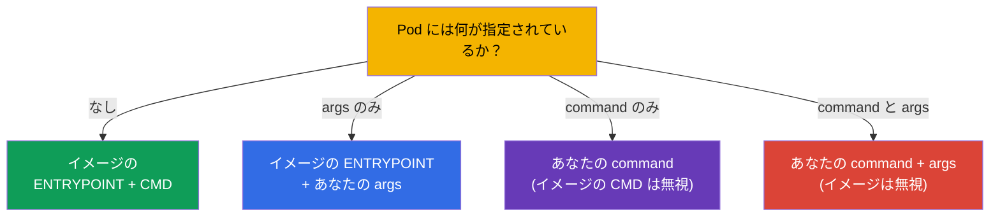
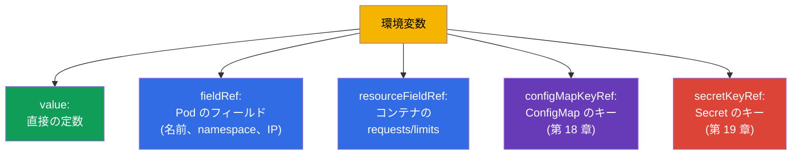

[Русская версия](ru.md) · [Eng version](README.md) · [Versión en español](es.md) · [Version française](fr.md) · [Deutsche Version](de.md) · [ქართული ვერსია](ge.md) · [繁體中文版](tw.md)

# 第 17 章。コマンド、引数、環境変数

> **次は何か。** ここからパート 3 - アプリケーションの設定に入ります。設定を
> ConfigMap と Secret に切り出す前に (第 18-19 章)、土台を理解しておく必要があります：
> コンテナに起動コマンド、引数、環境変数をどう与えるのか。これは Environment/Config
> (CKAD、25%) と Workloads (CKA) の領域です。テーマは単純に見えますが、Kubernetes の
> `command`/`args` と Docker の `ENTRYPOINT`/`CMD` は絶えず混同されます - そしてそれは
> 点数と壊れた Pod の代償を払わせます。

## 17.1. Docker の ENTRYPOINT/CMD と Kubernetes におけるその対応

Docker でイメージをビルドするとき、何を起動するのかをその中に指定します：`ENTRYPOINT`
(実行可能なプログラムそのもの) と `CMD` (デフォルトの引数) です。Kubernetes はそれらを
自分のフィールドで上書きします：



この対応は覚えてください - よく問われます：

| Docker | Kubernetes | 役割 |
|--------|-----------|------|
| `ENTRYPOINT` | `command` | 実行可能なプログラム |
| `CMD` | `args` | それに渡す引数 |

## 17.2. Pod における command と args

```yaml
spec:
  containers:
  - name: app
    image: busybox
    command: ["sleep"]       # ENTRYPOINT を上書きする
    args: ["3600"]           # CMD を上書きする
```

上書きのルール (これがまさによくある罠です)：

- `args` だけを指定した - イメージの `ENTRYPOINT` + あなたの `args` が使われます;
- `command` だけを指定した - あなたの `command` が使われ、イメージの `CMD` は無視されます;
- 両方を指定した - 両方が使われ、イメージのものは完全に無視されます;
- 何も指定しなかった - イメージの `ENTRYPOINT` と `CMD` が動きます。



命令的にコマンドを指定するには `--command -- ...` を使います：

```bash
kubectl run busy --image=busybox --command -- sleep 3600
# -- より後ろのすべてが command になる
```

## 17.3. 2 つの書き方：exec 形式と shell 形式

コマンドは 2 通りに書けますが、その違いは本質的です。

- **exec 形式** (文字列のリスト) - シェルを介さず直接起動されます。Kubernetes ではこれが
  正しい書き方です：シグナル (SIGTERM) がプロセスまで届き、PID 1 はあなたのアプリケーションです。

```yaml
command: ["sh", "-c", "echo hello"]
args: ["--port", "8080"]
```

- **shell 形式** (1 本の文字列) - Docker では `/bin/sh -c` を通して起動されます。
  Kubernetes では変数の展開やパイプのために明示的な `sh -c` を使います：

```yaml
command: ["sh", "-c", "echo $HOSTNAME && sleep 3600"]
```

> **なぜこれが重要か。** 環境変数の置換、パイプ、複数のコマンドが必要なら
> `sh -c "..."` で包みます。シェルがなければ `$VAR` は展開されず、`|` も
> 効きません - これが「コマンドが期待どおりに動かない」のよくある原因です。

## 17.4. 環境変数：env

コンテナに設定を渡すもっとも簡単な方法は、`env` による環境変数です：

```yaml
spec:
  containers:
  - name: app
    image: nginx
    env:
    - name: COLOR
      value: "blue"
    - name: GREETING
      value: "hello world"
```

```bash
# 作成時に命令的に
kubectl run web --image=nginx --env="COLOR=blue" --env="MODE=prod"
```

単純な `name/value` の組は静的な値に向いています。しかししばしば値を **動的に** -
Pod 自身のフィールドから、リソースから、あるいは ConfigMap/Secret から - 取る必要が
あります。そのために `valueFrom` があります。

## 17.5. valueFrom：変数の動的なソース

`valueFrom` を使うと、変数を定数ではなくソースから埋められます。



**Downward API** - Pod に自分自身についての情報を与える仕組みです (`fieldRef`、
`resourceFieldRef`)：

```yaml
    env:
    - name: MY_POD_NAME
      valueFrom:
        fieldRef:
          fieldPath: metadata.name
    - name: MY_POD_IP
      valueFrom:
        fieldRef:
          fieldPath: status.podIP
    - name: MY_NODE_NAME
      valueFrom:
        fieldRef:
          fieldPath: spec.nodeName
    - name: MY_CPU_LIMIT
      valueFrom:
        resourceFieldRef:
          containerName: app
          resource: limits.cpu
```

こうしてアプリケーションはハードコードなしに自分の名前、IP、ノード、limits を知ります。
`configMapKeyRef` と `secretKeyRef` (ConfigMap/Secret から値を取る) は次の章で扱います。

> **重要：ConfigMap/Secret を変更したら Pod には何が見えるのか。** 環境変数
> (`configMapKeyRef`、`secretKeyRef`、`envFrom`) が代入されるのは **一度だけ -
> コンテナの起動の瞬間** です。あとから ConfigMap や Secret を変更しても、すでに動いている
> Pod は **古い値を見続けます**：env 変数はさかのぼって更新されません。新しい値を
> 取り込むには Pod を作り直す必要があります - たとえば
> `kubectl rollout restart deployment/<name>` です。これはよくある罠です：
> 「ConfigMap を直したのに、アプリケーションは相変わらず古い値のままだ」。
>
> ConfigMap/Secret をボリュームとして **マウント** する場合はふるまいが違います (第 18 章)：
> そこでは kubelet がオブジェクトの変更時にコンテナ内のファイルを定期的に更新し
> (1 分程度の遅延あり)、再起動は不要です - ただしアプリケーションが **自分でファイルを
> 読み直す** 必要があります。例外は `subPath` によるマウントです：そのようなファイルは
> まったく更新されません。つまり再起動なしの「ライブな」設定更新が可能なのは、ボリューム
> 経由 (`subPath` でない) で、かつアプリケーションが設定を読み直せる場合だけです。

## 17.6. 環境変数と展開の順序

変数は `$(VAR)` を通して互いを参照できます (shell の `$VAR` と混同しないように)：

```yaml
    env:
    - name: HOST
      value: "db"
    - name: PORT
      value: "5432"
    - name: DSN
      value: "$(HOST):$(PORT)"     # → db:5432
```

Kubernetes は、リストの中で **より前に** 宣言された変数について `$(VAR)` を展開します。
まだ宣言されていない変数への参照は展開されません。文字どおりの `$(...)` を出力するには、
二重にしてエスケープします：`$$(...)`。

## 17.7. 確認：実際にコンテナへ入ったのは何か

設定のデバッグは常に「実際に中身はどうなっているのか？」に帰着します：

```bash
# コンテナの環境変数を見る
kubectl exec <pod> -- env

# 実際にどんなコマンドが指定されているかを見る
kubectl get pod <pod> -o jsonpath='{.spec.containers[0].command}'
kubectl get pod <pod> -o jsonpath='{.spec.containers[0].args}'

# 完全な説明
kubectl describe pod <pod>
```

`kubectl exec <pod> -- env` は、変数 (ConfigMap/Secret 由来のものも含む) が本当に
コンテナまで届いたことを確かめるもっとも速い方法です。「アプリケーションが設定を
見てくれない」という苦情には、まさにここから取りかかります。

## 17.8. 本番環境でこれをどう使うか

- **env は小さな設定に、ConfigMap/Secret はそれ以外に。** マニフェストに変数が 2、3 個
  直接書かれているのは普通です; しかし本物の設定 (パラメータが多い、複数の Pod で共通、
  機密データ) は ConfigMap と Secret に切り出し (第 18-19 章)、Pod へは `valueFrom` で
  引き込みます。デプロイのマニフェストに設定をハードコードするのは悪い習慣です。
- **可観測性のための Downward API。** アプリケーションは Downward API を通して自分の名前、
  ノード、namespace を受け取ります - それはトレースのためにログとメトリクスへ流れます：
  ログを見れば、どの Pod がどのノードでそのレコードを生成したのかがすぐに分かります。
- **12 ファクターアプリケーション。** 設定を (コードではなく) 環境に保持する習慣は
  12-factor app の方法論の一部です：同じ 1 つのイメージが dev/stage/prod で動き、変わるのは
  変数だけです。これがイメージを可搬にします。
- **exec 形式と正しい終了。** 本番ではコマンドを exec 形式で書きます。SIGTERM が
  アプリケーションまで届き、ロールアウトやスケーリングのときに gracefully 終了できるように
  するためです。`exec` のない shell 形式はシグナルを「食べて」しまうことがあり、Pod は
  タイムアウトで乱暴に kill されます。
- **秘密情報を env にそのまま置かない。** パスワードやトークンは `env` に値として書かず、
  Secret から取ります (第 19 章)。そうしないとマニフェスト、git、`kubectl describe` へ
  漏れ出します。

## 17.9. ミニ用語集

- **command** - イメージの ENTRYPOINT を上書きする (何を起動するか)。
- **args** - イメージの CMD を上書きする (引数)。
- **ENTRYPOINT/CMD** - イメージに指定された、何をどんな引数で起動するか。
- **exec 形式** - コマンドをリストで、シェルなしに (シグナルのために正しい書き方)。
- **shell 形式** - `sh -c` を通したコマンド (変数やパイプに必要)。
- **env** - コンテナの環境変数。
- **valueFrom** - 変数をソースから埋めること (Pod のフィールド、リソース、CM/Secret)。
- **Downward API** - Pod が自分自身についての情報にアクセスすること (`fieldRef`、`resourceFieldRef`)。
- **`$(VAR)`** - マニフェスト内で、より前に宣言された変数への参照。

## 17.10. 本章のまとめ

- Kubernetes はイメージの ENTRYPOINT を `command` フィールドで、CMD を `args` フィールドで
  上書きします。
- ルール：args のみ → ENTRYPOINT+args; command のみ → あなたの command; 両方 → イメージは
  無視される; 何もなし → イメージそのまま。
- exec 形式 (リスト) はシェルなしで起動し、シグナルを正しく届けます; 変数やパイプには
  明示的な `sh -c` (shell 形式) が必要です。
- 環境変数は `env` (name/value) または `valueFrom` (動的に) で指定します。
- `valueFrom` は Pod のフィールドやリソース (Downward API) から、あるいは
  ConfigMap/Secret から値を取ります。
- `$(VAR)` はより前に宣言された変数を展開します; `$$` はエスケープします。
- 実際の状態の確認は `kubectl exec -- env` と command/args への jsonpath です。

## 17.11. これがどう役に立つか：試験と実際の仕事で

**試験では。** 「コンテナにコマンド/引数を指定せよ」「環境変数を追加せよ」
「Downward API で Pod/ノードの名前を渡せ」はよく出る課題です。`command`/`args` を
ENTRYPOINT/CMD と混同せず、結果を `kubectl exec -- env` で確認できることが決定的に重要です。
これは ConfigMap/Secret の課題 (第 18-19 章) の土台になります。

**実際の仕事では。** 環境を通した設定は可搬なイメージの基礎です (12-factor)：
すべての環境に 1 つのイメージ。Downward API はアプリケーションにログとメトリクスのための
コンテキストを与えます。正しい exec 形式のコマンドは、ロールアウト時の正しい終了を
保証します。そして秘密情報を `env` に直接置かない習慣は、セキュリティの問題です。

## 17.12. 自己チェックの質問

1. イメージの ENTRYPOINT と CMD に対応する Kubernetes のフィールドはどれですか？
2. `args` だけを指定したら何が起動しますか？`command` だけなら？両方なら？
3. コマンドの exec 形式は shell 形式とどう違い、それぞれいつ必要ですか？
4. `valueFrom` を通して Pod の名前とその IP を変数に渡すにはどうしますか？
5. Downward API とは何で、アプリケーションに何を与えますか？
6. `env` の中で `$(VAR)` の参照はどのように展開され、文字どおりの `$(...)` はどう出力しますか？
7. どの変数が実際にコンテナへ入ったのかを素早く確認するにはどうしますか？

## 演習

コマンドの指定と、環境を通した設定の渡し方を学びました。次は設定を別のオブジェクトへ
切り出します：通常のデータには ConfigMap (第 18 章)、機密データには Secret (第 19 章) です。
コマンド、引数、変数は設定関連のラボで練習します。

🧪 ラボ 105 (コマンド、引数、環境変数): [tasks/cka/labs/105](../../labs/105/README_JP.MD)

---
[目次](../README_JP.md) · [第 16 章](../16/jp.md) · [第 18 章](../18/jp.md)
