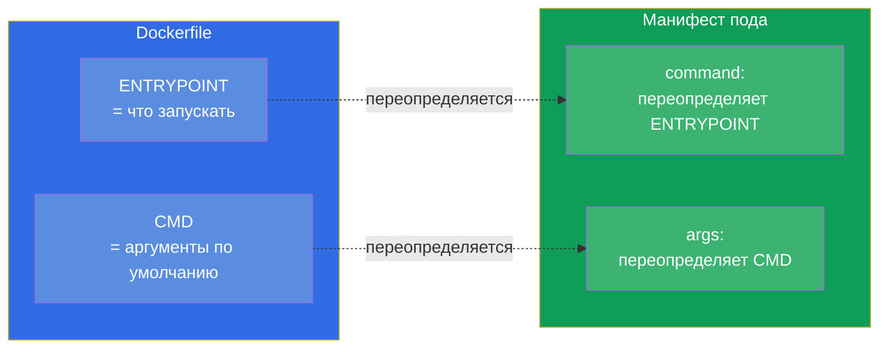
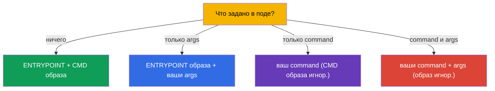
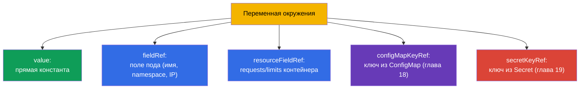

# Глава 17. Команды, аргументы и переменные окружения

> **Что дальше.** Начинаем часть 3 - конфигурацию приложений. Прежде чем выносить
> конфиги в ConfigMap и Secret (главы 18-19), нужно понять базу: как контейнеру задать
> команду запуска, аргументы и переменные окружения. Это домен Environment/Config
> (CKAD, 25%) и Workloads (CKA). Тема кажется простой, но `command`/`args` в Kubernetes
> и `ENTRYPOINT`/`CMD` в Docker путают постоянно - и это стоит баллов и сломанных подов.

## 17.1. ENTRYPOINT/CMD в Docker и их отражение в Kubernetes

Когда образ собирают в Docker, в нём задают, что запускать: `ENTRYPOINT` (сама
исполняемая программа) и `CMD` (аргументы по умолчанию). Kubernetes переопределяет их
своими полями:



Запомните соответствие - его любят спрашивать:

| Docker | Kubernetes | Роль |
|--------|-----------|------|
| `ENTRYPOINT` | `command` | исполняемая программа |
| `CMD` | `args` | аргументы к ней |

## 17.2. command и args в поде

```yaml
spec:
  containers:
  - name: app
    image: busybox
    command: ["sleep"]       # переопределяет ENTRYPOINT
    args: ["3600"]           # переопределяет CMD
```

Правила переопределения (это и есть частая ловушка):

- задан только `args` - берётся `ENTRYPOINT` образа + ваши `args`;
- задан только `command` - берётся ваш `command`, `CMD` образа игнорируется;
- заданы оба - используются оба, образ игнорируется полностью;
- ничего не задано - работают `ENTRYPOINT` и `CMD` из образа.



Императивно команду задают через `--command -- ...`:

```bash
kubectl run busy --image=busybox --command -- sleep 3600
# всё после -- становится command
```

## 17.3. Две формы записи: exec и shell

Команду можно записать двумя способами, и разница существенная.

- **Exec-форма** (список строк) - запускается напрямую, без оболочки. Так правильно в
  Kubernetes: сигналы (SIGTERM) доходят до процесса, PID 1 - ваше приложение.

```yaml
command: ["sh", "-c", "echo hello"]
args: ["--port", "8080"]
```

- **Shell-форма** (одна строка) - в Docker запускается через `/bin/sh -c`. В Kubernetes
  для интерполяции переменных или пайпов используют явный `sh -c`:

```yaml
command: ["sh", "-c", "echo $HOSTNAME && sleep 3600"]
```

> **Почему это важно.** Если нужны подстановка переменных окружения, пайпы или несколько
> команд - оборачивайте в `sh -c "..."`. Без оболочки `$VAR` не раскроется, а `|` не
> сработает - это частая причина «команда не отрабатывает как ожидалось».

## 17.4. Переменные окружения: env

Самый простой способ передать конфиг в контейнер - переменные окружения через `env`:

```yaml
spec:
  containers:
  - name: app
    image: nginx
    env:
    - name: COLOR
      value: "blue"
    - name: GREETING
      value: "hello world"
```

```bash
# Императивно при создании
kubectl run web --image=nginx --env="COLOR=blue" --env="MODE=prod"
```

Простые пары `name/value` подходят для статичных значений. Но часто нужно взять значение
**динамически** - из полей самого пода, из ресурсов или из ConfigMap/Secret. Для этого
есть `valueFrom`.

## 17.5. valueFrom: динамические источники переменных

`valueFrom` позволяет заполнить переменную не константой, а из источника.



**Downward API** - механизм, дающий поду информацию о самом себе (`fieldRef`,
`resourceFieldRef`):

```yaml
    env:
    - name: MY_POD_NAME
      valueFrom:
        fieldRef:
          fieldPath: metadata.name
    - name: MY_POD_IP
      valueFrom:
        fieldRef:
          fieldPath: status.podIP
    - name: MY_NODE_NAME
      valueFrom:
        fieldRef:
          fieldPath: spec.nodeName
    - name: MY_CPU_LIMIT
      valueFrom:
        resourceFieldRef:
          containerName: app
          resource: limits.cpu
```

Так приложение узнаёт своё имя, IP, ноду, лимиты - без хардкода. `configMapKeyRef` и
`secretKeyRef` (взять значение из ConfigMap/Secret) разберём в следующих главах.

## 17.6. Переменные окружения и порядок раскрытия

Переменные можно ссылаться друг на друга через `$(VAR)` (не путать с shell `$VAR`):

```yaml
    env:
    - name: HOST
      value: "db"
    - name: PORT
      value: "5432"
    - name: DSN
      value: "$(HOST):$(PORT)"     # → db:5432
```

Kubernetes раскрывает `$(VAR)` для переменных, объявленных **раньше** в списке. Ссылка на
ещё не объявленную переменную не раскроется. Чтобы вывести буквальный `$(...)`, экранируют
удвоением: `$$(...)`.

## 17.7. Проверка: что реально попало в контейнер

Отладка конфигурации всегда сводится к «а что на самом деле внутри?»:

```bash
# Посмотреть переменные окружения контейнера
kubectl exec <pod> -- env

# Посмотреть, какая команда реально задана
kubectl get pod <pod> -o jsonpath='{.spec.containers[0].command}'
kubectl get pod <pod> -o jsonpath='{.spec.containers[0].args}'

# Полное описание
kubectl describe pod <pod>
```

`kubectl exec <pod> -- env` - самый быстрый способ убедиться, что переменные
(в т.ч. из ConfigMap/Secret) действительно доехали до контейнера. При жалобах «приложение
не видит конфиг» начинают именно с этого.

## 17.8. Как это применяют в продакшене

- **Env - для небольшой конфигурации, ConfigMap/Secret - для остального.** Пара
  переменных прямо в манифесте - нормально; но настоящую конфигурацию (много параметров,
  общие для нескольких подов, чувствительные данные) выносят в ConfigMap и Secret (главы
  18-19), а в под тянут через `valueFrom`. Хардкодить конфиг в манифесте деплоя - плохая
  практика.
- **Downward API для наблюдаемости.** Приложения через Downward API получают своё имя,
  ноду, namespace - это идёт в логи и метрики для трассировки: по логу сразу видно, какой
  под и на какой ноде сгенерировал запись.
- **12-факторное приложение.** Практика хранить конфигурацию в окружении (а не в коде) -
  часть методологии 12-factor app: один и тот же образ работает в dev/stage/prod, меняются
  только переменные. Это делает образы переносимыми.
- **exec-форма и корректное завершение.** В проде команду пишут exec-формой, чтобы
  SIGTERM доходил до приложения и оно завершалось gracefully при выкате/масштабировании.
  Shell-форма без `exec` может «съесть» сигнал, и под будет убиваться жёстко по таймауту.
- **Никаких секретов в env как есть.** Пароли и токены не пишут значением в `env` -
  их берут из Secret (глава 19), иначе они утекают в манифесты, git и `kubectl describe`.

## 17.9. Мини-глоссарий

- **command** - переопределяет ENTRYPOINT образа (что запускать).
- **args** - переопределяет CMD образа (аргументы).
- **ENTRYPOINT/CMD** - что и с какими аргументами запускать, заданное в образе.
- **exec-форма** - команда списком, без оболочки (правильно для сигналов).
- **shell-форма** - команда через `sh -c` (нужна для переменных, пайпов).
- **env** - переменные окружения контейнера.
- **valueFrom** - заполнение переменной из источника (поле пода, ресурсы, CM/Secret).
- **Downward API** - доступ пода к информации о себе (`fieldRef`, `resourceFieldRef`).
- **`$(VAR)`** - ссылка на ранее объявленную переменную внутри манифеста.

## 17.10. Итоги главы

- Kubernetes переопределяет ENTRYPOINT образа полем `command`, а CMD - полем `args`.
- Правила: только args → ENTRYPOINT+args; только command → ваш command; оба → образ
  игнорируется; ничего → образ как есть.
- exec-форма (список) запускает без оболочки и правильно доставляет сигналы; для
  переменных/пайпов нужен явный `sh -c` (shell-форма).
- Переменные окружения задаются через `env` (name/value) или `valueFrom` (динамически).
- `valueFrom` берёт значения из полей пода/ресурсов (Downward API) или из
  ConfigMap/Secret.
- `$(VAR)` раскрывает ранее объявленные переменные; `$$` экранирует.
- Проверка реального состояния - `kubectl exec -- env` и jsonpath по command/args.

## 17.11. Как это пригодится: на экзамене и в реальной работе

**На экзамене.** «Задай команду/аргументы контейнеру», «добавь переменную окружения»,
«пробрось имя пода/ноды через Downward API» - частые задания. Критично не путать
`command`/`args` с ENTRYPOINT/CMD и уметь проверить результат через `kubectl exec -- env`.
Это фундамент для заданий с ConfigMap/Secret (главы 18-19).

**В реальной работе.** Конфигурация через окружение - основа переносимых образов
(12-factor): один образ на все среды. Downward API даёт приложению контекст для логов и
метрик. Правильная exec-форма команды обеспечивает корректное завершение при выкатах.
А привычка не класть секреты в `env` напрямую - вопрос безопасности.

## 17.12. Вопросы для самопроверки

1. Какие поля Kubernetes соответствуют ENTRYPOINT и CMD образа?
2. Что запустится, если задать только `args`? А если только `command`? А оба?
3. Чем exec-форма команды отличается от shell-формы и когда нужна каждая?
4. Как через `valueFrom` передать в переменную имя пода и его IP?
5. Что такое Downward API и что он даёт приложению?
6. Как раскрываются ссылки `$(VAR)` внутри `env` и как вывести буквальный `$(...)`?
7. Как быстро проверить, какие переменные реально попали в контейнер?

## Практика

Мы научились задавать команду и передавать конфиг через окружение. Дальше вынесем
конфигурацию в отдельные объекты: ConfigMap (глава 18) для обычных данных и Secret
(глава 19) для чувствительных. Команды, аргументы и переменные отрабатываются в лабах по
конфигурации.

🧪 Лаба 01: [tasks/cka/labs/01](../../labs/01/README_RU.MD)

---
[Оглавление](../README_RU.md) · [Глава 16](../16/ru.md) · [Глава 18](../18/ru.md)
