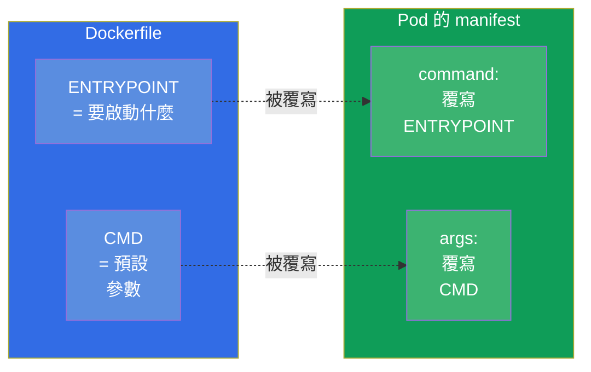
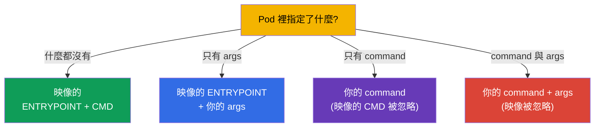
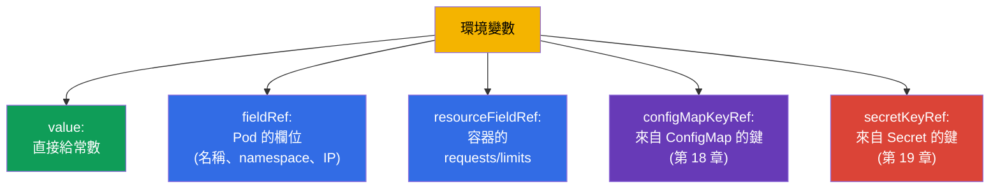

[Русская версия](ru.md) · [Eng version](README.md) · [Versión en español](es.md) · [Version française](fr.md) · [Deutsche Version](de.md) · [ქართული ვერსია](ge.md) · [日本語版](jp.md)

# 第 17 章。指令、參數與環境變數

> **接下來是什麼。** 我們開始第 3 部分 - 應用程式的設定。在把設定搬進
> ConfigMap 與 Secret(第 18-19 章)之前,得先弄懂基礎:如何為容器指定啟動
> 指令、參數與環境變數。這是 Environment/Config 領域(CKAD,25%)與
> Workloads(CKA)。這個主題看起來簡單,但 Kubernetes 的 `command`/`args`
> 與 Docker 的 `ENTRYPOINT`/`CMD` 老是被搞混 - 而這會讓你丟分,也會弄壞 Pod。

## 17.1. Docker 中的 ENTRYPOINT/CMD 以及它們在 Kubernetes 中的對應

在 Docker 中建置映像時,會在裡面指定要啟動什麼:`ENTRYPOINT`(可執行的
程式本身)與 `CMD`(預設參數)。Kubernetes 會用自己的欄位覆寫它們:



把這個對應記下來 - 考試很愛問:

| Docker | Kubernetes | 角色 |
|--------|-----------|------|
| `ENTRYPOINT` | `command` | 可執行的程式 |
| `CMD` | `args` | 給它的參數 |

## 17.2. Pod 中的 command 與 args

```yaml
spec:
  containers:
  - name: app
    image: busybox
    command: ["sleep"]       # 覆寫 ENTRYPOINT
    args: ["3600"]           # 覆寫 CMD
```

覆寫規則(這正是常見的陷阱):

- 只指定 `args` - 用映像的 `ENTRYPOINT` + 你的 `args`;
- 只指定 `command` - 用你的 `command`,映像的 `CMD` 被忽略;
- 兩者都指定 - 兩者都用,映像的設定完全被忽略;
- 什麼都不指定 - 用映像裡的 `ENTRYPOINT` 與 `CMD`。



指令式的寫法是透過 `--command -- ...` 指定指令:

```bash
kubectl run busy --image=busybox --command -- sleep 3600
# -- 之後的一切都會變成 command
```

## 17.3. 兩種寫法:exec 與 shell

指令可以用兩種方式寫,而兩者的差別很重要。

- **Exec 形式**(字串清單)- 直接啟動,不經過 shell。在 Kubernetes 中這才是
  正確做法:訊號(SIGTERM)會傳到行程,而 PID 1 就是你的應用程式。

```yaml
command: ["sh", "-c", "echo hello"]
args: ["--port", "8080"]
```

- **Shell 形式**(單一字串)- 在 Docker 中會透過 `/bin/sh -c` 啟動。在
  Kubernetes 中,若要做變數插值或使用管線,會明確寫出 `sh -c`:

```yaml
command: ["sh", "-c", "echo $HOSTNAME && sleep 3600"]
```

> **為什麼這很重要。** 如果需要環境變數替換、管線或多個指令 - 就把它們包進
> `sh -c "..."`。沒有 shell 的話,`$VAR` 不會展開,`|` 也不會生效 - 這是
> 「指令沒有按預期執行」的常見原因。

## 17.4. 環境變數:env

把設定傳進容器最簡單的方式,就是透過 `env` 傳環境變數:

```yaml
spec:
  containers:
  - name: app
    image: nginx
    env:
    - name: COLOR
      value: "blue"
    - name: GREETING
      value: "hello world"
```

```bash
# 建立時用指令式做法
kubectl run web --image=nginx --env="COLOR=blue" --env="MODE=prod"
```

單純的 `name/value` 配對適合靜態值。但常常需要 **動態地** 取值 - 從 Pod
自己的欄位、從資源設定,或從 ConfigMap/Secret。這時就要用 `valueFrom`。

## 17.5. valueFrom:變數的動態來源

`valueFrom` 讓你不用常數,而是從某個來源填入變數的值。



**Downward API** - 讓 Pod 取得關於自己資訊的機制(`fieldRef`、
`resourceFieldRef`):

```yaml
    env:
    - name: MY_POD_NAME
      valueFrom:
        fieldRef:
          fieldPath: metadata.name
    - name: MY_POD_IP
      valueFrom:
        fieldRef:
          fieldPath: status.podIP
    - name: MY_NODE_NAME
      valueFrom:
        fieldRef:
          fieldPath: spec.nodeName
    - name: MY_CPU_LIMIT
      valueFrom:
        resourceFieldRef:
          containerName: app
          resource: limits.cpu
```

應用程式就這樣知道自己的名稱、IP、所在節點與 limits - 不必寫死在程式裡。
`configMapKeyRef` 與 `secretKeyRef`(從 ConfigMap/Secret 取值)會在接下來
幾章拆解。

> **重要:如果改了 ConfigMap/Secret,Pod 會看到什麼?** 環境變數
> (`configMapKeyRef`、`secretKeyRef`、`envFrom`)只會 **在容器啟動的那一刻
> 代入一次**。之後若修改 ConfigMap 或 Secret,已經在跑的 Pod **會繼續看到舊
> 值**:env 變數不會事後更新。要讓新值生效,必須重新建立 Pod - 例如
> `kubectl rollout restart deployment/<name>`。這是常見的陷阱:「我改了
> ConfigMap,但應用程式還是用舊值」。
>
> 把 ConfigMap/Secret 當成卷來 **掛載**(第 18 章)則不一樣:當物件改變時,
> kubelet 會週期性地更新容器裡的檔案(延遲大約一分鐘),不需要重啟 - 但
> 應用程式必須 **自己重新讀取檔案**。例外是用 `subPath` 掛載:這樣的檔案
> 根本不會被更新。也就是說,不重啟就「即時」更新設定,只有透過卷
> (不用 `subPath`)才可能,而且前提是應用程式會重新讀取設定檔。

## 17.6. 環境變數與展開順序

變數之間可以透過 `$(VAR)` 互相引用(不要跟 shell 的 `$VAR` 搞混):

```yaml
    env:
    - name: HOST
      value: "db"
    - name: PORT
      value: "5432"
    - name: DSN
      value: "$(HOST):$(PORT)"     # → db:5432
```

Kubernetes 只會為清單中 **更早** 宣告的變數展開 `$(VAR)`。引用尚未宣告的
變數不會被展開。若要輸出字面上的 `$(...)`,就用重複來轉義:`$$(...)`。

## 17.7. 檢查:實際進到容器裡的是什麼

設定的排查總是回到「裡面實際上到底是什麼?」:

```bash
# 看容器的環境變數
kubectl exec <pod> -- env

# 看實際指定了什麼指令
kubectl get pod <pod> -o jsonpath='{.spec.containers[0].command}'
kubectl get pod <pod> -o jsonpath='{.spec.containers[0].args}'

# 完整描述
kubectl describe pod <pod>
```

`kubectl exec <pod> -- env` 是確認變數(包含來自 ConfigMap/Secret 的)真的
送到容器裡最快的方式。當有人抱怨「應用程式看不到設定」時,就從這裡開始。

## 17.8. 這在生產環境中如何應用

- **Env 用於少量設定,ConfigMap/Secret 用於其他一切。** 幾個變數直接寫在
  manifest 裡沒問題;但真正的設定(參數很多、多個 Pod 共用、敏感資料)會
  搬到 ConfigMap 與 Secret(第 18-19 章),再用 `valueFrom` 拉進 Pod。把
  設定寫死在 deployment 的 manifest 裡是不好的做法。
- **用 Downward API 做可觀測性。** 應用程式透過 Downward API 取得自己的
  名稱、節點、namespace - 這些會進到日誌與指標裡用於追蹤:看日誌就能立刻
  知道是哪個 Pod、在哪個節點上產生的紀錄。
- **12-factor 應用程式。** 把設定放在環境裡(而不是程式碼裡)這個做法,是
  12-factor app 方法論的一部分:同一個映像在 dev/stage/prod 都能跑,只有
  變數不同。這讓映像具備可攜性。
- **exec 形式與正確的終止。** 生產環境會用 exec 形式寫指令,好讓 SIGTERM
  傳到應用程式,使它在發布/擴縮時能優雅結束。沒有 `exec` 的 shell 形式可能
  會「吃掉」訊號,Pod 就會在逾時後被硬殺。
- **絕不把祕密原樣放在 env 裡。** 密碼與 token 不會以值的形式寫在 `env` 裡 -
  而是從 Secret 取得(第 19 章),否則它們會外洩到 manifest、git 與
  `kubectl describe` 中。

## 17.9. 迷你詞彙表

- **command** - 覆寫映像的 ENTRYPOINT(要啟動什麼)。
- **args** - 覆寫映像的 CMD(參數)。
- **ENTRYPOINT/CMD** - 在映像中指定的:啟動什麼、帶什麼參數。
- **exec 形式** - 用清單寫的指令,不經過 shell(對訊號而言是正確做法)。
- **shell 形式** - 透過 `sh -c` 執行的指令(變數、管線時需要)。
- **env** - 容器的環境變數。
- **valueFrom** - 從來源填入變數的值(Pod 欄位、資源、CM/Secret)。
- **Downward API** - Pod 取得關於自己資訊的途徑(`fieldRef`、`resourceFieldRef`)。
- **`$(VAR)`** - 在 manifest 內引用先前宣告的變數。

## 17.10. 本章總結

- Kubernetes 用 `command` 欄位覆寫映像的 ENTRYPOINT,用 `args` 欄位覆寫 CMD。
- 規則:只有 args → ENTRYPOINT+args;只有 command → 你的 command;兩者都有 →
  映像被忽略;什麼都沒有 → 映像原樣執行。
- exec 形式(清單)不經過 shell 啟動,並且能正確傳遞訊號;要用變數/管線就
  需要明確的 `sh -c`(shell 形式)。
- 環境變數透過 `env`(name/value)或 `valueFrom`(動態)指定。
- `valueFrom` 從 Pod 欄位/資源(Downward API)或從 ConfigMap/Secret 取值。
- `$(VAR)` 會展開先前宣告的變數;`$$` 用來轉義。
- 檢查實際狀態的方式 - `kubectl exec -- env` 以及用 jsonpath 看 command/args。

## 17.11. 這些知識用在哪裡:考試與實際工作

**在考試中。** 「為容器指定指令/參數」、「加一個環境變數」、「用 Downward API
把 Pod/節點名稱傳進去」都是常見題目。關鍵是不要把 `command`/`args` 跟
ENTRYPOINT/CMD 搞混,並且會用 `kubectl exec -- env` 檢查結果。這是 ConfigMap/
Secret 題目(第 18-19 章)的基礎。

**在實際工作中。** 透過環境做設定是可攜映像的基礎(12-factor):一個映像用在
所有環境。Downward API 給應用程式提供日誌與指標所需的上下文。正確的 exec
形式指令能保證發布時正確終止。而不把祕密直接放進 `env` 的習慣,則是安全問題。

## 17.12. 自我檢查問題

1. Kubernetes 的哪些欄位對應映像的 ENTRYPOINT 與 CMD?
2. 只指定 `args` 會啟動什麼?只指定 `command` 呢?兩者都指定呢?
3. exec 形式的指令與 shell 形式有什麼不同,各自什麼時候需要?
4. 如何透過 `valueFrom` 把 Pod 的名稱與 IP 傳進變數?
5. 什麼是 Downward API,它給應用程式帶來什麼?
6. `env` 裡的 `$(VAR)` 引用是怎麼展開的,要怎麼輸出字面上的 `$(...)`?
7. 如何快速檢查實際進到容器裡的是哪些變數?

## 實踐

我們學會了指定指令,以及透過環境傳遞設定。接下來會把設定搬到獨立的物件裡:
一般資料用 ConfigMap(第 18 章),敏感資料用 Secret(第 19 章)。指令、參數與
變數會在設定相關的實驗中操練。

🧪 實驗 105(指令、參數、環境變數):[tasks/cka/labs/105](../../labs/105/README_TW.MD)

---
[目錄](../README_TW.md) · [第 16 章](../16/tw.md) · [第 18 章](../18/tw.md)
