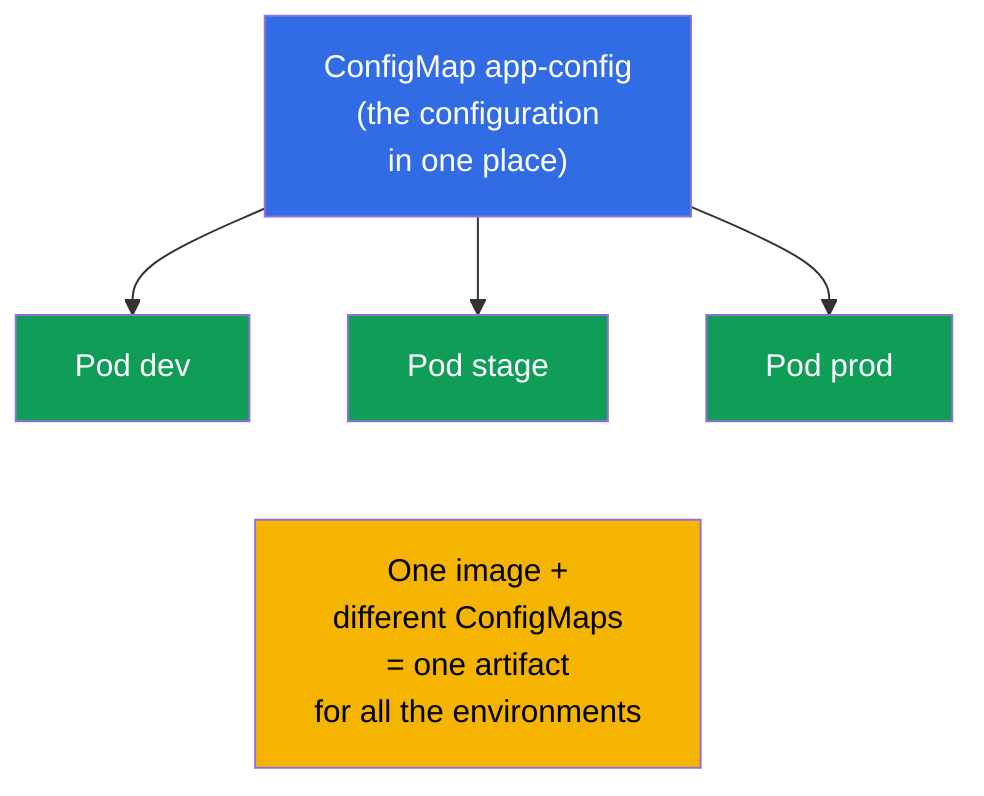
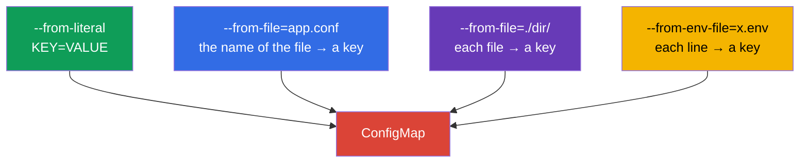
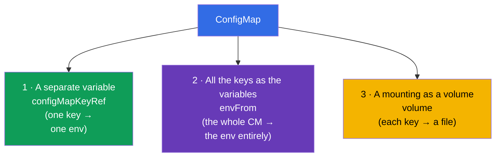
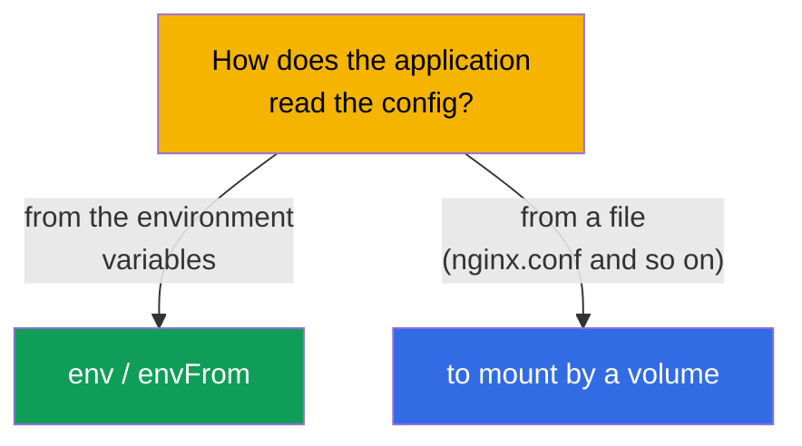
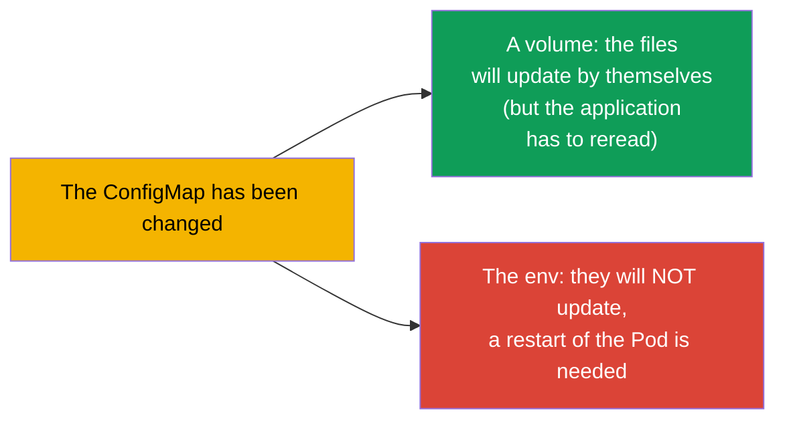

[Русская версия](ru.md) · [Versión en español](es.md) · [Version française](fr.md) · [Deutsche Version](de.md) · [ქართული ვერსია](ge.md) · [繁體中文版](tw.md) · [日本語版](jp.md)

# Chapter 18. ConfigMap

> **What comes next.** In the previous chapter we set the config directly in the manifest of a Pod. This scales
> badly: the configuration is duplicated, is sewn into the deployment, it cannot be reused.
> A **ConfigMap** takes the configuration out into a separate object: one ConfigMap - many Pods,
> the config is separated from the image and from the deployment. This is the core of the domain Environment/Config (CKAD, 25%) and
> the topic Workloads (CKA). We will take apart how to create a ConfigMap and by three ways to connect
> it to the Pods.

## 18.1. Why to separate the configuration

The principle of the 12-factor app (the chapter 17): **the configuration is separated from the code**. The image of an application
has to be one and the same for all the environments, and the differences (the addresses, the parameters, the flags) - have to come
from the outside. A ConfigMap is a storage of such a **non-secret** configuration in the cluster.



It is important at once: a ConfigMap is for the **non-secret** data. The passwords, the tokens, the keys - this is a Secret
(the chapter 19). A ConfigMap stores the data in the plain text.

## 18.2. What a ConfigMap is

A ConfigMap is an object with a set of the pairs key-value (or of the whole files). The values are
the configuration data: the separate parameters or the content of the config files entirely.

```yaml
apiVersion: v1
kind: ConfigMap
metadata:
  name: app-config
data:
  COLOR: "blue"                      # a simple key-value
  MAX_CONNECTIONS: "100"
  app.properties: |                  # a whole file as a value
    server.port=8080
    log.level=INFO
```

The two types of the fields: the `data` (the text data) and the `binaryData` (the binary one, in base64). Usually
one works with the `data`.

## 18.3. The creation of a ConfigMap

The three ways to create, all of them are met on the exam:

```bash
# 1. From the literals (the separate pairs)
kubectl create configmap app-config \
  --from-literal=COLOR=blue \
  --from-literal=MAX_CONNECTIONS=100

# 2. From a file (the name of the file → the key, the content → the value)
kubectl create configmap app-config --from-file=app.properties

# 3. From a whole directory (each file → its own key)
kubectl create configmap app-config --from-file=./config-dir/

# 4. From an env file (each line KEY=VALUE → a separate key)
kubectl create configmap app-config --from-env-file=config.env
```



The difference between the `--from-file` and the `--from-env-file` is important: the `--from-file=config.env` will create **one**
key `config.env` with the whole content of the file, while the `--from-env-file=config.env` will parse the file
line by line into the **separate** keys.

## 18.4. The three ways to connect a ConfigMap to a Pod

This is the key topic of the chapter. The data from a ConfigMap gets into a Pod by three ways.



**The way 1. A separate key → a separate variable** (`configMapKeyRef`):

```yaml
    env:
    - name: APP_COLOR
      valueFrom:
        configMapKeyRef:
          name: app-config
          key: COLOR
```

**The way 2. The whole ConfigMap → the environment variables** (`envFrom`):

```yaml
    envFrom:
    - configMapRef:
        name: app-config
    # each key of the ConfigMap will become an environment variable
```

**The way 3. A ConfigMap → the files (a volume)**:

```yaml
spec:
  containers:
  - name: app
    image: nginx
    volumeMounts:
    - name: config
      mountPath: /etc/config       # here the files by the keys will appear
  volumes:
  - name: config
    configMap:
      name: app-config
```

Upon a mounting by a volume each key of the ConfigMap becomes a **file** in the `/etc/config`
(the `COLOR`, the `app.properties` and so on), and the value - the content of the file.

## 18.5. The env against a volume: when which one

| The way | What we get | When to use |
|--------|--------------|--------------------|
| `configMapKeyRef` (env) | one variable from a key | a couple of the values into the environment are needed |
| `envFrom` (env) | all the keys as the variables | the whole config - into the environment |
| a volume | the keys as the files | the application reads a config file (nginx.conf, application.yaml) |

The rule: if the application reads a **config file**, mount the ConfigMap by a volume. If it is
configured by the **environment variables** - use the env/envFrom.



## 18.6. The update of a ConfigMap and its picking up

An important subtlety about the updates:

- The ConfigMaps **mounted by a volume** are updated in a Pod automatically (after a certain
  time after a change of the ConfigMap the files in the volume will change). But the application has to be able
  to **reread** the file - Kubernetes itself does not restart the process.
- The **environment variables** from a ConfigMap **are not updated** on the fly - they are fixed upon
  the start of the container. In order to pick up a new value, the Pod has to be recreated (to restart
  the Deployment).



Hence a frequent trick: in order to apply a new config for sure, one does
`kubectl rollout restart deployment`. In the production for an env config this is the only way
to pick up the changes.

## 18.7. An immutable ConfigMap

One can make a ConfigMap unchangeable (`immutable: true`). Then it cannot be changed - only
to delete it and to create it anew. This protects from the accidental edits and **reduces the load** on the
cluster (the kubelet does not watch the changes of the immutable objects).

```yaml
apiVersion: v1
kind: ConfigMap
metadata:
  name: app-config
immutable: true
data:
  COLOR: blue
```

## 18.8. How this is applied in the production

- **The whole non-secret configuration is in a ConfigMap.** The parameters of an application, the config files
  (nginx, fluent-bit, prometheus), the feature flags are stored in a ConfigMap and are versioned in git
  together with the manifests. This way one image works in all the environments.
- **The file configs are by a volume.** The large configs (nginx.conf, application.yaml) are mounted
  by a volume; the small parameters - through the env. To mix them by the purpose is a norm.
- **The problem of the update of the env.** The classical trap of the production: the ConfigMap has been changed, but the
  application does not see the changes, because it was pulling them through the env (they are fixed upon the start).
  The solution is a `rollout restart` or a checksum annotation on the Pod (upon a change of the ConfigMap
  the annotation changes → the Pod is recreated). Helm does this by a template.
- **The immutable is for the stability.** In the big clusters the critical ConfigMaps are made
  immutable - there is less load on the API/the kubelet and there is no risk of an accidental edit in the production.
  The update then goes through a new ConfigMap with a version in the name.
- **A ConfigMap is not for the secrets.** The data of a ConfigMap lie in the plain text and are visible to everyone
  who has an access to the namespace. The passwords/the tokens are only in a Secret (the chapter 19).

## 18.9. A mini glossary

- **ConfigMap** - an object with a non-secret configuration (the keys-values or the files).
- **data / binaryData** - the text / the binary data of a ConfigMap.
- **configMapKeyRef** - to take one key of a ConfigMap into an environment variable.
- **envFrom + configMapRef** - all the keys of a ConfigMap as the environment variables.
- **the mounting by a volume** - the keys of a ConfigMap become the files in a directory.
- **immutable** - an unchangeable ConfigMap (only a recreation).
- **--from-file / --from-env-file** - a file entirely into one key / line by line into the keys.

## 18.10. The summary of the chapter

- A ConfigMap takes the non-secret configuration out of the image and of the manifest into a separate object;
  one ConfigMap - many Pods.
- It is created from the literals, from a file, from a directory or from an env file; the `--from-file` gives one key,
  the `--from-env-file` - many.
- It is connected by three ways: a separate key into the env (`configMapKeyRef`), the whole ConfigMap
  into the env (`envFrom`), a mounting by a volume (the keys → the files).
- A file config - is mounted by a volume; the parameters of the environment - through the env/envFrom.
- A volume is updated automatically (the application has to reread the file); the env - is not
  updated, a restart of the Pod is needed.
- The `immutable: true` protects from the edits and reduces the load on the cluster.
- A ConfigMap stores the data in the plain text - it is not for the secrets.

## 18.11. How this will come in handy: on the exam and in the real work

**On the exam.** "Create a ConfigMap from the literals/from a file", "pass a value into a variable",
"mount a ConfigMap as a volume" are the constant tasks of the CKAD and the CKA. It is necessary to know all the ways
of the creation and all the three ways of the connection, and also to remember that the env from a ConfigMap is not
updated on the fly.

**In the real work.** A ConfigMap is the regular way to store the configuration of the applications (one
image for all the environments). An understanding of the difference "a volume is updated / the env is not" saves from the classical
mistake "I have changed the config, and nothing has changed". An immutable ConfigMap is a trick for
the stability and the performance of the big clusters.

## 18.12. Self-check questions

1. Why to take the configuration out into a ConfigMap, if the env can be set directly in a Pod?
2. In what way does the `--from-file=config.env` differ from the `--from-env-file=config.env`?
3. Name the three ways to connect a ConfigMap to a Pod. When is each one appropriate?
4. What will happen with a mounted volume and with the env variables, if a ConfigMap is changed?
5. How to apply a changed ConfigMap for sure, if it is passed through the env?
6. What does the `immutable: true` give and how then to update the configuration?
7. Why cannot a ConfigMap be used for the passwords and the tokens?

## Practice

We have taken out the ordinary configuration. Now we will take apart its sensitive "brother" - a Secret
(the chapter 19), which has a similar mechanics, but there are the important differences by the security.
A ConfigMap is drilled in the labs on the configuration.

🧪 Lab 105 (ConfigMap): [tasks/cka/labs/105](../../labs/105/README.MD)

---
[Contents](../README.md) · [Chapter 17](../17/README.md) · [Chapter 19](../19/README.md)
