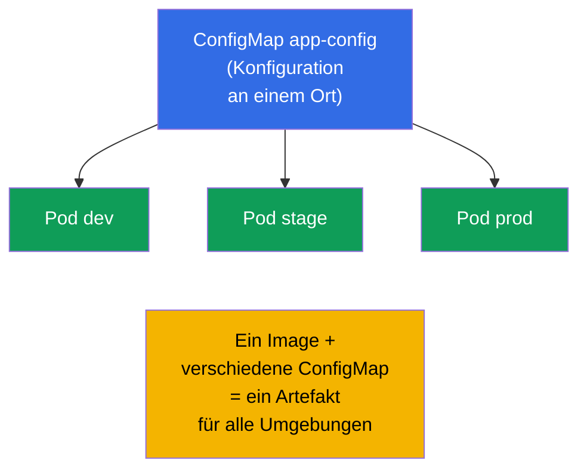
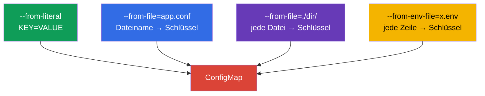
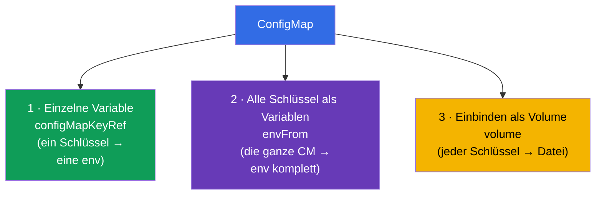
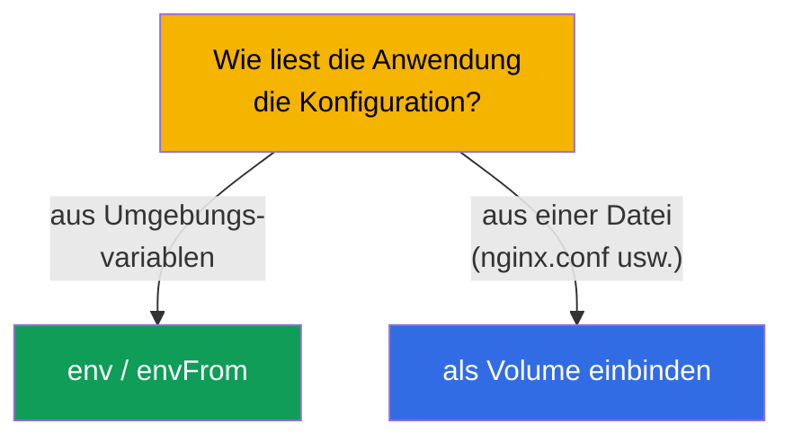
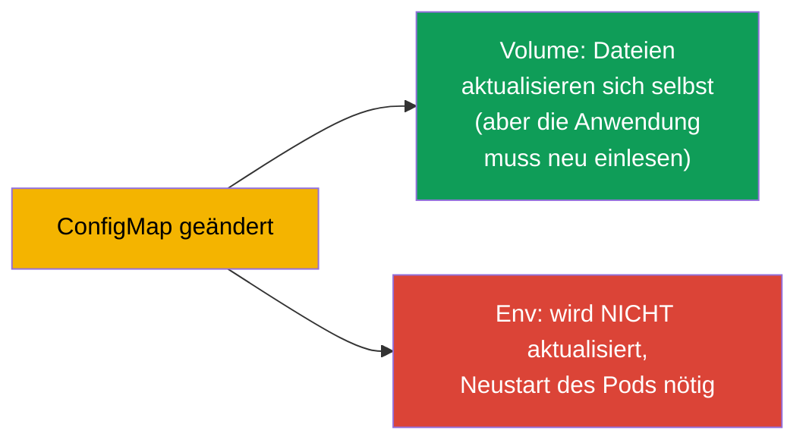

[Русская версия](ru.md) · [Eng version](README.md) · [Versión en español](es.md) · [Version française](fr.md) · [ქართული ვერსია](ge.md) · [繁體中文版](tw.md) · [日本語版](jp.md)

# Kapitel 18. ConfigMap

> **Was kommt.** Im vorigen Kapitel haben wir die Konfiguration direkt im Manifest des Pods
> gesetzt. Das skaliert schlecht: die Konfiguration wird dupliziert, ist im Deployment
> festgenagelt und lässt sich nicht wiederverwenden. **ConfigMap** lagert die Konfiguration
> in ein eigenes Objekt aus: eine ConfigMap - viele Pods, die Konfiguration ist vom Image
> und vom Deployment getrennt. Das ist der Kern der Domäne Environment/Config (CKAD, 25%)
> und das Thema Workloads (CKA). Wir sehen uns an, wie man eine ConfigMap erstellt und sie
> auf drei Weisen an Pods anbindet.

## 18.1. Warum man die Konfiguration trennt

Das Prinzip der 12-factor app (Kapitel 17): **die Konfiguration wird vom Code getrennt**.
Das Image der Anwendung muss für alle Umgebungen dasselbe sein, und die Unterschiede
(Adressen, Parameter, Flags) kommen von außen. ConfigMap ist der Speicher für solche
**nicht geheime** Konfiguration im Cluster.



Gleich vorweg: ConfigMap ist für **nicht geheime** Daten. Passwörter, Tokens, Schlüssel -
das ist Secret (Kapitel 19). ConfigMap speichert die Daten als Klartext.

## 18.2. Was eine ConfigMap ist

ConfigMap ist ein Objekt mit einer Menge von Schlüssel-Wert-Paaren (oder ganzen Dateien).
Die Werte sind Konfigurationsdaten: einzelne Parameter oder der Inhalt von
Konfigurationsdateien als Ganzes.

```yaml
apiVersion: v1
kind: ConfigMap
metadata:
  name: app-config
data:
  COLOR: "blue"                      # einfaches Schlüssel-Wert-Paar
  MAX_CONNECTIONS: "100"
  app.properties: |                  # ganze Datei als Wert
    server.port=8080
    log.level=INFO
```

Zwei Arten von Feldern: `data` (Textdaten) und `binaryData` (binär, in base64).
Üblicherweise arbeitet man mit `data`.

## 18.3. Erstellen einer ConfigMap

Drei Wege zum Erstellen, alle kommen in der Prüfung vor:

```bash
# 1. Aus Literalen (einzelne Paare)
kubectl create configmap app-config \
  --from-literal=COLOR=blue \
  --from-literal=MAX_CONNECTIONS=100

# 2. Aus einer Datei (Dateiname → Schlüssel, Inhalt → Wert)
kubectl create configmap app-config --from-file=app.properties

# 3. Aus einem ganzen Verzeichnis (jede Datei → eigener Schlüssel)
kubectl create configmap app-config --from-file=./config-dir/

# 4. Aus einer env-Datei (jede Zeile KEY=VALUE → eigener Schlüssel)
kubectl create configmap app-config --from-env-file=config.env
```



Der Unterschied zwischen `--from-file` und `--from-env-file` ist wichtig:
`--from-file=config.env` erzeugt **einen** Schlüssel `config.env` mit dem gesamten Inhalt
der Datei, während `--from-env-file=config.env` die Datei zeilenweise in **einzelne**
Schlüssel zerlegt.

## 18.4. Drei Wege, eine ConfigMap an einen Pod anzubinden

Das ist das Kernthema des Kapitels. Die Daten aus einer ConfigMap gelangen auf drei Weisen
in den Pod.



**Weg 1. Einzelner Schlüssel → einzelne Variable** (`configMapKeyRef`):

```yaml
    env:
    - name: APP_COLOR
      valueFrom:
        configMapKeyRef:
          name: app-config
          key: COLOR
```

**Weg 2. Die ganze ConfigMap → Umgebungsvariablen** (`envFrom`):

```yaml
    envFrom:
    - configMapRef:
        name: app-config
    # jeder Schlüssel der ConfigMap wird zu einer Umgebungsvariablen
```

**Weg 3. ConfigMap → Dateien (Volume)**:

```yaml
spec:
  containers:
  - name: app
    image: nginx
    volumeMounts:
    - name: config
      mountPath: /etc/config       # hier erscheinen die Dateien nach Schlüsseln
  volumes:
  - name: config
    configMap:
      name: app-config
```

Beim Einbinden als Volume wird jeder Schlüssel der ConfigMap zu einer **Datei** in
`/etc/config` (`COLOR`, `app.properties` usw.), und der Wert wird zum Inhalt der Datei.

## 18.5. Env gegen Volume: wann was

| Weg | Was wir bekommen | Wann verwenden |
|--------|--------------|--------------------|
| `configMapKeyRef` (env) | eine Variable aus einem Schlüssel | man braucht ein paar Werte in der Umgebung |
| `envFrom` (env) | alle Schlüssel als Variablen | die ganze Konfiguration - in die Umgebung |
| Volume | Schlüssel als Dateien | die Anwendung liest eine Konfigurationsdatei (nginx.conf, application.yaml) |

Regel: wenn die Anwendung eine **Konfigurationsdatei** liest, binden Sie die ConfigMap als
Volume ein. Wenn sie über **Umgebungsvariablen** konfiguriert wird - nutzen Sie
env/envFrom.



## 18.6. Aktualisierung einer ConfigMap und deren Übernahme

Eine wichtige Feinheit zu Aktualisierungen:

- **Als Volume eingebundene** ConfigMap werden im Pod automatisch aktualisiert (einige Zeit
  nach der Änderung der ConfigMap ändern sich die Dateien im Volume). Aber die Anwendung
  muss die Datei **neu einlesen** können - Kubernetes selbst startet den Prozess nicht neu.
- **Umgebungsvariablen** aus einer ConfigMap werden **nicht** im laufenden Betrieb
  aktualisiert - sie werden beim Start des Containers festgeschrieben. Um den neuen Wert zu
  übernehmen, muss der Pod neu erstellt werden (Deployment neu starten).



Daher der häufige Trick: um eine neue Konfiguration garantiert anzuwenden, macht man
`kubectl rollout restart deployment`. In der Produktion ist das für env-Konfiguration der
einzige Weg, Änderungen zu übernehmen.

## 18.7. Immutable ConfigMap

Man kann eine ConfigMap unveränderlich machen (`immutable: true`). Dann kann man sie nicht
mehr ändern - nur löschen und neu erstellen. Das schützt vor versehentlichen Korrekturen
und **senkt die Last** auf den Cluster (das kubelet überwacht Änderungen an
unveränderlichen Objekten nicht).

```yaml
apiVersion: v1
kind: ConfigMap
metadata:
  name: app-config
immutable: true
data:
  COLOR: blue
```

## 18.8. Wie man das in der Produktion anwendet

- **Die gesamte nicht geheime Konfiguration - in ConfigMap.** Parameter der Anwendung,
  Konfigurationsdateien (nginx, fluent-bit, prometheus), Feature-Flags hält man in
  ConfigMap und versioniert sie in git zusammen mit den Manifesten. So funktioniert ein
  Image in allen Umgebungen.
- **Dateibasierte Konfiguration - als Volume.** Große Konfigurationen (nginx.conf,
  application.yaml) bindet man als Volume ein; kleine Parameter - über env. Beides je nach
  Zweck zu mischen ist normal.
- **Das Problem der env-Aktualisierung.** Die klassische Falle der Produktion: man hat die
  ConfigMap geändert, und die Anwendung sieht die Änderungen nicht, weil sie sie über env
  bezog (wird beim Start festgeschrieben). Die Lösung ist `rollout restart` oder eine
  checksum-Annotation am Pod (bei Änderung der ConfigMap ändert sich die Annotation → der
  Pod wird neu erstellt). Helm macht das per Template.
- **Immutable für Stabilität.** In großen Clustern macht man kritische ConfigMap immutable -
  weniger Last auf API/kubelet und kein Risiko einer versehentlichen Korrektur in der
  Produktion. Die Aktualisierung läuft dann über eine neue ConfigMap mit einer Version im
  Namen.
- **ConfigMap ist nicht für Secrets.** Die Daten einer ConfigMap liegen als Klartext vor und
  sind für alle sichtbar, die Zugriff auf den Namespace haben. Passwörter/Tokens - nur in
  einem Secret (Kapitel 19).

## 18.9. Mini-Glossar

- **ConfigMap** - Objekt mit nicht geheimer Konfiguration (Schlüssel-Werte oder Dateien).
- **data / binaryData** - Text- / Binärdaten einer ConfigMap.
- **configMapKeyRef** - einen Schlüssel der ConfigMap in eine Umgebungsvariable nehmen.
- **envFrom + configMapRef** - alle Schlüssel der ConfigMap als Umgebungsvariablen.
- **Einbinden als Volume** - die Schlüssel der ConfigMap werden zu Dateien in einem
  Verzeichnis.
- **immutable** - unveränderliche ConfigMap (nur Neuerstellung).
- **--from-file / --from-env-file** - Datei komplett in einen Schlüssel / zeilenweise in
  Schlüssel.

## 18.10. Zusammenfassung des Kapitels

- ConfigMap lagert die nicht geheime Konfiguration aus dem Image und dem Manifest in ein
  eigenes Objekt aus; eine ConfigMap - viele Pods.
- Sie wird aus Literalen, einer Datei, einem Verzeichnis oder einer env-Datei erstellt;
  `--from-file` ergibt einen Schlüssel, `--from-env-file` - viele.
- Sie wird auf drei Weisen angebunden: einzelner Schlüssel in env (`configMapKeyRef`), die
  ganze ConfigMap in env (`envFrom`), Einbinden als Volume (Schlüssel → Dateien).
- Dateibasierte Konfiguration bindet man als Volume ein; Umgebungsparameter - über
  env/envFrom.
- Das Volume wird automatisch aktualisiert (die Anwendung muss die Datei neu einlesen); env
  wird nicht aktualisiert, ein Neustart des Pods ist nötig.
- `immutable: true` schützt vor Änderungen und senkt die Last auf den Cluster.
- ConfigMap speichert die Daten als Klartext - nicht für Secrets.

## 18.11. Wofür das nützlich ist: in der Prüfung und in der echten Arbeit

**In der Prüfung.** „Erstelle eine ConfigMap aus Literalen/einer Datei“, „gib einen Wert in
eine Variable durch“, „binde die ConfigMap als Volume ein“ - das sind ständige Aufgaben in
CKAD und CKA. Man muss alle Wege des Erstellens und alle drei Wege des Anbindens kennen und
außerdem daran denken, dass env aus einer ConfigMap nicht im laufenden Betrieb aktualisiert
wird.

**In der echten Arbeit.** ConfigMap ist der reguläre Weg, die Konfiguration von Anwendungen
zu speichern (ein Image für alle Umgebungen). Das Verständnis des Unterschieds „Volume wird
aktualisiert / env nicht“ bewahrt vor dem klassischen Fehler „ich habe die Konfiguration
geändert, und es hat sich nichts geändert“. Immutable ConfigMap ist ein Mittel für
Stabilität und Performance großer Cluster.

## 18.12. Fragen zur Selbstüberprüfung

1. Warum die Konfiguration in eine ConfigMap auslagern, wenn man env direkt im Pod setzen
   kann?
2. Worin unterscheidet sich `--from-file=config.env` von `--from-env-file=config.env`?
3. Nennen Sie drei Wege, eine ConfigMap an einen Pod anzubinden. Wann ist welcher passend?
4. Was passiert mit einem eingebundenen Volume und mit den env-Variablen, wenn man die
   ConfigMap ändert?
5. Wie wendet man eine geänderte ConfigMap garantiert an, wenn sie über env durchgegeben
   wird?
6. Was bringt `immutable: true` und wie aktualisiert man dann die Konfiguration?
7. Warum darf man ConfigMap nicht für Passwörter und Tokens verwenden?

## Praxis

Wir haben die normale Konfiguration ausgelagert. Nun sehen wir uns ihren sensiblen „Bruder“
an - Secret (Kapitel 19), der eine ähnliche Mechanik hat, aber wichtige Unterschiede bei
der Sicherheit. ConfigMap wird in den Labs zur Konfiguration geübt.

🧪 Lab 105 (ConfigMap): [tasks/cka/labs/105](../../labs/105/README_DE.MD)

---
[Inhalt](../README_DE.md) · [Kapitel 17](../17/de.md) · [Kapitel 19](../19/de.md)
