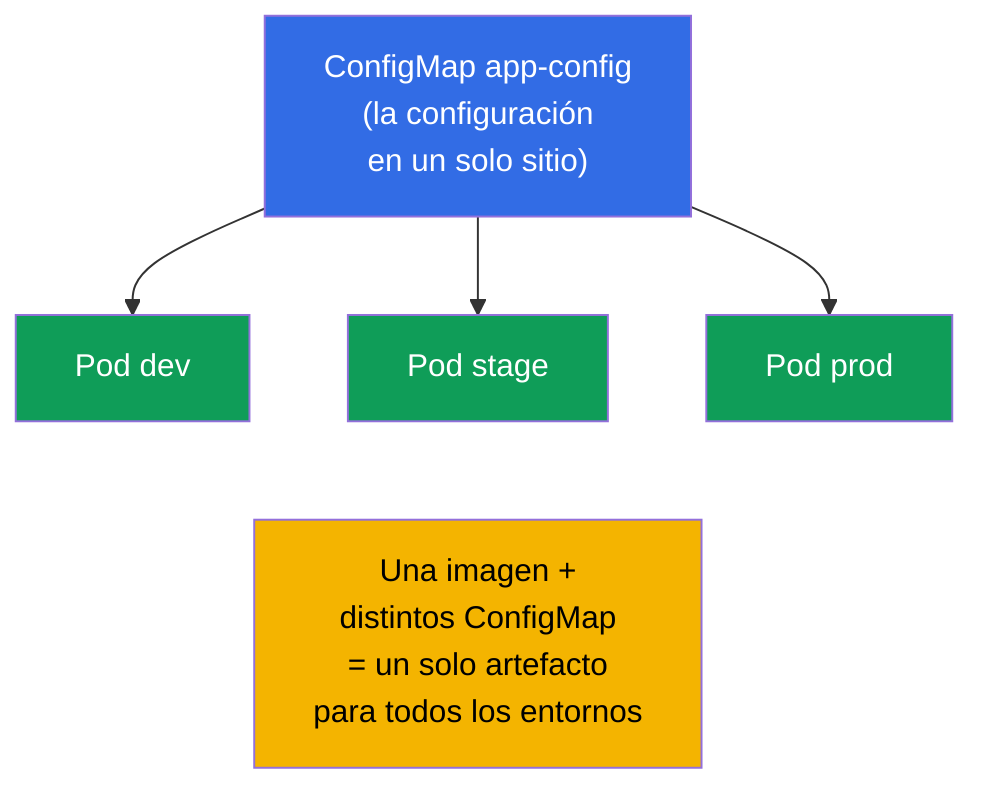
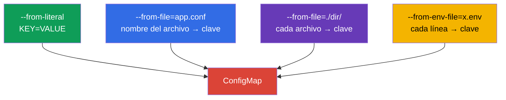
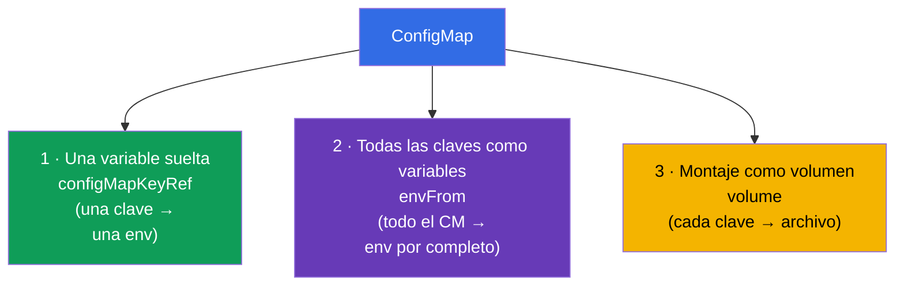
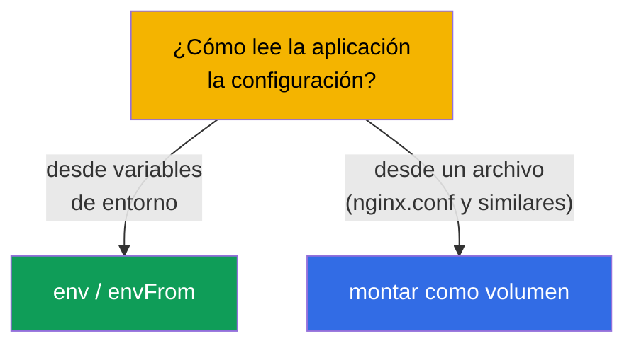
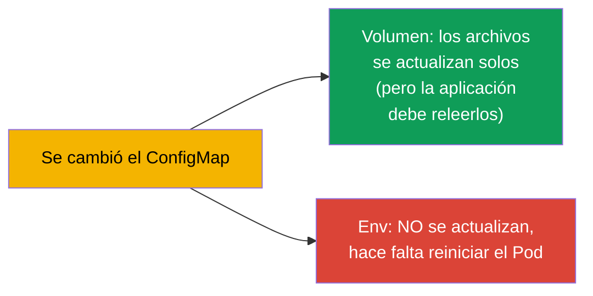

[Русская версия](ru.md) · [Eng version](README.md) · [Version française](fr.md) · [Deutsche Version](de.md) · [ქართული ვერსია](ge.md) · [繁體中文版](tw.md) · [日本語版](jp.md)

# Capítulo 18. ConfigMap

> **Qué viene ahora.** En el capítulo anterior definíamos la configuración directamente en el
> manifiesto del Pod. Eso escala mal: la configuración se duplica, queda codificada en el
> deployment y no se puede reutilizar. **ConfigMap** saca la configuración a un objeto aparte: un
> ConfigMap - muchos Pods, la configuración separada de la imagen y del deployment. Es el núcleo
> del dominio Environment/Config (CKAD, 25%) y del tema Workloads (CKA). Veremos cómo crear un
> ConfigMap y cómo conectarlo a los Pods de tres maneras.

## 18.1. Por qué separar la configuración

El principio de la 12-factor app (capítulo 17): **la configuración se separa del código**. La
imagen de la aplicación debe ser la misma para todos los entornos, y las diferencias (direcciones,
parámetros, flags) han de llegar desde fuera. ConfigMap es el almacén de esa configuración **no
secreta** dentro del clúster.



Aclarémoslo ya: ConfigMap es para datos **no secretos**. Las contraseñas, los tokens y las claves
van en un Secret (capítulo 19). ConfigMap guarda los datos en texto claro.

## 18.2. Qué es un ConfigMap

ConfigMap es un objeto con un conjunto de pares clave-valor (o de archivos completos). Los valores
son datos de configuración: parámetros sueltos o el contenido íntegro de archivos de configuración.

```yaml
apiVersion: v1
kind: ConfigMap
metadata:
  name: app-config
data:
  COLOR: "blue"                      # clave-valor sencillo
  MAX_CONNECTIONS: "100"
  app.properties: |                  # un archivo entero como valor
    server.port=8080
    log.level=INFO
```

Hay dos tipos de campos: `data` (datos de texto) y `binaryData` (binarios, en base64).
Normalmente se trabaja con `data`.

## 18.3. Creación de un ConfigMap

Tres formas de crearlo, todas aparecen en el examen:

```bash
# 1. A partir de literales (pares sueltos)
kubectl create configmap app-config \
  --from-literal=COLOR=blue \
  --from-literal=MAX_CONNECTIONS=100

# 2. A partir de un archivo (nombre del archivo → clave, contenido → valor)
kubectl create configmap app-config --from-file=app.properties

# 3. A partir de un directorio completo (cada archivo → su propia clave)
kubectl create configmap app-config --from-file=./config-dir/

# 4. A partir de un archivo env (cada línea KEY=VALUE → una clave aparte)
kubectl create configmap app-config --from-env-file=config.env
```



La diferencia entre `--from-file` y `--from-env-file` es importante: `--from-file=config.env` crea
**una sola** clave `config.env` con todo el contenido del archivo, mientras que
`--from-env-file=config.env` descompone el archivo línea a línea en claves **separadas**.

## 18.4. Tres formas de conectar un ConfigMap a un Pod

Este es el tema clave del capítulo. Los datos de un ConfigMap llegan al Pod de tres maneras.



**Forma 1. Una clave suelta → una variable suelta** (`configMapKeyRef`):

```yaml
    env:
    - name: APP_COLOR
      valueFrom:
        configMapKeyRef:
          name: app-config
          key: COLOR
```

**Forma 2. Todo el ConfigMap → variables de entorno** (`envFrom`):

```yaml
    envFrom:
    - configMapRef:
        name: app-config
    # cada clave del ConfigMap se convertirá en una variable de entorno
```

**Forma 3. ConfigMap → archivos (volumen)**:

```yaml
spec:
  containers:
  - name: app
    image: nginx
    volumeMounts:
    - name: config
      mountPath: /etc/config       # aquí aparecerán los archivos según las claves
  volumes:
  - name: config
    configMap:
      name: app-config
```

Al montarlo como volumen, cada clave del ConfigMap se convierte en un **archivo** dentro de
`/etc/config` (`COLOR`, `app.properties`, etc.), y el valor pasa a ser el contenido del archivo.

## 18.5. Env frente a volumen: cuándo cada uno

| Forma | Qué obtenemos | Cuándo usarla |
|--------|--------------|--------------------|
| `configMapKeyRef` (env) | una variable a partir de una clave | hacen falta un par de valores en el entorno |
| `envFrom` (env) | todas las claves como variables | toda la configuración al entorno |
| volumen (volume) | claves como archivos | la aplicación lee un archivo de configuración (nginx.conf, application.yaml) |

Regla: si la aplicación lee un **archivo de configuración**, monta el ConfigMap como volumen. Si se
configura mediante **variables de entorno**, usa env/envFrom.



## 18.6. Actualización de un ConfigMap y su recogida

Un matiz importante sobre las actualizaciones:

- Los ConfigMap **montados como volumen** se actualizan en el Pod automáticamente (al cabo de un
  tiempo tras el cambio del ConfigMap, los archivos del volumen cambian). Pero la aplicación tiene
  que saber **releer** el archivo - Kubernetes por sí mismo no reinicia el proceso.
- Las **variables de entorno** provenientes de un ConfigMap **no se actualizan** en caliente: se
  fijan al arrancar el contenedor. Para recoger el nuevo valor hay que recrear el Pod (reiniciar el
  Deployment).



De ahí viene un truco habitual: para aplicar con garantías la nueva configuración se hace
`kubectl rollout restart deployment`. En producción, para la configuración vía env es la única
manera de recoger los cambios.

## 18.7. Immutable ConfigMap

Se puede hacer que un ConfigMap sea inmutable (`immutable: true`). Entonces no se puede modificar,
solo borrarlo y crearlo de nuevo. Eso protege de ediciones accidentales y **reduce la carga** del
clúster (el kubelet no vigila los cambios de los objetos inmutables).

```yaml
apiVersion: v1
kind: ConfigMap
metadata:
  name: app-config
immutable: true
data:
  COLOR: blue
```

## 18.8. Cómo se aplica esto en producción

- **Toda la configuración no secreta, en ConfigMap.** Los parámetros de la aplicación, los archivos
  de configuración (nginx, fluent-bit, prometheus) y los feature flags se guardan en ConfigMap y se
  versionan en git junto con los manifiestos. Así una misma imagen funciona en todos los entornos.
- **Las configuraciones en archivo, como volumen.** Las configuraciones grandes (nginx.conf,
  application.yaml) se montan como volumen; los parámetros pequeños van por env. Mezclar según el
  propósito es lo normal.
- **El problema de actualizar env.** La trampa clásica de producción: se cambia el ConfigMap y la
  aplicación no ve los cambios porque los tomaba vía env (se fijan al arrancar). La solución es
  `rollout restart` o una anotación con checksum en el Pod (al cambiar el ConfigMap cambia la
  anotación → el Pod se recrea). Helm lo hace con una plantilla.
- **Immutable para la estabilidad.** En clústeres grandes, los ConfigMap críticos se hacen
  immutable: menos carga sobre la API y el kubelet, y ningún riesgo de edición accidental en
  producción. La actualización pasa entonces por un nuevo ConfigMap con la versión en el nombre.
- **ConfigMap no es para secretos.** Los datos de un ConfigMap están en texto claro y los ve
  cualquiera que tenga acceso al namespace. Las contraseñas y los tokens van solo en un Secret
  (capítulo 19).

## 18.9. Mini-glosario

- **ConfigMap** - objeto con configuración no secreta (claves-valores o archivos).
- **data / binaryData** - datos de texto / binarios del ConfigMap.
- **configMapKeyRef** - tomar una clave del ConfigMap para una variable de entorno.
- **envFrom + configMapRef** - todas las claves del ConfigMap como variables de entorno.
- **montaje como volumen** - las claves del ConfigMap se convierten en archivos dentro de un
  directorio.
- **immutable** - ConfigMap inmutable (solo se puede recrear).
- **--from-file / --from-env-file** - el archivo entero en una clave / línea a línea en claves.

## 18.10. Resumen del capítulo

- ConfigMap saca la configuración no secreta de la imagen y del manifiesto a un objeto aparte; un
  ConfigMap - muchos Pods.
- Se crea a partir de literales, de un archivo, de un directorio o de un archivo env;
  `--from-file` da una sola clave, `--from-env-file` da muchas.
- Se conecta de tres maneras: una clave suelta en env (`configMapKeyRef`), todo el ConfigMap en env
  (`envFrom`) y montaje como volumen (claves → archivos).
- La configuración en archivo se monta como volumen; los parámetros de entorno van por env/envFrom.
- El volumen se actualiza automáticamente (la aplicación debe releer el archivo); env no se
  actualiza, hace falta reiniciar el Pod.
- `immutable: true` protege de ediciones y reduce la carga del clúster.
- ConfigMap guarda los datos en texto claro - no es para secretos.

## 18.11. Para qué te servirá: en el examen y en el trabajo real

**En el examen.** «Crea un ConfigMap a partir de literales/de un archivo», «pasa un valor a una
variable», «monta el ConfigMap como volumen» son tareas constantes de CKAD y CKA. Hay que conocer
todas las formas de creación y las tres formas de conexión, y recordar además que las env
procedentes de un ConfigMap no se actualizan en caliente.

**En el trabajo real.** ConfigMap es la manera estándar de guardar la configuración de las
aplicaciones (una imagen para todos los entornos). Entender la diferencia «el volumen se actualiza
/ env no» te salva del error clásico de «he cambiado la configuración y no ha cambiado nada». El
ConfigMap immutable es un recurso para la estabilidad y el rendimiento de los clústeres grandes.

## 18.12. Preguntas de autoevaluación

1. ¿Para qué sacar la configuración a un ConfigMap si se pueden definir las env directamente en el
   Pod?
2. ¿En qué se diferencia `--from-file=config.env` de `--from-env-file=config.env`?
3. Nombra las tres formas de conectar un ConfigMap a un Pod. ¿Cuándo es adecuada cada una?
4. ¿Qué le ocurrirá al volumen montado y a las variables env si se modifica el ConfigMap?
5. ¿Cómo aplicar con garantías un ConfigMap modificado si se pasa mediante env?
6. ¿Qué aporta `immutable: true` y cómo se actualiza entonces la configuración?
7. ¿Por qué no se puede usar un ConfigMap para contraseñas y tokens?

## Práctica

Hemos sacado la configuración normal. Ahora veremos a su «hermano» sensible, el Secret
(capítulo 19), cuya mecánica es parecida pero tiene diferencias importantes en cuanto a seguridad.
ConfigMap se practica en los laboratorios de configuración.

🧪 Laboratorio 105 (ConfigMap): [tasks/cka/labs/105](../../labs/105/README_ES.MD)

---
[Índice](../README_ES.md) · [Capítulo 17](../17/es.md) · [Capítulo 19](../19/es.md)
