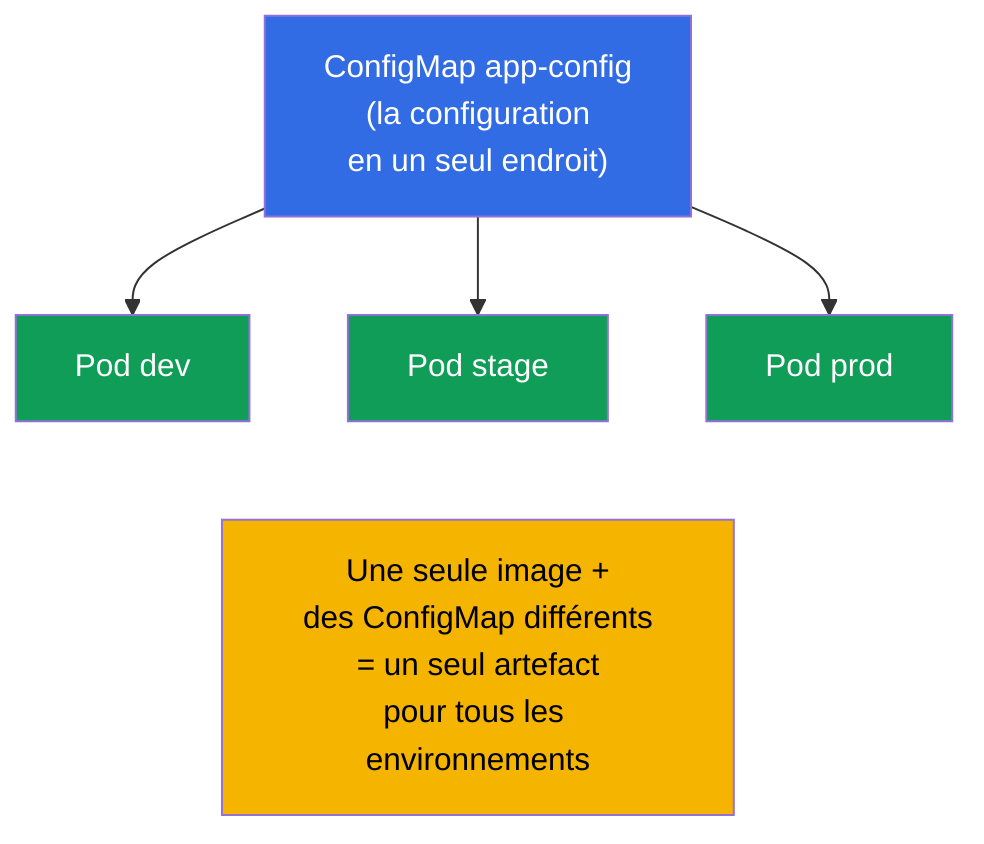
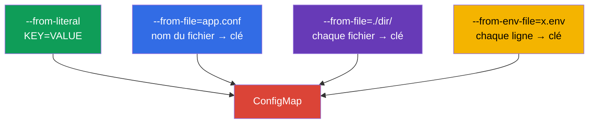
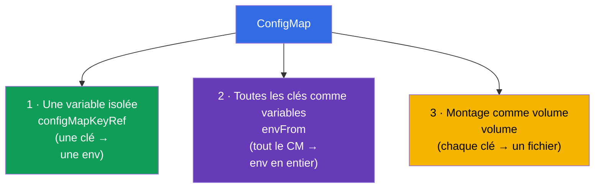
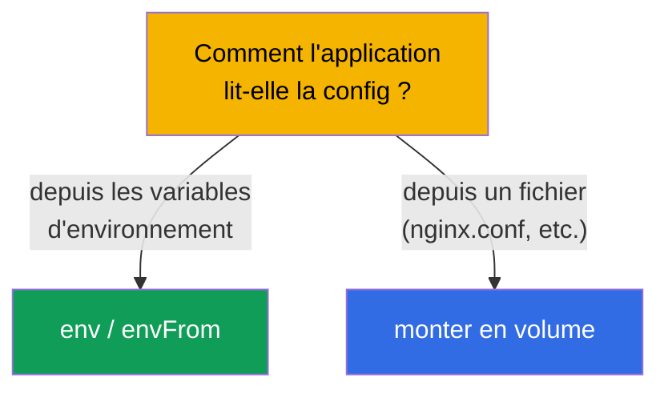
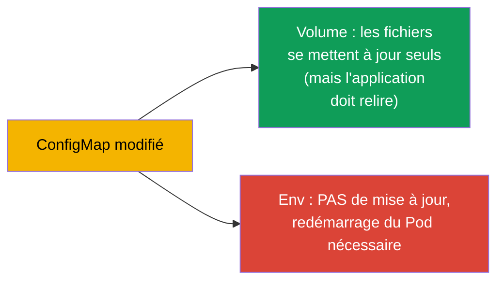

[Русская версия](ru.md) · [Eng version](README.md) · [Versión en español](es.md) · [Deutsche Version](de.md) · [ქართული ვერსია](ge.md) · [繁體中文版](tw.md) · [日本語版](jp.md)

# Chapitre 18. ConfigMap

> **Ce qui suit.** Dans le chapitre précédent, nous définissions la config directement dans
> le manifeste du Pod. Cela passe mal à l'échelle : la configuration est dupliquée, figée
> dans le déploiement, impossible à réutiliser. Le **ConfigMap** sort la configuration dans
> un objet à part : un seul ConfigMap - beaucoup de Pods, la config est séparée de l'image
> et du déploiement. C'est le cœur du domaine Environment/Config (CKAD, 25%) et le sujet
> Workloads (CKA). Voyons comment créer un ConfigMap et comment le brancher aux Pods de
> trois façons.

## 18.1. Pourquoi séparer la configuration

Principe de l'application 12-factor (chapitre 17) : **la configuration se sépare du code**.
L'image de l'application doit être la même pour tous les environnements, et les différences
(adresses, paramètres, flags) doivent venir de l'extérieur. Le ConfigMap est le stockage de
cette configuration **non secrète** dans le cluster.



À retenir tout de suite : le ConfigMap est fait pour les données **non secrètes**. Les mots
de passe, les tokens, les clés relèvent du Secret (chapitre 19). Le ConfigMap stocke les
données en clair.

## 18.2. Qu'est-ce qu'un ConfigMap

Un ConfigMap est un objet contenant un ensemble de paires clé-valeur (ou des fichiers
entiers). Les valeurs sont des données de configuration : des paramètres isolés ou le
contenu complet de fichiers de config.

```yaml
apiVersion: v1
kind: ConfigMap
metadata:
  name: app-config
data:
  COLOR: "blue"                      # simple clé-valeur
  MAX_CONNECTIONS: "100"
  app.properties: |                  # un fichier entier comme valeur
    server.port=8080
    log.level=INFO
```

Deux types de champs : `data` (données textuelles) et `binaryData` (binaires, en base64).
En général, on travaille avec `data`.

## 18.3. Création d'un ConfigMap

Trois façons de le créer, toutes rencontrées à l'examen :

```bash
# 1. À partir de littéraux (paires isolées)
kubectl create configmap app-config \
  --from-literal=COLOR=blue \
  --from-literal=MAX_CONNECTIONS=100

# 2. À partir d'un fichier (nom du fichier → clé, contenu → valeur)
kubectl create configmap app-config --from-file=app.properties

# 3. À partir d'un répertoire entier (chaque fichier → sa propre clé)
kubectl create configmap app-config --from-file=./config-dir/

# 4. À partir d'un fichier env (chaque ligne KEY=VALUE → une clé distincte)
kubectl create configmap app-config --from-env-file=config.env
```



La différence entre `--from-file` et `--from-env-file` est importante :
`--from-file=config.env` crée **une seule** clé `config.env` avec tout le contenu du
fichier, alors que `--from-env-file=config.env` analyse le fichier ligne par ligne en clés
**distinctes**.

## 18.4. Trois façons de brancher un ConfigMap à un Pod

C'est le sujet clé du chapitre. Les données d'un ConfigMap arrivent dans le Pod de trois
façons.



**Façon 1. Une clé isolée → une variable isolée** (`configMapKeyRef`) :

```yaml
    env:
    - name: APP_COLOR
      valueFrom:
        configMapKeyRef:
          name: app-config
          key: COLOR
```

**Façon 2. Tout le ConfigMap → variables d'environnement** (`envFrom`) :

```yaml
    envFrom:
    - configMapRef:
        name: app-config
    # chaque clé du ConfigMap deviendra une variable d'environnement
```

**Façon 3. ConfigMap → fichiers (volume)** :

```yaml
spec:
  containers:
  - name: app
    image: nginx
    volumeMounts:
    - name: config
      mountPath: /etc/config       # les fichiers apparaîtront ici
  volumes:
  - name: config
    configMap:
      name: app-config
```

Lors du montage en volume, chaque clé du ConfigMap devient un **fichier** dans
`/etc/config` (`COLOR`, `app.properties`, etc.), et la valeur devient le contenu du
fichier.

## 18.5. Env contre volume : quand utiliser quoi

| Façon | Ce que l'on obtient | Quand l'utiliser |
|--------|--------------|--------------------|
| `configMapKeyRef` (env) | une variable issue d'une clé | il faut deux ou trois valeurs dans l'environnement |
| `envFrom` (env) | toutes les clés comme variables | toute la config - dans l'environnement |
| volume | les clés comme fichiers | l'application lit un fichier de config (nginx.conf, application.yaml) |

Règle : si l'application lit un **fichier de config**, montez le ConfigMap en volume. Si
elle se configure par **variables d'environnement**, utilisez env/envFrom.



## 18.6. Mise à jour d'un ConfigMap et sa prise en compte

Une subtilité importante à propos des mises à jour :

- Les ConfigMap **montés en volume** sont mis à jour automatiquement dans le Pod (un certain
  temps après la modification du ConfigMap, les fichiers du volume changent). Mais
  l'application doit savoir **relire** le fichier - Kubernetes ne redémarre pas le processus
  lui-même.
- Les **variables d'environnement** issues d'un ConfigMap **ne sont pas mises à jour** à
  chaud - elles sont figées au démarrage du conteneur. Pour prendre en compte la nouvelle
  valeur, il faut recréer le Pod (redémarrer le Deployment).



D'où une pratique fréquente : pour appliquer à coup sûr la nouvelle config, on fait
`kubectl rollout restart deployment`. En prod, pour une config passée par env, c'est le seul
moyen de prendre en compte les changements.

## 18.7. ConfigMap immutable

On peut rendre un ConfigMap non modifiable (`immutable: true`). Il devient alors impossible
de le changer - seulement de le supprimer et de le recréer. Cela protège des modifications
accidentelles et **réduit la charge** sur le cluster (le kubelet ne surveille pas les
changements des objets immuables).

```yaml
apiVersion: v1
kind: ConfigMap
metadata:
  name: app-config
immutable: true
data:
  COLOR: blue
```

## 18.8. Comment cela s'applique en production

- **Toute la configuration non secrète - dans un ConfigMap.** Les paramètres de
  l'application, les fichiers de config (nginx, fluent-bit, prometheus), les feature flags
  sont stockés dans des ConfigMap et versionnés dans git avec les manifestes. Ainsi une seule
  image fonctionne dans tous les environnements.
- **Les configs fichier - en volume.** Les configs volumineuses (nginx.conf,
  application.yaml) sont montées en volume ; les petits paramètres passent par env. Mélanger
  selon l'usage est la norme.
- **Le problème de la mise à jour de env.** Piège classique de la prod : on modifie le
  ConfigMap et l'application ne voit pas les changements, parce qu'elle les tirait via env
  (figés au démarrage). Solution - `rollout restart` ou une annotation checksum sur le Pod
  (quand le ConfigMap change, l'annotation change → le Pod est recréé). Helm le fait par
  template.
- **Immutable pour la stabilité.** Dans les grands clusters, les ConfigMap critiques sont
  rendus immutable - moins de charge sur l'API/le kubelet et aucun risque de modification
  accidentelle en prod. La mise à jour passe alors par un nouveau ConfigMap avec la version
  dans le nom.
- **Le ConfigMap n'est pas fait pour les secrets.** Les données d'un ConfigMap sont en clair
  et visibles de tous ceux qui ont accès au namespace. Les mots de passe et les tokens vont
  uniquement dans un Secret (chapitre 19).

## 18.9. Mini-glossaire

- **ConfigMap** - objet contenant de la configuration non secrète (clés-valeurs ou fichiers).
- **data / binaryData** - données textuelles / binaires d'un ConfigMap.
- **configMapKeyRef** - prendre une clé d'un ConfigMap dans une variable d'environnement.
- **envFrom + configMapRef** - toutes les clés d'un ConfigMap comme variables
  d'environnement.
- **montage en volume** - les clés du ConfigMap deviennent des fichiers dans un répertoire.
- **immutable** - ConfigMap non modifiable (recréation uniquement).
- **--from-file / --from-env-file** - le fichier entier dans une clé / ligne par ligne en
  clés.

## 18.10. Bilan du chapitre

- Le ConfigMap sort la configuration non secrète de l'image et du manifeste vers un objet à
  part ; un seul ConfigMap - beaucoup de Pods.
- Il se crée à partir de littéraux, d'un fichier, d'un répertoire ou d'un fichier env ;
  `--from-file` donne une seule clé, `--from-env-file` en donne plusieurs.
- Il se branche de trois façons : une clé isolée dans env (`configMapKeyRef`), tout le
  ConfigMap dans env (`envFrom`), le montage en volume (clés → fichiers).
- Une config fichier se monte en volume ; les paramètres d'environnement passent par
  env/envFrom.
- Le volume est mis à jour automatiquement (l'application doit relire le fichier) ; env n'est
  pas mis à jour, un redémarrage du Pod est nécessaire.
- `immutable: true` protège des modifications et réduit la charge sur le cluster.
- Le ConfigMap stocke les données en clair - pas pour les secrets.

## 18.11. À quoi cela sert : à l'examen et dans le travail réel

**À l'examen.** « Crée un ConfigMap à partir de littéraux/d'un fichier », « passe une valeur
dans une variable », « monte le ConfigMap en volume » sont des exercices permanents du CKAD
et du CKA. Il faut connaître toutes les façons de le créer et les trois façons de le
brancher, et se rappeler que les env issues d'un ConfigMap ne sont pas mises à jour à chaud.

**Dans le travail réel.** Le ConfigMap est le moyen standard de stocker la configuration des
applications (une seule image pour tous les environnements). Comprendre la différence « le
volume se met à jour / env non » évite l'erreur classique « j'ai changé la config et rien n'a
changé ». Le ConfigMap immutable est une pratique de stabilité et de performance pour les
grands clusters.

## 18.12. Questions d'auto-évaluation

1. Pourquoi sortir la configuration dans un ConfigMap si l'on peut définir env directement
   dans le Pod ?
2. En quoi `--from-file=config.env` diffère-t-il de `--from-env-file=config.env` ?
3. Citez les trois façons de brancher un ConfigMap à un Pod. Quand chacune est-elle
   appropriée ?
4. Qu'arrive-t-il à un volume monté et aux variables env si l'on modifie le ConfigMap ?
5. Comment appliquer à coup sûr un ConfigMap modifié s'il est passé via env ?
6. Qu'apporte `immutable: true` et comment mettre à jour la configuration dans ce cas ?
7. Pourquoi ne peut-on pas utiliser un ConfigMap pour les mots de passe et les tokens ?

## Pratique

Nous avons sorti la configuration ordinaire. Voyons maintenant son « frère » sensible - le
Secret (chapitre 19), dont la mécanique est semblable, mais qui présente des différences
importantes en matière de sécurité. Le ConfigMap se travaille dans les TP sur la
configuration.

🧪 TP 105 (ConfigMap) : [tasks/cka/labs/105](../../labs/105/README_FR.MD)

---
[Sommaire](../README_FR.md) · [Chapitre 17](../17/fr.md) · [Chapitre 19](../19/fr.md)
