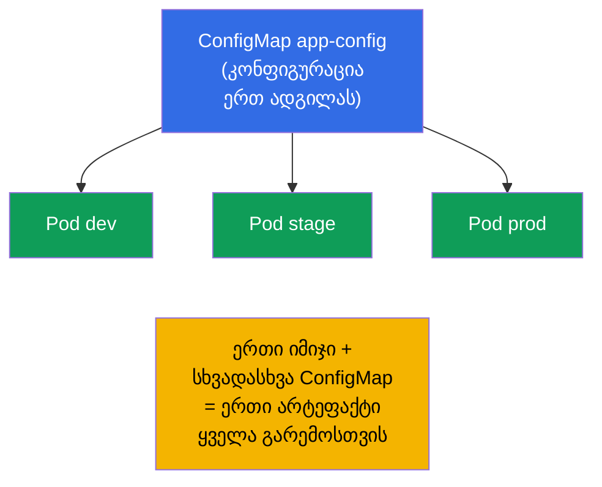
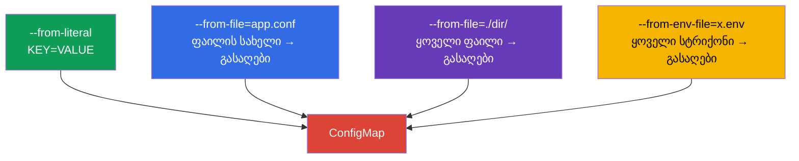
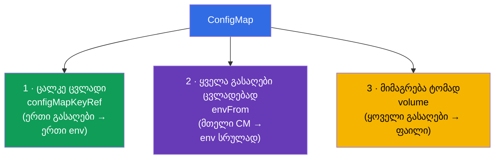
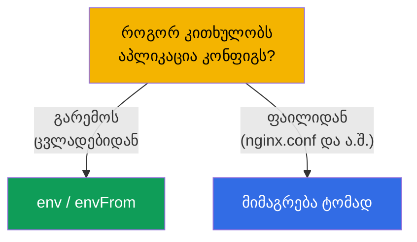
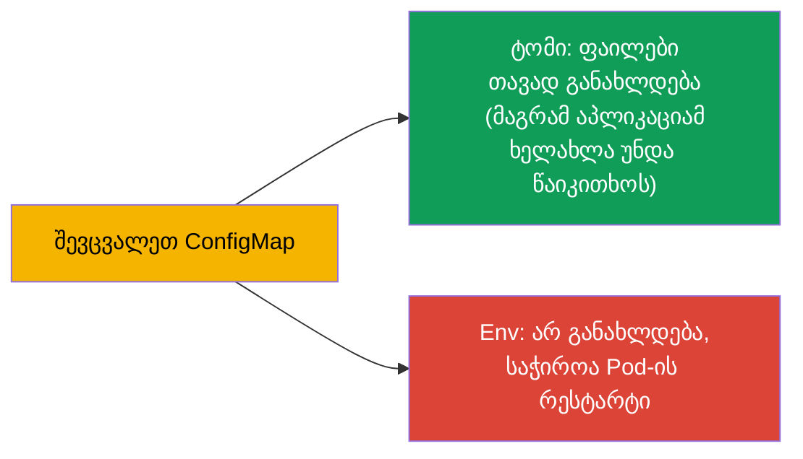

[Русская версия](ru.md) · [Eng version](README.md) · [Versión en español](es.md) · [Version française](fr.md) · [Deutsche Version](de.md)

# თავი 18. ConfigMap

> **რა იქნება შემდეგ.** წინა თავში კონფიგს პირდაპირ Pod-ის მანიფესტში ვსვამდით. ეს ცუდად
> მასშტაბირდება: კონფიგურაცია დუბლირდება, დეპლოიშია ჩაკერებული, ხელახლა გამოყენება არ ხდება.
> **ConfigMap** კონფიგურაციას ცალკე ობიექტში გაიტანს: ერთი ConfigMap - ბევრი Pod,
> კონფიგი გამოყოფილია იმიჯისა და დეპლოისგან. ეს არის დომენის Environment/Config (CKAD, 25%) ბირთვი და
> თემა Workloads (CKA). გავარჩევთ, როგორ იქმნება ConfigMap და სამი ხერხით როგორ მიმაგრდება
> ის Pods-ზე.

## 18.1. რისთვის უნდა კონფიგურაციის გამოყოფა

12-factor app-ის პრინციპი (თავი 17): **კონფიგურაცია გამოიყოფა კოდისგან**. აპლიკაციის იმიჯი
ერთი და იგივე უნდა იყოს ყველა გარემოსთვის, ხოლო განსხვავებები (მისამართები, პარამეტრები, ფლაგები) - გარედან
უნდა მოვიდეს. ConfigMap - ასეთი **არასეკრეტული** კონფიგურაციის საცავია კლასტერში.



მნიშვნელოვანია მაშინვე: ConfigMap - **არასეკრეტული** მონაცემებისთვისაა. პაროლები, ტოკენები, გასაღებები - ეს Secret-ია
(თავი 19). ConfigMap მონაცემებს ღია ტექსტად ინახავს.

## 18.2. რა არის ConfigMap

ConfigMap - ობიექტი გასაღები-მნიშვნელობის წყვილების ნაკრებით (ან მთელი ფაილებით). მნიშვნელობები არის
კონფიგურაციული მონაცემები: ცალკეული პარამეტრები ან კონფიგ-ფაილების შიგთავსი მთლიანად.

```yaml
apiVersion: v1
kind: ConfigMap
metadata:
  name: app-config
data:
  COLOR: "blue"                      # მარტივი გასაღები-მნიშვნელობა
  MAX_CONNECTIONS: "100"
  app.properties: |                  # მთელი ფაილი მნიშვნელობად
    server.port=8080
    log.level=INFO
```

ველების ორი ტიპი: `data` (ტექსტური მონაცემები) და `binaryData` (ბინარული, base64-ში). ჩვეულებრივ
`data`-სთან მუშაობენ.

## 18.3. ConfigMap-ის შექმნა

შექმნის სამი ხერხი, ყველა გვხვდება გამოცდაზე:

```bash
# 1. ლიტერალებიდან (ცალკეული წყვილები)
kubectl create configmap app-config \
  --from-literal=COLOR=blue \
  --from-literal=MAX_CONNECTIONS=100

# 2. ფაილიდან (ფაილის სახელი → გასაღები, შიგთავსი → მნიშვნელობა)
kubectl create configmap app-config --from-file=app.properties

# 3. მთელი კატალოგიდან (ყოველი ფაილი → თავისი გასაღები)
kubectl create configmap app-config --from-file=./config-dir/

# 4. env-ფაილიდან (ყოველი სტრიქონი KEY=VALUE → ცალკე გასაღები)
kubectl create configmap app-config --from-env-file=config.env
```



`--from-file`-სა და `--from-env-file`-ის განსხვავება მნიშვნელოვანია: `--from-file=config.env` შექმნის **ერთ**
გასაღებს `config.env` ფაილის მთელი შიგთავსით, ხოლო `--from-env-file=config.env` ფაილს
სტრიქონობრივად დაშლის **ცალკეულ** გასაღებებად.

## 18.4. ConfigMap-ის Pod-ზე მიმაგრების სამი ხერხი

ეს თავის საკვანძო თემაა. ConfigMap-იდან მონაცემები Pod-ში სამი ხერხით ხვდება.



**ხერხი 1. ცალკე გასაღები → ცალკე ცვლადი** (`configMapKeyRef`):

```yaml
    env:
    - name: APP_COLOR
      valueFrom:
        configMapKeyRef:
          name: app-config
          key: COLOR
```

**ხერხი 2. მთელი ConfigMap → გარემოს ცვლადები** (`envFrom`):

```yaml
    envFrom:
    - configMapRef:
        name: app-config
    # ConfigMap-ის ყოველი გასაღები გახდება გარემოს ცვლადი
```

**ხერხი 3. ConfigMap → ფაილები (ტომი)**:

```yaml
spec:
  containers:
  - name: app
    image: nginx
    volumeMounts:
    - name: config
      mountPath: /etc/config       # აქ გამოჩნდება ფაილები გასაღებების მიხედვით
  volumes:
  - name: config
    configMap:
      name: app-config
```

ტომად მიმაგრებისას ConfigMap-ის ყოველი გასაღები ხდება **ფაილი** `/etc/config`-ში
(`COLOR`, `app.properties` და ა.შ.), ხოლო მნიშვნელობა - ფაილის შიგთავსი.

## 18.5. Env თუ ტომი: როდის რომელი

| ხერხი | რას ვიღებთ | როდის გამოვიყენოთ |
|--------|--------------|--------------------|
| `configMapKeyRef` (env) | ერთი ცვლადი გასაღებიდან | საჭიროა ორიოდე მნიშვნელობა გარემოში |
| `envFrom` (env) | ყველა გასაღები ცვლადებად | მთელი კონფიგი - გარემოში |
| ტომი (volume) | გასაღებები ფაილებად | აპლიკაცია კითხულობს კონფიგ-ფაილს (nginx.conf, application.yaml) |

წესი: თუ აპლიკაცია კითხულობს **კონფიგ-ფაილს**, მიამაგრეთ ConfigMap ტომად. თუ
კონფიგურირდება **გარემოს ცვლადებით** - გამოიყენეთ env/envFrom.



## 18.6. ConfigMap-ის განახლება და მისი აღება

მნიშვნელოვანი ნიუანსი განახლებებზე:

- **ტომად მიმაგრებული** ConfigMap Pod-ში ავტომატურად განახლდება (ConfigMap-ის შეცვლიდან
  გარკვეული დროის შემდეგ ტომში ფაილები შეიცვლება). მაგრამ აპლიკაციას უნდა შეეძლოს ფაილის
  **ხელახლა წაკითხვა** - თავად Kubernetes პროცესს არ გადატვირთავს.
- **გარემოს ცვლადები** ConfigMap-იდან **არ განახლდება** მოძრაობაში - ისინი ფიქსირდება
  კონტეინერის გაშვების დროს. ახალი მნიშვნელობის ასაღებად Pod ხელახლა უნდა შეიქმნას (გადაიტვირთოს
  Deployment).



აქედან მოდის ხშირი ხერხი: ახალი კონფიგის გარანტირებულად გამოსაყენებლად აკეთებენ
`kubectl rollout restart deployment`. პროდში env-კონფიგისთვის ეს ერთადერთი ხერხია
ცვლილებების აღებისთვის.

## 18.7. Immutable ConfigMap

ConfigMap შეიძლება უცვლელი გავხადოთ (`immutable: true`). მაშინ მისი შეცვლა შეუძლებელია - მხოლოდ
წაშლა და ხელახლა შექმნა. ეს იცავს შემთხვევითი ჩასწორებებისგან და **ამცირებს დატვირთვას**
კლასტერზე (kubelet უცვლელი ობიექტების ცვლილებებს არ ადევნებს თვალს).

```yaml
apiVersion: v1
kind: ConfigMap
metadata:
  name: app-config
immutable: true
data:
  COLOR: blue
```

## 18.8. როგორ იყენებენ ამას პროდაქშენში

- **მთელი არასეკრეტული კონფიგურაცია - ConfigMap-ში.** აპლიკაციის პარამეტრები, კონფიგ-ფაილები
  (nginx, fluent-bit, prometheus), ფიჩა-ფლაგები ინახება ConfigMap-ში და ვერსირდება git-ში
  მანიფესტებთან ერთად. ასე ერთი იმიჯი მუშაობს ყველა გარემოში.
- **ფაილური კონფიგები - ტომად.** მსხვილ კონფიგებს (nginx.conf, application.yaml) მიამაგრებენ
  ტომად; წვრილ პარამეტრებს - env-ის საშუალებით. დანიშნულების მიხედვით შერევა - ნორმაა.
- **env-ის განახლების პრობლემა.** პროდის კლასიკური ხაფანგი: ConfigMap შეცვალეს, ხოლო
  აპლიკაცია ცვლილებებს ვერ ხედავს, რადგან მათ env-ის საშუალებით იღებდა (ფიქსირდება გაშვების დროს).
  გამოსავალი - `rollout restart` ან checksum-ანოტაცია Pod-ზე (ConfigMap-ის შეცვლისას
  იცვლება ანოტაცია → Pod ხელახლა იქმნება). Helm ამას შაბლონით აკეთებს.
- **Immutable სტაბილურობისთვის.** დიდ კლასტერებში კრიტიკულ ConfigMap-ებს აკეთებენ
  immutable - ნაკლები დატვირთვაა API/kubelet-ზე და არ არის პროდზე შემთხვევითი ჩასწორების რისკი.
  განახლება მაშინ მიდის ახალი ConfigMap-ის საშუალებით, სახელში ვერსიით.
- **ConfigMap - არა სეკრეტებისთვის.** ConfigMap-ის მონაცემები ღია ტექსტად წევს და ჩანს ყველასთვის,
  ვისაც namespace-ზე წვდომა აქვს. პაროლები/ტოკენები - მხოლოდ Secret-ში (თავი 19).

## 18.9. მინი-ლექსიკონი

- **ConfigMap** - ობიექტი არასეკრეტული კონფიგურაციით (გასაღები-მნიშვნელობები ან ფაილები).
- **data / binaryData** - ConfigMap-ის ტექსტური / ბინარული მონაცემები.
- **configMapKeyRef** - ConfigMap-ის ერთი გასაღების აღება გარემოს ცვლადში.
- **envFrom + configMapRef** - ConfigMap-ის ყველა გასაღები გარემოს ცვლადებად.
- **ტომად მიმაგრება** - ConfigMap-ის გასაღებები ხდება ფაილები კატალოგში.
- **immutable** - უცვლელი ConfigMap (მხოლოდ ხელახლა შექმნა).
- **--from-file / --from-env-file** - ფაილი მთლიანად ერთ გასაღებში / სტრიქონობრივად გასაღებებში.

## 18.10. თავის შეჯამება

- ConfigMap არასეკრეტულ კონფიგურაციას იმიჯიდან და მანიფესტიდან ცალკე ობიექტში გაიტანს;
  ერთი ConfigMap - ბევრი Pod.
- იქმნება ლიტერალებიდან, ფაილიდან, კატალოგიდან ან env-ფაილიდან; `--from-file` იძლევა ერთ გასაღებს,
  `--from-env-file` - ბევრს.
- მიმაგრდება სამი ხერხით: ცალკე გასაღები env-ში (`configMapKeyRef`), მთელი ConfigMap
  env-ში (`envFrom`), მიმაგრება ტომად (გასაღებები → ფაილები).
- ფაილურ კონფიგს - ტომად მიამაგრებენ; გარემოს პარამეტრებს - env/envFrom-ის საშუალებით.
- ტომი ავტომატურად განახლდება (აპლიკაციამ ფაილი ხელახლა უნდა წაიკითხოს); env - არ
  განახლდება, საჭიროა Pod-ის რესტარტი.
- `immutable: true` იცავს ჩასწორებებისგან და ამცირებს დატვირთვას კლასტერზე.
- ConfigMap მონაცემებს ღია ტექსტად ინახავს - არა სეკრეტებისთვის.

## 18.11. როგორ გამოგადგებათ: გამოცდაზე და რეალურ სამუშაოში

**გამოცდაზე.** „შექმენი ConfigMap ლიტერალებიდან/ფაილიდან“, „გადაატარე მნიშვნელობა ცვლადში“,
„მიამაგრე ConfigMap ტომად“ - CKAD-სა და CKA-ს მუდმივი დავალებებია. საჭიროა შექმნის ყველა ხერხისა
და მიმაგრების სამივე ხერხის ცოდნა, ასევე იმის დამახსოვრება, რომ env ConfigMap-იდან მოძრაობაში არ
განახლდება.

**რეალურ სამუშაოში.** ConfigMap - აპლიკაციების კონფიგურაციის შენახვის შტატიანი ხერხია (ერთი
იმიჯი ყველა გარემოსთვის). განსხვავების „ტომი განახლდება / env არა“ გაგება იხსნის კლასიკური
შეცდომისგან „კონფიგი შევცვალე, მაგრამ არაფერი შეიცვალა“. Immutable ConfigMap - ხერხია
დიდი კლასტერების სტაბილურობისა და წარმადობისთვის.

## 18.12. თვითშემოწმების კითხვები

1. რისთვის უნდა კონფიგურაციის ConfigMap-ში გატანა, თუ env პირდაპირ Pod-ში მითითება შეიძლება?
2. რითი განსხვავდება `--from-file=config.env` `--from-env-file=config.env`-ისგან?
3. დაასახელეთ ConfigMap-ის Pod-ზე მიმაგრების სამი ხერხი. როდის რომელი გამოდგება?
4. რა მოხდება მიმაგრებულ ტომთან და env-ცვლადებთან, თუ ConfigMap შეიცვლება?
5. როგორ გამოვიყენოთ გარანტირებულად შეცვლილი ConfigMap, თუ ის env-ის საშუალებით გადაეცემა?
6. რას იძლევა `immutable: true` და როგორ განვაახლოთ მაშინ კონფიგურაცია?
7. რატომ არ შეიძლება ConfigMap-ის გამოყენება პაროლებისა და ტოკენებისთვის?

## პრაქტიკა

ჩვეულებრივი კონფიგურაცია გავიტანეთ. ახლა გავარჩევთ მის სენსიტიურ „ძმას“ - Secret-ს
(თავი 19), რომელსაც მსგავსი მექანიკა აქვს, მაგრამ უსაფრთხოებაში მნიშვნელოვანი განსხვავებებია.
ConfigMap მუშავდება კონფიგურაციის ლაბებში.

🧪 ლაბი 105 (ConfigMap): [tasks/cka/labs/105](../../labs/105/README_GE.MD)

---
[სარჩევი](../README_GE.md) · [თავი 17](../17/ge.md) · [თავი 19](../19/ge.md)
