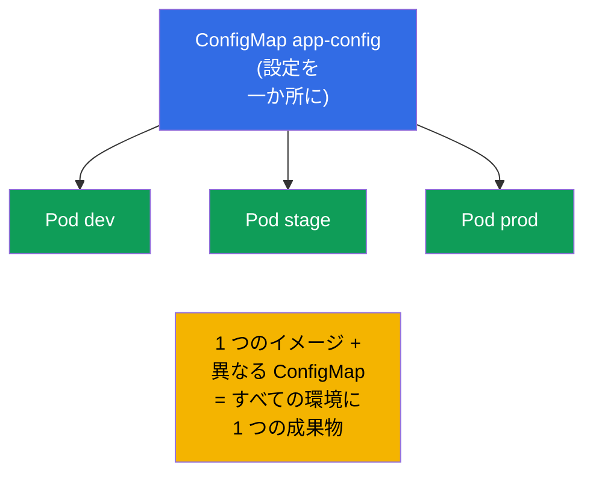
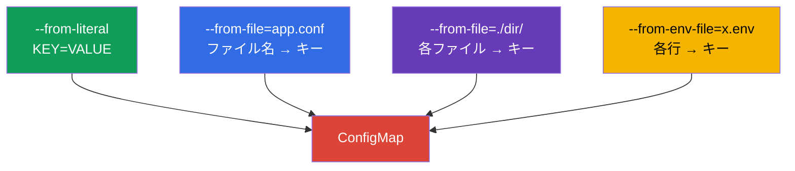
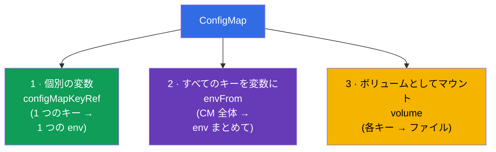
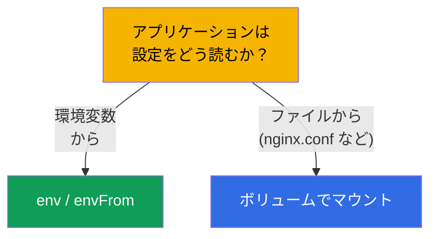
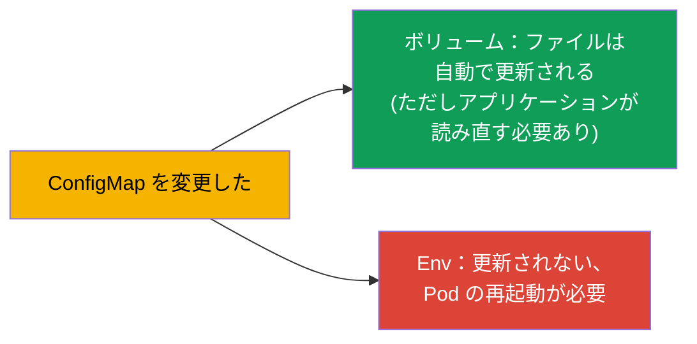

[Русская версия](ru.md) · [Eng version](README.md) · [Versión en español](es.md) · [Version française](fr.md) · [Deutsche Version](de.md) · [ქართული ვერსია](ge.md) · [繁體中文版](tw.md)

# 第 18 章。ConfigMap

> **次は何か。** 前の章では設定を Pod のマニフェストに直接書いていました。これは
> スケールしません：設定が重複し、デプロイに埋め込まれ、再利用できません。
> **ConfigMap** は設定を別のオブジェクトへ切り出します：1 つの ConfigMap - 多数の Pod、
> 設定はイメージからもデプロイからも切り離されます。これは Environment/Config 領域
> (CKAD、25%) の中核であり、Workloads (CKA) のテーマでもあります。ConfigMap の作り方と、
> それを Pod へ 3 通りの方法で結び付けるやり方を見ていきましょう。

## 18.1. 設定を切り離す理由

12-factor app の原則（第 17 章）：**設定はコードから切り離す**。アプリケーションの
イメージはすべての環境で同じものであるべきで、違い（アドレス、パラメータ、フラグ）は
外から来るべきです。ConfigMap は、そうした **秘密でない** 設定をクラスタ内に置く
ための保管場所です。



最初に押さえておくこと：ConfigMap は **秘密でない** データのためのものです。パスワード、
トークン、鍵は Secret（第 19 章）です。ConfigMap はデータを平文で保存します。

## 18.2. ConfigMap とは何か

ConfigMap は、キーと値の組（あるいはファイルそのもの）の集合を持つオブジェクトです。値は
設定データです：個々のパラメータ、または設定ファイルの内容まるごとです。

```yaml
apiVersion: v1
kind: ConfigMap
metadata:
  name: app-config
data:
  COLOR: "blue"                      # 単純なキー-値
  MAX_CONNECTIONS: "100"
  app.properties: |                  # ファイルまるごとを値として
    server.port=8080
    log.level=INFO
```

フィールドは 2 種類：`data`（テキストデータ）と `binaryData`（バイナリ、base64）。ふつうは
`data` を使います。

## 18.3. ConfigMap の作成

作り方は 3 通り（どれも試験に出ます）:

```bash
# 1. リテラルから（個別の組）
kubectl create configmap app-config \
  --from-literal=COLOR=blue \
  --from-literal=MAX_CONNECTIONS=100

# 2. ファイルから（ファイル名 → キー、内容 → 値）
kubectl create configmap app-config --from-file=app.properties

# 3. ディレクトリまるごとから（各ファイル → それぞれのキー）
kubectl create configmap app-config --from-file=./config-dir/

# 4. env ファイルから（KEY=VALUE の各行 → 個別のキー）
kubectl create configmap app-config --from-env-file=config.env
```



`--from-file` と `--from-env-file` の違いは重要です：`--from-file=config.env` は
ファイルの内容すべてを持つ **1 つの** キー `config.env` を作りますが、
`--from-env-file=config.env` はファイルを行ごとに分解して **個別の** キーにします。

## 18.4. ConfigMap を Pod へ結び付ける 3 つの方法

これが本章の中心テーマです。ConfigMap のデータは 3 通りの方法で Pod へ入ります。



**方法 1。個別のキー → 個別の変数**（`configMapKeyRef`）:

```yaml
    env:
    - name: APP_COLOR
      valueFrom:
        configMapKeyRef:
          name: app-config
          key: COLOR
```

**方法 2。ConfigMap 全体 → 環境変数**（`envFrom`）:

```yaml
    envFrom:
    - configMapRef:
        name: app-config
    # ConfigMap の各キーが環境変数になる
```

**方法 3。ConfigMap → ファイル（ボリューム）**:

```yaml
spec:
  containers:
  - name: app
    image: nginx
    volumeMounts:
    - name: config
      mountPath: /etc/config       # ここにキーごとのファイルが現れる
  volumes:
  - name: config
    configMap:
      name: app-config
```

ボリュームとしてマウントすると、ConfigMap の各キーが `/etc/config` の中の **ファイル**
になり（`COLOR`、`app.properties` など）、値がファイルの内容になります。

## 18.5. env とボリューム：どちらをいつ使うか

| 方法 | 得られるもの | いつ使うか |
|--------|--------------|--------------------|
| `configMapKeyRef` (env) | キーから 1 つの変数 | いくつかの値を環境に入れたいとき |
| `envFrom` (env) | すべてのキーを変数として | 設定全体を環境へ渡すとき |
| ボリューム (volume) | キーをファイルとして | アプリケーションが設定ファイルを読むとき (nginx.conf, application.yaml) |

ルール：アプリケーションが **設定ファイル** を読むなら、ConfigMap をボリュームで
マウントします。**環境変数** で設定するなら、env/envFrom を使います。



## 18.6. ConfigMap の更新とその反映

更新についての重要な細かい点:

- **ボリュームでマウントした** ConfigMap は Pod の中で自動的に更新されます（ConfigMap を
  変更してからしばらくすると、ボリューム内のファイルが変わります）。ただしアプリケーションが
  ファイルを **読み直せる** 必要があります - Kubernetes 自体がプロセスを再起動することは
  ありません。
- ConfigMap からの **環境変数** はその場では **更新されません** - コンテナの起動時に
  固定されます。新しい値を反映するには Pod を作り直す必要があります（Deployment を
  再起動する）。



ここからよく使われる手法が出てきます：新しい設定を確実に適用するために
`kubectl rollout restart deployment` を実行します。本番で env 経由の設定の場合、これが
変更を反映する唯一の方法です。

## 18.7. Immutable ConfigMap

ConfigMap を変更不可にできます (`immutable: true`)。そうすると変更はできず、削除して
作り直すしかありません。これは誤った編集から守り、クラスタへの **負荷を下げます**
(kubelet は変更不可オブジェクトの変更を監視しません)。

```yaml
apiVersion: v1
kind: ConfigMap
metadata:
  name: app-config
immutable: true
data:
  COLOR: blue
```

## 18.8. 本番環境でこれをどう使うか

- **秘密でない設定はすべて ConfigMap へ。** アプリケーションのパラメータ、設定ファイル
  (nginx、fluent-bit、prometheus)、フィーチャーフラグは ConfigMap に置き、マニフェストと
  一緒に git でバージョン管理します。こうすれば 1 つのイメージがすべての環境で動きます。
- **ファイル形式の設定はボリュームで。** 大きな設定 (nginx.conf、application.yaml) は
  ボリュームでマウントし、小さなパラメータは env で渡します。用途に応じて混ぜるのは普通です。
- **env の更新問題。** 本番の古典的な罠：ConfigMap を変えたのにアプリケーションが変更を
  見ていない、なぜなら env 経由で取っていたから（起動時に固定される）。解決策は
  `rollout restart` か、Pod への checksum アノテーション（ConfigMap が変わると
  アノテーションが変わる → Pod が作り直される）です。Helm はこれをテンプレートで行います。
- **安定性のための immutable。** 大規模クラスタでは重要な ConfigMap を immutable にします -
  API/kubelet への負荷が減り、本番で誤って編集するリスクもなくなります。
  そのときの更新は、名前にバージョンを入れた新しい ConfigMap 経由で行います。
- **ConfigMap は秘密情報用ではありません。** ConfigMap のデータは平文で置かれ、namespace へ
  アクセスできる全員に見えます。パスワードやトークンは Secret だけです（第 19 章）。

## 18.9. ミニ用語集

- **ConfigMap** - 秘密でない設定を持つオブジェクト（キー-値、またはファイル）。
- **data / binaryData** - ConfigMap のテキストデータ / バイナリデータ。
- **configMapKeyRef** - ConfigMap の 1 つのキーを環境変数に取り込む。
- **envFrom + configMapRef** - ConfigMap のすべてのキーを環境変数として。
- **ボリュームでのマウント** - ConfigMap のキーがディレクトリ内のファイルになる。
- **immutable** - 変更不可な ConfigMap（作り直しのみ）。
- **--from-file / --from-env-file** - ファイルまるごとを 1 つのキーに / 行ごとにキーに。

## 18.10. 本章のまとめ

- ConfigMap は秘密でない設定をイメージとマニフェストから別のオブジェクトへ切り出します。
  1 つの ConfigMap - 多数の Pod。
- リテラル、ファイル、ディレクトリ、env ファイルから作れます。`--from-file` はキーを
  1 つ作り、`--from-env-file` は多数作ります。
- 結び付け方は 3 通り：個別のキーを env へ (`configMapKeyRef`)、ConfigMap 全体を env へ
  (`envFrom`)、ボリュームでマウント（キー → ファイル）。
- ファイル形式の設定はボリュームでマウントし、環境のパラメータは env/envFrom で渡します。
- ボリュームは自動で更新されます（アプリケーションがファイルを読み直す必要あり）。env は
  更新されず、Pod の再起動が必要です。
- `immutable: true` は編集から守り、クラスタへの負荷を下げます。
- ConfigMap はデータを平文で保存します - 秘密情報用ではありません。

## 18.11. これがどう役に立つか：試験と実際の仕事で

**試験では。** 「リテラル/ファイルから ConfigMap を作れ」「値を変数に渡せ」
「ConfigMap をボリュームとしてマウントせよ」は CKAD と CKA の定番の課題です。作成方法の
すべてと結び付け方 3 通りのすべてを知っておく必要があり、さらに ConfigMap 由来の env は
その場では更新されないことも覚えておく必要があります。

**実際の仕事では。** ConfigMap はアプリケーションの設定を保管する標準的な方法です（1 つの
イメージですべての環境へ）。「ボリュームは更新される / env はされない」の違いを理解して
いれば、「設定を変えたのに何も変わらない」という古典的なミスを避けられます。Immutable
ConfigMap は、大規模クラスタの安定性と性能のための手法です。

## 18.12. 自己チェックの質問

1. Pod に直接 env を書けるのに、なぜ設定を ConfigMap へ切り出すのですか？
2. `--from-file=config.env` は `--from-env-file=config.env` とどう違いますか？
3. ConfigMap を Pod へ結び付ける 3 つの方法を挙げてください。どれがどんなときに適切ですか？
4. ConfigMap を変更すると、マウントしたボリュームと env 変数はそれぞれどうなりますか？
5. env 経由で渡している ConfigMap の変更を、確実に適用するにはどうしますか？
6. `immutable: true` は何をもたらし、そのとき設定はどう更新しますか？
7. なぜ ConfigMap をパスワードやトークンに使ってはいけないのですか？

## 演習

ふつうの設定は切り出しました。次はその機密版の「兄弟」である Secret（第 19 章）を見ます。
仕組みは似ていますが、セキュリティ面で重要な違いがあります。
ConfigMap は設定関連のラボで練習します。

🧪 ラボ 105 (ConfigMap): [tasks/cka/labs/105](../../labs/105/README_JP.MD)

---
[目次](../README_JP.md) · [第 17 章](../17/jp.md) · [第 19 章](../19/jp.md)
