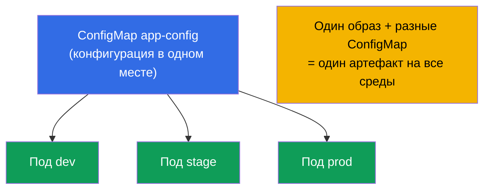
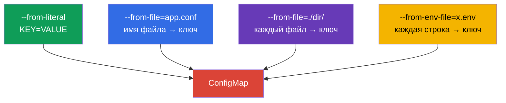
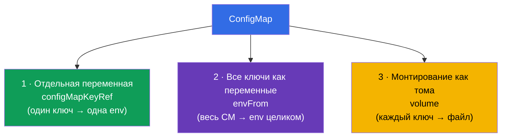
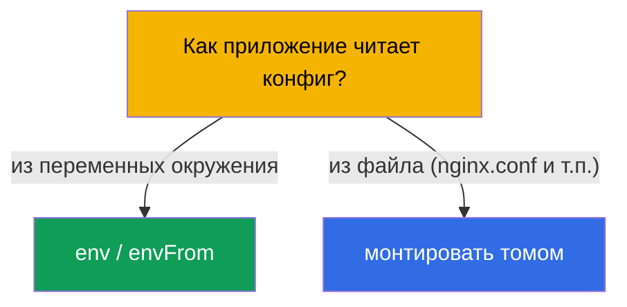
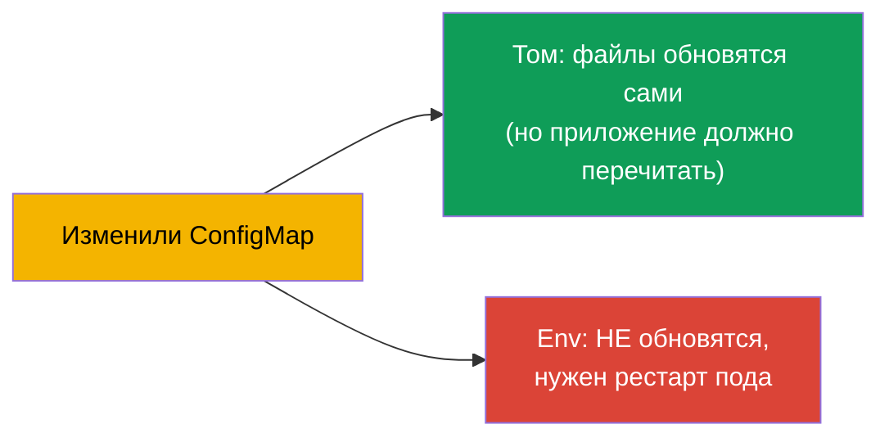

# Глава 18. ConfigMap

> **Что дальше.** В прошлой главе конфиг мы задавали прямо в манифесте пода. Это плохо
> масштабируется: конфигурация дублируется, зашита в деплой, её нельзя переиспользовать.
> **ConfigMap** выносит конфигурацию в отдельный объект: один ConfigMap - много подов,
> конфиг отделён от образа и от деплоя. Это ядро домена Environment/Config (CKAD, 25%) и
> тема Workloads (CKA). Разберём, как создавать ConfigMap и тремя способами подключать
> его к подам.

## 18.1. Зачем отделять конфигурацию

Принцип 12-factor app (глава 17): **конфигурация отделяется от кода**. Образ приложения
должен быть один и тот же для всех сред, а различия (адреса, параметры, флаги) - приходить
снаружи. ConfigMap - это хранилище такой **несекретной** конфигурации в кластере.



Важно сразу: ConfigMap - для **несекретных** данных. Пароли, токены, ключи - это Secret
(глава 19). ConfigMap хранит данные открытым текстом.

## 18.2. Что такое ConfigMap

ConfigMap - объект с набором пар ключ-значение (или целых файлов). Значения - это
конфигурационные данные: отдельные параметры или содержимое конфиг-файлов целиком.

```yaml
apiVersion: v1
kind: ConfigMap
metadata:
  name: app-config
data:
  COLOR: "blue"                      # простой ключ-значение
  MAX_CONNECTIONS: "100"
  app.properties: |                  # целый файл как значение
    server.port=8080
    log.level=INFO
```

Два типа полей: `data` (текстовые данные) и `binaryData` (бинарные, в base64). Обычно
работают с `data`.

## 18.3. Создание ConfigMap

Три способа создать, все встречаются на экзамене:

```bash
# 1. Из литералов (отдельные пары)
kubectl create configmap app-config \
  --from-literal=COLOR=blue \
  --from-literal=MAX_CONNECTIONS=100

# 2. Из файла (имя файла → ключ, содержимое → значение)
kubectl create configmap app-config --from-file=app.properties

# 3. Из целого каталога (каждый файл → свой ключ)
kubectl create configmap app-config --from-file=./config-dir/

# 4. Из env-файла (каждая строка KEY=VALUE → отдельный ключ)
kubectl create configmap app-config --from-env-file=config.env
```



Разница `--from-file` и `--from-env-file` важна: `--from-file=config.env` создаст **один**
ключ `config.env` со всем содержимым файла, а `--from-env-file=config.env` разберёт файл
построчно на **отдельные** ключи.

## 18.4. Три способа подключить ConfigMap к поду

Это ключевая тема главы. Данные из ConfigMap попадают в под тремя способами.



**Способ 1. Отдельный ключ → отдельная переменная** (`configMapKeyRef`):

```yaml
    env:
    - name: APP_COLOR
      valueFrom:
        configMapKeyRef:
          name: app-config
          key: COLOR
```

**Способ 2. Весь ConfigMap → переменные окружения** (`envFrom`):

```yaml
    envFrom:
    - configMapRef:
        name: app-config
    # каждый ключ ConfigMap станет переменной окружения
```

**Способ 3. ConfigMap → файлы (том)**:

```yaml
spec:
  containers:
  - name: app
    image: nginx
    volumeMounts:
    - name: config
      mountPath: /etc/config       # тут появятся файлы по ключам
  volumes:
  - name: config
    configMap:
      name: app-config
```

При монтировании томом каждый ключ ConfigMap становится **файлом** в `/etc/config`
(`COLOR`, `app.properties` и т.д.), а значение - содержимым файла.

## 18.5. Env против тома: когда что

| Способ | Что получаем | Когда использовать |
|--------|--------------|--------------------|
| `configMapKeyRef` (env) | одна переменная из ключа | нужно пару значений в окружение |
| `envFrom` (env) | все ключи как переменные | весь конфиг - в окружение |
| том (volume) | ключи как файлы | приложение читает конфиг-файл (nginx.conf, application.yaml) |

Правило: если приложение читает **конфиг-файл**, монтируйте ConfigMap томом. Если
конфигурируется **переменными окружения** - используйте env/envFrom.



## 18.6. Обновление ConfigMap и его подхват

Важная тонкость про обновления:

- **Смонтированные томом** ConfigMap обновляются в поде автоматически (через некоторое
  время после изменения ConfigMap файлы в томе поменяются). Но приложение должно уметь
  **перечитывать** файл - само Kubernetes процесс не перезапускает.
- **Переменные окружения** из ConfigMap **не обновляются** на лету - они фиксируются при
  старте контейнера. Чтобы подхватить новое значение, под нужно пересоздать (перезапустить
  Deployment).



Отсюда частый приём: чтобы гарантированно применить новый конфиг, делают
`kubectl rollout restart deployment`. В проде для env-конфига это единственный способ
подхватить изменения.

## 18.7. Immutable ConfigMap

Можно сделать ConfigMap неизменяемым (`immutable: true`). Тогда его нельзя менять - только
удалить и создать заново. Это защищает от случайных правок и **снижает нагрузку** на
кластер (kubelet не следит за изменениями неизменяемых объектов).

```yaml
apiVersion: v1
kind: ConfigMap
metadata:
  name: app-config
immutable: true
data:
  COLOR: blue
```

## 18.8. Как это применяют в продакшене

- **Вся несекретная конфигурация - в ConfigMap.** Параметры приложения, конфиг-файлы
  (nginx, fluent-bit, prometheus), фиче-флаги хранят в ConfigMap и версионируют в git
  вместе с манифестами. Так один образ работает во всех средах.
- **Файловые конфиги - томом.** Крупные конфиги (nginx.conf, application.yaml) монтируют
  томом; мелкие параметры - через env. Смешивать по назначению - норма.
- **Проблема обновления env.** Классическая ловушка прода: поменяли ConfigMap, а
  приложение не видит изменений, потому что тянуло их через env (фиксируются при старте).
  Решение - `rollout restart` или checksum-аннотация на поде (при изменении ConfigMap
  меняется аннотация → под пересоздаётся). Helm это делает шаблоном.
- **Immutable для стабильности.** В больших кластерах критичные ConfigMap делают
  immutable - меньше нагрузка на API/kubelet и нет риска случайной правки на проде.
  Обновление тогда идёт через новый ConfigMap с версией в имени.
- **ConfigMap - не для секретов.** Данные ConfigMap лежат открытым текстом и видны всем,
  у кого есть доступ к namespace. Пароли/токены - только в Secret (глава 19).

## 18.9. Мини-глоссарий

- **ConfigMap** - объект с несекретной конфигурацией (ключи-значения или файлы).
- **data / binaryData** - текстовые / бинарные данные ConfigMap.
- **configMapKeyRef** - взять один ключ ConfigMap в переменную окружения.
- **envFrom + configMapRef** - все ключи ConfigMap как переменные окружения.
- **монтирование томом** - ключи ConfigMap становятся файлами в каталоге.
- **immutable** - неизменяемый ConfigMap (только пересоздание).
- **--from-file / --from-env-file** - файл целиком в один ключ / построчно в ключи.

## 18.10. Итоги главы

- ConfigMap выносит несекретную конфигурацию из образа и манифеста в отдельный объект;
  один ConfigMap - много подов.
- Создаётся из литералов, файла, каталога или env-файла; `--from-file` даёт один ключ,
  `--from-env-file` - много.
- Подключается тремя способами: отдельный ключ в env (`configMapKeyRef`), весь ConfigMap
  в env (`envFrom`), монтирование томом (ключи → файлы).
- Файловый конфиг - монтируют томом; параметры окружения - через env/envFrom.
- Том обновляется автоматически (приложение должно перечитать файл); env - не
  обновляется, нужен рестарт пода.
- `immutable: true` защищает от правок и снижает нагрузку на кластер.
- ConfigMap хранит данные открытым текстом - не для секретов.

## 18.11. Как это пригодится: на экзамене и в реальной работе

**На экзамене.** «Создай ConfigMap из литералов/файла», «пробрось значение в переменную»,
«смонтируй ConfigMap как том» - постоянные задания CKAD и CKA. Нужно знать все способы
создания и все три способа подключения, а также помнить, что env из ConfigMap не
обновляется на лету.

**В реальной работе.** ConfigMap - штатный способ хранить конфигурацию приложений (один
образ на все среды). Понимание разницы «том обновляется / env нет» спасает от классической
ошибки «поменял конфиг, а ничего не изменилось». Immutable ConfigMap - приём для
стабильности и производительности больших кластеров.

## 18.12. Вопросы для самопроверки

1. Зачем выносить конфигурацию в ConfigMap, если можно задать env прямо в поде?
2. Чем `--from-file=config.env` отличается от `--from-env-file=config.env`?
3. Назовите три способа подключить ConfigMap к поду. Когда какой уместен?
4. Что произойдёт со смонтированным томом и с env-переменными, если изменить ConfigMap?
5. Как гарантированно применить изменённый ConfigMap, если он пробрасывается через env?
6. Что даёт `immutable: true` и как тогда обновлять конфигурацию?
7. Почему ConfigMap нельзя использовать для паролей и токенов?

## Практика

Мы вынесли обычную конфигурацию. Теперь разберём её чувствительного «брата» - Secret
(глава 19), у которого механика похожая, но есть важные отличия по безопасности.
ConfigMap отрабатывается в лабах по конфигурации.

🧪 Лаба 105 (ConfigMap): [tasks/cka/labs/105](../../labs/105/README_RU.MD)

---
[Оглавление](../README_RU.md) · [Глава 17](../17/ru.md) · [Глава 19](../19/ru.md)
