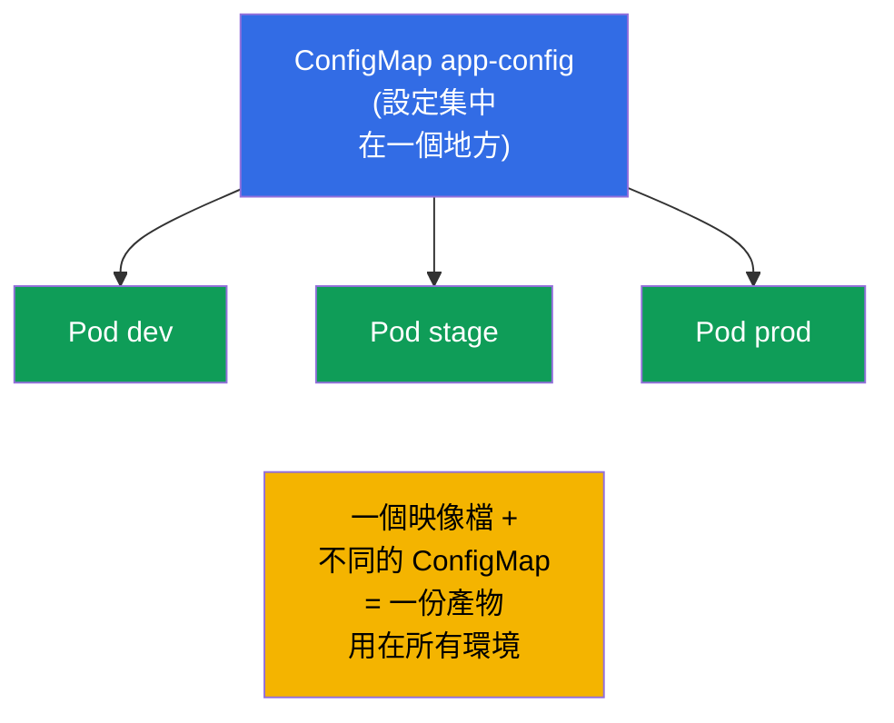
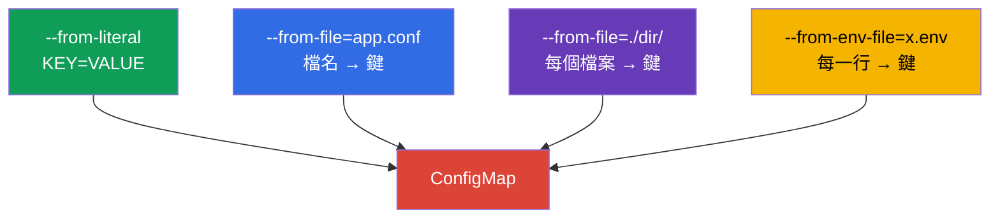
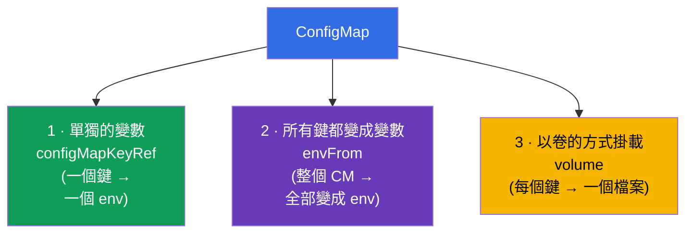
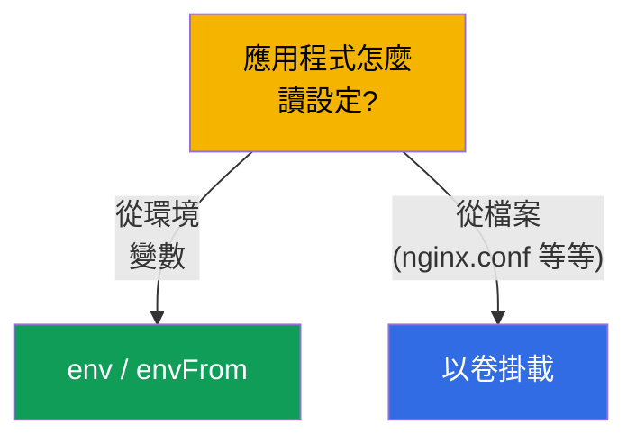
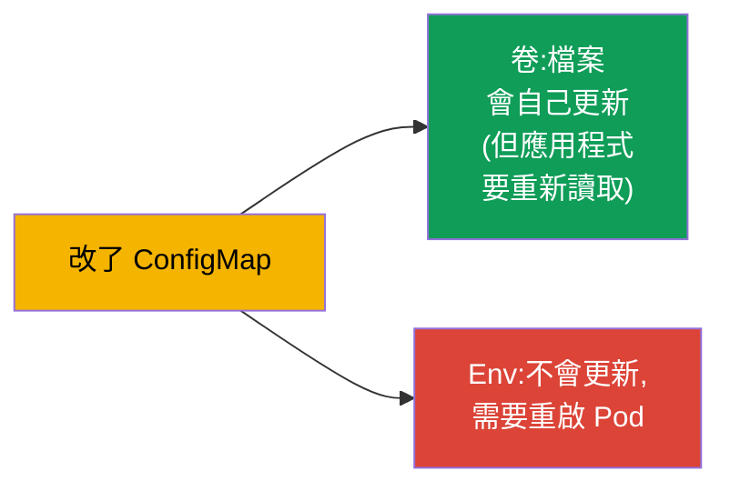

[Русская версия](ru.md) · [Eng version](README.md) · [Versión en español](es.md) · [Version française](fr.md) · [Deutsche Version](de.md) · [ქართული ვერსია](ge.md) · [日本語版](jp.md)

# 第 18 章。ConfigMap

> **接下來是什麼。** 上一章我們把設定直接寫在 Pod 的 manifest 裡。這樣很難
> 擴展:設定被重複複製、寫死在部署裡,而且無法重用。
> **ConfigMap** 把設定抽離成獨立的物件:一個 ConfigMap - 很多 Pod,
> 設定與映像檔、與部署都分開。這是 Environment/Config 領域(CKAD,25%)的核心,
> 也是 Workloads(CKA)的主題。我們會弄懂如何建立 ConfigMap,以及用三種方式把
> 它接到 Pod 上。

## 18.1. 為什麼要把設定分離出來

12-factor app 原則(第 17 章):**設定要與程式碼分離**。應用程式的映像檔
在所有環境中都應該是同一個,而差異(位址、參數、旗標)- 從外部傳進來。
ConfigMap 就是叢集裡存放這種 **非機密** 設定的地方。



先講清楚:ConfigMap 是給 **非機密** 資料用的。密碼、token、金鑰要放 Secret
(第 19 章)。ConfigMap 以明文儲存資料。

## 18.2. 什麼是 ConfigMap

ConfigMap 是一個帶著一組鍵值對(或整個檔案)的物件。值就是
設定資料:單獨的參數,或是整個設定檔的內容。

```yaml
apiVersion: v1
kind: ConfigMap
metadata:
  name: app-config
data:
  COLOR: "blue"                      # 簡單的鍵值對
  MAX_CONNECTIONS: "100"
  app.properties: |                  # 整個檔案作為值
    server.port=8080
    log.level=INFO
```

有兩種欄位:`data`(文字資料)與 `binaryData`(二進位,base64 編碼)。通常
都用 `data`。

## 18.3. 建立 ConfigMap

有三種建立方式,考試上都會遇到:

```bash
# 1. 從字面值(單獨的配對)
kubectl create configmap app-config \
  --from-literal=COLOR=blue \
  --from-literal=MAX_CONNECTIONS=100

# 2. 從檔案(檔名 → 鍵,內容 → 值)
kubectl create configmap app-config --from-file=app.properties

# 3. 從整個目錄(每個檔案 → 各自的鍵)
kubectl create configmap app-config --from-file=./config-dir/

# 4. 從 env 檔案(每一行 KEY=VALUE → 各自的鍵)
kubectl create configmap app-config --from-env-file=config.env
```



`--from-file` 與 `--from-env-file` 的差別很重要:`--from-file=config.env` 會建立
**一個** 鍵 `config.env`,值是整個檔案的內容;而 `--from-env-file=config.env` 會
逐行解析檔案,拆成 **各自獨立** 的鍵。

## 18.4. 把 ConfigMap 接到 Pod 的三種方式

這是本章的關鍵主題。ConfigMap 的資料有三種方式進到 Pod 裡。



**方式 1。單一鍵 → 單一變數**(`configMapKeyRef`):

```yaml
    env:
    - name: APP_COLOR
      valueFrom:
        configMapKeyRef:
          name: app-config
          key: COLOR
```

**方式 2。整個 ConfigMap → 環境變數**(`envFrom`):

```yaml
    envFrom:
    - configMapRef:
        name: app-config
    # ConfigMap 的每個鍵都會變成環境變數
```

**方式 3。ConfigMap → 檔案(卷)**:

```yaml
spec:
  containers:
  - name: app
    image: nginx
    volumeMounts:
    - name: config
      mountPath: /etc/config       # 這裡會依鍵出現檔案
  volumes:
  - name: config
    configMap:
      name: app-config
```

以卷掛載時,ConfigMap 的每個鍵都會在 `/etc/config` 裡變成一個 **檔案**
(`COLOR`、`app.properties` 等等),而值就是檔案的內容。

## 18.5. env 對比卷:什麼時候用哪個

| 方式 | 得到什麼 | 什麼時候用 |
|--------|--------------|--------------------|
| `configMapKeyRef`(env) | 由一個鍵產生一個變數 | 只需要把幾個值放進環境 |
| `envFrom`(env) | 所有鍵都變成變數 | 整份設定都要進環境 |
| 卷(volume) | 鍵變成檔案 | 應用程式讀設定檔(nginx.conf、application.yaml) |

規則:如果應用程式讀的是 **設定檔**,就用卷掛載 ConfigMap。如果它是靠
**環境變數** 設定的 - 就用 env/envFrom。



## 18.6. 更新 ConfigMap 以及它何時被吃到

關於更新有個重要的細節:

- **以卷掛載的** ConfigMap 在 Pod 裡會自動更新(ConfigMap 改動之後過一段
  時間,卷裡的檔案就會跟著變)。但應用程式必須自己會 **重新讀取**
  檔案 - Kubernetes 本身不會重啟行程。
- 來自 ConfigMap 的 **環境變數** **不會** 即時更新 - 它們在容器啟動時就固定
  下來了。要吃到新的值,必須重建 Pod(重啟 Deployment)。



因此有個常見手法:要確保新設定生效,就做
`kubectl rollout restart deployment`。在生產環境裡,對 env 形式的設定來說,這是
吃到變更的唯一辦法。

## 18.7. Immutable ConfigMap

可以把 ConfigMap 設成不可變更(`immutable: true`)。這樣就不能修改它 - 只能
刪掉再重新建立。這能防止意外的改動,並且 **降低** 叢集的負擔
(kubelet 不會去追蹤不可變更物件的變化)。

```yaml
apiVersion: v1
kind: ConfigMap
metadata:
  name: app-config
immutable: true
data:
  COLOR: blue
```

## 18.8. 這在生產環境中如何應用

- **所有非機密設定都放 ConfigMap。** 應用程式參數、設定檔
  (nginx、fluent-bit、prometheus)、feature flag 都存在 ConfigMap 裡,並和
  manifest 一起在 git 中做版本控制。這樣同一個映像檔就能在所有環境運作。
- **檔案型設定用卷。** 大型設定(nginx.conf、application.yaml)用卷掛載;
  小參數 - 走 env。依用途混搭是常態。
- **env 更新的問題。** 生產環境的經典陷阱:改了 ConfigMap,可是
  應用程式看不到變化,因為它是透過 env 取值的(啟動時就固定了)。
  解法是 `rollout restart`,或在 Pod 上放 checksum 註解(ConfigMap 一改
  註解就跟著變 → Pod 被重建)。Helm 用模板來做這件事。
- **用 immutable 換穩定。** 在大型叢集裡,關鍵的 ConfigMap 會設成
  immutable - 對 API/kubelet 的負擔較小,也沒有在生產上被意外改動的風險。
  這時更新就改成用名稱帶版本的新 ConfigMap。
- **ConfigMap 不是給機密用的。** ConfigMap 的資料是明文存放,任何
  有 namespace 存取權的人都看得到。密碼/token - 只能放 Secret(第 19 章)。

## 18.9. 迷你詞彙表

- **ConfigMap** - 帶著非機密設定的物件(鍵值對或檔案)。
- **data / binaryData** - ConfigMap 的文字 / 二進位資料。
- **configMapKeyRef** - 把 ConfigMap 的一個鍵取進環境變數。
- **envFrom + configMapRef** - ConfigMap 的所有鍵都變成環境變數。
- **以卷掛載** - ConfigMap 的鍵在目錄裡變成檔案。
- **immutable** - 不可變更的 ConfigMap(只能重建)。
- **--from-file / --from-env-file** - 整個檔案進一個鍵 / 逐行拆成多個鍵。

## 18.10. 本章總結

- ConfigMap 把非機密設定從映像檔與 manifest 抽離成獨立的物件;
  一個 ConfigMap - 很多 Pod。
- 可以從字面值、檔案、目錄或 env 檔案建立;`--from-file` 給出一個鍵,
  `--from-env-file` 給出很多個。
- 有三種接法:單一鍵進 env(`configMapKeyRef`)、整個 ConfigMap
  進 env(`envFrom`)、以卷掛載(鍵 → 檔案)。
- 檔案型設定 - 用卷掛載;環境參數 - 走 env/envFrom。
- 卷會自動更新(應用程式要重新讀檔案);env - 不會
  更新,需要重啟 Pod。
- `immutable: true` 防止改動,並降低叢集負擔。
- ConfigMap 以明文儲存資料 - 不適合放機密。

## 18.11. 這些知識用在哪裡:考試與實際工作

**在考試上。**「從字面值/檔案建立 ConfigMap」、「把值傳進變數」、
「把 ConfigMap 掛載成卷」- 這些是 CKAD 與 CKA 的常駐題目。要知道所有
建立方式與全部三種接法,也要記得來自 ConfigMap 的 env 不會
即時更新。

**在實際工作中。** ConfigMap 是存放應用程式設定的標準做法(一個
映像檔用在所有環境)。理解「卷會更新 / env 不會」的差別,能救你躲開經典
錯誤「改了設定,結果什麼都沒變」。Immutable ConfigMap 是給大型叢集
換取穩定與效能的手法。

## 18.12. 自我檢查問題

1. 既然可以直接在 Pod 裡指定 env,為什麼還要把設定搬進 ConfigMap?
2. `--from-file=config.env` 與 `--from-env-file=config.env` 有什麼不同?
3. 說出把 ConfigMap 接到 Pod 的三種方式。什麼情況適合用哪一種?
4. 如果改動 ConfigMap,掛載的卷與 env 變數會發生什麼事?
5. 如果 ConfigMap 是透過 env 傳進去的,要怎麼確保改動生效?
6. `immutable: true` 帶來什麼,那時又要怎麼更新設定?
7. 為什麼 ConfigMap 不能用來放密碼與 token?

## 實踐

我們把普通的設定抽離出來了。現在來看它敏感的「兄弟」- Secret
(第 19 章),它的機制類似,但在安全性上有重要的差異。
ConfigMap 會在設定相關的實驗中操練。

🧪 實驗 105(ConfigMap):[tasks/cka/labs/105](../../labs/105/README_TW.MD)

---
[目錄](../README_TW.md) · [第 17 章](../17/tw.md) · [第 19 章](../19/tw.md)
