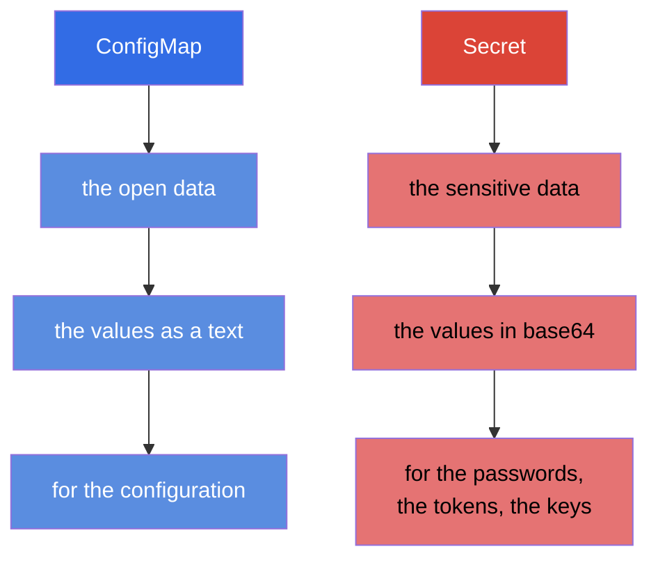
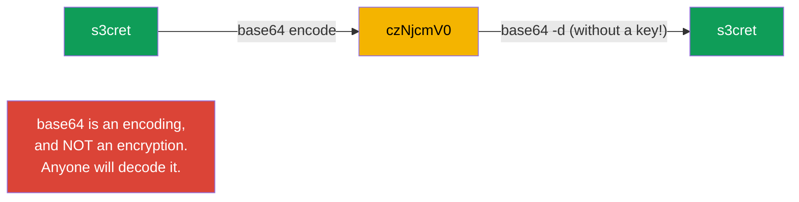
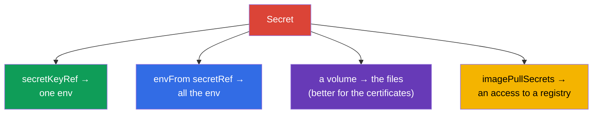
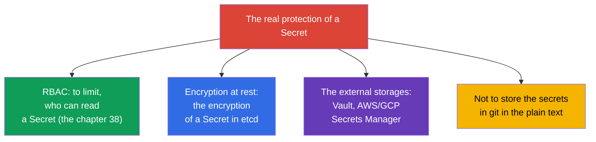

[Русская версия](ru.md) · [Versión en español](es.md) · [Version française](fr.md) · [Deutsche Version](de.md) · [ქართული ვერსია](ge.md) · [繁體中文版](tw.md) · [日本語版](jp.md)

# Chapter 19. Secret

> **What comes next.** A ConfigMap stores the open data. But the passwords, the tokens, the keys and
> the certificates cannot be stored this way. For the sensitive data there is a **Secret** - mechanically
> it is very similar to a ConfigMap, but it has its own peculiarities and, most importantly, the important
> reservations about the security. This is the topic of the domain Environment/Config/Security (CKAD) and
> Security (CKA). The key thing that has to be mastered and not forgotten on the exam: **base64 is not
> an encryption**.

## 19.1. A Secret against a ConfigMap

The idea is the same as with a ConfigMap: the pairs key-value, connected to the Pods. The differences:



| | ConfigMap | Secret |
|---|-----------|--------|
| The purpose | a non-secret configuration | the passwords, the tokens, the keys, the certificates |
| The encoding of the values | a text (`data`) | base64 (`data`), or a text in `stringData` |
| The storing in etcd | in the plain text | by default also almost openly (see the 19.6) |
| The ways of the connection | env, envFrom, a volume | env, envFrom, a volume (the same ones!) |

The ways of the connection to a Pod are identical to a ConfigMap - therefore here we will focus on the
differences, and not repeat the mechanics.

## 19.2. The main delusion: base64 ≠ an encryption

The values in the `Secret.data` are stored in **base64**. Many think that this is a protection. This is not
so: base64 is just an encoding, reversible by one command without any key at all.

```bash
echo -n 's3cret' | base64          # → czNjcmV0
echo -n 'czNjcmV0' | base64 -d     # → s3cret  (anyone will decode it)
```



> **Remember this dead firmly.** The base64 in a Secret is needed in order to store the binary data and
> the "non-printable" symbols, and not in order to hide. The real protection of the secrets is the RBAC (who
> can read a Secret), the encryption of etcd at rest and the external storages of the secrets (the section
> 19.6). The answer "a Secret is secure, because base64" on an interview and on the exam is a mistake.

## 19.3. The creation of a Secret

```bash
# From the literals (kubectl itself will encode into base64)
kubectl create secret generic db-secret \
  --from-literal=username=admin \
  --from-literal=password=s3cret

# From a file
kubectl create secret generic tls-secret --from-file=./tls.key

# A TLS secret (a special type)
kubectl create secret tls my-tls --cert=tls.crt --key=tls.key

# A secret for an access to a private registry of the images
kubectl create secret docker-registry regcred \
  --docker-server=registry.example.com \
  --docker-username=user --docker-password=pass
```

In a manifest the values have to be encoded by oneself in the `data`, or one has to use the `stringData`
(there one writes in the plain text, Kubernetes will encode it itself):

```yaml
apiVersion: v1
kind: Secret
metadata:
  name: db-secret
type: Opaque
data:
  password: czNjcmV0            # base64 by hand
stringData:
  username: admin               # in the plain text, will be encoded automatically
```

## 19.4. The types of a Secret

A Secret has the field `type` - it hints to Kubernetes the purpose and requires the certain
keys.

| The type | The purpose | The mandatory keys |
|-----|-----------|--------------------|
| `Opaque` | the arbitrary data (by default) | any |
| `kubernetes.io/tls` | a TLS certificate and a key (for an Ingress) | `tls.crt`, `tls.key` |
| `kubernetes.io/dockerconfigjson` | an access to a private registry | `.dockerconfigjson` |
| `kubernetes.io/service-account-token` | a token of a ServiceAccount | is generated |
| `kubernetes.io/basic-auth` | a login/a password | `username`, `password` |
| `kubernetes.io/ssh-auth` | an SSH key | `ssh-privatekey` |

The most frequent ones are the `Opaque` (the general case), the `tls` (for an Ingress, the chapter 32) and
the `dockerconfigjson` (to pull the images from a private registry).

## 19.5. The connection of a Secret to a Pod

The mechanics is the same as with a ConfigMap (the chapter 18): the three ways.

```yaml
# 1. A separate key into a variable
    env:
    - name: DB_PASSWORD
      valueFrom:
        secretKeyRef:
          name: db-secret
          key: password

# 2. The whole Secret into the environment variables
    envFrom:
    - secretRef:
        name: db-secret

# 3. A secret as the files (a volume)
spec:
  containers:
  - name: app
    volumeMounts:
    - name: secret-vol
      mountPath: /etc/secret
      readOnly: true
  volumes:
  - name: secret-vol
    secret:
      secretName: db-secret
```

Separately there is the `imagePullSecrets`, in order to pull an image from a private registry:

```yaml
spec:
  imagePullSecrets:
  - name: regcred
  containers:
  - name: app
    image: registry.example.com/app:1.0
```



> **A practical advice.** The secrets are better to be mounted by a **volume**, and not to be passed through the
> env. The environment variables "leak" more easily - they are visible in the `kubectl describe`, in the dumps of the
> processes, in the logs upon a debugging, they are inherited by the child processes. A file in a volume is neater
> and is updated upon a change of the Secret (the env - is not, as with a ConfigMap too).

## 19.6. How to protect the secrets for real

Since base64 does not protect, what to protect oneself with in reality? This is a favourite question "for an understanding".



- **The RBAC** - is the main thing: to limit, who at all can read the Secrets in a namespace.
- **The encryption at rest** - to set up the encryption of the Secrets in etcd (otherwise they lie there
  almost openly). It is configured in the config of the API server.
- **The external managers** - HashiCorp Vault, AWS/GCP/Azure Secrets Manager + the operators
  (External Secrets Operator), in order for the secrets to live outside of the cluster and to be pulled up on a request.
- **The GitOps security** - into git the secrets are not put in an open form; one uses the
  Sealed Secrets, the SOPS and so on.

## 19.7. How this is applied in the production

- **The secrets are not stored in git openly.** The main rule of the production: no passwords in the
  manifests in the repository. One uses the Sealed Secrets/the SOPS (encrypted in git) or the
  External Secrets Operator (pulls from Vault/Secrets Manager into the cluster).
- **The external storages as a source of the truth.** The mature teams keep the secrets in Vault or in a
  cloud Secrets Manager, and into the cluster they get by a synchronization. This way a secret
  is rotated centrally and is not "smeared" over the manifests.
- **The encryption of etcd is mandatory.** In the production one turns on the encryption at rest for a Secret -
  otherwise a dump of etcd or a backup reveals all the passwords in the plain text.
- **The RBAC strictly on a Secret.** An access for the reading of a Secret is given minimally: an ordinary developer
  must not read the production secrets. This is one of the first things that is checked upon an audit of the
  security.
- **One limits the `exec` on the Pods with the secrets.** The rights for the reading of the Secret itself are not enough -
  a secret can be obtained also through an access to a working Pod: the `kubectl exec` gives a shell,
  from where the environment variables (the `env`) and the mounted files of the secrets are visible, while the
  `kubectl debug` allows to plant into a Pod an **ephemeral container** and to reach the same
  data "from the side". Therefore in the production the rights `pods/exec`, `pods/attach` and
  `pods/ephemeralcontainers` (the ephemeral containers) on the namespaces with the sensitive
  workloads are given out as strictly as the reading of a Secret, - otherwise the RBAC on the Secret itself
  is bypassed through an access to a Pod. For the same reason the secrets are preferred to be mounted by the
  files, and not to be put into the env (the environment variables are easier to "leak" accidentally into the logs, the dumps and
  through the `exec`).
- **The mounting by a volume and the rotation.** The secrets are mounted by the files (they are updated automatically),
  and the applications are designed in such a way as to pick up again an updated secret (for example, upon a
  rotation of the TLS certificates by the cert-manager).

## 19.8. A mini glossary

- **Secret** - an object for the sensitive data (the passwords, the tokens, the keys, the certificates).
- **base64** - the encoding of the values of a Secret; NOT an encryption.
- **stringData** - a field for the values in the plain text (they are encoded automatically).
- **type** - the purpose of a Secret (Opaque, tls, dockerconfigjson and others).
- **secretKeyRef / secretRef** - a connection of a key/of the whole Secret into the env.
- **imagePullSecrets** - a secret for an access to a private registry of the images.
- **encryption at rest** - the encryption of a Secret in etcd.
- **External Secrets / Vault / SOPS / Sealed Secrets** - the tools of the real protection of the
  secrets.

## 19.9. The summary of the chapter

- A Secret is arranged like a ConfigMap, but it is for the sensitive data; the ways of the connection (env,
  envFrom, a volume) are the same.
- The values are stored in base64 - this is an encoding, and not an encryption: anyone will decode it by one
  command.
- It is created from the literals/the files; the types: the Opaque (the general one), the tls (an Ingress), the dockerconfigjson
  (a registry) and others. The `stringData` allows to write the values in the plain text.
- The secrets are better to be mounted by a volume, than through the env (the env leaks more easily and is not updated).
- The `imagePullSecrets` gives a Pod an access to a private registry.
- The real protection: the RBAC on the reading, the encryption at rest in etcd, the external managers (Vault,
  Secrets Manager), not to store the secrets in git openly.

## 19.10. How this will come in handy: on the exam and in the real work

**On the exam.** "Create a Secret from the literals", "pass a password into a variable/a volume",
"create a TLS secret for an Ingress", "set up an access to a private registry" are the frequent tasks.
It is obligatory to remember that base64 does not protect, and to be able to encode/to decode the values.
The mechanics of the connection carry over from the ConfigMap.

**In the real work.** The work with the secrets is a question of the security of the whole system. An understanding
that base64 is not a protection leads to the correct decisions: the RBAC, the encryption of etcd, the external
storages, a refusal of the secrets in git. The mounting by a volume and a thought-out rotation are the standard
of a reliable operation.

## 19.11. Self-check questions

1. In what does a Secret differ from a ConfigMap and what do they have in common?
2. Why is the base64 in a Secret not a protection? How to check this?
3. What is the `stringData` needed for and in what is it more convenient than the `data`?
4. Name the main types of a Secret and their purpose.
5. Why are the secrets preferably to be mounted by a volume, and not to be passed through the env?
6. What is the `imagePullSecrets` and when is it needed?
7. By what ways are the secrets protected for real?

## Practice

We have taken apart the storing of the secrets. In the chapter 20 we will pass over to the security on the level of a
container - the SecurityContext and the capabilities: under what user a process works and
what privileges it has. A Secret is drilled in the labs on the configuration and the security.

🧪 Lab 105 (Secret): [tasks/cka/labs/105](../../labs/105/README.MD)

---
[Contents](../README.md) · [Chapter 18](../18/README.md) · [Chapter 20](../20/README.md)
