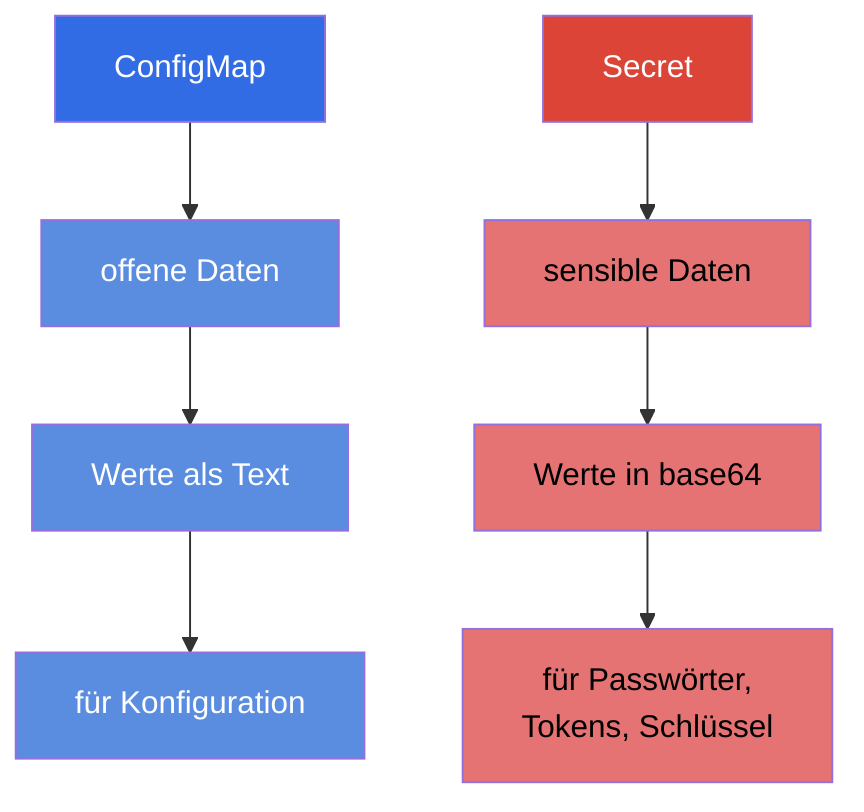
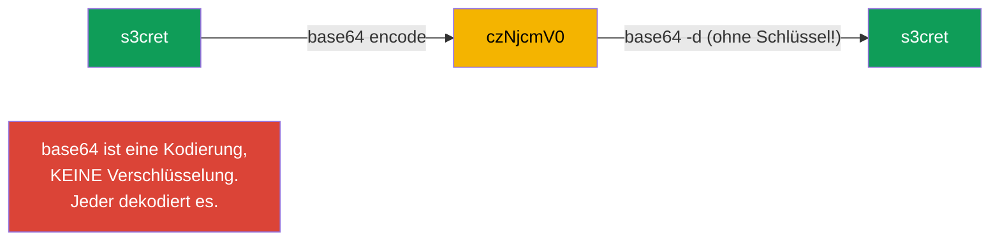
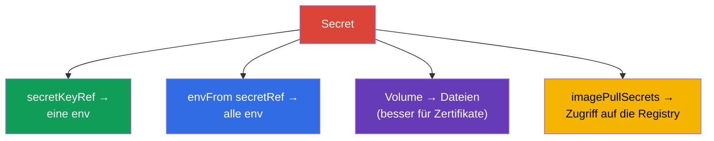
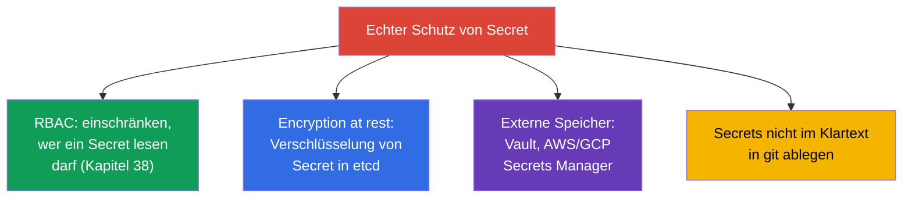

[Русская версия](ru.md) · [Eng version](README.md) · [Versión en español](es.md) · [Version française](fr.md) · [ქართული ვერსია](ge.md) · [繁體中文版](tw.md) · [日本語版](jp.md)

# Kapitel 19. Secret

> **Was kommt.** Eine ConfigMap speichert offene Daten. Passwörter, Tokens, Schlüssel und
> Zertifikate darf man so aber nicht ablegen. Für sensible Daten gibt es **Secret** -
> mechanisch ist es einer ConfigMap sehr ähnlich, hat aber eigene Besonderheiten und vor
> allem wichtige Einschränkungen bei der Sicherheit. Das ist das Thema der Domäne
> Environment/Config/Security (CKAD) und Security (CKA). Das Wichtigste, was man sich
> einprägen und in der Prüfung nicht vergessen darf: **base64 ist keine Verschlüsselung**.

## 19.1. Secret gegen ConfigMap

Die Idee ist dieselbe wie bei ConfigMap: Schlüssel-Wert-Paare, die an Pods angebunden
werden. Die Unterschiede:



| | ConfigMap | Secret |
|---|-----------|--------|
| Zweck | nicht geheime Konfiguration | Passwörter, Tokens, Schlüssel, Zertifikate |
| Kodierung der Werte | Text (`data`) | base64 (`data`) oder Text in `stringData` |
| Speicherung in etcd | im Klartext | standardmäßig ebenfalls fast offen (siehe 19.6) |
| Wege des Anbindens | env, envFrom, Volume | env, envFrom, Volume (dieselben!) |

Die Wege, ein Secret an einen Pod anzubinden, sind identisch mit ConfigMap - deshalb
konzentrieren wir uns hier auf die Unterschiede und wiederholen die Mechanik nicht.

## 19.2. Das größte Missverständnis: base64 ≠ Verschlüsselung

Die Werte in `Secret.data` werden in **base64** gespeichert. Viele halten das für Schutz.
Das ist nicht so: base64 ist einfach eine Kodierung, umkehrbar mit einem Befehl und ohne
jeden Schlüssel.

```bash
echo -n 's3cret' | base64          # → czNjcmV0
echo -n 'czNjcmV0' | base64 -d     # → s3cret  (jeder kann es dekodieren)
```



> **Merken Sie sich das fest.** base64 wird im Secret gebraucht, um binäre Daten und „nicht
> druckbare“ Zeichen zu speichern, und nicht um etwas zu verbergen. Echter Schutz von
> Secrets besteht aus RBAC (wer ein Secret lesen darf), Verschlüsselung von etcd at rest
> und externen Secret-Speichern (Abschnitt 19.6). Die Antwort „Secret ist sicher, weil
> base64“ ist im Bewerbungsgespräch und in der Prüfung ein Fehler.

## 19.3. Erstellen eines Secret

```bash
# Aus Literalen (kubectl kodiert selbst in base64)
kubectl create secret generic db-secret \
  --from-literal=username=admin \
  --from-literal=password=s3cret

# Aus einer Datei
kubectl create secret generic tls-secret --from-file=./tls.key

# TLS-Secret (spezieller Typ)
kubectl create secret tls my-tls --cert=tls.crt --key=tls.key

# Secret für den Zugriff auf eine private Image-Registry
kubectl create secret docker-registry regcred \
  --docker-server=registry.example.com \
  --docker-username=user --docker-password=pass
```

Im Manifest muss man die Werte für `data` selbst kodieren oder `stringData` verwenden (dort
schreibt man im Klartext, Kubernetes kodiert selbst):

```yaml
apiVersion: v1
kind: Secret
metadata:
  name: db-secret
type: Opaque
data:
  password: czNjcmV0            # base64 von Hand
stringData:
  username: admin               # im Klartext, wird automatisch kodiert
```

## 19.4. Typen von Secret

Ein Secret hat das Feld `type` - es zeigt Kubernetes den Zweck an und verlangt bestimmte
Schlüssel.

| Typ | Zweck | Pflichtschlüssel |
|-----|-----------|--------------------|
| `Opaque` | beliebige Daten (Standard) | beliebige |
| `kubernetes.io/tls` | TLS-Zertifikat und Schlüssel (für Ingress) | `tls.crt`, `tls.key` |
| `kubernetes.io/dockerconfigjson` | Zugriff auf eine private Registry | `.dockerconfigjson` |
| `kubernetes.io/service-account-token` | Token eines ServiceAccount | wird generiert |
| `kubernetes.io/basic-auth` | Login/Passwort | `username`, `password` |
| `kubernetes.io/ssh-auth` | SSH-Schlüssel | `ssh-privatekey` |

Die häufigsten sind `Opaque` (der allgemeine Fall), `tls` (für Ingress, Kapitel 32) und
`dockerconfigjson` (Images aus einer privaten Registry ziehen).

## 19.5. Ein Secret an einen Pod anbinden

Die Mechanik ist dieselbe wie bei ConfigMap (Kapitel 18): drei Wege.

```yaml
# 1. Einzelner Schlüssel in eine Variable
    env:
    - name: DB_PASSWORD
      valueFrom:
        secretKeyRef:
          name: db-secret
          key: password

# 2. Das ganze Secret in Umgebungsvariablen
    envFrom:
    - secretRef:
        name: db-secret

# 3. Secret als Dateien (Volume)
spec:
  containers:
  - name: app
    volumeMounts:
    - name: secret-vol
      mountPath: /etc/secret
      readOnly: true
  volumes:
  - name: secret-vol
    secret:
      secretName: db-secret
```

Gesondert steht `imagePullSecrets`, um ein Image aus einer privaten Registry zu ziehen:

```yaml
spec:
  imagePullSecrets:
  - name: regcred
  containers:
  - name: app
    image: registry.example.com/app:1.0
```



> **Praktischer Rat.** Secrets bindet man besser als **Volume** ein, statt sie über env
> durchzugeben. Umgebungsvariablen „lecken“ leichter - sie sind in `kubectl describe`, in
> Prozess-Dumps und beim Debuggen in Logs sichtbar und werden an Kindprozesse vererbt. Eine
> Datei im Volume ist sauberer und wird bei Änderung des Secret aktualisiert (env nicht,
> genau wie bei ConfigMap).

## 19.6. Wie man Secrets wirklich schützt

Wenn base64 nicht schützt, womit schützt man sich dann wirklich? Das ist eine
Lieblingsfrage „zum Verständnis“.



- **RBAC** - das Wichtigste: einschränken, wer überhaupt Secrets in einem Namespace lesen
  darf.
- **Encryption at rest** - die Verschlüsselung von Secrets in etcd einrichten (sonst liegen
  sie dort fast offen). Wird in der Konfiguration des API-Servers eingestellt.
- **Externe Manager** - HashiCorp Vault, AWS/GCP/Azure Secrets Manager + Operatoren
  (External Secrets Operator), damit die Secrets außerhalb des Clusters leben und bei
  Bedarf nachgezogen werden.
- **GitOps-Sicherheit** - in git legt man Secrets nicht im Klartext ab; man nutzt
  Sealed Secrets, SOPS usw.

## 19.7. Wie man das in der Produktion anwendet

- **Secrets werden nicht offen in git gehalten.** Die wichtigste Regel der Produktion:
  keine Passwörter in Manifesten im Repository. Man nutzt Sealed Secrets/SOPS
  (verschlüsselt in git) oder den External Secrets Operator (zieht aus Vault/Secrets
  Manager in den Cluster).
- **Externe Speicher als Quelle der Wahrheit.** Reife Teams halten Secrets in Vault oder
  einem Cloud-Secrets-Manager, und in den Cluster gelangen sie über Synchronisation. So
  wird ein Secret zentral rotiert und ist nicht über die Manifeste „verschmiert“.
- **Verschlüsselung von etcd ist Pflicht.** In der Produktion schaltet man encryption at
  rest für Secret ein - sonst legt ein Dump von etcd oder ein Backup alle Passwörter im
  Klartext offen.
- **RBAC streng auf Secret.** Leserechte auf Secret gibt man minimal: ein normaler
  Entwickler darf keine Produktions-Secrets lesen. Das ist eines der ersten Dinge, die bei
  einem Sicherheitsaudit geprüft werden.
- **Sie schränken `exec` auf Pods mit Secrets ein.** Rechte zum Lesen des Secret selbst
  sind zu wenig - ein Secret lässt sich auch über den Zugriff auf einen laufenden Pod
  holen: `kubectl exec` gibt eine Shell, aus der man Umgebungsvariablen (`env`) und
  eingebundene Secret-Dateien sieht, und `kubectl debug` erlaubt, einen **ephemeren
  Container** in den Pod zu setzen und „von der Seite“ an dieselben Daten zu kommen.
  Deshalb werden in der Produktion die Rechte `pods/exec`, `pods/attach` und
  `pods/ephemeralcontainers` (ephemere Container) auf Namespaces mit sensiblen Workloads
  genauso streng vergeben wie das Lesen von Secret - sonst wird RBAC auf das Secret selbst
  über den Zugriff auf den Pod umgangen. Aus demselben Grund bindet man Secrets besser als
  Dateien ein, statt sie in env zu legen (Umgebungsvariablen „lecken“ leichter versehentlich
  in Logs, Dumps und über `exec`).
- **Einbinden als Volume und Rotation.** Secrets bindet man als Dateien ein (sie werden
  automatisch aktualisiert), und Anwendungen entwirft man so, dass sie ein aktualisiertes
  Secret neu übernehmen (zum Beispiel bei der Rotation von TLS-Zertifikaten durch
  cert-manager).

## 19.8. Mini-Glossar

- **Secret** - Objekt für sensible Daten (Passwörter, Tokens, Schlüssel, Zertifikate).
- **base64** - Kodierung der Werte eines Secret; KEINE Verschlüsselung.
- **stringData** - Feld für Werte im Klartext (werden automatisch kodiert).
- **type** - Zweck des Secret (Opaque, tls, dockerconfigjson u. a.).
- **secretKeyRef / secretRef** - Anbinden eines Schlüssels / des ganzen Secret in env.
- **imagePullSecrets** - Secret für den Zugriff auf eine private Image-Registry.
- **encryption at rest** - Verschlüsselung von Secret in etcd.
- **External Secrets / Vault / SOPS / Sealed Secrets** - Werkzeuge für den echten Schutz
  von Secrets.

## 19.9. Zusammenfassung des Kapitels

- Secret ist wie eine ConfigMap aufgebaut, aber für sensible Daten; die Wege des Anbindens
  (env, envFrom, Volume) sind dieselben.
- Die Werte werden in base64 gespeichert - das ist eine Kodierung, keine Verschlüsselung:
  jeder dekodiert sie mit einem Befehl.
- Es wird aus Literalen/Dateien erstellt; Typen: Opaque (allgemein), tls (Ingress),
  dockerconfigjson (Registry) u. a. `stringData` erlaubt, Werte im Klartext zu schreiben.
- Secrets bindet man besser als Volume ein als über env (env leckt leichter und wird nicht
  aktualisiert).
- `imagePullSecrets` gibt dem Pod Zugriff auf eine private Registry.
- Echter Schutz: RBAC auf das Lesen, encryption at rest in etcd, externe Manager (Vault,
  Secrets Manager), Secrets nicht offen in git halten.

## 19.10. Wofür das nützlich ist: in der Prüfung und in der echten Arbeit

**In der Prüfung.** „Erstelle ein Secret aus Literalen“, „gib das Passwort in eine
Variable/ein Volume durch“, „erstelle ein TLS-Secret für Ingress“, „richte den Zugriff auf
eine private Registry ein“ - das sind häufige Aufgaben. Man muss unbedingt daran denken,
dass base64 nicht schützt, und Werte kodieren/dekodieren können. Die Mechanik des Anbindens
übernehmen Sie von ConfigMap.

**In der echten Arbeit.** Die Arbeit mit Secrets ist eine Frage der Sicherheit des gesamten
Systems. Das Verständnis, dass base64 kein Schutz ist, führt zu richtigen Entscheidungen:
RBAC, Verschlüsselung von etcd, externe Speicher, Verzicht auf Secrets in git. Einbinden
als Volume und eine durchdachte Rotation sind der Standard eines zuverlässigen Betriebs.

## 19.11. Fragen zur Selbstüberprüfung

1. Worin unterscheidet sich Secret von ConfigMap und was haben sie gemeinsam?
2. Warum ist base64 im Secret kein Schutz? Wie prüft man das?
3. Wofür braucht man `stringData` und warum ist es bequemer als `data`?
4. Nennen Sie die wichtigsten Typen von Secret und ihren Zweck.
5. Warum bindet man Secrets besser als Volume ein, statt sie über env durchzugeben?
6. Was ist `imagePullSecrets` und wann braucht man es?
7. Mit welchen Mitteln schützt man Secrets wirklich?

## Praxis

Wir haben die Speicherung von Secrets behandelt. In Kapitel 20 gehen wir zur Sicherheit auf
Container-Ebene über - SecurityContext und capabilities: unter welchem Benutzer der Prozess
läuft und welche Privilegien er hat. Secret wird in den Labs zu Konfiguration und
Sicherheit geübt.

🧪 Lab 105 (Secret): [tasks/cka/labs/105](../../labs/105/README_DE.MD)

---
[Inhalt](../README_DE.md) · [Kapitel 18](../18/de.md) · [Kapitel 20](../20/de.md)
