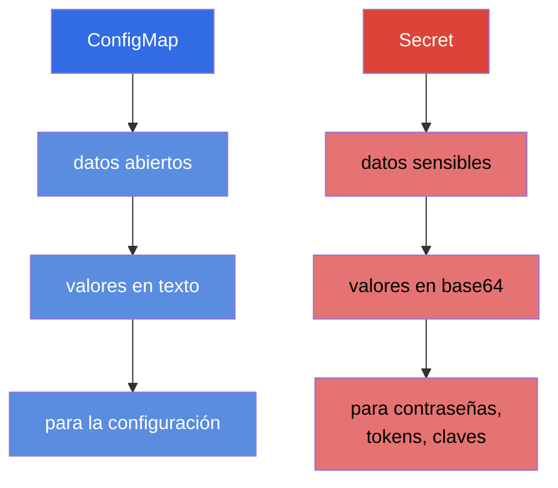
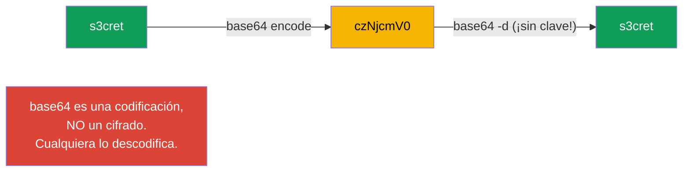
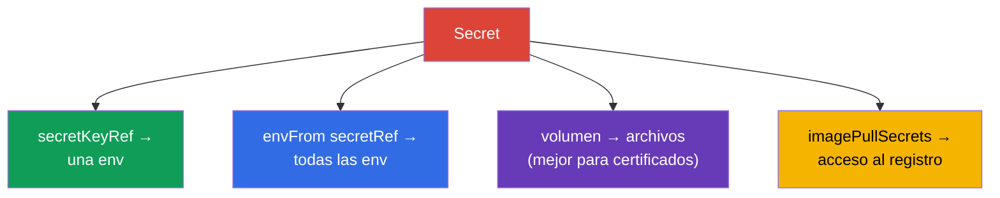
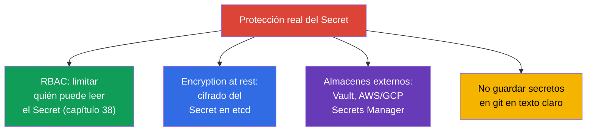

[Русская версия](ru.md) · [Eng version](README.md) · [Version française](fr.md) · [Deutsche Version](de.md) · [ქართული ვერსია](ge.md)

# Capítulo 19. Secret

> **Qué viene ahora.** ConfigMap guarda datos abiertos. Pero las contraseñas, los tokens, las
> claves y los certificados no se pueden guardar así. Para los datos sensibles existe el
> **Secret**: mecánicamente se parece mucho a un ConfigMap, pero tiene sus particularidades y,
> sobre todo, advertencias importantes sobre seguridad. Es el tema del dominio
> Environment/Config/Security (CKAD) y Security (CKA). Lo esencial que hay que asimilar y no
> olvidar en el examen: **base64 no es cifrado**.

## 19.1. Secret frente a ConfigMap

La idea es la misma que en ConfigMap: pares clave-valor que se conectan a los Pods. Las
diferencias:



| | ConfigMap | Secret |
|---|-----------|--------|
| Propósito | configuración no secreta | contraseñas, tokens, claves, certificados |
| Codificación de los valores | texto (`data`) | base64 (`data`), o texto en `stringData` |
| Almacenamiento en etcd | en texto claro | por defecto también casi abierto (ver 19.6) |
| Formas de conexión | env, envFrom, volumen | env, envFrom, volumen (¡las mismas!) |

Las formas de conectarlo a un Pod son idénticas a las de ConfigMap, así que aquí nos centraremos
en las diferencias en lugar de repetir la mecánica.

## 19.2. El gran malentendido: base64 ≠ cifrado

Los valores de `Secret.data` se guardan en **base64**. Mucha gente cree que eso es protección. No
lo es: base64 es simplemente una codificación, reversible con un solo comando y sin ninguna clave.

```bash
echo -n 's3cret' | base64          # → czNjcmV0
echo -n 'czNjcmV0' | base64 -d     # → s3cret  (cualquiera lo descodifica)
```



> **Grábatelo a fuego.** base64 en un Secret sirve para guardar datos binarios y caracteres «no
> imprimibles», no para ocultar nada. La protección real de los secretos es RBAC (quién puede leer
> el Secret), el cifrado de etcd at rest y los almacenes de secretos externos (apartado 19.6). La
> respuesta «el Secret es seguro porque es base64» en una entrevista o en el examen es un error.

## 19.3. Creación de un Secret

```bash
# A partir de literales (kubectl codifica en base64 por ti)
kubectl create secret generic db-secret \
  --from-literal=username=admin \
  --from-literal=password=s3cret

# A partir de un archivo
kubectl create secret generic tls-secret --from-file=./tls.key

# Secret TLS (tipo especial)
kubectl create secret tls my-tls --cert=tls.crt --key=tls.key

# Secret para acceder a un registro de imágenes privado
kubectl create secret docker-registry regcred \
  --docker-server=registry.example.com \
  --docker-username=user --docker-password=pass
```

En un manifiesto hay que codificar los valores a mano en `data`, o bien usar `stringData` (ahí se
escriben en texto claro y Kubernetes los codifica por su cuenta):

```yaml
apiVersion: v1
kind: Secret
metadata:
  name: db-secret
type: Opaque
data:
  password: czNjcmV0            # base64 a mano
stringData:
  username: admin               # en texto claro, se codificará automáticamente
```

## 19.4. Tipos de Secret

El Secret tiene un campo `type`: le indica a Kubernetes su propósito y exige determinadas claves.

| Tipo | Propósito | Claves obligatorias |
|-----|-----------|--------------------|
| `Opaque` | datos arbitrarios (por defecto) | cualesquiera |
| `kubernetes.io/tls` | certificado y clave TLS (para Ingress) | `tls.crt`, `tls.key` |
| `kubernetes.io/dockerconfigjson` | acceso a un registro privado | `.dockerconfigjson` |
| `kubernetes.io/service-account-token` | token de ServiceAccount | se genera |
| `kubernetes.io/basic-auth` | usuario/contraseña | `username`, `password` |
| `kubernetes.io/ssh-auth` | clave SSH | `ssh-privatekey` |

Los más frecuentes son `Opaque` (el caso general), `tls` (para Ingress, capítulo 32) y
`dockerconfigjson` (descargar imágenes de un registro privado).

## 19.5. Conectar un Secret a un Pod

La mecánica es la misma que en ConfigMap (capítulo 18): tres formas.

```yaml
# 1. Una clave suelta en una variable
    env:
    - name: DB_PASSWORD
      valueFrom:
        secretKeyRef:
          name: db-secret
          key: password

# 2. Todo el Secret en variables de entorno
    envFrom:
    - secretRef:
        name: db-secret

# 3. El secreto como archivos (volumen)
spec:
  containers:
  - name: app
    volumeMounts:
    - name: secret-vol
      mountPath: /etc/secret
      readOnly: true
  volumes:
  - name: secret-vol
    secret:
      secretName: db-secret
```

Aparte queda `imagePullSecrets`, para descargar una imagen de un registro privado:

```yaml
spec:
  imagePullSecrets:
  - name: regcred
  containers:
  - name: app
    image: registry.example.com/app:1.0
```



> **Consejo práctico.** Es mejor montar los secretos como **volumen** que pasarlos por env. Las
> variables de entorno se «filtran» con más facilidad: se ven en `kubectl describe`, en los volcados
> de procesos, en los logs durante la depuración, y las heredan los procesos hijos. Un archivo en un
> volumen es más limpio y se actualiza cuando cambia el Secret (env no, igual que en ConfigMap).

## 19.6. Cómo proteger de verdad los secretos

Si base64 no protege, ¿con qué se protege uno realmente? Es la pregunta favorita «de comprensión».



- **RBAC** - lo principal: limitar quién puede leer los Secret de un namespace.
- **Encryption at rest** - configurar el cifrado de los Secret en etcd (si no, quedan ahí casi
  abiertos). Se configura en el archivo de configuración del servidor de API.
- **Gestores externos** - HashiCorp Vault, AWS/GCP/Azure Secrets Manager + operadores
  (External Secrets Operator), para que los secretos vivan fuera del clúster y se traigan a demanda.
- **Seguridad en GitOps** - en git los secretos no se guardan en claro; se usan
  Sealed Secrets, SOPS y similares.

## 19.7. Cómo se aplica esto en producción

- **Los secretos no se guardan en git en claro.** La regla de oro en producción: ninguna contraseña
  en los manifiestos del repositorio. Se usan Sealed Secrets/SOPS (cifrados en git) o el
  External Secrets Operator (que los trae de Vault/Secrets Manager al clúster).
- **Los almacenes externos como fuente de verdad.** Los equipos maduros guardan los secretos en
  Vault o en un Secrets Manager en la nube, y llegan al clúster por sincronización. Así el secreto
  se rota de forma centralizada y no queda «desparramado» por los manifiestos.
- **El cifrado de etcd es obligatorio.** En producción se activa encryption at rest para los
  Secret: si no, un volcado de etcd o una copia de seguridad revela todas las contraseñas en claro.
- **RBAC estricto sobre los Secret.** El permiso de lectura de Secret se da al mínimo: un
  desarrollador normal no debería leer los secretos de producción. Es una de las primeras cosas que
  se revisan en una auditoría de seguridad.
- **Se limita el `exec` a los Pods con secretos.** Con restringir la lectura del propio Secret no
  basta: el secreto también se puede obtener mediante acceso a un Pod en ejecución. `kubectl exec`
  da una shell desde la que se ven las variables de entorno (`env`) y los archivos de secretos
  montados, y `kubectl debug` permite inyectar en el Pod un **contenedor efímero** y llegar a esos
  mismos datos «por el lateral». Por eso en producción los permisos `pods/exec`, `pods/attach` y
  `pods/ephemeralcontainers` (contenedores efímeros) sobre los namespaces con cargas sensibles se
  conceden con el mismo rigor que la lectura de Secret; si no, el RBAC sobre el propio Secret se
  esquiva a través del acceso al Pod. Por la misma razón se prefiere montar los secretos como
  archivos en lugar de ponerlos en env (las variables de entorno se «filtran» más fácilmente a los
  logs, a los volcados y a través de `exec`).
- **Montaje como volumen y rotación.** Los secretos se montan como archivos (se actualizan
  automáticamente) y las aplicaciones se diseñan para recoger de nuevo el secreto actualizado (por
  ejemplo, en la rotación de certificados TLS por parte de cert-manager).

## 19.8. Mini-glosario

- **Secret** - objeto para datos sensibles (contraseñas, tokens, claves, certificados).
- **base64** - codificación de los valores de un Secret; NO es cifrado.
- **stringData** - campo para valores en texto claro (se codifican automáticamente).
- **type** - propósito del Secret (Opaque, tls, dockerconfigjson y otros).
- **secretKeyRef / secretRef** - conectar una clave/todo el Secret en env.
- **imagePullSecrets** - secreto para acceder a un registro de imágenes privado.
- **encryption at rest** - cifrado de los Secret en etcd.
- **External Secrets / Vault / SOPS / Sealed Secrets** - herramientas de protección real de los
  secretos.

## 19.9. Resumen del capítulo

- El Secret está construido como un ConfigMap, pero para datos sensibles; las formas de conexión
  (env, envFrom, volumen) son las mismas.
- Los valores se guardan en base64: es una codificación, no un cifrado; cualquiera los descodifica
  con un solo comando.
- Se crea a partir de literales/archivos; tipos: Opaque (general), tls (Ingress), dockerconfigjson
  (registro) y otros. `stringData` permite escribir los valores en texto claro.
- Es mejor montar los secretos como volumen que pasarlos por env (env se filtra más fácilmente y no
  se actualiza).
- `imagePullSecrets` da al Pod acceso a un registro privado.
- Protección real: RBAC para la lectura, encryption at rest en etcd, gestores externos (Vault,
  Secrets Manager) y no guardar los secretos en git en claro.

## 19.10. Para qué te servirá: en el examen y en el trabajo real

**En el examen.** «Crea un Secret a partir de literales», «pasa la contraseña a una variable/a un
volumen», «crea un secreto TLS para Ingress», «configura el acceso a un registro privado» son
tareas frecuentes. Hay que recordar sin falta que base64 no protege, y saber codificar y
descodificar valores. La mecánica de conexión trasládala de ConfigMap.

**En el trabajo real.** El trabajo con secretos es una cuestión de seguridad de todo el sistema.
Entender que base64 no es protección lleva a decisiones correctas: RBAC, cifrado de etcd, almacenes
externos y renunciar a los secretos en git. El montaje como volumen y una rotación bien pensada son
el estándar de una explotación fiable.

## 19.11. Preguntas de autoevaluación

1. ¿En qué se diferencia un Secret de un ConfigMap y qué tienen en común?
2. ¿Por qué base64 en un Secret no es protección? ¿Cómo comprobarlo?
3. ¿Para qué sirve `stringData` y en qué resulta más cómodo que `data`?
4. Nombra los principales tipos de Secret y su propósito.
5. ¿Por qué es preferible montar los secretos como volumen en lugar de pasarlos por env?
6. ¿Qué es `imagePullSecrets` y cuándo hace falta?
7. ¿De qué formas se protegen los secretos de verdad?

## Práctica

Hemos visto el almacenamiento de secretos. En el capítulo 20 pasaremos a la seguridad a nivel de
contenedor - SecurityContext y capabilities: con qué usuario se ejecuta el proceso y qué
privilegios tiene. El Secret se practica en los laboratorios de configuración y seguridad.

🧪 Laboratorio 105 (Secret): [tasks/cka/labs/105](../../labs/105/README_ES.MD)

---
[Índice](../README_ES.md) · [Capítulo 18](../18/es.md) · [Capítulo 20](../20/es.md)
