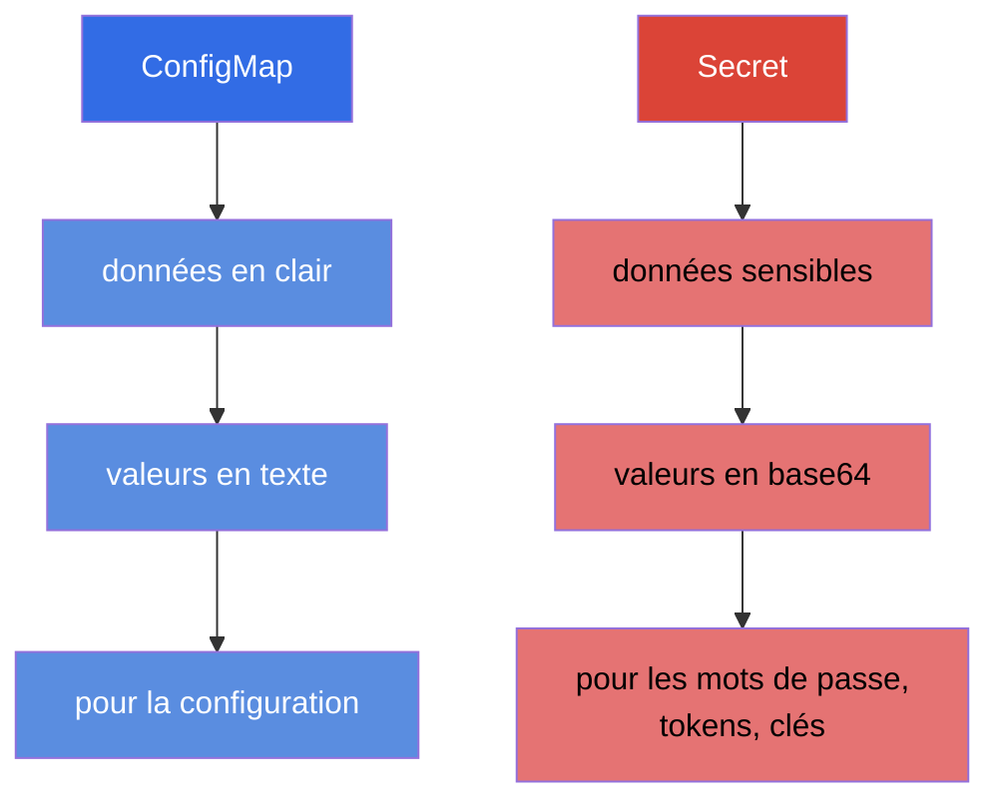
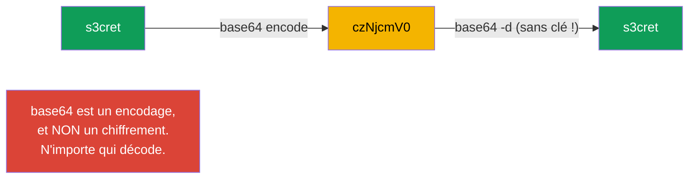
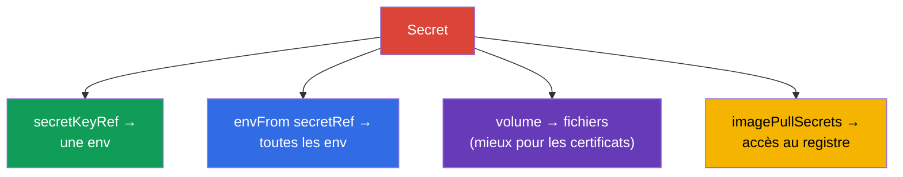
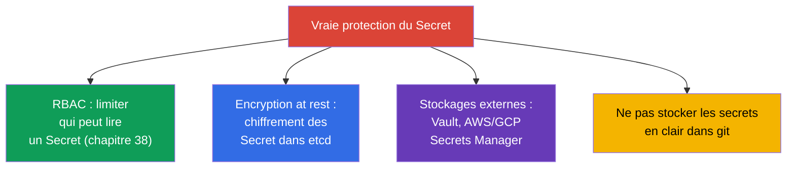

[Русская версия](ru.md) · [Eng version](README.md) · [Versión en español](es.md) · [Deutsche Version](de.md) · [ქართული ვერსია](ge.md) · [繁體中文版](tw.md) · [日本語版](jp.md)

# Chapitre 19. Secret

> **Ce qui suit.** Le ConfigMap stocke des données en clair. Mais les mots de passe, les
> tokens, les clés et les certificats ne peuvent pas être stockés ainsi. Pour les données
> sensibles il existe le **Secret** - mécaniquement il ressemble beaucoup au ConfigMap,
> mais avec ses propres particularités et, surtout, avec d'importantes réserves sur la
> sécurité. C'est le sujet du domaine Environment/Config/Security (CKAD) et Security (CKA).
> L'essentiel à assimiler et à ne pas oublier à l'examen : **base64 n'est pas du
> chiffrement**.

## 19.1. Secret contre ConfigMap

L'idée est la même que pour le ConfigMap : des paires clé-valeur branchées aux Pods.
Différences :



| | ConfigMap | Secret |
|---|-----------|--------|
| Usage | configuration non secrète | mots de passe, tokens, clés, certificats |
| Encodage des valeurs | texte (`data`) | base64 (`data`), ou texte dans `stringData` |
| Stockage dans etcd | en clair | par défaut presque en clair aussi (voir 19.6) |
| Façons de le brancher | env, envFrom, volume | env, envFrom, volume (les mêmes !) |

Les façons de brancher au Pod sont identiques à celles du ConfigMap - nous nous
concentrerons donc ici sur les différences, sans répéter la mécanique.

## 19.2. La grande méprise : base64 ≠ chiffrement

Les valeurs de `Secret.data` sont stockées en **base64**. Beaucoup pensent que c'est une
protection. Ce n'est pas le cas : base64 est un simple encodage, réversible par une seule
commande et sans aucune clé.

```bash
echo -n 's3cret' | base64          # → czNjcmV0
echo -n 'czNjcmV0' | base64 -d     # → s3cret  (n'importe qui décode)
```



> **À retenir définitivement.** Le base64 dans un Secret sert à stocker des données
> binaires et des caractères « non imprimables », pas à cacher quoi que ce soit. La vraie
> protection des secrets, c'est le RBAC (qui peut lire un Secret), le chiffrement d'etcd at
> rest et les stockages de secrets externes (section 19.6). Répondre « le Secret est sûr
> parce que c'est du base64 » en entretien ou à l'examen est une erreur.

## 19.3. Création d'un Secret

```bash
# À partir de littéraux (kubectl encode lui-même en base64)
kubectl create secret generic db-secret \
  --from-literal=username=admin \
  --from-literal=password=s3cret

# À partir d'un fichier
kubectl create secret generic tls-secret --from-file=./tls.key

# Secret TLS (type spécial)
kubectl create secret tls my-tls --cert=tls.crt --key=tls.key

# Secret pour l'accès à un registre d'images privé
kubectl create secret docker-registry regcred \
  --docker-server=registry.example.com \
  --docker-username=user --docker-password=pass
```

Dans un manifeste, il faut encoder soi-même les valeurs dans `data`, ou utiliser
`stringData` (on y écrit en clair, Kubernetes encode lui-même) :

```yaml
apiVersion: v1
kind: Secret
metadata:
  name: db-secret
type: Opaque
data:
  password: czNjcmV0            # base64 à la main
stringData:
  username: admin               # en clair, sera encodé automatiquement
```

## 19.4. Types de Secret

Le Secret possède un champ `type` - il indique à Kubernetes l'usage prévu et exige
certaines clés.

| Type | Usage | Clés obligatoires |
|-----|-----------|--------------------|
| `Opaque` | données arbitraires (par défaut) | quelconques |
| `kubernetes.io/tls` | certificat et clé TLS (pour Ingress) | `tls.crt`, `tls.key` |
| `kubernetes.io/dockerconfigjson` | accès à un registre privé | `.dockerconfigjson` |
| `kubernetes.io/service-account-token` | token de ServiceAccount | généré |
| `kubernetes.io/basic-auth` | identifiant/mot de passe | `username`, `password` |
| `kubernetes.io/ssh-auth` | clé SSH | `ssh-privatekey` |

Les plus fréquents sont `Opaque` (cas général), `tls` (pour Ingress, chapitre 32) et
`dockerconfigjson` (tirer des images depuis un registre privé).

## 19.5. Brancher un Secret à un Pod

La mécanique est la même que pour le ConfigMap (chapitre 18) : trois façons.

```yaml
# 1. Une clé isolée dans une variable
    env:
    - name: DB_PASSWORD
      valueFrom:
        secretKeyRef:
          name: db-secret
          key: password

# 2. Tout le Secret dans les variables d'environnement
    envFrom:
    - secretRef:
        name: db-secret

# 3. Le secret comme fichiers (volume)
spec:
  containers:
  - name: app
    volumeMounts:
    - name: secret-vol
      mountPath: /etc/secret
      readOnly: true
  volumes:
  - name: secret-vol
    secret:
      secretName: db-secret
```

À part - `imagePullSecrets`, pour tirer une image depuis un registre privé :

```yaml
spec:
  imagePullSecrets:
  - name: regcred
  containers:
  - name: app
    image: registry.example.com/app:1.0
```



> **Conseil pratique.** Il vaut mieux monter les secrets en **volume** que les passer par
> env. Les variables d'environnement « fuient » plus facilement - elles sont visibles dans
> `kubectl describe`, dans les dumps de processus, dans les logs lors du débogage, et sont
> héritées par les processus enfants. Un fichier dans un volume est plus propre et se met à
> jour quand le Secret change (les env, non, comme pour le ConfigMap).

## 19.6. Comment protéger réellement les secrets

Puisque base64 ne protège pas, avec quoi se protéger vraiment ? C'est la question favorite
« de compréhension ».



- **RBAC** - l'essentiel : limiter qui peut lire les Secret dans un namespace.
- **Encryption at rest** - configurer le chiffrement des Secret dans etcd (sinon ils y sont
  presque en clair). Cela se configure dans la config de l'API server.
- **Gestionnaires externes** - HashiCorp Vault, AWS/GCP/Azure Secrets Manager + opérateurs
  (External Secrets Operator), pour que les secrets vivent hors du cluster et soient tirés à
  la demande.
- **Sécurité GitOps** - on ne met pas les secrets en clair dans git ; on utilise Sealed
  Secrets, SOPS, etc.

## 19.7. Comment cela s'applique en production

- **On ne stocke pas les secrets en clair dans git.** Règle d'or de la prod : aucun mot de
  passe dans les manifestes du dépôt. On utilise Sealed Secrets/SOPS (chiffrés dans git) ou
  l'External Secrets Operator (qui tire depuis Vault/Secrets Manager vers le cluster).
- **Les stockages externes comme source de vérité.** Les équipes matures gardent les secrets
  dans Vault ou un Secrets Manager cloud, et ils arrivent dans le cluster par
  synchronisation. Ainsi le secret est rotationné de façon centralisée et n'est pas
  « étalé » dans les manifestes.
- **Le chiffrement d'etcd est obligatoire.** En prod on active l'encryption at rest pour les
  Secret - sinon un dump d'etcd ou une sauvegarde révèle tous les mots de passe en clair.
- **RBAC strict sur les Secret.** L'accès en lecture aux Secret est donné au minimum : un
  développeur ordinaire ne doit pas lire les secrets de prod. C'est l'une des premières
  choses vérifiées lors d'un audit de sécurité.
- **On restreint `exec` sur les Pods qui portent des secrets.** Les droits de lecture du
  Secret lui-même ne suffisent pas - un secret peut aussi être récupéré via l'accès au Pod
  en cours d'exécution : `kubectl exec` donne un shell, d'où l'on voit les variables
  d'environnement (`env`) et les fichiers de secrets montés, tandis que `kubectl debug`
  permet d'injecter dans le Pod un **conteneur éphémère** et d'atteindre les mêmes données
  « par le côté ». C'est pourquoi, en prod, les droits `pods/exec`, `pods/attach` et
  `pods/ephemeralcontainers` (conteneurs éphémères) sur les namespaces portant des charges
  sensibles sont accordés aussi strictement que la lecture des Secret, - sinon le RBAC sur
  le Secret lui-même se contourne par l'accès au Pod. Pour la même raison, on préfère monter
  les secrets en fichiers plutôt que les mettre dans env (les variables d'environnement
  « fuient » plus facilement par accident dans les logs, les dumps et via `exec`).
- **Montage en volume et rotation.** Les secrets sont montés en fichiers (mis à jour
  automatiquement), et les applications sont conçues pour reprendre le secret mis à jour
  (par exemple lors de la rotation des certificats TLS par cert-manager).

## 19.8. Mini-glossaire

- **Secret** - objet pour les données sensibles (mots de passe, tokens, clés, certificats).
- **base64** - encodage des valeurs d'un Secret ; PAS un chiffrement.
- **stringData** - champ pour les valeurs en clair (encodées automatiquement).
- **type** - usage du Secret (Opaque, tls, dockerconfigjson, etc.).
- **secretKeyRef / secretRef** - brancher une clé / tout le Secret dans env.
- **imagePullSecrets** - secret pour l'accès à un registre d'images privé.
- **encryption at rest** - chiffrement des Secret dans etcd.
- **External Secrets / Vault / SOPS / Sealed Secrets** - outils de vraie protection des
  secrets.

## 19.9. Bilan du chapitre

- Le Secret est construit comme un ConfigMap, mais pour les données sensibles ; les façons
  de le brancher (env, envFrom, volume) sont les mêmes.
- Les valeurs sont stockées en base64 - c'est un encodage, pas un chiffrement : n'importe
  qui décode par une seule commande.
- Il se crée à partir de littéraux/de fichiers ; types : Opaque (général), tls (Ingress),
  dockerconfigjson (registre), etc. `stringData` permet d'écrire les valeurs en clair.
- Il vaut mieux monter les secrets en volume que par env (env fuit plus facilement et ne se
  met pas à jour).
- `imagePullSecrets` donne au Pod l'accès à un registre privé.
- Vraie protection : RBAC en lecture, encryption at rest dans etcd, gestionnaires externes
  (Vault, Secrets Manager), ne pas stocker les secrets en clair dans git.

## 19.10. À quoi cela sert : à l'examen et dans le travail réel

**À l'examen.** « Crée un Secret à partir de littéraux », « passe un mot de passe dans une
variable/un volume », « crée un secret TLS pour Ingress », « configure l'accès à un registre
privé » sont des exercices fréquents. Il faut absolument se rappeler que base64 ne protège
pas, et savoir encoder/décoder les valeurs. La mécanique du branchement se reporte depuis le
ConfigMap.

**Dans le travail réel.** Le travail avec les secrets est une question de sécurité pour tout
le système. Comprendre que base64 n'est pas une protection mène aux bonnes décisions : RBAC,
chiffrement d'etcd, stockages externes, renoncement aux secrets dans git. Le montage en
volume et une rotation réfléchie sont le standard d'une exploitation fiable.

## 19.11. Questions d'auto-évaluation

1. En quoi le Secret diffère-t-il du ConfigMap et qu'ont-ils en commun ?
2. Pourquoi le base64 dans un Secret n'est-il pas une protection ? Comment le vérifier ?
3. À quoi sert `stringData` et en quoi est-il plus pratique que `data` ?
4. Citez les principaux types de Secret et leur usage.
5. Pourquoi est-il préférable de monter les secrets en volume plutôt que de les passer par
   env ?
6. Qu'est-ce que `imagePullSecrets` et quand en a-t-on besoin ?
7. Par quels moyens protège-t-on réellement les secrets ?

## Pratique

Nous avons étudié le stockage des secrets. Au chapitre 20 nous passerons à la sécurité au
niveau du conteneur - SecurityContext et capabilities : sous quel utilisateur tourne le
processus et quels privilèges il possède. Le Secret se travaille dans les TP sur la
configuration et la sécurité.

🧪 TP 105 (Secret) : [tasks/cka/labs/105](../../labs/105/README_FR.MD)

---
[Sommaire](../README_FR.md) · [Chapitre 18](../18/fr.md) · [Chapitre 20](../20/fr.md)
