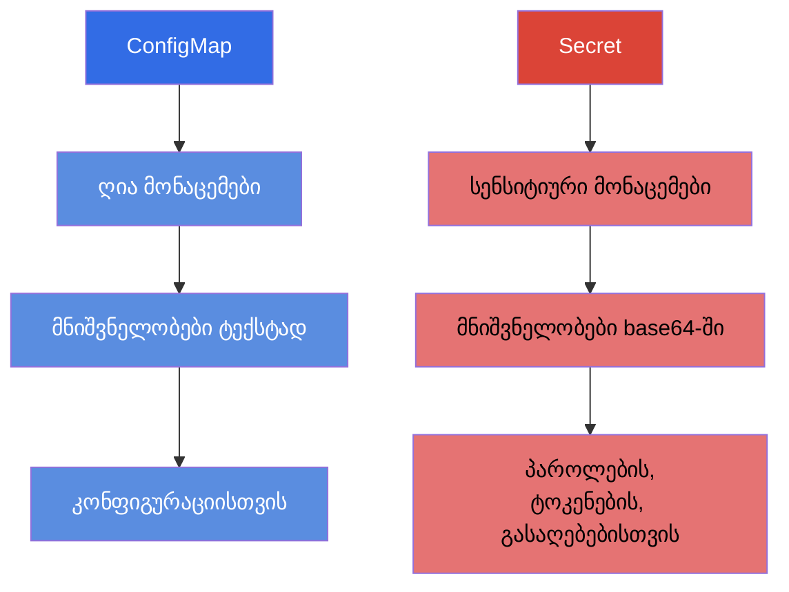
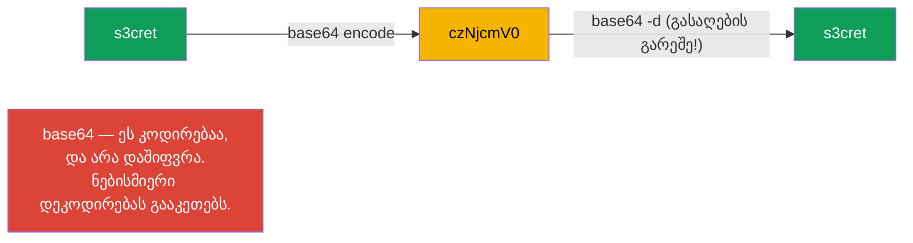
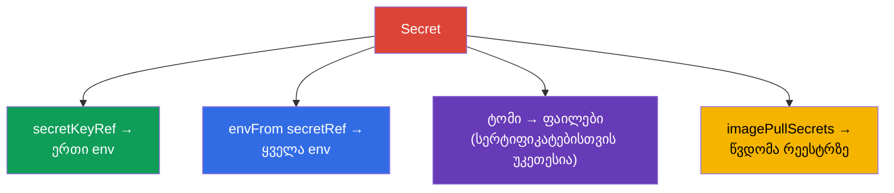
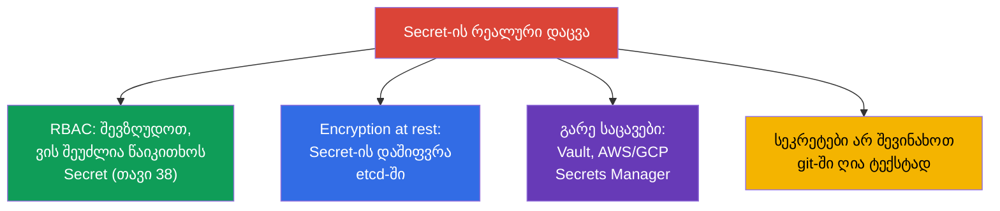

[Русская версия](ru.md) · [Eng version](README.md) · [Versión en español](es.md) · [Version française](fr.md) · [Deutsche Version](de.md) · [繁體中文版](tw.md) · [日本語版](jp.md)

# თავი 19. Secret

> **რა იქნება შემდეგ.** ConfigMap ღია მონაცემებს ინახავს. მაგრამ პაროლების, ტოკენების, გასაღებებისა და
> სერტიფიკატების ასე შენახვა არ შეიძლება. სენსიტიური მონაცემებისთვის არსებობს **Secret** - მექანიკურად
> ის ძალიან ჰგავს ConfigMap-ს, მაგრამ თავისი თავისებურებებით და, რაც მთავარია, უსაფრთხოებაზე მნიშვნელოვანი
> დათქმებით. ეს არის დომენის Environment/Config/Security (CKAD) და
> Security (CKA) თემა. საკვანძო, რაც უნდა ავითვისოთ და გამოცდაზე არ დაგვავიწყდეს: **base64 - ეს არ არის
> დაშიფვრა**.

## 19.1. Secret ConfigMap-ის წინააღმდეგ

იდეა იგივეა, რაც ConfigMap-ს: გასაღები-მნიშვნელობის წყვილები, Pods-ზე მიმაგრებადი. განსხვავებები:



| | ConfigMap | Secret |
|---|-----------|--------|
| დანიშნულება | არასეკრეტული კონფიგურაცია | პაროლები, ტოკენები, გასაღებები, სერტიფიკატები |
| მნიშვნელობების კოდირება | ტექსტი (`data`) | base64 (`data`), ან ტექსტი `stringData`-ში |
| შენახვა etcd-ში | ღია ტექსტად | ნაგულისხმევად ასევე თითქმის ღიად (იხ. 19.6) |
| მიმაგრების ხერხები | env, envFrom, ტომი | env, envFrom, ტომი (იგივე!) |

Pod-ზე მიმაგრების ხერხები იდენტურია ConfigMap-ს - ამიტომ აქ ყურადღებას განსხვავებებზე
გავამახვილებთ და მექანიკას არ გავიმეორებთ.

## 19.2. მთავარი მცდარი წარმოდგენა: base64 ≠ დაშიფვრა

მნიშვნელობები `Secret.data`-ში ინახება **base64**-ში. ბევრი ფიქრობს, რომ ეს დაცვაა. ეს ასე არ
არის: base64 - უბრალოდ კოდირებაა, შებრუნებადი ერთი ბრძანებით, ყოველგვარი გასაღების გარეშე.

```bash
echo -n 's3cret' | base64          # → czNjcmV0
echo -n 'czNjcmV0' | base64 -d     # → s3cret  (ვინც უნდა იყოს, დეკოდირებას გააკეთებს)
```



> **დაიმახსოვრეთ მყარად.** base64 Secret-ში საჭიროა ბინარული მონაცემებისა და
> „არადასაბეჭდი“ სიმბოლოების შესანახად, და არა დასამალად. სეკრეტების ნამდვილი დაცვა - ეს არის RBAC (ვის
> შეუძლია Secret-ის წაკითხვა), etcd-ის დაშიფვრა at rest და სეკრეტების გარე საცავები (განყოფილება
> 19.6). პასუხი „Secret უსაფრთხოა, რადგან base64“ გასაუბრებაზე და გამოცდაზე - შეცდომაა.

## 19.3. Secret-ის შექმნა

```bash
# ლიტერალებიდან (kubectl თავად დააკოდირებს base64-ში)
kubectl create secret generic db-secret \
  --from-literal=username=admin \
  --from-literal=password=s3cret

# ფაილიდან
kubectl create secret generic tls-secret --from-file=./tls.key

# TLS-სეკრეტი (სპეციალური ტიპი)
kubectl create secret tls my-tls --cert=tls.crt --key=tls.key

# სეკრეტი იმიჯების პრივატულ რეესტრზე წვდომისთვის
kubectl create secret docker-registry regcred \
  --docker-server=registry.example.com \
  --docker-username=user --docker-password=pass
```

მანიფესტში მნიშვნელობები თავად უნდა დაკოდიროთ `data`-ში, ან გამოიყენოთ `stringData`
(მას ღია ტექსტად წერენ, Kubernetes თავად დააკოდირებს):

```yaml
apiVersion: v1
kind: Secret
metadata:
  name: db-secret
type: Opaque
data:
  password: czNjcmV0            # base64 ხელით
stringData:
  username: admin               # ღია ტექსტად, ავტომატურად დაკოდირდება
```

## 19.4. Secret-ის ტიპები

Secret-ს აქვს ველი `type` - ის Kubernetes-ს დანიშნულებას მიანიშნებს და გარკვეულ
გასაღებებს მოითხოვს.

| ტიპი | დანიშნულება | სავალდებულო გასაღებები |
|-----|-----------|--------------------|
| `Opaque` | თვითნებური მონაცემები (ნაგულისხმევად) | ნებისმიერი |
| `kubernetes.io/tls` | TLS-სერტიფიკატი და გასაღები (Ingress-ისთვის) | `tls.crt`, `tls.key` |
| `kubernetes.io/dockerconfigjson` | წვდომა პრივატულ რეესტრზე | `.dockerconfigjson` |
| `kubernetes.io/service-account-token` | ServiceAccount-ის ტოკენი | გენერირდება |
| `kubernetes.io/basic-auth` | ლოგინი/პაროლი | `username`, `password` |
| `kubernetes.io/ssh-auth` | SSH-გასაღები | `ssh-privatekey` |

ყველაზე ხშირია - `Opaque` (ზოგადი შემთხვევა), `tls` (Ingress-ისთვის, თავი 32) და
`dockerconfigjson` (იმიჯების ჩამოტანა პრივატული რეესტრიდან).

## 19.5. Secret-ის Pod-ზე მიმაგრება

მექანიკა იგივეა, რაც ConfigMap-ს (თავი 18): სამი ხერხი.

```yaml
# 1. ცალკე გასაღები ცვლადში
    env:
    - name: DB_PASSWORD
      valueFrom:
        secretKeyRef:
          name: db-secret
          key: password

# 2. მთელი Secret გარემოს ცვლადებში
    envFrom:
    - secretRef:
        name: db-secret

# 3. სეკრეტი ფაილებად (ტომი)
spec:
  containers:
  - name: app
    volumeMounts:
    - name: secret-vol
      mountPath: /etc/secret
      readOnly: true
  volumes:
  - name: secret-vol
    secret:
      secretName: db-secret
```

ცალკე - `imagePullSecrets`, იმიჯის პრივატული რეესტრიდან ჩამოსატანად:

```yaml
spec:
  imagePullSecrets:
  - name: regcred
  containers:
  - name: app
    image: registry.example.com/app:1.0
```



> **პრაქტიკული რჩევა.** სეკრეტები უკეთესია **ტომად** მიამაგრდეს, და არა env-ის საშუალებით
> გადაეცეს. გარემოს ცვლადები უფრო ადვილად „იტოვება“ - ისინი ჩანს `kubectl describe`-ში, პროცესების
> დამპებში, ლოგებში გამართვის დროს, მემკვიდრეობით გადაეცემა შვილობილ პროცესებს. ფაილი ტომში უფრო მოწესრიგებულია
> და Secret-ის შეცვლისას განახლდება (env - არა, როგორც ConfigMap-თანაც).

## 19.6. როგორ დავიცვათ სეკრეტები ნამდვილად

რაკი base64 არ იცავს, რითი დავიცვათ სინამდვილეში? ეს არის საყვარელი კითხვა „გაგებაზე“.



- **RBAC** - მთავარია: შევზღუდოთ, ვის შეუძლია საერთოდ Secret-ების წაკითხვა namespace-ში.
- **Encryption at rest** - მოვაწყოთ Secret-ების დაშიფვრა etcd-ში (თორემ ისინი იქ თითქმის
  ღიად წევს). კონფიგურირდება API-სერვერის კონფიგში.
- **გარე მენეჯერები** - HashiCorp Vault, AWS/GCP/Azure Secrets Manager + ოპერატორები
  (External Secrets Operator), რომ სეკრეტები კლასტერის გარეთ იცხოვროს და მოთხოვნისას ჩამოიტანონ.
- **GitOps-უსაფრთხოება** - git-ში სეკრეტებს ღია სახით არ ათავსებენ; იყენებენ
  Sealed Secrets-ს, SOPS-ს და მისთანებს.

## 19.7. როგორ იყენებენ ამას პროდაქშენში

- **სეკრეტებს git-ში ღიად არ ინახავენ.** პროდის მთავარი წესი: არავითარი პაროლი
  რეპოზიტორიაში მდებარე მანიფესტებში. იყენებენ Sealed Secrets/SOPS-ს (git-ში დაშიფრული) ან
  External Secrets Operator-ს (ჩამოიტანს Vault/Secrets Manager-იდან კლასტერში).
- **გარე საცავები ჭეშმარიტების წყაროდ.** მოწიფული გუნდები სეკრეტებს Vault-ში ან
  ღრუბლოვან Secrets Manager-ში ინახავენ, კლასტერში კი ისინი სინქრონიზაციით ხვდება. ასე სეკრეტი
  ცენტრალიზებულად როტირდება და მანიფესტებზე არ არის „მოთხაპნილი“.
- **etcd-ის დაშიფვრა სავალდებულოა.** პროდში Secret-ისთვის encryption at rest-ს რთავენ -
  თორემ etcd-ის დამპი ან ბექაფი ყველა პაროლს ღია ტექსტად გამოააშკარავებს.
- **RBAC მკაცრად Secret-ზე.** Secret-ის წაკითხვის წვდომას მინიმალურად აძლევენ: ჩვეულებრივმა დეველოპერმა
  პროდ-სეკრეტები არ უნდა წაიკითხოს. ეს არის ერთი პირველი რამ, რასაც უსაფრთხოების
  აუდიტისას ამოწმებენ.
- **ზღუდავენ `exec`-ს სეკრეტებიან Pods-ზე.** თავად Secret-ის წაკითხვის უფლებები საკმარისი არ არის -
  სეკრეტი შეიძლება მიიღონ მომუშავე Pod-ზე წვდომითაც: `kubectl exec` shell-ს იძლევა,
  საიდანაც ჩანს გარემოს ცვლადები (`env`) და მიმაგრებული სეკრეტების ფაილები, ხოლო
  `kubectl debug` საშუალებას იძლევა Pod-ში **ეფემერული კონტეინერი** ჩასვან და იმავე
  მონაცემებამდე „გვერდიდან“ მიაღწიონ. ამიტომ პროდში უფლებებს `pods/exec`, `pods/attach` და
  `pods/ephemeralcontainers` (ეფემერული კონტეინერები) სენსიტიური დატვირთვების მქონე
  ნეიმსფეისებზე ისევე მკაცრად გასცემენ, როგორც Secret-ის წაკითხვას, - თორემ RBAC თავად Secret-ზე
  Pod-ზე წვდომით გვერდს უვლის. იმავე მიზეზით სეკრეტებს ამჯობინებენ ფაილებად მიამაგრონ,
  და არა env-ში ჩასვან (გარემოს ცვლადები უფრო ადვილად „იტოვება“ შემთხვევით ლოგებში, დამპებში და
  `exec`-ის საშუალებით).
- **ტომად მიმაგრება და როტაცია.** სეკრეტებს ფაილებად მიამაგრებენ (ავტომატურად განახლდება),
  აპლიკაციებს კი ისე აპროექტებენ, რომ განახლებული სეკრეტი ხელახლა აიღონ (მაგალითად, TLS-სერტიფიკატების
  როტაციისას cert-manager-ით).

## 19.8. მინი-ლექსიკონი

- **Secret** - ობიექტი სენსიტიური მონაცემებისთვის (პაროლები, ტოკენები, გასაღებები, სერტიფიკატები).
- **base64** - Secret-ის მნიშვნელობების კოდირება; არ არის დაშიფვრა.
- **stringData** - ველი ღია ტექსტად მნიშვნელობებისთვის (ავტომატურად კოდირდება).
- **type** - Secret-ის დანიშნულება (Opaque, tls, dockerconfigjson და სხვ.).
- **secretKeyRef / secretRef** - გასაღების/მთელი Secret-ის მიმაგრება env-ში.
- **imagePullSecrets** - სეკრეტი იმიჯების პრივატულ რეესტრზე წვდომისთვის.
- **encryption at rest** - Secret-ის დაშიფვრა etcd-ში.
- **External Secrets / Vault / SOPS / Sealed Secrets** - სეკრეტების რეალური დაცვის
  ინსტრუმენტები.

## 19.9. თავის შეჯამება

- Secret მოწყობილია ConfigMap-ივით, მაგრამ სენსიტიური მონაცემებისთვის; მიმაგრების ხერხები (env,
  envFrom, ტომი) იგივეა.
- მნიშვნელობები ინახება base64-ში - ეს კოდირებაა, და არა დაშიფვრა: ნებისმიერი დეკოდირებას გააკეთებს ერთი
  ბრძანებით.
- იქმნება ლიტერალებიდან/ფაილებიდან; ტიპები: Opaque (ზოგადი), tls (Ingress), dockerconfigjson
  (რეესტრი) და სხვ. `stringData` საშუალებას იძლევა მნიშვნელობები ღია ტექსტად დაიწეროს.
- სეკრეტები უკეთესია ტომად მიამაგრდეს, ვიდრე env-ის საშუალებით (env უფრო ადვილად იტოვება და არ განახლდება).
- `imagePullSecrets` Pod-ს პრივატულ რეესტრზე წვდომას აძლევს.
- რეალური დაცვა: RBAC წაკითხვაზე, encryption at rest etcd-ში, გარე მენეჯერები (Vault,
  Secrets Manager), სეკრეტები git-ში ღიად არ შევინახოთ.

## 19.10. როგორ გამოგადგებათ: გამოცდაზე და რეალურ სამუშაოში

**გამოცდაზე.** „შექმენი Secret ლიტერალებიდან“, „გადაატარე პაროლი ცვლადში/ტომში“,
„შექმენი TLS-სეკრეტი Ingress-ისთვის“, „მოაწყე წვდომა პრივატულ რეესტრზე“ - ხშირი დავალებებია.
აუცილებლად უნდა გვახსოვდეს, რომ base64 არ იცავს, და უნდა შეგვეძლოს მნიშვნელობების კოდირება/დეკოდირება.
მიმაგრების მექანიკა ConfigMap-იდან გადმოიტანეთ.

**რეალურ სამუშაოში.** სეკრეტებთან მუშაობა - მთელი სისტემის უსაფრთხოების საკითხია. იმის გაგება,
რომ base64 არ არის დაცვა, სწორ გადაწყვეტილებებამდე მიგვიყვანს: RBAC, etcd-ის დაშიფვრა, გარე
საცავები, სეკრეტებზე უარი git-ში. ტომად მიმაგრება და გააზრებული როტაცია - სანდო
ექსპლუატაციის სტანდარტია.

## 19.11. თვითშემოწმების კითხვები

1. რითი განსხვავდება Secret ConfigMap-ისგან და რა აქვთ საერთო?
2. რატომ არ არის base64 Secret-ში დაცვა? როგორ შევამოწმოთ ეს?
3. რისთვის უნდა `stringData` და რითი არის ის `data`-ზე მოსახერხებელი?
4. დაასახელეთ Secret-ის ძირითადი ტიპები და მათი დანიშნულება.
5. რატომ არის სასურველი სეკრეტების ტომად მიმაგრება, და არა env-ის საშუალებით გადაცემა?
6. რა არის `imagePullSecrets` და როდის არის ის საჭირო?
7. რა ხერხებით იცავენ სეკრეტებს ნამდვილად?

## პრაქტიკა

სეკრეტების შენახვა გავარჩიეთ. თავ 20-ში გადავალთ კონტეინერის დონის
უსაფრთხოებაზე - SecurityContext და capabilities: რომელი მომხმარებლით მუშაობს პროცესი და
რა პრივილეგიები აქვს მას. Secret მუშავდება კონფიგურაციისა და უსაფრთხოების ლაბებში.

🧪 ლაბი 105 (Secret): [tasks/cka/labs/105](../../labs/105/README_GE.MD)

---
[სარჩევი](../README_GE.md) · [თავი 18](../18/ge.md) · [თავი 20](../20/ge.md)
