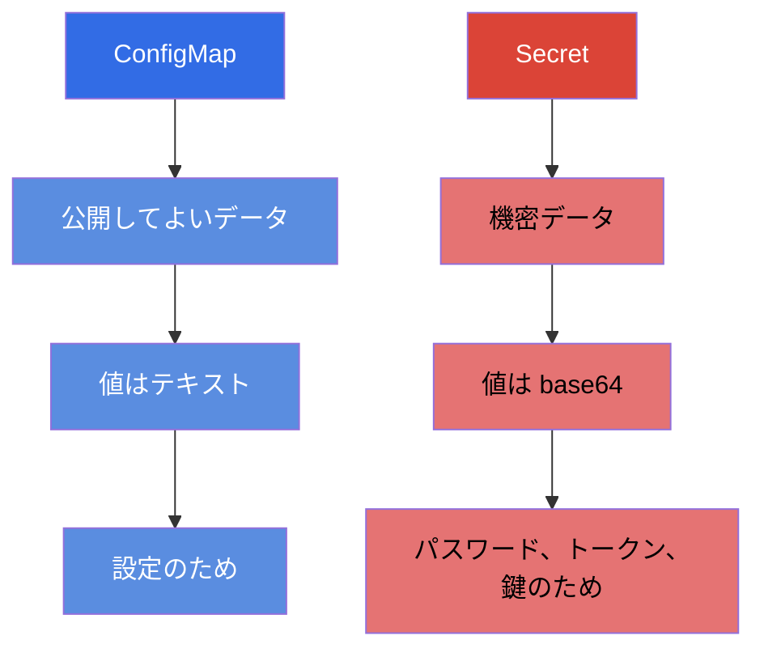
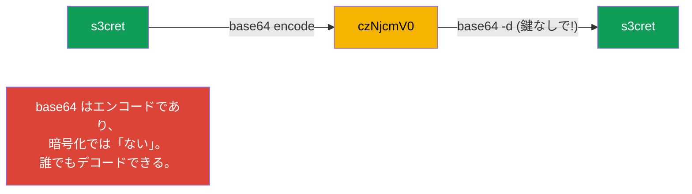
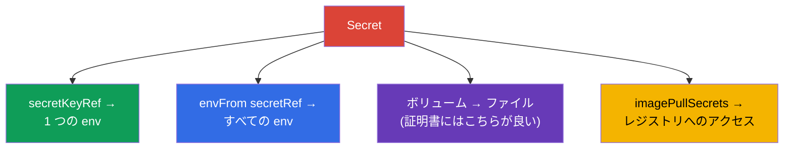
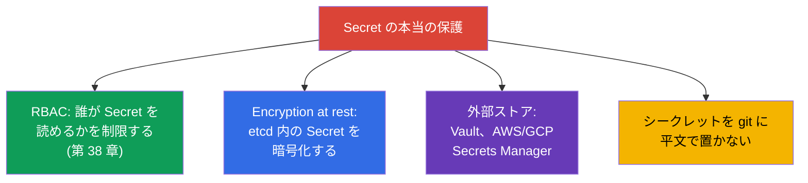

[Русская версия](ru.md) · [Eng version](README.md) · [Versión en español](es.md) · [Version française](fr.md) · [Deutsche Version](de.md) · [ქართული ვერსია](ge.md) · [繁體中文版](tw.md)

# 第 19 章。Secret

> **次はなにか。** ConfigMap は公開してよいデータを保管します。しかしパスワード、
> トークン、鍵、証明書をそのやり方で保管してはいけません。機密データのためにあるのが
> **Secret** です - 仕組みとしては ConfigMap によく似ていますが、独自の性質があり、
> そして何より、セキュリティに関する重要な注意点があります。これは Environment/Config/Security
> 領域 (CKAD) と Security 領域 (CKA) のテーマです。身につけて試験でも忘れてはいけない
> 肝心な点：**base64 は暗号化ではありません**。

## 19.1. Secret と ConfigMap の違い

考え方は ConfigMap と同じです：キーと値のペアを Pod へ結び付けます。違いはこうです：



| | ConfigMap | Secret |
|---|-----------|--------|
| 目的 | 機密ではない設定 | パスワード、トークン、鍵、証明書 |
| 値のエンコード | テキスト (`data`) | base64 (`data`)、または `stringData` にテキスト |
| etcd での保管 | 平文 | デフォルトではやはりほぼ平文 (19.6 参照) |
| 結び付け方 | env、envFrom、ボリューム | env、envFrom、ボリューム (同じ!) |

Pod への結び付け方は ConfigMap と同一です - そのためここでは仕組みを繰り返さず、
違いに集中します。

## 19.2. 最大の誤解：base64 ≠ 暗号化

`Secret.data` の値は **base64** で保管されます。多くの人がこれを保護だと思っています。
そうではありません：base64 は単なるエンコードで、鍵なしにコマンド 1 つで元へ戻せます。

```bash
echo -n 's3cret' | base64          # → czNjcmV0
echo -n 'czNjcmV0' | base64 -d     # → s3cret  (誰でもデコードできる)
```



> **絶対に覚えておくこと。** Secret の base64 は、バイナリデータや「印字できない」文字を
> 保管するために必要なもので、隠すためのものではありません。シークレットの本当の保護は RBAC
> (誰が Secret を読めるか)、etcd の encryption at rest、外部のシークレットストア
> (19.6 節) です。「base64 だから Secret は安全」という答えは、面接でも試験でも
> 間違いです。

## 19.3. Secret の作成

```bash
# リテラルから (kubectl が自分で base64 にエンコードする)
kubectl create secret generic db-secret \
  --from-literal=username=admin \
  --from-literal=password=s3cret

# ファイルから
kubectl create secret generic tls-secret --from-file=./tls.key

# TLS シークレット (専用の型)
kubectl create secret tls my-tls --cert=tls.crt --key=tls.key

# プライベートなイメージレジストリへアクセスするためのシークレット
kubectl create secret docker-registry regcred \
  --docker-server=registry.example.com \
  --docker-username=user --docker-password=pass
```

マニフェストでは `data` に自分でエンコードした値を書くか、`stringData` を使います
(そこには平文で書き、Kubernetes が自分でエンコードします)：

```yaml
apiVersion: v1
kind: Secret
metadata:
  name: db-secret
type: Opaque
data:
  password: czNjcmV0            # base64 を手動で
stringData:
  username: admin               # 平文、自動でエンコードされる
```

## 19.4. Secret の型

Secret には `type` フィールドがあります - これは Kubernetes に用途を伝え、決まった
キーを要求します。

| 型 | 目的 | 必須のキー |
|-----|-----------|--------------------|
| `Opaque` | 任意のデータ (デフォルト) | 任意 |
| `kubernetes.io/tls` | TLS 証明書と鍵 (Ingress 用) | `tls.crt`, `tls.key` |
| `kubernetes.io/dockerconfigjson` | プライベートレジストリへのアクセス | `.dockerconfigjson` |
| `kubernetes.io/service-account-token` | ServiceAccount のトークン | 生成される |
| `kubernetes.io/basic-auth` | ログイン/パスワード | `username`, `password` |
| `kubernetes.io/ssh-auth` | SSH 鍵 | `ssh-privatekey` |

もっともよく使うのは `Opaque` (一般的なケース)、`tls` (Ingress 用、第 32 章)、
`dockerconfigjson` (プライベートレジストリからイメージを取得する) です。

## 19.5. Secret を Pod へ結び付ける

仕組みは ConfigMap (第 18 章) と同じで、3 通りあります。

```yaml
# 1. 個別のキーを変数へ
    env:
    - name: DB_PASSWORD
      valueFrom:
        secretKeyRef:
          name: db-secret
          key: password

# 2. Secret 全体を環境変数へ
    envFrom:
    - secretRef:
        name: db-secret

# 3. シークレットをファイルとして (ボリューム)
spec:
  containers:
  - name: app
    volumeMounts:
    - name: secret-vol
      mountPath: /etc/secret
      readOnly: true
  volumes:
  - name: secret-vol
    secret:
      secretName: db-secret
```

別枠で `imagePullSecrets` - プライベートレジストリからイメージを取得するためのものです：

```yaml
spec:
  imagePullSecrets:
  - name: regcred
  containers:
  - name: app
    image: registry.example.com/app:1.0
```



> **実践的なアドバイス。** シークレットは env で渡すよりも **ボリューム** でマウントする
> ほうが良いです。環境変数のほうが「漏れ」やすい - `kubectl describe` で見え、プロセスの
> ダンプにも出て、デバッグ時のログにも出て、子プロセスへ継承されます。ボリューム内の
> ファイルのほうが安全で、Secret を変更したときに更新されます (env は更新されません。
> ConfigMap と同じです)。

## 19.6. シークレットを本当に守る方法

base64 が守ってくれないなら、実際には何で守るのでしょうか。これは「理解を問う」
定番の質問です。



- **RBAC** - もっとも重要：namespace 内の Secret をそもそも誰が読めるのかを制限します。
- **Encryption at rest** - etcd 内の Secret の暗号化を設定します (そうしないと、そこには
  ほぼ平文で置かれます)。API サーバーの設定で構成します。
- **外部のマネージャー** - HashiCorp Vault、AWS/GCP/Azure Secrets Manager + オペレーター
  (External Secrets Operator) を使い、シークレットをクラスタの外に置いて要求に応じて
  取り込みます。
- **GitOps のセキュリティ** - git にシークレットを平文で置かず、Sealed Secrets、SOPS
  などを使います。

## 19.7. 本番環境でこれをどう使うか

- **シークレットを git に平文で保管しない。** 本番の最重要ルール：リポジトリの
  マニフェストにパスワードを一切書かないこと。Sealed Secrets/SOPS (git 内で暗号化) か
  External Secrets Operator (Vault/Secrets Manager からクラスタへ取り込む) を使います。
- **外部ストアを真実の源に。** 成熟したチームはシークレットを Vault やクラウドの
  Secrets Manager に置き、クラスタへは同期で入ってきます。こうするとシークレットは
  中央でローテーションされ、マニフェスト全体に「散らばる」ことがありません。
- **etcd の暗号化は必須。** 本番では Secret の encryption at rest を有効にします -
  そうしないと etcd のダンプやバックアップがすべてのパスワードを平文で明かしてしまいます。
- **Secret には厳格な RBAC。** Secret の読み取り権限は最小限に与えます：ふつうの開発者が
  本番のシークレットを読めてはいけません。これはセキュリティ監査で最初に確認されるものの
  1 つです。
- **シークレットを持つ Pod への `exec` を制限する。** Secret 自体の読み取り権限だけでは
  不十分です - シークレットは動いている Pod へのアクセス経由でも取り出せます：
  `kubectl exec` は shell を与え、そこから環境変数 (`env`) やマウントされたシークレットの
  ファイルが見えます。また `kubectl debug` は Pod に **エフェメラルコンテナ** を仕込んで
  同じデータへ「横から」到達できます。そのため本番では、機密ワークロードのある namespace に
  対する `pods/exec`、`pods/attach`、`pods/ephemeralcontainers` (エフェメラルコンテナ) の
  権限は、Secret の読み取りと同じくらい厳しく与えます - そうしないと Secret 自体への RBAC が
  Pod へのアクセスで回避されてしまいます。同じ理由で、シークレットは env に置くのではなく
  ファイルでマウントするのが好まれます (環境変数はログやダンプ、`exec` 経由でうっかり
  「漏れ」やすいのです)。
- **ボリュームでのマウントとローテーション。** シークレットはファイルでマウントし
  (自動で更新されます)、アプリケーションは更新されたシークレットを読み直せるように
  設計します (たとえば cert-manager による TLS 証明書のローテーション時)。

## 19.8. ミニ用語集

- **Secret** - 機密データ (パスワード、トークン、鍵、証明書) のためのオブジェクト。
- **base64** - Secret の値のエンコード方式。暗号化では「ない」。
- **stringData** - 値を平文で書くためのフィールド (自動でエンコードされます)。
- **type** - Secret の用途 (Opaque、tls、dockerconfigjson など)。
- **secretKeyRef / secretRef** - キー / Secret 全体を env へ結び付けること。
- **imagePullSecrets** - プライベートなイメージレジストリへアクセスするためのシークレット。
- **encryption at rest** - etcd 内の Secret の暗号化。
- **External Secrets / Vault / SOPS / Sealed Secrets** - シークレットを本当に守るための
  ツール。

## 19.9. 本章のまとめ

- Secret は ConfigMap と同じ作りですが機密データ用です。結び付け方 (env、envFrom、
  ボリューム) は同じです。
- 値は base64 で保管されます - これはエンコードであって暗号化ではありません：誰でも
  コマンド 1 つでデコードできます。
- リテラル/ファイルから作成します。型は Opaque (一般)、tls (Ingress)、dockerconfigjson
  (レジストリ) など。`stringData` を使えば値を平文で書けます。
- シークレットは env 経由よりもボリュームでマウントするほうが良いです (env は漏れやすく、
  更新もされません)。
- `imagePullSecrets` は Pod にプライベートレジストリへのアクセスを与えます。
- 本当の保護：読み取りへの RBAC、etcd の encryption at rest、外部マネージャー (Vault、
  Secrets Manager)、シークレットを git に平文で保管しないこと。

## 19.10. これがどう役に立つか：試験と実際の仕事で

**試験では。** 「リテラルから Secret を作れ」「パスワードを変数/ボリュームへ渡せ」
「Ingress 用の TLS シークレットを作れ」「プライベートレジストリへのアクセスを設定せよ」は
よく出る課題です。base64 が保護にならないことを必ず覚えておき、値をエンコード/デコード
できるようにしておきましょう。結び付けの仕組みは ConfigMap から持ってきてください。

**実際の仕事では。** シークレットの扱いはシステム全体のセキュリティの問題です。base64 が
保護ではないと理解していれば、正しい判断につながります：RBAC、etcd の暗号化、外部ストア、
git にシークレットを置かないこと。ボリュームでのマウントと練られたローテーションは、
堅実な運用の標準です。

## 19.11. 自己チェックの質問

1. Secret は ConfigMap とどう違い、どこが共通ですか？
2. なぜ Secret の base64 は保護にならないのですか？それはどう確認できますか？
3. `stringData` は何のためにあり、`data` よりどこが便利ですか？
4. Secret の主な型とその目的を挙げてください。
5. なぜシークレットは env で渡すよりボリュームでマウントするほうが望ましいのですか？
6. `imagePullSecrets` とは何で、どんなときに必要ですか？
7. シークレットを本当に守る方法にはどんなものがありますか？

## 演習

シークレットの保管を見てきました。第 20 章ではコンテナレベルのセキュリティへ進みます -
SecurityContext と capabilities：プロセスはどのユーザーで動き、どんな特権を持つのか。
Secret は設定とセキュリティのラボで練習します。

🧪 ラボ 105 (Secret): [tasks/cka/labs/105](../../labs/105/README_JP.MD)

🎮 Killercoda（ブラウザ内、セットアップ不要）：[Mount Secret into pod](https://killercoda.com/chadmcrowell/course/ckad/secret-volume) · [Use Secret as env vars](https://killercoda.com/chadmcrowell/course/ckad/secret-envvars) · [Rotate Secret](https://killercoda.com/chadmcrowell/course/ckad/rotate-secret)

---
[目次](../README_JP.md) · [第 18 章](../18/jp.md) · [第 20 章](../20/jp.md)
