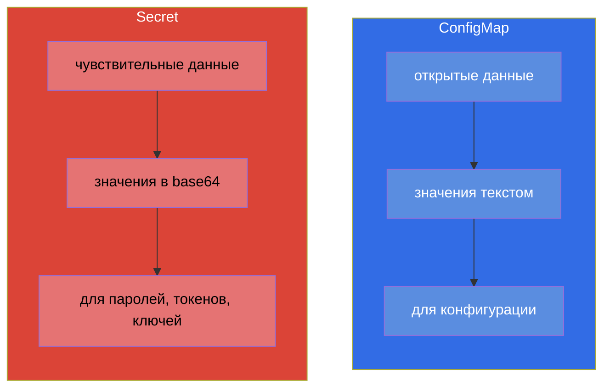
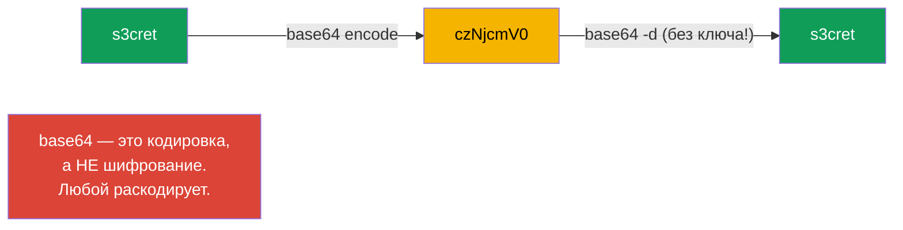
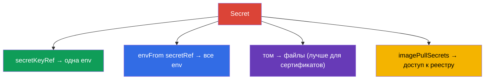
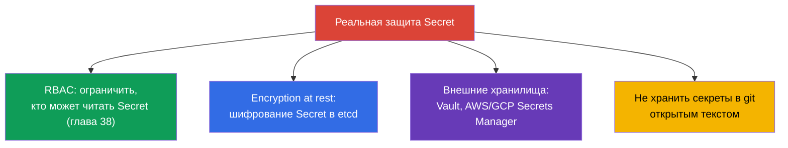

# Глава 19. Secret

> **Что дальше.** ConfigMap хранит открытые данные. Но пароли, токены, ключи и
> сертификаты так хранить нельзя. Для чувствительных данных есть **Secret** - механически
> он очень похож на ConfigMap, но со своими особенностями и, главное, с важными
> оговорками про безопасность. Это тема домена Environment/Config/Security (CKAD) и
> Security (CKA). Ключевое, что надо усвоить и не забыть на экзамене: **base64 - это не
> шифрование**.

## 19.1. Secret против ConfigMap

Идея та же, что у ConfigMap: пары ключ-значение, подключаемые к подам. Отличия:



| | ConfigMap | Secret |
|---|-----------|--------|
| Назначение | несекретная конфигурация | пароли, токены, ключи, сертификаты |
| Кодировка значений | текст (`data`) | base64 (`data`), либо текст в `stringData` |
| Хранение в etcd | открытым текстом | по умолчанию тоже почти открыто (см. 19.6) |
| Способы подключения | env, envFrom, том | env, envFrom, том (те же!) |

Способы подключения к поду идентичны ConfigMap - поэтому здесь сосредоточимся на
различиях, а не повторяем механику.

## 19.2. Главное заблуждение: base64 ≠ шифрование

Значения в `Secret.data` хранятся в **base64**. Многие думают, что это защита. Это не
так: base64 - просто кодировка, обратимая одной командой без всякого ключа.

```bash
echo -n 's3cret' | base64          # → czNjcmV0
echo -n 'czNjcmV0' | base64 -d     # → s3cret  (кто угодно раскодирует)
```



> **Запомните намертво.** base64 в Secret нужен, чтобы хранить бинарные данные и
> «непечатаемые» символы, а не чтобы скрывать. Настоящая защита секретов - это RBAC (кто
> может читать Secret), шифрование etcd at rest и внешние хранилища секретов (раздел
> 19.6). Ответ «Secret безопасен, потому что base64» на собеседовании и экзамене - ошибка.

## 19.3. Создание Secret

```bash
# Из литералов (kubectl сам закодирует в base64)
kubectl create secret generic db-secret \
  --from-literal=username=admin \
  --from-literal=password=s3cret

# Из файла
kubectl create secret generic tls-secret --from-file=./tls.key

# TLS-секрет (специальный тип)
kubectl create secret tls my-tls --cert=tls.crt --key=tls.key

# Секрет для доступа к приватному реестру образов
kubectl create secret docker-registry regcred \
  --docker-server=registry.example.com \
  --docker-username=user --docker-password=pass
```

В манифесте значения нужно кодировать самому в `data`, либо использовать `stringData`
(там пишут открытым текстом, Kubernetes закодирует сам):

```yaml
apiVersion: v1
kind: Secret
metadata:
  name: db-secret
type: Opaque
data:
  password: czNjcmV0            # base64 вручную
stringData:
  username: admin               # открытым текстом, закодируется автоматически
```

## 19.4. Типы Secret

У Secret есть поле `type` - оно подсказывает Kubernetes назначение и требует определённых
ключей.

| Тип | Назначение | Обязательные ключи |
|-----|-----------|--------------------|
| `Opaque` | произвольные данные (по умолчанию) | любые |
| `kubernetes.io/tls` | TLS-сертификат и ключ (для Ingress) | `tls.crt`, `tls.key` |
| `kubernetes.io/dockerconfigjson` | доступ к приватному реестру | `.dockerconfigjson` |
| `kubernetes.io/service-account-token` | токен ServiceAccount | генерируется |
| `kubernetes.io/basic-auth` | логин/пароль | `username`, `password` |
| `kubernetes.io/ssh-auth` | SSH-ключ | `ssh-privatekey` |

Самые частые - `Opaque` (общий случай), `tls` (для Ingress, глава 32) и
`dockerconfigjson` (тянуть образы из приватного реестра).

## 19.5. Подключение Secret к поду

Механика та же, что у ConfigMap (глава 18): три способа.

```yaml
# 1. Отдельный ключ в переменную
    env:
    - name: DB_PASSWORD
      valueFrom:
        secretKeyRef:
          name: db-secret
          key: password

# 2. Весь Secret в переменные окружения
    envFrom:
    - secretRef:
        name: db-secret

# 3. Секрет как файлы (том)
spec:
  containers:
  - name: app
    volumeMounts:
    - name: secret-vol
      mountPath: /etc/secret
      readOnly: true
  volumes:
  - name: secret-vol
    secret:
      secretName: db-secret
```

Отдельно - `imagePullSecrets`, чтобы тянуть образ из приватного реестра:

```yaml
spec:
  imagePullSecrets:
  - name: regcred
  containers:
  - name: app
    image: registry.example.com/app:1.0
```



> **Практический совет.** Секреты лучше монтировать **томом**, а не пробрасывать через
> env. Переменные окружения легче «утекают» - они видны в `kubectl describe`, в дампах
> процессов, в логах при отладке, наследуются дочерними процессами. Файл в томе аккуратнее
> и обновляется при изменении Secret (env - нет, как и у ConfigMap).

## 19.6. Как по-настоящему защитить секреты

Раз base64 не защищает, чем защищаться на самом деле? Это любимый вопрос «на понимание».



- **RBAC** - главное: ограничить, кто вообще может читать Secret'ы в namespace.
- **Encryption at rest** - настроить шифрование Secret'ов в etcd (иначе они лежат там
  почти открыто). Настраивается в конфиге API-сервера.
- **Внешние менеджеры** - HashiCorp Vault, AWS/GCP/Azure Secrets Manager + операторы
  (External Secrets Operator), чтобы секреты жили вне кластера и подтягивались по запросу.
- **GitOps-безопасность** - в git секреты не кладут в открытом виде; используют
  Sealed Secrets, SOPS и т.п.

## 19.7. Как это применяют в продакшене

- **Секреты не хранят в git открытыми.** Главное правило прода: никаких паролей в
  манифестах в репозитории. Используют Sealed Secrets/SOPS (зашифрованные в git) или
  External Secrets Operator (тянет из Vault/Secrets Manager в кластер).
- **Внешние хранилища как источник истины.** Зрелые команды держат секреты в Vault или
  облачном Secrets Manager, а в кластер они попадают синхронизацией. Так секрет
  ротируется централизованно и не «размазан» по манifestам.
- **Шифрование etcd обязательно.** В проде включают encryption at rest для Secret -
  иначе дамп etcd или бэкап раскрывает все пароли открытым текстом.
- **RBAC строго на Secret.** Доступ на чтение Secret дают минимально: обычный разработчик
  не должен читать прод-секреты. Это одна из первых вещей, которую проверяют при аудите
  безопасности.
- **Монтирование томом и ротация.** Секреты монтируют файлами (обновляются автоматически),
  а приложения проектируют так, чтобы переподхватывать обновлённый секрет (например, при
  ротации TLS-сертификатов cert-manager'ом).

## 19.8. Мини-глоссарий

- **Secret** - объект для чувствительных данных (пароли, токены, ключи, сертификаты).
- **base64** - кодировка значений Secret; НЕ шифрование.
- **stringData** - поле для значений открытым текстом (кодируются автоматически).
- **type** - назначение Secret (Opaque, tls, dockerconfigjson и др.).
- **secretKeyRef / secretRef** - подключение ключа/всего Secret в env.
- **imagePullSecrets** - секрет для доступа к приватному реестру образов.
- **encryption at rest** - шифрование Secret в etcd.
- **External Secrets / Vault / SOPS / Sealed Secrets** - инструменты реальной защиты
  секретов.

## 19.9. Итоги главы

- Secret устроен как ConfigMap, но для чувствительных данных; способы подключения (env,
  envFrom, том) те же.
- Значения хранятся в base64 - это кодировка, а не шифрование: любой раскодирует одной
  командой.
- Создаётся из литералов/файлов; типы: Opaque (общий), tls (Ingress), dockerconfigjson
  (реестр) и др. `stringData` позволяет писать значения открытым текстом.
- Секреты лучше монтировать томом, чем через env (env легче утекает и не обновляется).
- `imagePullSecrets` даёт под доступ к приватному реестру.
- Реальная защита: RBAC на чтение, encryption at rest в etcd, внешние менеджеры (Vault,
  Secrets Manager), не хранить секреты в git открытыми.

## 19.10. Как это пригодится: на экзамене и в реальной работе

**На экзамене.** «Создай Secret из литералов», «пробрось пароль в переменную/том»,
«создай TLS-секрет для Ingress», «настрой доступ к приватному реестру» - частые задания.
Обязательно помнить, что base64 не защищает, и уметь кодировать/декодировать значения.
Механику подключения переносите из ConfigMap.

**В реальной работе.** Работа с секретами - вопрос безопасности всей системы. Понимание,
что base64 не защита, ведёт к правильным решениям: RBAC, шифрование etcd, внешние
хранилища, отказ от секретов в git. Монтирование томом и продуманная ротация - стандарт
надёжной эксплуатации.

## 19.11. Вопросы для самопроверки

1. Чем Secret отличается от ConfigMap и что у них общего?
2. Почему base64 в Secret - это не защита? Как это проверить?
3. Для чего нужен `stringData` и чем он удобнее `data`?
4. Назовите основные типы Secret и их назначение.
5. Почему секреты предпочтительнее монтировать томом, а не пробрасывать через env?
6. Что такое `imagePullSecrets` и когда он нужен?
7. Какими способами секреты защищают по-настоящему?

## Практика

Мы разобрали хранение секретов. В главе 20 перейдём к безопасности на уровне
контейнера - SecurityContext и capabilities: под каким пользователем работает процесс и
какие привилегии у него есть. Secret отрабатывается в лабах по конфигурации и безопасности.

🧪 Лаба 01: [tasks/cka/labs/01](../../labs/01/README_RU.MD)

---
[Оглавление](../README_RU.md) · [Глава 18](../18/ru.md) · [Глава 20](../20/ru.md)
