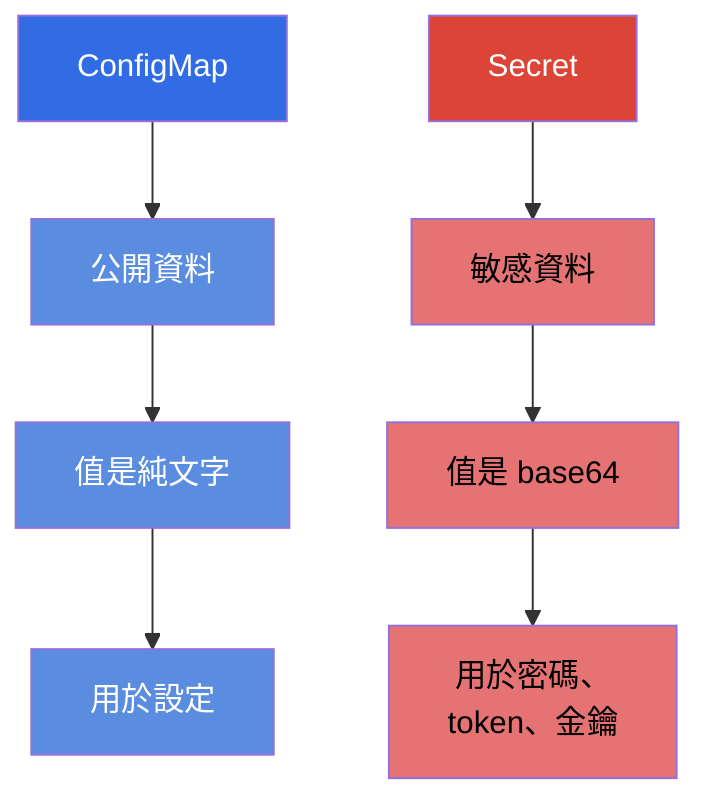
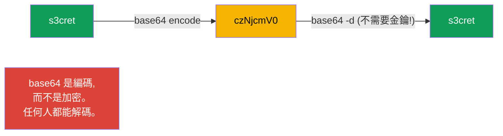
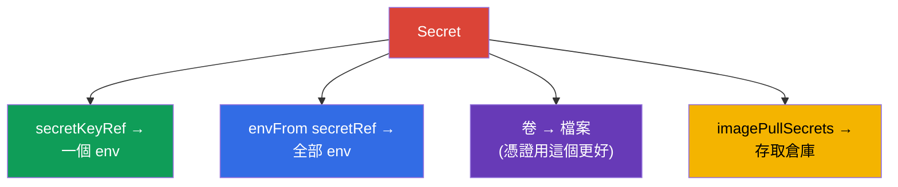
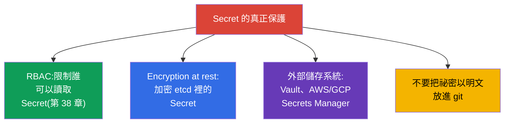

[Русская версия](ru.md) · [Eng version](README.md) · [Versión en español](es.md) · [Version française](fr.md) · [Deutsche Version](de.md) · [ქართული ვერსია](ge.md) · [日本語版](jp.md)

# 第 19 章。Secret

> **接下來是什麼。** ConfigMap 存放的是公開資料。但密碼、token、金鑰與憑證
> 不能這樣存。針對敏感資料有 **Secret** - 機制上它跟 ConfigMap 非常像,但有
> 自己的特點,而最重要的是有關安全性的重要注意事項。這是 Environment/Config/
> Security 領域(CKAD)與 Security 領域(CKA)的主題。要牢牢記住、考試時不能
> 忘的關鍵一句:**base64 不是加密**。

## 19.1. Secret 對比 ConfigMap

想法跟 ConfigMap 一樣:鍵值對,可以掛進 Pod。差別在於:



| | ConfigMap | Secret |
|---|-----------|--------|
| 用途 | 非機密的設定 | 密碼、token、金鑰、憑證 |
| 值的編碼 | 純文字(`data`) | base64(`data`),或用 `stringData` 寫純文字 |
| 在 etcd 中的存放 | 明文 | 預設也幾乎是明文(見 19.6) |
| 掛載方式 | env、envFrom、卷 | env、envFrom、卷(完全一樣!) |

掛到 Pod 的方式跟 ConfigMap 完全相同 - 所以這裡專注在差異,不重複那些機制。

## 19.2. 最大的誤解:base64 ≠ 加密

`Secret.data` 裡的值是以 **base64** 存放的。很多人以為這就是保護。並不是:
base64 只是一種編碼,不需要任何金鑰,一條指令就能還原。

```bash
echo -n 's3cret' | base64          # → czNjcmV0
echo -n 'czNjcmV0' | base64 -d     # → s3cret  (任何人都能解碼)
```



> **請牢牢記住。** Secret 裡的 base64 是為了能存放二進位資料與「不可列印」的
> 字元,而不是為了隱藏內容。真正保護祕密的是 RBAC(誰可以讀 Secret)、etcd 的
> at rest 加密,以及外部的祕密儲存系統(19.6 節)。在面試或考試中回答
> 「Secret 很安全,因為它是 base64」是錯的。

## 19.3. 建立 Secret

```bash
# 從字面值建立(kubectl 會自己編成 base64)
kubectl create secret generic db-secret \
  --from-literal=username=admin \
  --from-literal=password=s3cret

# 從檔案建立
kubectl create secret generic tls-secret --from-file=./tls.key

# TLS 祕密(特殊類型)
kubectl create secret tls my-tls --cert=tls.crt --key=tls.key

# 用於存取私有映像倉庫的祕密
kubectl create secret docker-registry regcred \
  --docker-server=registry.example.com \
  --docker-username=user --docker-password=pass
```

在 manifest 裡,`data` 的值要自己編碼,或者使用 `stringData`(那裡寫純文字,
Kubernetes 會自己編碼):

```yaml
apiVersion: v1
kind: Secret
metadata:
  name: db-secret
type: Opaque
data:
  password: czNjcmV0            # 手動 base64
stringData:
  username: admin               # 純文字,會自動編碼
```

## 19.4. Secret 的類型

Secret 有一個 `type` 欄位 - 它告訴 Kubernetes 這個 Secret 的用途,並且要求某些
特定的鍵。

| 類型 | 用途 | 必需的鍵 |
|-----|-----------|--------------------|
| `Opaque` | 任意資料(預設) | 任意 |
| `kubernetes.io/tls` | TLS 憑證與金鑰(供 Ingress 用) | `tls.crt`、`tls.key` |
| `kubernetes.io/dockerconfigjson` | 存取私有倉庫 | `.dockerconfigjson` |
| `kubernetes.io/service-account-token` | ServiceAccount 的 token | 自動產生 |
| `kubernetes.io/basic-auth` | 帳號/密碼 | `username`、`password` |
| `kubernetes.io/ssh-auth` | SSH 金鑰 | `ssh-privatekey` |

最常見的是 `Opaque`(一般情況)、`tls`(給 Ingress,第 32 章)以及
`dockerconfigjson`(從私有倉庫拉映像)。

## 19.5. 把 Secret 掛到 Pod

機制跟 ConfigMap 一樣(第 18 章):三種方式。

```yaml
# 1. 單一個鍵放進變數
    env:
    - name: DB_PASSWORD
      valueFrom:
        secretKeyRef:
          name: db-secret
          key: password

# 2. 整個 Secret 放進環境變數
    envFrom:
    - secretRef:
        name: db-secret

# 3. 祕密以檔案形式出現(卷)
spec:
  containers:
  - name: app
    volumeMounts:
    - name: secret-vol
      mountPath: /etc/secret
      readOnly: true
  volumes:
  - name: secret-vol
    secret:
      secretName: db-secret
```

另外還有 `imagePullSecrets`,用來從私有倉庫拉映像:

```yaml
spec:
  imagePullSecrets:
  - name: regcred
  containers:
  - name: app
    image: registry.example.com/app:1.0
```



> **實務建議。** 祕密最好用**卷**掛載,而不要透過 env 傳進去。環境變數更容易
> 「洩漏」 - 它們會出現在 `kubectl describe`、行程的 dump、除錯時的日誌裡,還會
> 被子行程繼承。卷裡的檔案比較乾淨,而且 Secret 變更時會自動更新(env 不會,
> 跟 ConfigMap 一樣)。

## 19.6. 如何真正保護祕密

既然 base64 不能保護,那實際上要靠什麼?這是最愛用來「考理解」的問題。



- **RBAC** - 最重要的一項:限制到底誰可以讀 namespace 裡的 Secret。
- **Encryption at rest** - 為 etcd 裡的 Secret 設定加密(否則它們在那裡幾乎是
  明文)。在 API server 的設定檔中配置。
- **外部管理器** - HashiCorp Vault、AWS/GCP/Azure Secrets Manager 搭配 operator
  (External Secrets Operator),讓祕密存在叢集之外並按需求同步進來。
- **GitOps 安全** - 祕密不會以明文放進 git;會用 Sealed Secrets、SOPS 之類的工具。

## 19.7. 這在生產環境中如何應用

- **祕密不會以明文存在 git 裡。** 生產環境的首要規則:倉庫裡的 manifest 不放任何
  密碼。會使用 Sealed Secrets/SOPS(在 git 裡是加密的)或 External Secrets
  Operator(從 Vault/Secrets Manager 拉進叢集)。
- **外部儲存系統作為真實來源。** 成熟的團隊把祕密放在 Vault 或雲端的 Secrets
  Manager,再透過同步進入叢集。這樣祕密可以集中輪換,不會「散落」在各個 manifest 裡。
- **etcd 加密是必須的。** 生產環境一定會為 Secret 開啟 encryption at rest -
  否則 etcd 的 dump 或備份會讓所有密碼以明文外洩。
- **對 Secret 嚴格套用 RBAC。** 讀取 Secret 的權限給到最小:一般開發者不該讀
  生產環境的祕密。這是安全稽核時最先檢查的項目之一。
- **限制對持有祕密的 Pod 執行 `exec`。** 光是限制讀取 Secret 還不夠 - 祕密也可以
  透過存取執行中的 Pod 拿到:`kubectl exec` 給你一個 shell,從那裡就能看到環境
  變數(`env`)與掛載的祕密檔案,而 `kubectl debug` 允許往 Pod 裡塞一個
  **臨時容器**(ephemeral container),從「側面」拿到同樣的資料。所以在生產環境
  中,對含有敏感負載的 namespace,`pods/exec`、`pods/attach` 與
  `pods/ephemeralcontainers`(臨時容器)的權限會跟讀取 Secret 一樣嚴格地發放 -
  否則針對 Secret 本身的 RBAC 就會被 Pod 的存取權繞過。基於同樣的理由,祕密會
  優先以檔案掛載,而不是放進 env(環境變數更容易不小心「洩漏」到日誌、dump 以及
  透過 `exec` 外流)。
- **卷掛載與輪換。** 祕密以檔案掛載(會自動更新),而應用程式的設計要能重新載入
  更新後的祕密(例如 cert-manager 輪換 TLS 憑證時)。

## 19.8. 迷你詞彙表

- **Secret** - 存放敏感資料(密碼、token、金鑰、憑證)的物件。
- **base64** - Secret 值的編碼方式;不是加密。
- **stringData** - 用純文字寫值的欄位(會自動編碼)。
- **type** - Secret 的用途(Opaque、tls、dockerconfigjson 等)。
- **secretKeyRef / secretRef** - 把一個鍵/整個 Secret 掛進 env。
- **imagePullSecrets** - 用於存取私有映像倉庫的祕密。
- **encryption at rest** - 加密 etcd 裡的 Secret。
- **External Secrets / Vault / SOPS / Sealed Secrets** - 真正保護祕密的工具。

## 19.9. 本章總結

- Secret 的結構跟 ConfigMap 一樣,但用於敏感資料;掛載方式(env、envFrom、卷)
  也相同。
- 值以 base64 存放 - 這是編碼,不是加密:任何人一條指令就能解碼。
- 可以從字面值/檔案建立;類型有:Opaque(一般)、tls(Ingress)、
  dockerconfigjson(倉庫)等。`stringData` 讓你能用純文字寫值。
- 祕密最好用卷掛載,而不要透過 env(env 更容易洩漏,而且不會更新)。
- `imagePullSecrets` 讓 Pod 能存取私有倉庫。
- 真正的保護:讀取權限的 RBAC、etcd 的 encryption at rest、外部管理器(Vault、
  Secrets Manager),不要把祕密以明文放進 git。

## 19.10. 這些知識用在哪裡:考試與實際工作

**在考試中。** 「從字面值建立 Secret」、「把密碼傳進變數/卷」、「為 Ingress
建立 TLS 祕密」、「設定對私有倉庫的存取」都是常見題目。一定要記住 base64 不能
保護,並且會編碼/解碼值。掛載的機制可以直接從 ConfigMap 搬過來。

**在實際工作中。** 處理祕密關係到整個系統的安全。理解 base64 不是保護,才會導向
正確的決定:RBAC、etcd 加密、外部儲存系統、拒絕把祕密放進 git。卷掛載與規劃好的
輪換,是可靠運維的標準做法。

## 19.11. 自我檢查問題

1. Secret 跟 ConfigMap 有什麼不同,又有哪些共同點?
2. 為什麼 Secret 裡的 base64 不是保護?要怎麼驗證這一點?
3. `stringData` 是做什麼的,它比 `data` 方便在哪裡?
4. 請說出 Secret 的主要類型與它們的用途。
5. 為什麼祕密更適合用卷掛載,而不是透過 env 傳入?
6. 什麼是 `imagePullSecrets`,什麼時候需要它?
7. 有哪些方式能真正保護祕密?

## 實踐

我們學會了祕密的存放。第 20 章會轉向容器層級的安全 - SecurityContext 與
capabilities:行程以哪個使用者身分執行,以及它有哪些特權。Secret 會在設定與
安全相關的實驗中操練。

🧪 實驗 105(Secret):[tasks/cka/labs/105](../../labs/105/README_TW.MD)

🎮 Killercoda（在瀏覽器中，無需安裝）：[Mount Secret into pod](https://killercoda.com/chadmcrowell/course/ckad/secret-volume) · [Use Secret as env vars](https://killercoda.com/chadmcrowell/course/ckad/secret-envvars) · [Rotate Secret](https://killercoda.com/chadmcrowell/course/ckad/rotate-secret)

---
[目錄](../README_TW.md) · [第 18 章](../18/tw.md) · [第 20 章](../20/tw.md)
