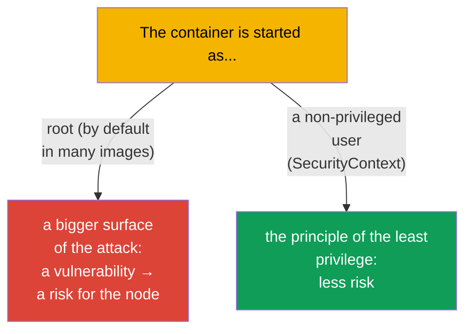
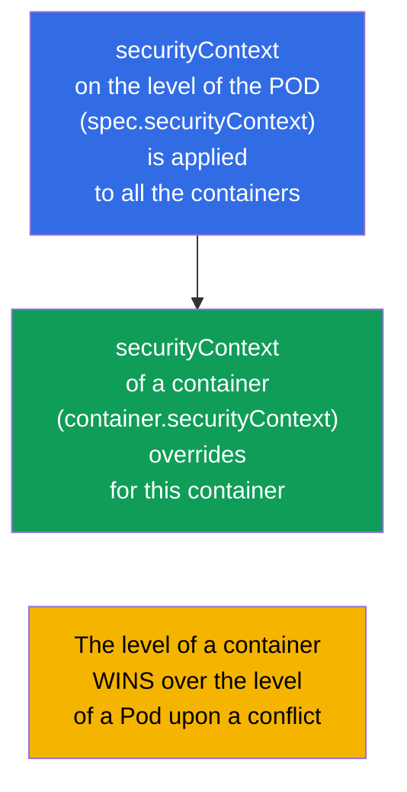
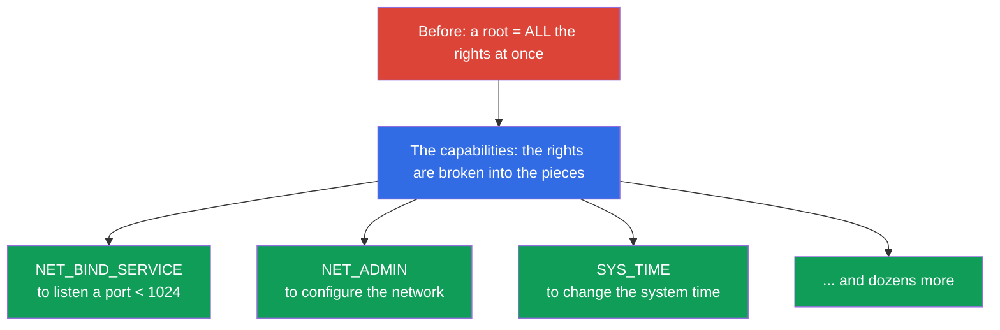
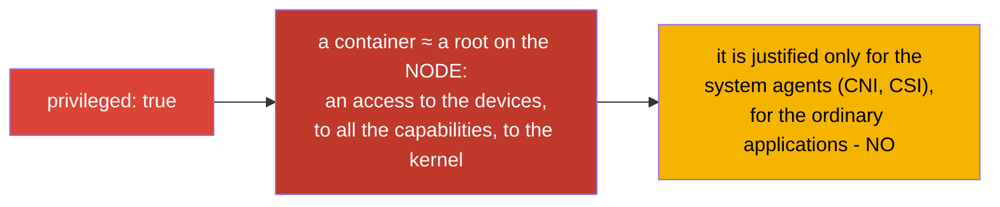
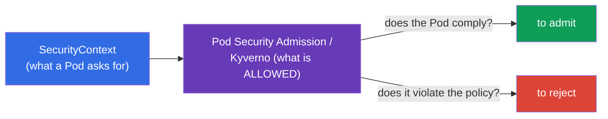

[Русская версия](ru.md) · [Versión en español](es.md) · [Version française](fr.md) · [Deutsche Version](de.md) · [ქართული ვერსია](ge.md) · [繁體中文版](tw.md) · [日本語版](jp.md)

# Chapter 20. The SecurityContext and the capabilities

> **What comes next.** We are able to configure an application. Now - under what user and
> with what privileges a container works. The **SecurityContext** sets the settings
> of the security on the level of a Pod and of a container: from what UID to start a process, whether it is possible
> to write into the root FS, to escalate the privileges, what Linux capabilities to give. This is the domain
> Environment/Config/**Security** (CKAD, 25%) and the section of the security of the CKA. The topic is the foundation
> of the "principle of the least privilege" and a frequent source of the tasks and of the real incidents.

## 20.1. What the SecurityContext is needed for

By default many containers are started from the **root** (UID 0). Inside a container this
seems harmless, but a root in a container upon an incorrect setting or a vulnerability in the runtime
- is a step to a root on the node. The principle of the security: **to give a process the minimum of the rights**.
The SecurityContext is an instrument in order to set this minimum.



## 20.2. The two levels: a Pod and a container

The SecurityContext is set on **two levels**, and it is important to distinguish this.



- **The level of a Pod** (`spec.securityContext`) - the common settings for all the containers of a Pod;
  to here also belong the settings applicable only to a Pod (for example, the `fsGroup`).
- **The level of a container** (`spec.containers[].securityContext`) - the settings of a concrete
  container; upon a conflict it **overrides** the level of a Pod.

## 20.3. The key fields of the SecurityContext

```yaml
spec:
  securityContext:              # the level of a Pod
    runAsUser: 1000             # the UID of the process
    runAsGroup: 3000            # the GID of the process
    fsGroup: 2000               # the owner group of the mounted volumes
    runAsNonRoot: true          # to forbid a start from the root
  containers:
  - name: app
    image: nginx
    securityContext:            # the level of a container
      allowPrivilegeEscalation: false
      readOnlyRootFilesystem: true
      privileged: false
      capabilities:
        drop: ["ALL"]
        add: ["NET_BIND_SERVICE"]
```

Let us take apart the most important fields:

| The field | What it does | The level |
|------|-----------|---------|
| `runAsUser` / `runAsGroup` | from what UID/GID to start a process | a Pod and a container |
| `runAsNonRoot: true` | to forbid a start from the root (a Pod will not start, if an image wants a root) | a Pod and a container |
| `fsGroup` | the owner group of the volumes (for an access to the mounted data) | only a Pod |
| `allowPrivilegeEscalation: false` | to forbid a process to escalate the privileges (setuid and so on) | a container |
| `readOnlyRootFilesystem: true` | the root FS is only for the reading | a container |
| `privileged: true` | a privileged container (almost like a root on the node) - it is dangerous! | a container |
| `capabilities` | a fine tuning of the Linux capabilities (see below) | a container |

## 20.4. The Linux capabilities: the privileges finer than a root/a non-root

Traditionally in Linux there is an "almighty root" and an ordinary user. The **capabilities**
break up the omnipotence of the root into the separate rights (to open a privileged port, to change the network,
to mount an FS and so on). This allows to give a process only the needed privilege, and not the root
entirely.



The practice of the security: **to drop all the capabilities and to add only the needed ones**:

```yaml
    securityContext:
      capabilities:
        drop: ["ALL"]                  # to remove all
        add: ["NET_BIND_SERVICE"]      # to return only the needed one
```

For example, the `NET_BIND_SERVICE` allows a process to listen a port below 1024 (for example, the 80),
without being a root. This way a web server can listen the 80th port without the rights of a superuser.

## 20.5. The privileged: why this is dangerous

The `privileged: true` gives a container practically all the capabilities of the host: an access to the devices
of the node, to all the capabilities, a bypass of the majority of the restrictions. In essence this is a **root on the node**.



The privileged containers are needed rarely - only by the system components (some CNI,
CSI, the agents working with the kernel). An ordinary application does not need the `privileged`, and its presence
- is a red flag for the security.

## 20.6. The checking and the typical problems

```bash
# Under what user a process works
kubectl exec <pod> -- id
# uid=1000 gid=3000 ...

# To check the settings of the security
kubectl get pod <pod> -o jsonpath='{.spec.securityContext}'
kubectl get pod <pod> -o jsonpath='{.spec.containers[0].securityContext}'
```

The frequent problems and their reasons:

| The symptom | The probable reason |
|---------|-------------------|
| A Pod does not start, `runAsNonRoot` | an image tries to start from the root, while the `runAsNonRoot: true` is set |
| A "Permission denied" upon a writing | the `readOnlyRootFilesystem: true` (a writable volume is needed for the temp data) |
| There is no access to the mounted volume | the `fsGroup` is not set, the files belong to another GID |
| The application does not listen the port 80 | it is not a root and there is no `NET_BIND_SERVICE` |

Upon the `readOnlyRootFilesystem: true` an application usually needs a writing into the separate directories
(the `/tmp`, the caches) - they are given through an `emptyDir` volume (the chapter 24), while the root remains read-only.

## 20.7. The connection with the Pod Security and with the policies (an overview)

The SecurityContext sets the settings, but somebody has to **require** their observance. For this
the policies of the level of a cluster are responsible:

- **The Pod Security Admission (PSA)** - a built-in mechanism, applying to a namespace one of
  the standards: the `privileged` (without the restrictions), the `baseline` (the minimal restrictions),
  the `restricted` (strictly: non-root, drop capabilities, no privilege escalation).
- **The external policies** - OPA/Gatekeeper, Kyverno - the arbitrary rules (for example,
  "to forbid the privileged in the whole cluster").



We do not go deeply into the policies (this is already in many respects the territory of the CKS), but to know the link
"the SecurityContext asks - the policy checks" is useful for both exams.

## 20.8. How this is applied in the production

- **A non-root by default.** The mature teams start the containers from a non-privileged
  user (the `runAsNonRoot: true`, the `runAsUser`), building the images in such a way that an application
  works without a root. This sharply lowers the consequences of a compromise of a container.
- **The drop ALL + the minimum of the capabilities.** The standard of the security: to drop all the capabilities and
  to add only the really needed ones. The `NET_BIND_SERVICE` for the privileged ports is a frequent
  single "add".
- **The readOnlyRootFilesystem + the writable volumes.** The root FS is made read-only, while for the
  temporary data an `emptyDir` is mounted. This prevents an attacker from writing/substituting the files in
  a container.
- **A prohibition of the privileged by a policy.** In the production through the Pod Security Admission (the `restricted`) or
  the Kyverno/the Gatekeeper one forbids the privileged, the hostPath, the hostNetwork and a start from the root on the
  level of the whole cluster - in order for an insecure Pod simply not to be created.
- **The fsGroup for an access to the data.** Upon the work with the persistent volumes (a DB, the uploads)
  a correctly set `fsGroup` solves the problems of a "permission denied" on the mounted
  data - a frequent pain without the SecurityContext.

## 20.9. A mini glossary

- **SecurityContext** - the settings of the security on the level of a Pod/of a container.
- **runAsUser / runAsGroup** - the UID/the GID of the process of a container.
- **runAsNonRoot** - a prohibition of a start from the root.
- **fsGroup** - the owner group of the mounted volumes (the level of a Pod).
- **allowPrivilegeEscalation** - an allowance/a prohibition of an escalation of the privileges.
- **readOnlyRootFilesystem** - the root FS is only for the reading.
- **privileged** - a privileged container (≈ a root on the node); it is dangerous.
- **capabilities** - the separate rights out of the "omnipotence of the root" (drop/add).
- **Pod Security Admission** - a built-in policy of the levels privileged/baseline/restricted.

## 20.10. The summary of the chapter

- The SecurityContext sets, under what user and with what privileges a
  container works; the goal is the principle of the least privilege.
- The two levels: a Pod (the common settings, the `fsGroup`) and a container (it overrides a Pod upon a
  conflict).
- The key fields: the `runAsUser/Group`, the `runAsNonRoot`, the `fsGroup`,
  the `allowPrivilegeEscalation`, the `readOnlyRootFilesystem`, the `privileged`, the `capabilities`.
- The capabilities break the omnipotence of the root into the separate rights; the practice is the `drop: [ALL]` +
  an `add` only of the needed one (for example, the `NET_BIND_SERVICE`).
- The `privileged: true` ≈ a root on the node - it is dangerous, it is justified only for the system agents.
- The observance of the settings is required by the policies: the Pod Security Admission (baseline/restricted),
  the Kyverno/the Gatekeeper.

## 20.11. How this will come in handy: on the exam and in the real work

**On the exam.** "Start a container from the UID 1000", "forbid an escalation of the privileges",
"add/drop a capability", "make the root FS read-only" are the typical tasks of the domain
Security. One needs to confidently write a `securityContext` on the needed level and to understand the difference
between the level of a Pod and of a container. A debugging of "a Pod does not start because of the runAsNonRoot" is also
a frequent scenario.

**In the real work.** The SecurityContext is the base of the security of the workloads: a non-root,
the minimum of the capabilities, a read-only root sharply lower the damage from the vulnerabilities and from a compromise.
In the production this is reinforced by the policies of the level of a cluster, in order for the insecure Pods not to be created
in principle. A correct `fsGroup` solves the everyday problems of an access to the volumes.

## 20.12. Self-check questions

1. Why is it a bad practice to start a container from the root?
2. In what do the SecurityContext of the level of a Pod and of a container differ? Who wins upon a conflict?
3. What do the `runAsNonRoot`, the `readOnlyRootFilesystem` and the `allowPrivilegeEscalation` do?
4. What are the Linux capabilities and why is the `drop: [ALL]` + a pinpoint `add` recommended?
5. Why is the `privileged: true` dangerous and who really needs it?
6. What is the `fsGroup` needed for and what problem does it solve?
7. How are the SecurityContext and the Pod Security Admission connected?

## Practice

We have closed the security on the level of a container. The last topic of the part 3 (the chapter 21) is
the ServiceAccount and an overview of the authentication, of the authorization and of the admission: how the Pods and the users
get an access to the API. The SecurityContext is drilled in the labs on the security.

🧪 Lab 106 (the SecurityContext and the capabilities): [tasks/cka/labs/106](../../labs/106/README.MD)

---
[Contents](../README.md) · [Chapter 19](../19/README.md) · [Chapter 21](../21/README.md)
