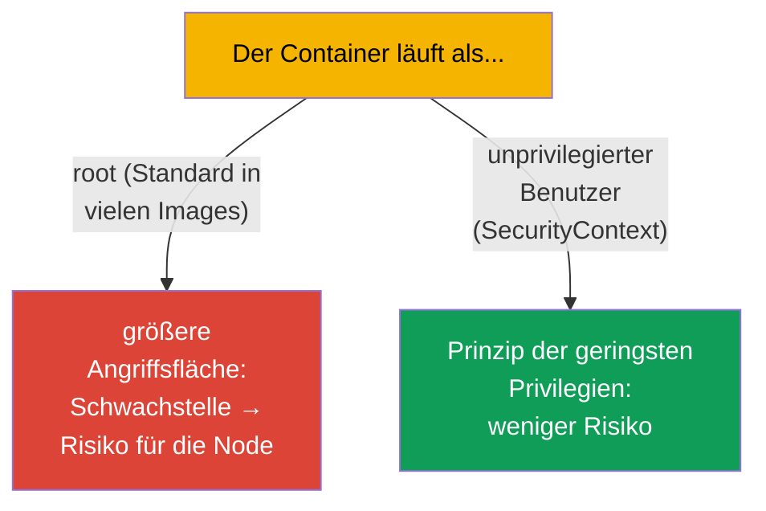
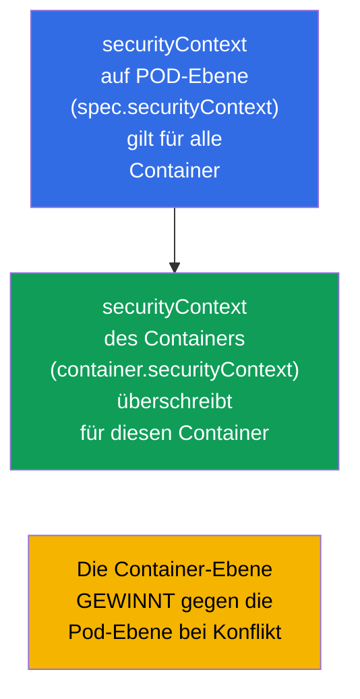
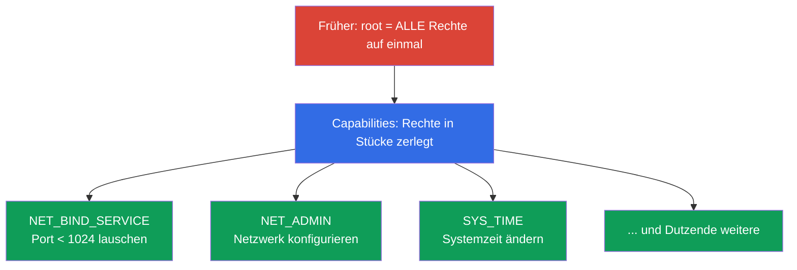
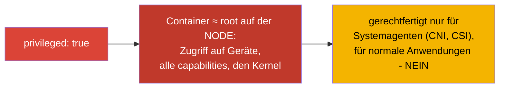
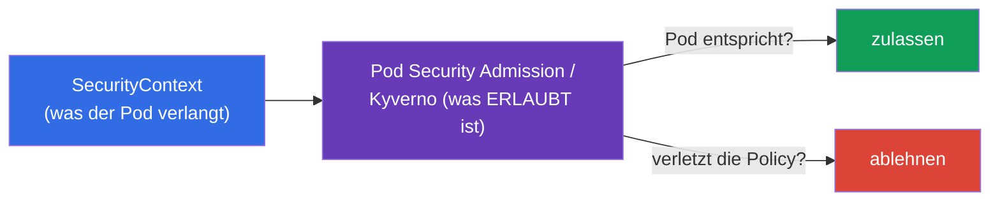

[Русская версия](ru.md) · [Eng version](README.md) · [Versión en español](es.md) · [Version française](fr.md) · [ქართული ვერსია](ge.md)

# Kapitel 20. SecurityContext und capabilities

> **Was kommt.** Wir können eine Anwendung konfigurieren. Jetzt geht es darum, unter
> welchem Benutzer und mit welchen Privilegien ein Container läuft. **SecurityContext**
> legt die Sicherheitseinstellungen auf Pod- und Container-Ebene fest: unter welcher UID
> der Prozess startet, ob in das Root-Dateisystem geschrieben werden darf, ob Privilegien
> erhöht werden dürfen, welche Linux-capabilities gegeben werden. Das ist die Domäne
> Environment/Config/**Security** (CKAD, 25%) und der Sicherheitsabschnitt von CKA. Das
> Thema ist das Fundament des „Prinzips der geringsten Privilegien“ und eine häufige Quelle
> von Prüfungsaufgaben und echten Vorfällen.

## 20.1. Wozu man SecurityContext braucht

Standardmäßig laufen viele Container als **root** (UID 0). Innerhalb des Containers wirkt
das harmlos, aber root im Container ist bei falscher Konfiguration oder einer
Schwachstelle in der Runtime ein Schritt zu root auf der Node. Das Sicherheitsprinzip:
**dem Prozess ein Minimum an Rechten geben**. SecurityContext ist das Werkzeug, um dieses
Minimum festzulegen.



## 20.2. Zwei Ebenen: Pod und Container

SecurityContext wird auf **zwei Ebenen** gesetzt, und das muss man unterscheiden.



- **Pod-Ebene** (`spec.securityContext`) - allgemeine Einstellungen für alle Container des
  Pods; dazu gehören auch Einstellungen, die nur für den Pod gelten (zum Beispiel
  `fsGroup`).
- **Container-Ebene** (`spec.containers[].securityContext`) - Einstellungen des konkreten
  Containers; bei Konflikt **überschreibt** sie die Pod-Ebene.

## 20.3. Die wichtigsten Felder von SecurityContext

```yaml
spec:
  securityContext:              # Pod-Ebene
    runAsUser: 1000             # UID des Prozesses
    runAsGroup: 3000            # GID des Prozesses
    fsGroup: 2000               # Eigentümergruppe der eingebundenen Volumes
    runAsNonRoot: true          # Start als root verbieten
  containers:
  - name: app
    image: nginx
    securityContext:            # Container-Ebene
      allowPrivilegeEscalation: false
      readOnlyRootFilesystem: true
      privileged: false
      capabilities:
        drop: ["ALL"]
        add: ["NET_BIND_SERVICE"]
```

Sehen wir uns die wichtigsten Felder an:

| Feld | Was es tut | Ebene |
|------|-----------|---------|
| `runAsUser` / `runAsGroup` | unter welcher UID/GID der Prozess startet | Pod und Container |
| `runAsNonRoot: true` | Start als root verbieten (der Pod startet nicht, wenn das Image root will) | Pod und Container |
| `fsGroup` | Eigentümergruppe der Volumes (für den Zugriff auf eingebundene Daten) | nur Pod |
| `allowPrivilegeEscalation: false` | dem Prozess verbieten, Privilegien zu erhöhen (setuid u. Ä.) | Container |
| `readOnlyRootFilesystem: true` | Root-Dateisystem nur lesbar | Container |
| `privileged: true` | privilegierter Container (fast wie root auf der Node) - gefährlich! | Container |
| `capabilities` | feine Steuerung der Linux-Fähigkeiten (siehe unten) | Container |

## 20.4. Linux capabilities: Privilegien feiner als root/nicht-root

Traditionell gibt es in Linux den „allmächtigen root“ und den normalen Benutzer.
**Capabilities** zerlegen die Allmacht von root in einzelne Rechte (einen privilegierten
Port öffnen, das Netzwerk ändern, Dateisysteme mounten usw.). So kann man einem Prozess nur
das nötige Privileg geben und nicht root als Ganzes.



Sicherheitspraxis: **alle capabilities entfernen und nur die nötigen hinzufügen**:

```yaml
    securityContext:
      capabilities:
        drop: ["ALL"]                  # alle entfernen
        add: ["NET_BIND_SERVICE"]      # nur die nötige zurückgeben
```

Zum Beispiel erlaubt `NET_BIND_SERVICE` einem Prozess, auf einem Port unter 1024 (etwa 80)
zu lauschen, ohne root zu sein. So kann ein Webserver Port 80 ohne Superuser-Rechte
bedienen.

## 20.5. privileged: warum das gefährlich ist

`privileged: true` gibt dem Container praktisch alle Fähigkeiten des Hosts: Zugriff auf die
Geräte der Node, alle capabilities, Umgehung der meisten Einschränkungen. Im Kern ist das
**root auf der Node**.



Privilegierte Container braucht man selten - nur Systemkomponenten (manche CNI, CSI,
Agenten, die mit dem Kernel arbeiten). Eine normale Anwendung braucht `privileged` nicht,
und sein Vorhandensein ist eine rote Flagge für die Sicherheit.

## 20.6. Prüfung und typische Probleme

```bash
# Unter welchem Benutzer der Prozess läuft
kubectl exec <pod> -- id
# uid=1000 gid=3000 ...

# Die Sicherheitseinstellungen prüfen
kubectl get pod <pod> -o jsonpath='{.spec.securityContext}'
kubectl get pod <pod> -o jsonpath='{.spec.containers[0].securityContext}'
```

Häufige Probleme und ihre Ursachen:

| Symptom | Wahrscheinliche Ursache |
|---------|-------------------|
| Pod startet nicht, `runAsNonRoot` | das Image versucht als root zu starten, dabei ist `runAsNonRoot: true` gesetzt |
| „Permission denied“ beim Schreiben | `readOnlyRootFilesystem: true` (es braucht ein beschreibbares Volume für temporäre Daten) |
| Kein Zugriff auf das eingebundene Volume | `fsGroup` ist nicht gesetzt, die Dateien gehören einer anderen GID |
| Die Anwendung lauscht nicht auf Port 80 | nicht root und kein `NET_BIND_SERVICE` |

Bei `readOnlyRootFilesystem: true` braucht die Anwendung meist Schreibzugriff auf einzelne
Verzeichnisse (`/tmp`, Caches) - die gibt man über ein `emptyDir`-Volume (Kapitel 24), und
das Root bleibt read-only.

## 20.7. Zusammenhang mit Pod Security und Policies (Überblick)

SecurityContext legt die Einstellungen fest, aber jemand muss ihre Einhaltung
**verlangen**. Dafür sind Policies auf Cluster-Ebene zuständig:

- **Pod Security Admission (PSA)** - ein eingebauter Mechanismus, der auf einen Namespace
  einen der Standards anwendet: `privileged` (ohne Einschränkungen), `baseline` (minimale
  Einschränkungen), `restricted` (streng: non-root, drop capabilities, no privilege
  escalation).
- **Externe Policies** - OPA/Gatekeeper, Kyverno - beliebige Regeln (zum Beispiel
  „privileged im ganzen Cluster verbieten“).



Tief in Policies (das ist schon größtenteils das Gebiet von CKS) gehen wir nicht, aber die
Kopplung „SecurityContext verlangt - die Policy prüft“ zu kennen ist für beide Prüfungen
nützlich.

## 20.8. Wie man das in der Produktion anwendet

- **Non-root als Standard.** Reife Teams starten Container unter einem unprivilegierten
  Benutzer (`runAsNonRoot: true`, `runAsUser`) und bauen Images so, dass die Anwendung ohne
  root läuft. Das senkt die Folgen einer Kompromittierung des Containers deutlich.
- **drop ALL + minimale capabilities.** Der Sicherheitsstandard: alle capabilities
  entfernen und nur die wirklich nötigen hinzufügen. `NET_BIND_SERVICE` für privilegierte
  Ports ist oft das einzige „add“.
- **readOnlyRootFilesystem + beschreibbare Volumes.** Das Root-Dateisystem macht man
  read-only, und für temporäre Daten bindet man `emptyDir` ein. Das hindert einen
  Angreifer daran, Dateien im Container zu schreiben oder auszutauschen.
- **Verbot von privileged per Policy.** In der Produktion verbietet man über Pod Security
  Admission (`restricted`) oder Kyverno/Gatekeeper privileged, hostPath, hostNetwork und
  den Start als root auf Ebene des gesamten Clusters - damit ein unsicherer Pod einfach
  nicht entsteht.
- **fsGroup für den Datenzugriff.** Bei der Arbeit mit persistenten Volumes (Datenbanken,
  Uploads) löst ein richtig gesetztes `fsGroup` die Probleme „permission denied“ auf
  eingebundenen Daten - ein häufiger Schmerz ohne SecurityContext.

## 20.9. Mini-Glossar

- **SecurityContext** - Sicherheitseinstellungen auf Pod-/Container-Ebene.
- **runAsUser / runAsGroup** - UID/GID des Container-Prozesses.
- **runAsNonRoot** - Verbot des Starts als root.
- **fsGroup** - Eigentümergruppe der eingebundenen Volumes (Pod-Ebene).
- **allowPrivilegeEscalation** - Erlaubnis/Verbot der Privilegienerhöhung.
- **readOnlyRootFilesystem** - Root-Dateisystem nur lesbar.
- **privileged** - privilegierter Container (≈ root auf der Node); gefährlich.
- **capabilities** - einzelne Rechte aus der „Allmacht von root“ (drop/add).
- **Pod Security Admission** - eingebaute Policy mit den Stufen
  privileged/baseline/restricted.

## 20.10. Zusammenfassung des Kapitels

- SecurityContext legt fest, unter welchem Benutzer und mit welchen Privilegien ein
  Container läuft; das Ziel ist das Prinzip der geringsten Privilegien.
- Zwei Ebenen: Pod (allgemeine Einstellungen, `fsGroup`) und Container (überschreibt den
  Pod bei Konflikt).
- Die wichtigsten Felder: `runAsUser/Group`, `runAsNonRoot`, `fsGroup`,
  `allowPrivilegeEscalation`, `readOnlyRootFilesystem`, `privileged`, `capabilities`.
- Capabilities zerlegen die Allmacht von root in einzelne Rechte; die Praxis ist
  `drop: [ALL]` + `add` nur des Nötigen (zum Beispiel `NET_BIND_SERVICE`).
- `privileged: true` ≈ root auf der Node - gefährlich, gerechtfertigt nur für
  Systemagenten.
- Die Einhaltung der Einstellungen verlangen Policies: Pod Security Admission
  (baseline/restricted), Kyverno/Gatekeeper.

## 20.11. Wofür das nützlich ist: in der Prüfung und in der echten Arbeit

**In der Prüfung.** „Starte den Container unter UID 1000“, „verbiete die
Privilegienerhöhung“, „füge eine capability hinzu/entferne sie“, „mache das
Root-Dateisystem read-only“ - das sind typische Aufgaben der Domäne Security. Man muss
`securityContext` sicher auf der richtigen Ebene schreiben und den Unterschied zwischen
Pod- und Container-Ebene verstehen. Das Debuggen von „der Pod startet nicht wegen
runAsNonRoot“ ist ebenfalls ein häufiges Szenario.

**In der echten Arbeit.** SecurityContext ist die Grundlage der Sicherheit von Workloads:
non-root, minimale capabilities und ein read-only Root senken den Schaden aus
Schwachstellen und Kompromittierungen deutlich. In der Produktion stützt man das mit
Policies auf Cluster-Ebene ab, damit unsichere Pods grundsätzlich nicht entstehen. Ein
richtiges `fsGroup` löst alltägliche Probleme beim Zugriff auf Volumes.

## 20.12. Fragen zur Selbstüberprüfung

1. Warum ist es eine schlechte Praxis, einen Container als root zu starten?
2. Wodurch unterscheiden sich SecurityContext auf Pod- und Container-Ebene? Wer gewinnt bei
   Konflikt?
3. Was tun `runAsNonRoot`, `readOnlyRootFilesystem` und `allowPrivilegeEscalation`?
4. Was sind Linux capabilities und warum wird `drop: [ALL]` + punktuelles `add` empfohlen?
5. Warum ist `privileged: true` gefährlich und wer braucht es wirklich?
6. Wozu braucht man `fsGroup` und welches Problem löst es?
7. Wie hängen SecurityContext und Pod Security Admission zusammen?

## Praxis

Wir haben die Sicherheit auf Container-Ebene abgeschlossen. Das letzte Thema von Teil 3
(Kapitel 21) ist ServiceAccount und ein Überblick über Authentifizierung, Autorisierung und
Admission: wie Pods und Benutzer Zugriff auf die API bekommen. SecurityContext wird in den
Labs zur Sicherheit geübt.

🧪 Lab 106 (SecurityContext und capabilities): [tasks/cka/labs/106](../../labs/106/README_DE.MD)

---
[Inhalt](../README_DE.md) · [Kapitel 19](../19/de.md) · [Kapitel 21](../21/de.md)
