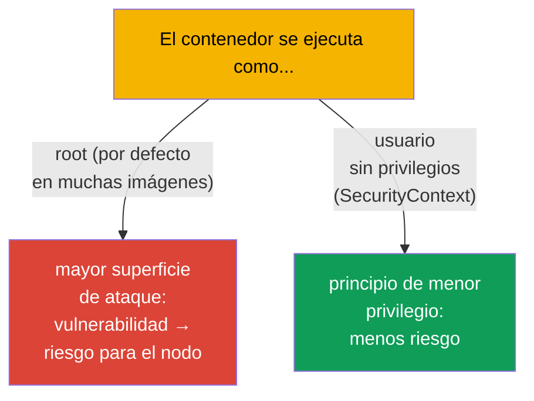
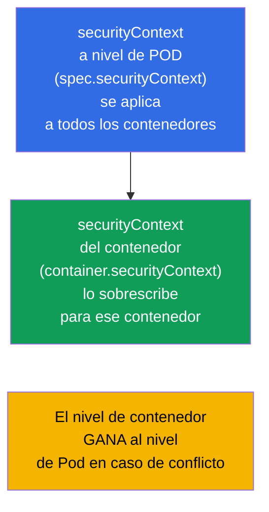
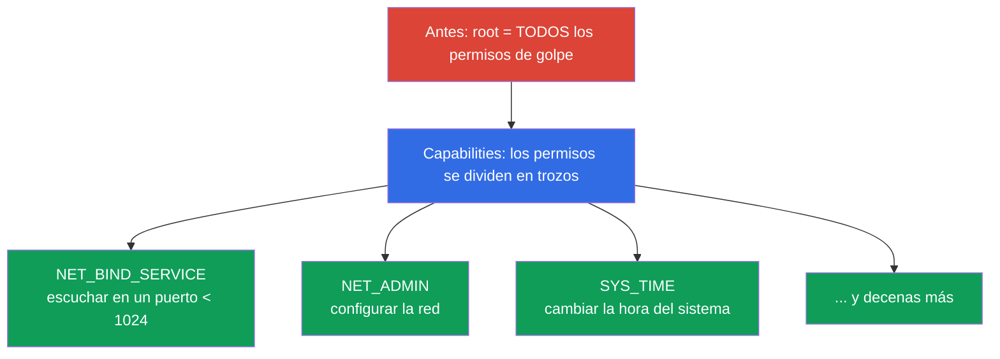
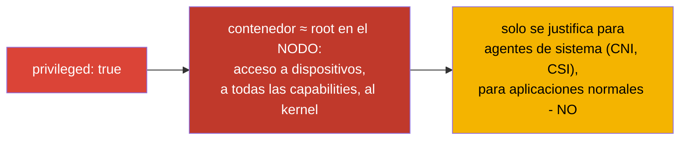
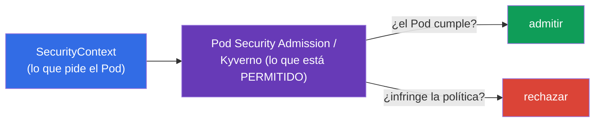

[Русская версия](ru.md) · [Eng version](README.md) · [Version française](fr.md) · [Deutsche Version](de.md) · [ქართული ვერსია](ge.md) · [繁體中文版](tw.md) · [日本語版](jp.md)

# Capítulo 20. SecurityContext y capabilities

> **Qué viene ahora.** Ya sabemos configurar una aplicación. Ahora toca ver con qué usuario y
> con qué privilegios se ejecuta el contenedor. El **SecurityContext** define los ajustes de
> seguridad a nivel de Pod y de contenedor: con qué UID arrancar el proceso, si se puede
> escribir en el sistema de archivos raíz, si se pueden elevar privilegios, qué
> Linux-capabilities conceder. Es el dominio Environment/Config/**Security** (CKAD, 25%) y el
> apartado de seguridad de CKA. El tema es la base del «principio de menor privilegio» y una
> fuente habitual de tareas de examen y de incidentes reales.

## 20.1. Para qué sirve el SecurityContext

Por defecto muchos contenedores se ejecutan como **root** (UID 0). Dentro del contenedor
parece inofensivo, pero root en el contenedor, con una configuración incorrecta o una
vulnerabilidad del runtime, es un paso hacia root en el nodo. El principio de seguridad:
**dar al proceso los mínimos permisos**. El SecurityContext es la herramienta para fijar ese
mínimo.



## 20.2. Dos niveles: Pod y contenedor

El SecurityContext se define en **dos niveles**, y es importante distinguirlos.



- **Nivel de Pod** (`spec.securityContext`) - ajustes comunes para todos los contenedores del
  Pod; aquí entran también los ajustes aplicables solo al Pod (por ejemplo, `fsGroup`).
- **Nivel de contenedor** (`spec.containers[].securityContext`) - ajustes de un contenedor
  concreto; en caso de conflicto **sobrescribe** el nivel de Pod.

## 20.3. Campos clave del SecurityContext

```yaml
spec:
  securityContext:              # nivel de Pod
    runAsUser: 1000             # UID del proceso
    runAsGroup: 3000            # GID del proceso
    fsGroup: 2000               # grupo propietario de los volúmenes montados
    runAsNonRoot: true          # prohibir la ejecución como root
  containers:
  - name: app
    image: nginx
    securityContext:            # nivel de contenedor
      allowPrivilegeEscalation: false
      readOnlyRootFilesystem: true
      privileged: false
      capabilities:
        drop: ["ALL"]
        add: ["NET_BIND_SERVICE"]
```

Veamos los campos más importantes:

| Campo | Qué hace | Nivel |
|------|-----------|---------|
| `runAsUser` / `runAsGroup` | con qué UID/GID arrancar el proceso | Pod y contenedor |
| `runAsNonRoot: true` | prohibir la ejecución como root (el Pod no arranca si la imagen quiere root) | Pod y contenedor |
| `fsGroup` | grupo propietario de los volúmenes (para acceder a los datos montados) | solo Pod |
| `allowPrivilegeEscalation: false` | impedir que el proceso eleve privilegios (setuid, etc.) | contenedor |
| `readOnlyRootFilesystem: true` | sistema de archivos raíz solo de lectura | contenedor |
| `privileged: true` | contenedor privilegiado (casi como root en el nodo) - ¡peligroso! | contenedor |
| `capabilities` | ajuste fino de las capacidades de Linux (ver abajo) | contenedor |

## 20.4. Linux capabilities: privilegios más finos que root/no-root

Tradicionalmente en Linux existen el «root todopoderoso» y el usuario normal. Las
**capabilities** dividen la omnipotencia de root en permisos separados (abrir un puerto
privilegiado, cambiar la red, montar sistemas de archivos, etc.). Eso permite dar al proceso
solo el privilegio necesario, y no root entero.



Práctica de seguridad: **descartar todas las capabilities y añadir solo las necesarias**:

```yaml
    securityContext:
      capabilities:
        drop: ["ALL"]                  # quitar todas
        add: ["NET_BIND_SERVICE"]      # devolver solo la necesaria
```

Por ejemplo, `NET_BIND_SERVICE` permite al proceso escuchar en un puerto por debajo de 1024
(por ejemplo, el 80) sin ser root. Así un servidor web puede escuchar en el puerto 80 sin
permisos de superusuario.

## 20.5. privileged: por qué es peligroso

`privileged: true` da al contenedor prácticamente todas las capacidades del host: acceso a
los dispositivos del nodo, todas las capabilities, salto de la mayoría de las restricciones.
En esencia es **root en el nodo**.



Los contenedores privilegiados se necesitan pocas veces - solo para componentes de sistema
(algunos CNI, CSI, agentes que trabajan con el kernel). Una aplicación normal no necesita
`privileged`, y su presencia es una señal de alarma para la seguridad.

## 20.6. Comprobación y problemas típicos

```bash
# Con qué usuario se ejecuta el proceso
kubectl exec <pod> -- id
# uid=1000 gid=3000 ...

# Revisar los ajustes de seguridad
kubectl get pod <pod> -o jsonpath='{.spec.securityContext}'
kubectl get pod <pod> -o jsonpath='{.spec.containers[0].securityContext}'
```

Problemas frecuentes y sus causas:

| Síntoma | Causa probable |
|---------|-------------------|
| El Pod no arranca, `runAsNonRoot` | la imagen intenta arrancar como root y está puesto `runAsNonRoot: true` |
| «Permission denied» al escribir | `readOnlyRootFilesystem: true` (hace falta un volumen escribible para datos temporales) |
| Sin acceso al volumen montado | no está definido `fsGroup`, los archivos pertenecen a otro GID |
| La aplicación no escucha en el puerto 80 | no es root y no tiene `NET_BIND_SERVICE` |

Con `readOnlyRootFilesystem: true` la aplicación normalmente necesita escribir en directorios
concretos (`/tmp`, cachés) - se le dan mediante un volumen `emptyDir` (capítulo 24), y la raíz
sigue siendo read-only.

## 20.7. Relación con Pod Security y las políticas (visión general)

El SecurityContext define los ajustes, pero alguien tiene que **exigir** que se cumplan. De
eso se encargan las políticas a nivel de clúster:

- **Pod Security Admission (PSA)** - mecanismo integrado que aplica a un namespace uno de los
  estándares: `privileged` (sin restricciones), `baseline` (restricciones mínimas),
  `restricted` (estricto: non-root, drop capabilities, no privilege escalation).
- **Políticas externas** - OPA/Gatekeeper, Kyverno - reglas arbitrarias (por ejemplo,
  «prohibir privileged en todo el clúster»).



No profundizamos en las políticas (eso es en buena medida terreno de CKS), pero conocer la
pareja «el SecurityContext pide - la política comprueba» es útil para los dos exámenes.

## 20.8. Cómo se aplica esto en producción

- **Non-root por defecto.** Los equipos maduros ejecutan los contenedores con un usuario sin
  privilegios (`runAsNonRoot: true`, `runAsUser`), construyendo las imágenes para que la
  aplicación funcione sin root. Eso reduce drásticamente las consecuencias de que el
  contenedor se vea comprometido.
- **drop ALL + capabilities mínimas.** El estándar de seguridad: descartar todas las
  capabilities y añadir solo las realmente necesarias. `NET_BIND_SERVICE` para los puertos
  privilegiados es a menudo el único «add».
- **readOnlyRootFilesystem + volúmenes escribibles.** El sistema de archivos raíz se pone
  read-only y para los datos temporales se monta un `emptyDir`. Eso impide que un atacante
  escriba o sustituya archivos en el contenedor.
- **Prohibición de privileged por política.** En producción se prohíben privileged, hostPath,
  hostNetwork y la ejecución como root a nivel de todo el clúster mediante Pod Security
  Admission (`restricted`) o Kyverno/Gatekeeper - para que un Pod inseguro ni se cree.
- **fsGroup para acceder a los datos.** Al trabajar con volúmenes persistentes (bases de
  datos, subidas), un `fsGroup` bien puesto resuelve los problemas de «permission denied» en
  los datos montados - un dolor habitual sin SecurityContext.

## 20.9. Mini-glosario

- **SecurityContext** - ajustes de seguridad a nivel de Pod/contenedor.
- **runAsUser / runAsGroup** - UID/GID del proceso del contenedor.
- **runAsNonRoot** - prohibición de ejecutarse como root.
- **fsGroup** - grupo propietario de los volúmenes montados (nivel de Pod).
- **allowPrivilegeEscalation** - permiso/prohibición de elevar privilegios.
- **readOnlyRootFilesystem** - sistema de archivos raíz solo de lectura.
- **privileged** - contenedor privilegiado (≈ root en el nodo); peligroso.
- **capabilities** - permisos separados sacados de la «omnipotencia de root» (drop/add).
- **Pod Security Admission** - política integrada con los niveles privileged/baseline/restricted.

## 20.10. Resumen del capítulo

- El SecurityContext define con qué usuario y con qué privilegios funciona el contenedor; el
  objetivo es el principio de menor privilegio.
- Dos niveles: Pod (ajustes comunes, `fsGroup`) y contenedor (sobrescribe el Pod en caso de
  conflicto).
- Campos clave: `runAsUser/Group`, `runAsNonRoot`, `fsGroup`,
  `allowPrivilegeEscalation`, `readOnlyRootFilesystem`, `privileged`, `capabilities`.
- Las capabilities fragmentan la omnipotencia de root en permisos separados; la práctica es
  `drop: [ALL]` + `add` solo de lo necesario (por ejemplo, `NET_BIND_SERVICE`).
- `privileged: true` ≈ root en el nodo - peligroso, solo se justifica para agentes de sistema.
- El cumplimiento de los ajustes lo exigen las políticas: Pod Security Admission
  (baseline/restricted), Kyverno/Gatekeeper.

## 20.11. Para qué te servirá: en el examen y en el trabajo real

**En el examen.** «Ejecuta el contenedor con el UID 1000», «prohíbe la elevación de
privilegios», «añade/descarta una capability», «pon el sistema de archivos raíz en read-only»
son tareas típicas del dominio Security. Hay que escribir con soltura el `securityContext` en
el nivel adecuado y entender la diferencia entre el nivel de Pod y el de contenedor. Depurar
«el Pod no arranca por runAsNonRoot» es también un escenario frecuente.

**En el trabajo real.** El SecurityContext es la base de la seguridad de las cargas de
trabajo: non-root, capabilities mínimas y raíz de solo lectura reducen drásticamente el daño
de las vulnerabilidades y de una intrusión. En producción esto se refuerza con políticas a
nivel de clúster, para que los Pods inseguros ni se lleguen a crear. Un `fsGroup` correcto
resuelve los problemas cotidianos de acceso a los volúmenes.

## 20.12. Preguntas de autoevaluación

1. ¿Por qué ejecutar un contenedor como root es una mala práctica?
2. ¿En qué se diferencian el SecurityContext de nivel de Pod y el de contenedor? ¿Quién gana en un conflicto?
3. ¿Qué hacen `runAsNonRoot`, `readOnlyRootFilesystem` y `allowPrivilegeEscalation`?
4. ¿Qué son las Linux capabilities y por qué se recomienda `drop: [ALL]` + un `add` puntual?
5. ¿Por qué `privileged: true` es peligroso y quién lo necesita de verdad?
6. ¿Para qué sirve `fsGroup` y qué problema resuelve?
7. ¿Cómo se relacionan el SecurityContext y Pod Security Admission?

## Práctica

Hemos cerrado la seguridad a nivel de contenedor. El último tema de la parte 3 (capítulo 21)
es el ServiceAccount y una visión general de la autenticación, la autorización y el
admission: cómo obtienen acceso a la API los Pods y los usuarios. El SecurityContext se
practica en los laboratorios de seguridad.

🧪 Laboratorio 106 (SecurityContext y capabilities): [tasks/cka/labs/106](../../labs/106/README_ES.MD)

🎮 Killercoda (en el navegador, sin instalación): [Drop Linux Capabilities](https://killercoda.com/chadmcrowell/course/ckad/drop-capabilities) · [Read-Only Root Filesystem](https://killercoda.com/chadmcrowell/course/ckad/readonly-rootfs) · [PodSecurity Restricted Namespace](https://killercoda.com/chadmcrowell/course/ckad/podsecurity-restricted)

---
[Índice](../README_ES.md) · [Capítulo 19](../19/es.md) · [Capítulo 21](../21/es.md)
