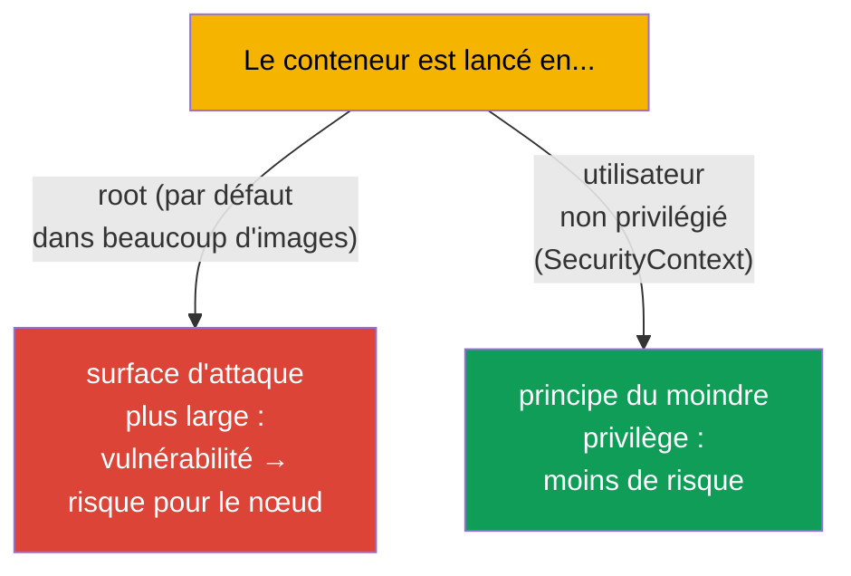
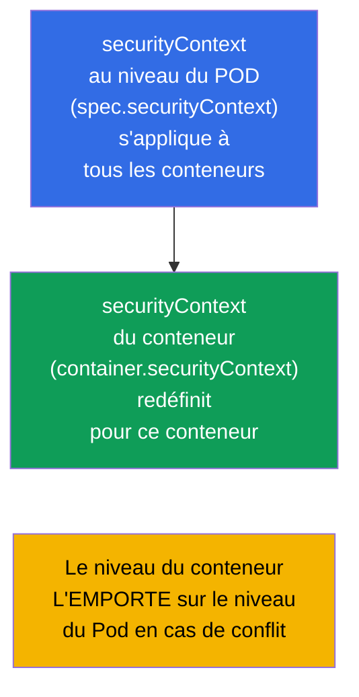
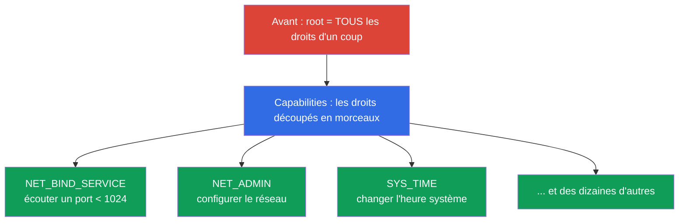
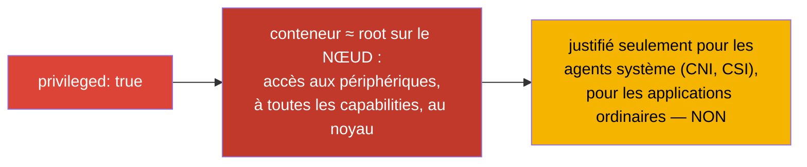
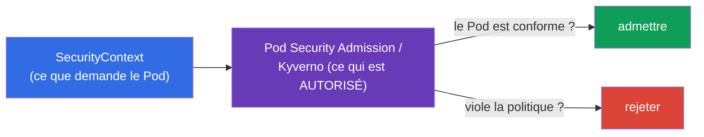

[Русская версия](ru.md) · [Eng version](README.md) · [Versión en español](es.md) · [Deutsche Version](de.md) · [ქართული ვერსია](ge.md)

# Chapitre 20. SecurityContext et capabilities

> **Ce qui suit.** Nous savons configurer une application. Maintenant - sous quel
> utilisateur et avec quels privilèges tourne le conteneur. Le **SecurityContext** définit
> les réglages de sécurité au niveau du Pod et du conteneur : sous quel UID lancer le
> processus, peut-on écrire dans le système de fichiers racine, élever les privilèges,
> quelles capabilities Linux accorder. C'est le domaine Environment/Config/**Security**
> (CKAD, 25 %) et la section sécurité du CKA. Ce sujet est le fondement du « principe du
> moindre privilège » et une source fréquente d'exercices comme d'incidents réels.

## 20.1. À quoi sert le SecurityContext

Par défaut, beaucoup de conteneurs sont lancés en **root** (UID 0). À l'intérieur du
conteneur cela paraît anodin, mais root dans un conteneur, avec une mauvaise configuration
ou une vulnérabilité du runtime, c'est un pas vers root sur le nœud. Le principe de
sécurité : **donner au processus le minimum de droits**. Le SecurityContext est l'outil qui
permet de définir ce minimum.



## 20.2. Deux niveaux : Pod et conteneur

Le SecurityContext se définit à **deux niveaux**, et il est important de les distinguer.



- **Niveau du Pod** (`spec.securityContext`) - réglages communs à tous les conteneurs du
  Pod ; on y trouve aussi les réglages applicables uniquement au Pod (par exemple
  `fsGroup`).
- **Niveau du conteneur** (`spec.containers[].securityContext`) - réglages d'un conteneur
  précis ; en cas de conflit il **redéfinit** le niveau du Pod.

## 20.3. Champs clés du SecurityContext

```yaml
spec:
  securityContext:              # niveau du Pod
    runAsUser: 1000             # UID du processus
    runAsGroup: 3000            # GID du processus
    fsGroup: 2000               # groupe propriétaire des volumes montés
    runAsNonRoot: true          # interdire le lancement en root
  containers:
  - name: app
    image: nginx
    securityContext:            # niveau du conteneur
      allowPrivilegeEscalation: false
      readOnlyRootFilesystem: true
      privileged: false
      capabilities:
        drop: ["ALL"]
        add: ["NET_BIND_SERVICE"]
```

Examinons les champs les plus importants :

| Champ | Ce qu'il fait | Niveau |
|------|-----------|---------|
| `runAsUser` / `runAsGroup` | sous quel UID/GID lancer le processus | Pod et conteneur |
| `runAsNonRoot: true` | interdire le lancement en root (le Pod ne démarre pas si l'image veut root) | Pod et conteneur |
| `fsGroup` | groupe propriétaire des volumes (pour accéder aux données montées) | Pod uniquement |
| `allowPrivilegeEscalation: false` | interdire au processus d'élever ses privilèges (setuid, etc.) | conteneur |
| `readOnlyRootFilesystem: true` | système de fichiers racine en lecture seule | conteneur |
| `privileged: true` | conteneur privilégié (presque comme root sur le nœud) - dangereux ! | conteneur |
| `capabilities` | réglage fin des possibilités Linux (voir ci-dessous) | conteneur |

## 20.4. Capabilities Linux : des privilèges plus fins que root/non-root

Traditionnellement, Linux connaît le « root tout-puissant » et l'utilisateur ordinaire. Les
**capabilities** découpent la toute-puissance de root en droits séparés (ouvrir un port
privilégié, modifier le réseau, monter un système de fichiers, etc.). Cela permet de donner
au processus uniquement le privilège nécessaire, et non root en entier.



Pratique de sécurité : **retirer toutes les capabilities et n'ajouter que celles qui sont
nécessaires** :

```yaml
    securityContext:
      capabilities:
        drop: ["ALL"]                  # tout retirer
        add: ["NET_BIND_SERVICE"]      # ne rendre que la capability utile
```

Par exemple, `NET_BIND_SERVICE` permet à un processus d'écouter un port inférieur à 1024
(par exemple 80) sans être root. Un serveur web peut ainsi écouter le port 80 sans droits de
superutilisateur.

## 20.5. privileged : pourquoi c'est dangereux

`privileged: true` donne au conteneur pratiquement toutes les possibilités de l'hôte :
accès aux périphériques du nœud, à toutes les capabilities, contournement de la plupart des
restrictions. C'est en substance **root sur le nœud**.



Les conteneurs privilégiés sont rarement nécessaires - uniquement pour les composants
système (certains CNI, CSI, agents travaillant avec le noyau). Une application ordinaire n'a
pas besoin de `privileged`, et sa présence est un drapeau rouge pour la sécurité.

## 20.6. Vérification et problèmes typiques

```bash
# Sous quel utilisateur tourne le processus
kubectl exec <pod> -- id
# uid=1000 gid=3000 ...

# Vérifier les réglages de sécurité
kubectl get pod <pod> -o jsonpath='{.spec.securityContext}'
kubectl get pod <pod> -o jsonpath='{.spec.containers[0].securityContext}'
```

Problèmes fréquents et leurs causes :

| Symptôme | Cause probable |
|---------|-------------------|
| Le Pod ne démarre pas, `runAsNonRoot` | l'image tente de démarrer en root alors que `runAsNonRoot: true` est posé |
| « Permission denied » à l'écriture | `readOnlyRootFilesystem: true` (il faut un volume inscriptible pour les données temporaires) |
| Pas d'accès au volume monté | `fsGroup` non défini, les fichiers appartiennent à un autre GID |
| L'application n'écoute pas le port 80 | pas root et pas de `NET_BIND_SERVICE` |

Avec `readOnlyRootFilesystem: true`, l'application a généralement besoin d'écrire dans
certains répertoires (`/tmp`, caches) - on les fournit via un volume `emptyDir`
(chapitre 24), et la racine reste en lecture seule.

## 20.7. Lien avec Pod Security et les politiques (aperçu)

Le SecurityContext définit les réglages, mais quelqu'un doit **exiger** leur respect. Ce
sont les politiques au niveau du cluster qui s'en chargent :

- **Pod Security Admission (PSA)** - mécanisme intégré qui applique à un namespace l'un des
  standards : `privileged` (sans restrictions), `baseline` (restrictions minimales),
  `restricted` (strict : non-root, drop capabilities, no privilege escalation).
- **Politiques externes** - OPA/Gatekeeper, Kyverno - règles arbitraires (par exemple
  « interdire privileged dans tout le cluster »).



Nous n'entrons pas profondément dans les politiques (c'est largement le territoire du CKS),
mais connaître le couple « le SecurityContext demande - la politique vérifie » est utile
pour les deux examens.

## 20.8. Comment cela s'applique en production

- **Non-root par défaut.** Les équipes matures lancent les conteneurs sous un utilisateur
  non privilégié (`runAsNonRoot: true`, `runAsUser`), en construisant les images pour que
  l'application fonctionne sans root. Cela réduit fortement les conséquences d'une
  compromission de conteneur.
- **drop ALL + minimum de capabilities.** Standard de sécurité : retirer toutes les
  capabilities et n'ajouter que celles réellement nécessaires. `NET_BIND_SERVICE` pour les
  ports privilégiés est souvent le seul « add ».
- **readOnlyRootFilesystem + volumes inscriptibles.** On passe le système de fichiers racine
  en lecture seule et on monte un `emptyDir` pour les données temporaires. Cela empêche un
  attaquant d'écrire ou de remplacer des fichiers dans le conteneur.
- **Interdiction de privileged par politique.** En prod, via Pod Security Admission
  (`restricted`) ou Kyverno/Gatekeeper, on interdit privileged, hostPath, hostNetwork et le
  lancement en root au niveau de tout le cluster - pour qu'un Pod non sûr ne soit tout
  simplement pas créé.
- **fsGroup pour l'accès aux données.** Avec des volumes persistants (bases de données,
  téléversements), un `fsGroup` correctement positionné résout les problèmes de « permission
  denied » sur les données montées - une douleur fréquente sans SecurityContext.

## 20.9. Mini-glossaire

- **SecurityContext** - réglages de sécurité au niveau du Pod/du conteneur.
- **runAsUser / runAsGroup** - UID/GID du processus du conteneur.
- **runAsNonRoot** - interdiction du lancement en root.
- **fsGroup** - groupe propriétaire des volumes montés (niveau du Pod).
- **allowPrivilegeEscalation** - autorisation/interdiction de l'élévation de privilèges.
- **readOnlyRootFilesystem** - système de fichiers racine en lecture seule.
- **privileged** - conteneur privilégié (≈ root sur le nœud) ; dangereux.
- **capabilities** - droits séparés issus de la « toute-puissance de root » (drop/add).
- **Pod Security Admission** - politique intégrée aux niveaux privileged/baseline/restricted.

## 20.10. Bilan du chapitre

- Le SecurityContext définit sous quel utilisateur et avec quels privilèges tourne le
  conteneur ; l'objectif est le principe du moindre privilège.
- Deux niveaux : le Pod (réglages communs, `fsGroup`) et le conteneur (redéfinit le Pod en
  cas de conflit).
- Champs clés : `runAsUser/Group`, `runAsNonRoot`, `fsGroup`,
  `allowPrivilegeEscalation`, `readOnlyRootFilesystem`, `privileged`, `capabilities`.
- Les capabilities découpent la toute-puissance de root en droits séparés ; la pratique est
  `drop: [ALL]` + `add` du seul droit utile (par exemple `NET_BIND_SERVICE`).
- `privileged: true` ≈ root sur le nœud - dangereux, justifié seulement pour les agents
  système.
- Le respect des réglages est exigé par les politiques : Pod Security Admission
  (baseline/restricted), Kyverno/Gatekeeper.

## 20.11. À quoi cela sert : à l'examen et dans le travail réel

**À l'examen.** « Lance un conteneur sous l'UID 1000 », « interdis l'élévation de
privilèges », « ajoute/retire une capability », « passe le système de fichiers racine en
lecture seule » sont des exercices types du domaine Security. Il faut écrire avec assurance
un `securityContext` au bon niveau et comprendre la différence entre le niveau du Pod et
celui du conteneur. Le débogage « le Pod ne démarre pas à cause de runAsNonRoot » est aussi
un scénario fréquent.

**Dans le travail réel.** Le SecurityContext est la base de la sécurité des charges de
travail : non-root, minimum de capabilities, racine en lecture seule réduisent fortement les
dégâts liés aux vulnérabilités et aux compromissions. En prod, on renforce cela par des
politiques au niveau du cluster, pour que des Pods non sûrs ne soient pas créés du tout. Un
`fsGroup` correct résout les problèmes quotidiens d'accès aux volumes.

## 20.12. Questions d'auto-évaluation

1. Pourquoi lancer un conteneur en root est-il une mauvaise pratique ?
2. En quoi le SecurityContext du niveau Pod diffère-t-il de celui du conteneur ? Qui
   l'emporte en cas de conflit ?
3. Que font `runAsNonRoot`, `readOnlyRootFilesystem` et `allowPrivilegeEscalation` ?
4. Que sont les capabilities Linux et pourquoi recommande-t-on `drop: [ALL]` + un `add`
   ciblé ?
5. Pourquoi `privileged: true` est-il dangereux et qui en a réellement besoin ?
6. À quoi sert `fsGroup` et quel problème résout-il ?
7. Quel est le lien entre le SecurityContext et Pod Security Admission ?

## Pratique

Nous avons couvert la sécurité au niveau du conteneur. Le dernier sujet de la partie 3
(chapitre 21) - ServiceAccount et aperçu de l'authentification, de l'autorisation et de
l'admission : comment les Pods et les utilisateurs obtiennent l'accès à l'API. Le
SecurityContext se travaille dans les TP sur la sécurité.

🧪 TP 106 (SecurityContext et capabilities) : [tasks/cka/labs/106](../../labs/106/README_FR.MD)

---
[Sommaire](../README_FR.md) · [Chapitre 19](../19/fr.md) · [Chapitre 21](../21/fr.md)
