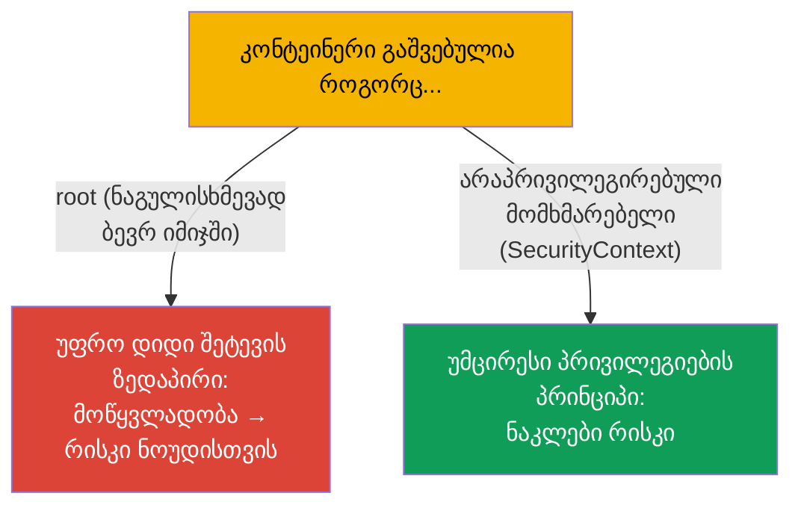
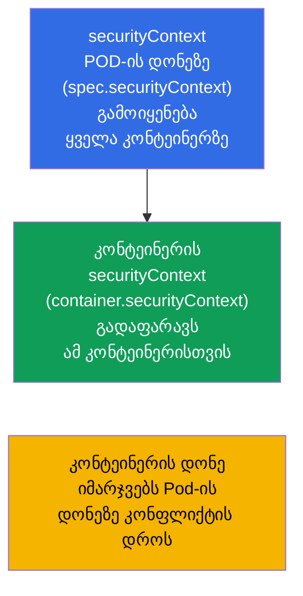
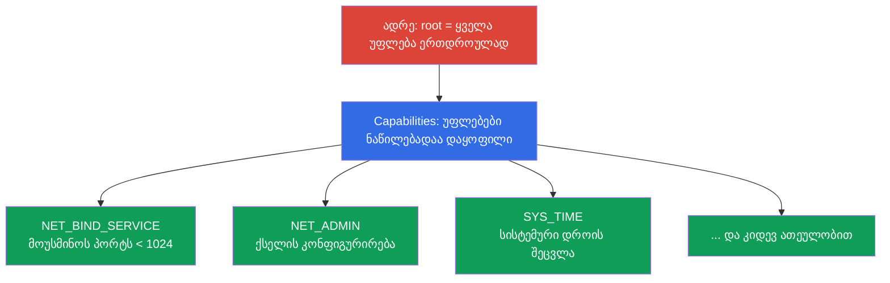
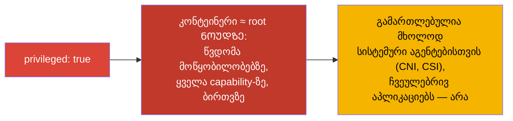
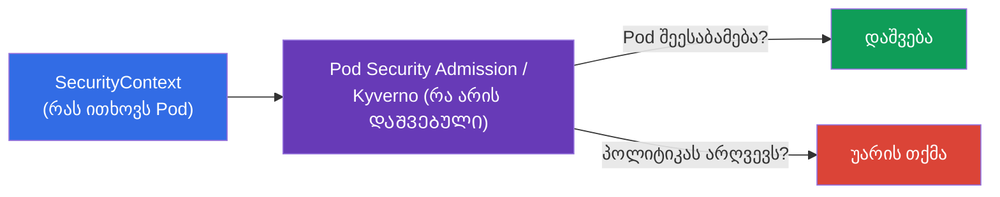

[Русская версия](ru.md) · [Eng version](README.md) · [Versión en español](es.md) · [Version française](fr.md) · [Deutsche Version](de.md)

# თავი 20. SecurityContext და capabilities

> **რა იქნება შემდეგ.** აპლიკაციის კონფიგურირება ვიცით. ახლა - რომელი მომხმარებლით და
> რა პრივილეგიებით მუშაობს კონტეინერი. **SecurityContext** უსაფრთხოების პარამეტრებს
> განსაზღვრავს Pod-ისა და კონტეინერის დონეზე: რომელი UID-ით გავუშვათ პროცესი, შეიძლება თუ არა
> ძირეულ ფაილურ სისტემაში ჩაწერა, პრივილეგიების აწევა, რომელი Linux-capabilities გადავცეთ. ეს არის დომენი
> Environment/Config/**Security** (CKAD, 25%) და CKA-ს უსაფრთხოების განყოფილება. თემა - „უმცირესი
> პრივილეგიების პრინციპის“ საფუძველია და დავალებების, ასევე რეალური ინციდენტების ხშირი წყარო.

## 20.1. რისთვის არის საჭირო SecurityContext

ნაგულისხმევად ბევრი კონტეინერი **root**-ით (UID 0) იშვება. კონტეინერის შიგნით ეს
უვნებლად ჩანს, მაგრამ root კონტეინერში არასწორი კონფიგურაციის ან რანტაიმის მოწყვლადობის დროს
- ეს ნაბიჯია ნოუდზე root-ისკენ. უსაფრთხოების პრინციპი: **პროცესს მინიმუმ უფლებები მივცეთ**.
SecurityContext - ინსტრუმენტია, რომ ეს მინიმუმი განისაზღვროს.



## 20.2. ორი დონე: Pod და კონტეინერი

SecurityContext განისაზღვრება **ორ დონეზე**, და ამის გარჩევა მნიშვნელოვანია.



- **Pod-ის დონე** (`spec.securityContext`) - საერთო პარამეტრები Pod-ის ყველა კონტეინერისთვის;
  აქვე მიეკუთვნება პარამეტრები, რომლებიც მხოლოდ Pod-ისთვის გამოიყენება (მაგალითად, `fsGroup`).
- **კონტეინერის დონე** (`spec.containers[].securityContext`) - კონკრეტული კონტეინერის
  პარამეტრები; კონფლიქტის დროს **გადაფარავს** Pod-ის დონეს.

## 20.3. SecurityContext-ის საკვანძო ველები

```yaml
spec:
  securityContext:              # Pod-ის დონე
    runAsUser: 1000             # პროცესის UID
    runAsGroup: 3000            # პროცესის GID
    fsGroup: 2000               # მიმაგრებული ტომების მფლობელი ჯგუფი
    runAsNonRoot: true          # root-ით გაშვების აკრძალვა
  containers:
  - name: app
    image: nginx
    securityContext:            # კონტეინერის დონე
      allowPrivilegeEscalation: false
      readOnlyRootFilesystem: true
      privileged: false
      capabilities:
        drop: ["ALL"]
        add: ["NET_BIND_SERVICE"]
```

გავარჩიოთ ყველაზე მნიშვნელოვანი ველები:

| ველი | რას აკეთებს | დონე |
|------|-----------|---------|
| `runAsUser` / `runAsGroup` | რომელი UID/GID-ით გავუშვათ პროცესი | Pod და კონტეინერი |
| `runAsNonRoot: true` | root-ით გაშვების აკრძალვა (Pod არ გაეშვება, თუ იმიჯს root სჭირდება) | Pod და კონტეინერი |
| `fsGroup` | ტომების მფლობელი ჯგუფი (მიმაგრებულ მონაცემებზე წვდომისთვის) | მხოლოდ Pod |
| `allowPrivilegeEscalation: false` | აუკრძალოს პროცესს პრივილეგიების აწევა (setuid და მისთ.) | კონტეინერი |
| `readOnlyRootFilesystem: true` | ძირეული ფაილური სისტემა მხოლოდ წაკითხვისთვის | კონტეინერი |
| `privileged: true` | პრივილეგირებული კონტეინერი (თითქმის როგორც root ნოუდზე) - საშიშია! | კონტეინერი |
| `capabilities` | Linux-შესაძლებლობების ზუსტი მართვა (იხ. ქვემოთ) | კონტეინერი |

## 20.4. Linux capabilities: პრივილეგიები უფრო ზუსტად, ვიდრე root/არა-root

ტრადიციულად Linux-ში არის „ყოვლისშემძლე root“ და ჩვეულებრივი მომხმარებელი. **Capabilities**
root-ის ყოვლისშემძლეობას ცალკეულ უფლებებად ყოფს (პრივილეგირებული პორტის გახსნა, ქსელის შეცვლა,
ფაილური სისტემის მიმაგრება და ა.შ.). ეს საშუალებას იძლევა პროცესს მხოლოდ საჭირო პრივილეგია მიეცეს, და არა root
მთლიანად.



უსაფრთხოების პრაქტიკა: **ჩამოვყაროთ ყველა capability და დავამატოთ მხოლოდ საჭირო**:

```yaml
    securityContext:
      capabilities:
        drop: ["ALL"]                  # ყველას მოხსნა
        add: ["NET_BIND_SERVICE"]      # მხოლოდ საჭიროს დაბრუნება
```

მაგალითად, `NET_BIND_SERVICE` პროცესს საშუალებას აძლევს მოუსმინოს 1024-ზე დაბალ პორტს (მაგალითად, 80),
root-ის გარეშე. ასე ვებ-სერვერს შეუძლია 80-ე პორტს მოუსმინოს სუპერმომხმარებლის უფლებების გარეშე.

## 20.5. privileged: რატომ არის ეს საშიში

`privileged: true` კონტეინერს ჰოსტის პრაქტიკულად ყველა შესაძლებლობას აძლევს: წვდომას ნოუდის
მოწყობილობებზე, ყველა capability-ს, უმეტესი შეზღუდვის გვერდის ავლას. არსებითად ეს არის **root ნოუდზე**.



პრივილეგირებული კონტეინერები იშვიათად სჭირდება - მხოლოდ სისტემურ კომპონენტებს (ზოგიერთი CNI,
CSI, ბირთვთან მომუშავე აგენტები). ჩვეულებრივ აპლიკაციას `privileged` არ სჭირდება, და მისი არსებობა
- უსაფრთხოებისთვის წითელი დროშაა.

## 20.6. შემოწმება და ტიპური პრობლემები

```bash
# რომელი მომხმარებლით მუშაობს პროცესი
kubectl exec <pod> -- id
# uid=1000 gid=3000 ...

# უსაფრთხოების პარამეტრების შემოწმება
kubectl get pod <pod> -o jsonpath='{.spec.securityContext}'
kubectl get pod <pod> -o jsonpath='{.spec.containers[0].securityContext}'
```

ხშირი პრობლემები და მათი მიზეზები:

| სიმპტომი | სავარაუდო მიზეზი |
|---------|-------------------|
| Pod არ იშვება, `runAsNonRoot` | იმიჯი root-ით გაშვებას ცდილობს, ხოლო დაყენებულია `runAsNonRoot: true` |
| „Permission denied“ ჩაწერისას | `readOnlyRootFilesystem: true` (temp-მონაცემებისთვის სჭირდება writable ტომი) |
| არ არის წვდომა მიმაგრებულ ტომზე | არ არის მითითებული `fsGroup`, ფაილები სხვა GID-ს ეკუთვნის |
| აპლიკაცია არ უსმენს პორტს 80 | არა-root და არ არის `NET_BIND_SERVICE` |

`readOnlyRootFilesystem: true`-ს დროს აპლიკაციას ჩვეულებრივ სჭირდება ჩაწერა ცალკეულ კატალოგებში
(`/tmp`, ქეშები) - მათ `emptyDir`-ტომით აძლევენ (თავი 24), ხოლო ძირი read-only რჩება.

## 20.7. კავშირი Pod Security-სთან და პოლიტიკებთან (მიმოხილვა)

SecurityContext პარამეტრებს განსაზღვრავს, მაგრამ ვინმემ უნდა **მოითხოვოს** მათი დაცვა. ამაზე
პასუხისმგებელია კლასტერის დონის პოლიტიკები:

- **Pod Security Admission (PSA)** - ჩაშენებული მექანიზმი, რომელიც namespace-ზე იყენებს ერთ
  სტანდარტს: `privileged` (შეზღუდვების გარეშე), `baseline` (მინიმალური შეზღუდვები),
  `restricted` (მკაცრად: non-root, drop capabilities, no privilege escalation).
- **გარე პოლიტიკები** - OPA/Gatekeeper, Kyverno - თვითნებური წესები (მაგალითად,
  „აიკრძალოს privileged მთელ კლასტერში“).



პოლიტიკებში ღრმად (ეს დიდწილად უკვე CKS-ის ტერიტორიაა) არ ჩავდივართ, მაგრამ კავშირის
„SecurityContext ითხოვს - პოლიტიკა ამოწმებს“ ცოდნა ორივე გამოცდისთვის სასარგებლოა.

## 20.8. როგორ იყენებენ ამას პროდაქშენში

- **Non-root ნაგულისხმევად.** მოწიფული გუნდები კონტეინერებს არაპრივილეგირებული
  მომხმარებლით უშვებენ (`runAsNonRoot: true`, `runAsUser`), იმიჯებს ისე აწყობენ, რომ აპლიკაცია
  root-ის გარეშე იმუშაოს. ეს მკვეთრად ამცირებს კონტეინერის კომპრომეტაციის შედეგებს.
- **drop ALL + capabilities-ის მინიმუმი.** უსაფრთხოების სტანდარტი: ჩამოვყაროთ ყველა capability და
  დავამატოთ მხოლოდ რეალურად საჭირო. `NET_BIND_SERVICE` პრივილეგირებული პორტებისთვის - ხშირად
  ერთადერთი „add“.
- **readOnlyRootFilesystem + writable-ტომები.** ძირეულ ფაილურ სისტემას read-only ხდიან, ხოლო
  დროებითი მონაცემებისთვის `emptyDir`-ს ამაგრებენ. ეს შემტევს უშლის ხელს კონტეინერში ფაილების
  ჩაწერაში/შეცვლაში.
- **privileged-ის აკრძალვა პოლიტიკით.** პროდში Pod Security Admission-ის (`restricted`) ან
  Kyverno/Gatekeeper-ის საშუალებით კრძალავენ privileged-ს, hostPath-ს, hostNetwork-ს და root-ით გაშვებას
  მთელი კლასტერის დონეზე - რომ არაუსაფრთხო Pod უბრალოდ არ შეიქმნას.
- **fsGroup მონაცემებზე წვდომისთვის.** მუდმივ ტომებთან მუშაობის დროს (ბაზები, ატვირთვები)
  სწორად გამოტანილი `fsGroup` წყვეტს „permission denied“-ის პრობლემებს მიმაგრებულ
  მონაცემებზე - ხშირი ტკივილს SecurityContext-ის გარეშე.

## 20.9. მინი-ლექსიკონი

- **SecurityContext** - უსაფრთხოების პარამეტრები Pod-ის/კონტეინერის დონეზე.
- **runAsUser / runAsGroup** - კონტეინერის პროცესის UID/GID.
- **runAsNonRoot** - root-ით გაშვების აკრძალვა.
- **fsGroup** - მიმაგრებული ტომების მფლობელი ჯგუფი (Pod-ის დონე).
- **allowPrivilegeEscalation** - პრივილეგიების აწევის ნების დართვა/აკრძალვა.
- **readOnlyRootFilesystem** - ძირეული ფაილური სისტემა მხოლოდ წაკითხვისთვის.
- **privileged** - პრივილეგირებული კონტეინერი (≈ root ნოუდზე); საშიშია.
- **capabilities** - ცალკეული უფლებები „root-ის ყოვლისშემძლეობიდან“ (drop/add).
- **Pod Security Admission** - ჩაშენებული პოლიტიკა privileged/baseline/restricted დონეებით.

## 20.10. თავის შეჯამება

- SecurityContext განსაზღვრავს, რომელი მომხმარებლით და რა პრივილეგიებით მუშაობს
  კონტეინერი; მიზანი - უმცირესი პრივილეგიების პრინციპი.
- ორი დონე: Pod (საერთო პარამეტრები, `fsGroup`) და კონტეინერი (კონფლიქტის დროს Pod-ს
  გადაფარავს).
- საკვანძო ველები: `runAsUser/Group`, `runAsNonRoot`, `fsGroup`,
  `allowPrivilegeEscalation`, `readOnlyRootFilesystem`, `privileged`, `capabilities`.
- Capabilities root-ის ყოვლისშემძლეობას ცალკეულ უფლებებად ყოფს; პრაქტიკა - `drop: [ALL]` +
  `add` მხოლოდ საჭიროსი (მაგალითად, `NET_BIND_SERVICE`).
- `privileged: true` ≈ root ნოუდზე - საშიშია, გამართლებულია მხოლოდ სისტემური აგენტებისთვის.
- პარამეტრების დაცვას მოითხოვს პოლიტიკები: Pod Security Admission (baseline/restricted),
  Kyverno/Gatekeeper.

## 20.11. როგორ გამოგადგებათ: გამოცდაზე და რეალურ სამუშაოში

**გამოცდაზე.** „გაუშვი კონტეინერი UID 1000-ით“, „აკრძალე პრივილეგიების აწევა“,
„დაამატე/ჩამოყარე capability“, „გახადე ძირეული ფაილური სისტემა read-only“ - Security დომენის
ტიპური დავალებებია. საჭიროა თავდაჯერებულად დაიწეროს `securityContext` სწორ დონეზე და გავიგოთ განსხვავება
Pod-ისა და კონტეინერის დონეს შორის. გამართვა „Pod არ იშვება runAsNonRoot-ის გამო“ - ასევე
ხშირი სცენარია.

**რეალურ სამუშაოში.** SecurityContext - სამუშაო დატვირთვების უსაფრთხოების საფუძველია: non-root,
capabilities-ის მინიმუმი, read-only ძირი მკვეთრად ამცირებს ზიანს მოწყვლადობებისა და კომპრომეტაციისგან.
პროდში ამას კლასტერის დონის პოლიტიკებით განამტკიცებენ, რომ არაუსაფრთხო Pods პრინციპში არ შეიქმნას.
სწორი `fsGroup` ტომებზე წვდომის ყოველდღიურ პრობლემებს წყვეტს.

## 20.12. თვითშემოწმების კითხვები

1. რატომ არის კონტეინერის root-ით გაშვება ცუდი პრაქტიკა?
2. რითი განსხვავდება Pod-ისა და კონტეინერის დონის SecurityContext? ვინ იმარჯვებს კონფლიქტის დროს?
3. რას აკეთებენ `runAsNonRoot`, `readOnlyRootFilesystem` და `allowPrivilegeEscalation`?
4. რა არის Linux capabilities და რატომ არის რეკომენდებული `drop: [ALL]` + წვეტილი `add`?
5. რატომ არის `privileged: true` საშიში და ვის სჭირდება ის რეალურად?
6. რისთვის არის საჭირო `fsGroup` და რომელ პრობლემას წყვეტს ის?
7. როგორ არიან დაკავშირებული SecurityContext და Pod Security Admission?

## პრაქტიკა

კონტეინერის დონის უსაფრთხოება დავხურეთ. ნაწილი 3-ის ბოლო თემა (თავი 21) -
ServiceAccount და ავთენტიფიკაციის, ავტორიზაციისა და admission-ის მიმოხილვა: როგორ იღებენ Pods და მომხმარებლები
წვდომას API-ზე. SecurityContext მუშავდება უსაფრთხოების ლაბებში.

🧪 ლაბი 106 (SecurityContext და capabilities): [tasks/cka/labs/106](../../labs/106/README_GE.MD)

---
[სარჩევი](../README_GE.md) · [თავი 19](../19/ge.md) · [თავი 21](../21/ge.md)
