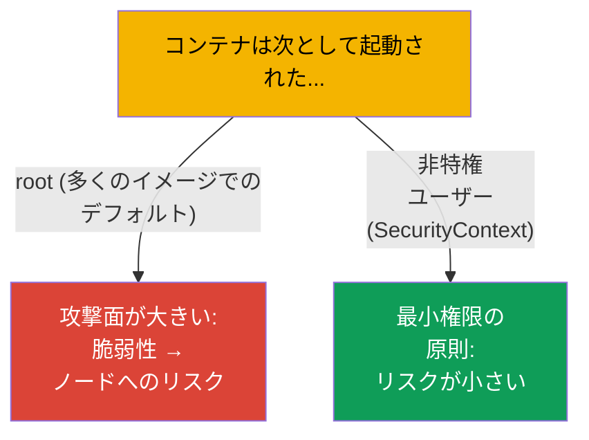
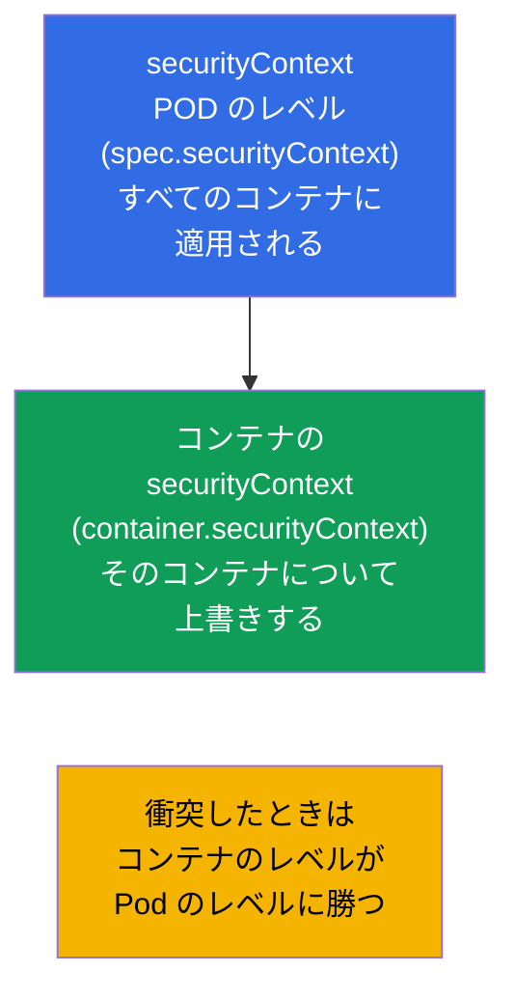
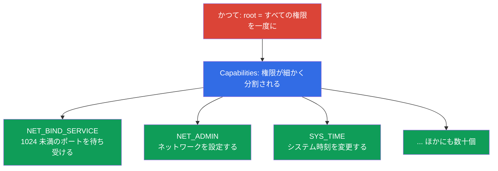
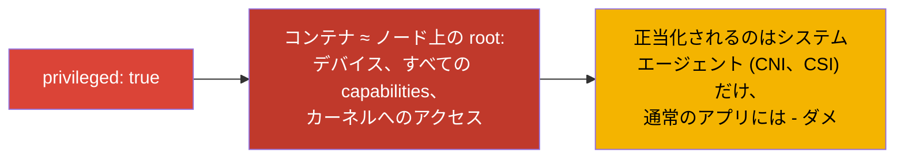
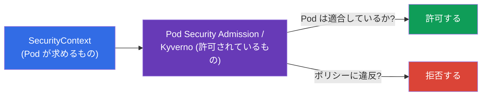

[Русская версия](ru.md) · [Eng version](README.md) · [Versión en español](es.md) · [Version française](fr.md) · [Deutsche Version](de.md) · [ქართული ვერსია](ge.md) · [繁體中文版](tw.md)

# 第 20 章。SecurityContext と capabilities

> **次はなにか。** アプリケーションを設定することはできるようになりました。次は - コンテナが
> どのユーザーで、どんな特権を持って動くのか、です。**SecurityContext** は Pod と
> コンテナのレベルでセキュリティの設定を指定します：プロセスをどの UID で起動するか、
> ルート FS に書き込めるか、特権を昇格できるか、どの Linux capabilities を与えるか。これは
> Environment/Config/**Security** 領域 (CKAD、25%) と CKA のセキュリティのセクションです。
> このテーマは「最小権限の原則」の土台であり、試験問題と実際のインシデントの頻出の源です。

## 20.1. SecurityContext が必要な理由

デフォルトでは多くのコンテナが **root** (UID 0) で起動します。コンテナの内部だけを見れば
無害に思えますが、設定を誤ったりランタイムに脆弱性があったりすると、コンテナ内の root は
ノード上の root への一歩になります。セキュリティの原則は：**プロセスには最小限の権限を
与える**。SecurityContext は、その最小限を指定するための道具です。



## 20.2. 2 つのレベル：Pod とコンテナ

SecurityContext は **2 つのレベル** で指定され、この区別が重要です。



- **Pod のレベル** (`spec.securityContext`) - Pod のすべてのコンテナに共通の設定。
  Pod だけに適用できる設定（たとえば `fsGroup`）もここに属します。
- **コンテナのレベル** (`spec.containers[].securityContext`) - 個々のコンテナの設定。
  衝突したときは Pod のレベルを **上書きします**。

## 20.3. SecurityContext の主要なフィールド

```yaml
spec:
  securityContext:              # Pod のレベル
    runAsUser: 1000             # プロセスの UID
    runAsGroup: 3000            # プロセスの GID
    fsGroup: 2000               # マウントされたボリュームの所有グループ
    runAsNonRoot: true          # root での起動を禁止する
  containers:
  - name: app
    image: nginx
    securityContext:            # コンテナのレベル
      allowPrivilegeEscalation: false
      readOnlyRootFilesystem: true
      privileged: false
      capabilities:
        drop: ["ALL"]
        add: ["NET_BIND_SERVICE"]
```

もっとも重要なフィールドを見ていきましょう：

| フィールド | 何をするか | レベル |
|------|-----------|---------|
| `runAsUser` / `runAsGroup` | プロセスをどの UID/GID で起動するか | Pod とコンテナ |
| `runAsNonRoot: true` | root での起動を禁止する（イメージが root を要求すると Pod は起動しない） | Pod とコンテナ |
| `fsGroup` | ボリュームの所有グループ（マウントされたデータへのアクセスのため） | Pod のみ |
| `allowPrivilegeEscalation: false` | プロセスが特権を昇格すること (setuid など) を禁止する | コンテナ |
| `readOnlyRootFilesystem: true` | ルート FS を読み取り専用にする | コンテナ |
| `privileged: true` | 特権コンテナ（ほぼノード上の root と同じ）- 危険！ | コンテナ |
| `capabilities` | Linux の権限のきめ細かい設定（下記参照） | コンテナ |

## 20.4. Linux capabilities：root / 非 root よりも細かい特権

伝統的に Linux には「万能の root」と普通のユーザーがいます。**Capabilities** は root の
万能さを個別の権限に分割します（特権ポートを開く、ネットワークを変更する、FS を
マウントする、など）。これにより、root 全体ではなく必要な特権だけをプロセスに与えられます。



セキュリティの実務：**すべての capabilities を落として、必要なものだけを追加する**：

```yaml
    securityContext:
      capabilities:
        drop: ["ALL"]                  # すべて外す
        add: ["NET_BIND_SERVICE"]      # 必要なものだけ戻す
```

たとえば `NET_BIND_SERVICE` は、root でなくても 1024 未満のポート（たとえば 80）を
プロセスが待ち受けられるようにします。こうしてウェブサーバーはスーパーユーザー権限なしで
80 番ポートを待ち受けられます。

## 20.5. privileged：なぜこれが危険なのか

`privileged: true` はコンテナにホストのほぼすべての能力を与えます：ノードのデバイスへの
アクセス、すべての capabilities、ほとんどの制限の回避。実質的にこれは **ノード上の root**
です。



特権コンテナが必要なことはまれで、システムコンポーネント（一部の CNI、CSI、カーネルを
扱うエージェント）だけです。通常のアプリケーションに `privileged` は不要であり、それが
あること自体がセキュリティ上のレッドフラグです。

## 20.6. 確認と典型的な問題

```bash
# プロセスがどのユーザーで動いているか
kubectl exec <pod> -- id
# uid=1000 gid=3000 ...

# セキュリティ設定を確認する
kubectl get pod <pod> -o jsonpath='{.spec.securityContext}'
kubectl get pod <pod> -o jsonpath='{.spec.containers[0].securityContext}'
```

よくある問題とその原因：

| 症状 | 考えられる原因 |
|---------|-------------------|
| Pod が起動しない、`runAsNonRoot` | イメージが root で起動しようとしているのに `runAsNonRoot: true` になっている |
| 書き込み時に「Permission denied」 | `readOnlyRootFilesystem: true`（一時データ用に書き込み可能なボリュームが必要） |
| マウントしたボリュームにアクセスできない | `fsGroup` が指定されておらず、ファイルが別の GID に属している |
| アプリケーションがポート 80 を待ち受けない | root でなく、`NET_BIND_SERVICE` もない |

`readOnlyRootFilesystem: true` のとき、アプリケーションは通常いくつかのディレクトリ
(`/tmp`、キャッシュ) への書き込みが必要です - それらは `emptyDir` ボリューム（第 24 章）で
与え、ルートは read-only のままにします。

## 20.7. Pod Security とポリシーとの関係（概観）

SecurityContext は設定を指定しますが、それが守られることを **要求する** 者が必要です。
それを担うのがクラスタレベルのポリシーです：

- **Pod Security Admission (PSA)** - 組み込みの仕組みで、namespace に次の標準のどれかを
  適用します：`privileged`（制限なし）、`baseline`（最小限の制限）、
  `restricted`（厳格：non-root、drop capabilities、no privilege escalation）。
- **外部のポリシー** - OPA/Gatekeeper、Kyverno - 任意のルール（たとえば
  「クラスタ全体で privileged を禁止する」）。



ポリシーに深入りはしません（それはすでに大部分が CKS の領域です）が、
「SecurityContext が求め - ポリシーが検査する」という組み合わせを知っておくことは
両方の試験で役に立ちます。

## 20.8. 本番環境でこれをどう使うか

- **デフォルトで non-root。** 成熟したチームは非特権ユーザーでコンテナを起動し
  (`runAsNonRoot: true`、`runAsUser`)、アプリケーションが root なしで動くように
  イメージをビルドします。これはコンテナが侵害されたときの影響を大きく減らします。
- **drop ALL + 最小限の capabilities。** セキュリティの標準：すべての capabilities を
  落として、本当に必要なものだけを追加します。特権ポート用の `NET_BIND_SERVICE` が
  唯一の「add」であることがよくあります。
- **readOnlyRootFilesystem + 書き込み可能なボリューム。** ルート FS は read-only にし、
  一時データには `emptyDir` をマウントします。これは攻撃者がコンテナ内のファイルを
  書き込んだり差し替えたりするのを妨げます。
- **ポリシーによる privileged の禁止。** 本番では Pod Security Admission (`restricted`)
  や Kyverno/Gatekeeper で、privileged、hostPath、hostNetwork、root での起動を
  クラスタ全体のレベルで禁止します - 安全でない Pod がそもそも作られないようにするためです。
- **データへのアクセスのための fsGroup。** 永続ボリューム（DB、アップロード）を扱うとき、
  正しく設定された `fsGroup` はマウントされたデータの「permission denied」問題を
  解決します - SecurityContext なしではよくある痛みです。

## 20.9. ミニ用語集

- **SecurityContext** - Pod / コンテナのレベルのセキュリティ設定。
- **runAsUser / runAsGroup** - コンテナのプロセスの UID/GID。
- **runAsNonRoot** - root での起動の禁止。
- **fsGroup** - マウントされたボリュームの所有グループ（Pod のレベル）。
- **allowPrivilegeEscalation** - 特権昇格の許可 / 禁止。
- **readOnlyRootFilesystem** - ルート FS を読み取り専用に。
- **privileged** - 特権コンテナ（≈ ノード上の root）。危険。
- **capabilities** - 「root の万能さ」から切り出された個別の権限 (drop/add)。
- **Pod Security Admission** - privileged/baseline/restricted のレベルを持つ組み込みポリシー。

## 20.10. 本章のまとめ

- SecurityContext は、コンテナがどのユーザーで、どんな特権を持って動くのかを指定します。
  目的は最小権限の原則です。
- 2 つのレベル：Pod（共通の設定、`fsGroup`）とコンテナ（衝突したときは Pod を
  上書きする）。
- 主要なフィールド：`runAsUser/Group`、`runAsNonRoot`、`fsGroup`、
  `allowPrivilegeEscalation`、`readOnlyRootFilesystem`、`privileged`、`capabilities`。
- Capabilities は root の万能さを個別の権限に分割します。実務は `drop: [ALL]` +
  必要なものだけの `add`（たとえば `NET_BIND_SERVICE`）。
- `privileged: true` ≈ ノード上の root - 危険で、正当化されるのはシステムエージェントだけです。
- 設定が守られることを要求するのはポリシーです：Pod Security Admission
  (baseline/restricted)、Kyverno/Gatekeeper。

## 20.11. これがどう役に立つか：試験と実際の仕事で

**試験では。** 「コンテナを UID 1000 で起動せよ」「特権昇格を禁止せよ」
「capability を追加/削除せよ」「ルート FS を read-only にせよ」は Security 領域の
典型的な問題です。必要なレベルに `securityContext` を確実に書けること、そして Pod の
レベルとコンテナのレベルの違いを理解していることが求められます。
「runAsNonRoot のせいで Pod が起動しない」のデバッグもよくあるシナリオです。

**実際の仕事では。** SecurityContext はワークロードのセキュリティの基礎です：non-root、
最小限の capabilities、read-only のルートは、脆弱性や侵害による被害を大きく減らします。
本番ではこれをクラスタレベルのポリシーで裏打ちし、安全でない Pod が原則として
作られないようにします。正しい `fsGroup` はボリュームへのアクセスに関する日常的な問題を
解決します。

## 20.12. 自己チェックの質問

1. コンテナを root で起動するのが悪い実務なのはなぜですか？
2. Pod のレベルとコンテナのレベルの SecurityContext はどう違いますか？衝突したときはどちらが勝ちますか？
3. `runAsNonRoot`、`readOnlyRootFilesystem`、`allowPrivilegeEscalation` は何をしますか？
4. Linux capabilities とは何で、なぜ `drop: [ALL]` + ピンポイントな `add` が推奨されるのですか？
5. なぜ `privileged: true` は危険で、実際に必要なのは誰ですか？
6. `fsGroup` は何のためにあり、どんな問題を解決しますか？
7. SecurityContext と Pod Security Admission はどう関係していますか？

## 演習

コンテナレベルのセキュリティを終えました。パート 3 の最後のテーマ（第 21 章）は -
ServiceAccount と認証・認可・admission の概観：Pod とユーザーはどのようにして API への
アクセスを得るのか。SecurityContext はセキュリティのラボで練習します。

🧪 ラボ 106 (SecurityContext と capabilities): [tasks/cka/labs/106](../../labs/106/README_JP.MD)

🎮 Killercoda（ブラウザ内、セットアップ不要）：[Drop Linux Capabilities](https://killercoda.com/chadmcrowell/course/ckad/drop-capabilities) · [Read-Only Root Filesystem](https://killercoda.com/chadmcrowell/course/ckad/readonly-rootfs) · [PodSecurity Restricted Namespace](https://killercoda.com/chadmcrowell/course/ckad/podsecurity-restricted)

---
[目次](../README_JP.md) · [第 19 章](../19/jp.md) · [第 21 章](../21/jp.md)
