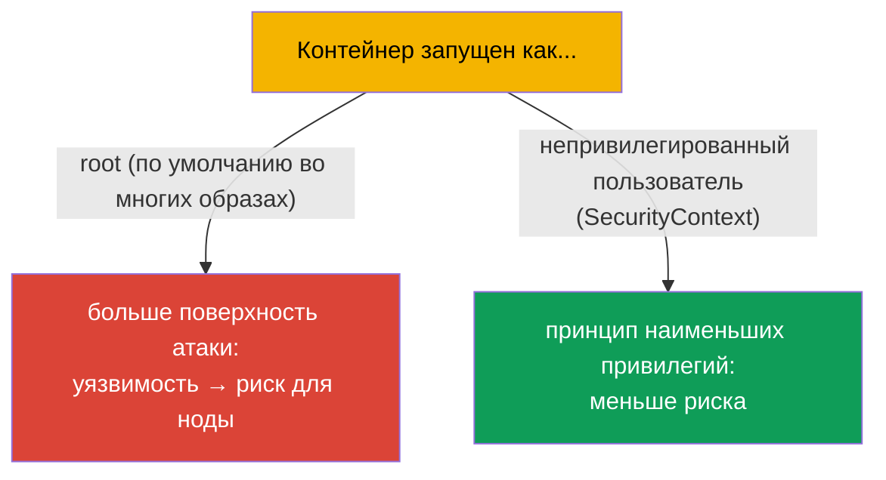
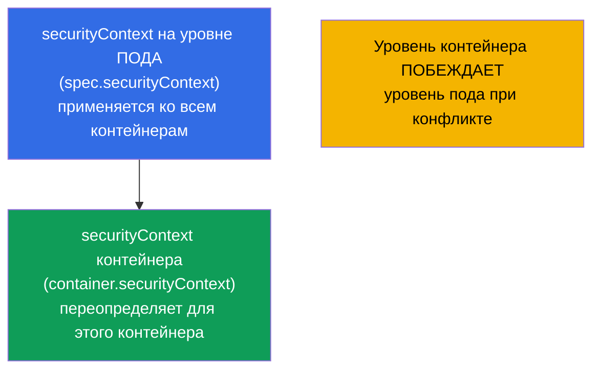
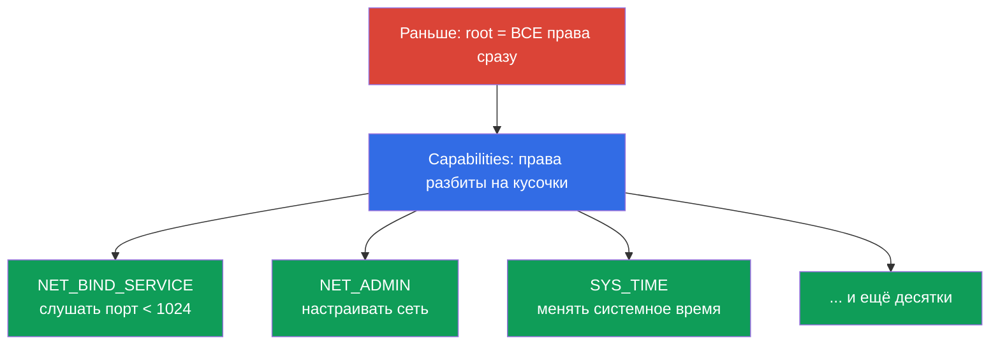
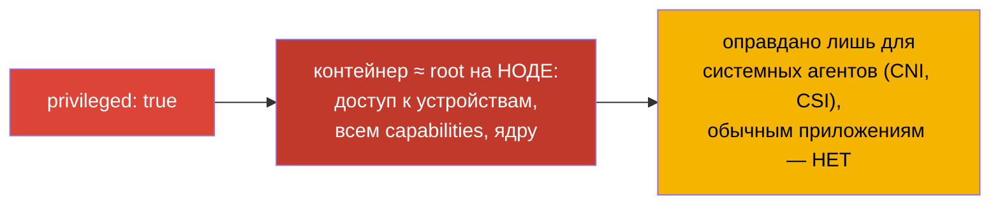
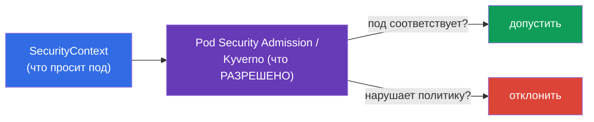

# Глава 20. SecurityContext и capabilities

> **Что дальше.** Мы умеем конфигурировать приложение. Теперь - под каким пользователем и
> с какими привилегиями работает контейнер. **SecurityContext** задаёт настройки
> безопасности на уровне пода и контейнера: от какого UID запускать процесс, можно ли
> писать в корневую ФС, повышать привилегии, какие Linux-capabilities давать. Это домен
> Environment/Config/**Security** (CKAD, 25%) и раздел безопасности CKA. Тема - фундамент
> «принципа наименьших привилегий» и частый источник заданий и реальных инцидентов.

## 20.1. Зачем нужен SecurityContext

По умолчанию многие контейнеры запускаются от **root** (UID 0). Внутри контейнера это
кажется безобидным, но root в контейнере при неверной настройке или уязвимости в рантайме
- это шаг к root на ноде. Принцип безопасности: **давать процессу минимум прав**.
SecurityContext - инструмент, чтобы этот минимум задать.



## 20.2. Два уровня: под и контейнер

SecurityContext задаётся на **двух уровнях**, и это важно различать.



- **Уровень пода** (`spec.securityContext`) - общие настройки для всех контейнеров пода;
  сюда же относятся настройки, применимые только к поду (например, `fsGroup`).
- **Уровень контейнера** (`spec.containers[].securityContext`) - настройки конкретного
  контейнера; при конфликте **переопределяет** уровень пода.

## 20.3. Ключевые поля SecurityContext

```yaml
spec:
  securityContext:              # уровень пода
    runAsUser: 1000             # UID процесса
    runAsGroup: 3000            # GID процесса
    fsGroup: 2000               # группа-владелец смонтированных томов
    runAsNonRoot: true          # запретить запуск от root
  containers:
  - name: app
    image: nginx
    securityContext:            # уровень контейнера
      allowPrivilegeEscalation: false
      readOnlyRootFilesystem: true
      privileged: false
      capabilities:
        drop: ["ALL"]
        add: ["NET_BIND_SERVICE"]
```

Разберём самые важные поля:

| Поле | Что делает | Уровень |
|------|-----------|---------|
| `runAsUser` / `runAsGroup` | от какого UID/GID запускать процесс | под и контейнер |
| `runAsNonRoot: true` | запретить запуск от root (под не стартует, если образ хочет root) | под и контейнер |
| `fsGroup` | группа-владелец томов (для доступа к смонтированным данным) | только под |
| `allowPrivilegeEscalation: false` | запретить процессу повышать привилегии (setuid и т.п.) | контейнер |
| `readOnlyRootFilesystem: true` | корневая ФС только для чтения | контейнер |
| `privileged: true` | привилегированный контейнер (почти как root на ноде) - опасно! | контейнер |
| `capabilities` | тонкая настройка Linux-возможностей (см. ниже) | контейнер |

## 20.4. Linux capabilities: привилегии тоньше, чем root/не-root

Традиционно в Linux есть «всемогущий root» и обычный пользователь. **Capabilities**
разбивают всесилие root на отдельные права (открыть привилегированный порт, менять сеть,
монтировать ФС и т.д.). Это позволяет дать процессу только нужную привилегию, а не root
целиком.



Практика безопасности: **сбросить все capabilities и добавить только нужные**:

```yaml
    securityContext:
      capabilities:
        drop: ["ALL"]                  # убрать все
        add: ["NET_BIND_SERVICE"]      # вернуть только нужную
```

Например, `NET_BIND_SERVICE` позволяет процессу слушать порт ниже 1024 (например, 80),
не будучи root. Так веб-сервер может слушать 80-й порт без прав суперпользователя.

## 20.5. privileged: почему это опасно

`privileged: true` даёт контейнеру практически все возможности хоста: доступ к устройствам
ноды, всем capabilities, обход большинства ограничений. По сути это **root на ноде**.



Привилегированные контейнеры нужны редко - только системным компонентам (некоторые CNI,
CSI, агенты, работающие с ядром). Обычному приложению `privileged` не нужен, и его наличие
- красный флаг для безопасности.

## 20.6. Проверка и типичные проблемы

```bash
# Под каким пользователем работает процесс
kubectl exec <pod> -- id
# uid=1000 gid=3000 ...

# Проверить настройки безопасности
kubectl get pod <pod> -o jsonpath='{.spec.securityContext}'
kubectl get pod <pod> -o jsonpath='{.spec.containers[0].securityContext}'
```

Частые проблемы и их причины:

| Симптом | Вероятная причина |
|---------|-------------------|
| Под не стартует, `runAsNonRoot` | образ пытается запуститься от root, а стоит `runAsNonRoot: true` |
| «Permission denied» при записи | `readOnlyRootFilesystem: true` (нужен writable том для temp-данных) |
| Нет доступа к смонтированному тому | не задан `fsGroup`, файлы принадлежат другому GID |
| Приложение не слушает порт 80 | не root и нет `NET_BIND_SERVICE` |

При `readOnlyRootFilesystem: true` приложению обычно нужна запись в отдельные каталоги
(`/tmp`, кеши) - их дают через `emptyDir`-том (глава 24), а корень остаётся read-only.

## 20.7. Связь с Pod Security и политиками (обзор)

SecurityContext задаёт настройки, но кто-то должен **требовать** их соблюдения. За это
отвечают политики уровня кластера:

- **Pod Security Admission (PSA)** - встроенный механизм, применяющий к namespace один из
  стандартов: `privileged` (без ограничений), `baseline` (минимальные ограничения),
  `restricted` (жёстко: non-root, drop capabilities, no privilege escalation).
- **Внешние политики** - OPA/Gatekeeper, Kyverno - произвольные правила (например,
  «запретить privileged во всём кластере»).



Глубоко в политики (это уже во многом территория CKS) не углубляемся, но знать связку
«SecurityContext просит - политика проверяет» полезно для обоих экзаменов.

## 20.8. Как это применяют в продакшене

- **Non-root по умолчанию.** Зрелые команды запускают контейнеры от непривилегированного
  пользователя (`runAsNonRoot: true`, `runAsUser`), собирая образы так, чтобы приложение
  работало без root. Это резко снижает последствия компрометации контейнера.
- **drop ALL + минимум capabilities.** Стандарт безопасности: сбросить все capabilities и
  добавить только реально нужные. `NET_BIND_SERVICE` для привилегированных портов - частый
  единственный «add».
- **readOnlyRootFilesystem + writable-тома.** Корневую ФС делают read-only, а для
  временных данных монтируют `emptyDir`. Это мешает атакующему записать/подменить файлы в
  контейнере.
- **Запрет privileged политикой.** В проде через Pod Security Admission (`restricted`) или
  Kyverno/Gatekeeper запрещают privileged, hostPath, hostNetwork и запуск от root на
  уровне всего кластера - чтобы небезопасный под просто не создался.
- **fsGroup для доступа к данным.** При работе с постоянными томами (БД, загрузки)
  правильно выставленный `fsGroup` решает проблемы «permission denied» на смонтированных
  данных - частую боль без SecurityContext.

## 20.9. Мини-глоссарий

- **SecurityContext** - настройки безопасности на уровне пода/контейнера.
- **runAsUser / runAsGroup** - UID/GID процесса контейнера.
- **runAsNonRoot** - запрет запуска от root.
- **fsGroup** - группа-владелец смонтированных томов (уровень пода).
- **allowPrivilegeEscalation** - разрешение/запрет повышения привилегий.
- **readOnlyRootFilesystem** - корневая ФС только для чтения.
- **privileged** - привилегированный контейнер (≈ root на ноде); опасно.
- **capabilities** - отдельные права из «всесилия root» (drop/add).
- **Pod Security Admission** - встроенная политика уровней privileged/baseline/restricted.

## 20.10. Итоги главы

- SecurityContext задаёт, под каким пользователем и с какими привилегиями работает
  контейнер; цель - принцип наименьших привилегий.
- Два уровня: под (общие настройки, `fsGroup`) и контейнер (переопределяет под при
  конфликте).
- Ключевые поля: `runAsUser/Group`, `runAsNonRoot`, `fsGroup`,
  `allowPrivilegeEscalation`, `readOnlyRootFilesystem`, `privileged`, `capabilities`.
- Capabilities дробят всесилие root на отдельные права; практика - `drop: [ALL]` +
  `add` только нужного (например, `NET_BIND_SERVICE`).
- `privileged: true` ≈ root на ноде - опасно, оправдано лишь для системных агентов.
- Соблюдение настроек требуют политики: Pod Security Admission (baseline/restricted),
  Kyverno/Gatekeeper.

## 20.11. Как это пригодится: на экзамене и в реальной работе

**На экзамене.** «Запусти контейнер от UID 1000», «запрети повышение привилегий»,
«добавь/сбрось capability», «сделай корневую ФС read-only» - типовые задания домена
Security. Нужно уверенно писать `securityContext` на нужном уровне и понимать разницу
между уровнем пода и контейнера. Отладка «под не стартует из-за runAsNonRoot» - тоже
частый сценарий.

**В реальной работе.** SecurityContext - основа безопасности рабочих нагрузок: non-root,
минимум capabilities, read-only корень резко снижают ущерб от уязвимостей и компрометации.
В проде это подкрепляют политиками уровня кластера, чтобы небезопасные поды не создавались
в принципе. Правильный `fsGroup` решает повседневные проблемы доступа к томам.

## 20.12. Вопросы для самопроверки

1. Почему запускать контейнер от root - плохая практика?
2. Чем различаются SecurityContext уровня пода и контейнера? Кто побеждает при конфликте?
3. Что делают `runAsNonRoot`, `readOnlyRootFilesystem` и `allowPrivilegeEscalation`?
4. Что такое Linux capabilities и почему рекомендуется `drop: [ALL]` + точечный `add`?
5. Почему `privileged: true` опасен и кому он реально нужен?
6. Зачем нужен `fsGroup` и какую проблему он решает?
7. Как связаны SecurityContext и Pod Security Admission?

## Практика

Мы закрыли безопасность на уровне контейнера. Последняя тема части 3 (глава 21) -
ServiceAccount и обзор аутентификации, авторизации и admission: как поды и пользователи
получают доступ к API. SecurityContext отрабатывается в лабах по безопасности.

🧪 Лаба 106 (SecurityContext и capabilities): [tasks/cka/labs/106](../../labs/106/README_RU.MD)

---
[Оглавление](../README_RU.md) · [Глава 19](../19/ru.md) · [Глава 21](../21/ru.md)
