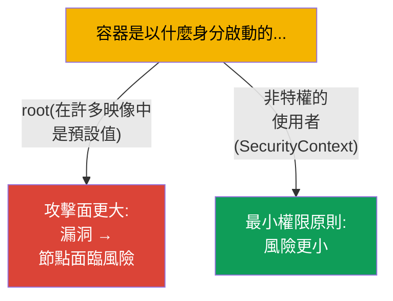
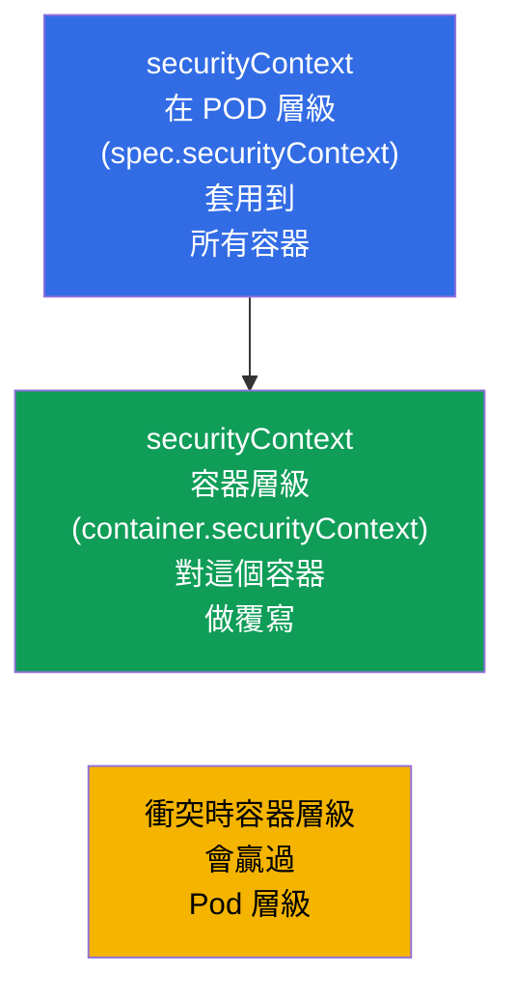
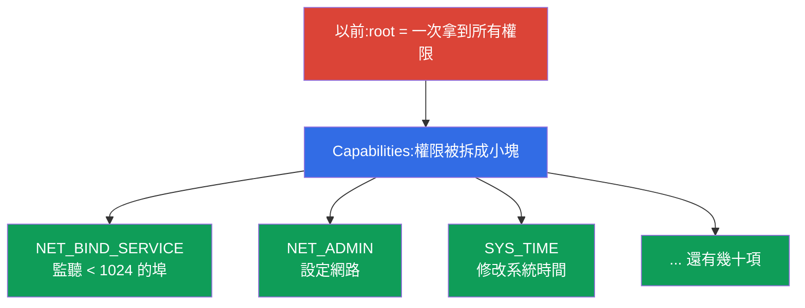
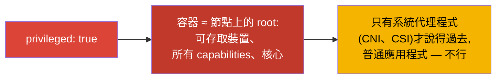
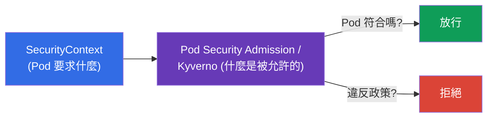

[Русская версия](ru.md) · [Eng version](README.md) · [Versión en español](es.md) · [Version française](fr.md) · [Deutsche Version](de.md) · [ქართული ვერსია](ge.md) · [日本語版](jp.md)

# 第 20 章。SecurityContext 與 capabilities

> **接下來是什麼。** 我們已經會設定應用程式了。現在來看:容器是以哪個使用者、
> 帶著什麼權限在跑。**SecurityContext** 指定 Pod 與容器層級的安全設定:用哪個
> UID 啟動行程、能不能寫入根檔案系統、能不能提升權限、給哪些 Linux
> capabilities。這是 Environment/Config/**Security** 領域(CKAD,25%)與 CKA 的
> 安全部分。這個主題是「最小權限原則」的地基,也是考題與真實事故的常見來源。

## 20.1. 為什麼需要 SecurityContext

預設情況下,很多容器是以 **root**(UID 0)身分啟動的。在容器裡面這看起來
無害,但如果設定錯誤或執行時期有漏洞,容器裡的 root 就是通往節點 root 的
一步。安全原則是:**給行程最少的權限**。SecurityContext 就是用來指定這個
最小集合的工具。



## 20.2. 兩個層級:Pod 與容器

SecurityContext 在 **兩個層級** 上指定,而區分它們很重要。



- **Pod 層級**(`spec.securityContext`)- 對 Pod 內所有容器的共同設定;只適用於
  Pod 的設定也放在這裡(例如 `fsGroup`)。
- **容器層級**(`spec.containers[].securityContext`)- 特定容器的設定;衝突時會
  **覆寫** Pod 層級。

## 20.3. SecurityContext 的關鍵欄位

```yaml
spec:
  securityContext:              # Pod 層級
    runAsUser: 1000             # 行程的 UID
    runAsGroup: 3000            # 行程的 GID
    fsGroup: 2000               # 掛載卷的擁有者群組
    runAsNonRoot: true          # 禁止以 root 啟動
  containers:
  - name: app
    image: nginx
    securityContext:            # 容器層級
      allowPrivilegeEscalation: false
      readOnlyRootFilesystem: true
      privileged: false
      capabilities:
        drop: ["ALL"]
        add: ["NET_BIND_SERVICE"]
```

來看最重要的幾個欄位:

| 欄位 | 作用 | 層級 |
|------|-----------|---------|
| `runAsUser` / `runAsGroup` | 用哪個 UID/GID 啟動行程 | Pod 與容器 |
| `runAsNonRoot: true` | 禁止以 root 啟動(若映像需要 root,Pod 就不會啟動) | Pod 與容器 |
| `fsGroup` | 卷的擁有者群組(用於存取掛載的資料) | 只有 Pod |
| `allowPrivilegeEscalation: false` | 禁止行程提升權限(setuid 之類) | 容器 |
| `readOnlyRootFilesystem: true` | 根檔案系統唯讀 | 容器 |
| `privileged: true` | 特權容器(幾乎等於節點上的 root)- 危險! | 容器 |
| `capabilities` | 對 Linux 能力做細緻調整(見下文) | 容器 |

## 20.4. Linux capabilities:比 root/非 root 更細緻的權限

傳統上 Linux 只有「無所不能的 root」和普通使用者。**Capabilities** 把 root 的
全能拆成一項項獨立權限(開啟特權埠、修改網路、掛載檔案系統等等)。這讓你能
只給行程它需要的那項權限,而不是整個 root。



安全實務是:**丟掉所有 capabilities,只加回需要的那些**:

```yaml
    securityContext:
      capabilities:
        drop: ["ALL"]                  # 全部移除
        add: ["NET_BIND_SERVICE"]      # 只加回需要的
```

例如,`NET_BIND_SERVICE` 讓行程可以在不是 root 的情況下監聽低於 1024 的埠
(例如 80)。這樣網頁伺服器就能不用超級使用者權限去監聽 80 埠。

## 20.5. privileged:為什麼它很危險

`privileged: true` 幾乎把主機的所有能力都交給容器:存取節點的裝置、拿到所有
capabilities、繞過大部分限制。本質上這就是 **節點上的 root**。



特權容器很少需要 - 只有系統元件會用到(某些 CNI、CSI、與核心互動的代理
程式)。普通應用程式不需要 `privileged`,它的出現就是安全上的紅旗。

## 20.6. 檢查與典型問題

```bash
# 行程是以哪個使用者在跑
kubectl exec <pod> -- id
# uid=1000 gid=3000 ...

# 檢查安全設定
kubectl get pod <pod> -o jsonpath='{.spec.securityContext}'
kubectl get pod <pod> -o jsonpath='{.spec.containers[0].securityContext}'
```

常見問題及其原因:

| 症狀 | 可能的原因 |
|---------|-------------------|
| Pod 不啟動,`runAsNonRoot` | 映像想以 root 啟動,但設了 `runAsNonRoot: true` |
| 寫入時出現「Permission denied」 | `readOnlyRootFilesystem: true`(暫存資料需要可寫的卷) |
| 無法存取掛載的卷 | 沒有指定 `fsGroup`,檔案屬於別的 GID |
| 應用程式沒有監聽 80 埠 | 不是 root 而且沒有 `NET_BIND_SERVICE` |

當 `readOnlyRootFilesystem: true` 時,應用程式通常還是需要寫入某些目錄
(`/tmp`、快取)- 這些用 `emptyDir` 卷提供(第 24 章),而根目錄保持唯讀。

## 20.7. 與 Pod Security 及政策的關係(概覽)

SecurityContext 指定了設定,但必須有人來 **要求** 遵守它們。這由叢集層級的
政策負責:

- **Pod Security Admission(PSA)**- 內建機制,對 namespace 套用其中一種標準:
  `privileged`(沒有限制)、`baseline`(最少限制)、`restricted`(嚴格:non-root、
  drop capabilities、no privilege escalation)。
- **外部政策** - OPA/Gatekeeper、Kyverno - 任意規則(例如「在整個叢集裡禁止
  privileged」)。



我們不深入政策(那在很大程度上已經是 CKS 的地盤),但了解「SecurityContext
提出要求 - 政策做檢查」這組關係,對兩場考試都有幫助。

## 20.8. 這在生產環境中如何應用

- **預設 non-root。** 成熟的團隊會用非特權使用者啟動容器(`runAsNonRoot: true`、
  `runAsUser`),並且把映像建置成應用程式不需要 root 也能運作。這能大幅降低
  容器被入侵後的後果。
- **drop ALL + 最少的 capabilities。** 安全標準做法:丟掉所有 capabilities,只
  加回真正需要的。用於特權埠的 `NET_BIND_SERVICE` 常常是唯一的那個「add」。
- **readOnlyRootFilesystem + 可寫的卷。** 把根檔案系統設成唯讀,而暫存資料用
  `emptyDir` 掛載。這會阻礙攻擊者在容器裡寫入或替換檔案。
- **用政策禁止 privileged。** 生產環境會透過 Pod Security Admission
  (`restricted`)或 Kyverno/Gatekeeper,在整個叢集層級禁止 privileged、hostPath、
  hostNetwork 以及以 root 啟動 - 讓不安全的 Pod 根本建立不起來。
- **用 fsGroup 存取資料。** 使用持久卷(資料庫、上傳檔案)時,正確設定的
  `fsGroup` 能解決掛載資料上的「permission denied」問題 - 這是沒有
  SecurityContext 時常見的痛點。

## 20.9. 迷你詞彙表

- **SecurityContext** - Pod/容器層級的安全設定。
- **runAsUser / runAsGroup** - 容器行程的 UID/GID。
- **runAsNonRoot** - 禁止以 root 啟動。
- **fsGroup** - 掛載卷的擁有者群組(Pod 層級)。
- **allowPrivilegeEscalation** - 允許/禁止提升權限。
- **readOnlyRootFilesystem** - 根檔案系統唯讀。
- **privileged** - 特權容器(≈ 節點上的 root);危險。
- **capabilities** - 從「root 全能」中拆出來的獨立權限(drop/add)。
- **Pod Security Admission** - 內建的政策,分為 privileged/baseline/restricted 三級。

## 20.10. 本章總結

- SecurityContext 指定容器以哪個使用者、帶著什麼權限運作;目標是最小權限
  原則。
- 兩個層級:Pod(共同設定、`fsGroup`)與容器(衝突時覆寫 Pod)。
- 關鍵欄位:`runAsUser/Group`、`runAsNonRoot`、`fsGroup`、
  `allowPrivilegeEscalation`、`readOnlyRootFilesystem`、`privileged`、`capabilities`。
- Capabilities 把 root 的全能拆成獨立權限;實務做法是 `drop: [ALL]` +
  只 `add` 需要的(例如 `NET_BIND_SERVICE`)。
- `privileged: true` ≈ 節點上的 root - 很危險,只有系統代理程式才說得過去。
- 要求遵守這些設定的是政策:Pod Security Admission(baseline/restricted)、
  Kyverno/Gatekeeper。

## 20.11. 這些知識用在哪裡:考試與實際工作

**在考試中。** 「用 UID 1000 啟動容器」、「禁止提升權限」、「加上/丟掉某個
capability」、「把根檔案系統設成唯讀」都是 Security 領域的典型題目。你需要能
在正確的層級上熟練地寫出 `securityContext`,並理解 Pod 層級與容器層級的差別。
排查「Pod 因為 runAsNonRoot 而不啟動」也是常見情境。

**在實際工作中。** SecurityContext 是工作負載安全的基礎:non-root、最少
capabilities、唯讀根目錄能大幅降低漏洞與入侵造成的損害。生產環境會用叢集層級
的政策來加固,讓不安全的 Pod 根本不會被建立。正確的 `fsGroup` 能解決日常的卷
存取問題。

## 20.12. 自我檢查問題

1. 為什麼以 root 啟動容器是不好的做法?
2. Pod 層級與容器層級的 SecurityContext 有什麼差別?衝突時誰會贏?
3. `runAsNonRoot`、`readOnlyRootFilesystem` 與 `allowPrivilegeEscalation` 各做什麼?
4. 什麼是 Linux capabilities,為什麼建議 `drop: [ALL]` + 精準地 `add`?
5. 為什麼 `privileged: true` 很危險,誰才真的需要它?
6. 為什麼需要 `fsGroup`,它解決什麼問題?
7. SecurityContext 與 Pod Security Admission 有什麼關聯?

## 實踐

我們把容器層級的安全講完了。第 3 部分的最後一個主題(第 21 章)是
ServiceAccount 以及認證、授權與 admission 的概覽:Pod 和使用者是怎麼取得
API 存取權的。SecurityContext 會在安全相關的實驗中操練。

🧪 實驗 106(SecurityContext 與 capabilities):[tasks/cka/labs/106](../../labs/106/README_TW.MD)

---
[目錄](../README_TW.md) · [第 19 章](../19/tw.md) · [第 21 章](../21/tw.md)
