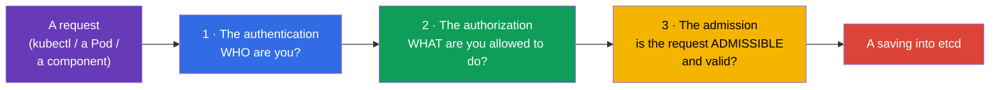
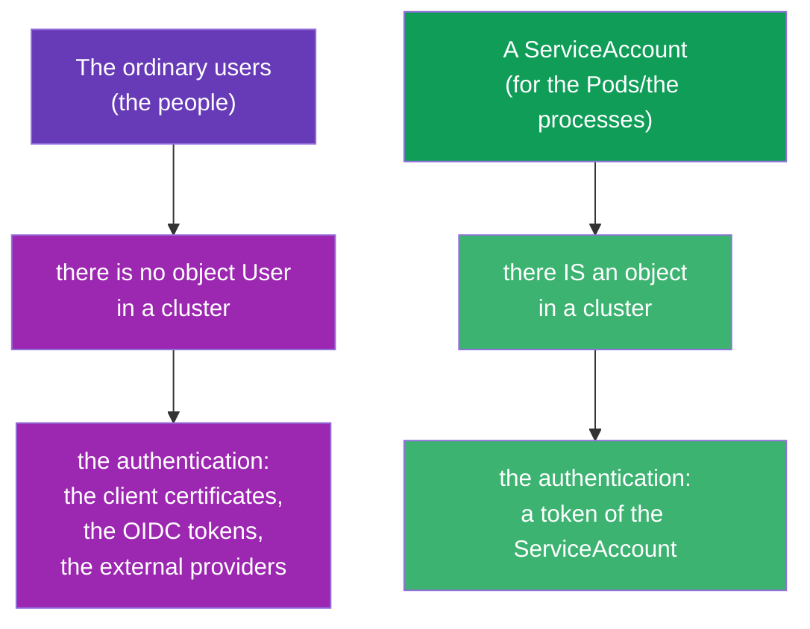
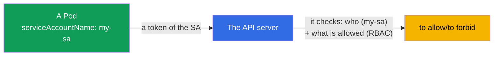
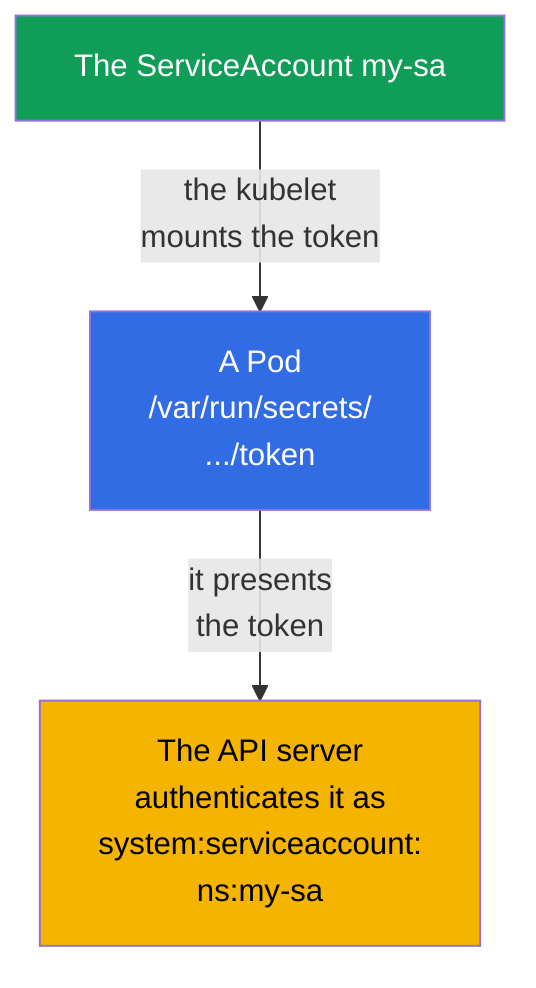
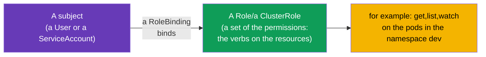
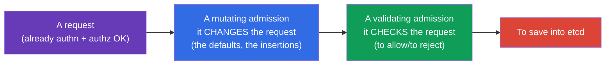
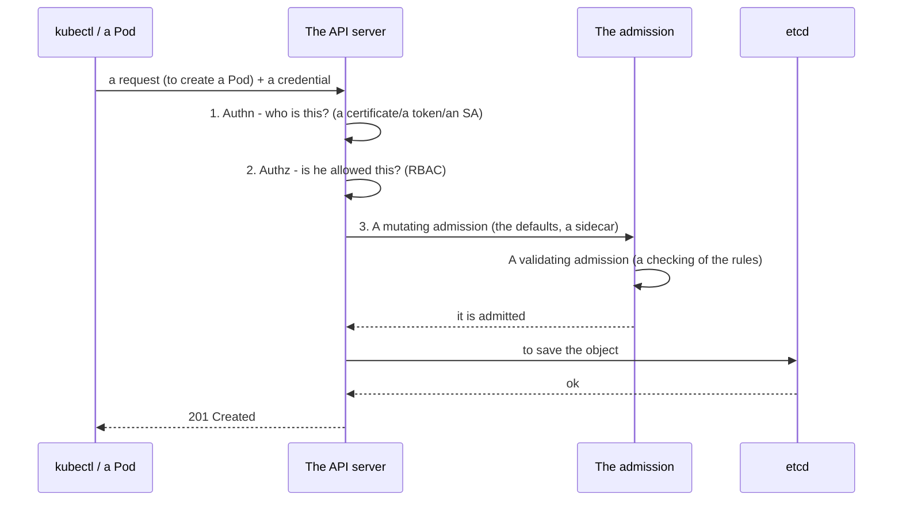

[Русская версия](ru.md) · [Versión en español](es.md) · [Version française](fr.md) · [Deutsche Version](de.md) · [ქართული ვერსია](ge.md) · [繁體中文版](tw.md) · [日本語版](jp.md)

# Chapter 21. The ServiceAccount; the authentication, the authorization, the admission

> **What comes next.** We are finishing the part 3. We have said many times that all the requests go through the
> API server (the chapter 2). Now let us take apart what the API server does with every request:
> it checks **who** you are (the authentication), **what you are allowed to do** (the authorization) and **whether the
> request itself is admissible** (the admission). Separately - the **ServiceAccount**: the identity under which the Pods
> themselves address the API. This is an overview chapter for the part 3 (RBAC will be gone into deeper in the chapter 38).
> The topic is the domain Security of both exams.

## 21.1. The three barriers at the entrance to the API server

Every request to the API server passes three stages in turn. If it has not passed any one of them - the request is
rejected.



| The stage | The question | Who answers |
|------|--------|----------|
| The authentication (authn) | Who are you? | the certificates, the tokens, a ServiceAccount |
| The authorization (authz) | What are you allowed to do? | RBAC (the chapter 38) |
| The admission control | Is the request admissible at all? To complete/to check it? | the admission controllers |

## 21.2. The authentication: who is addressing

Kubernetes distinguishes two kinds of "users":



- **The ordinary users (the people)** - Kubernetes has **no** object "User". The people are
  authenticated by the external means: by the client TLS certificates (the chapter 39),
  by the OIDC tokens, by an integration with the external providers. Kubernetes only trusts the name out of the
  certificate/of the token.
- **A ServiceAccount** - for the applications and the processes inside a cluster. This is a **real
  object** of Kubernetes, living in a namespace.

## 21.3. The ServiceAccount: an identity for the Pods

When a Pod wants to address the API server (for example, an operator reads the objects, or an
application creates the resources), it does this on behalf of a **ServiceAccount**. Every Pod always
works under some ServiceAccount - if it is not specified, the `default` out of its
namespace is used.



```bash
# To create a ServiceAccount
kubectl create serviceaccount my-sa

# To look
kubectl get sa
```

A binding to a Pod:

```yaml
spec:
  serviceAccountName: my-sa
  containers:
  - name: app
    image: myapp
```

## 21.4. How a token of a ServiceAccount gets into a Pod

Kubernetes automatically mounts a token of the ServiceAccount into a Pod, so that an application could
present it to the API server. In the modern versions (the projected tokens,
the BoundServiceAccountTokenVolume, GA since the 1.22) the token is short-lived, is bound to an audience
(audience) and is rotated automatically - unlike the old "eternal" tokens.

> **What has changed (it is important for the up-to-date clusters).** The automounting of a token into a Pod
> is enabled **by default** and has not gone anywhere. But since **Kubernetes 1.24** a **long-lived Secret**
> with a token has stopped being created automatically for every ServiceAccount:
> a Pod gets a short-lived projected token, and not an "eternal" one out of a Secret. If
> a long-lived token is needed all the same (for example, for an external system), it is created explicitly -
> `kubectl create token <sa>` (a short one, by the TokenRequest API) or by a separate Secret with
> the annotation `kubernetes.io/service-account.name`. As for the mounting itself, it can be disabled by the
> flag `automountServiceAccountToken: false` (see below).

```
/var/run/secrets/kubernetes.io/serviceaccount/
├── token       # the token for the authentication in the API
├── ca.crt      # the certificate of the CA of the cluster
└── namespace   # the namespace of the Pod
```



If a Pod **does not need** an access to the API (an ordinary application most often does not need it),
the automounting of the token is worth disabling - this is a good practice of the security:

```yaml
spec:
  automountServiceAccountToken: false
```

This way a Pod does not carry with it an extra token, which in the case of a compromise would give an access to the
API.

## 21.5. The authorization: what is allowed (RBAC)

The authentication has answered "who you are". Further the authorization decides "what you are allowed to do". The main
mechanism is **RBAC (Role-Based Access Control)**. The idea: the rights are described in a Role/a ClusterRole
(what it is possible to do), and are bound to a subject (to a user or to a ServiceAccount) through
a RoleBinding/a ClusterRoleBinding.



A quick checking of one's own rights - without a taking apart of the whole structure:

```bash
kubectl auth can-i create pods
kubectl auth can-i delete nodes
kubectl auth can-i get pods --as=system:serviceaccount:dev:my-sa -n dev
```

The `kubectl auth can-i` is an indispensable instrument both on the exam and in the life: it answers directly
"it is possible/it is not possible". RBAC in full (the Role, the ClusterRole, the bindings, the verbs, the resources) we shall take apart
in the chapter 38.

### A case: to give a user a full access to the namespace dev

A frequent task: to issue to a person (not to a Pod, but to a user) a **full access to all the objects
inside one namespace** `dev`, allowing nothing in the rest of them. It is solved in two steps:
to create an **identity of the user** and to **bind the rights to it** through RBAC. Let us remember: there is no
object `User` in Kubernetes - the identity is confirmed by a certificate (or by OIDC), while RBAC
only operates with his name.

**The step 1. An identity through a client certificate.** The user `dev-user` presents to the
API server a client TLS certificate, where the `CN` = the name of the user. We generate a key and a CSR,
we sign it through the built-in CertificateSigningRequest:

```bash
# a key and a request for a certificate (the CN will become the name of the user)
openssl genrsa -out dev-user.key 2048
openssl req -new -key dev-user.key -out dev-user.csr -subj "/CN=dev-user"

# we send the CSR into the cluster (the request is a base64 of the .csr)
cat <<EOF | kubectl apply -f -
apiVersion: certificates.k8s.io/v1
kind: CertificateSigningRequest
metadata:
  name: dev-user
spec:
  request: $(base64 -w0 dev-user.csr)
  signerName: kubernetes.io/kube-apiserver-client
  usages: ["client auth"]
EOF

kubectl certificate approve dev-user                         # the admin approves
kubectl get csr dev-user -o jsonpath='{.status.certificate}' | base64 -d > dev-user.crt
```

Further a kubeconfig context for the user is formed (the certificate + the CA of the cluster):

```bash
kubectl config set-credentials dev-user \
  --client-certificate=dev-user.crt --client-key=dev-user.key --embed-certs=true
kubectl config set-context dev-user --cluster=<the-name-of-the-cluster> --user=dev-user --namespace=dev
```

**The step 2. The rights: a Role + a RoleBinding in the namespace dev.** A "full access to all the objects"
inside a namespace is a Role with a `*` by the groups, the resources and the verbs. It is exactly a **Role**
(namespaced), and not a ClusterRole, that limits the rights by the frames of the `dev`:

```yaml
apiVersion: rbac.authorization.k8s.io/v1
kind: Role
metadata:
  namespace: dev
  name: dev-admin
rules:
- apiGroups: ["*"]        # all the API groups
  resources: ["*"]        # all the resources (pods, deployments, services, ...)
  verbs: ["*"]            # all the actions (get, list, create, update, delete, ...)
---
apiVersion: rbac.authorization.k8s.io/v1
kind: RoleBinding
metadata:
  namespace: dev
  name: dev-user-admin
subjects:
- kind: User
  name: dev-user          # that same CN out of the certificate
  apiGroup: rbac.authorization.k8s.io
roleRef:
  kind: Role
  name: dev-admin
  apiGroup: rbac.authorization.k8s.io
```

**The checking:**

```bash
kubectl auth can-i '*' '*' -n dev --as=dev-user      # yes - a full access in the dev
kubectl auth can-i get pods -n prod --as=dev-user    # no  - in the other namespaces there are no rights
```

The result: the user has got a full access strictly in the `dev`. The key moments are a **Role
(namespaced), and not a ClusterRole**, so that the rights do not "spread" over the whole cluster, and
a **RoleBinding exactly in the `dev`**. If an access in all the namespaces were needed, we would take
a ClusterRole + a ClusterRoleBinding; if one and the same set of the rights is needed in several concrete
namespaces - it is convenient to describe a ClusterRole once and to bind it by a RoleBinding in every
needed namespace.

**How to get a list of the users.** The command `kubectl get users` **does not exist** -
a User is not an object of Kubernetes, there is no separate registry of the people in a cluster. The "list" is got
indirectly, by taking apart who has been issued what - by the subjects of the RBAC bindings and by the issued
certificates:

```bash
# all the subjects-users out of the RoleBinding and the ClusterRoleBinding
kubectl get rolebindings,clusterrolebindings -A \
  -o jsonpath='{range .items[*]}{range .subjects[?(@.kind=="User")]}{.name}{"\n"}{end}{end}' | sort -u

# who has got the client certificates and when (the identities)
kubectl get csr

# the users written down in your kubeconfig (locally, not in the cluster)
kubectl config get-users
```

**How to delete a created user.** A "deletion" of a user is a **revocation of his rights**,
since there is no object User itself:

```bash
# 1. To take away the rights - to delete the binding (and the dedicated Role, if it is only for him)
kubectl delete rolebinding dev-user-admin -n dev
kubectl delete role dev-admin -n dev            # if the Role was created for him

# 2. To remove the account out of the kubeconfig (locally)
kubectl config delete-user dev-user
kubectl config delete-context dev-user

# 3. Cosmetically - to delete the object CSR
kubectl delete csr dev-user
```

> **An important thing about the certificates.** In the vanilla Kubernetes there is **no revocation (a CRL)** for the client
> certificates: until the term of the validity has expired, a certificate continues to pass the
> authentication. After a deletion of the bindings such a user will still "log in", but he will have no
> rights (except for what the group `system:authenticated` gives). Therefore for a real
> revocation of an access one relies on the **short-lived** certificates or on an external IdP (OIDC),
> where an account can be disabled centrally. If a certificate is compromised before the
> expiration - the CA is changed/reissued (a heavy operation).

> **And how is this in the managed clusters (on the example of the AWS EKS)?** There the certificates and the CSR usually
> are not used - the identities are taken out of the **IAM**, while Kubernetes only maps them to its own
> users/groups. The scheme:
>
> - **The authentication is through the IAM.** The kubeconfig from the `aws eks update-kubeconfig` contains
>   an exec plugin, which calls the `aws eks get-token` and presents to the API server a token,
>   confirming the IAM identity (a role or a user). A person has no password/certificate of his
>   own - the entry is by his AWS account.
> - **The mapping IAM → Kubernetes.** Earlier this was done through the ConfigMap `aws-auth` in the
>   `kube-system` (the sections `mapUsers`/`mapRoles`: an IAM ARN → a k8s name and the groups). Now
>   the native mechanism **EKS Access Entries** is recommended:
>
>   ```bash
>   # to link an IAM role with an identity in the cluster and to assign the groups for RBAC
>   aws eks create-access-entry --cluster-name demo \
>     --principal-arn arn:aws:iam::111122223333:role/dev-team \
>     --kubernetes-groups dev-admins
>   ```
> - **The rights are all the same RBAC.** Further to the group (the `dev-admins`) a Role/a RoleBinding is issued in the
>   needed namespace - exactly as in the case above. Or a managed EKS
>   access policy is hung on (the `aws eks associate-access-policy`, for example the `AmazonEKSAdminPolicy` with
>   a restriction on a namespace) - this is a "wrapper" over those same RBAC permissions.
>
> The result: in the EKS a "creation of a user" = a creation/a choice of an **IAM principal** + its
> mapping (an access entry or the `aws-auth`) with a k8s group, while the intra-cluster rights are still
> set by RBAC. GKE (the Google IAM) and AKS (the Entra ID) are arranged analogously. A revocation of an access there
> is done centrally - to remove an access entry / the IAM rights, without a fuss with a CRL.

More in detail about RBAC - in the chapter 38.

## 21.6. The admission control: the last barrier

After the authentication and the authorization a request passes through the **admission controllers** -
the plugins, which can change it or reject it. There are two kinds of them:



- **The mutating** ones change an object before a saving: they substitute the values by default,
  they inject a sidecar (this is how an injection of a proxy in a service mesh works), they set the labels.
- **The validating** ones check and reject, if an object violates the rules.

The examples of the built-in admission controllers, which you have already met implicitly:

| The controller | What it does |
|-----------|-----------|
| `LimitRanger` | it applies a LimitRange (the chapter 14) |
| `ResourceQuota` | it checks a ResourceQuota (the chapter 14) |
| `PodSecurity` | it applies the Pod Security Admission (the chapter 20) |
| `ServiceAccount` | it substitutes a ServiceAccount and mounts a token |
| `NamespaceLifecycle` | it does not let one create the objects in a namespace being deleted |

One's own rules are added through the **webhooks** (a ValidatingWebhookConfiguration, a
MutatingWebhookConfiguration) - this is how the Kyverno, the OPA/the Gatekeeper, the cert-manager,
an injection of a sidecar work. This explains, where from the sidecar containers or the
default values "appear by themselves" in a Pod.

The important details of the conveyor of the admission (they are asked about):

- **The order is strict:** first **all the mutating** ones, then a repeated checking of the schema, then
  **all the validating** ones. Therefore a validating one sees an object already after all the changes of the mutating ones.
- **The failurePolicy of a webhook** (the `Fail`/the `Ignore`) decides what to do, if your webhook server
  is unavailable. The `Fail` (by default) is safer (it will not let one through), but **a fallen webhook with a
  `Fail` can block a creation of the objects** in a cluster - a frequent reason of an incident
  "nothing is being created". The `Ignore` - the availability is more important than the strictness.
- **The PodSecurityPolicy (PSP) has been deleted** in the 1.25; in its place has come the built-in **Pod Security
  Admission** (the chapter 20) or the external engines (the Kyverno/the Gatekeeper through a webhook).
- The list of the enabled admission plugins is set by the flag of the apiserver
  `--enable-admission-plugins` (in the manifest `/etc/kubernetes/manifests/kube-apiserver.yaml`).

## 21.7. The full picture: the path of a request

Let us put it all together - this is a map, which it is useful to keep in the head.



Any of the barriers can reject a request: it is not the one who he says (authn) → a 401; there are no rights
(authz) → a 403; it violates a policy (admission) → a refusal with a reason. An understanding of this chain is
the key to a taking apart of "why has it been refused to me/to a Pod".

## 21.8. How this is applied in the production

- **A separate ServiceAccount per application.** In the prod the `default` SA is not used for the
  workloads - for every application its own ServiceAccount with the minimal rights is created
  (RBAC). This limits the damage upon a compromise of a Pod.
- **A disabling of the automounting of a token.** To the applications, which do not need an access to the API
  (the majority), one puts the `automountServiceAccountToken: false` - so as not to carry an extra
  key of an access.
- **The IRSA / the Workload Identity.** In a cloud a ServiceAccount is linked with the cloud roles
  (the AWS IRSA, the GCP Workload Identity), so that a Pod would get an access to the cloud services (the S3,
  the queues) without the static keys - by the identity of the SA.
- **The admission policies as a guard.** The Kyverno/the OPA Gatekeeper through the validating webhooks
  enforce the rules: a prohibition of the privileged, the obligatory labels/limits, the allowed registries
  of the images. This is a way not to let the insecure or the non-compliant objects into a cluster.
- **A mutating injection.** A service mesh (the Istio) and the secret injectors (the Vault Agent) work
  through a mutating webhook - they automatically add the sidecars/the secrets into the Pods, without changing their
  manifests.

## 21.9. A mini glossary

- **The authentication (authn)** - an establishing of who the sender of a request is.
- **The authorization (authz)** - a checking that the sender is allowed it (RBAC).
- **The admission control** - a checking/a changing of a request after the authn+the authz.
- **A mutating / a validating admission** - the changing / the checking controllers.
- **A ServiceAccount** - an identity of a Pod/of a process for an access to the API.
- **The default SA** - the ServiceAccount by default in every namespace.
- **The automountServiceAccountToken** - whether to mount a token of an SA into a Pod.
- **RBAC** - a management of an access on the basis of the roles (the chapter 38).
- **A webhook (admission)** - an external checking/changing of the objects (the Kyverno, the OPA, a mesh).

## 21.10. The summary of the chapter

- Every request to the API passes three barriers: the authentication (who), the authorization (what
  is allowed, RBAC), the admission (the admissibility and a changing).
- The people are authenticated externally (the certificates, OIDC) - there is no object User in Kubernetes;
  the Pods - through a ServiceAccount (a real object in a namespace).
- Every Pod works under a ServiceAccount (by default the `default`); a token is mounted into a
  Pod automatically, but in the absence of a need it is better to disable it.
- The authorization is done by RBAC; a quick checking of the rights is the `kubectl auth can-i`.
- The admission controllers happen to be mutating (they change an object: the defaults, a sidecar) and validating
  (they reject by the rules); the custom ones - through the webhooks (the Kyverno, the OPA, a mesh).
- An understanding of the chain the authn → the authz → the admission is the key to a taking apart of the refusals (a 401/a 403/a policy).

## 21.11. How this will come in handy: on the exam and in the real work

**On the exam.** "Create a ServiceAccount and assign it to a Pod", "check, whether an SA can do X"
(the `kubectl auth can-i --as`), an understanding of why a request has been rejected (authn/authz/admission) are
the frequent tasks of the domain Security. This is the foundation for the chapter 38 (RBAC), where the tasks are about a Role and
the bindings.

**In the real work.** A separate ServiceAccount with the minimal rights for every
application is a basic hygiene of the security. A disabling of the extra tokens, a linking of an SA with the
cloud roles (the IRSA), the admission policies (the Kyverno) and a mutating injection (a mesh) - all
this is the everyday instruments of a secure and manageable operation of a cluster.

## 21.12. Self-check questions

1. What three barriers does a request to the API server pass and what question does each of them answer?
2. In what does the authentication of the ordinary users differ from a ServiceAccount? Why is there no
   object User?
3. Under what ServiceAccount does a Pod work, if it is not specified explicitly? Where does its token lie?
4. What for and when is the `automountServiceAccountToken` disabled?
5. How to quickly check, whether an action is allowed to a subject?
6. In what does a mutating admission differ from a validating one? Give the examples of each.
7. How do a sidecar or the default values get into a Pod "by themselves" through the admission webhooks?

## Practice

At this the part 3 (the configuration and the security) is finished. Further - the part 4, specific
for the CKAD: the design and the building of the applications, starting from the multi-container patterns (the chapter 22).
The ServiceAccount and a checking of the rights are drilled in the labs on the security; the deep RBAC is waiting
in the chapter 38.

🧪 Lab 113 (the ServiceAccount, RBAC and a CSR): [tasks/cka/labs/113](../../labs/113/README.MD)

🧪 Lab 121 (the RBAC drills: an SA, a Role/a ClusterRole, the bindings): [tasks/cka/labs/121](../../labs/121/README.MD)

🎮 Killercoda (in a browser, no setup): [Create ServiceAccount](https://killercoda.com/chadmcrowell/course/ckad/create-serviceaccount) · [Create Service Account For a Pod](https://killercoda.com/chadmcrowell/course/cka/create-sa-for-pod) · [Role and RoleBinding](https://killercoda.com/chadmcrowell/course/ckad/role-rolebinding) · [Restrict Pod Deletes with RBAC](https://killercoda.com/chadmcrowell/course/ckad/restrict-rbac)

---
[Contents](../README.md) · [Chapter 20](../20/README.md) · [Chapter 22](../22/README.md)
