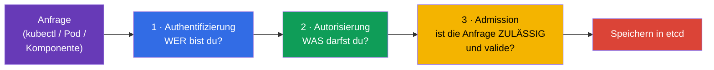
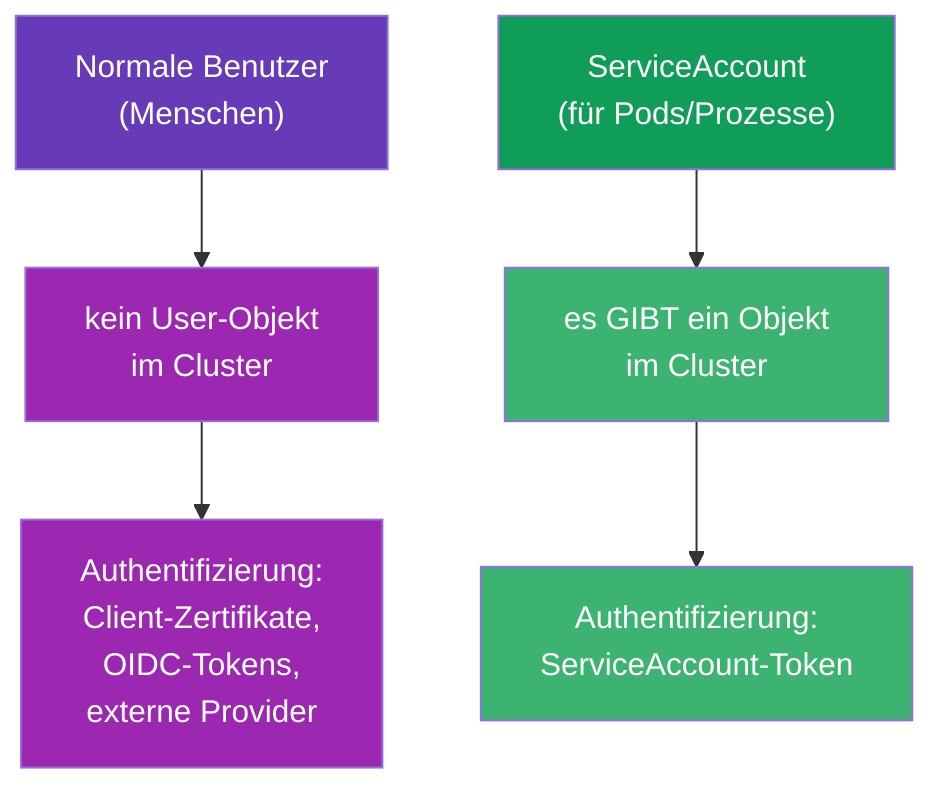
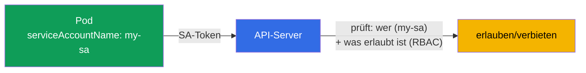
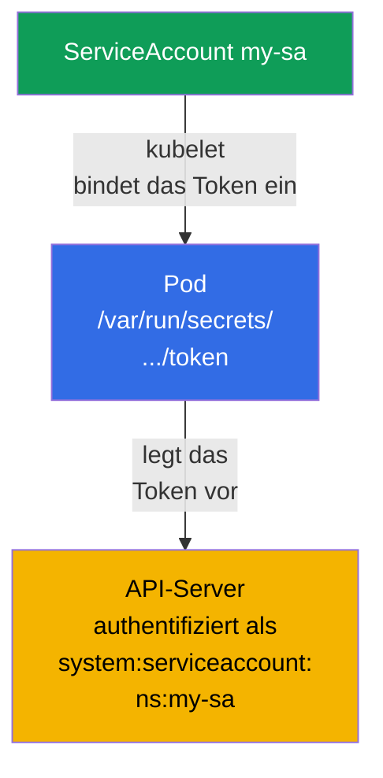
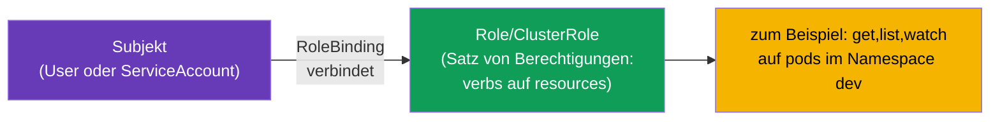
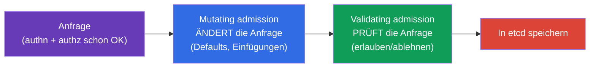
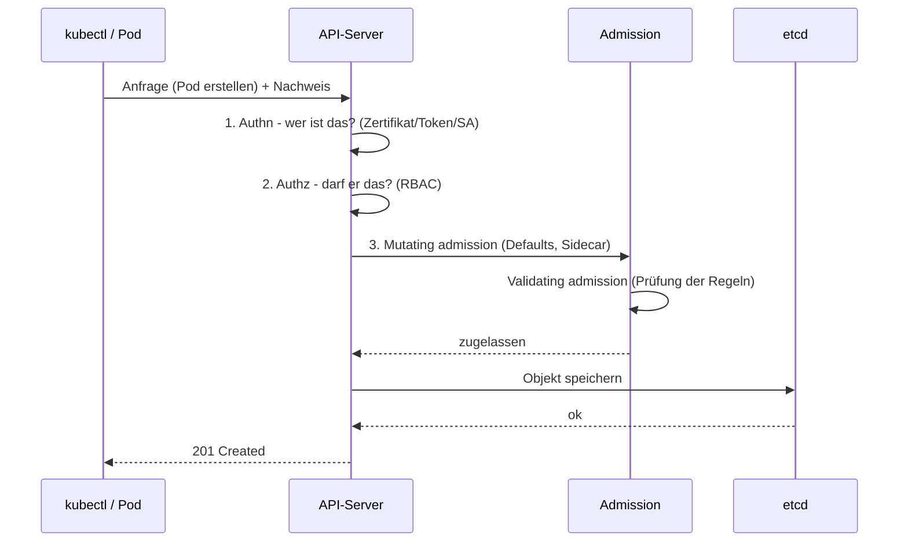

[Русская версия](ru.md) · [Eng version](README.md) · [Versión en español](es.md) · [Version française](fr.md) · [ქართული ვერსია](ge.md) · [繁體中文版](tw.md) · [日本語版](jp.md)

# Kapitel 21. ServiceAccount; Authentifizierung, Autorisierung, Admission

> **Was kommt.** Wir schließen Teil 3 ab. Wir haben viele Male gesagt, dass alle Anfragen
> über den API-Server laufen (Kapitel 2). Jetzt sehen wir uns an, was der API-Server mit
> jeder Anfrage macht: er prüft, **wer** Sie sind (Authentifizierung), **was Sie dürfen**
> (Autorisierung) und **ob die Anfrage selbst zulässig ist** (Admission). Separat dazu -
> **ServiceAccount**: die Identität, unter der die Pods selbst auf die API zugreifen. Das
> ist ein Überblickskapitel für Teil 3 (tiefer geht RBAC in Kapitel 38). Das Thema ist die
> Domäne Security beider Prüfungen.

## 21.1. Drei Barrieren am Eingang des API-Servers

Jede Anfrage an den API-Server durchläuft drei Etappen nacheinander. Wird eine davon nicht
bestanden, ist die Anfrage abgelehnt.



| Etappe | Frage | Wer antwortet |
|------|--------|----------|
| Authentifizierung (authn) | Wer bist du? | Zertifikate, Tokens, ServiceAccount |
| Autorisierung (authz) | Was ist dir erlaubt? | RBAC (Kapitel 38) |
| Admission control | Ist die Anfrage überhaupt zulässig? Ergänzen/prüfen? | Admission-Controller |

## 21.2. Authentifizierung: wer greift zu

Kubernetes unterscheidet zwei Arten von „Benutzern“:



- **Normale Benutzer (Menschen)** - Kubernetes hat **kein** Objekt „User“. Menschen
  authentifizieren sich mit externen Mitteln: Client-TLS-Zertifikaten (Kapitel 39),
  OIDC-Tokens, Integration mit externen Providern. Kubernetes vertraut lediglich dem Namen
  aus dem Zertifikat/Token.
- **ServiceAccount** - für Anwendungen und Prozesse innerhalb des Clusters. Das ist ein
  **echtes Objekt** von Kubernetes, das in einem Namespace lebt.

## 21.3. ServiceAccount: Identität für Pods

Wenn ein Pod auf den API-Server zugreifen will (zum Beispiel liest ein Operator Objekte
oder eine Anwendung erstellt Ressourcen), tut er das im Namen eines **ServiceAccount**.
Jeder Pod läuft immer unter irgendeinem ServiceAccount - wird keiner angegeben, wird
`default` aus seinem Namespace verwendet.



```bash
# ServiceAccount erstellen
kubectl create serviceaccount my-sa

# Ansehen
kubectl get sa
```

Bindung an den Pod:

```yaml
spec:
  serviceAccountName: my-sa
  containers:
  - name: app
    image: myapp
```

## 21.4. Wie das ServiceAccount-Token in den Pod kommt

Kubernetes bindet das ServiceAccount-Token automatisch in den Pod ein, damit die Anwendung
es dem API-Server vorlegen kann. In modernen Versionen (projizierte Tokens,
BoundServiceAccountTokenVolume, GA ab 1.22) ist das Token kurzlebig, an eine Audience
gebunden und wird automatisch rotiert - anders als die alten „ewigen“ Tokens.

> **Was sich geändert hat (wichtig für aktuelle Cluster).** Das automatische Einbinden des
> Tokens in den Pod ist **standardmäßig** aktiviert und ist nicht verschwunden. Aber seit
> **Kubernetes 1.24** wird für jeden ServiceAccount kein **langlebiges Secret** mit Token
> mehr automatisch erstellt: der Pod bekommt ein kurzlebiges projiziertes Token und nicht
> das „ewige“ aus einem Secret. Wenn ein langlebiges Token doch nötig ist (zum Beispiel für
> ein externes System), erstellt man es explizit - `kubectl create token <sa>` (kurzlebig,
> über die TokenRequest API) oder als separates Secret mit der Annotation
> `kubernetes.io/service-account.name`. Das Einbinden selbst kann man mit dem Flag
> `automountServiceAccountToken: false` abschalten (siehe unten).

```
/var/run/secrets/kubernetes.io/serviceaccount/
├── token       # Token für die Authentifizierung an der API
├── ca.crt      # CA-Zertifikat des Clusters
└── namespace   # Namespace des Pods
```



Wenn ein Pod **keinen** Zugriff auf die API braucht (eine normale Anwendung braucht ihn
meistens nicht), sollte man das automatische Einbinden des Tokens abschalten - das ist eine
gute Sicherheitspraxis:

```yaml
spec:
  automountServiceAccountToken: false
```

So trägt der Pod kein überflüssiges Token mit sich, das im Fall einer Kompromittierung
Zugriff auf die API gäbe.

## 21.5. Autorisierung: was erlaubt ist (RBAC)

Die Authentifizierung hat „wer bist du“ beantwortet. Danach entscheidet die Autorisierung
„was darfst du“. Der Hauptmechanismus ist **RBAC (Role-Based Access Control)**. Die Idee:
Rechte werden in Role/ClusterRole beschrieben (was man tun darf) und über
RoleBinding/ClusterRoleBinding an ein Subjekt (Benutzer oder ServiceAccount) gebunden.



Schnelle Prüfung der eigenen Rechte - ohne die ganze Struktur zu analysieren:

```bash
kubectl auth can-i create pods
kubectl auth can-i delete nodes
kubectl auth can-i get pods --as=system:serviceaccount:dev:my-sa -n dev
```

`kubectl auth can-i` ist ein unverzichtbares Werkzeug, in der Prüfung wie im Alltag: es
antwortet direkt „erlaubt/nicht erlaubt“. RBAC vollständig (Role, ClusterRole, Bindings,
verbs, resources) sehen wir uns in Kapitel 38 an.

### Fallbeispiel: einem Benutzer vollen Zugriff auf den Namespace dev geben

Eine häufige Aufgabe: einem Menschen (nicht einem Pod, sondern einem Benutzer) **vollen
Zugriff auf alle Objekte innerhalb eines Namespace** `dev` geben und in den übrigen nichts
erlauben. Das löst man in zwei Schritten: eine **Benutzeridentität** erstellen und ihr über
RBAC **Rechte binden**. Wir erinnern uns: ein Objekt `User` gibt es in Kubernetes nicht -
die Identität wird durch ein Zertifikat (oder OIDC) bestätigt, und RBAC arbeitet nur mit
seinem Namen.

**Schritt 1. Identität über ein Client-Zertifikat.** Der Benutzer `dev-user` legt dem
API-Server ein Client-TLS-Zertifikat vor, in dem `CN` = Benutzername ist. Wir erzeugen
Schlüssel und CSR und lassen sie über den eingebauten CertificateSigningRequest
unterschreiben:

```bash
# Schlüssel und Zertifikatsanfrage (CN wird zum Benutzernamen)
openssl genrsa -out dev-user.key 2048
openssl req -new -key dev-user.key -out dev-user.csr -subj "/CN=dev-user"

# CSR an den Cluster senden (request - base64 der .csr)
cat <<EOF | kubectl apply -f -
apiVersion: certificates.k8s.io/v1
kind: CertificateSigningRequest
metadata:
  name: dev-user
spec:
  request: $(base64 -w0 dev-user.csr)
  signerName: kubernetes.io/kube-apiserver-client
  usages: ["client auth"]
EOF

kubectl certificate approve dev-user                         # der Admin genehmigt
kubectl get csr dev-user -o jsonpath='{.status.certificate}' | base64 -d > dev-user.crt
```

Danach bildet man einen kubeconfig-Kontext für den Benutzer (Zertifikat + CA des Clusters):

```bash
kubectl config set-credentials dev-user \
  --client-certificate=dev-user.crt --client-key=dev-user.key --embed-certs=true
kubectl config set-context dev-user --cluster=<cluster-name> --user=dev-user --namespace=dev
```

**Schritt 2. Rechte: Role + RoleBinding im Namespace dev.** „Voller Zugriff auf alle
Objekte“ innerhalb eines Namespace - das ist eine Role mit `*` für Gruppen, Ressourcen und
Verben. Genau eine **Role** (namespaced), nicht eine ClusterRole, begrenzt die Rechte auf
`dev`:

```yaml
apiVersion: rbac.authorization.k8s.io/v1
kind: Role
metadata:
  namespace: dev
  name: dev-admin
rules:
- apiGroups: ["*"]        # alle API-Gruppen
  resources: ["*"]        # alle Ressourcen (pods, deployments, services, ...)
  verbs: ["*"]            # alle Aktionen (get, list, create, update, delete, ...)
---
apiVersion: rbac.authorization.k8s.io/v1
kind: RoleBinding
metadata:
  namespace: dev
  name: dev-user-admin
subjects:
- kind: User
  name: dev-user          # genau das CN aus dem Zertifikat
  apiGroup: rbac.authorization.k8s.io
roleRef:
  kind: Role
  name: dev-admin
  apiGroup: rbac.authorization.k8s.io
```

**Prüfung:**

```bash
kubectl auth can-i '*' '*' -n dev --as=dev-user      # yes - voller Zugriff in dev
kubectl auth can-i get pods -n prod --as=dev-user    # no  - in anderen Namespaces keine Rechte
```

Ergebnis: der Benutzer hat vollen Zugriff strikt in `dev` bekommen. Die Schlüsselpunkte sind
**Role (namespaced) und nicht ClusterRole**, damit die Rechte nicht auf den ganzen Cluster
„auslaufen“, und **RoleBinding genau in `dev`**. Wäre Zugriff in allen Namespaces nötig,
würde man ClusterRole + ClusterRoleBinding nehmen; braucht man denselben Satz von Rechten in
mehreren konkreten Namespaces - dann beschreibt man bequem einmal eine ClusterRole und
bindet sie per RoleBinding in jedem benötigten Namespace.

**Wie man eine Liste der Benutzer bekommt.** Den Befehl `kubectl get users` gibt es
**nicht** - User ist kein Kubernetes-Objekt, ein separates Register von Menschen existiert
im Cluster nicht. Eine „Liste“ bekommt man indirekt, indem man analysiert, wem was
zugewiesen wurde - über die Subjekte der RBAC-Bindings und über die ausgestellten
Zertifikate:

```bash
# alle Benutzer-Subjekte aus RoleBinding und ClusterRoleBinding
kubectl get rolebindings,clusterrolebindings -A \
  -o jsonpath='{range .items[*]}{range .subjects[?(@.kind=="User")]}{.name}{"\n"}{end}{end}' | sort -u

# wer wann Client-Zertifikate (Identitäten) erhalten hat
kubectl get csr

# Benutzer, die in Ihrer kubeconfig eingetragen sind (lokal, nicht im Cluster)
kubectl config get-users
```

**Wie man einen erstellten Benutzer löscht.** Das „Löschen“ eines Benutzers ist der
**Entzug seiner Rechte**, denn das Objekt User selbst gibt es nicht:

```bash
# 1. Rechte entziehen - das Binding löschen (und die dedizierte Role, wenn sie nur für ihn ist)
kubectl delete rolebinding dev-user-admin -n dev
kubectl delete role dev-admin -n dev            # wenn die Role für ihn erstellt wurde

# 2. Den Account aus der kubeconfig entfernen (lokal)
kubectl config delete-user dev-user
kubectl config delete-context dev-user

# 3. Kosmetisch - das CSR-Objekt löschen
kubectl delete csr dev-user
```

> **Wichtig zu Zertifikaten.** Im vanilla Kubernetes gibt es **keinen Widerruf (CRL)** für
> Client-Zertifikate: solange die Gültigkeit nicht abgelaufen ist, besteht das Zertifikat
> die Authentifizierung weiter. Nach dem Löschen der Bindings „kommt“ so ein Benutzer immer
> noch herein, hat aber keine Rechte (außer dem, was die Gruppe `system:authenticated`
> gibt). Für einen echten Zugriffsentzug setzt man deshalb auf **kurzlebige** Zertifikate
> oder auf einen externen IdP (OIDC), wo man den Account zentral abschalten kann. Ist ein
> Zertifikat vor dem Ablauf kompromittiert - tauscht/erneuert man die CA (eine schwere
> Operation).

> **Und wie ist das in managed Clustern (am Beispiel AWS EKS)?** Dort verwendet man
> Zertifikate und CSR üblicherweise nicht - die Identitäten kommen aus **IAM**, und
> Kubernetes ordnet sie lediglich seinen Benutzern/Gruppen zu. Das Schema:
>
> - **Authentifizierung - über IAM.** Die kubeconfig von `aws eks update-kubeconfig`
>   enthält ein exec-Plugin, das `aws eks get-token` aufruft und dem API-Server ein Token
>   vorlegt, das die IAM-Identität (Rolle oder Benutzer) bestätigt. Ein eigenes
>   Passwort/Zertifikat hat der Mensch nicht - der Login läuft über seinen AWS-Account.
> - **Zuordnung IAM → Kubernetes.** Früher machte man das über die ConfigMap `aws-auth` in
>   `kube-system` (Abschnitte `mapUsers`/`mapRoles`: IAM ARN → k8s-Name und Gruppen).
>   Heute wird der native Mechanismus **EKS Access Entries** empfohlen:
>
>   ```bash
>   # IAM-Rolle mit einer Identität im Cluster verbinden und Gruppen für RBAC zuweisen
>   aws eks create-access-entry --cluster-name demo \
>     --principal-arn arn:aws:iam::111122223333:role/dev-team \
>     --kubernetes-groups dev-admins
>   ```
> - **Rechte - immer noch dasselbe RBAC.** Danach gibt man der Gruppe (`dev-admins`)
>   Role/RoleBinding im nötigen Namespace - genau wie im Fallbeispiel oben. Oder man hängt
>   eine von EKS verwaltete Access Policy an (`aws eks associate-access-policy`, zum
>   Beispiel `AmazonEKSAdminPolicy` mit Beschränkung auf einen Namespace) - das ist eine
>   „Hülle“ über denselben RBAC-Berechtigungen.
>
> Ergebnis: in EKS ist „einen Benutzer erstellen“ = einen **IAM-Principal** erstellen/wählen
> + seine Zuordnung (Access Entry oder `aws-auth`) zu einer k8s-Gruppe, und die Rechte
> innerhalb des Clusters legt weiterhin RBAC fest. Analog funktionieren GKE (Google IAM) und
> AKS (Entra ID). Der Zugriffsentzug erfolgt dort zentral - die Access Entry / die
> IAM-Rechte entfernen, ohne Gefummel mit CRL.

Mehr zu RBAC - in Kapitel 38.

## 21.6. Admission control: die letzte Barriere

Nach Authentifizierung und Autorisierung läuft die Anfrage durch die
**Admission-Controller** - Plugins, die sie ändern oder ablehnen können. Es gibt zwei
Arten:



- **Mutating** - ändern das Objekt vor dem Speichern: setzen Standardwerte ein, injizieren
  Sidecars (so funktioniert die Proxy-Injektion im Service Mesh), setzen Labels.
- **Validating** - prüfen und lehnen ab, wenn das Objekt Regeln verletzt.

Beispiele eingebauter Admission-Controller, denen Sie schon implizit begegnet sind:

| Controller | Was er tut |
|-----------|-----------|
| `LimitRanger` | wendet LimitRange an (Kapitel 14) |
| `ResourceQuota` | prüft ResourceQuota (Kapitel 14) |
| `PodSecurity` | wendet Pod Security Admission an (Kapitel 20) |
| `ServiceAccount` | setzt den ServiceAccount ein und bindet das Token ein |
| `NamespaceLifecycle` | verhindert das Erstellen von Objekten in einem Namespace, der gelöscht wird |

Eigene Regeln fügt man über **Webhooks** hinzu (ValidatingWebhookConfiguration,
MutatingWebhookConfiguration) - so funktionieren Kyverno, OPA/Gatekeeper, cert-manager,
die Sidecar-Injektion. Das erklärt, woher im Pod „von selbst“ Sidecar-Container oder
Standardwerte auftauchen.

Wichtige Details der Admission-Pipeline (danach wird gefragt):

- **Die Reihenfolge ist strikt:** zuerst **alle mutating**, dann eine erneute Prüfung des
  Schemas, dann **alle validating**. Deshalb sieht validating das Objekt bereits nach allen
  Änderungen von mutating.
- **Die failurePolicy des Webhooks** (`Fail`/`Ignore`) entscheidet, was zu tun ist, wenn
  Ihr Webhook-Server nicht erreichbar ist. `Fail` (Standard) ist sicherer (lässt nichts
  durch), aber **ein ausgefallener Webhook mit `Fail` kann das Erstellen von Objekten** im
  Cluster blockieren - eine häufige Ursache des Vorfalls „es wird nichts erstellt“.
  `Ignore` - Verfügbarkeit ist wichtiger als Strenge.
- **PodSecurityPolicy (PSP) wurde entfernt** in 1.25; an ihre Stelle trat die eingebaute
  **Pod Security Admission** (Kapitel 20) oder externe Engines (Kyverno/Gatekeeper über
  Webhook).
- Die Liste der aktivierten Admission-Plugins wird über das Flag des apiserver
  `--enable-admission-plugins` festgelegt (im Manifest
  `/etc/kubernetes/manifests/kube-apiserver.yaml`).

## 21.7. Das Gesamtbild: der Weg einer Anfrage

Fügen wir alles zusammen - das ist eine Karte, die man nützlicherweise im Kopf behält.



Jede der Barrieren kann die Anfrage ablehnen: nicht der, der er zu sein behauptet (authn) →
401; keine Rechte (authz) → 403; verletzt eine Policy (admission) → Ablehnung mit Grund.
Das Verständnis dieser Kette ist der Schlüssel zur Analyse von „warum wird mir/dem Pod der
Zugriff verweigert“.

## 21.8. Wie man das in der Produktion anwendet

- **Ein eigener ServiceAccount pro Anwendung.** In der Produktion verwendet man nicht den
  `default` SA für Workloads - für jede Anwendung erstellt man einen eigenen ServiceAccount
  mit minimalen Rechten (RBAC). Das begrenzt den Schaden bei der Kompromittierung eines
  Pods.
- **Abschalten des automatischen Einbindens des Tokens.** Anwendungen, die keinen Zugriff
  auf die API brauchen (die meisten), bekommen `automountServiceAccountToken: false` -
  damit sie keinen überflüssigen Zugriffsschlüssel mit sich tragen.
- **IRSA / Workload Identity.** In der Cloud verbindet man ServiceAccounts mit Cloud-Rollen
  (AWS IRSA, GCP Workload Identity), damit der Pod Zugriff auf Cloud-Dienste (S3,
  Queues) ohne statische Schlüssel bekommt - über die Identität des SA.
- **Admission-Policies als Wächter.** Kyverno/OPA Gatekeeper erzwingen über
  Validating-Webhooks Regeln: Verbot von privileged, verpflichtende Labels/Limits,
  erlaubte Image-Registries. Das ist der Weg, unsichere oder nicht konforme Objekte nicht in
  den Cluster zu lassen.
- **Mutating-Injektion.** Service Mesh (Istio) und Secret-Injektoren (Vault Agent)
  arbeiten über einen Mutating-Webhook - sie fügen Pods automatisch Sidecars/Secrets hinzu,
  ohne deren Manifeste zu ändern.

## 21.9. Mini-Glossar

- **Authentifizierung (authn)** - feststellen, wer der Absender der Anfrage ist.
- **Autorisierung (authz)** - prüfen, dass dem Absender etwas erlaubt ist (RBAC).
- **Admission control** - Prüfung/Änderung der Anfrage nach authn+authz.
- **Mutating / Validating admission** - ändernde / prüfende Controller.
- **ServiceAccount** - Identität eines Pods/Prozesses für den Zugriff auf die API.
- **default SA** - der Standard-ServiceAccount in jedem Namespace.
- **automountServiceAccountToken** - ob das SA-Token in den Pod eingebunden wird.
- **RBAC** - rollenbasierte Zugriffssteuerung (Kapitel 38).
- **webhook (admission)** - externe Prüfung/Änderung von Objekten (Kyverno, OPA, Mesh).

## 21.10. Zusammenfassung des Kapitels

- Jede Anfrage an die API durchläuft drei Barrieren: Authentifizierung (wer), Autorisierung
  (was erlaubt ist, RBAC), Admission (Zulässigkeit und Änderung).
- Menschen authentifizieren sich extern (Zertifikate, OIDC) - ein User-Objekt gibt es in
  Kubernetes nicht; Pods - über ServiceAccount (ein echtes Objekt im Namespace).
- Jeder Pod läuft unter einem ServiceAccount (standardmäßig `default`); das Token wird
  automatisch in den Pod eingebunden, aber wenn kein Bedarf besteht, schaltet man es besser
  ab.
- Die Autorisierung macht RBAC; die schnelle Prüfung der Rechte ist `kubectl auth can-i`.
- Admission-Controller gibt es als mutating (ändern das Objekt: Defaults, Sidecar) und
  validating (lehnen nach Regeln ab); eigene - über Webhooks (Kyverno, OPA, Mesh).
- Das Verständnis der Kette authn → authz → admission ist der Schlüssel zur Analyse von
  Ablehnungen (401/403/Policy).

## 21.11. Wofür das nützlich ist: in der Prüfung und in der echten Arbeit

**In der Prüfung.** „Erstelle einen ServiceAccount und weise ihn einem Pod zu“, „prüfe, ob
der SA X darf“ (`kubectl auth can-i --as`), das Verständnis, warum eine Anfrage abgelehnt
wurde (authn/authz/admission) - das sind häufige Aufgaben der Domäne Security. Das ist das
Fundament für Kapitel 38 (RBAC), wo die Aufgaben um Role und Bindings gehen.

**In der echten Arbeit.** Ein eigener ServiceAccount mit minimalen Rechten für jede
Anwendung ist grundlegende Sicherheitshygiene. Das Abschalten überflüssiger Tokens, die
Verbindung des SA mit Cloud-Rollen (IRSA), Admission-Policies (Kyverno) und die
Mutating-Injektion (Mesh) - all das sind alltägliche Werkzeuge für einen sicheren und
kontrollierten Betrieb des Clusters.

## 21.12. Fragen zur Selbstüberprüfung

1. Welche drei Barrieren durchläuft eine Anfrage an den API-Server und welche Frage
   beantwortet jede?
2. Wodurch unterscheidet sich die Authentifizierung normaler Benutzer von ServiceAccount?
   Warum gibt es kein User-Objekt?
3. Unter welchem ServiceAccount läuft ein Pod, wenn keiner explizit angegeben ist? Wo liegt
   sein Token?
4. Wozu und wann schaltet man `automountServiceAccountToken` ab?
5. Wie prüft man schnell, ob einem Subjekt eine Aktion erlaubt ist?
6. Wodurch unterscheidet sich mutating admission von validating? Nennen Sie Beispiele für
   jedes.
7. Wie kommen über Admission-Webhooks „von selbst“ Sidecars oder Standardwerte in einen
   Pod?

## Praxis

Damit ist Teil 3 (Konfiguration und Sicherheit) abgeschlossen. Weiter geht es mit Teil 4,
spezifisch für CKAD: Design und Bau von Anwendungen, beginnend mit
Multi-Container-Patterns (Kapitel 22). ServiceAccount und die Prüfung von Rechten werden in
den Labs zur Sicherheit geübt; tiefes RBAC wartet in Kapitel 38.

🧪 Lab 113 (ServiceAccount, RBAC und CSR): [tasks/cka/labs/113](../../labs/113/README_DE.MD)

🧪 Lab 121 (RBAC-Drills: SA, Role/ClusterRole, Bindings): [tasks/cka/labs/121](../../labs/121/README_DE.MD)

🎮 Killercoda (im Browser, ohne Installation): [Create ServiceAccount](https://killercoda.com/chadmcrowell/course/ckad/create-serviceaccount) · [Create Service Account For a Pod](https://killercoda.com/chadmcrowell/course/cka/create-sa-for-pod) · [Role and RoleBinding](https://killercoda.com/chadmcrowell/course/ckad/role-rolebinding) · [Restrict Pod Deletes with RBAC](https://killercoda.com/chadmcrowell/course/ckad/restrict-rbac)

---
[Inhalt](../README_DE.md) · [Kapitel 20](../20/de.md) · [Kapitel 22](../22/de.md)
