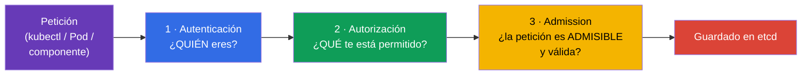
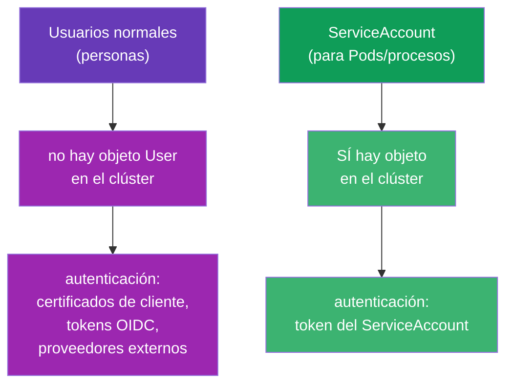
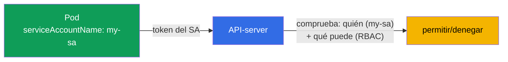
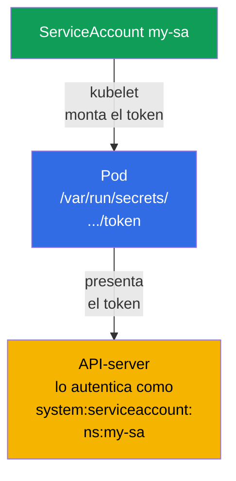
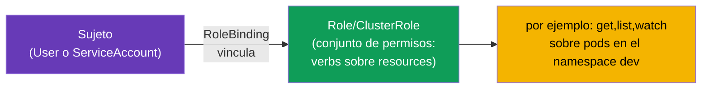
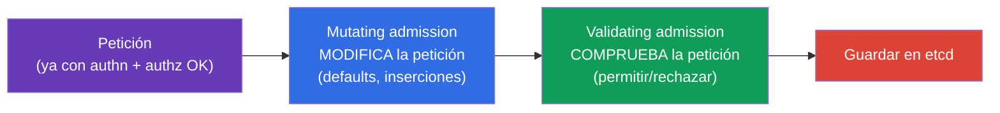
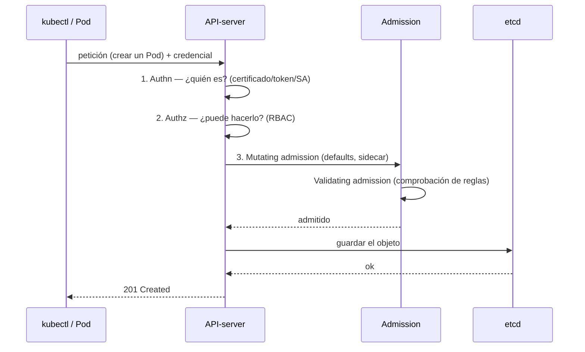

[Русская версия](ru.md) · [Eng version](README.md) · [Version française](fr.md) · [Deutsche Version](de.md) · [ქართული ვერსია](ge.md)

# Capítulo 21. ServiceAccount; autenticación, autorización, admission

> **Qué viene ahora.** Cerramos la parte 3. Hemos repetido muchas veces que todas las
> peticiones pasan por el API-server (capítulo 2). Ahora veremos qué hace el API-server con
> cada petición: comprueba **quién** eres (autenticación), **qué te está permitido**
> (autorización) y **si la petición en sí es admisible** (admission). Aparte va el
> **ServiceAccount**: la identidad con la que los propios Pods acceden a la API. Es un
> capítulo panorámico de la parte 3 (RBAC en profundidad llega en el capítulo 38). El tema
> pertenece al dominio Security de los dos exámenes.

## 21.1. Tres barreras a la entrada del API-server

Cada petición al API-server pasa por tres etapas, una tras otra. Si falla cualquiera de
ellas, la petición se rechaza.



| Etapa | Pregunta | Quién responde |
|------|--------|----------|
| Autenticación (authn) | ¿Quién eres? | certificados, tokens, ServiceAccount |
| Autorización (authz) | ¿Qué te está permitido? | RBAC (capítulo 38) |
| Admission control | ¿La petición es admisible? ¿Completar/comprobar? | admission-controllers |

## 21.2. Autenticación: quién hace la petición

Kubernetes distingue dos tipos de «usuarios»:



- **Usuarios normales (personas)** - Kubernetes **no** tiene un objeto «User». Las personas
  se autentican con medios externos: certificados TLS de cliente (capítulo 39), tokens OIDC,
  integración con proveedores externos. Kubernetes solo confía en el nombre que viene del
  certificado o del token.
- **ServiceAccount** - para aplicaciones y procesos dentro del clúster. Es un **objeto real**
  de Kubernetes que vive en un namespace.

## 21.3. ServiceAccount: identidad para los Pods

Cuando un Pod quiere dirigirse al API-server (por ejemplo, un operador que lee objetos, o una
aplicación que crea recursos), lo hace en nombre de un **ServiceAccount**. Todo Pod funciona
siempre bajo algún ServiceAccount: si no se indica ninguno, se usa el `default` de su
namespace.



```bash
# Crear un ServiceAccount
kubectl create serviceaccount my-sa

# Verlo
kubectl get sa
```

Asignación al Pod:

```yaml
spec:
  serviceAccountName: my-sa
  containers:
  - name: app
    image: myapp
```

## 21.4. Cómo llega el token del ServiceAccount al Pod

Kubernetes monta automáticamente en el Pod el token del ServiceAccount para que la aplicación
pueda presentarlo al API-server. En las versiones modernas (tokens proyectados,
BoundServiceAccountTokenVolume, GA desde la 1.22) el token es de vida corta, está ligado a
una audiencia (audience) y se rota automáticamente, a diferencia de los antiguos tokens
«eternos».

> **Qué ha cambiado (importante para los clústeres actuales).** El automontaje del token en el
> Pod está activado **por defecto** y sigue ahí. Pero desde **Kubernetes 1.24** ya no se crea
> automáticamente un **Secret de larga duración** con el token para cada ServiceAccount: el
> Pod recibe un token proyectado de vida corta, no uno «eterno» sacado de un Secret. Si de
> todas formas hace falta un token de larga duración (por ejemplo, para un sistema externo),
> se crea de forma explícita: `kubectl create token <sa>` (corto, vía TokenRequest API) o con
> un Secret aparte con la anotación `kubernetes.io/service-account.name`. El montaje en sí se
> puede desactivar con el flag `automountServiceAccountToken: false` (ver más abajo).

```
/var/run/secrets/kubernetes.io/serviceaccount/
├── token       # token para autenticarse en la API
├── ca.crt      # certificado de la CA del clúster
└── namespace   # namespace del Pod
```



Si el Pod **no necesita** acceso a la API (una aplicación normal casi nunca lo necesita),
conviene desactivar el automontaje del token: es una buena práctica de seguridad:

```yaml
spec:
  automountServiceAccountToken: false
```

Así el Pod no carga con un token de más que, en caso de compromiso, daría acceso a la API.

## 21.5. Autorización: qué está permitido (RBAC)

La autenticación ya ha respondido «quién eres». Después la autorización decide «qué te está
permitido». El mecanismo principal es **RBAC (Role-Based Access Control)**. La idea: los
permisos se describen en una Role/ClusterRole (qué se puede hacer) y se vinculan a un sujeto
(usuario o ServiceAccount) mediante RoleBinding/ClusterRoleBinding.



Comprobación rápida de tus propios permisos, sin analizar toda la estructura:

```bash
kubectl auth can-i create pods
kubectl auth can-i delete nodes
kubectl auth can-i get pods --as=system:serviceaccount:dev:my-sa -n dev
```

`kubectl auth can-i` es una herramienta insustituible tanto en el examen como en la vida real:
responde directamente «se puede/no se puede». RBAC completo (Role, ClusterRole, bindings,
verbs, resources) lo veremos en el capítulo 38.

### Caso: dar a un usuario acceso total al namespace dev

Tarea habitual: dar a una persona (no a un Pod, sino a un usuario) **acceso total a todos los
objetos de un único namespace** `dev`, sin permitirle nada en el resto. Se resuelve en dos
pasos: crear la **identidad del usuario** y **vincularle permisos** vía RBAC. Recordemos: en
Kubernetes no existe el objeto `User`; la identidad se acredita con un certificado (u OIDC) y
RBAC solo maneja su nombre.

**Paso 1. Identidad mediante certificado de cliente.** El usuario `dev-user` presenta al
API-server un certificado TLS de cliente donde `CN` = nombre de usuario. Generamos la clave y
la CSR, y la firmamos con el CertificateSigningRequest integrado:

```bash
# clave y solicitud de certificado (el CN pasará a ser el nombre de usuario)
openssl genrsa -out dev-user.key 2048
openssl req -new -key dev-user.key -out dev-user.csr -subj "/CN=dev-user"

# enviamos la CSR al clúster (request — base64 del .csr)
cat <<EOF | kubectl apply -f -
apiVersion: certificates.k8s.io/v1
kind: CertificateSigningRequest
metadata:
  name: dev-user
spec:
  request: $(base64 -w0 dev-user.csr)
  signerName: kubernetes.io/kube-apiserver-client
  usages: ["client auth"]
EOF

kubectl certificate approve dev-user                         # el admin lo aprueba
kubectl get csr dev-user -o jsonpath='{.status.certificate}' | base64 -d > dev-user.crt
```

Después se compone el contexto de kubeconfig para el usuario (certificado + CA del clúster):

```bash
kubectl config set-credentials dev-user \
  --client-certificate=dev-user.crt --client-key=dev-user.key --embed-certs=true
kubectl config set-context dev-user --cluster=<nombre-del-clúster> --user=dev-user --namespace=dev
```

**Paso 2. Permisos: Role + RoleBinding en el namespace dev.** «Acceso total a todos los
objetos» dentro de un namespace es una Role con `*` en grupos, recursos y verbos. Justamente
una **Role** (namespaced), y no una ClusterRole, es la que limita los permisos al ámbito de
`dev`:

```yaml
apiVersion: rbac.authorization.k8s.io/v1
kind: Role
metadata:
  namespace: dev
  name: dev-admin
rules:
- apiGroups: ["*"]        # todos los API-groups
  resources: ["*"]        # todos los recursos (pods, deployments, services, ...)
  verbs: ["*"]            # todas las acciones (get, list, create, update, delete, ...)
---
apiVersion: rbac.authorization.k8s.io/v1
kind: RoleBinding
metadata:
  namespace: dev
  name: dev-user-admin
subjects:
- kind: User
  name: dev-user          # ese mismo CN del certificado
  apiGroup: rbac.authorization.k8s.io
roleRef:
  kind: Role
  name: dev-admin
  apiGroup: rbac.authorization.k8s.io
```

**Comprobación:**

```bash
kubectl auth can-i '*' '*' -n dev --as=dev-user      # yes — acceso total en dev
kubectl auth can-i get pods -n prod --as=dev-user    # no  — en otros namespace no tiene permisos
```

Resultado: el usuario ha obtenido acceso total estrictamente en `dev`. Los puntos clave son
**Role (namespaced), y no ClusterRole**, para que los permisos no se «derramen» a todo el
clúster, y el **RoleBinding justamente en `dev`**. Si hiciera falta acceso en todos los
namespace, usaríamos ClusterRole + ClusterRoleBinding; si se necesita el mismo conjunto de
permisos en varios namespace concretos, resulta cómodo describir una ClusterRole una sola vez
y vincularla con un RoleBinding en cada namespace necesario.

**Cómo obtener la lista de usuarios.** El comando `kubectl get users` **no existe**: User no
es un objeto de Kubernetes, no hay un registro aparte de personas en el clúster. La «lista» se
obtiene de forma indirecta, analizando a quién se le ha dado qué: por los sujetos de los
bindings de RBAC y por los certificados emitidos:

```bash
# todos los sujetos de tipo usuario de RoleBinding y ClusterRoleBinding
kubectl get rolebindings,clusterrolebindings -A \
  -o jsonpath='{range .items[*]}{range .subjects[?(@.kind=="User")]}{.name}{"\n"}{end}{end}' | sort -u

# quién recibió certificados de cliente (identidades) y cuándo
kubectl get csr

# usuarios registrados en tu kubeconfig (local, no en el clúster)
kubectl config get-users
```

**Cómo eliminar un usuario creado.** «Eliminar» un usuario es **revocarle los permisos**,
porque el objeto User como tal no existe:

```bash
# 1. Quitar permisos — borrar el binding (y la Role dedicada, si era solo para él)
kubectl delete rolebinding dev-user-admin -n dev
kubectl delete role dev-admin -n dev            # si la Role se creó para él

# 2. Quitar la cuenta del kubeconfig (local)
kubectl config delete-user dev-user
kubectl config delete-context dev-user

# 3. Por limpieza — borrar el objeto CSR
kubectl delete csr dev-user
```

> **Importante sobre los certificados.** En Kubernetes vanilla **no hay revocación (CRL)** para
> los certificados de cliente: mientras no expire su validez, el certificado sigue pasando la
> autenticación. Tras borrar los bindings, ese usuario todavía «entrará», pero no tendrá
> permisos (aparte de lo que da el grupo `system:authenticated`). Por eso, para revocar el
> acceso de verdad se recurre a certificados **de vida corta** o a un IdP externo (OIDC), donde
> la cuenta se puede desactivar de forma centralizada. Si un certificado se ve comprometido
> antes de expirar, se cambia o se reemite la CA (una operación costosa).

> **¿Y cómo es esto en los clústeres gestionados (con el ejemplo de AWS EKS)?** Allí los
> certificados y las CSR normalmente no se usan: las identidades se toman de **IAM**, y
> Kubernetes solo las hace corresponder con sus usuarios/grupos. El esquema:
>
> - **Autenticación - vía IAM.** El kubeconfig generado por `aws eks update-kubeconfig`
>   contiene un exec-plugin que llama a `aws eks get-token` y presenta al API-server un token
>   que acredita la identidad IAM (un rol o un usuario). La persona no tiene contraseña ni
>   certificado propios: entra con su cuenta de AWS.
> - **Correspondencia IAM → Kubernetes.** Antes esto se hacía con el ConfigMap `aws-auth` en
>   `kube-system` (secciones `mapUsers`/`mapRoles`: ARN de IAM → nombre y grupos de k8s). Ahora
>   se recomienda el mecanismo nativo **EKS Access Entries**:
>
>   ```bash
>   # asociar un rol IAM con una identidad del clúster y asignarle grupos para RBAC
>   aws eks create-access-entry --cluster-name demo \
>     --principal-arn arn:aws:iam::111122223333:role/dev-team \
>     --kubernetes-groups dev-admins
>   ```
> - **Los permisos - el mismo RBAC de siempre.** Luego al grupo (`dev-admins`) se le da una
>   Role/RoleBinding en el namespace que toque, exactamente como en el caso de arriba. O se le
>   cuelga una access-policy gestionada de EKS (`aws eks associate-access-policy`, por ejemplo
>   `AmazonEKSAdminPolicy` con restricción por namespace), que es una «envoltura» sobre esos
>   mismos permisos de RBAC.
>
> Resultado: en EKS «crear un usuario» = crear/elegir un **principal de IAM** + hacerlo
> corresponder (access entry o `aws-auth`) con un grupo de k8s, mientras que los permisos dentro del clúster
> los sigue definiendo RBAC. GKE (Google IAM) y AKS (Entra ID) funcionan de forma análoga. Allí
> la revocación de acceso se hace de forma centralizada: quitar la access entry o los permisos
> de IAM, sin pelearse con CRL.

Más detalles sobre RBAC en el capítulo 38.

## 21.6. Admission control: la última barrera

Después de la autenticación y la autorización, la petición pasa por los
**admission-controllers**: plugins que pueden modificarla o rechazarla. Son de dos tipos:



- **Mutating** - cambian el objeto antes de guardarlo: rellenan valores por defecto, inyectan
  sidecars (así funciona la inyección del proxy en un service mesh), ponen labels.
- **Validating** - comprueban y rechazan si el objeto infringe las reglas.

Ejemplos de admission-controllers integrados con los que ya te has cruzado sin saberlo:

| Controlador | Qué hace |
|-----------|-----------|
| `LimitRanger` | aplica el LimitRange (capítulo 14) |
| `ResourceQuota` | comprueba el ResourceQuota (capítulo 14) |
| `PodSecurity` | aplica Pod Security Admission (capítulo 20) |
| `ServiceAccount` | asigna el ServiceAccount y monta el token |
| `NamespaceLifecycle` | no deja crear objetos en un namespace en eliminación |

Las reglas propias se añaden mediante **webhooks** (ValidatingWebhookConfiguration,
MutatingWebhookConfiguration): así funcionan Kyverno, OPA/Gatekeeper, cert-manager y la
inyección de sidecars. Eso explica de dónde salen «por sí solos» los contenedores sidecar o
los valores por defecto en un Pod.

Detalles importantes del pipeline de admission (se preguntan):

- **El orden es estricto:** primero **todos los mutating**, luego una revalidación del esquema,
  y después **todos los validating**. Por eso los validating ven el objeto ya con todos los
  cambios de los mutating aplicados.
- **La failurePolicy del webhook** (`Fail`/`Ignore`) decide qué hacer si tu servidor de webhook
  no está disponible. `Fail` (por defecto) es más seguro (no deja pasar nada), pero **un webhook
  caído con `Fail` puede bloquear la creación de objetos** en el clúster: una causa habitual del
  incidente «no se crea nada». `Ignore` prioriza la disponibilidad sobre el rigor.
- **PodSecurityPolicy (PSP) se eliminó** en la 1.25; en su lugar llegó el **Pod Security
  Admission** integrado (capítulo 20) o motores externos (Kyverno/Gatekeeper vía webhook).
- La lista de admission-plugins activados se define con el flag del apiserver
  `--enable-admission-plugins` (en el manifiesto `/etc/kubernetes/manifests/kube-apiserver.yaml`).

## 21.7. La foto completa: el camino de una petición

Juntemos todo: este es el mapa que conviene tener en la cabeza.



Cualquiera de las barreras puede rechazar la petición: no es quien dice ser (authn) → 401; no
tiene permisos (authz) → 403; infringe una política (admission) → rechazo con motivo. Entender
esta cadena es la clave para analizar «por qué se me deniega a mí o a mi Pod».

## 21.8. Cómo se aplica esto en producción

- **Un ServiceAccount propio por aplicación.** En producción no se usa el SA `default` para las
  cargas de trabajo: a cada aplicación se le crea su propio ServiceAccount con permisos mínimos
  (RBAC). Eso limita el daño si el Pod se ve comprometido.
- **Desactivar el automontaje del token.** A las aplicaciones que no necesitan acceso a la API
  (la mayoría) se les pone `automountServiceAccountToken: false`, para que no lleven encima una
  llave de acceso de más.
- **IRSA / Workload Identity.** En la nube el ServiceAccount se asocia con roles de la nube
  (AWS IRSA, GCP Workload Identity) para que el Pod obtenga acceso a los servicios cloud (S3,
  colas) sin claves estáticas, por la identidad del SA.
- **Políticas de admission como guardián.** Kyverno/OPA Gatekeeper, mediante
  validating-webhooks, imponen reglas: prohibición de privileged, etiquetas y límites
  obligatorios, registries de imágenes permitidos. Es la forma de no dejar entrar en el clúster
  objetos inseguros o no conformes.
- **Inyección con mutating.** Los service mesh (Istio) y los inyectores de secretos (Vault
  Agent) funcionan con mutating-webhooks: añaden automáticamente sidecars y secretos a los Pods
  sin tocar sus manifiestos.

## 21.9. Mini-glosario

- **Autenticación (authn)** - determinar quién envía la petición.
- **Autorización (authz)** - comprobar que al emisor le está permitido (RBAC).
- **Admission control** - comprobación/modificación de la petición después de authn+authz.
- **Mutating / Validating admission** - controladores que modifican / que comprueban.
- **ServiceAccount** - identidad de un Pod/proceso para acceder a la API.
- **default SA** - el ServiceAccount por defecto de cada namespace.
- **automountServiceAccountToken** - si se monta o no el token del SA en el Pod.
- **RBAC** - control de acceso basado en roles (capítulo 38).
- **webhook (admission)** - comprobación/modificación externa de objetos (Kyverno, OPA, mesh).

## 21.10. Resumen del capítulo

- Cada petición a la API pasa tres barreras: autenticación (quién), autorización (qué se
  puede, RBAC) y admission (admisibilidad y modificación).
- Las personas se autentican por fuera (certificados, OIDC): en Kubernetes no hay objeto User;
  los Pods, mediante ServiceAccount (un objeto real en un namespace).
- Todo Pod funciona bajo un ServiceAccount (por defecto `default`); el token se monta en el
  Pod automáticamente, pero si no hace falta es mejor desactivarlo.
- La autorización la hace RBAC; la comprobación rápida de permisos es `kubectl auth can-i`.
- Los admission-controllers son mutating (cambian el objeto: defaults, sidecar) y validating
  (rechazan según reglas); los personalizados, mediante webhooks (Kyverno, OPA, mesh).
- Entender la cadena authn → authz → admission es la clave para analizar los rechazos
  (401/403/política).

## 21.11. Para qué te servirá: en el examen y en el trabajo real

**En el examen.** «Crea un ServiceAccount y asígnalo a un Pod», «comprueba si el SA puede
hacer X» (`kubectl auth can-i --as`), entender por qué se rechazó una petición
(authn/authz/admission) son tareas frecuentes del dominio Security. Es la base del capítulo 38
(RBAC), donde las tareas van de Role y bindings.

**En el trabajo real.** Un ServiceAccount propio con permisos mínimos para cada aplicación es
higiene básica de seguridad. Desactivar los tokens innecesarios, asociar el SA con roles de la
nube (IRSA), las políticas de admission (Kyverno) y la inyección con mutating (mesh) son
herramientas del día a día para operar el clúster de forma segura y controlada.

## 21.12. Preguntas de autoevaluación

1. ¿Qué tres barreras pasa una petición al API-server y a qué pregunta responde cada una?
2. ¿En qué se diferencia la autenticación de los usuarios normales de la del ServiceAccount?
   ¿Por qué no hay objeto User?
3. ¿Bajo qué ServiceAccount funciona un Pod si no se indica explícitamente? ¿Dónde está su token?
4. ¿Para qué y cuándo se desactiva `automountServiceAccountToken`?
5. ¿Cómo comprobar rápidamente si a un sujeto le está permitida una acción?
6. ¿En qué se diferencia el mutating admission del validating? Pon ejemplos de cada uno.
7. ¿Cómo llegan «por sí solos» a un Pod los sidecars o los valores por defecto vía admission-webhooks?

## Práctica

Con esto queda cerrada la parte 3 (configuración y seguridad). A continuación viene la parte 4,
específica de CKAD: diseño y construcción de aplicaciones, empezando por los patrones
multi-container (capítulo 22). El ServiceAccount y la comprobación de permisos se practican en
los laboratorios de seguridad; el RBAC en profundidad espera en el capítulo 38.

🧪 Laboratorio 113 (ServiceAccount, RBAC y CSR): [tasks/cka/labs/113](../../labs/113/README_ES.MD)

🧪 Laboratorio 121 (drills de RBAC: SA, Role/ClusterRole, bindings): [tasks/cka/labs/121](../../labs/121/README_ES.MD)

---
[Índice](../README_ES.md) · [Capítulo 20](../20/es.md) · [Capítulo 22](../22/es.md)
