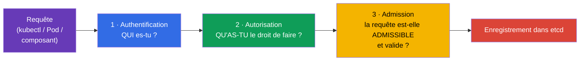
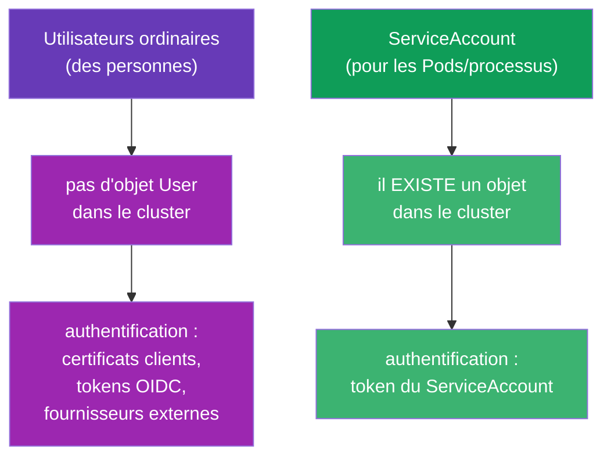
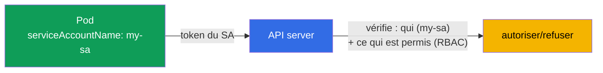
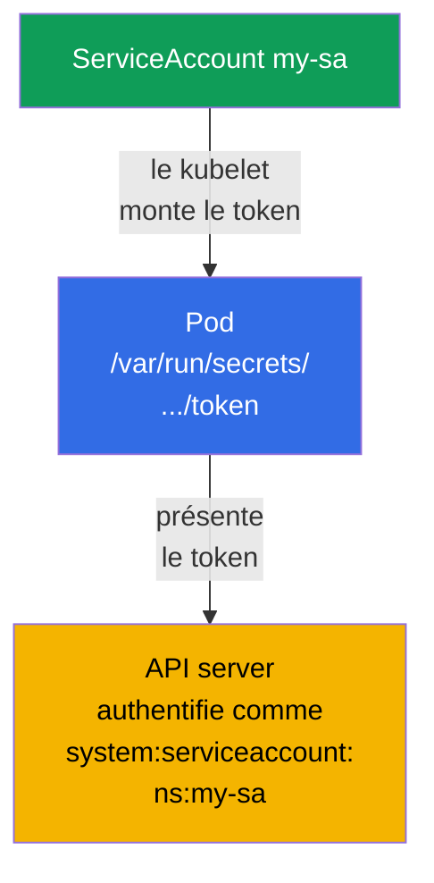
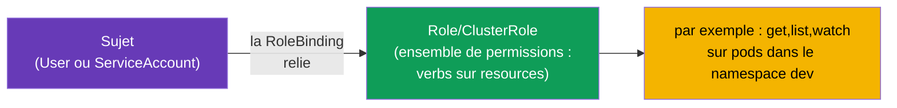
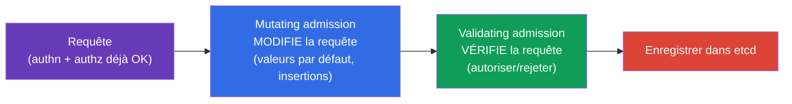
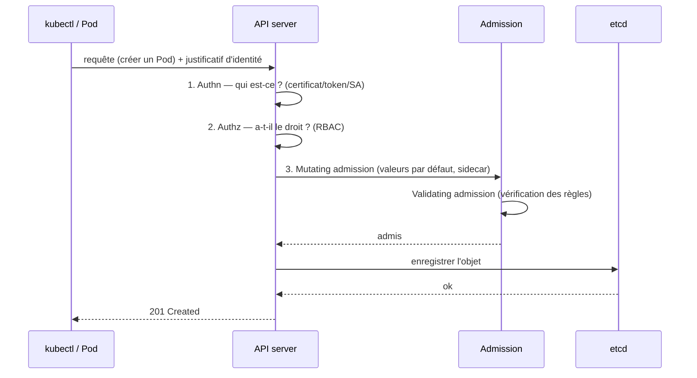

[Русская версия](ru.md) · [Eng version](README.md) · [Versión en español](es.md) · [Deutsche Version](de.md) · [ქართული ვერსია](ge.md) · [繁體中文版](tw.md) · [日本語版](jp.md)

# Chapitre 21. ServiceAccount ; authentification, autorisation, admission

> **Ce qui suit.** Nous terminons la partie 3. Nous avons répété de nombreuses fois que
> toutes les requêtes passent par l'API server (chapitre 2). Voyons maintenant ce que
> l'API server fait de chaque requête : il vérifie **qui** vous êtes (authentification), **ce
> que vous avez le droit de faire** (autorisation) et **si la requête elle-même est
> admissible** (admission). À part cela - le **ServiceAccount** : l'identité sous laquelle
> les Pods eux-mêmes s'adressent à l'API. C'est un chapitre de synthèse pour la partie 3
> (le RBAC sera approfondi au chapitre 38). Le sujet relève du domaine Security des deux
> examens.

## 21.1. Trois barrières à l'entrée de l'API server

Chaque requête vers l'API server traverse trois étapes l'une après l'autre. Si l'une
échoue, la requête est rejetée.



| Étape | Question | Ce qui répond |
|------|--------|----------|
| Authentification (authn) | Qui es-tu ? | certificats, tokens, ServiceAccount |
| Autorisation (authz) | Qu'as-tu le droit de faire ? | RBAC (chapitre 38) |
| Admission control | La requête est-elle admissible ? Compléter/vérifier ? | contrôleurs d'admission |

## 21.2. Authentification : qui s'adresse à l'API

Kubernetes distingue deux sortes d'« utilisateurs » :



- **Utilisateurs ordinaires (des personnes)** - Kubernetes n'a **pas** d'objet « User ». Les
  personnes s'authentifient par des moyens externes : certificats TLS clients
  (chapitre 39), tokens OIDC, intégration avec des fournisseurs externes. Kubernetes se
  contente de faire confiance au nom issu du certificat/token.
- **ServiceAccount** - pour les applications et les processus à l'intérieur du cluster.
  C'est un **véritable objet** Kubernetes, qui vit dans un namespace.

## 21.3. ServiceAccount : l'identité des Pods

Quand un Pod veut s'adresser à l'API server (par exemple un opérateur qui lit des objets,
ou une application qui crée des ressources), il le fait au nom d'un **ServiceAccount**.
Chaque Pod tourne toujours sous un ServiceAccount - si rien n'est précisé, c'est `default`
du namespace du Pod qui est utilisé.



```bash
# Créer un ServiceAccount
kubectl create serviceaccount my-sa

# Consulter
kubectl get sa
```

Rattachement au Pod :

```yaml
spec:
  serviceAccountName: my-sa
  containers:
  - name: app
    image: myapp
```

## 21.4. Comment le token du ServiceAccount arrive dans le Pod

Kubernetes monte automatiquement dans le Pod le token du ServiceAccount, pour que
l'application puisse le présenter à l'API server. Dans les versions récentes (tokens
projetés, BoundServiceAccountTokenVolume, GA depuis 1.22) le token est à durée de vie
courte, lié à une audience et rotationné automatiquement - contrairement aux anciens tokens
« éternels ».

> **Ce qui a changé (important pour les clusters actuels).** Le montage automatique du token
> dans le Pod est activé **par défaut** et n'a pas disparu. Mais depuis **Kubernetes 1.24**,
> un **Secret à longue durée de vie** contenant le token n'est plus créé automatiquement
> pour chaque ServiceAccount : le Pod reçoit un token projeté à durée de vie courte, et non
> un token « éternel » issu d'un Secret. Si un token à longue durée de vie est malgré tout
> nécessaire (par exemple pour un système externe), on le crée explicitement -
> `kubectl create token <sa>` (court, via l'API TokenRequest) ou via un Secret dédié portant
> l'annotation `kubernetes.io/service-account.name`. Quant au montage lui-même, on peut le
> désactiver avec `automountServiceAccountToken: false` (voir ci-dessous).

```
/var/run/secrets/kubernetes.io/serviceaccount/
├── token       # token pour s'authentifier auprès de l'API
├── ca.crt      # certificat de la CA du cluster
└── namespace   # namespace du Pod
```



Si un Pod **n'a pas besoin** d'accéder à l'API (une application ordinaire n'en a le plus
souvent pas besoin), il vaut mieux désactiver le montage automatique du token - c'est une
bonne pratique de sécurité :

```yaml
spec:
  automountServiceAccountToken: false
```

Ainsi le Pod ne traîne pas avec lui un token superflu qui, en cas de compromission,
donnerait accès à l'API.

## 21.5. Autorisation : ce qui est permis (RBAC)

L'authentification a répondu à « qui es-tu ». Ensuite l'autorisation décide « ce que tu as
le droit de faire ». Le mécanisme principal est le **RBAC (Role-Based Access Control)**.
L'idée : les droits sont décrits dans une Role/ClusterRole (ce qu'il est permis de faire) et
rattachés à un sujet (utilisateur ou ServiceAccount) via une RoleBinding/ClusterRoleBinding.



Vérification rapide de ses propres droits - sans démonter toute la structure :

```bash
kubectl auth can-i create pods
kubectl auth can-i delete nodes
kubectl auth can-i get pods --as=system:serviceaccount:dev:my-sa -n dev
```

`kubectl auth can-i` est un outil irremplaçable, à l'examen comme dans la vraie vie : il
répond directement « permis/interdit ». Nous verrons le RBAC en entier (Role, ClusterRole,
bindings, verbs, resources) au chapitre 38.

### Cas pratique : donner à un utilisateur un accès complet au namespace dev

Tâche fréquente : accorder à une personne (pas à un Pod, mais à un utilisateur) un **accès
complet à tous les objets d'un seul namespace** `dev`, sans rien autoriser dans les autres.
Cela se règle en deux étapes : créer l'**identité de l'utilisateur** et **y rattacher des
droits** via le RBAC. Rappelons-le : il n'y a pas d'objet `User` dans Kubernetes -
l'identité est confirmée par un certificat (ou OIDC), et le RBAC ne manipule que son nom.

**Étape 1. L'identité via un certificat client.** L'utilisateur `dev-user` présente à l'API
server un certificat TLS client où le `CN` = nom de l'utilisateur. Générons la clé et la
CSR, puis signons via le CertificateSigningRequest intégré :

```bash
# clé et demande de certificat (le CN deviendra le nom de l'utilisateur)
openssl genrsa -out dev-user.key 2048
openssl req -new -key dev-user.key -out dev-user.csr -subj "/CN=dev-user"

# on envoie la CSR au cluster (request — base64 du .csr)
cat <<EOF | kubectl apply -f -
apiVersion: certificates.k8s.io/v1
kind: CertificateSigningRequest
metadata:
  name: dev-user
spec:
  request: $(base64 -w0 dev-user.csr)
  signerName: kubernetes.io/kube-apiserver-client
  usages: ["client auth"]
EOF

kubectl certificate approve dev-user                         # l'admin approuve
kubectl get csr dev-user -o jsonpath='{.status.certificate}' | base64 -d > dev-user.crt
```

Ensuite on construit un contexte kubeconfig pour l'utilisateur (certificat + CA du
cluster) :

```bash
kubectl config set-credentials dev-user \
  --client-certificate=dev-user.crt --client-key=dev-user.key --embed-certs=true
kubectl config set-context dev-user --cluster=<nom-du-cluster> --user=dev-user --namespace=dev
```

**Étape 2. Les droits : Role + RoleBinding dans le namespace dev.** « Accès complet à tous
les objets » à l'intérieur d'un namespace, c'est une Role avec `*` sur les groupes, les
ressources et les verbes. C'est précisément la **Role** (namespaced), et non une
ClusterRole, qui limite les droits au périmètre de `dev` :

```yaml
apiVersion: rbac.authorization.k8s.io/v1
kind: Role
metadata:
  namespace: dev
  name: dev-admin
rules:
- apiGroups: ["*"]        # tous les groupes d'API
  resources: ["*"]        # toutes les ressources (pods, deployments, services, ...)
  verbs: ["*"]            # toutes les actions (get, list, create, update, delete, ...)
---
apiVersion: rbac.authorization.k8s.io/v1
kind: RoleBinding
metadata:
  namespace: dev
  name: dev-user-admin
subjects:
- kind: User
  name: dev-user          # ce fameux CN issu du certificat
  apiGroup: rbac.authorization.k8s.io
roleRef:
  kind: Role
  name: dev-admin
  apiGroup: rbac.authorization.k8s.io
```

**Vérification :**

```bash
kubectl auth can-i '*' '*' -n dev --as=dev-user      # yes — accès complet dans dev
kubectl auth can-i get pods -n prod --as=dev-user    # no  — aucun droit dans les autres namespaces
```

Bilan : l'utilisateur a reçu un accès complet strictement dans `dev`. Les points clés sont
une **Role (namespaced), et non une ClusterRole**, pour que les droits ne « débordent » pas
sur tout le cluster, et une **RoleBinding précisément dans `dev`**. S'il fallait un accès
dans tous les namespaces, on prendrait ClusterRole + ClusterRoleBinding ; si le même
ensemble de droits est nécessaire dans plusieurs namespaces précis, il est commode de
décrire une fois la ClusterRole et de la rattacher par une RoleBinding dans chaque namespace
voulu.

**Comment obtenir la liste des utilisateurs.** La commande `kubectl get users`
**n'existe pas** - User n'est pas un objet Kubernetes, il n'y a pas de registre des
personnes dans le cluster. On obtient la « liste » indirectement, en examinant ce qui a été
accordé à qui : par les sujets des attributions RBAC et par les certificats émis :

```bash
# tous les sujets de type utilisateur issus des RoleBinding et ClusterRoleBinding
kubectl get rolebindings,clusterrolebindings -A \
  -o jsonpath='{range .items[*]}{range .subjects[?(@.kind=="User")]}{.name}{"\n"}{end}{end}' | sort -u

# qui a reçu des certificats clients et quand (les identités)
kubectl get csr

# utilisateurs déclarés dans votre kubeconfig (en local, pas dans le cluster)
kubectl config get-users
```

**Comment supprimer un utilisateur créé.** « Supprimer » un utilisateur, c'est **révoquer
ses droits**, puisque l'objet User n'existe pas :

```bash
# 1. Retirer les droits — supprimer l'attribution (et la Role dédiée, si elle n'est que pour lui)
kubectl delete rolebinding dev-user-admin -n dev
kubectl delete role dev-admin -n dev            # si la Role avait été créée pour lui

# 2. Enlever le compte du kubeconfig (en local)
kubectl config delete-user dev-user
kubectl config delete-context dev-user

# 3. Par souci de propreté — supprimer l'objet CSR
kubectl delete csr dev-user
```

> **Important au sujet des certificats.** Dans Kubernetes vanilla il n'y a **pas de
> révocation (CRL)** pour les certificats clients : tant que la validité n'est pas expirée,
> le certificat continue de passer l'authentification. Après suppression des attributions,
> un tel utilisateur « entrera » toujours, mais sans aucun droit (hormis ce que donne le
> groupe `system:authenticated`). C'est pourquoi, pour une vraie révocation d'accès, on
> s'appuie sur des certificats **à durée de vie courte** ou sur un IdP externe (OIDC), où le
> compte peut être désactivé de façon centralisée. Si un certificat est compromis avant son
> expiration, on change/réémet la CA (opération lourde).

> **Et comment cela se passe-t-il dans les clusters managés (l'exemple d'AWS EKS) ?** Là-bas,
> les certificats et les CSR ne sont généralement pas utilisés - les identités viennent
> d'**IAM**, et Kubernetes se contente de les faire correspondre à ses propres
> utilisateurs/groupes. Le schéma :
>
> - **Authentification - via IAM.** Le kubeconfig produit par `aws eks update-kubeconfig`
>   contient un plugin exec qui appelle `aws eks get-token` et présente à l'API server un
>   token confirmant l'identité IAM (rôle ou utilisateur). La personne n'a pas de mot de
>   passe ni de certificat propre - l'entrée se fait avec son compte AWS.
> - **Correspondance IAM → Kubernetes.** Auparavant cela se faisait via la ConfigMap
>   `aws-auth` dans `kube-system` (sections `mapUsers`/`mapRoles` : ARN IAM → nom k8s et
>   groupes). Aujourd'hui, le mécanisme natif recommandé est **EKS Access Entries** :
>
>   ```bash
>   # relier un rôle IAM à une identité dans le cluster et attribuer des groupes pour le RBAC
>   aws eks create-access-entry --cluster-name demo \
>     --principal-arn arn:aws:iam::111122223333:role/dev-team \
>     --kubernetes-groups dev-admins
>   ```
> - **Les droits - toujours le même RBAC.** Ensuite on donne au groupe (`dev-admins`) une
>   Role/RoleBinding dans le namespace voulu - exactement comme dans le cas ci-dessus. Ou
>   bien on lui attache une access-policy managée par EKS
>   (`aws eks associate-access-policy`, par exemple `AmazonEKSAdminPolicy` avec une
>   restriction sur un namespace) - c'est une « enveloppe » autour des mêmes permissions RBAC.
>
> Bilan : dans EKS, « créer un utilisateur » = créer/choisir un **principal IAM** + le faire
> correspondre (access entry ou `aws-auth`) à un groupe k8s, tandis que les droits internes au
> cluster restent définis par le RBAC. GKE (Google IAM) et AKS (Entra ID) fonctionnent de
> façon analogue. La révocation d'accès y est centralisée - retirer l'access entry / les
> droits IAM, sans se battre avec des CRL.

Plus de détails sur le RBAC au chapitre 38.

## 21.6. Admission control : la dernière barrière

Après l'authentification et l'autorisation, la requête traverse les **contrôleurs
d'admission** - des plugins qui peuvent la modifier ou la rejeter. Il en existe deux
sortes :



- **Mutating** - modifient l'objet avant l'enregistrement : ils posent les valeurs par
  défaut, injectent un sidecar (c'est ainsi que fonctionne l'injection du proxy dans un
  service mesh), apposent des labels.
- **Validating** - vérifient et rejettent si l'objet enfreint les règles.

Exemples de contrôleurs d'admission intégrés que vous avez déjà croisés implicitement :

| Contrôleur | Ce qu'il fait |
|-----------|-----------|
| `LimitRanger` | applique le LimitRange (chapitre 14) |
| `ResourceQuota` | vérifie le ResourceQuota (chapitre 14) |
| `PodSecurity` | applique Pod Security Admission (chapitre 20) |
| `ServiceAccount` | pose le ServiceAccount et monte le token |
| `NamespaceLifecycle` | empêche de créer des objets dans un namespace en cours de suppression |

Ses propres règles s'ajoutent via des **webhooks** (ValidatingWebhookConfiguration,
MutatingWebhookConfiguration) - c'est ainsi que fonctionnent Kyverno, OPA/Gatekeeper,
cert-manager, l'injection de sidecar. Cela explique d'où viennent les conteneurs sidecar qui
« apparaissent tout seuls » dans un Pod, ou les valeurs par défaut.

Détails importants du pipeline d'admission (ils sont demandés) :

- **L'ordre est strict :** d'abord **tous les mutating**, puis une nouvelle validation du
  schéma, puis **tous les validating**. C'est pourquoi les validating voient l'objet déjà
  après toutes les modifications des mutating.
- **La failurePolicy du webhook** (`Fail`/`Ignore`) décide de ce qu'il faut faire si votre
  serveur de webhook est indisponible. `Fail` (par défaut) est plus sûr (il ne laisse rien
  passer), mais **un webhook en panne avec `Fail` peut bloquer la création d'objets** dans le
  cluster - cause fréquente de l'incident « plus rien ne se crée ». `Ignore` - la
  disponibilité passe avant la rigueur.
- **PodSecurityPolicy (PSP) a été supprimé** en 1.25 ; il a été remplacé par le **Pod
  Security Admission** intégré (chapitre 20) ou par des moteurs externes
  (Kyverno/Gatekeeper via webhook).
- La liste des plugins d'admission activés est définie par le flag de l'apiserver
  `--enable-admission-plugins` (dans le manifeste
  `/etc/kubernetes/manifests/kube-apiserver.yaml`).

## 21.7. Le tableau complet : le parcours d'une requête

Rassemblons tout - voici la carte qu'il est utile de garder en tête.



N'importe laquelle des barrières peut rejeter la requête : ce n'est pas celui qu'il prétend
être (authn) → 401 ; pas de droits (authz) → 403 ; enfreint une politique (admission) →
refus avec la raison. Comprendre cette chaîne est la clé pour analyser « pourquoi mon accès
(ou celui du Pod) est refusé ».

## 21.8. Comment cela s'applique en production

- **Un ServiceAccount dédié par application.** En prod, on n'utilise pas le SA `default`
  pour les charges de travail - chaque application reçoit son propre ServiceAccount avec des
  droits minimaux (RBAC). Cela limite les dégâts en cas de compromission d'un Pod.
- **Désactivation du montage automatique du token.** Aux applications qui n'ont pas besoin
  d'accéder à l'API (la majorité), on met `automountServiceAccountToken: false` - pour ne pas
  porter une clé d'accès superflue.
- **IRSA / Workload Identity.** Dans le cloud, on relie le ServiceAccount à des rôles cloud
  (AWS IRSA, GCP Workload Identity), afin que le Pod accède aux services cloud (S3, files
  d'attente) sans clés statiques - grâce à l'identité du SA.
- **Les politiques d'admission comme gardien.** Kyverno/OPA Gatekeeper, via des
  validating-webhooks, appliquent les règles : interdiction de privileged, labels/limites
  obligatoires, registres d'images autorisés. C'est le moyen de ne pas laisser entrer dans le
  cluster des objets non sûrs ou non conformes.
- **L'injection par mutating.** Les service mesh (Istio) et les injecteurs de secrets (Vault
  Agent) fonctionnent via un mutating-webhook - ils ajoutent automatiquement
  sidecars/secrets aux Pods sans modifier leurs manifestes.

## 21.9. Mini-glossaire

- **Authentification (authn)** - établir qui est l'émetteur de la requête.
- **Autorisation (authz)** - vérifier que l'émetteur en a le droit (RBAC).
- **Admission control** - vérification/modification de la requête après authn+authz.
- **Mutating / Validating admission** - contrôleurs qui modifient / qui vérifient.
- **ServiceAccount** - identité d'un Pod/processus pour accéder à l'API.
- **default SA** - le ServiceAccount par défaut dans chaque namespace.
- **automountServiceAccountToken** - faut-il monter le token du SA dans le Pod.
- **RBAC** - contrôle d'accès basé sur les rôles (chapitre 38).
- **webhook (admission)** - vérification/modification externe des objets (Kyverno, OPA, mesh).

## 21.10. Bilan du chapitre

- Chaque requête vers l'API traverse trois barrières : authentification (qui), autorisation
  (ce qui est permis, RBAC), admission (admissibilité et modification).
- Les personnes s'authentifient de l'extérieur (certificats, OIDC) - il n'y a pas d'objet
  User dans Kubernetes ; les Pods, eux, passent par un ServiceAccount (véritable objet dans
  un namespace).
- Chaque Pod tourne sous un ServiceAccount (par défaut `default`) ; le token est monté dans
  le Pod automatiquement, mais s'il n'est pas nécessaire il vaut mieux le désactiver.
- L'autorisation est faite par le RBAC ; la vérification rapide des droits, c'est
  `kubectl auth can-i`.
- Les contrôleurs d'admission sont soit mutating (ils modifient l'objet : valeurs par
  défaut, sidecar) soit validating (ils rejettent selon des règles) ; les personnalisés
  passent par des webhooks (Kyverno, OPA, mesh).
- Comprendre la chaîne authn → authz → admission est la clé pour analyser les refus
  (401/403/politique).

## 21.11. À quoi cela sert : à l'examen et dans le travail réel

**À l'examen.** « Crée un ServiceAccount et affecte-le à un Pod », « vérifie si le SA peut
faire X » (`kubectl auth can-i --as`), comprendre pourquoi une requête a été rejetée
(authn/authz/admission) sont des exercices fréquents du domaine Security. C'est le socle du
chapitre 38 (RBAC), où les exercices portent sur les Role et les bindings.

**Dans le travail réel.** Un ServiceAccount dédié avec des droits minimaux pour chaque
application est une hygiène de sécurité de base. Désactiver les tokens inutiles, relier un SA
à des rôles cloud (IRSA), les politiques d'admission (Kyverno) et l'injection par mutating
(mesh) - tout cela constitue les outils quotidiens d'une exploitation sûre et maîtrisée du
cluster.

## 21.12. Questions d'auto-évaluation

1. Quelles sont les trois barrières que traverse une requête vers l'API server et à quelle
   question répond chacune ?
2. En quoi l'authentification des utilisateurs ordinaires diffère-t-elle de celle des
   ServiceAccount ? Pourquoi n'y a-t-il pas d'objet User ?
3. Sous quel ServiceAccount tourne un Pod si rien n'est précisé ? Où se trouve son token ?
4. Pourquoi et quand désactive-t-on `automountServiceAccountToken` ?
5. Comment vérifier rapidement si une action est permise à un sujet ?
6. En quoi le mutating admission diffère-t-il du validating ? Donnez des exemples de chacun.
7. Comment, via les webhooks d'admission, des sidecars ou des valeurs par défaut arrivent-ils
   « tout seuls » dans un Pod ?

## Pratique

La partie 3 (configuration et sécurité) s'achève ici. Ensuite - la partie 4, spécifique au
CKAD : conception et assemblage des applications, en commençant par les patterns
multi-conteneurs (chapitre 22). Le ServiceAccount et la vérification des droits se
travaillent dans les TP sur la sécurité ; le RBAC en profondeur attend au chapitre 38.

🧪 TP 113 (ServiceAccount, RBAC et CSR) : [tasks/cka/labs/113](../../labs/113/README_FR.MD)

🧪 TP 121 (drills RBAC : SA, Role/ClusterRole, bindings) : [tasks/cka/labs/121](../../labs/121/README_FR.MD)

---
[Sommaire](../README_FR.md) · [Chapitre 20](../20/fr.md) · [Chapitre 22](../22/fr.md)
