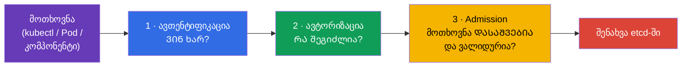
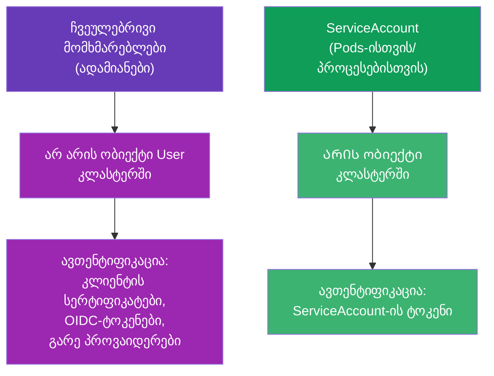
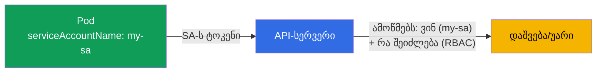
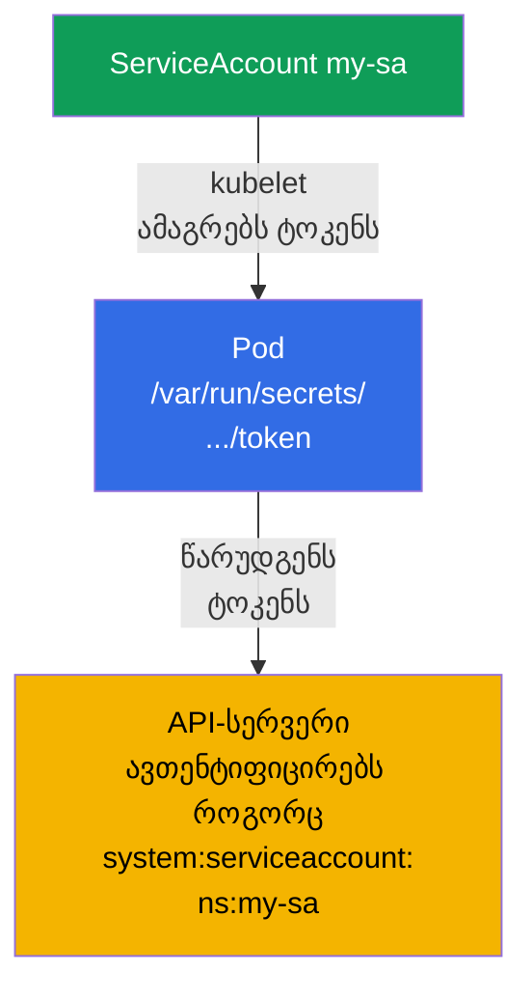
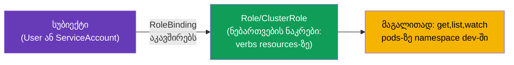
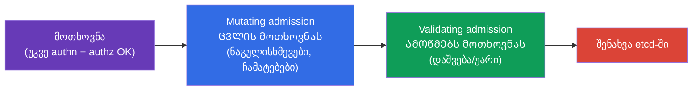
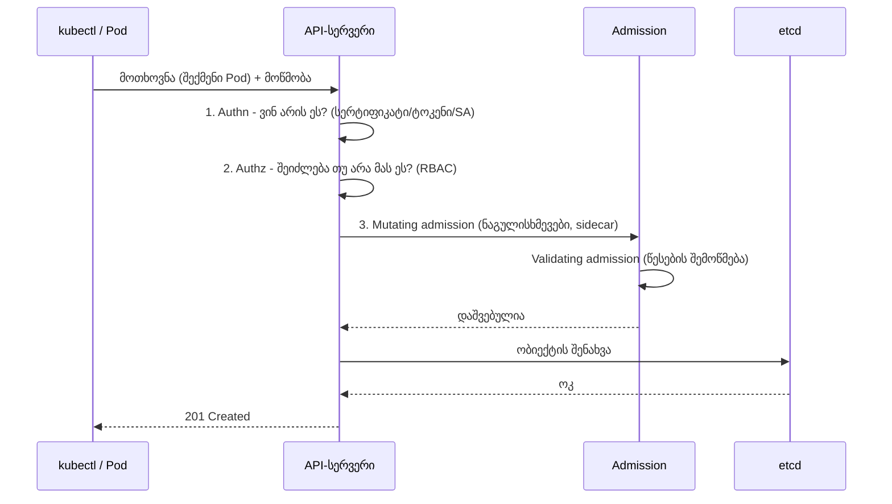

[Русская версия](ru.md) · [Eng version](README.md) · [Versión en español](es.md) · [Version française](fr.md) · [Deutsche Version](de.md) · [繁體中文版](tw.md) · [日本語版](jp.md)

# თავი 21. ServiceAccount; ავთენტიფიკაცია, ავტორიზაცია, admission

> **რა იქნება შემდეგ.** ვასრულებთ ნაწილ 3-ს. ბევრჯერ ვთქვით, რომ ყველა მოთხოვნა გადის
> API-სერვერზე (თავი 2). ახლა გავარჩევთ, რას აკეთებს API-სერვერი ყოველ მოთხოვნასთან:
> ამოწმებს, **ვინ** ხართ (ავთენტიფიკაცია), **რა შეგიძლიათ** (ავტორიზაცია) და **დასაშვებია თუ არა
> თავად მოთხოვნა** (admission). ცალკე - **ServiceAccount**: იდენტობა, რომლითაც API-ს
> თავად Pods მიმართავენ. ეს არის ნაწილ 3-ის მიმოხილვითი თავი (RBAC-ში უფრო ღრმად თავი 38 ჩაგვიყვანს).
> თემა - ორივე გამოცდის Security დომენია.

## 21.1. სამი ბარიერი API-სერვერის შესასვლელში

API-სერვერისადმი ყოველი მოთხოვნა რიგრიგობით სამ ეტაპს გადის. რომელიმეს თუ ვერ გაიარა - მოთხოვნა
უარყოფილია.



| ეტაპი | კითხვა | პასუხისმგებელია |
|------|--------|----------|
| ავთენტიფიკაცია (authn) | ვინ ხარ? | სერტიფიკატები, ტოკენები, ServiceAccount |
| ავტორიზაცია (authz) | რა გაქვს ნებადართული? | RBAC (თავი 38) |
| Admission control | მოთხოვნა საერთოდ დასაშვებია? შევავსოთ/შევამოწმოთ? | admission-კონტროლერები |

## 21.2. ავთენტიფიკაცია: ვინ მიმართავს

Kubernetes ორი სახის „მომხმარებელს“ არჩევს:



- **ჩვეულებრივი მომხმარებლები (ადამიანები)** - Kubernetes-ს **არ აქვს** ობიექტი „User“. ადამიანები
  ავთენტიფიკაციას გარე საშუალებებით გადიან: კლიენტის TLS-სერტიფიკატებით (თავი 39),
  OIDC-ტოკენებით, გარე პროვაიდერებთან ინტეგრაციით. Kubernetes მხოლოდ ენდობა სახელს, რომელიც
  სერტიფიკატიდან/ტოკენიდან მოდის.
- **ServiceAccount** - აპლიკაციებისა და პროცესებისთვის კლასტერის შიგნით. ეს **ნამდვილი
  ობიექტია** Kubernetes-ში, რომელიც namespace-ში ცხოვრობს.

## 21.3. ServiceAccount: იდენტობა Pods-ისთვის

როცა Pod-ს სურს API-სერვერისადმი მიმართვა (მაგალითად, ოპერატორი ობიექტებს კითხულობს, ან
აპლიკაცია რესურსებს ქმნის), ის ამას **ServiceAccount**-ის სახელით აკეთებს. ყოველი Pod ყოველთვის
რომელიღაც ServiceAccount-ით მუშაობს - თუ არ მიუთითებ, გამოიყენება `default` მისი
namespace-იდან.



```bash
# ServiceAccount-ის შექმნა
kubectl create serviceaccount my-sa

# ნახვა
kubectl get sa
```

Pod-თან მიბმა:

```yaml
spec:
  serviceAccountName: my-sa
  containers:
  - name: app
    image: myapp
```

## 21.4. როგორ ხვდება ServiceAccount-ის ტოკენი Pod-ში

Kubernetes ავტომატურად ამაგრებს Pod-ში ServiceAccount-ის ტოკენს, რომ აპლიკაციამ შეძლოს
წარუდგინოს იგი API-სერვერს. თანამედროვე ვერსიებში (პროეცირებული ტოკენები,
BoundServiceAccountTokenVolume, GA 1.22-იდან) ტოკენი მოკლევადიანია, მიბმულია აუდიტორიაზე
(audience) და ავტომატურად ბრუნავს - ძველი „მარადიული“ ტოკენებისგან განსხვავებით.

> **რა შეიცვალა (მნიშვნელოვანია აქტუალური კლასტერებისთვის).** ტოკენის ავტომიმაგრება Pod-ში
> **ნაგულისხმევად** ჩართულია და არსად გაქრა. მაგრამ **Kubernetes 1.24-იდან** შეწყდა
> ყოველ ServiceAccount-ზე **დიდხანს მცხოვრები Secret**-ის ავტომატური შექმნა ტოკენით:
> Pod იღებს მოკლევადიან პროეცირებულ ტოკენს და არა „მარადიულს“ Secret-იდან. თუ
> დიდხანს მცხოვრები ტოკენი მაინც საჭიროა (მაგალითად, გარე სისტემისთვის), მას ცხადად ქმნიან -
> `kubectl create token <sa>` (მოკლე, TokenRequest API-ით) ან ცალკე Secret-ით
> ანოტაციით `kubernetes.io/service-account.name`. თავად მიმაგრების გამორთვა კი შესაძლებელია
> დროშით `automountServiceAccountToken: false` (იხ. ქვემოთ).

```
/var/run/secrets/kubernetes.io/serviceaccount/
├── token       # ტოკენი API-ში ავთენტიფიკაციისთვის
├── ca.crt      # კლასტერის CA-ს სერტიფიკატი
└── namespace   # Pod-ის namespace
```



თუ Pod-ს **არ სჭირდება** API-ზე წვდომა (ჩვეულებრივ აპლიკაციას უმეტესად არ სჭირდება),
ტოკენის ავტომიმაგრება ღირს გამორთოთ - ეს უსაფრთხოების კარგი პრაქტიკაა:

```yaml
spec:
  automountServiceAccountToken: false
```

ასე Pod თან არ ატარებს ზედმეტ ტოკენს, რომელიც კომპრომეტაციის შემთხვევაში API-ზე წვდომას
მისცემდა.

## 21.5. ავტორიზაცია: რა არის ნებადართული (RBAC)

ავთენტიფიკაციამ უპასუხა „ვინ ხარ“. შემდეგ ავტორიზაცია წყვეტს „რა შეგიძლია“. ძირითადი
მექანიზმი - **RBAC (Role-Based Access Control)**. იდეა: უფლებები აღწერილია Role/ClusterRole-ში
(რის გაკეთება შეიძლება), ხოლო სუბიექტს (მომხმარებელს ან ServiceAccount-ს) ებმევა
RoleBinding/ClusterRoleBinding-ით.



საკუთარი უფლებების სწრაფი შემოწმება - მთელი სტრუქტურის გარჩევის გარეშე:

```bash
kubectl auth can-i create pods
kubectl auth can-i delete nodes
kubectl auth can-i get pods --as=system:serviceaccount:dev:my-sa -n dev
```

`kubectl auth can-i` - შეუცვლელი ინსტრუმენტია გამოცდაზეც და ცხოვრებაშიც: ის პირდაპირ პასუხობს
„შეიძლება/არ შეიძლება“. სრულად RBAC-ს (Role, ClusterRole, binding-ები, verbs, resources) გავარჩევთ
თავ 38-ში.

### ქეისი: მომხმარებელს მივცეთ სრული წვდომა namespace dev-ზე

ხშირი დავალება: ადამიანს (არა Pod-ს, არამედ მომხმარებელს) გავცეთ **სრული წვდომა ერთი namespace-ის
`dev` ყველა ობიექტზე**, დანარჩენებში კი არაფერი დავრთოთ. წყდება ორ ნაბიჯად:
შევქმნათ **მომხმარებლის იდენტობა** და **მივაბათ მას უფლებები** RBAC-ით. გვახსოვს:
ობიექტი `User` Kubernetes-ში არ არსებობს - პიროვნება დასტურდება სერტიფიკატით (ან OIDC-ით), ხოლო RBAC
მხოლოდ მისი სახელით ოპერირებს.

**ნაბიჯი 1. იდენტობა კლიენტის სერტიფიკატით.** მომხმარებელი `dev-user` წარუდგენს
API-სერვერს კლიენტის TLS-სერტიფიკატს, სადაც `CN` = მომხმარებლის სახელი. გენერირებთ გასაღებსა და CSR-ს,
ხელს ვაწერთ ჩაშენებული CertificateSigningRequest-ით:

```bash
# გასაღები და სერტიფიკატის მოთხოვნა (CN გახდება მომხმარებლის სახელი)
openssl genrsa -out dev-user.key 2048
openssl req -new -key dev-user.key -out dev-user.csr -subj "/CN=dev-user"

# CSR-ს ვგზავნით კლასტერში (request - base64 .csr-იდან)
cat <<EOF | kubectl apply -f -
apiVersion: certificates.k8s.io/v1
kind: CertificateSigningRequest
metadata:
  name: dev-user
spec:
  request: $(base64 -w0 dev-user.csr)
  signerName: kubernetes.io/kube-apiserver-client
  usages: ["client auth"]
EOF

kubectl certificate approve dev-user                         # ადმინი ამტკიცებს
kubectl get csr dev-user -o jsonpath='{.status.certificate}' | base64 -d > dev-user.crt
```

შემდეგ მომხმარებლისთვის აყალიბებენ kubeconfig-კონტექსტს (სერტიფიკატი + კლასტერის CA):

```bash
kubectl config set-credentials dev-user \
  --client-certificate=dev-user.crt --client-key=dev-user.key --embed-certs=true
kubectl config set-context dev-user --cluster=<კლასტერის-სახელი> --user=dev-user --namespace=dev
```

**ნაბიჯი 2. უფლებები: Role + RoleBinding namespace dev-ში.** „სრული წვდომა ყველა ობიექტზე“
namespace-ის შიგნით - ეს არის Role `*`-ით ჯგუფებზე, რესურსებზე და ქმედებებზე. სწორედ **Role**
(namespaced) და არა ClusterRole ზღუდავს უფლებებს `dev`-ის ფარგლებში:

```yaml
apiVersion: rbac.authorization.k8s.io/v1
kind: Role
metadata:
  namespace: dev
  name: dev-admin
rules:
- apiGroups: ["*"]        # ყველა API-ჯგუფი
  resources: ["*"]        # ყველა რესურსი (pods, deployments, services, ...)
  verbs: ["*"]            # ყველა ქმედება (get, list, create, update, delete, ...)
---
apiVersion: rbac.authorization.k8s.io/v1
kind: RoleBinding
metadata:
  namespace: dev
  name: dev-user-admin
subjects:
- kind: User
  name: dev-user          # იგივე CN სერტიფიკატიდან
  apiGroup: rbac.authorization.k8s.io
roleRef:
  kind: Role
  name: dev-admin
  apiGroup: rbac.authorization.k8s.io
```

**შემოწმება:**

```bash
kubectl auth can-i '*' '*' -n dev --as=dev-user      # yes - სრული წვდომა dev-ში
kubectl auth can-i get pods -n prod --as=dev-user    # no  - სხვა namespace-ებში უფლებები არ არის
```

შედეგი: მომხმარებელმა მიიღო სრული წვდომა მკაცრად `dev`-ში. საკვანძო მომენტები - **Role
(namespaced) და არა ClusterRole**, რომ უფლებები არ „გადმოიღვაროს“ მთელ კლასტერზე, და
**RoleBinding სწორედ `dev`-ში**. თუ საჭირო იყო წვდომა ყველა namespace-ში, ავიღებდით
ClusterRole + ClusterRoleBinding-ს; თუ ერთი და იგივე უფლებების ნაკრები რამდენიმე კონკრეტულ
namespace-ში - მოსახერხებელია ერთხელ აღწერო ClusterRole და მიაბა იგი RoleBinding-ით ყოველ
საჭირო namespace-ში.

**როგორ მივიღოთ მომხმარებლების სია.** ბრძანება `kubectl get users` **არ არსებობს** -
User არ არის Kubernetes-ის ობიექტი, ადამიანების ცალკე რეესტრი კლასტერში არ არის. „სიას“ იღებენ
ირიბად, გარჩევით, ვის რა მიეცა, - RBAC-ის მიბმების სუბიექტებით და გაცემული
სერტიფიკატებით:

```bash
# ყველა სუბიექტი-მომხმარებელი RoleBinding-იდან და ClusterRoleBinding-იდან
kubectl get rolebindings,clusterrolebindings -A \
  -o jsonpath='{range .items[*]}{range .subjects[?(@.kind=="User")]}{.name}{"\n"}{end}{end}' | sort -u

# ვინ და როდის იღებდა კლიენტის სერტიფიკატებს (იდენტობებს)
kubectl get csr

# მომხმარებლები, ჩაწერილი თქვენს kubeconfig-ში (ლოკალურად, არა კლასტერში)
kubectl config get-users
```

**როგორ წავშალოთ შექმნილი მომხმარებელი.** მომხმარებლის „წაშლა“ არის **მისი უფლებების ჩამორთმევა**,
ვინაიდან თავად ობიექტი User არ არსებობს:

```bash
# 1. უფლებების მოხსნა - წავშალოთ მიბმა (და გამოყოფილი Role, თუ ის მხოლოდ მისთვისაა)
kubectl delete rolebinding dev-user-admin -n dev
kubectl delete role dev-admin -n dev            # თუ Role მისთვის იქმნებოდა

# 2. ანგარიშის მოშორება kubeconfig-იდან (ლოკალურად)
kubectl config delete-user dev-user
kubectl config delete-context dev-user

# 3. კოსმეტიკურად - წავშალოთ CSR ობიექტი
kubectl delete csr dev-user
```

> **მნიშვნელოვანი სერტიფიკატებზე.** ვანილურ Kubernetes-ში **არ არის გაწვევა (CRL)** კლიენტის
> სერტიფიკატებისთვის: სანამ მოქმედების ვადა არ ამოიწურება, სერტიფიკატი აგრძელებს
> ავთენტიფიკაციის გავლას. მიბმების წაშლის შემდეგ ასეთი მომხმარებელი მაინც „შემოვა“, მაგრამ უფლებები
> არ ექნება (გარდა იმისა, რასაც ჯგუფი `system:authenticated` აძლევს). ამიტომ წვდომის რეალური
> გაწვევისთვის ეყრდნობიან **მოკლევადიან** სერტიფიკატებს ან გარე IdP-ს (OIDC), სადაც
> ანგარიშის გამორთვა ცენტრალიზებულად შეიძლება. თუ სერტიფიკატი კომპრომეტირებულია ვადის
> ამოწურვამდე - ცვლიან/თავიდან გამოსცემენ CA-ს (მძიმე ოპერაცია).

> **და როგორ არის ეს მართულ კლასტერებში (AWS EKS-ის მაგალითზე)?** იქ სერტიფიკატებსა და CSR-ს ჩვეულებრივ
> არ იყენებენ - იდენტობებს **IAM**-იდან იღებენ, ხოლო Kubernetes მხოლოდ თავის
> მომხმარებლებს/ჯგუფებს ადარებს მათ. სქემა:
>
> - **ავთენტიფიკაცია - IAM-ით.** kubeconfig, რომელიც `aws eks update-kubeconfig`-იდან მოდის, შეიცავს
>   exec-პლაგინს, რომელიც იძახებს `aws eks get-token`-ს და API-სერვერს წარუდგენს ტოკენს,
>   რომელიც IAM-იდენტობას (როლს ან მომხმარებელს) ადასტურებს. საკუთარი პაროლი/სერტიფიკატი
>   ადამიანს არ აქვს - შესვლა მისი AWS-ანგარიშით.
> - **შედარება IAM → Kubernetes.** ადრე ამას ConfigMap `aws-auth`-ით აკეთებდნენ
>   `kube-system`-ში (სექციები `mapUsers`/`mapRoles`: IAM ARN → k8s-სახელი და ჯგუფები). ახლა
>   რეკომენდებულია ნატიური მექანიზმი **EKS Access Entries**:
>
>   ```bash
>   # IAM-როლის დაკავშირება კლასტერში იდენტობასთან და ჯგუფების მინიჭება RBAC-ისთვის
>   aws eks create-access-entry --cluster-name demo \
>     --principal-arn arn:aws:iam::111122223333:role/dev-team \
>     --kubernetes-groups dev-admins
>   ```
> - **უფლებები - იგივე RBAC.** შემდეგ ჯგუფს (`dev-admins`) გასცემენ Role/RoleBinding-ს
>   საჭირო namespace-ში - ზუსტად როგორც ზემოთ მოცემულ ქეისში. ან ჰკიდებენ EKS-ის მართულ
>   access-policy-ს (`aws eks associate-access-policy`, მაგალითად `AmazonEKSAdminPolicy`
>   namespace-ზე შეზღუდვით) - ეს არის „გარსი“ იმავე RBAC-ნებართვებზე.
>
> შედეგი: EKS-ში „მომხმარებლის შექმნა“ = **IAM-პრინციპალის** შექმნა/არჩევა + მისი
> შედარება (access entry ან `aws-auth`) k8s-ჯგუფთან, ხოლო კლასტერშიდა უფლებებს კვლავ
> RBAC განსაზღვრავს. ანალოგიურად არის მოწყობილი GKE (Google IAM) და AKS (Entra ID). წვდომის გაწვევა იქ
> ცენტრალიზებულად ხდება - მოვაშოროთ access entry / IAM-უფლებები, CRL-თან ხელის მოკიდების გარეშე.

RBAC-ზე უფრო დეტალურად - თავ 38-ში.

## 21.6. Admission control: ბოლო ბარიერი

ავთენტიფიკაციისა და ავტორიზაციის შემდეგ მოთხოვნა გადის **admission-კონტროლერებში** -
პლაგინებში, რომლებსაც შეუძლიათ მისი შეცვლა ან უარყოფა. ისინი ორი სახისაა:



- **Mutating** - ცვლიან ობიექტს შენახვამდე: ჩაუყენებენ ნაგულისხმევ მნიშვნელობებს,
  ნერგავენ sidecar-ს (ასე მუშაობს პროქსის ინექცია service mesh-ში), ასმევენ labels-ს.
- **Validating** - ამოწმებენ და უარყოფენ, თუ ობიექტი წესებს არღვევს.

ჩაშენებული admission-კონტროლერების მაგალითები, რომლებსაც უკვე ირიბად შეხვდით:

| კონტროლერი | რას აკეთებს |
|-----------|-----------|
| `LimitRanger` | იყენებს LimitRange-ს (თავი 14) |
| `ResourceQuota` | ამოწმებს ResourceQuota-ს (თავი 14) |
| `PodSecurity` | იყენებს Pod Security Admission-ს (თავი 20) |
| `ServiceAccount` | ჩაუყენებს ServiceAccount-ს და ამაგრებს ტოკენს |
| `NamespaceLifecycle` | არ აძლევს ობიექტების შექმნას წაშლად namespace-ში |

საკუთარ წესებს **webhook-ებით** ამატებენ (ValidatingWebhookConfiguration,
MutatingWebhookConfiguration) - ასე მუშაობს Kyverno, OPA/Gatekeeper, cert-manager,
sidecar-ის ინექცია. ეს ხსნის, საიდან „თავისით ჩნდება“ Pod-ში sidecar-კონტეინერები ან
ნაგულისხმევი მნიშვნელობები.

admission-კონვეიერის მნიშვნელოვანი დეტალები (მათ კითხავენ):

- **რიგი მკაცრია:** თავიდან **ყველა mutating**, შემდეგ სქემის ხელახალი შემოწმება, შემდეგ
  **ყველა validating**. ამიტომ validating ობიექტს უკვე mutating-ის ყველა ცვლილების შემდეგ ხედავს.
- **webhook-ის failurePolicy** (`Fail`/`Ignore`) წყვეტს, რა გავაკეთოთ, თუ თქვენი webhook-სერვერი
  მიუწვდომელია. `Fail` (ნაგულისხმევად) უფრო უსაფრთხოა (არ გაატარებს), მაგრამ **დაცემული webhook
  `Fail`-ით შეიძლება დაბლოკოს ობიექტების შექმნა** კლასტერში - ინციდენტის ხშირი მიზეზი
  „არაფერი არ იქმნება“. `Ignore` - ხელმისაწვდომობა მკაცრობაზე მნიშვნელოვანია.
- **PodSecurityPolicy (PSP) წაშლილია** 1.25-ში; მის ნაცვლად მოვიდა ჩაშენებული **Pod Security
  Admission** (თავი 20) ან გარე მოძრავები (Kyverno/Gatekeeper webhook-ით).
- ჩართული admission-პლაგინების სია განისაზღვრება apiserver-ის დროშით
  `--enable-admission-plugins` (მანიფესტში `/etc/kubernetes/manifests/kube-apiserver.yaml`).

## 21.7. სრული სურათი: მოთხოვნის გზა

შევკრიბოთ ყველაფერი ერთად - ეს არის რუკა, რომლის თავში ტარება სასარგებლოა.



ნებისმიერ ბარიერს შეუძლია მოთხოვნის უარყოფა: არა ის, ვინც ამბობს (authn) → 401; უფლებები არ არის
(authz) → 403; პოლიტიკას არღვევს (admission) → უარი მიზეზით. ამ ჯაჭვის გაგება -
გასაღებია იმის გარჩევისთვის, „რატომ მეთქვა/Pod-ს ეთქვა უარი“.

## 21.8. როგორ იყენებენ ამას პროდაქშენში

- **ცალკე ServiceAccount ყოველ აპლიკაციაზე.** პროდში სამუშაო დატვირთვებისთვის `default` SA-ს
  არ იყენებენ - ყოველ აპლიკაციას უქმნიან საკუთარ ServiceAccount-ს მინიმალური უფლებებით
  (RBAC). ეს ზღუდავს ზიანს Pod-ის კომპრომეტაციის დროს.
- **ტოკენის ავტომიმაგრების გამორთვა.** აპლიკაციებს, რომლებსაც არ სჭირდებათ API-ზე წვდომა
  (უმეტესობას), აყენებენ `automountServiceAccountToken: false` - რომ ზედმეტი
  წვდომის გასაღები არ ატარონ.
- **IRSA / Workload Identity.** ღრუბელში ServiceAccount-ს აკავშირებენ ღრუბლის როლებთან
  (AWS IRSA, GCP Workload Identity), რომ Pod-მა მიიღოს წვდომა ღრუბლის სერვისებზე (S3,
  რიგები) სტატიკური გასაღებების გარეშე - SA-ს იდენტობით.
- **Admission-პოლიტიკები როგორც მცველი.** Kyverno/OPA Gatekeeper validating-webhook-ებით
  enforce-ს უკეთებენ წესებს: privileged-ის აკრძალვა, სავალდებულო ლეიბლები/ლიმიტები, დაშვებული
  იმიჯების რეესტრები. ეს არის საშუალება, კლასტერში არაუსაფრთხო ან შეუსაბამო ობიექტები არ შეუშვათ.
- **Mutating-ინექცია.** Service mesh (Istio) და საიდუმლოს-ინჟექტორები (Vault Agent) მუშაობენ
  mutating-webhook-ით - ავტომატურად ამატებენ sidecar-ს/საიდუმლოებს Pods-ში, მათი მანიფესტების
  შეცვლის გარეშე.

## 21.9. მინი-ლექსიკონი

- **ავთენტიფიკაცია (authn)** - იმის დადგენა, ვინ არის მოთხოვნის გამომგზავნი.
- **ავტორიზაცია (authz)** - შემოწმება, რომ გამომგზავნს ნებადართული აქვს (RBAC).
- **Admission control** - მოთხოვნის შემოწმება/შეცვლა authn+authz-ის შემდეგ.
- **Mutating / Validating admission** - მცვლელი / შემმოწმებელი კონტროლერები.
- **ServiceAccount** - Pod-ის/პროცესის იდენტობა API-ზე წვდომისთვის.
- **default SA** - ნაგულისხმევი ServiceAccount ყოველ namespace-ში.
- **automountServiceAccountToken** - მივამაგროთ თუ არა SA-ს ტოკენი Pod-ში.
- **RBAC** - წვდომის მართვა როლების საფუძველზე (თავი 38).
- **webhook (admission)** - ობიექტების გარე შემოწმება/შეცვლა (Kyverno, OPA, mesh).

## 21.10. თავის შეჯამება

- API-ზე ყოველი მოთხოვნა სამ ბარიერს გადის: ავთენტიფიკაცია (ვინ), ავტორიზაცია (რა
  შეიძლება, RBAC), admission (დასაშვებობა და შეცვლა).
- ადამიანები ავთენტიფიკაციას გარედან გადიან (სერტიფიკატები, OIDC) - ობიექტი User Kubernetes-ში არ არის;
  Pods - ServiceAccount-ით (რეალური ობიექტი namespace-ში).
- ყოველი Pod ServiceAccount-ით მუშაობს (ნაგულისხმევად `default`); ტოკენი მაგრდება
  Pod-ში ავტომატურად, მაგრამ საჭიროების არარსებობის დროს მისი გამორთვა უმჯობესია.
- ავტორიზაციას აკეთებს RBAC; უფლებების სწრაფი შემოწმება - `kubectl auth can-i`.
- Admission-კონტროლერები არიან mutating (ცვლიან ობიექტს: ნაგულისხმევები, sidecar) და validating
  (უარყოფენ წესებით); კასტომური - webhook-ებით (Kyverno, OPA, mesh).
- ჯაჭვის authn → authz → admission გაგება - გასაღებია უარების გარჩევისთვის (401/403/პოლიტიკა).

## 21.11. როგორ გამოგადგებათ: გამოცდაზე და რეალურ სამუშაოში

**გამოცდაზე.** „შექმენი ServiceAccount და მიაბი Pod-ს“, „შეამოწმე, შეუძლია თუ არა SA-ს X-ის გაკეთება“
(`kubectl auth can-i --as`), გაგება, რატომ იქნა უარყოფილი მოთხოვნა (authn/authz/admission) -
Security დომენის ხშირი დავალებებია. ეს არის თავ 38-ის (RBAC) საფუძველი, სადაც დავალებებია Role-სა და
binding-ებზე.

**რეალურ სამუშაოში.** ცალკე ServiceAccount მინიმალური უფლებებით ყოველ
აპლიკაციაზე - უსაფრთხოების ბაზისური ჰიგიენაა. ზედმეტი ტოკენების გამორთვა, SA-ს დაკავშირება
ღრუბლის როლებთან (IRSA), admission-პოლიტიკები (Kyverno) და mutating-ინექცია (mesh) - ეს ყველაფერი
კლასტერის უსაფრთხო და მართვადი ექსპლუატაციის ყოველდღიური ინსტრუმენტებია.

## 21.12. თვითშემოწმების კითხვები

1. რომელ სამ ბარიერს გადის მოთხოვნა API-სერვერისადმი და რომელ კითხვას პასუხობს თითოეული?
2. რითი განსხვავდება ჩვეულებრივი მომხმარებლების ავთენტიფიკაცია ServiceAccount-ისგან? რატომ არ არის
   ობიექტი User?
3. რომელი ServiceAccount-ით მუშაობს Pod, თუ ცხადად არ მიუთითებ? სად არის მისი ტოკენი?
4. რისთვის და როდის რთავენ გამორთვას `automountServiceAccountToken`-ს?
5. როგორ შევამოწმოთ სწრაფად, ნებადართული აქვს თუ არა სუბიექტს ქმედება?
6. რითი განსხვავდება mutating admission validating-ისგან? მოიყვანეთ თითოეულის მაგალითები.
7. როგორ ხვდება admission-webhook-ებით Pod-ში „თავისით“ sidecar ან ნაგულისხმევი მნიშვნელობები?

## პრაქტიკა

ამით ნაწილი 3 (კონფიგურაცია და უსაფრთხოება) დასრულებულია. შემდეგ - ნაწილი 4, სპეციფიკური
CKAD-ისთვის: აპლიკაციების დიზაინი და აწყობა, multi-container პატერნებიდან დაწყებული (თავი 22).
ServiceAccount და უფლებების შემოწმება მუშავდება უსაფრთხოების ლაბებში; ღრმა RBAC გელოდებათ
თავ 38-ში.

🧪 ლაბი 113 (ServiceAccount, RBAC და CSR): [tasks/cka/labs/113](../../labs/113/README_GE.MD)

🧪 ლაბი 121 (RBAC-დრილები: SA, Role/ClusterRole, binding-ები): [tasks/cka/labs/121](../../labs/121/README_GE.MD)

🎮 Killercoda (ბრაუზერში, ინსტალაციის გარეშე): [Create ServiceAccount](https://killercoda.com/chadmcrowell/course/ckad/create-serviceaccount) · [Create Service Account For a Pod](https://killercoda.com/chadmcrowell/course/cka/create-sa-for-pod) · [Role and RoleBinding](https://killercoda.com/chadmcrowell/course/ckad/role-rolebinding) · [Restrict Pod Deletes with RBAC](https://killercoda.com/chadmcrowell/course/ckad/restrict-rbac)

---
[სარჩევი](../README_GE.md) · [თავი 20](../20/ge.md) · [თავი 22](../22/ge.md)
