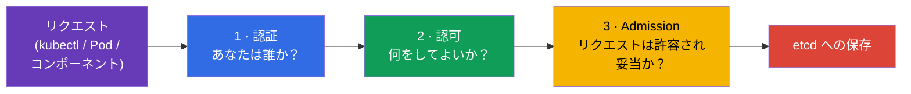
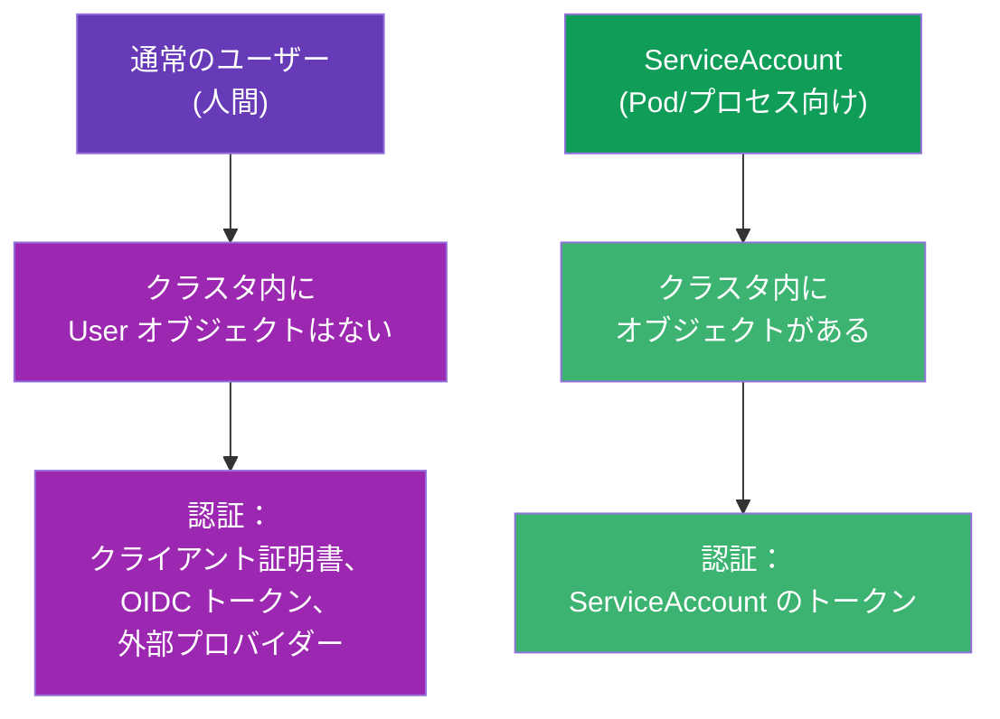
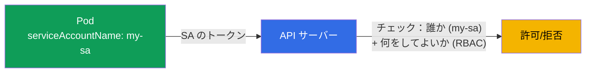
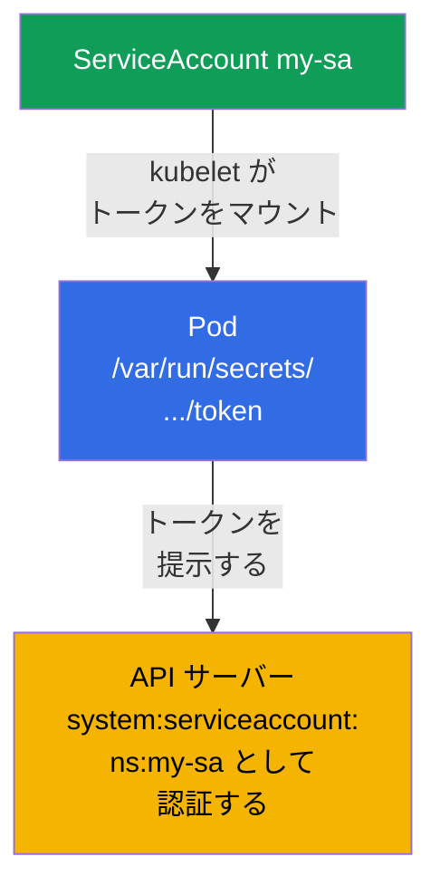
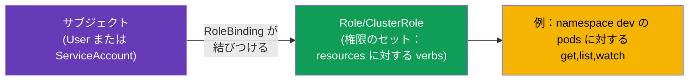
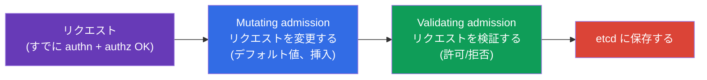
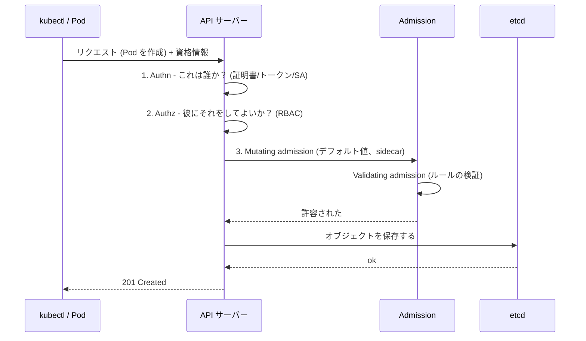

[Русская версия](ru.md) · [Eng version](README.md) · [Versión en español](es.md) · [Version française](fr.md) · [Deutsche Version](de.md) · [ქართული ვერსია](ge.md) · [繁體中文版](tw.md)

# 第 21 章。ServiceAccount；認証、認可、admission

> **次は何か。** パート 3 を締めくくります。すべてのリクエストは API サーバーを
> 通る（第 2 章）と何度も言ってきました。ここでは、API サーバーが 1 つ 1 つの
> リクエストに対して何をするのかを分解します：あなたが **誰か**（認証）、**何を
> してよいか**（認可）、そして **リクエスト自体が許されるか**（admission）を
> チェックします。それとは別に **ServiceAccount** - Pod 自身が API へアクセスする
> ときの身元です。これはパート 3 の概観の章です（RBAC はより深く第 38 章で扱います）。
> テーマは両方の試験の Security 領域です。

## 21.1. API サーバーの入口にある 3 つの関門

API サーバーへの各リクエストは、3 つの段階を順番に通過します。どれか 1 つでも通らな
ければ、リクエストは拒否されます。



| 段階 | 問い | 答えるもの |
|------|--------|----------|
| 認証 (authn) | あなたは誰か？ | 証明書、トークン、ServiceAccount |
| 認可 (authz) | 何を許されているか？ | RBAC（第 38 章） |
| Admission control | そのリクエストはそもそも許容されるか？補完/検証するか？ | admission コントローラー |

## 21.2. 認証：誰がアクセスしているのか

Kubernetes は 2 種類の「ユーザー」を区別します：



- **通常のユーザー（人間）** - Kubernetes には「User」というオブジェクトは **ありません**。
  人間は外部の手段で認証されます：クライアント TLS 証明書（第 39 章）、OIDC トークン、
  外部プロバイダーとの統合です。Kubernetes は証明書/トークンに書かれた名前を信頼する
  だけです。
- **ServiceAccount** - クラスタ内部のアプリケーションやプロセス向けです。これは
  namespace の中に存在する **本物の** Kubernetes オブジェクトです。

## 21.3. ServiceAccount：Pod のための身元

Pod が API サーバーへアクセスしたいとき（たとえばオペレーターがオブジェクトを読む、
アプリケーションがリソースを作成する）、それは **ServiceAccount** の名前で行われます。
どの Pod も必ず何らかの ServiceAccount のもとで動きます - 指定しなければ、その
namespace の `default` が使われます。



```bash
# ServiceAccount を作成する
kubectl create serviceaccount my-sa

# 確認する
kubectl get sa
```

Pod への割り当て：

```yaml
spec:
  serviceAccountName: my-sa
  containers:
  - name: app
    image: myapp
```

## 21.4. ServiceAccount のトークンはどうやって Pod に届くのか

アプリケーションが API サーバーにトークンを提示できるように、Kubernetes は
ServiceAccount のトークンを Pod に自動でマウントします。最近のバージョン
（projected token、BoundServiceAccountTokenVolume、1.22 で GA）では、トークンは
短命で、対象（audience）に紐づけられ、自動的にローテーションされます - 昔の
「永久」トークンとは違います。

> **何が変わったか（現行クラスタで重要）。** Pod へのトークンの自動マウントは
> **デフォルトで** 有効で、なくなっていません。ただし **Kubernetes 1.24** から、
> ServiceAccount ごとにトークン入りの **長命な Secret** が自動生成されることは
> なくなりました：Pod は Secret からの「永久」トークンではなく、短命な projected
> トークンを受け取ります。それでも長命なトークンが必要な場合（たとえば外部システム
> 向け）は、明示的に作ります - `kubectl create token <sa>`（短命、TokenRequest API
> 経由）か、アノテーション `kubernetes.io/service-account.name` を付けた個別の Secret
> です。マウント自体を無効にするには `automountServiceAccountToken: false` を使います
> （下記参照）。

```
/var/run/secrets/kubernetes.io/serviceaccount/
├── token       # API での認証用トークン
├── ca.crt      # クラスタ CA の証明書
└── namespace   # Pod の namespace
```



Pod が API へのアクセスを **必要としない** 場合（普通のアプリケーションはたいてい
必要としません）、トークンの自動マウントは無効にする価値があります - これは良い
セキュリティのプラクティスです：

```yaml
spec:
  automountServiceAccountToken: false
```

こうすれば Pod は、侵害されたら API へのアクセスを与えてしまう余計なトークンを
持ち歩かなくなります。

## 21.5. 認可：何が許されているか (RBAC)

認証は「あなたは誰か」に答えました。次に認可が「何をしてよいか」を決めます。主要な
仕組みは **RBAC (Role-Based Access Control)** です。考え方はこうです：権限は
Role/ClusterRole に記述され（何ができるか）、RoleBinding/ClusterRoleBinding を通じて
サブジェクト（ユーザーまたは ServiceAccount）に紐づけられます。



構造全体を読み解かずに自分の権限をすばやく確認する方法：

```bash
kubectl auth can-i create pods
kubectl auth can-i delete nodes
kubectl auth can-i get pods --as=system:serviceaccount:dev:my-sa -n dev
```

`kubectl auth can-i` は試験でも実務でも欠かせないツールです：「できる/できない」を
そのまま答えてくれます。RBAC の全体（Role、ClusterRole、binding、verbs、resources）は
第 38 章で分解します。

### ケース：ユーザーに namespace dev への完全なアクセスを与える

よくある課題：人（Pod ではなくユーザー）に **1 つの namespace** `dev` **の中の
すべてのオブジェクトへの完全なアクセス** を与え、ほかでは何も許さないことです。
2 ステップで解決します：**ユーザーの身元** を作り、RBAC で **それに権限を紐づける**
ことです。忘れずに：Kubernetes に `User` オブジェクトはありません - 身元は証明書
（または OIDC）で証明され、RBAC はその名前を扱うだけです。

**ステップ 1. クライアント証明書による身元。** ユーザー `dev-user` は API サーバーへ、
`CN` = ユーザー名となっているクライアント TLS 証明書を提示します。鍵と CSR を生成し、
組み込みの CertificateSigningRequest で署名します：

```bash
# 鍵と証明書要求 (CN がユーザー名になる)
openssl genrsa -out dev-user.key 2048
openssl req -new -key dev-user.key -out dev-user.csr -subj "/CN=dev-user"

# CSR をクラスタへ送る (request は .csr の base64)
cat <<EOF | kubectl apply -f -
apiVersion: certificates.k8s.io/v1
kind: CertificateSigningRequest
metadata:
  name: dev-user
spec:
  request: $(base64 -w0 dev-user.csr)
  signerName: kubernetes.io/kube-apiserver-client
  usages: ["client auth"]
EOF

kubectl certificate approve dev-user                         # 管理者が承認する
kubectl get csr dev-user -o jsonpath='{.status.certificate}' | base64 -d > dev-user.crt
```

続いて、ユーザー用の kubeconfig コンテキストを作ります（証明書 + クラスタ CA）：

```bash
kubectl config set-credentials dev-user \
  --client-certificate=dev-user.crt --client-key=dev-user.key --embed-certs=true
kubectl config set-context dev-user --cluster=<クラスタ名> --user=dev-user --namespace=dev
```

**ステップ 2. 権限：namespace dev の Role + RoleBinding。** namespace 内の
「すべてのオブジェクトへの完全なアクセス」とは、API グループ、リソース、動詞すべてに
`*` を指定した Role です。権限を `dev` の枠に限定するのは、ClusterRole ではなく
まさに **Role**（namespaced）です：

```yaml
apiVersion: rbac.authorization.k8s.io/v1
kind: Role
metadata:
  namespace: dev
  name: dev-admin
rules:
- apiGroups: ["*"]        # すべての API グループ
  resources: ["*"]        # すべてのリソース (pods, deployments, services, ...)
  verbs: ["*"]            # すべての操作 (get, list, create, update, delete, ...)
---
apiVersion: rbac.authorization.k8s.io/v1
kind: RoleBinding
metadata:
  namespace: dev
  name: dev-user-admin
subjects:
- kind: User
  name: dev-user          # 証明書にあったあの CN
  apiGroup: rbac.authorization.k8s.io
roleRef:
  kind: Role
  name: dev-admin
  apiGroup: rbac.authorization.k8s.io
```

**確認：**

```bash
kubectl auth can-i '*' '*' -n dev --as=dev-user      # yes - dev では完全なアクセス
kubectl auth can-i get pods -n prod --as=dev-user    # no  - 他の namespace には権限がない
```

結果：ユーザーは `dev` に限って完全なアクセスを得ました。重要な点は、権限がクラスタ
全体へ「にじみ出さない」ように **ClusterRole ではなく Role（namespaced）** を使うこと、
そして **RoleBinding をまさに `dev` に** 置くことです。すべての namespace での
アクセスが必要なら ClusterRole + ClusterRoleBinding を使います。同じ権限セットを
いくつかの特定の namespace で使うなら、ClusterRole を 1 度だけ記述して、必要な各
namespace で RoleBinding によって紐づけるのが便利です。

**ユーザーの一覧を得る方法。** `kubectl get users` というコマンドは **存在しません** -
User は Kubernetes のオブジェクトではなく、クラスタに人間の登録簿はありません。
「一覧」は間接的に、誰に何が発行されたかを読み解いて得ます - RBAC の紐づけの
サブジェクトと、発行された証明書から：

```bash
# RoleBinding と ClusterRoleBinding にあるすべての User サブジェクト
kubectl get rolebindings,clusterrolebindings -A \
  -o jsonpath='{range .items[*]}{range .subjects[?(@.kind=="User")]}{.name}{"\n"}{end}{end}' | sort -u

# 誰がいつクライアント証明書 (身元) を受け取ったか
kubectl get csr

# あなたの kubeconfig に書かれているユーザー (ローカル、クラスタ内ではない)
kubectl config get-users
```

**作成したユーザーを削除する方法。** User というオブジェクト自体がないので、ユーザーの
「削除」とは **その権限の取り消し** です：

```bash
# 1. 権限を外す - 紐づけを削除する (専用に作った Role も、彼だけのものなら削除)
kubectl delete rolebinding dev-user-admin -n dev
kubectl delete role dev-admin -n dev            # Role を彼のために作っていた場合

# 2. kubeconfig からアカウントを消す (ローカル)
kubectl config delete-user dev-user
kubectl config delete-context dev-user

# 3. 見た目を整えるため - CSR オブジェクトを削除する
kubectl delete csr dev-user
```

> **証明書についての重要な点。** バニラな Kubernetes には、クライアント証明書の
> **取り消し (CRL) がありません**：有効期限が切れるまで、その証明書は認証を通り
> つづけます。紐づけを削除したあとも、そのユーザーは「ログイン」できますが、権限は
> ありません（グループ `system:authenticated` が与えるものを除いて）。そのため実際に
> アクセスを取り消すには、**短命な** 証明書か、アカウントを中央で無効化できる外部の
> IdP (OIDC) に頼ります。有効期限より前に証明書が漏えいした場合は、CA を交換/再発行
> します（重い作業です）。

> **マネージドクラスタではどうなのか（AWS EKS を例に）。** そこでは証明書と CSR は
> 通常使いません - 身元は **IAM** から取り、Kubernetes はそれを自分のユーザー/
> グループに対応づけるだけです。仕組みはこうです：
>
> - **認証は IAM を通して。** `aws eks update-kubeconfig` が作る kubeconfig には
>   exec プラグインが入っており、それが `aws eks get-token` を呼び出して、IAM の身元
>   （ロールまたはユーザー）を証明するトークンを API サーバーへ提示します。人間は
>   自分のパスワードや証明書を持たず、その AWS アカウントでログインします。
> - **IAM → Kubernetes の対応づけ。** 以前はこれを `kube-system` の ConfigMap
>   `aws-auth` で行っていました（`mapUsers`/`mapRoles` のセクション：IAM ARN →
>   k8s の名前とグループ）。今はネイティブな仕組み **EKS Access Entries** が
>   推奨されます：
>
>   ```bash
>   # IAM ロールをクラスタ内の身元に結びつけ、RBAC 用のグループを割り当てる
>   aws eks create-access-entry --cluster-name demo \
>     --principal-arn arn:aws:iam::111122223333:role/dev-team \
>     --kubernetes-groups dev-admins
>   ```
> - **権限はやはり同じ RBAC。** そのあとはグループ (`dev-admins`) に、必要な
>   namespace で Role/RoleBinding を与えます - 上のケースとまったく同じです。あるいは
>   EKS のマネージドな access policy を付けます (`aws eks associate-access-policy`、
>   たとえば namespace 制限付きの `AmazonEKSAdminPolicy`) - これは同じ RBAC 権限の
>   「ラッパー」です。
>
> 結果：EKS における「ユーザーの作成」= **IAM プリンシパル** の作成/選択 + その
> （access entry か `aws-auth` による）k8s グループへの対応づけであり、クラスタ内部の
> 権限は依然として RBAC が決めます。GKE (Google IAM) と AKS (Entra ID) も同様の
> 構造です。アクセスの取り消しはそこでは中央で行われます - access entry / IAM 権限を
> 外すだけで、CRL に手を焼く必要はありません。

RBAC の詳細は第 38 章で。

## 21.6. Admission control：最後の関門

認証と認可のあと、リクエストは **admission コントローラー** - それを変更したり拒否
したりできるプラグイン - を通ります。2 種類あります：



- **Mutating** - 保存の前にオブジェクトを変更します：デフォルト値を補い、sidecar を
  注入し（service mesh でのプロキシ注入はこう動きます）、labels を付けます。
- **Validating** - 検証し、オブジェクトがルールに違反していれば拒否します。

すでに暗黙のうちに出会っていた、組み込みの admission コントローラーの例：

| コントローラー | 何をするか |
|-----------|-----------|
| `LimitRanger` | LimitRange を適用する（第 14 章） |
| `ResourceQuota` | ResourceQuota を検証する（第 14 章） |
| `PodSecurity` | Pod Security Admission を適用する（第 20 章） |
| `ServiceAccount` | ServiceAccount を補い、トークンをマウントする |
| `NamespaceLifecycle` | 削除中の namespace にオブジェクトを作らせない |

独自のルールは **webhook**（ValidatingWebhookConfiguration、
MutatingWebhookConfiguration）で追加します - Kyverno、OPA/Gatekeeper、cert-manager、
sidecar の注入はこう動きます。これで、Pod に sidecar コンテナやデフォルト値が
「勝手に現れる」理由が説明できます。

admission のパイプラインの重要な細部（試験で問われます）：

- **順番は厳密です：** まず **すべての mutating**、次にスキーマの再検証、そして
  **すべての validating** です。だから validating は、mutating のすべての変更を
  適用したあとのオブジェクトを見ます。
- **webhook の failurePolicy** (`Fail`/`Ignore`) は、あなたの webhook サーバーが
  到達不能なときに何をするかを決めます。`Fail`（デフォルト）はより安全ですが
  （通してしまわない）、**`Fail` で落ちた webhook はクラスタでのオブジェクト作成を
  ブロックしかねません** - 「何も作れない」というインシデントのよくある原因です。
  `Ignore` は厳格さより可用性を優先します。
- **PodSecurityPolicy (PSP) は削除されました** 1.25 で。代わりに組み込みの
  **Pod Security Admission**（第 20 章）か、外部のエンジン（webhook 経由の
  Kyverno/Gatekeeper）が来ました。
- 有効な admission プラグインの一覧は apiserver のフラグ
  `--enable-admission-plugins` で指定します（マニフェスト
  `/etc/kubernetes/manifests/kube-apiserver.yaml` の中）。

## 21.7. 全体像：リクエストの経路

すべてをまとめましょう - これは頭に入れておくと役立つ地図です。



どの関門でもリクエストを拒否できます：名乗った本人でない (authn) → 401、権限がない
(authz) → 403、ポリシーに違反する (admission) → 理由付きの拒否です。この連鎖を
理解することが、「なぜ自分/Pod が拒否されたのか」を読み解く鍵です。

## 21.8. 本番環境でこれをどう使うか

- **アプリケーションごとに個別の ServiceAccount。** 本番ではワークロードに `default`
  SA を使いません - 各アプリケーションに最小限の権限 (RBAC) を持つ独自の
  ServiceAccount を作ります。これは Pod が侵害されたときの被害を限定します。
- **トークン自動マウントの無効化。** API へのアクセスが不要なアプリケーション
  （大多数）には `automountServiceAccountToken: false` を設定します - 余計な
  アクセス鍵を持ち歩かせないためです。
- **IRSA / Workload Identity。** クラウドでは ServiceAccount をクラウドのロール
  (AWS IRSA、GCP Workload Identity) に結びつけ、Pod が静的な鍵なしで - SA の身元に
  よって - クラウドのサービス (S3、キュー) へアクセスできるようにします。
- **番人としての admission ポリシー。** Kyverno/OPA Gatekeeper は validating webhook
  でルールを enforce します：privileged の禁止、必須のラベル/リミット、許可された
  イメージレジストリです。これは安全でない、あるいは規約に合わないオブジェクトを
  クラスタに入れない方法です。
- **Mutating による注入。** Service mesh (Istio) やシークレット注入ツール
  (Vault Agent) は mutating webhook で動きます - マニフェストを変えずに sidecar や
  シークレットを自動で Pod に追加します。

## 21.9. ミニ用語集

- **認証 (authn)** - リクエストの送信者が誰かを確定すること。
- **認可 (authz)** - 送信者に許されているかの検証 (RBAC)。
- **Admission control** - authn+authz のあとのリクエストの検証/変更。
- **Mutating / Validating admission** - 変更する / 検証するコントローラー。
- **ServiceAccount** - API へアクセスするための Pod/プロセスの身元。
- **default SA** - 各 namespace にあるデフォルトの ServiceAccount。
- **automountServiceAccountToken** - SA のトークンを Pod にマウントするかどうか。
- **RBAC** - ロールに基づくアクセス制御（第 38 章）。
- **webhook (admission)** - オブジェクトの外部での検証/変更 (Kyverno、OPA、mesh)。

## 21.10. 本章のまとめ

- API への各リクエストは 3 つの関門を通ります：認証（誰か）、認可（何をしてよいか、
  RBAC）、admission（許容されるか、および変更）。
- 人間は外部で認証されます（証明書、OIDC）- Kubernetes に User オブジェクトはありません。
  Pod は ServiceAccount で認証されます（namespace の中の実在するオブジェクト）。
- どの Pod も ServiceAccount のもとで動きます（デフォルトは `default`）。トークンは
  Pod に自動でマウントされますが、必要がなければ無効にするほうがよいです。
- 認可は RBAC が行います。権限のすばやい確認は `kubectl auth can-i` です。
- admission コントローラーには mutating（オブジェクトを変更：デフォルト値、sidecar）と
  validating（ルールに従って拒否）があります。カスタムなものは webhook 経由です
  (Kyverno、OPA、mesh)。
- authn → authz → admission の連鎖の理解が、拒否 (401/403/ポリシー) を読み解く鍵です。

## 21.11. これがどう役に立つか：試験と実際の仕事で

**試験では。** 「ServiceAccount を作って Pod に割り当てよ」「SA が X をできるか確認せよ」
(`kubectl auth can-i --as`)、リクエストがなぜ拒否されたのか (authn/authz/admission) の
理解は、Security 領域のよくある課題です。これは Role と binding の課題が出る第 38 章
(RBAC) の土台です。

**実際の仕事では。** 各アプリケーションに最小限の権限を持つ個別の ServiceAccount は、
セキュリティの基本的な衛生です。余計なトークンの無効化、SA とクラウドのロールの
結びつけ (IRSA)、admission ポリシー (Kyverno)、mutating による注入 (mesh) - これらは
すべて、クラスタを安全かつ管理された状態で運用するための日々の道具です。

## 21.12. 自己チェックの質問

1. API サーバーへのリクエストはどの 3 つの関門を通り、それぞれはどの問いに答えますか？
2. 通常のユーザーの認証は ServiceAccount とどう違いますか？なぜ User オブジェクトが
   ないのですか？
3. 明示的に指定しない場合、Pod はどの ServiceAccount のもとで動きますか？そのトークンは
   どこにありますか？
4. `automountServiceAccountToken` は何のために、いつ無効にしますか？
5. サブジェクトに操作が許されているかを、すばやく確認する方法は？
6. mutating admission は validating とどう違いますか？それぞれの例を挙げてください。
7. admission webhook を通して、sidecar やデフォルト値はどうやって Pod に「勝手に」
   入るのですか？

## 演習

これでパート 3（設定とセキュリティ）は完了です。次は - CKAD 固有のパート 4：
アプリケーションの設計と構築で、multi-container パターン（第 22 章）から始まります。
ServiceAccount と権限の確認はセキュリティのラボで練習します。深い RBAC は第 38 章で
待っています。

🧪 ラボ 113 (ServiceAccount、RBAC と CSR)：[tasks/cka/labs/113](../../labs/113/README_JP.MD)

🧪 ラボ 121 (RBAC ドリル：SA、Role/ClusterRole、binding)：[tasks/cka/labs/121](../../labs/121/README_JP.MD)

---
[目次](../README_JP.md) · [第 20 章](../20/jp.md) · [第 22 章](../22/jp.md)
