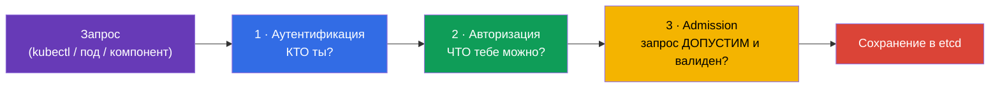
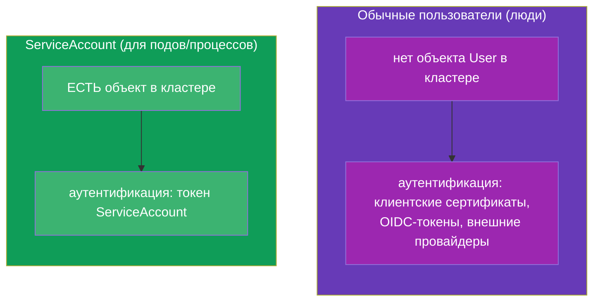
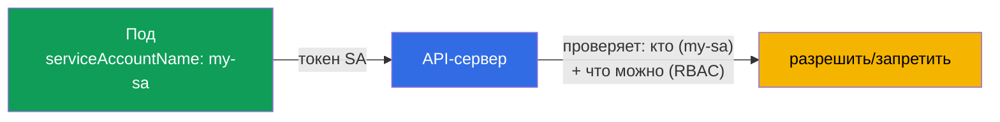
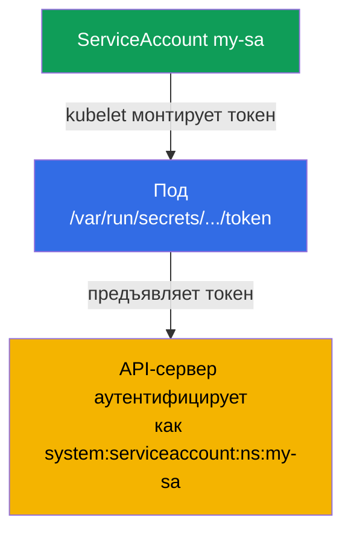
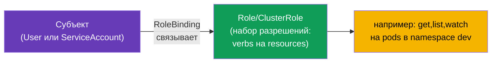
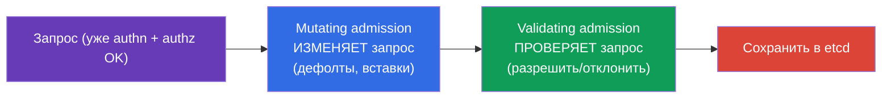
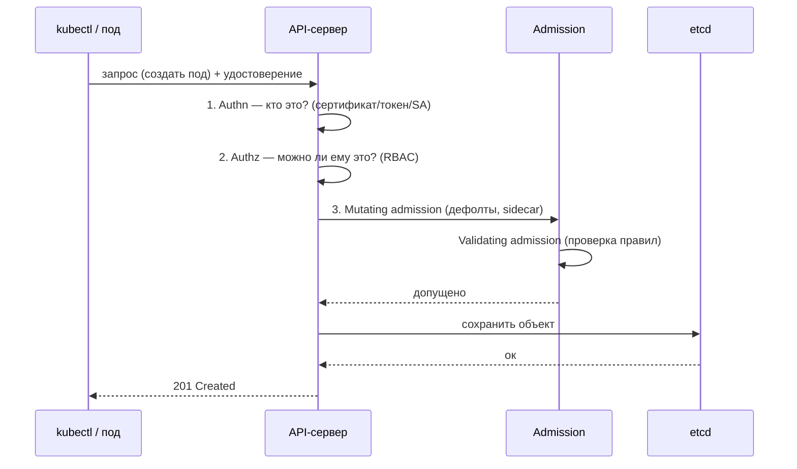

# Глава 21. ServiceAccount; аутентификация, авторизация, admission

> **Что дальше.** Завершаем часть 3. Мы много раз говорили, что все запросы идут через
> API-сервер (глава 2). Теперь разберём, что API-сервер делает с каждым запросом:
> проверяет, **кто** вы (аутентификация), **что вам можно** (авторизация) и **допустим ли
> сам запрос** (admission). Отдельно - **ServiceAccount**: идентичность, под которой к API
> обращаются сами поды. Это обзорная глава для части 3 (глубже RBAC пойдёт в главе 38).
> Тема - домен Security обоих экзаменов.

## 21.1. Три барьера на входе в API-сервер

Каждый запрос к API-серверу проходит три этапа по очереди. Не прошёл любой - запрос
отклонён.



| Этап | Вопрос | Отвечает |
|------|--------|----------|
| Аутентификация (authn) | Кто ты? | сертификаты, токены, ServiceAccount |
| Авторизация (authz) | Что тебе разрешено? | RBAC (глава 38) |
| Admission control | Запрос вообще допустим? Дополнить/проверить? | admission-контроллеры |

## 21.2. Аутентификация: кто обращается

Kubernetes различает два вида «пользователей»:



- **Обычные пользователи (люди)** - у Kubernetes **нет** объекта «User». Люди
  аутентифицируются внешними средствами: клиентскими TLS-сертификатами (глава 39),
  OIDC-токенами, интеграцией с внешними провайдерами. Kubernetes лишь доверяет имени из
  сертификата/токена.
- **ServiceAccount** - для приложений и процессов внутри кластера. Это **настоящий
  объект** Kubernetes, живущий в namespace.

## 21.3. ServiceAccount: идентичность для подов

Когда под хочет обратиться к API-серверу (например, оператор читает объекты, или
приложение создаёт ресурсы), он делает это от имени **ServiceAccount**. Каждый под всегда
работает под каким-то ServiceAccount - если не указать, используется `default` из его
namespace.



```bash
# Создать ServiceAccount
kubectl create serviceaccount my-sa

# Посмотреть
kubectl get sa
```

Привязка к поду:

```yaml
spec:
  serviceAccountName: my-sa
  containers:
  - name: app
    image: myapp
```

## 21.4. Как токен ServiceAccount попадает в под

Kubernetes автоматически монтирует под токен ServiceAccount, чтобы приложение могло
предъявить его API-серверу. В современных версиях (проецируемые токены) токен
краткоживущий и автоматически ротируется.

```
/var/run/secrets/kubernetes.io/serviceaccount/
├── token       # токен для аутентификации в API
├── ca.crt      # сертификат CA кластера
└── namespace   # namespace пода
```



Если поду **не нужен** доступ к API (обычному приложению чаще всего не нужен),
автомонтирование токена стоит отключить - это хорошая практика безопасности:

```yaml
spec:
  automountServiceAccountToken: false
```

Так под не таскает с собой лишний токен, который в случае компрометации дал бы доступ к
API.

## 21.5. Авторизация: что разрешено (RBAC)

Аутентификация ответила «кто ты». Дальше авторизация решает «что тебе можно». Основной
механизм - **RBAC (Role-Based Access Control)**. Идея: права описываются в Role/ClusterRole
(что можно делать), а привязываются к субъекту (пользователю или ServiceAccount) через
RoleBinding/ClusterRoleBinding.



Быстрая проверка своих прав - без разбора всей структуры:

```bash
kubectl auth can-i create pods
kubectl auth can-i delete nodes
kubectl auth can-i get pods --as=system:serviceaccount:dev:my-sa -n dev
```

`kubectl auth can-i` - незаменимый инструмент и на экзамене, и в жизни: он прямо отвечает
«можно/нельзя». Полностью RBAC (Role, ClusterRole, binding'и, verbs, resources) разберём
в главе 38.

## 21.6. Admission control: последний барьер

После аутентификации и авторизации запрос проходит через **admission-контроллеры** -
плагины, которые могут его изменить или отклонить. Их два вида:



- **Mutating** - меняют объект перед сохранением: подставляют значения по умолчанию,
  внедряют sidecar (так работает инъекция прокси в service mesh), проставляют labels.
- **Validating** - проверяют и отклоняют, если объект нарушает правила.

Примеры встроенных admission-контроллеров, которые вы уже встречали неявно:

| Контроллер | Что делает |
|-----------|-----------|
| `LimitRanger` | применяет LimitRange (глава 14) |
| `ResourceQuota` | проверяет ResourceQuota (глава 14) |
| `PodSecurity` | применяет Pod Security Admission (глава 20) |
| `ServiceAccount` | подставляет ServiceAccount и монтирует токен |
| `NamespaceLifecycle` | не даёт создавать объекты в удаляемом namespace |

Свои правила добавляют через **webhook'и** (ValidatingWebhookConfiguration,
MutatingWebhookConfiguration) - так работают Kyverno, OPA/Gatekeeper, cert-manager,
инъекция sidecar. Это объясняет, откуда в поде «сами появляются» sidecar-контейнеры или
дефолтные значения.

Важные детали конвейера admission (их спрашивают):

- **Порядок строгий:** сначала **все mutating**, затем повторная проверка схемы, затем
  **все validating**. Поэтому validating видит объект уже после всех изменений mutating.
- **failurePolicy webhook'а** (`Fail`/`Ignore`) решает, что делать, если ваш webhook-сервер
  недоступен. `Fail` (по умолчанию) безопаснее (не пропустит), но **упавший webhook с
  `Fail` может заблокировать создание объектов** в кластере - частая причина инцидента
  «ничего не создаётся». `Ignore` - доступность важнее строгости.
- **PodSecurityPolicy (PSP) удалён** в 1.25; на смену пришёл встроенный **Pod Security
  Admission** (глава 20) либо внешние движки (Kyverno/Gatekeeper через webhook).
- Список включённых admission-плагинов задаётся флагом apiserver
  `--enable-admission-plugins` (в манифесте `/etc/kubernetes/manifests/kube-apiserver.yaml`).

## 21.7. Полная картина: путь запроса

Соберём всё вместе - это карта, которую полезно держать в голове.



Любой из барьеров может отклонить запрос: не тот, кто говорит (authn) → 401; нет прав
(authz) → 403; нарушает политику (admission) → отказ с причиной. Понимание этой цепочки -
ключ к разбору «почему мне/поду отказано».

## 21.8. Как это применяют в продакшене

- **Отдельный ServiceAccount на приложение.** В проде не используют `default` SA для
  рабочих нагрузок - каждому приложению создают свой ServiceAccount с минимальными правами
  (RBAC). Это ограничивает ущерб при компрометации пода.
- **Отключение автомонтирования токена.** Приложениям, которым не нужен доступ к API
  (большинство), ставят `automountServiceAccountToken: false` - чтобы не носить лишний
  ключ доступа.
- **IRSA / Workload Identity.** В облаке ServiceAccount связывают с облачными ролями
  (AWS IRSA, GCP Workload Identity), чтобы под получал доступ к облачным сервисам (S3,
  очереди) без статичных ключей - по идентичности SA.
- **Admission-политики как страж.** Kyverno/OPA Gatekeeper через validating-webhook'и
  enforce'ят правила: запрет privileged, обязательные метки/лимиты, разрешённые реестры
  образов. Это способ не пускать в кластер небезопасные или несоответствующие объекты.
- **Mutating-инъекция.** Service mesh (Istio) и секрет-инъекторы (Vault Agent) работают
  через mutating-webhook - автоматически добавляют sidecar/секреты в поды, не меняя их
  манифесты.

## 21.9. Мини-глоссарий

- **Аутентификация (authn)** - установление, кто отправитель запроса.
- **Авторизация (authz)** - проверка, что отправителю разрешено (RBAC).
- **Admission control** - проверка/изменение запроса после authn+authz.
- **Mutating / Validating admission** - изменяющие / проверяющие контроллеры.
- **ServiceAccount** - идентичность пода/процесса для доступа к API.
- **default SA** - ServiceAccount по умолчанию в каждом namespace.
- **automountServiceAccountToken** - монтировать ли токен SA в под.
- **RBAC** - управление доступом на основе ролей (глава 38).
- **webhook (admission)** - внешняя проверка/изменение объектов (Kyverno, OPA, mesh).

## 21.10. Итоги главы

- Каждый запрос к API проходит три барьера: аутентификация (кто), авторизация (что
  можно, RBAC), admission (допустимость и изменение).
- Люди аутентифицируются внешне (сертификаты, OIDC) - объекта User в Kubernetes нет;
  поды - через ServiceAccount (реальный объект в namespace).
- Каждый под работает под ServiceAccount (по умолчанию `default`); токен монтируется в
  под автоматически, но при отсутствии нужды его лучше отключить.
- Авторизацию делает RBAC; быстрая проверка прав - `kubectl auth can-i`.
- Admission-контроллеры бывают mutating (меняют объект: дефолты, sidecar) и validating
  (отклоняют по правилам); кастомные - через webhook'и (Kyverno, OPA, mesh).
- Понимание цепочки authn → authz → admission - ключ к разбору отказов (401/403/политика).

## 21.11. Как это пригодится: на экзамене и в реальной работе

**На экзамене.** «Создай ServiceAccount и назначь поду», «проверь, может ли SA делать X»
(`kubectl auth can-i --as`), понимание, почему запрос отклонён (authn/authz/admission) -
частые задания домена Security. Это фундамент для главы 38 (RBAC), где задания про Role и
binding'и.

**В реальной работе.** Отдельный ServiceAccount с минимальными правами на каждое
приложение - базовая гигиена безопасности. Отключение лишних токенов, связка SA с
облачными ролями (IRSA), admission-политики (Kyverno) и mutating-инъекция (mesh) - всё
это ежедневные инструменты безопасной и управляемой эксплуатации кластера.

## 21.12. Вопросы для самопроверки

1. Какие три барьера проходит запрос к API-серверу и на какой вопрос отвечает каждый?
2. Чем аутентификация обычных пользователей отличается от ServiceAccount? Почему нет
   объекта User?
3. Под каким ServiceAccount работает под, если явно не указать? Где лежит его токен?
4. Зачем и когда отключают `automountServiceAccountToken`?
5. Как быстро проверить, разрешено ли субъекту действие?
6. Чем mutating admission отличается от validating? Приведите примеры каждого.
7. Как через admission-webhook'и в под «сами» попадают sidecar или дефолтные значения?

## Практика

На этом часть 3 (конфигурация и безопасность) завершена. Дальше - часть 4, специфичная
для CKAD: дизайн и сборка приложений, начиная с multi-container паттернов (глава 22).
ServiceAccount и проверка прав отрабатываются в лабах по безопасности; глубокий RBAC ждёт
в главе 38.

🧪 Лаба 121 (RBAC-дриллы: SA, Role/ClusterRole, binding'и): [tasks/cka/labs/121](../../labs/121/README_RU.MD)

---
[Оглавление](../README_RU.md) · [Глава 20](../20/ru.md) · [Глава 22](../22/ru.md)
