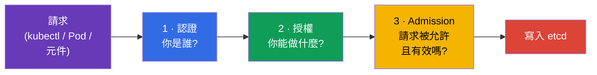
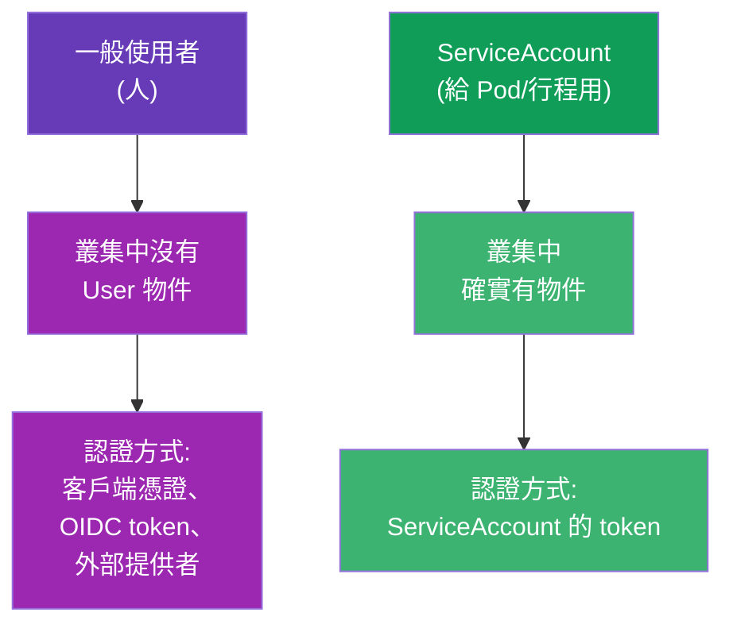
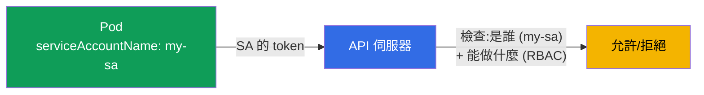
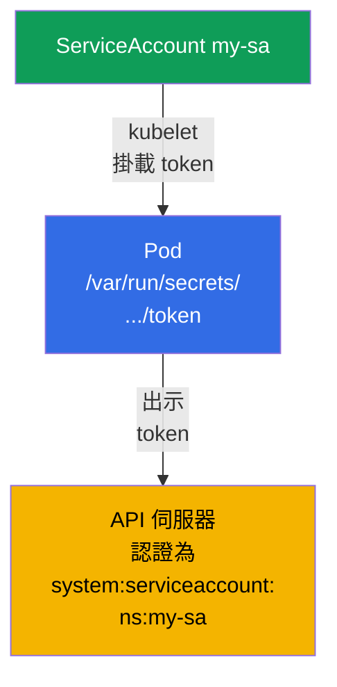
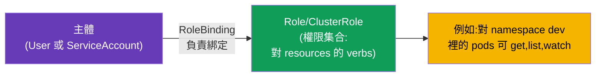
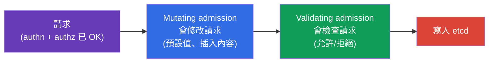
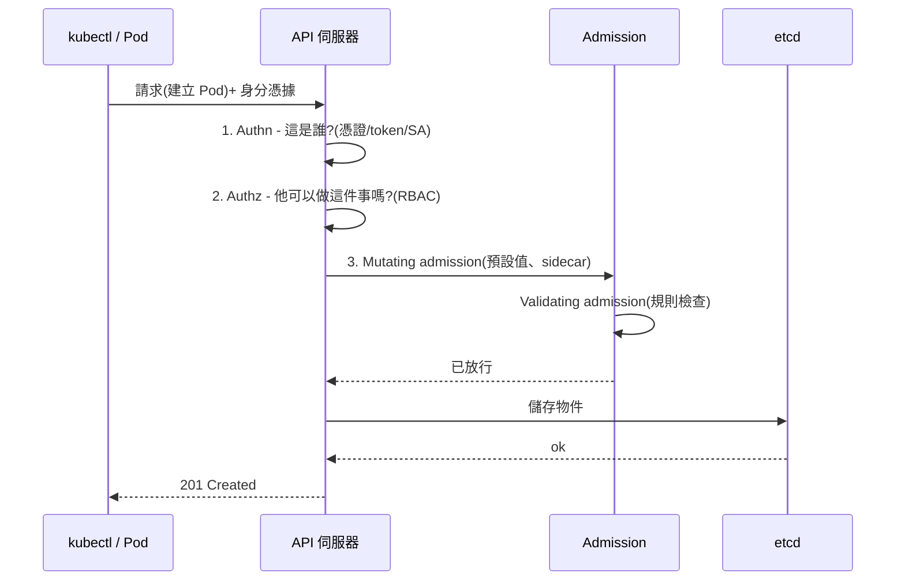

[Русская версия](ru.md) · [Eng version](README.md) · [Versión en español](es.md) · [Version française](fr.md) · [Deutsche Version](de.md) · [ქართული ვერსია](ge.md) · [日本語版](jp.md)

# 第 21 章。ServiceAccount;認證、授權與 admission

> **接下來是什麼。** 我們要收尾第 3 部分。我們已經說過很多次,所有請求都會經過
> API 伺服器(第 2 章)。現在來看看 API 伺服器對每個請求做了什麼:檢查你**是誰**
> (認證)、**你能做什麼**(授權),以及**這個請求本身是否被允許**(admission)。
> 另外單獨講 **ServiceAccount** - Pod 自己存取 API 時使用的身分。這是第 3 部分的
> 概覽章節(RBAC 會在第 38 章更深入)。這個主題屬於兩場考試的 Security 領域。

## 21.1. 進入 API 伺服器的三道關卡

每個送到 API 伺服器的請求都會依序經過三個階段。任何一個沒通過 - 請求就被拒絕。



| 階段 | 問題 | 由什麼回答 |
|------|--------|----------|
| 認證 (authn) | 你是誰? | 憑證、token、ServiceAccount |
| 授權 (authz) | 允許你做什麼? | RBAC(第 38 章) |
| Admission control | 這個請求到底允許嗎?要補全/檢查嗎? | admission 控制器 |

## 21.2. 認證:是誰在存取

Kubernetes 區分兩種「使用者」:



- **一般使用者(人)** - Kubernetes **沒有**「User」這種物件。人是透過外部手段完成
  認證的:客戶端 TLS 憑證(第 39 章)、OIDC token、與外部提供者整合。Kubernetes 只是
  信任憑證/token 裡的那個名字。
- **ServiceAccount** - 給叢集內的應用程式與行程使用。它是**真正的** Kubernetes
  物件,存在於某個 namespace 裡。

## 21.3. ServiceAccount:Pod 的身分

當 Pod 想要存取 API 伺服器時(例如 operator 讀取物件,或應用程式建立資源),它是以
**ServiceAccount** 的身分去做的。每個 Pod 一定都跑在某個 ServiceAccount 之下 - 若沒
指定,就會用它所在 namespace 裡的 `default`。



```bash
# 建立 ServiceAccount
kubectl create serviceaccount my-sa

# 查看
kubectl get sa
```

綁定到 Pod:

```yaml
spec:
  serviceAccountName: my-sa
  containers:
  - name: app
    image: myapp
```

## 21.4. ServiceAccount 的 token 如何進到 Pod 裡

Kubernetes 會自動把 ServiceAccount 的 token 掛載進 Pod,讓應用程式能把它出示給 API
伺服器。在現代版本中(投射式 token、BoundServiceAccountTokenVolume,自 1.22 起 GA),
token 是短生命週期的、綁定受眾 (audience) 並會自動輪替 - 和過去那種「永久」token
不同。

> **有什麼變化(對現行叢集很重要)。** 把 token 自動掛載進 Pod 這件事是**預設開啟**
> 的,而且並沒有消失。但從 **Kubernetes 1.24** 起,不再自動為每個 ServiceAccount
> 建立帶 token 的**長生命週期 Secret**:Pod 拿到的是短生命週期的投射式 token,而不
> 是 Secret 裡那種「永久」token。如果真的需要長生命週期的 token(例如給外部系統),
> 就要明確地建立 - `kubectl create token <sa>`(短期的,走 TokenRequest API)或用一
> 個帶 `kubernetes.io/service-account.name` 註解的獨立 Secret。至於掛載本身,可以用
> `automountServiceAccountToken: false` 這個開關關掉(見下文)。

```
/var/run/secrets/kubernetes.io/serviceaccount/
├── token       # 用來在 API 中認證的 token
├── ca.crt      # 叢集 CA 的憑證
└── namespace   # Pod 的 namespace
```



如果 Pod **不需要**存取 API(一般的應用程式多數都不需要),就該關掉 token 的自動
掛載 - 這是很好的安全實務:

```yaml
spec:
  automountServiceAccountToken: false
```

這樣 Pod 就不會隨身帶著多餘的 token;那種 token 一旦洩漏,就等於把 API 的存取權交
出去了。

## 21.5. 授權:允許做什麼 (RBAC)

認證回答了「你是誰」。接著授權要決定「你能做什麼」。主要機制是
**RBAC (Role-Based Access Control)**。想法是:權限寫在 Role/ClusterRole 裡(可以做
什麼),再透過 RoleBinding/ClusterRoleBinding 綁定到主體(使用者或 ServiceAccount)。



快速檢查自己的權限 - 不必去研究整套結構:

```bash
kubectl auth can-i create pods
kubectl auth can-i delete nodes
kubectl auth can-i get pods --as=system:serviceaccount:dev:my-sa -n dev
```

`kubectl auth can-i` 無論在考試還是實際工作中都是不可取代的工具:它直接回答「可以/
不可以」。完整的 RBAC(Role、ClusterRole、各種 binding、verbs、resources)會在第 38
章講。

### 案例:給某個使用者 namespace dev 的完整存取權

常見任務:讓某個人(不是 Pod,而是使用者)**對單一 namespace** `dev` **裡的所有物件
擁有完整存取權**,而在其他 namespace 什麼都不允許。分兩步解決:建立**使用者的身分**,
再透過 RBAC **把權限綁上去**。記住:Kubernetes 裡沒有 `User` 物件 - 身分是用憑證(或
OIDC)證明的,RBAC 只是操作它的名字。

**步驟 1。用客戶端憑證建立身分。** 使用者 `dev-user` 向 API 伺服器出示客戶端 TLS
憑證,其中 `CN` = 使用者名稱。我們產生金鑰與 CSR,再透過內建的
CertificateSigningRequest 簽署:

```bash
# 金鑰與憑證簽署請求(CN 會成為使用者名稱)
openssl genrsa -out dev-user.key 2048
openssl req -new -key dev-user.key -out dev-user.csr -subj "/CN=dev-user"

# 把 CSR 送進叢集(request 是 .csr 的 base64)
cat <<EOF | kubectl apply -f -
apiVersion: certificates.k8s.io/v1
kind: CertificateSigningRequest
metadata:
  name: dev-user
spec:
  request: $(base64 -w0 dev-user.csr)
  signerName: kubernetes.io/kube-apiserver-client
  usages: ["client auth"]
EOF

kubectl certificate approve dev-user                         # 管理員核准
kubectl get csr dev-user -o jsonpath='{.status.certificate}' | base64 -d > dev-user.crt
```

接著為使用者建立 kubeconfig 的 context(憑證 + 叢集的 CA):

```bash
kubectl config set-credentials dev-user \
  --client-certificate=dev-user.crt --client-key=dev-user.key --embed-certs=true
kubectl config set-context dev-user --cluster=<叢集名稱> --user=dev-user --namespace=dev
```

**步驟 2。權限:namespace dev 裡的 Role + RoleBinding。** namespace 內「對所有物件的
完整存取權」就是一個在 API 群組、資源與動作上都用 `*` 的 Role。正是 **Role**
(namespaced) 而不是 ClusterRole,才會把權限限制在 `dev` 範圍內:

```yaml
apiVersion: rbac.authorization.k8s.io/v1
kind: Role
metadata:
  namespace: dev
  name: dev-admin
rules:
- apiGroups: ["*"]        # 所有 API 群組
  resources: ["*"]        # 所有資源 (pods, deployments, services, ...)
  verbs: ["*"]            # 所有動作 (get, list, create, update, delete, ...)
---
apiVersion: rbac.authorization.k8s.io/v1
kind: RoleBinding
metadata:
  namespace: dev
  name: dev-user-admin
subjects:
- kind: User
  name: dev-user          # 就是憑證裡的那個 CN
  apiGroup: rbac.authorization.k8s.io
roleRef:
  kind: Role
  name: dev-admin
  apiGroup: rbac.authorization.k8s.io
```

**檢查:**

```bash
kubectl auth can-i '*' '*' -n dev --as=dev-user      # yes — 在 dev 有完整存取權
kubectl auth can-i get pods -n prod --as=dev-user    # no  — 其他 namespace 沒有權限
```

結果:使用者只在 `dev` 裡拿到完整存取權。關鍵在於用 **Role (namespaced) 而不是
ClusterRole**,權限才不會「漏」到整個叢集,以及 **RoleBinding 必須建在 `dev` 裡**。
如果需要在所有 namespace 都有存取權,就會用 ClusterRole + ClusterRoleBinding;如果
是同一組權限要用在幾個特定的 namespace - 那就方便地把 ClusterRole 寫一次,然後在每
個需要的 namespace 裡用 RoleBinding 綁定它。

**怎麼取得使用者清單。** `kubectl get users` 這種指令**並不存在** - User 不是
Kubernetes 物件,叢集裡沒有一份人員名冊。「清單」只能間接取得,靠梳理誰被授予了什麼
- 從 RBAC 綁定的主體,以及已簽發的憑證來看:

```bash
# 來自 RoleBinding 與 ClusterRoleBinding 的所有 User 主體
kubectl get rolebindings,clusterrolebindings -A \
  -o jsonpath='{range .items[*]}{range .subjects[?(@.kind=="User")]}{.name}{"\n"}{end}{end}' | sort -u

# 誰在什麼時候拿到過客戶端憑證(身分)
kubectl get csr

# 寫在你 kubeconfig 裡的使用者(本機的,不是叢集裡的)
kubectl config get-users
```

**怎麼刪除建立好的使用者。** 「刪除」使用者就是**收回他的權限**,因為 User 這個物件
本身並不存在:

```bash
# 1. 收回權限 — 刪掉綁定(以及專門為他建的 Role)
kubectl delete rolebinding dev-user-admin -n dev
kubectl delete role dev-admin -n dev            # 如果 Role 是為他建的

# 2. 從 kubeconfig 移除帳號(本機)
kubectl config delete-user dev-user
kubectl config delete-context dev-user

# 3. 收尾 — 刪掉 CSR 物件
kubectl delete csr dev-user
```

> **關於憑證的重點。** 原生 Kubernetes 對客戶端憑證**沒有吊銷機制 (CRL)**:只要有效
> 期還沒過,憑證就還能通過認證。刪掉綁定之後,這樣的使用者仍然「進得來」,但不會有
> 任何權限(除了 `system:authenticated` 群組給的那些)。因此若要真正收回存取權,得
> 依靠**短生命週期**憑證,或依靠外部 IdP (OIDC),在那裡可以集中停用帳號。如果憑證
> 在到期前就被洩漏 - 那就得更換/重新簽發 CA(這是很重的操作)。

> **那在託管叢集裡是怎麼做的(以 AWS EKS 為例)?** 那邊通常不用憑證與 CSR - 身分取自
> **IAM**,Kubernetes 只是把它們對應到自己的使用者/群組。做法是:
>
> - **認證 - 透過 IAM。** `aws eks update-kubeconfig` 產生的 kubeconfig 裡含有一個
>   exec 外掛,它會呼叫 `aws eks get-token`,並向 API 伺服器出示可證明 IAM 身分(角色
>   或使用者)的 token。人本身沒有自己的密碼/憑證 - 是用他的 AWS 帳號登入。
> - **IAM → Kubernetes 的對應。** 以前是靠 `kube-system` 裡的 ConfigMap `aws-auth`
>   (`mapUsers`/`mapRoles` 區塊:IAM ARN → k8s 名稱與群組)。現在推薦原生機制
>   **EKS Access Entries**:
>
>   ```bash
>   # 把 IAM 角色與叢集中的身分關聯起來,並指定給 RBAC 用的群組
>   aws eks create-access-entry --cluster-name demo \
>     --principal-arn arn:aws:iam::111122223333:role/dev-team \
>     --kubernetes-groups dev-admins
>   ```
> - **權限 - 還是同一套 RBAC。** 接著在需要的 namespace 裡給群組 (`dev-admins`) 發
>   Role/RoleBinding - 和上面的案例一模一樣。或者掛上 EKS 託管的 access-policy
>   (`aws eks associate-access-policy`,例如帶 namespace 限制的
>   `AmazonEKSAdminPolicy`)- 那是同一批 RBAC 權限的「包裝」。
>
> 結論:在 EKS 裡「建立使用者」= 建立/挑選一個 **IAM principal** + 把它(用 access
> entry 或 `aws-auth`)對應到某個 k8s 群組,而叢集內的權限依然由 RBAC 決定。GKE
> (Google IAM) 與 AKS (Entra ID) 的結構也類似。那邊收回存取權是集中處理的 - 移掉
> access entry / IAM 權限,不必和 CRL 糾纏。

關於 RBAC 的細節 - 在第 38 章。

## 21.6. Admission control:最後一道關卡

通過認證與授權之後,請求還要經過 **admission 控制器** - 這些外掛可以修改它或拒絕它。
它們分成兩種:



- **Mutating** - 在儲存前修改物件:填入預設值、注入 sidecar(service mesh 的代理注入
  就是這樣運作的)、加上 labels。
- **Validating** - 檢查,若物件違反規則就拒絕。

你其實已經隱約遇過的內建 admission 控制器範例:

| 控制器 | 做什麼 |
|-----------|-----------|
| `LimitRanger` | 套用 LimitRange(第 14 章) |
| `ResourceQuota` | 檢查 ResourceQuota(第 14 章) |
| `PodSecurity` | 套用 Pod Security Admission(第 20 章) |
| `ServiceAccount` | 填入 ServiceAccount 並掛載 token |
| `NamespaceLifecycle` | 不允許在正在刪除的 namespace 裡建立物件 |

自訂規則是透過 **webhook**(ValidatingWebhookConfiguration、
MutatingWebhookConfiguration)加上去的 - Kyverno、OPA/Gatekeeper、cert-manager、
sidecar 注入都是這樣運作的。這也解釋了為什麼 Pod 裡會「自己出現」sidecar 容器或預設值。

admission 流程的重要細節(考試會問):

- **順序是嚴格的:** 先跑**所有 mutating**,然後重新做一次 schema 檢查,再跑**所有
  validating**。所以 validating 看到的物件已經是被所有 mutating 改過之後的樣子。
- **webhook 的 failurePolicy**(`Fail`/`Ignore`)決定當你的 webhook 伺服器不可用時該
  怎麼辦。`Fail`(預設)比較安全(不會放行),但**掛掉的 webhook 配上 `Fail` 可能會
  擋住叢集裡物件的建立** - 這是「什麼都建不起來」這類事故的常見原因。`Ignore` - 可用
  性比嚴格性更重要。
- **PodSecurityPolicy (PSP) 已在 1.25 移除**;取而代之的是內建的 **Pod Security
  Admission**(第 20 章),或外部引擎(Kyverno/Gatekeeper 透過 webhook)。
- 已啟用的 admission 外掛清單由 apiserver 的
  `--enable-admission-plugins` 旗標指定(在 manifest
  `/etc/kubernetes/manifests/kube-apiserver.yaml` 裡)。

## 21.7. 完整圖景:請求的路徑

把一切串起來 - 這是一張值得記在腦子裡的地圖。



任何一道關卡都可能拒絕請求:身分不符(authn)→ 401;沒有權限(authz)→ 403;違反政策
(admission)→ 帶原因的拒絕。理解這條鏈路 - 就是分析「為什麼我/Pod 被拒絕」的鑰匙。

## 21.8. 這在生產環境中如何應用

- **每個應用一個獨立的 ServiceAccount。** 生產環境不會拿 `default` SA 去跑工作負載 -
  每個應用程式都建立自己的 ServiceAccount,並給最小權限(RBAC)。這樣 Pod 被攻破時
  損害範圍才有限。
- **關掉 token 自動掛載。** 不需要存取 API 的應用程式(多數如此)就設
  `automountServiceAccountToken: false` - 免得隨身帶著多餘的存取鑰匙。
- **IRSA / Workload Identity。** 在雲上會把 ServiceAccount 與雲端角色綁定
  (AWS IRSA、GCP Workload Identity),讓 Pod 用 SA 的身分就能存取雲端服務(S3、
  佇列),不必用靜態金鑰。
- **Admission 政策當守衛。** Kyverno/OPA Gatekeeper 透過 validating webhook 強制執行
  規則:禁止 privileged、必填的標籤/限額、允許的映像 registry。這是把不安全或不合規
  的物件擋在叢集外的方法。
- **Mutating 注入。** Service mesh (Istio) 與 secret 注入器 (Vault Agent) 是透過
  mutating webhook 運作的 - 自動把 sidecar/secret 加進 Pod,而不用改它們的 manifest。

## 21.9. 迷你詞彙表

- **認證 (authn)** - 確認請求的發送者是誰。
- **授權 (authz)** - 檢查發送者是否被允許(RBAC)。
- **Admission control** - 在 authn+authz 之後對請求做檢查/修改。
- **Mutating / Validating admission** - 會修改的 / 會檢查的控制器。
- **ServiceAccount** - Pod/行程存取 API 用的身分。
- **default SA** - 每個 namespace 裡預設的 ServiceAccount。
- **automountServiceAccountToken** - 要不要把 SA 的 token 掛載進 Pod。
- **RBAC** - 基於角色的存取控制(第 38 章)。
- **webhook (admission)** - 對物件做外部檢查/修改(Kyverno、OPA、mesh)。

## 21.10. 本章總結

- 每個到 API 的請求都要過三道關卡:認證(是誰)、授權(能做什麼,RBAC)、admission
  (是否允許以及要不要修改)。
- 人是在外部完成認證的(憑證、OIDC)- Kubernetes 裡沒有 User 物件;Pod 則是透過
  ServiceAccount(namespace 裡真實存在的物件)。
- 每個 Pod 都跑在某個 ServiceAccount 之下(預設是 `default`);token 會自動掛載進
  Pod,但在不需要時最好把它關掉。
- 授權是由 RBAC 完成的;快速檢查權限用 `kubectl auth can-i`。
- admission 控制器分為 mutating(修改物件:預設值、sidecar)與 validating(依規則
  拒絕);自訂的則透過 webhook(Kyverno、OPA、mesh)。
- 理解 authn → authz → admission 這條鏈路 - 就是分析拒絕原因(401/403/政策)的鑰匙。

## 21.11. 這些知識用在哪裡:考試與實際工作

**在考試中。** 「建立 ServiceAccount 並指派給 Pod」、「檢查某個 SA 能不能做 X」
(`kubectl auth can-i --as`)、理解請求為什麼被拒絕(authn/authz/admission)- 都是
Security 領域的常見題目。這也是第 38 章(RBAC)的基礎,那裡的題目會圍繞 Role 與各種
binding。

**在實際工作中。** 為每個應用配一個權限最小的獨立 ServiceAccount 是最基本的安全衛生。
關掉多餘的 token、把 SA 與雲端角色綁定 (IRSA)、admission 政策 (Kyverno) 以及 mutating
注入 (mesh) - 這些都是安全且可控地營運叢集的日常工具。

## 21.12. 自我檢查問題

1. 到 API 伺服器的請求要過哪三道關卡,每一道回答什麼問題?
2. 一般使用者的認證和 ServiceAccount 有什麼不同?為什麼沒有 User 物件?
3. 若沒有明確指定,Pod 會跑在哪個 ServiceAccount 之下?它的 token 放在哪裡?
4. 為什麼以及什麼時候要關掉 `automountServiceAccountToken`?
5. 如何快速檢查某個主體是否被允許執行某個動作?
6. mutating admission 和 validating 有什麼不同?各舉一個例子。
7. sidecar 或預設值是怎麼透過 admission webhook「自己」進到 Pod 裡的?

## 實踐

到這裡第 3 部分(設定與安全)就結束了。接下來是第 4 部分,CKAD 特有的內容:應用程式的
設計與組裝,從 multi-container 模式開始(第 22 章)。ServiceAccount 與權限檢查會在安全
相關的實驗中操練;深入的 RBAC 在第 38 章等著。

🧪 實驗 113(ServiceAccount、RBAC 與 CSR):[tasks/cka/labs/113](../../labs/113/README_TW.MD)

🧪 實驗 121(RBAC 操練:SA、Role/ClusterRole、各種 binding):[tasks/cka/labs/121](../../labs/121/README_TW.MD)

🎮 Killercoda（在瀏覽器中，無需安裝）：[Create ServiceAccount](https://killercoda.com/chadmcrowell/course/ckad/create-serviceaccount) · [Create Service Account For a Pod](https://killercoda.com/chadmcrowell/course/cka/create-sa-for-pod) · [Role and RoleBinding](https://killercoda.com/chadmcrowell/course/ckad/role-rolebinding) · [Restrict Pod Deletes with RBAC](https://killercoda.com/chadmcrowell/course/ckad/restrict-rbac)

---
[目錄](../README_TW.md) · [第 20 章](../20/tw.md) · [第 22 章](../22/tw.md)
