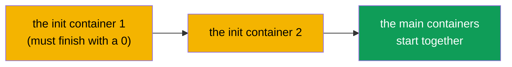
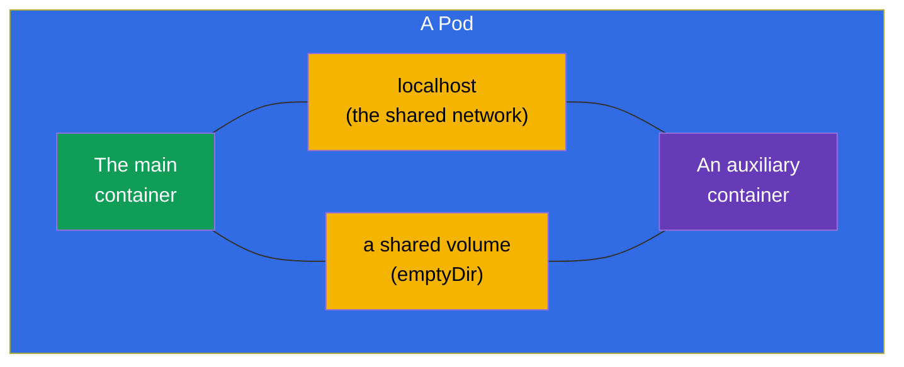
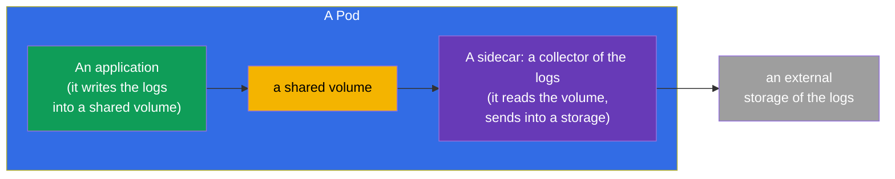
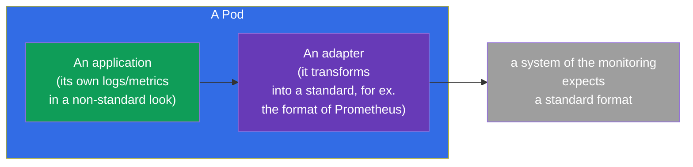
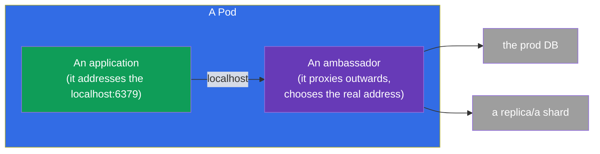
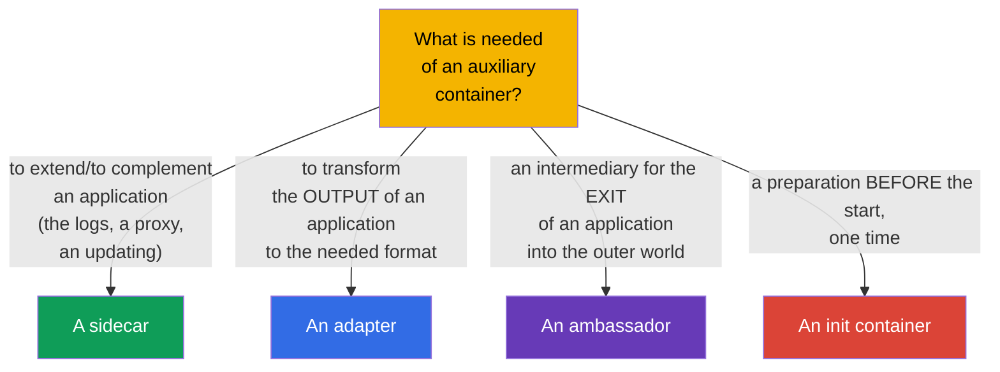

[Русская версия](ru.md) · [Versión en español](es.md) · [Version française](fr.md) · [Deutsche Version](de.md) · [ქართული ვერსია](ge.md) · [繁體中文版](tw.md) · [日本語版](jp.md)

# Chapter 22. The multi-container Pods: a sidecar, an adapter, an ambassador, an init

> 🟩 **The chapter is oriented at the CKAD** (the domain Application Design). But the init containers and
> the pattern sidecar are useful to understand for the CKA as well.
>
> **What comes next.** In the chapter 4 we have assimilated: usually there is one container in a Pod, and several - only
> for the tightly coupled tasks. Now let us take apart these cases in detail. There are **the init containers**
> (they are executed before the main one) and the three classical **patterns of the auxiliary containers** -
> a sidecar, an adapter, an ambassador. The common resource, which makes them possible, is the shared network and
> the volumes of a Pod (the chapter 4). This is one of the favourite topics of the CKAD.

## 22.1. The init containers: a preparation before the start

**An init container** is executed **before** the main containers of a Pod and must successfully
finish, before they start. There can be several of them - they go strictly in
turn, one after another. If an init container has fallen, the Pod restarts it (by the
restartPolicy) and does not go further.



```yaml
spec:
  initContainers:
  - name: wait-for-db
    image: busybox
    command: ['sh', '-c', 'until nc -z db 5432; do sleep 2; done']
  containers:
  - name: app
    image: myapp
```

What the init containers are needed for:

- **A waiting for the dependencies** - to wait, until a DB or another service comes up.
- **A preparation of the data** - to download a config, to apply a migration, to generate the files into a
  shared volume.
- **A separation of the rights** - to perform a privileged preparation separately from the main
  (unprivileged) container.

The key difference from the ordinary containers: an init is executed **once before the start** and must
finish; the main container works constantly.

## 22.2. The shared resources of a Pod - the foundation of the patterns

All the multi-container patterns work, because the containers of a Pod share (the chapter 4):

- **the network** - a common IP and the `localhost`: a sidecar sees the main container by `localhost:the-port`;
- **the volumes** - a shared volume: one container writes a file, another reads it.



It is exactly through the `localhost` and a shared volume that the auxiliary containers cooperate with the main one.

## 22.3. A sidecar: a helper next to an application

**A sidecar** is an auxiliary container, which extends or complements the main one, without
changing its code. The most frequent pattern.



The typical sidecars:

- **a collecting of the logs** - an application writes the logs into a file (a shared volume), a sidecar reads them and sends
  into a centralized storage;
- **a proxy** - a sidecar (for example, the Envoy in a service mesh) intercepts the network traffic;
- **an updating of the data** - a sidecar periodically pulls up the fresh content into a shared volume.

> **About the "native" sidecar containers.** In the modern versions of Kubernetes there have appeared
> the real sidecar containers - this is an init container with a `restartPolicy: Always`. Such a
> container starts before the main one, but continues to work all the time of the life of the Pod and correctly
> finishes after the main one. This solves the old problems of the order of the start/of the stop of a
> sidecar. The idea is worth knowing, but the basic pattern is an ordinary additional container.

## 22.4. An adapter: a bringing of the output to the needed format

**An adapter** ("an adaptor") standardizes or transforms the output of an application, so that an external
system would understand it. An application gives out the data in its own format, an adapter turns it into the
expected one.



A classical example: an application writes the metrics in its own format, while Prometheus waits for its own.
An adapter container reads the metrics of the application and gives them out in the format of Prometheus. The application
does not have to be changed.

## 22.5. An ambassador: an intermediary to the outer world

**An ambassador** is an intermediary container, through which the main application
communicates with the outer world. The application addresses the `localhost`, while the ambassador decides, where
in fact to direct the request (into which DB, shard, environment).



The sense: the application always goes to a simple local address and knows nothing about the external
complexity (a sharding, a change of the environments, the repeated connections). The ambassador takes this
complexity upon itself.

## 22.6. A comparison of the patterns



| The pattern | The role | The direction | An example |
|---------|------|-------------|--------|
| **An init** | a preparation before the start | before the main one | to wait for a DB, a migration |
| **A sidecar** | it complements an application | in parallel | a collecting of the logs, a proxy |
| **An adapter** | it standardizes the output | an exit outwards | the metrics → the format of Prometheus |
| **An ambassador** | an intermediary outwards | an exit outwards | a local proxy to an external DB |

An adapter and an ambassador are in essence the particular cases of a sidecar (they are the auxiliary containers too), but
they differ by the purpose: an adapter transforms **the outgoing data/the output**, an ambassador
proxies **the outgoing connections**.

## 22.7. How this is applied in the production

- **A sidecar is the most alive pattern.** A collecting of the logs (the Fluent Bit next to an application), a proxy
  of a service mesh (the Envoy - the whole course ICA is about this), the agents of the secrets (the Vault Agent), the exporters
  of the metrics - all this is a sidecar. This is the standard way to add the possibilities, without touching the code
  of an application.
- **An init for the order of the start and the migrations.** In the prod the init containers wait for the readiness
  of the dependencies and perform the migrations of the schema of a DB before the start of an application - so that the application
  would not come up ahead of the time.
- **The native sidecars (a restartPolicy: Always at an init).** The modern approach to a sidecar
  solves the long-standing problems: a sidecar is guaranteed to be ready before the main container and correctly
  finishes after it (it is important for the mesh proxies and the collectors of the logs upon a graceful switching off).
- **Not to abuse.** Every sidecar is an additional CPU/memory on every Pod and a growth of the
  complexity. In the prod they weigh it: sometimes it is better to take a function out into a separate service or to the
  level of a node (a DaemonSet), than to breed a sidecar in every Pod.
- **An adapter/an ambassador are rarer, but they are useful.** They are applied upon an integration of the legacy applications,
  which cannot be rewritten: an adapter brings their output to a standard, an ambassador hides the
  complexity of the external connections.

### A case: a Pod with an init container and a sidecar

Let us assemble a typical Pod, where both patterns are present: an **init container** prepares the data before the start, while
a **sidecar** accompanies the application. The scenario: an init generates a starting page into a shared
volume, nginx gives it out and writes the logs into that same volume, while a native sidecar collector reads these
logs. All the communication is through a shared `emptyDir`.

```yaml
apiVersion: v1
kind: Pod
metadata:
  name: web-with-helpers
spec:
  volumes:
  - name: content            # a shared volume: the content of the site
    emptyDir: {}
  - name: logs               # a shared volume: the logs of the application
    emptyDir: {}

  initContainers:
  # 1. An ordinary init — it is executed and FINISHES before the start of the main one
  - name: setup
    image: busybox:1.36
    command: ["sh", "-c", "echo '<h1>Hello from init</h1>' > /work/index.html"]
    volumeMounts:
    - name: content
      mountPath: /work

  # 2. A native sidecar — an init with a restartPolicy: Always: it starts before the main one,
  #    works all the time of the life of the Pod, finishes after the main one
  - name: log-shipper
    image: busybox:1.36
    restartPolicy: Always          # ← it is exactly this that makes an init container a sidecar
    command: ["sh", "-c", "tail -F /var/log/app/access.log"]
    volumeMounts:
    - name: logs
      mountPath: /var/log/app

  containers:
  # The main application: it gives out the content, writes the logs into the shared volume
  - name: nginx
    image: nginx:1.27
    volumeMounts:
    - name: content
      mountPath: /usr/share/nginx/html
    - name: logs
      mountPath: /var/log/nginx
```

The order of the start: `setup` (it has worked off and gone out) → `log-shipper` (it has come up as a sidecar and
stays) → `nginx`. We check:

```bash
kubectl apply -f web-with-helpers.yaml
kubectl get pod web-with-helpers                       # Init:… → Running, when everything has come up

# the logs of the main one and of the sidecar are looked at separately — by the name of the container
kubectl logs web-with-helpers -c nginx
kubectl logs web-with-helpers -c log-shipper           # we see the lines of the access.log, collected by the sidecar
```

The key moments of the case:

- **An init vs a sidecar - one field.** Both live in the `initContainers`; a sidecar differs only by the
  `restartPolicy: Always`. An ordinary init is obliged to **finish**, while a sidecar **works all the
  time** and correctly stops after the main container (it is important for the collectors of the
  logs and the mesh proxies upon a graceful switching off).
- **An exchange through the volumes.** An init and the application communicate by the files in a shared `emptyDir` (the `content`),
  the application and the sidecar - through the second volume (the `logs`). These are exactly those "shared resources of a Pod" out of
  the 22.2.
- **The logs by the containers.** At a multi-container Pod the `kubectl logs` requires a `-c <the-name>` -
  a frequent trifle on the exam.

Earlier (before the native sidecars) a collector of the logs was put into the `containers` as an ordinary container;
the problem was in the finishing - upon a stop of a Pod the order was not guaranteed, and a sidecar could
fall earlier than the application. A `restartPolicy: Always` at an init fixes this.

## 22.8. A mini glossary

- **An init container** - a container, being executed before the main ones and obliged to finish.
- **A sidecar** - an auxiliary container, complementing an application (the logs, a proxy).
- **An adapter** - a container, transforming the output of an application to the needed format.
- **An ambassador** - an intermediary container for the outgoing connections of an application.
- **A shared volume (emptyDir)** - a volume of a Pod for an exchange of the files between the containers.
- **The localhost** - the shared network of a Pod, through which the containers see each other.
- **A native sidecar** - an init container with a `restartPolicy: Always`.

## 22.9. The summary of the chapter

- The init containers are executed in turn before the main ones and must successfully finish;
  they are needed for a waiting for the dependencies, a preparation of the data, the migrations.
- The multi-container patterns work at the expense of the shared resources of a Pod: the `localhost` (the network) and
  a shared volume.
- A sidecar complements an application in parallel (the logs, a proxy, an updating of the data) - the most
  frequent pattern.
- An adapter transforms the output of an application to the needed format (for example, the metrics for
  Prometheus).
- An ambassador is an intermediary for the outgoing connections: an application goes to the localhost, while the ambassador
  decides, where to direct it.
- The native sidecar containers are an init with a `restartPolicy: Always`, they work all the time
  of the life of a Pod.

## 22.10. How this will come in handy: on the exam and in the real work

**On the exam (the CKAD).** "Add an init container, which waits for a service", "set up a sidecar,
reading the logs out of a shared volume", "determine, which pattern this is" - the typical tasks of the domain
Application Design. One needs to be able to write the `initContainers`, a shared `emptyDir` volume and to understand the
roles of the patterns.

**In the real work.** A sidecar is a ubiquitous way to extend the applications (a mesh, the logs,
the secrets) without an editing of the code. The init containers ensure the correct order of the start and the
migrations. An understanding of the patterns helps to design the Pods consciously and not to abuse the
containers, saving the resources.

## 22.11. Self-check questions

1. In what does an init container differ from an ordinary one? What will be, if it falls?
2. What two shared resources of a Pod make the multi-container patterns possible?
3. What does a sidecar do? Give two examples.
4. In what does an adapter differ from an ambassador by the purpose?
5. What is a "native" sidecar and what problem does it solve?
6. What for are the init containers applied in the prod?
7. Why is it not worth abusing the sidecar containers?

## Practice

We have taken apart, how the complex Pods are arranged. In the chapter 23 we shall pass over to what a container is
made of at all - to the images and the Dockerfile. The multi-container patterns are drilled in
the labs on the design of the applications.

🧪 Lab 107 (the multi-container Pods: a sidecar, an init): [tasks/cka/labs/107](../../labs/107/README.MD)

🎮 Killercoda (in a browser, no setup): [Create a Pod with emptyDir volume](https://killercoda.com/chadmcrowell/course/ckad/volumes) · [Logs from Sidecar](https://killercoda.com/chadmcrowell/course/ckad/kubectl-logs-sidecar) · [Ephemeral Debug Container](https://killercoda.com/chadmcrowell/course/ckad/kubectl-debug)

---
[Contents](../README.md) · [Chapter 21](../21/README.md) · [Chapter 23](../23/README.md)
