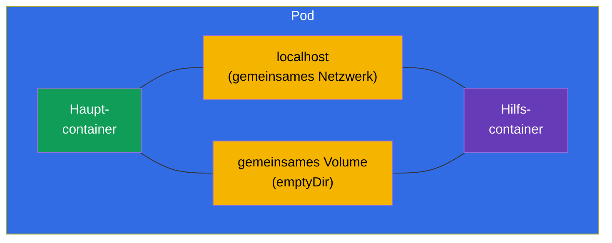
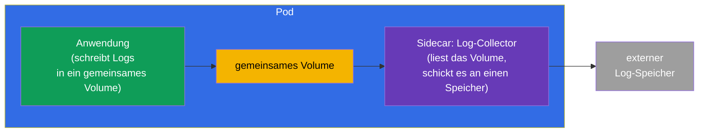
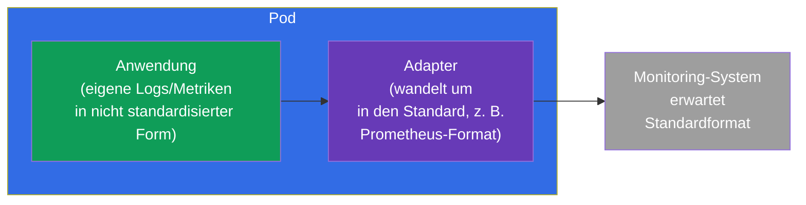
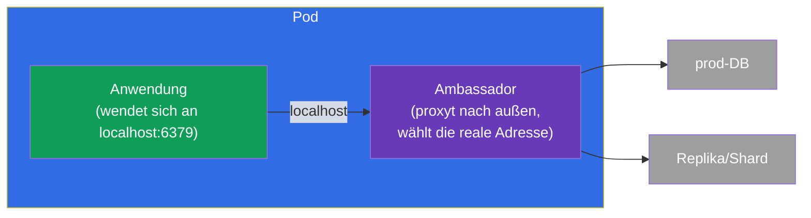
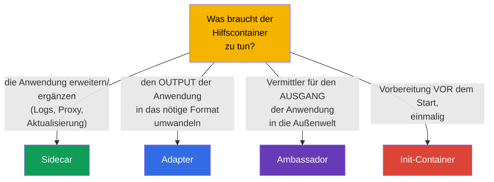

[Русская версия](ru.md) · [Eng version](README.md) · [Versión en español](es.md) · [Version française](fr.md) · [ქართული ვერსია](ge.md) · [繁體中文版](tw.md) · [日本語版](jp.md)

# Kapitel 22. Multi-Container-Pods: sidecar, adapter, ambassador, init

> 🟩 **Das Kapitel ist auf CKAD ausgerichtet** (Domäne Application Design). Aber
> Init-Container und das Sidecar-Pattern sind auch für CKA nützlich zu verstehen.
>
> **Was kommt.** In Kapitel 4 haben wir gelernt: normalerweise gibt es einen Container pro
> Pod, mehrere nur für eng verbundene Aufgaben. Jetzt sehen wir uns diese Fälle im Detail
> an. Es gibt **Init-Container** (laufen vor dem Hauptcontainer) und drei klassische
> **Patterns für Hilfscontainer** - sidecar, adapter, ambassador. Die gemeinsame Ressource,
> die sie möglich macht, sind das gemeinsame Netzwerk und die Volumes des Pods (Kapitel 4).
> Das ist eines der Lieblingsthemen von CKAD.

## 22.1. Init-Container: Vorbereitung vor dem Start

Ein **Init-Container** läuft **vor** den Hauptcontainern des Pods und muss erfolgreich
beendet werden, bevor diese starten. Es können mehrere sein - sie laufen strikt der Reihe
nach, einer nach dem anderen. Stürzt ein Init-Container ab, startet der Pod ihn neu (gemäß
restartPolicy) und geht nicht weiter.


```yaml
spec:
  initContainers:
  - name: wait-for-db
    image: busybox
    command: ['sh', '-c', 'until nc -z db 5432; do sleep 2; done']
  containers:
  - name: app
    image: myapp
```

Wozu Init-Container gut sind:

- **Warten auf Abhängigkeiten** - abwarten, bis die Datenbank oder ein anderer Dienst
  hochkommt.
- **Vorbereitung von Daten** - eine Konfiguration herunterladen, eine Migration anwenden,
  Dateien in ein gemeinsames Volume erzeugen.
- **Trennung von Rechten** - eine privilegierte Vorbereitung getrennt vom
  (unprivilegierten) Hauptcontainer ausführen.

Der zentrale Unterschied zu normalen Containern: init läuft **einmal vor dem Start** und
muss sich beenden; der Hauptcontainer läuft dauerhaft.

## 22.2. Gemeinsame Ressourcen des Pods - die Basis der Patterns

Alle Multi-Container-Patterns funktionieren, weil die Container eines Pods teilen
(Kapitel 4):

- **Netzwerk** - gemeinsame IP und `localhost`: der Sidecar sieht den Hauptcontainer über
  `localhost:Port`;
- **Volumes** - gemeinsames Volume: ein Container schreibt eine Datei, ein anderer liest
  sie.



Genau über `localhost` und das gemeinsame Volume arbeiten die Hilfscontainer mit dem
Hauptcontainer zusammen.

## 22.3. Sidecar: der Helfer neben der Anwendung

**Sidecar** - ein Hilfscontainer, der den Hauptcontainer erweitert oder ergänzt, ohne
dessen Code zu ändern. Das häufigste Pattern.



Typische Sidecars:

- **Sammeln von Logs** - die Anwendung schreibt Logs in eine Datei (gemeinsames Volume),
  der Sidecar liest sie und schickt sie an einen zentralen Speicher;
- **Proxy** - der Sidecar (zum Beispiel Envoy im Service Mesh) fängt den Netzwerkverkehr
  ab;
- **Aktualisierung von Daten** - der Sidecar zieht periodisch frischen Inhalt in das
  gemeinsame Volume.

> **Zu den „nativen“ Sidecar-Containern.** In modernen Kubernetes-Versionen sind echte
> Sidecar-Container aufgetaucht - das ist ein Init-Container mit `restartPolicy: Always`.
> So ein Container startet vor dem Hauptcontainer, läuft aber die ganze Lebensdauer des
> Pods weiter und beendet sich korrekt nach dem Hauptcontainer. Das löst die alten Probleme
> mit der Start-/Stopp-Reihenfolge von Sidecars. Die Idee sollte man kennen, aber das
> Basis-Pattern ist ein normaler zusätzlicher Container.

## 22.4. Adapter: den Output in das nötige Format bringen

**Adapter** („Adapter“) standardisiert oder wandelt den Output einer Anwendung um, damit
ein externes System ihn versteht. Die Anwendung liefert Daten in ihrem eigenen Format, der
Adapter macht daraus das erwartete.



Ein klassisches Beispiel: die Anwendung schreibt Metriken in ihrem eigenen Format, während
Prometheus sein eigenes erwartet. Der Adapter-Container liest die Metriken der Anwendung
und gibt sie im Prometheus-Format aus. Die Anwendung muss nicht geändert werden.

## 22.5. Ambassador: der Vermittler zur Außenwelt

**Ambassador** („Botschafter“) - ein vermittelnder Container, über den die Hauptanwendung
mit der Außenwelt kommuniziert. Die Anwendung wendet sich an `localhost`, und der
Ambassador entscheidet, wohin die Anfrage tatsächlich geht (zu welcher Datenbank, welchem
Shard, welcher Umgebung).



Der Sinn: die Anwendung geht immer auf eine einfache lokale Adresse und weiß nichts von der
äußeren Komplexität (Sharding, Wechsel der Umgebungen, Wiederverbindungen). Der Ambassador
nimmt diese Komplexität auf sich.

## 22.6. Vergleich der Patterns



| Pattern | Rolle | Richtung | Beispiel |
|---------|------|-------------|--------|
| **Init** | Vorbereitung vor dem Start | vor dem Hauptcontainer | auf die DB warten, Migration |
| **Sidecar** | ergänzt die Anwendung | parallel | Sammeln von Logs, Proxy |
| **Adapter** | standardisiert den Output | Ausgang nach außen | Metriken → Prometheus-Format |
| **Ambassador** | Vermittler nach außen | Ausgang nach außen | lokaler Proxy zu einer externen DB |

Adapter und Ambassador sind im Grunde Spezialfälle des Sidecar (auch Hilfscontainer),
unterscheiden sich aber im Zweck: der Adapter wandelt **ausgehende Daten/Output** um, der
Ambassador proxyt **ausgehende Verbindungen**.

## 22.7. Wie man das in der Produktion anwendet

- **Sidecar - das lebendigste Pattern.** Sammeln von Logs (Fluent Bit neben der
  Anwendung), Service-Mesh-Proxy (Envoy - der ganze ICA-Kurs dreht sich darum),
  Secret-Agenten (Vault Agent), Metrik-Exporter - all das sind Sidecars. Das ist der
  Standardweg, Fähigkeiten hinzuzufügen, ohne den Code der Anwendung anzufassen.
- **Init für Startreihenfolge und Migrationen.** In der Produktion warten Init-Container
  auf die Bereitschaft von Abhängigkeiten und führen Schema-Migrationen der DB vor dem
  Start der Anwendung aus - damit die Anwendung nicht zu früh hochkommt.
- **Native Sidecars (restartPolicy: Always bei init).** Der moderne Ansatz für Sidecars
  löst alte Probleme: der Sidecar ist garantiert vor dem Hauptcontainer bereit und beendet
  sich korrekt nach ihm (wichtig für Mesh-Proxys und Log-Collectors beim Graceful
  Shutdown).
- **Nicht übertreiben.** Jeder Sidecar bedeutet zusätzliche CPU/Memory pro Pod und mehr
  Komplexität. In der Produktion wägt man ab: manchmal ist es besser, eine Funktion in
  einen separaten Dienst oder auf die Node-Ebene (DaemonSet) auszulagern, als in jedem Pod
  Sidecars zu vermehren.
- **Adapter/Ambassador seltener, aber nützlich.** Sie werden bei der Integration von
  Legacy-Anwendungen eingesetzt, die man nicht neu schreiben kann: der Adapter bringt deren
  Output auf den Standard, der Ambassador versteckt die Komplexität externer Verbindungen.

### Fallbeispiel: ein Pod mit Init-Container und Sidecar

Bauen wir einen typischen Pod, in dem beide Patterns vorkommen: ein **Init-Container**
bereitet Daten vor dem Start vor, und ein **Sidecar** begleitet die Anwendung. Das
Szenario: init erzeugt eine Startseite in einem gemeinsamen Volume, nginx liefert sie aus
und schreibt Logs in dasselbe Volume, und ein nativer Sidecar-Collector liest diese Logs.
Die gesamte Kommunikation läuft über ein gemeinsames `emptyDir`.

```yaml
apiVersion: v1
kind: Pod
metadata:
  name: web-with-helpers
spec:
  volumes:
  - name: content            # gemeinsames Volume: Inhalt der Website
    emptyDir: {}
  - name: logs               # gemeinsames Volume: Logs der Anwendung
    emptyDir: {}

  initContainers:
  # 1. Normales init — läuft und BEENDET SICH vor dem Start des Hauptcontainers
  - name: setup
    image: busybox:1.36
    command: ["sh", "-c", "echo '<h1>Hello from init</h1>' > /work/index.html"]
    volumeMounts:
    - name: content
      mountPath: /work

  # 2. Nativer Sidecar — init mit restartPolicy: Always: startet vor dem Hauptcontainer,
  #    läuft die ganze Lebensdauer des Pods, beendet sich nach dem Hauptcontainer
  - name: log-shipper
    image: busybox:1.36
    restartPolicy: Always          # ← genau das macht aus dem Init-Container einen Sidecar
    command: ["sh", "-c", "tail -F /var/log/app/access.log"]
    volumeMounts:
    - name: logs
      mountPath: /var/log/app

  containers:
  # Hauptanwendung: liefert Inhalt aus, schreibt Logs in das gemeinsame Volume
  - name: nginx
    image: nginx:1.27
    volumeMounts:
    - name: content
      mountPath: /usr/share/nginx/html
    - name: logs
      mountPath: /var/log/nginx
```

Startreihenfolge: `setup` (hat gearbeitet und sich beendet) → `log-shipper` (ist als
Sidecar hochgekommen und bleibt) → `nginx`. Prüfen wir:

```bash
kubectl apply -f web-with-helpers.yaml
kubectl get pod web-with-helpers                       # Init:… → Running, wenn alles hochgekommen ist

# Logs des Hauptcontainers und des Sidecar sieht man getrennt — über den Containernamen
kubectl logs web-with-helpers -c nginx
kubectl logs web-with-helpers -c log-shipper           # wir sehen die Zeilen der access.log, die der Sidecar gesammelt hat
```

Die Schlüsselpunkte des Fallbeispiels:

- **Init vs Sidecar - ein einziges Feld.** Beide leben in `initContainers`; der Sidecar
  unterscheidet sich nur durch `restartPolicy: Always`. Ein normales init muss sich
  **beenden**, ein Sidecar **läuft die ganze Zeit** und stoppt korrekt nach dem
  Hauptcontainer (wichtig für Log-Collectors und Mesh-Proxys beim Graceful Shutdown).
- **Austausch über Volumes.** Init und Anwendung kommunizieren über Dateien in einem
  gemeinsamen `emptyDir` (`content`), Anwendung und Sidecar über das zweite Volume
  (`logs`). Das sind genau jene „gemeinsamen Ressourcen des Pods“ aus 22.2.
- **Logs pro Container.** Bei einem Multi-Container-Pod verlangt `kubectl logs` ein
  `-c <Name>` - eine häufige Kleinigkeit in der Prüfung.

Früher (vor den nativen Sidecars) legte man den Log-Collector als normalen Container in
`containers`; das Problem lag beim Beenden - beim Stoppen des Pods war die Reihenfolge
nicht garantiert, und der Sidecar konnte vor der Anwendung ausfallen. `restartPolicy:
Always` bei init behebt das.

## 22.8. Mini-Glossar

- **Init-Container** - ein Container, der vor den Hauptcontainern läuft und sich beenden
  muss.
- **Sidecar** - ein Hilfscontainer, der die Anwendung ergänzt (Logs, Proxy).
- **Adapter** - ein Container, der den Output der Anwendung in das nötige Format umwandelt.
- **Ambassador** - ein vermittelnder Container für die ausgehenden Verbindungen der
  Anwendung.
- **Gemeinsames Volume (emptyDir)** - ein Volume des Pods zum Austausch von Dateien
  zwischen Containern.
- **localhost** - das gemeinsame Netzwerk des Pods, über das die Container einander sehen.
- **Nativer Sidecar** - ein Init-Container mit `restartPolicy: Always`.

## 22.9. Zusammenfassung des Kapitels

- Init-Container laufen der Reihe nach vor den Hauptcontainern und müssen sich erfolgreich
  beenden; sie werden für das Warten auf Abhängigkeiten, die Vorbereitung von Daten und
  Migrationen gebraucht.
- Multi-Container-Patterns funktionieren dank der gemeinsamen Ressourcen des Pods:
  `localhost` (Netzwerk) und ein gemeinsames Volume.
- Der Sidecar ergänzt die Anwendung parallel (Logs, Proxy, Aktualisierung von Daten) - das
  häufigste Pattern.
- Der Adapter wandelt den Output der Anwendung in das nötige Format um (zum Beispiel
  Metriken für Prometheus).
- Der Ambassador ist ein Vermittler für ausgehende Verbindungen: die Anwendung geht auf
  localhost, der Botschafter entscheidet, wohin er sie leitet.
- Native Sidecar-Container sind init mit `restartPolicy: Always` und laufen die ganze
  Lebensdauer des Pods.

## 22.10. Wofür das nützlich ist: in der Prüfung und in der echten Arbeit

**In der Prüfung (CKAD).** „Füge einen Init-Container hinzu, der auf einen Service wartet“,
„richte einen Sidecar ein, der Logs aus einem gemeinsamen Volume liest“, „bestimme, welches
Pattern das ist“ - typische Aufgaben der Domäne Application Design. Man muss
`initContainers` und ein gemeinsames `emptyDir`-Volume schreiben können und die Rollen der
Patterns verstehen.

**In der echten Arbeit.** Der Sidecar ist der allgegenwärtige Weg, Anwendungen zu
erweitern (Mesh, Logs, Secrets), ohne den Code anzufassen. Init-Container sorgen für die
richtige Startreihenfolge und Migrationen. Das Verständnis der Patterns hilft, Pods bewusst
zu entwerfen, Container nicht zu überstrapazieren und Ressourcen zu sparen.

## 22.11. Fragen zur Selbstüberprüfung

1. Wodurch unterscheidet sich ein Init-Container von einem normalen? Was passiert, wenn er
   abstürzt?
2. Welche zwei gemeinsamen Ressourcen des Pods machen Multi-Container-Patterns möglich?
3. Was macht ein Sidecar? Nennen Sie zwei Beispiele.
4. Wodurch unterscheidet sich ein Adapter im Zweck von einem Ambassador?
5. Was ist ein „nativer“ Sidecar und welches Problem löst er?
6. Wofür werden Init-Container in der Produktion eingesetzt?
7. Warum sollte man es mit Sidecar-Containern nicht übertreiben?

## Praxis

Wir haben uns angesehen, wie komplexe Pods aufgebaut sind. In Kapitel 23 gehen wir dazu
über, woraus ein Container überhaupt gemacht wird - zu Images und zum Dockerfile.
Multi-Container-Patterns werden in den Labs zum Design von Anwendungen geübt.

🧪 Lab 107 (Multi-Container-Pods: sidecar, init): [tasks/cka/labs/107](../../labs/107/README_DE.MD)

🎮 Killercoda (im Browser, ohne Installation): [Create a Pod with emptyDir volume](https://killercoda.com/chadmcrowell/course/ckad/volumes) · [Logs from Sidecar](https://killercoda.com/chadmcrowell/course/ckad/kubectl-logs-sidecar) · [Ephemeral Debug Container](https://killercoda.com/chadmcrowell/course/ckad/kubectl-debug)

---
[Inhalt](../README_DE.md) · [Kapitel 21](../21/de.md) · [Kapitel 23](../23/de.md)
