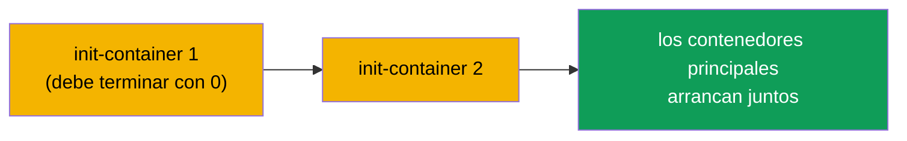
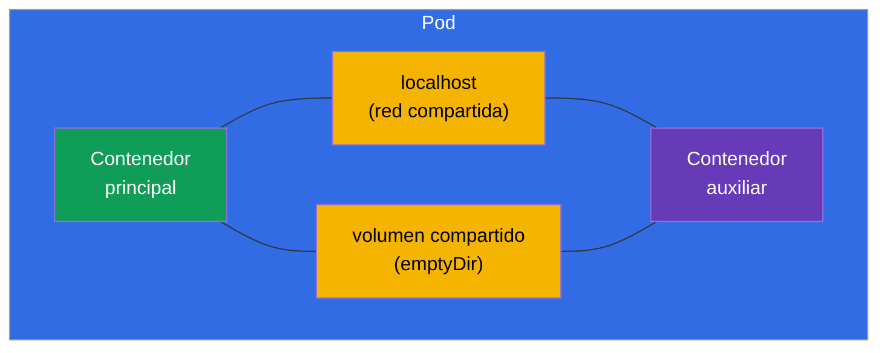
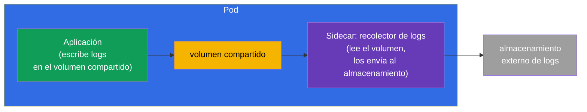
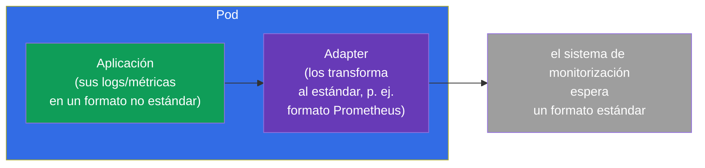
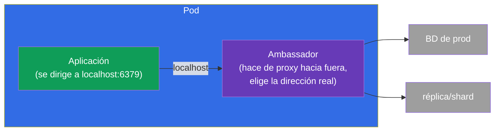
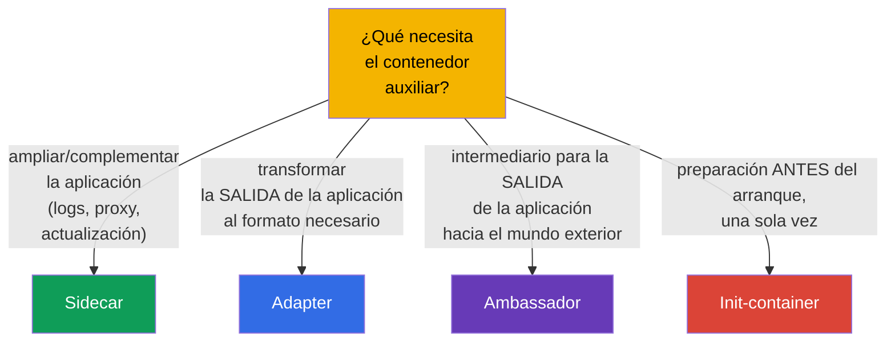

[Русская версия](ru.md) · [Eng version](README.md) · [Version française](fr.md) · [Deutsche Version](de.md) · [ქართული ვერსია](ge.md)

# Capítulo 22. Pods multi-container: sidecar, adapter, ambassador, init

> 🟩 **El capítulo está orientado a CKAD** (dominio Application Design). Pero los
> init-containers y el patrón sidecar conviene entenderlos también para CKA.
>
> **Qué viene ahora.** En el capítulo 4 asimilamos esto: normalmente en un Pod hay un solo
> contenedor, y varios solo para tareas estrechamente ligadas. Ahora veremos esos casos en
> detalle. Existen los **init-containers** (se ejecutan antes del principal) y tres
> **patrones clásicos de contenedores auxiliares**: sidecar, adapter, ambassador. El recurso
> común que los hace posibles son la red y los volúmenes compartidos del Pod (capítulo 4). Es
> uno de los temas favoritos de CKAD.

## 22.1. Init-containers: preparación antes del arranque

Un **init-container** se ejecuta **antes** de los contenedores principales del Pod y debe
terminar con éxito para que estos arranquen. Puede haber varios: van estrictamente por turnos,
uno tras otro. Si un init-container falla, el Pod lo reinicia (según restartPolicy) y no sigue
adelante.



```yaml
spec:
  initContainers:
  - name: wait-for-db
    image: busybox
    command: ['sh', '-c', 'until nc -z db 5432; do sleep 2; done']
  containers:
  - name: app
    image: myapp
```

Para qué sirven los init-containers:

- **Esperar dependencias** - aguardar a que se levante la BD u otro servicio.
- **Preparar datos** - descargar la configuración, aplicar una migración, generar ficheros en
  un volumen compartido.
- **Separar privilegios** - hacer la preparación privilegiada aparte del contenedor principal
  (no privilegiado).

La diferencia clave con los contenedores normales: el init se ejecuta **una sola vez antes del
arranque** y debe terminar; el contenedor principal funciona de forma permanente.

## 22.2. Los recursos compartidos del Pod, la base de los patrones

Todos los patrones multi-container funcionan porque los contenedores del Pod comparten
(capítulo 4):

- **la red** - IP común y `localhost`: el sidecar ve el contenedor principal en
  `localhost:puerto`;
- **los volúmenes** - un volumen común: un contenedor escribe un fichero y otro lo lee.



Justamente a través de `localhost` y del volumen compartido cooperan los contenedores
auxiliares con el principal.

## 22.3. Sidecar: un ayudante al lado de la aplicación

**Sidecar** - contenedor auxiliar que amplía o complementa al principal sin cambiar su código.
Es el patrón más frecuente.



Sidecars típicos:

- **recolección de logs** - la aplicación escribe los logs en un fichero (volumen compartido),
  el sidecar lo lee y los envía a un almacenamiento centralizado;
- **proxy** - el sidecar (por ejemplo, Envoy en un service mesh) intercepta el tráfico de red;
- **actualización de datos** - el sidecar trae periódicamente contenido fresco al volumen
  compartido.

> **Sobre los sidecar-containers «nativos».** En las versiones modernas de Kubernetes han
> aparecido los sidecar-containers de verdad: son un init-container con `restartPolicy: Always`.
> Ese contenedor arranca antes del principal, pero sigue funcionando durante toda la vida del
> Pod y termina correctamente después del principal. Eso resuelve los viejos problemas de orden
> de arranque/parada de los sidecars. La idea conviene conocerla, pero el patrón básico es un
> contenedor adicional normal.

## 22.4. Adapter: llevar la salida al formato necesario

**Adapter** («adaptador») estandariza o transforma la salida de la aplicación para que un
sistema externo la entienda. La aplicación entrega datos en su propio formato y el adapter los
convierte en el esperado.



Ejemplo clásico: la aplicación escribe métricas en su propio formato y Prometheus espera el
suyo. El contenedor adapter lee las métricas de la aplicación y las entrega en formato
Prometheus. No hay que cambiar la aplicación.

## 22.5. Ambassador: intermediario hacia el mundo exterior

**Ambassador** («embajador») - contenedor intermediario a través del cual la aplicación
principal se comunica con el mundo exterior. La aplicación se dirige a `localhost` y el
ambassador decide adónde enviar realmente la petición (a qué BD, shard, entorno).



La idea: la aplicación siempre va a una dirección local sencilla y no sabe nada de la
complejidad externa (sharding, cambio de entornos, reconexiones). El ambassador se hace cargo
de esa complejidad.

## 22.6. Comparación de los patrones



| Patrón | Papel | Dirección | Ejemplo |
|---------|------|-------------|--------|
| **Init** | preparación antes del arranque | antes del principal | esperar la BD, migración |
| **Sidecar** | complementa la aplicación | en paralelo | recolección de logs, proxy |
| **Adapter** | estandariza la salida | salida hacia fuera | métricas → formato Prometheus |
| **Ambassador** | intermediario hacia fuera | salida hacia fuera | proxy local a una BD externa |

Adapter y ambassador son en esencia casos particulares de sidecar (también son contenedores
auxiliares), pero se diferencian por su propósito: el adapter transforma los **datos/la salida
salientes**, el ambassador hace de proxy de las **conexiones salientes**.

## 22.7. Cómo se aplica esto en producción

- **Sidecar es el patrón más vivo.** Recolección de logs (Fluent Bit al lado de la
  aplicación), proxy de service mesh (Envoy - de eso va todo el curso ICA), agentes de secretos
  (Vault Agent), exportadores de métricas: todo eso son sidecars. Es la forma estándar de añadir
  capacidades sin tocar el código de la aplicación.
- **Init para el orden de arranque y las migraciones.** En producción los init-containers
  esperan a que las dependencias estén listas y ejecutan las migraciones del esquema de la BD
  antes de arrancar la aplicación, para que la aplicación no se levante antes de tiempo.
- **Sidecars nativos (restartPolicy: Always en el init).** El enfoque moderno de sidecar
  resuelve problemas de siempre: el sidecar está garantizadamente listo antes del contenedor
  principal y termina correctamente después de él (importante para los proxies de mesh y los
  recolectores de logs en el apagado graceful).
- **No abusar.** Cada sidecar es CPU/memoria adicional en cada Pod y más complejidad. En
  producción se sopesa: a veces es mejor sacar la función a un servicio aparte o al nivel del
  nodo (DaemonSet) que multiplicar sidecars en cada Pod.
- **Adapter/ambassador son menos frecuentes, pero útiles.** Se aplican al integrar
  aplicaciones legacy que no se pueden reescribir: el adapter lleva su salida al estándar, el
  ambassador esconde la complejidad de las conexiones externas.

### Caso: un Pod con init-container y sidecar

Montemos un Pod típico donde están ambos patrones: el **init-container** prepara los datos
antes del arranque y el **sidecar** acompaña a la aplicación. Escenario: el init genera la
página de inicio en un volumen compartido, nginx la sirve y escribe los logs en ese mismo
volumen, y un recolector sidecar nativo lee esos logs. Toda la comunicación va por un
`emptyDir` compartido.

```yaml
apiVersion: v1
kind: Pod
metadata:
  name: web-with-helpers
spec:
  volumes:
  - name: content            # volumen compartido: contenido del sitio
    emptyDir: {}
  - name: logs               # volumen compartido: logs de la aplicación
    emptyDir: {}

  initContainers:
  # 1. Init normal — se ejecuta y TERMINA antes de que arranque el principal
  - name: setup
    image: busybox:1.36
    command: ["sh", "-c", "echo '<h1>Hello from init</h1>' > /work/index.html"]
    volumeMounts:
    - name: content
      mountPath: /work

  # 2. Sidecar nativo — init con restartPolicy: Always: arranca antes del principal,
  #    funciona toda la vida del Pod, termina después del principal
  - name: log-shipper
    image: busybox:1.36
    restartPolicy: Always          # ← esto es justo lo que convierte al init-container en sidecar
    command: ["sh", "-c", "tail -F /var/log/app/access.log"]
    volumeMounts:
    - name: logs
      mountPath: /var/log/app

  containers:
  # Aplicación principal: sirve el contenido, escribe los logs en el volumen compartido
  - name: nginx
    image: nginx:1.27
    volumeMounts:
    - name: content
      mountPath: /usr/share/nginx/html
    - name: logs
      mountPath: /var/log/nginx
```

Orden de arranque: `setup` (ha hecho su trabajo y ha salido) → `log-shipper` (se ha levantado
como sidecar y se queda) → `nginx`. Comprobamos:

```bash
kubectl apply -f web-with-helpers.yaml
kubectl get pod web-with-helpers                       # Init:… → Running, cuando todo se ha levantado

# los logs del principal y del sidecar se miran por separado — por nombre de contenedor
kubectl logs web-with-helpers -c nginx
kubectl logs web-with-helpers -c log-shipper           # vemos las líneas de access.log recogidas por el sidecar
```

Puntos clave del caso:

- **Init vs sidecar, un solo campo.** Ambos viven en `initContainers`; el sidecar se
  diferencia solo por `restartPolicy: Always`. El init normal está obligado a **terminar**,
  mientras que el sidecar **funciona todo el tiempo** y se detiene correctamente después del
  contenedor principal (importante para los recolectores de logs y los proxies de mesh en el
  apagado graceful).
- **Intercambio a través de volúmenes.** El init y la aplicación se comunican con ficheros en
  el `emptyDir` compartido (`content`), y la aplicación y el sidecar a través del segundo
  volumen (`logs`). Son exactamente esos «recursos compartidos del Pod» de 22.2.
- **Logs por contenedor.** En un Pod multi-container `kubectl logs` exige `-c <nombre>`: un
  detalle que aparece a menudo en el examen.

Antes (antes de los sidecars nativos) el recolector de logs se ponía en `containers` como un
contenedor normal; el problema estaba en la terminación: al parar el Pod el orden no estaba
garantizado y el sidecar podía caerse antes que la aplicación. `restartPolicy: Always` en el
init arregla eso.

## 22.8. Mini-glosario

- **Init-container** - contenedor que se ejecuta antes de los principales y está obligado a
  terminar.
- **Sidecar** - contenedor auxiliar que complementa la aplicación (logs, proxy).
- **Adapter** - contenedor que transforma la salida de la aplicación al formato necesario.
- **Ambassador** - contenedor intermediario para las conexiones salientes de la aplicación.
- **Volumen compartido (emptyDir)** - volumen del Pod para intercambiar ficheros entre
  contenedores.
- **localhost** - la red compartida del Pod, a través de la cual los contenedores se ven entre
  sí.
- **Sidecar nativo** - init-container con `restartPolicy: Always`.

## 22.9. Resumen del capítulo

- Los init-containers se ejecutan por turnos antes de los principales y deben terminar con
  éxito; sirven para esperar dependencias, preparar datos y hacer migraciones.
- Los patrones multi-container funcionan gracias a los recursos compartidos del Pod:
  `localhost` (red) y el volumen compartido.
- El sidecar complementa la aplicación en paralelo (logs, proxy, actualización de datos): es el
  patrón más frecuente.
- El adapter transforma la salida de la aplicación al formato necesario (por ejemplo, métricas
  para Prometheus).
- El ambassador es un intermediario para las conexiones salientes: la aplicación va a
  localhost y el embajador decide adónde dirigirla.
- Los sidecar-containers nativos son un init con `restartPolicy: Always` y funcionan durante
  toda la vida del Pod.

## 22.10. Para qué te servirá: en el examen y en el trabajo real

**En el examen (CKAD).** «Añade un init-container que espere a un Service», «configura un
sidecar que lea los logs de un volumen compartido», «determina de qué patrón se trata» son
tareas típicas del dominio Application Design. Hay que saber escribir `initContainers`, un
volumen `emptyDir` compartido y entender los papeles de los patrones.

**En el trabajo real.** El sidecar es la forma omnipresente de ampliar aplicaciones (mesh,
logs, secretos) sin editar el código. Los init-containers aseguran el orden correcto de
arranque y las migraciones. Entender los patrones ayuda a diseñar Pods de forma consciente y a
no abusar de los contenedores, ahorrando recursos.

## 22.11. Preguntas de autoevaluación

1. ¿En qué se diferencia un init-container de uno normal? ¿Qué pasa si falla?
2. ¿Qué dos recursos compartidos del Pod hacen posibles los patrones multi-container?
3. ¿Qué hace un sidecar? Pon dos ejemplos.
4. ¿En qué se diferencia el adapter del ambassador por su propósito?
5. ¿Qué es un sidecar «nativo» y qué problema resuelve?
6. ¿Para qué se usan los init-containers en producción?
7. ¿Por qué no conviene abusar de los sidecar-containers?

## Práctica

Hemos visto cómo están construidos los Pods complejos. En el capítulo 23 pasaremos a aquello
de lo que se hace un contenedor: las imágenes y el Dockerfile. Los patrones multi-container se
practican en los laboratorios de diseño de aplicaciones.

🧪 Laboratorio 107 (Pods multi-container: sidecar, init): [tasks/cka/labs/107](../../labs/107/README_ES.MD)

---
[Índice](../README_ES.md) · [Capítulo 21](../21/es.md) · [Capítulo 23](../23/es.md)
