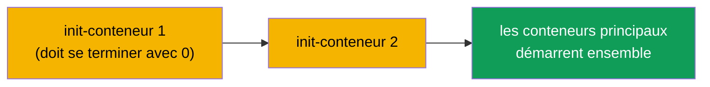
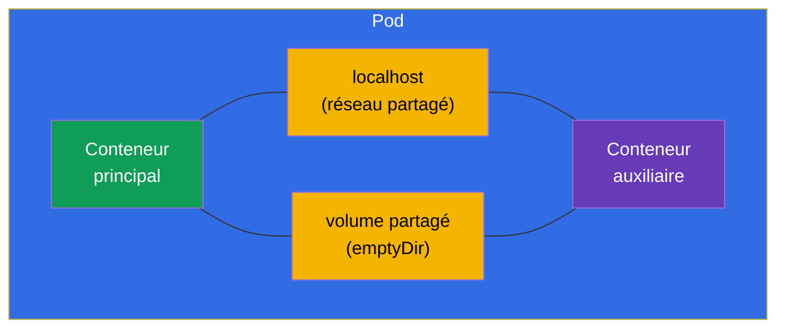
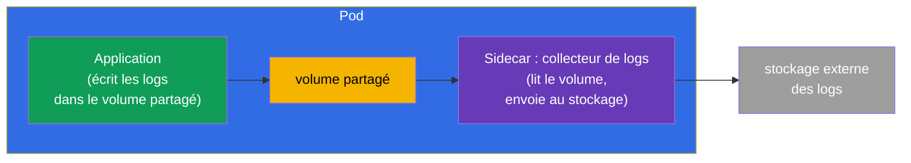
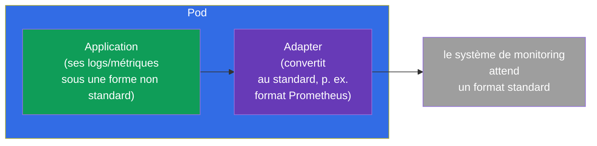
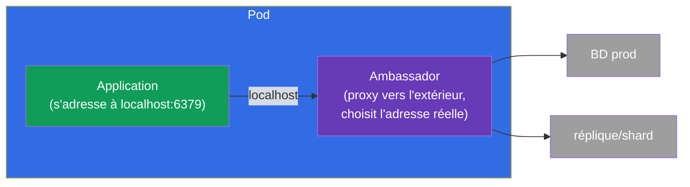
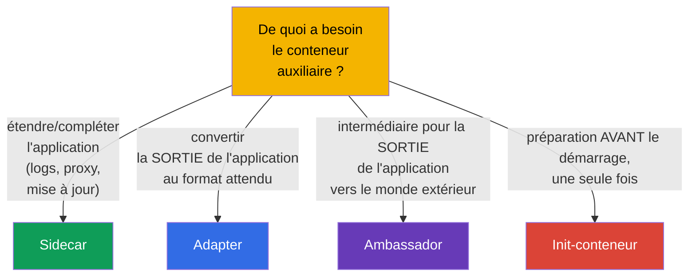

[Русская версия](ru.md) · [Eng version](README.md) · [Versión en español](es.md) · [Deutsche Version](de.md) · [ქართული ვერსია](ge.md) · [繁體中文版](tw.md) · [日本語版](jp.md)

# Chapitre 22. Pods multi-conteneurs : sidecar, adapter, ambassador, init

> 🟩 **Chapitre orienté CKAD** (domaine Application Design). Mais les init-conteneurs et
> le pattern sidecar sont utiles à comprendre aussi pour le CKA.
>
> **Ce qui suit.** Au chapitre 4 nous avons retenu ceci : d'habitude un Pod n'a qu'un seul
> conteneur, et plusieurs seulement pour des tâches étroitement liées. Examinons maintenant
> ces cas en détail. Il y a les **init-conteneurs** (exécutés avant le principal) et trois
> **patterns classiques de conteneurs auxiliaires** - sidecar, adapter, ambassador. La
> ressource commune qui les rend possibles, c'est le réseau et les volumes partagés du Pod
> (chapitre 4). C'est l'un des sujets favoris du CKAD.

## 22.1. Init-conteneurs : la préparation avant le démarrage

Un **init-conteneur** s'exécute **avant** les conteneurs principaux du Pod et doit se
terminer avec succès avant qu'ils ne démarrent. Il peut y en avoir plusieurs - ils se
suivent strictement dans l'ordre, l'un après l'autre. Si un init-conteneur échoue, le Pod le
redémarre (selon restartPolicy) et ne va pas plus loin.



```yaml
spec:
  initContainers:
  - name: wait-for-db
    image: busybox
    command: ['sh', '-c', 'until nc -z db 5432; do sleep 2; done']
  containers:
  - name: app
    image: myapp
```

À quoi servent les init-conteneurs :

- **Attendre des dépendances** - attendre que la base de données ou un autre service soit
  disponible.
- **Préparer des données** - télécharger une configuration, appliquer une migration,
  générer des fichiers dans un volume partagé.
- **Séparer les privilèges** - effectuer la préparation privilégiée à part du conteneur
  principal (non privilégié).

La différence essentielle avec les conteneurs ordinaires : l'init s'exécute **une seule fois
avant le démarrage** et doit se terminer ; le conteneur principal, lui, tourne en permanence.

## 22.2. Les ressources partagées du Pod - le socle des patterns

Tous les patterns multi-conteneurs fonctionnent parce que les conteneurs du Pod partagent
(chapitre 4) :

- **le réseau** - une IP commune et `localhost` : le sidecar voit le conteneur principal sur
  `localhost:port` ;
- **les volumes** - un volume partagé : un conteneur écrit un fichier, l'autre le lit.



C'est précisément via `localhost` et le volume partagé que les conteneurs auxiliaires
coopèrent avec le principal.

## 22.3. Sidecar : l'assistant aux côtés de l'application

Un **sidecar** est un conteneur auxiliaire qui étend ou complète le principal sans modifier
son code. C'est le pattern le plus fréquent.



Sidecars typiques :

- **collecte de logs** - l'application écrit ses logs dans un fichier (volume partagé), le
  sidecar les lit et les envoie vers un stockage centralisé ;
- **proxy** - le sidecar (par exemple Envoy dans un service mesh) intercepte le trafic
  réseau ;
- **mise à jour de données** - le sidecar récupère périodiquement du contenu frais dans le
  volume partagé.

> **À propos des sidecars « natifs ».** Dans les versions récentes de Kubernetes sont
> apparus de véritables conteneurs sidecar - il s'agit d'un init-conteneur avec
> `restartPolicy: Always`. Un tel conteneur démarre avant le principal, mais continue de
> tourner pendant toute la vie du Pod et se termine correctement après le principal. Cela
> règle les vieux problèmes d'ordre de démarrage/arrêt des sidecars. L'idée est bonne à
> connaître, mais le pattern de base reste un conteneur supplémentaire ordinaire.

## 22.4. Adapter : mettre la sortie au format attendu

L'**adapter** (« adaptateur ») standardise ou transforme la sortie de l'application pour
qu'un système externe la comprenne. L'application produit des données dans son propre
format, l'adapter les convertit au format attendu.



Exemple classique : l'application écrit ses métriques dans son propre format, alors que
Prometheus en attend un autre. Le conteneur adapter lit les métriques de l'application et
les expose au format Prometheus. Aucune modification de l'application n'est nécessaire.

## 22.5. Ambassador : l'intermédiaire vers le monde extérieur

L'**ambassador** (« ambassadeur ») est un conteneur intermédiaire par lequel l'application
principale communique avec le monde extérieur. L'application s'adresse à `localhost`, et
l'ambassador décide où diriger réellement la requête (vers quelle base, quel shard, quel
environnement).



L'idée : l'application s'adresse toujours à une simple adresse locale et ne sait rien de la
complexité extérieure (sharding, changement d'environnement, reconnexions). L'ambassador
prend cette complexité à sa charge.

## 22.6. Comparaison des patterns



| Pattern | Rôle | Direction | Exemple |
|---------|------|-------------|--------|
| **Init** | préparation avant le démarrage | avant le principal | attendre la BD, migration |
| **Sidecar** | complète l'application | en parallèle | collecte de logs, proxy |
| **Adapter** | standardise la sortie | vers l'extérieur | métriques → format Prometheus |
| **Ambassador** | intermédiaire vers l'extérieur | vers l'extérieur | proxy local vers une BD externe |

Adapter et ambassador sont au fond des cas particuliers de sidecar (des conteneurs
auxiliaires eux aussi), mais leur finalité diffère : l'adapter transforme les **données/la
sortie sortantes**, l'ambassador relaie les **connexions sortantes**.

## 22.7. Comment cela s'applique en production

- **Le sidecar est le pattern le plus vivant.** La collecte de logs (Fluent Bit à côté de
  l'application), le proxy de service mesh (Envoy - tout le cours ICA porte là-dessus), les
  agents de secrets (Vault Agent), les exporteurs de métriques - tout cela, ce sont des
  sidecars. C'est la manière standard d'ajouter des capacités sans toucher au code de
  l'application.
- **Init pour l'ordre de démarrage et les migrations.** En prod, les init-conteneurs
  attendent que les dépendances soient prêtes et exécutent les migrations de schéma de BD
  avant le démarrage de l'application - pour que celle-ci ne se lance pas trop tôt.
- **Sidecars natifs (restartPolicy: Always sur un init).** L'approche moderne du sidecar
  règle de vieux problèmes : le sidecar est garanti prêt avant le conteneur principal et se
  termine correctement après lui (important pour les proxys de mesh et les collecteurs de
  logs lors d'un arrêt graceful).
- **Ne pas en abuser.** Chaque sidecar, c'est du CPU/mémoire supplémentaire sur chaque Pod
  et un surcroît de complexité. En prod on pèse le pour et le contre : parfois il vaut mieux
  sortir la fonction dans un service à part ou au niveau du nœud (DaemonSet) que de
  multiplier les sidecars dans chaque Pod.
- **Adapter/ambassador plus rares, mais utiles.** On les emploie pour intégrer des
  applications legacy qu'on ne peut pas réécrire : l'adapter met leur sortie au standard,
  l'ambassador cache la complexité des connexions externes.

### Cas pratique : un Pod avec init-conteneur et sidecar

Assemblons un Pod typique où les deux patterns sont présents : un **init-conteneur** prépare
les données avant le démarrage, et un **sidecar** accompagne l'application. Scénario : l'init
génère une page d'accueil dans un volume partagé, nginx la sert et écrit ses logs dans le
même volume, et un collecteur sidecar natif lit ces logs. Toute la communication passe par un
`emptyDir` partagé.

```yaml
apiVersion: v1
kind: Pod
metadata:
  name: web-with-helpers
spec:
  volumes:
  - name: content            # volume partagé : contenu du site
    emptyDir: {}
  - name: logs               # volume partagé : logs de l'application
    emptyDir: {}

  initContainers:
  # 1. Init ordinaire — s'exécute et SE TERMINE avant le démarrage du principal
  - name: setup
    image: busybox:1.36
    command: ["sh", "-c", "echo '<h1>Hello from init</h1>' > /work/index.html"]
    volumeMounts:
    - name: content
      mountPath: /work

  # 2. Sidecar natif — init avec restartPolicy: Always : démarre avant le principal,
  #    tourne pendant toute la vie du Pod, se termine après le principal
  - name: log-shipper
    image: busybox:1.36
    restartPolicy: Always          # ← c'est exactement ce qui fait d'un init-conteneur un sidecar
    command: ["sh", "-c", "tail -F /var/log/app/access.log"]
    volumeMounts:
    - name: logs
      mountPath: /var/log/app

  containers:
  # Application principale : sert le contenu, écrit les logs dans le volume partagé
  - name: nginx
    image: nginx:1.27
    volumeMounts:
    - name: content
      mountPath: /usr/share/nginx/html
    - name: logs
      mountPath: /var/log/nginx
```

Ordre de démarrage : `setup` (a fait son travail et s'est arrêté) → `log-shipper` (démarré
comme sidecar et il reste) → `nginx`. Vérifions :

```bash
kubectl apply -f web-with-helpers.yaml
kubectl get pod web-with-helpers                       # Init:… → Running, quand tout est démarré

# les logs du principal et du sidecar se consultent séparément — par nom de conteneur
kubectl logs web-with-helpers -c nginx
kubectl logs web-with-helpers -c log-shipper           # on voit les lignes d'access.log collectées par le sidecar
```

Les points clés de ce cas :

- **Init vs sidecar - un seul champ.** Les deux vivent dans `initContainers` ; le sidecar
  ne se distingue que par `restartPolicy: Always`. Un init ordinaire est obligé de **se
  terminer**, alors que le sidecar **tourne en permanence** et s'arrête correctement après le
  conteneur principal (important pour les collecteurs de logs et les proxys de mesh lors d'un
  arrêt graceful).
- **Échange par volumes.** L'init et l'application communiquent par fichiers dans un
  `emptyDir` partagé (`content`), l'application et le sidecar via le second volume (`logs`).
  Ce sont exactement les « ressources partagées du Pod » de la section 22.2.
- **Les logs par conteneur.** Pour un Pod multi-conteneurs, `kubectl logs` exige
  `-c <nom>` - un petit détail fréquent à l'examen.

Auparavant (avant les sidecars natifs) on plaçait le collecteur de logs dans `containers`
comme un conteneur ordinaire ; le problème était l'arrêt - lors de la suppression du Pod
l'ordre n'était pas garanti, et le sidecar pouvait tomber avant l'application.
`restartPolicy: Always` sur un init corrige cela.

## 22.8. Mini-glossaire

- **Init-conteneur** - conteneur exécuté avant les principaux et obligé de se terminer.
- **Sidecar** - conteneur auxiliaire qui complète l'application (logs, proxy).
- **Adapter** - conteneur qui convertit la sortie de l'application au format attendu.
- **Ambassador** - conteneur intermédiaire pour les connexions sortantes de l'application.
- **Volume partagé (emptyDir)** - volume du Pod pour échanger des fichiers entre conteneurs.
- **localhost** - le réseau partagé du Pod, par lequel les conteneurs se voient.
- **Sidecar natif** - init-conteneur avec `restartPolicy: Always`.

## 22.9. Bilan du chapitre

- Les init-conteneurs s'exécutent l'un après l'autre avant les principaux et doivent se
  terminer avec succès ; ils servent à attendre des dépendances, préparer des données, faire
  des migrations.
- Les patterns multi-conteneurs fonctionnent grâce aux ressources partagées du Pod :
  `localhost` (le réseau) et le volume partagé.
- Le sidecar complète l'application en parallèle (logs, proxy, mise à jour de données) -
  c'est le pattern le plus fréquent.
- L'adapter convertit la sortie de l'application au format attendu (par exemple des
  métriques pour Prometheus).
- L'ambassador est un intermédiaire pour les connexions sortantes : l'application s'adresse
  à localhost, l'ambassadeur décide où diriger la requête.
- Les sidecars natifs sont des init avec `restartPolicy: Always`, ils tournent pendant toute
  la vie du Pod.

## 22.10. À quoi cela sert : à l'examen et dans le travail réel

**À l'examen (CKAD).** « Ajoute un init-conteneur qui attend un service », « configure un
sidecar qui lit les logs depuis un volume partagé », « identifie de quel pattern il s'agit »
sont des exercices types du domaine Application Design. Il faut savoir écrire des
`initContainers`, un volume `emptyDir` partagé et comprendre le rôle de chaque pattern.

**Dans le travail réel.** Le sidecar est le moyen omniprésent d'étendre les applications
(mesh, logs, secrets) sans toucher au code. Les init-conteneurs assurent le bon ordre de
démarrage et les migrations. Comprendre les patterns aide à concevoir les Pods en
connaissance de cause et à ne pas abuser des conteneurs, ce qui économise des ressources.

## 22.11. Questions d'auto-évaluation

1. En quoi un init-conteneur diffère-t-il d'un conteneur ordinaire ? Que se passe-t-il s'il échoue ?
2. Quelles sont les deux ressources partagées du Pod qui rendent possibles les patterns multi-conteneurs ?
3. Que fait un sidecar ? Donnez deux exemples.
4. En quoi l'adapter diffère-t-il de l'ambassador par sa finalité ?
5. Qu'est-ce qu'un sidecar « natif » et quel problème résout-il ?
6. À quoi servent les init-conteneurs en prod ?
7. Pourquoi ne faut-il pas abuser des conteneurs sidecar ?

## Pratique

Nous avons vu comment sont bâtis les Pods complexes. Au chapitre 23 nous passerons à ce dont
un conteneur est fait, - aux images et au Dockerfile. Les patterns multi-conteneurs se
travaillent dans les TP sur la conception des applications.

🧪 TP 107 (Pods multi-conteneurs : sidecar, init) : [tasks/cka/labs/107](../../labs/107/README_FR.MD)

🎮 Killercoda (dans le navigateur, sans installation) : [Create a Pod with emptyDir volume](https://killercoda.com/chadmcrowell/course/ckad/volumes) · [Logs from Sidecar](https://killercoda.com/chadmcrowell/course/ckad/kubectl-logs-sidecar) · [Ephemeral Debug Container](https://killercoda.com/chadmcrowell/course/ckad/kubectl-debug)

---
[Sommaire](../README_FR.md) · [Chapitre 21](../21/fr.md) · [Chapitre 23](../23/fr.md)
