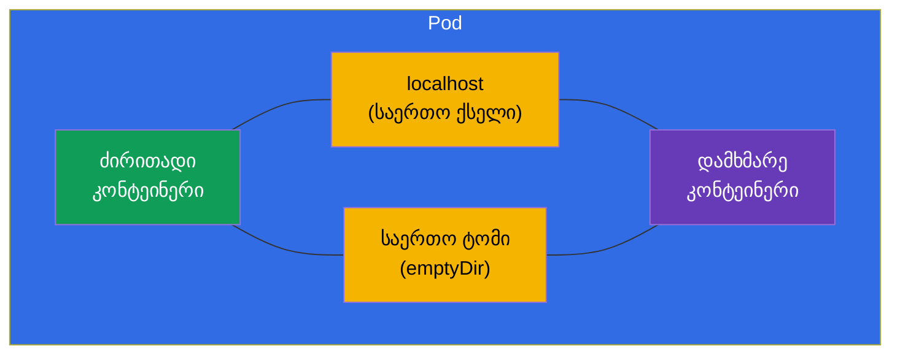
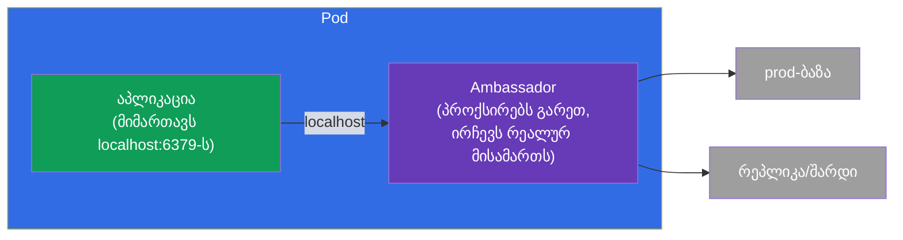
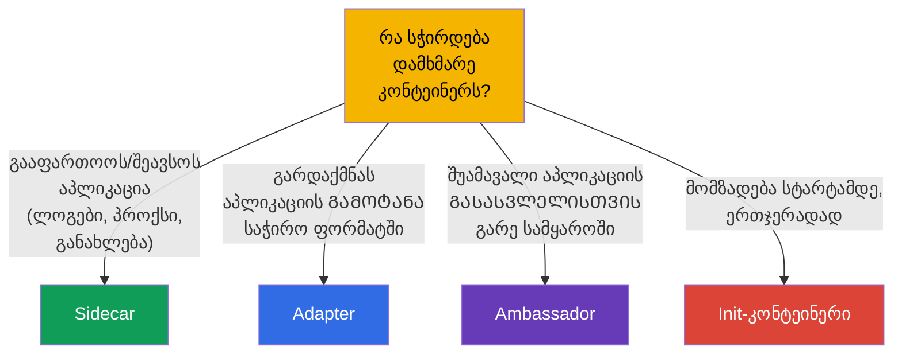

[Русская версия](ru.md) · [Eng version](README.md) · [Versión en español](es.md) · [Version française](fr.md) · [Deutsche Version](de.md) · [繁體中文版](tw.md) · [日本語版](jp.md)

# თავი 22. Multi-container Pod-ები: sidecar, adapter, ambassador, init

> 🟩 **თავი ორიენტირებულია CKAD-ზე** (დომენი Application Design). მაგრამ init-კონტეინერები და
> პატერნი sidecar სასარგებლოა გასაგებად CKA-სთვისაც.
>
> **რა იქნება შემდეგ.** თავ 4-ში ავითვისეთ: ჩვეულებრივ Pod-ში ერთი კონტეინერია, ხოლო რამდენიმე - მხოლოდ
> მჭიდროდ დაკავშირებული ამოცანებისთვის. ახლა ეს შემთხვევები დეტალურად გავარჩევთ. არის **init-კონტეინერები**
> (სრულდება ძირითადამდე) და სამი კლასიკური **დამხმარე კონტეინერების პატერნი** -
> sidecar, adapter, ambassador. საერთო რესურსი, რომელიც მათ შესაძლებელს ხდის, - Pod-ის საერთო ქსელი და
> ტომები (თავი 4). ეს CKAD-ის საყვარელი თემებიდან ერთია.

## 22.1. Init-კონტეინერები: მომზადება სტარტამდე

**Init-კონტეინერი** სრულდება Pod-ის ძირითად კონტეინერებამდე და უნდა წარმატებით
დასრულდეს, სანამ ისინი გაეშვებიან. ისინი შეიძლება რამდენიმეც იყოს - მიდიან მკაცრად
რიგრიგობით, ერთი მეორის მიყოლებით. თუ init-კონტეინერი დაეცა, Pod მას თავიდან უშვებს (restartPolicy-ის
მიხედვით) და შემდეგ არ მიდის.


```yaml
spec:
  initContainers:
  - name: wait-for-db
    image: busybox
    command: ['sh', '-c', 'until nc -z db 5432; do sleep 2; done']
  containers:
  - name: app
    image: myapp
```

რისთვის არის საჭირო init-კონტეინერები:

- **დამოკიდებულებების მოლოდინი** - დაველოდოთ, სანამ ბაზა ან სხვა სერვისი ამოვარდება.
- **მონაცემების მომზადება** - ჩამოვწეროთ კონფიგი, გამოვიყენოთ მიგრაცია, დავაგენერიროთ ფაილები
  საერთო ტომში.
- **უფლებების გამიჯვნა** - პრივილეგირებული მომზადება ცალკე შესრულდეს ძირითადი
  (არაპრივილეგირებული) კონტეინერისგან.

საკვანძო განსხვავება ჩვეულებრივი კონტეინერებისგან: init სრულდება **ერთხელ სტარტამდე** და უნდა
დასრულდეს; ძირითადი კონტეინერი მუდმივად მუშაობს.

## 22.2. Pod-ის საერთო რესურსები - პატერნების საფუძველი

ყველა multi-container პატერნი მუშაობს იმიტომ, რომ Pod-ის კონტეინერები იზიარებენ (თავი 4):

- **ქსელს** - საერთო IP და `localhost`: sidecar ხედავს ძირითად კონტეინერს `localhost:პორტი`-ზე;
- **ტომებს** - საერთო ტომი: ერთი კონტეინერი წერს ფაილს, მეორე კითხულობს.



სწორედ `localhost`-ისა და საერთო ტომის მეშვეობით თანამშრომლობენ დამხმარე კონტეინერები ძირითადთან.

## 22.3. Sidecar: დამხმარე აპლიკაციის გვერდით

**Sidecar** - დამხმარე კონტეინერი, რომელიც აფართოებს ან ავსებს ძირითადს, მისი
კოდის შეცვლის გარეშე. ყველაზე ხშირი პატერნი.


ტიპური sidecar:

- **ლოგების შეკრება** - აპლიკაცია წერს ლოგებს ფაილში (საერთო ტომი), sidecar კითხულობს და გზავნის
  ცენტრალიზებულ საცავში;
- **პროქსი** - sidecar (მაგალითად, Envoy service mesh-ში) იჭერს ქსელურ ტრაფიკს;
- **მონაცემების განახლება** - sidecar პერიოდულად ეზიდება ახალ კონტენტს საერთო ტომში.

> **„ნატიურ“ sidecar-კონტეინერებზე.** Kubernetes-ის თანამედროვე ვერსიებში გამოჩნდა
> ნამდვილი sidecar-კონტეინერები - ეს არის init-კონტეინერი `restartPolicy: Always`-ით. ასეთი
> კონტეინერი ეშვება ძირითადამდე, მაგრამ აგრძელებს მუშაობას Pod-ის სიცოცხლის მთელ განმავლობაში და კორექტულად
> სრულდება ძირითადის შემდეგ. ეს წყვეტს sidecar-ის გაშვების/გაჩერების რიგის ძველ პრობლემებს.
> იდეა ღირს იცოდეთ, მაგრამ ბაზისური პატერნი - ჩვეულებრივი დამატებითი კონტეინერია.

## 22.4. Adapter: გამოტანის საჭირო ფორმატში მოყვანა

**Adapter** („ადაპტერი“) სტანდარტიზებს ან გარდაქმნის აპლიკაციის გამოტანას, რომ გარე
სისტემამ გაიგოს იგი. აპლიკაცია გასცემს მონაცემებს საკუთარ ფორმატში, adapter კი მათ მოსალოდნელად
აქცევს.


კლასიკური მაგალითი: აპლიკაცია წერს მეტრიკებს საკუთარ ფორმატში, ხოლო Prometheus ელოდება თავისას.
Adapter-კონტეინერი კითხულობს აპლიკაციის მეტრიკებს და გასცემს მათ Prometheus-ის ფორმატში. აპლიკაციის
შეცვლა არ სჭირდება.

## 22.5. Ambassador: შუამავალი გარე სამყაროსთან

**Ambassador** („ელჩი“) - შუამავალი კონტეინერი, რომლის მეშვეობით ძირითადი აპლიკაცია
ურთიერთობს გარე სამყაროსთან. აპლიკაცია მიმართავს `localhost`-ს, ხოლო ambassador წყვეტს, სად
გადამისამართოს რეალურად მოთხოვნა (რომელ ბაზაში, შარდში, გარემოში).



აზრი: აპლიკაცია ყოველთვის მიმართავს მარტივ ლოკალურ მისამართს და არაფერი იცის გარე
სირთულეზე (შარდირება, გარემოების ცვლა, ხელახალი დაკავშირებები). Ambassador ამ
სირთულეს თავის თავზე იღებს.

## 22.6. პატერნების შედარება



| პატერნი | როლი | მიმართულება | მაგალითი |
|---------|------|-------------|--------|
| **Init** | მომზადება სტარტამდე | ძირითადამდე | დაველოდოთ ბაზას, მიგრაცია |
| **Sidecar** | ავსებს აპლიკაციას | პარალელურად | ლოგების შეკრება, პროქსი |
| **Adapter** | სტანდარტიზებს გამოტანას | გასასვლელი გარეთ | მეტრიკები → Prometheus-ის ფორმატი |
| **Ambassador** | შუამავალი გარეთ | გასასვლელი გარეთ | ლოკალური პროქსი გარე ბაზასთან |

Adapter და ambassador არსებითად sidecar-ის კერძო შემთხვევებია (ესეც დამხმარე კონტეინერებია), მაგრამ
განსხვავდებიან დანიშნულებით: adapter გარდაქმნის **გამავალ მონაცემებს/გამოტანას**, ambassador
პროქსირებს **გამავალ შეერთებებს**.

## 22.7. როგორ იყენებენ ამას პროდაქშენში

- **Sidecar - ყველაზე ცოცხალი პატერნი.** ლოგების შეკრება (Fluent Bit აპლიკაციის გვერდით), service mesh-ის
  პროქსი (Envoy - მთელი კურსი ICA ამაზეა), საიდუმლოების აგენტები (Vault Agent), მეტრიკების
  ექსპორტერები - ეს ყველაფერი sidecar-ია. ეს არის სტანდარტული ხერხი, დაამატო შესაძლებლობები აპლიკაციის
  კოდის შეხების გარეშე.
- **Init გაშვების რიგისა და მიგრაციებისთვის.** პროდში init-კონტეინერები ელოდებიან
  დამოკიდებულებების მზადყოფნას და ასრულებენ ბაზის სქემის მიგრაციებს აპლიკაციის სტარტამდე - რომ აპლიკაცია
  დროზე ადრე არ ამოვარდეს.
- **ნატიური sidecar (restartPolicy: Always init-თან).** sidecar-ის თანამედროვე მიდგომა
  წყვეტს ძველ პრობლემებს: sidecar გარანტირებულად მზადაა ძირითად კონტეინერამდე და კორექტულად
  სრულდება მის შემდეგ (მნიშვნელოვანია mesh-პროქსებისა და ლოგების შემკრებებისთვის graceful-გამორთვის დროს).
- **არ გადავამეტოთ.** ყოველი sidecar - ეს არის დამატებითი CPU/მეხსიერება ყოველ Pod-ზე და სირთულის
  ზრდა. პროდში აწონ-დაწონიან: ხანდახან უკეთესია ფუნქცია ცალკე სერვისში ან
  ნოუდის დონეზე (DaemonSet) გავიტანოთ, ვიდრე sidecar-ები გავამრავლოთ ყოველ Pod-ში.
- **Adapter/ambassador უფრო იშვიათია, მაგრამ სასარგებლო.** მათ იყენებენ ლეგასი-აპლიკაციების ინტეგრაციისას,
  რომელთა გადაწერა შეუძლებელია: adapter მათ გამოტანას სტანდარტში მოიყვანს, ambassador მალავს
  გარე შეერთებების სირთულეს.

### ქეისი: Pod init-კონტეინერითა და sidecar-ით

ავაწყოთ ტიპური Pod, სადაც ორივე პატერნია: **init-კონტეინერი** ამზადებს მონაცემებს სტარტამდე, ხოლო
**sidecar** თან ახლავს აპლიკაციას. სცენარი: init აგენერირებს საწყის გვერდს საერთო
ტომში, nginx მას არიგებს და წერს ლოგებს იმავე ტომში, ხოლო ნატიური sidecar-შემკრები კითხულობს ამ
ლოგებს. მთელი ურთიერთობა - საერთო `emptyDir`-ის მეშვეობით.

```yaml
apiVersion: v1
kind: Pod
metadata:
  name: web-with-helpers
spec:
  volumes:
  - name: content            # საერთო ტომი: საიტის კონტენტი
    emptyDir: {}
  - name: logs               # საერთო ტომი: აპლიკაციის ლოგები
    emptyDir: {}

  initContainers:
  # 1. ჩვეულებრივი init - სრულდება და ᲛᲗᲐᲕᲠᲓᲔᲑᲐ ძირითადის სტარტამდე
  - name: setup
    image: busybox:1.36
    command: ["sh", "-c", "echo '<h1>Hello from init</h1>' > /work/index.html"]
    volumeMounts:
    - name: content
      mountPath: /work

  # 2. ნატიური sidecar - init restartPolicy: Always-ით: ეშვება ძირითადამდე,
  #    მუშაობს Pod-ის სიცოცხლის მთელ განმავლობაში, სრულდება ძირითადის შემდეგ
  - name: log-shipper
    image: busybox:1.36
    restartPolicy: Always          # ← სწორედ ეს აქცევს init-კონტეინერს sidecar-ად
    command: ["sh", "-c", "tail -F /var/log/app/access.log"]
    volumeMounts:
    - name: logs
      mountPath: /var/log/app

  containers:
  # ძირითადი აპლიკაცია: არიგებს კონტენტს, წერს ლოგებს საერთო ტომში
  - name: nginx
    image: nginx:1.27
    volumeMounts:
    - name: content
      mountPath: /usr/share/nginx/html
    - name: logs
      mountPath: /var/log/nginx
```

გაშვების რიგი: `setup` (იმუშავა და გამოვიდა) → `log-shipper` (ამოვარდა როგორც sidecar და
რჩება) → `nginx`. ვამოწმებთ:

```bash
kubectl apply -f web-with-helpers.yaml
kubectl get pod web-with-helpers                       # Init:… → Running, როცა ყველაფერი ამოვარდა

# ძირითადისა და sidecar-ის ლოგებს ცალკე უყურებენ - კონტეინერის სახელით
kubectl logs web-with-helpers -c nginx
kubectl logs web-with-helpers -c log-shipper           # ვხედავთ access.log-ის სტრიქონებს, sidecar-ის მიერ შეკრებილს
```

ქეისის საკვანძო მომენტები:

- **Init vs sidecar - ერთი ველი.** ორივე ცხოვრობს `initContainers`-ში; sidecar განსხვავდება მხოლოდ
  `restartPolicy: Always`-ით. ჩვეულებრივი init ვალდებულია **დასრულდეს**, ხოლო sidecar **მუშაობს მთელი
  დროის განმავლობაში** და კორექტულად ჩერდება ძირითადი კონტეინერის შემდეგ (მნიშვნელოვანია ლოგების შემკრებებისა
  და mesh-პროქსებისთვის graceful-გამორთვის დროს).
- **გაცვლა ტომების მეშვეობით.** init და აპლიკაცია ურთიერთობენ ფაილებით საერთო `emptyDir`-ში (`content`),
  აპლიკაცია და sidecar - მეორე ტომის მეშვეობით (`logs`). ეს არის ზუსტად ის „Pod-ის საერთო რესურსები“
  22.2-იდან.
- **ლოგები კონტეინერების მიხედვით.** მრავალკონტეინერიან Pod-თან `kubectl logs` მოითხოვს `-c <სახელი>` -
  ხშირი წვრილმანი გამოცდაზე.

ადრე (ნატიურ sidecar-ებამდე) ლოგების შემკრებს დებდნენ `containers`-ში როგორც ჩვეულებრივ კონტეინერს;
პრობლემა დასრულებაში იყო - Pod-ის გაჩერებისას რიგი არ იყო გარანტირებული და sidecar შეიძლებოდა
აპლიკაციაზე ადრე დაცემულიყო. `restartPolicy: Always` init-თან ამას აწესრიგებს.

## 22.8. მინი-ლექსიკონი

- **Init-კონტეინერი** - კონტეინერი, რომელიც სრულდება ძირითადებამდე და ვალდებულია დასრულდეს.
- **Sidecar** - დამხმარე კონტეინერი, რომელიც ავსებს აპლიკაციას (ლოგები, პროქსი).
- **Adapter** - კონტეინერი, რომელიც გარდაქმნის აპლიკაციის გამოტანას საჭირო ფორმატში.
- **Ambassador** - შუამავალი კონტეინერი აპლიკაციის გამავალი შეერთებებისთვის.
- **საერთო ტომი (emptyDir)** - Pod-ის ტომი კონტეინერებს შორის ფაილების გაცვლისთვის.
- **localhost** - Pod-ის საერთო ქსელი, რომლის მეშვეობით კონტეინერები ერთმანეთს ხედავენ.
- **ნატიური sidecar** - init-კონტეინერი `restartPolicy: Always`-ით.

## 22.9. თავის შეჯამება

- Init-კონტეინერები სრულდებიან რიგრიგობით ძირითადებამდე და უნდა წარმატებით დასრულდნენ;
  საჭიროა დამოკიდებულებების მოლოდინისთვის, მონაცემების მომზადებისთვის, მიგრაციებისთვის.
- Multi-container პატერნები მუშაობს Pod-ის საერთო რესურსების ხარჯზე: `localhost` (ქსელი) და
  საერთო ტომი.
- Sidecar ავსებს აპლიკაციას პარალელურად (ლოგები, პროქსი, მონაცემების განახლება) - ყველაზე
  ხშირი პატერნი.
- Adapter გარდაქმნის აპლიკაციის გამოტანას საჭირო ფორმატში (მაგალითად, მეტრიკები
  Prometheus-ისთვის).
- Ambassador - შუამავალი გამავალი შეერთებებისთვის: აპლიკაცია მიმართავს localhost-ს, ელჩი
  წყვეტს, სად გადამისამართოს.
- ნატიური sidecar-კონტეინერები - ეს არის init `restartPolicy: Always`-ით, მუშაობენ Pod-ის სიცოცხლის
  მთელ განმავლობაში.

## 22.10. როგორ გამოგადგებათ: გამოცდაზე და რეალურ სამუშაოში

**გამოცდაზე (CKAD).** „დაამატე init-კონტეინერი, რომელიც ელოდება სერვისს“, „მოაწესრიგე sidecar,
რომელიც კითხულობს ლოგებს საერთო ტომიდან“, „განსაზღვრე, რომელი პატერნია ეს“ - Application Design
დომენის ტიპური დავალებებია. საჭიროა შეძლოთ დაწეროთ `initContainers`, საერთო `emptyDir`-ტომი და გესმოდეთ
პატერნების როლები.

**რეალურ სამუშაოში.** Sidecar - ყველგან გავრცელებული ხერხია აპლიკაციების გაფართოებისთვის (mesh, ლოგები,
საიდუმლოებები) კოდის შესწორების გარეშე. Init-კონტეინერები უზრუნველყოფენ გაშვების სწორ რიგსა და
მიგრაციებს. პატერნების გაგება ეხმარება Pod-ების გაცნობიერებულ დაპროექტებაში და კონტეინერების ზედმეტად
გამრავლების თავიდან არიდებაში, რესურსების დაზოგვით.

## 22.11. თვითშემოწმების კითხვები

1. რითი განსხვავდება init-კონტეინერი ჩვეულებრივისგან? რა მოხდება, თუ ის დაეცემა?
2. Pod-ის რომელი ორი საერთო რესურსი ხდის შესაძლებელს multi-container პატერნებს?
3. რას აკეთებს sidecar? მოიყვანეთ ორი მაგალითი.
4. რითი განსხვავდება adapter ambassador-ისგან დანიშნულებით?
5. რა არის „ნატიური“ sidecar და რომელ პრობლემას წყვეტს იგი?
6. რისთვის იყენებენ init-კონტეინერებს პროდში?
7. რატომ არ ღირს sidecar-კონტეინერებით გადამეტება?

## პრაქტიკა

გავარჩიეთ, როგორ არის მოწყობილი რთული Pod-ები. თავ 23-ში გადავალთ იმაზე, რისგან საერთოდ
კეთდება კონტეინერი, - იმიჯებსა და Dockerfile-ზე. Multi-container პატერნები მუშავდება
აპლიკაციების დიზაინის ლაბებში.

🧪 ლაბი 107 (multi-container Pod-ები: sidecar, init): [tasks/cka/labs/107](../../labs/107/README_GE.MD)

🎮 Killercoda (ბრაუზერში, ინსტალაციის გარეშე): [Create a Pod with emptyDir volume](https://killercoda.com/chadmcrowell/course/ckad/volumes) · [Logs from Sidecar](https://killercoda.com/chadmcrowell/course/ckad/kubectl-logs-sidecar) · [Ephemeral Debug Container](https://killercoda.com/chadmcrowell/course/ckad/kubectl-debug)

---
[სარჩევი](../README_GE.md) · [თავი 21](../21/ge.md) · [თავი 23](../23/ge.md)
