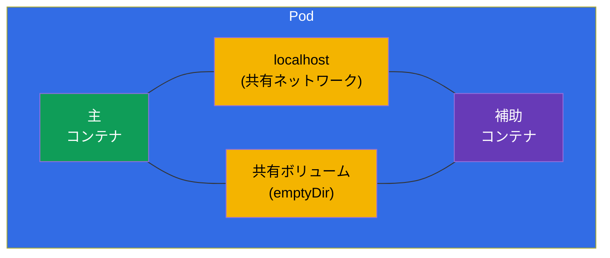
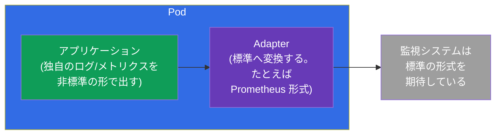
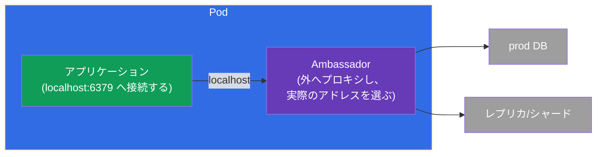
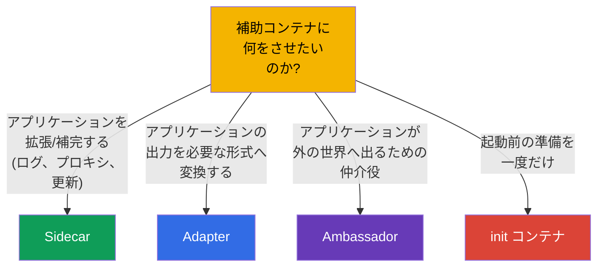

[Русская версия](ru.md) · [Eng version](README.md) · [Versión en español](es.md) · [Version française](fr.md) · [Deutsche Version](de.md) · [ქართული ვერსია](ge.md) · [繁體中文版](tw.md)

# 第 22 章。マルチコンテナ Pod：sidecar、adapter、ambassador、init

> 🟩 **この章は CKAD 向け** です（Application Design 領域）。ただし init コンテナと
> sidecar パターンは CKA のためにも理解しておく価値があります。
>
> **次はどこへ。** 第 4 章で私たちはこう学びました：ふつう Pod の中のコンテナは 1 つで、
> 複数にするのは密に結びついたタスクのときだけです。ここではそのケースを詳しく
> 見ていきます。**init コンテナ**（主コンテナより前に実行されるもの）と、3 つの古典的な
> **補助コンテナのパターン** - sidecar、adapter、ambassador があります。それらを
> 可能にしている共通のリソースが、Pod の共有ネットワークとボリューム（第 4 章）です。
> これは CKAD が好んで出すテーマの 1 つです。

## 22.1. init コンテナ：起動前の準備

**init コンテナ** は Pod の主コンテナより **前** に実行され、主コンテナが起動する前に
正常に終了しなければなりません。init コンテナは複数あってもよく、その場合は厳密に
順番どおり、1 つずつ実行されます。init コンテナが失敗した場合、Pod は（restartPolicy に
従って）それを再起動し、先へは進みません。


```yaml
spec:
  initContainers:
  - name: wait-for-db
    image: busybox
    command: ['sh', '-c', 'until nc -z db 5432; do sleep 2; done']
  containers:
  - name: app
    image: myapp
```

init コンテナが必要になる場面：

- **依存関係の待機** - DB や他のサービスが立ち上がるまで待つ。
- **データの準備** - 設定をダウンロードする、マイグレーションを適用する、共有ボリュームに
  ファイルを生成する。
- **権限の分離** - 特権が必要な準備作業を、主コンテナ（非特権）とは別に実行する。

通常のコンテナとの決定的な違い：init は **起動前に一度だけ** 実行され、終了しなければ
なりません。主コンテナは動き続けます。

## 22.2. Pod の共有リソース - パターンの土台

すべてのマルチコンテナパターンが機能するのは、Pod のコンテナが次を共有しているからです
（第 4 章）：

- **ネットワーク** - 共通の IP と `localhost`：sidecar は主コンテナを `localhost:ポート` で見られます。
- **ボリューム** - 共有ボリューム：一方のコンテナがファイルを書き、他方が読みます。



補助コンテナが主コンテナと協調して動くのは、まさにこの `localhost` と共有ボリュームを
通してです。

## 22.3. Sidecar：アプリケーションのそばにいる助手

**Sidecar** は、主コンテナのコードを変えずにそれを拡張したり補ったりする補助コンテナです。
もっとも頻繁に使われるパターンです。


典型的な sidecar：

- **ログ収集** - アプリケーションがファイル（共有ボリューム）にログを書き、sidecar が
  それを読んで集中ストレージへ送る。
- **プロキシ** - sidecar（たとえば service mesh の Envoy）がネットワークトラフィックを
  横取りする。
- **データの更新** - sidecar が定期的に最新のコンテンツを共有ボリュームに取り込む。

> **「ネイティブな」sidecar コンテナについて。** 最近の Kubernetes のバージョンでは
> 本物の sidecar コンテナが登場しました - それは `restartPolicy: Always` を持つ
> init コンテナです。このコンテナは主コンテナより先に起動しますが、Pod の生存期間中ずっと
> 動き続け、主コンテナのあとで正しく終了します。これは sidecar の起動/停止順序に関する
> 古くからの問題を解決します。この考え方は知っておく価値がありますが、基本のパターンは
> 通常の追加コンテナです。

## 22.4. Adapter：出力を必要な形式に整える

**Adapter**（「アダプター」）は、外部システムが理解できるようにアプリケーションの出力を
標準化したり変換したりします。アプリケーションは自分の形式でデータを出し、adapter が
それを期待される形式へ変えます。



古典的な例：アプリケーションは独自の形式でメトリクスを書くのに、Prometheus は自分の形式を
待っています。Adapter コンテナはアプリケーションのメトリクスを読み、Prometheus の形式で
提供します。アプリケーションを変える必要はありません。

## 22.5. Ambassador：外の世界への仲介役

**Ambassador**（「大使」）は仲介役のコンテナで、主アプリケーションはこれを通して外の世界と
やり取りします。アプリケーションは `localhost` へ接続し、リクエストを実際にどこへ
（どの DB、シャード、環境へ）送るかは ambassador が決めます。



要点：アプリケーションは常に単純なローカルアドレスへ接続し、外側の複雑さ（シャーディング、
環境の切り替え、再接続）を何も知りません。その複雑さは ambassador が引き受けます。

## 22.6. パターンの比較



| パターン | 役割 | 向き | 例 |
|---------|------|-------------|--------|
| **Init** | 起動前の準備 | 主コンテナより前 | DB を待つ、マイグレーション |
| **Sidecar** | アプリケーションを補完する | 並行して | ログ収集、プロキシ |
| **Adapter** | 出力を標準化する | 外向き | メトリクス → Prometheus 形式 |
| **Ambassador** | 外への仲介役 | 外向き | 外部 DB へのローカルプロキシ |

Adapter と ambassador は本質的には sidecar の特殊なケース（どちらも補助コンテナ）ですが、
目的が違います：adapter は **出ていくデータ/出力** を変換し、ambassador は
**出ていく接続** をプロキシします。

## 22.7. 本番環境でこれをどう使うか

- **Sidecar はもっとも生きているパターン。** ログ収集（アプリケーションの隣の Fluent Bit）、
  service mesh のプロキシ（Envoy - ICA コース全体がこれについてです）、シークレットの
  エージェント（Vault Agent）、メトリクスのエクスポーター - これらはすべて sidecar です。
  アプリケーションのコードに触れずに機能を足す標準的な方法です。
- **起動順序とマイグレーションのための init。** 本番では init コンテナが依存関係の準備完了を
  待ち、アプリケーションの起動前に DB スキーマのマイグレーションを実行します - アプリケーションが
  早すぎるタイミングで立ち上がらないようにするためです。
- **ネイティブ sidecar（init の restartPolicy: Always）。** sidecar への現代的な
  アプローチは長年の問題を解決します：sidecar は主コンテナより先に確実に準備が整い、
  主コンテナのあとで正しく終了します（graceful シャットダウン時の mesh プロキシや
  ログ収集にとって重要です）。
- **使いすぎないこと。** sidecar は 1 つごとに、Pod ごとの追加の CPU/メモリと複雑さの
  増加を意味します。本番では天秤にかけます：機能を別のサービスに切り出したり、ノードの
  レベル（DaemonSet）へ移したほうが、すべての Pod に sidecar を増やすよりよい場合が
  あります。
- **Adapter/ambassador は頻度は低いが役に立つ。** 書き直せないレガシーアプリケーションを
  統合するときに使われます：adapter はその出力を標準に合わせ、ambassador は外部接続の
  複雑さを隠します。

### ケース：init コンテナと sidecar を持つ Pod

両方のパターンがそろった典型的な Pod を組み立てましょう：**init コンテナ** が起動前に
データを準備し、**sidecar** がアプリケーションに付き添います。シナリオ：init が共有
ボリュームにスタートページを生成し、nginx がそれを配信して同じボリュームにログを書き、
ネイティブ sidecar の収集役がそのログを読みます。やり取りはすべて共有の `emptyDir` を
通します。

```yaml
apiVersion: v1
kind: Pod
metadata:
  name: web-with-helpers
spec:
  volumes:
  - name: content            # 共有ボリューム：サイトのコンテンツ
    emptyDir: {}
  - name: logs               # 共有ボリューム：アプリケーションのログ
    emptyDir: {}

  initContainers:
  # 1. 通常の init - 主コンテナの起動前に実行され、そして終了する
  - name: setup
    image: busybox:1.36
    command: ["sh", "-c", "echo '<h1>Hello from init</h1>' > /work/index.html"]
    volumeMounts:
    - name: content
      mountPath: /work

  # 2. ネイティブ sidecar - restartPolicy: Always を持つ init：主コンテナより先に起動し、
  #    Pod の生存期間中ずっと動き、主コンテナのあとで終了する
  - name: log-shipper
    image: busybox:1.36
    restartPolicy: Always          # ← これが init コンテナを sidecar にする
    command: ["sh", "-c", "tail -F /var/log/app/access.log"]
    volumeMounts:
    - name: logs
      mountPath: /var/log/app

  containers:
  # 主アプリケーション：コンテンツを配信し、共有ボリュームにログを書く
  - name: nginx
    image: nginx:1.27
    volumeMounts:
    - name: content
      mountPath: /usr/share/nginx/html
    - name: logs
      mountPath: /var/log/nginx
```

起動の順序：`setup`（実行して終了）→ `log-shipper`（sidecar として立ち上がり残る）→
`nginx`。確認します：

```bash
kubectl apply -f web-with-helpers.yaml
kubectl get pod web-with-helpers                       # Init:… → すべて立ち上がったら Running

# 主コンテナと sidecar のログは別々に - コンテナ名で指定して見る
kubectl logs web-with-helpers -c nginx
kubectl logs web-with-helpers -c log-shipper           # sidecar が集めた access.log の行が見える
```

このケースの要点：

- **init と sidecar の違いはフィールド 1 つ。** どちらも `initContainers` に置かれ、
  sidecar は `restartPolicy: Always` だけが違います。通常の init は **終了する** 義務が
  あり、sidecar は **ずっと動き続け**、主コンテナのあとで正しく停止します
  （graceful シャットダウン時のログ収集や mesh プロキシにとって重要です）。
- **ボリューム経由のやり取り。** init とアプリケーションは共有の `emptyDir`（`content`）の
  ファイルでやり取りし、アプリケーションと sidecar は 2 つめのボリューム（`logs`）を
  通します。これはまさに 22.2 の「Pod の共有リソース」です。
- **コンテナごとのログ。** マルチコンテナの Pod では `kubectl logs` に `-c <名前>` が
  必要です - 試験でよく出る細かい点です。

以前（ネイティブ sidecar が登場する前）は、ログ収集役を通常のコンテナとして `containers` に
置いていました。問題は終了時でした - Pod を停止するとき順序は保証されず、sidecar が
アプリケーションより先に落ちることがありました。init の `restartPolicy: Always` は
これを直します。

## 22.8. ミニ用語集

- **init コンテナ** - 主コンテナより前に実行され、終了する義務のあるコンテナ。
- **Sidecar** - アプリケーションを補完する補助コンテナ（ログ、プロキシ）。
- **Adapter** - アプリケーションの出力を必要な形式へ変換するコンテナ。
- **Ambassador** - アプリケーションの外向き接続のための仲介役コンテナ。
- **共有ボリューム (emptyDir)** - コンテナ間でファイルをやり取りするための Pod のボリューム。
- **localhost** - Pod の共有ネットワーク。これを通してコンテナは互いを見ます。
- **ネイティブ sidecar** - `restartPolicy: Always` を持つ init コンテナ。

## 22.9. 本章のまとめ

- init コンテナは主コンテナより前に順番どおり実行され、正常に終了しなければなりません。
  依存関係の待機、データの準備、マイグレーションのために必要です。
- マルチコンテナのパターンは Pod の共有リソース、すなわち `localhost`（ネットワーク）と
  共有ボリュームのおかげで機能します。
- Sidecar はアプリケーションを並行して補完します（ログ、プロキシ、データの更新）-
  もっとも頻繁なパターンです。
- Adapter はアプリケーションの出力を必要な形式へ変換します（たとえば Prometheus 向けの
  メトリクス）。
- Ambassador は外向き接続の仲介役です：アプリケーションは localhost へ接続し、大使が
  どこへ送るかを決めます。
- ネイティブ sidecar コンテナは `restartPolicy: Always` を持つ init であり、Pod の
  生存期間中ずっと動きます。

## 22.10. これがどう役に立つか：試験と実際の仕事で

**試験では (CKAD)。** 「サービスを待つ init コンテナを追加せよ」「共有ボリュームから
ログを読む sidecar を設定せよ」「これはどのパターンか答えよ」は Application Design 領域の
典型的な問題です。`initContainers` と共有の `emptyDir` ボリュームを書けること、そして
各パターンの役割を理解していることが必要です。

**実際の仕事では。** Sidecar は、コードを直さずにアプリケーションを拡張する
どこにでもある方法です（mesh、ログ、シークレット）。init コンテナは正しい起動順序と
マイグレーションを保証します。パターンを理解していると Pod を意識的に設計でき、
コンテナを増やしすぎずにリソースを節約できます。

## 22.11. 自己チェックの質問

1. init コンテナは通常のコンテナとどう違いますか？失敗したらどうなりますか？
2. マルチコンテナのパターンを可能にしている Pod の 2 つの共有リソースは何ですか？
3. sidecar は何をしますか？例を 2 つ挙げてください。
4. adapter は ambassador と目的の面でどう違いますか？
5. 「ネイティブな」sidecar とは何で、どんな問題を解決しますか？
6. 本番では init コンテナを何のために使いますか？
7. なぜ sidecar コンテナを使いすぎるべきではないのですか？

## 演習

複雑な Pod がどう組み立てられているかを見てきました。第 23 章では、そもそもコンテナが
何から作られるのか - イメージと Dockerfile へ進みます。マルチコンテナのパターンは
アプリケーション設計のラボで練習します。

🧪 ラボ 107（マルチコンテナ Pod：sidecar、init）：[tasks/cka/labs/107](../../labs/107/README_JP.MD)

---
[目次](../README_JP.md) · [第 21 章](../21/jp.md) · [第 23 章](../23/jp.md)
