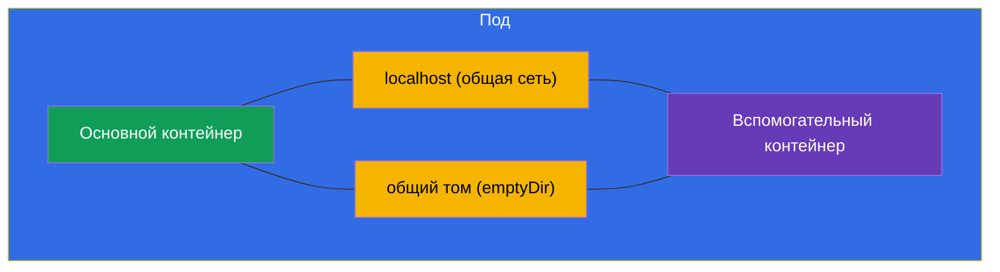
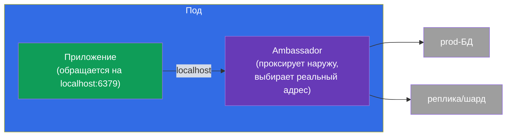
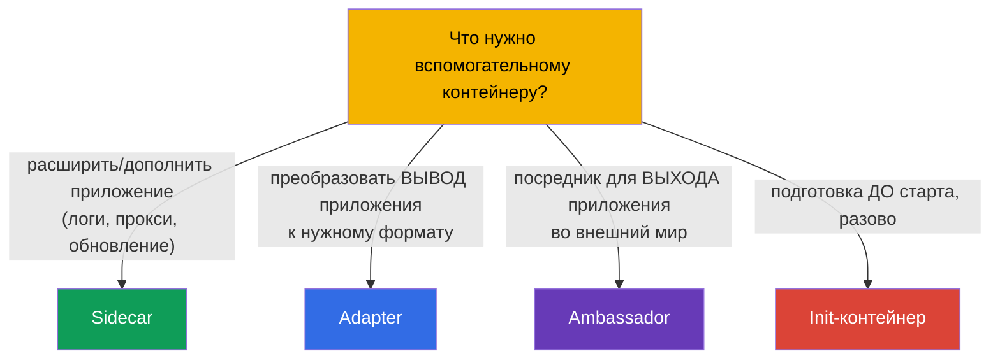

# Глава 22. Multi-container поды: sidecar, adapter, ambassador, init

> 🟩 **Глава ориентирована на CKAD** (домен Application Design). Но init-контейнеры и
> паттерн sidecar полезно понимать и для CKA.
>
> **Что дальше.** В главе 4 мы усвоили: обычно в поде один контейнер, а несколько - только
> для тесно связанных задач. Теперь разберём эти случаи детально. Есть **init-контейнеры**
> (выполняются до основного) и три классических **паттерна вспомогательных контейнеров** -
> sidecar, adapter, ambassador. Общий ресурс, который делает их возможными, - общая сеть и
> тома пода (глава 4). Это одна из любимых тем CKAD.

## 22.1. Init-контейнеры: подготовка перед стартом

**Init-контейнер** выполняется **до** основных контейнеров пода и должен успешно
завершиться, прежде чем они запустятся. Их может быть несколько - они идут строго по
очереди, один за другим. Если init-контейнер упал, под перезапускает его (по
restartPolicy) и не идёт дальше.


```yaml
spec:
  initContainers:
  - name: wait-for-db
    image: busybox
    command: ['sh', '-c', 'until nc -z db 5432; do sleep 2; done']
  containers:
  - name: app
    image: myapp
```

Для чего нужны init-контейнеры:

- **Ожидание зависимостей** - дождаться, пока поднимется БД или другой сервис.
- **Подготовка данных** - скачать конфиг, применить миграцию, сгенерировать файлы в
  общий том.
- **Разделение прав** - выполнить привилегированную подготовку отдельно от основного
  (непривилегированного) контейнера.

Ключевое отличие от обычных контейнеров: init выполняется **один раз до старта** и должен
завершиться; основной контейнер работает постоянно.

## 22.2. Общие ресурсы пода - основа паттернов

Все multi-container паттерны работают, потому что контейнеры пода делят (глава 4):

- **сеть** - общий IP и `localhost`: sidecar видит основной контейнер по `localhost:порт`;
- **тома** - общий том: один контейнер пишет файл, другой читает.



Именно через `localhost` и общий том вспомогательные контейнеры сотрудничают с основным.

## 22.3. Sidecar: помощник рядом с приложением

**Sidecar** - вспомогательный контейнер, который расширяет или дополняет основной, не
меняя его код. Самый частый паттерн.


Типичные sidecar:

- **сбор логов** - приложение пишет логи в файл (общий том), sidecar читает и отправляет
  в централизованное хранилище;
- **прокси** - sidecar (например, Envoy в service mesh) перехватывает сетевой трафик;
- **обновление данных** - sidecar периодически подтягивает свежий контент в общий том.

> **Про «нативные» sidecar-контейнеры.** В современных версиях Kubernetes появились
> настоящие sidecar-контейнеры - это init-контейнер с `restartPolicy: Always`. Такой
> контейнер стартует до основного, но продолжает работать всё время жизни пода и корректно
> завершается после основного. Это решает старые проблемы порядка запуска/остановки
> sidecar. Идею стоит знать, но базовый паттерн - обычный дополнительный контейнер.

## 22.4. Adapter: приведение вывода к нужному формату

**Adapter** («адаптер») стандартизирует или преобразует вывод приложения, чтобы внешняя
система его поняла. Приложение выдаёт данные в своём формате, adapter превращает их в
ожидаемый.


Классический пример: приложение пишет метрики в своём формате, а Prometheus ждёт свой.
Adapter-контейнер читает метрики приложения и отдаёт их в формате Prometheus. Приложение
менять не надо.

## 22.5. Ambassador: посредник к внешнему миру

**Ambassador** («посол») - контейнер-посредник, через который основное приложение
общается с внешним миром. Приложение обращается на `localhost`, а ambassador решает, куда
на самом деле направить запрос (в какую БД, шард, окружение).



Смысл: приложение всегда ходит на простой локальный адрес и ничего не знает о внешней
сложности (шардирование, смена окружений, повторные подключения). Ambassador берёт эту
сложность на себя.

## 22.6. Сравнение паттернов



| Паттерн | Роль | Направление | Пример |
|---------|------|-------------|--------|
| **Init** | подготовка до старта | до основного | дождаться БД, миграция |
| **Sidecar** | дополняет приложение | параллельно | сбор логов, прокси |
| **Adapter** | стандартизирует вывод | выход наружу | метрики → формат Prometheus |
| **Ambassador** | посредник вовне | выход наружу | локальный прокси к внешней БД |

Adapter и ambassador по сути частные случаи sidecar (тоже вспомогательные контейнеры), но
различаются назначением: adapter преобразует **исходящие данные/вывод**, ambassador
проксирует **исходящие соединения**.

## 22.7. Как это применяют в продакшене

- **Sidecar - самый живой паттерн.** Сбор логов (Fluent Bit рядом с приложением), прокси
  service mesh (Envoy - весь курс ICA про это), агенты секретов (Vault Agent), экспортёры
  метрик - всё это sidecar. Это стандартный способ добавить возможности, не трогая код
  приложения.
- **Init для порядка запуска и миграций.** В проде init-контейнеры ждут готовности
  зависимостей и выполняют миграции схемы БД перед стартом приложения - чтобы приложение
  не поднялось раньше времени.
- **Нативные sidecar (restartPolicy: Always у init).** Современный подход к sidecar
  решает давние проблемы: sidecar гарантированно готов до основного контейнера и корректно
  завершается после него (важно для mesh-прокси и сборщиков логов при graceful-выключении).
- **Не злоупотреблять.** Каждый sidecar - это доп. CPU/память на каждый под и рост
  сложности. В проде взвешивают: иногда лучше вынести функцию в отдельный сервис или на
  уровень ноды (DaemonSet), чем плодить sidecar в каждом поде.
- **Adapter/ambassador реже, но полезны.** Их применяют при интеграции легаси-приложений,
  которые нельзя переписать: adapter приводит их вывод к стандарту, ambassador прячет
  сложность внешних подключений.

## 22.8. Мини-глоссарий

- **Init-контейнер** - контейнер, выполняющийся до основных и обязанный завершиться.
- **Sidecar** - вспомогательный контейнер, дополняющий приложение (логи, прокси).
- **Adapter** - контейнер, преобразующий вывод приложения к нужному формату.
- **Ambassador** - контейнер-посредник для исходящих соединений приложения.
- **Общий том (emptyDir)** - том пода для обмена файлами между контейнерами.
- **localhost** - общая сеть пода, через которую контейнеры видят друг друга.
- **Нативный sidecar** - init-контейнер с `restartPolicy: Always`.

## 22.9. Итоги главы

- Init-контейнеры выполняются по очереди до основных и должны успешно завершиться;
  нужны для ожидания зависимостей, подготовки данных, миграций.
- Multi-container паттерны работают за счёт общих ресурсов пода: `localhost` (сеть) и
  общий том.
- Sidecar дополняет приложение параллельно (логи, прокси, обновление данных) - самый
  частый паттерн.
- Adapter преобразует вывод приложения к нужному формату (например, метрики для
  Prometheus).
- Ambassador - посредник для исходящих соединений: приложение ходит на localhost, посол
  решает, куда направить.
- Нативные sidecar-контейнеры - это init с `restartPolicy: Always`, работают всё время
  жизни пода.

## 22.10. Как это пригодится: на экзамене и в реальной работе

**На экзамене (CKAD).** «Добавь init-контейнер, который ждёт сервис», «настрой sidecar,
читающий логи из общего тома», «определи, какой это паттерн» - типовые задания домена
Application Design. Нужно уметь писать `initContainers`, общий `emptyDir`-том и понимать
роли паттернов.

**В реальной работе.** Sidecar - повсеместный способ расширять приложения (mesh, логи,
секреты) без правки кода. Init-контейнеры обеспечивают правильный порядок запуска и
миграции. Понимание паттернов помогает проектировать поды осознанно и не злоупотреблять
контейнерами, экономя ресурсы.

## 22.11. Вопросы для самопроверки

1. Чем init-контейнер отличается от обычного? Что будет, если он упадёт?
2. Какие два общих ресурса пода делают возможными multi-container паттерны?
3. Что делает sidecar? Приведите два примера.
4. Чем adapter отличается от ambassador по назначению?
5. Что такое «нативный» sidecar и какую проблему он решает?
6. Для чего применяют init-контейнеры в проде?
7. Почему не стоит злоупотреблять sidecar-контейнерами?

## Практика

Мы разобрали, как устроены сложные поды. В главе 23 перейдём к тому, из чего вообще
делается контейнер, - к образам и Dockerfile. Multi-container паттерны отрабатываются в
лабах по дизайну приложений.

🧪 Лаба 107 (multi-container поды: sidecar, init): [tasks/cka/labs/107](../../labs/107/README_RU.MD)

---
[Оглавление](../README_RU.md) · [Глава 21](../21/ru.md) · [Глава 23](../23/ru.md)
