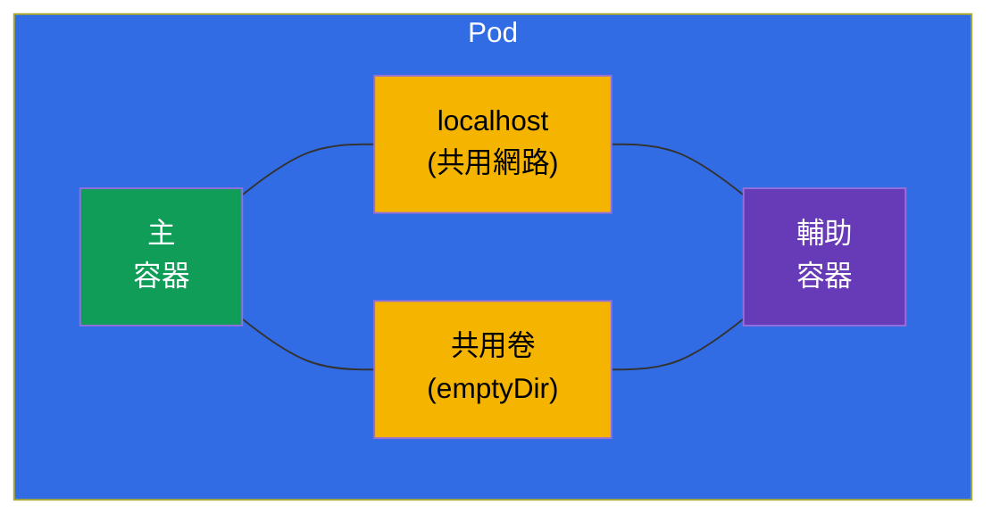
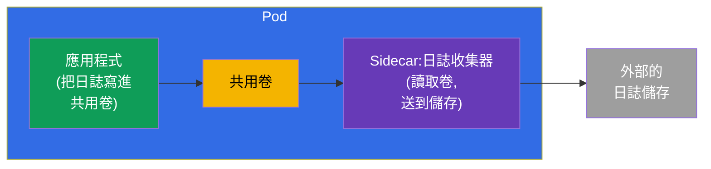
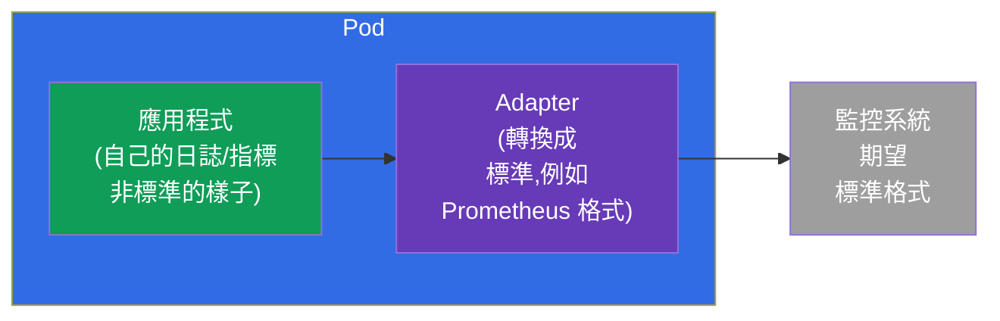
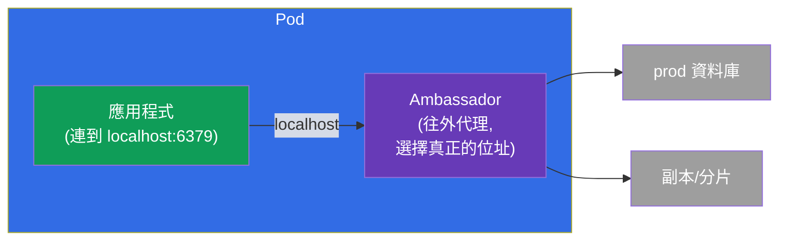
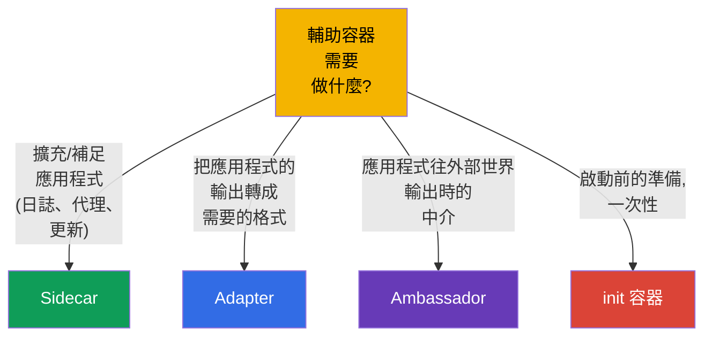

[Русская версия](ru.md) · [Eng version](README.md) · [Versión en español](es.md) · [Version française](fr.md) · [Deutsche Version](de.md) · [ქართული ვერსია](ge.md) · [日本語版](jp.md)

# 第 22 章。Multi-container Pod:sidecar、adapter、ambassador、init

> 🟩 **本章面向 CKAD**(Application Design 領域)。但 init 容器與
> sidecar 模式對 CKA 也值得理解。
>
> **接下來是什麼。** 在第 4 章我們學到:通常一個 Pod 裡只有一個容器,而多個 -
> 只用在關係緊密的任務上。現在我們來詳細拆解這些情況。有 **init 容器**
> (在主容器之前執行)以及三個經典的 **輔助容器模式** - sidecar、adapter、
> ambassador。讓它們成為可能的共用資源,就是 Pod 的共用網路與
> 卷(第 4 章)。這是 CKAD 最愛的主題之一。

## 22.1. init 容器:啟動前的準備

**init 容器** 在 Pod 的主容器 **之前** 執行,而且必須成功結束,主容器才會
啟動。它們可以有好幾個 - 嚴格按照順序,一個接一個。如果 init 容器掛了,
Pod 會重啟它(依照 restartPolicy),並且不會往下走。


```yaml
spec:
  initContainers:
  - name: wait-for-db
    image: busybox
    command: ['sh', '-c', 'until nc -z db 5432; do sleep 2; done']
  containers:
  - name: app
    image: myapp
```

init 容器有什麼用:

- **等待依賴** - 等到資料庫或其他服務起來。
- **準備資料** - 下載設定、套用遷移、在共用卷裡產生檔案。
- **權限分離** - 把需要特權的準備工作,跟主要的(非特權)容器分開
  執行。

與普通容器的關鍵差別是:init **在啟動前執行一次** 並且必須結束;主容器
則持續運作。

## 22.2. Pod 的共用資源 - 各種模式的基礎

所有 multi-container 模式之所以行得通,是因為 Pod 的容器共用了(第 4 章):

- **網路** - 共用的 IP 與 `localhost`:sidecar 透過 `localhost:埠` 看到主容器;
- **卷** - 共用的卷:一個容器寫檔案,另一個讀。



正是透過 `localhost` 與共用卷,輔助容器才能跟主容器合作。

## 22.3. Sidecar:應用程式旁邊的幫手

**Sidecar** - 擴充或補足主容器的輔助容器,而且不用改動它的程式碼。這是
最常見的模式。



典型的 sidecar:

- **收集日誌** - 應用程式把日誌寫進檔案(共用卷),sidecar 讀取它並送到
  集中式儲存;
- **代理** - sidecar(例如 service mesh 裡的 Envoy)攔截網路流量;
- **更新資料** - sidecar 週期性地把新鮮內容拉進共用卷。

> **關於「原生」sidecar 容器。** 在現代版本的 Kubernetes 裡出現了真正的
> sidecar 容器 - 也就是帶 `restartPolicy: Always` 的 init 容器。這樣的容器
> 會在主容器之前啟動,但在 Pod 的整個生命期都持續運作,並且在主容器之後
> 正確結束。這解決了 sidecar 啟動/停止順序的老問題。這個想法值得知道,
> 但基本模式仍然是普通的額外容器。

## 22.4. Adapter:把輸出整理成需要的格式

**Adapter**(「轉接器」)把應用程式的輸出標準化或轉換,讓外部系統能看懂它。
應用程式用自己的格式產生資料,adapter 把它變成對方期望的格式。



經典的例子:應用程式用自己的格式寫指標,而 Prometheus 等的是它自己的格式。
Adapter 容器讀取應用程式的指標,並用 Prometheus 的格式提供出去。應用程式
不用改。

## 22.5. Ambassador:通往外部世界的中介

**Ambassador**(「大使」)- 一個中介容器,主應用程式透過它跟外部世界
溝通。應用程式連到 `localhost`,而 ambassador 決定實際上要把請求送去哪裡
(哪個資料庫、分片、環境)。



意義在於:應用程式永遠只連一個簡單的本機位址,對外部的複雜性
(分片、環境切換、重新連線)一無所知。Ambassador 把這份複雜性接了下來。

## 22.6. 模式比較



| 模式 | 角色 | 方向 | 例子 |
|---------|------|-------------|--------|
| **Init** | 啟動前的準備 | 在主容器之前 | 等資料庫、遷移 |
| **Sidecar** | 補足應用程式 | 並行 | 收集日誌、代理 |
| **Adapter** | 標準化輸出 | 往外輸出 | 指標 → Prometheus 格式 |
| **Ambassador** | 往外的中介 | 往外輸出 | 連到外部資料庫的本機代理 |

Adapter 與 ambassador 本質上是 sidecar 的特例(也是輔助容器),但用途
不同:adapter 轉換 **往外送的資料/輸出**,ambassador 代理 **往外的連線**。

## 22.7. 這在生產環境中如何應用

- **Sidecar - 最活躍的模式。** 收集日誌(Fluent Bit 放在應用程式旁邊)、
  service mesh 的代理(Envoy - 整個 ICA 課程都在講這個)、祕密代理程式
  (Vault Agent)、指標 exporter - 這些全都是 sidecar。這是不動應用程式
  程式碼就加上功能的標準做法。
- **Init 用在啟動順序與遷移上。** 在生產環境裡,init 容器會等待依賴就緒,
  並在應用程式啟動之前執行資料庫 schema 遷移 - 這樣應用程式才不會太早
  起來。
- **原生 sidecar(init 的 restartPolicy: Always)。** 現代的 sidecar 做法
  解決了長久以來的問題:sidecar 保證在主容器之前就緒,並且在它之後正確
  結束(對 mesh 代理與日誌收集器在 graceful 關機時很重要)。
- **不要濫用。** 每個 sidecar 都是每個 Pod 額外的 CPU/記憶體,以及複雜度
  的增加。生產環境會權衡:有時候把功能搬到獨立的服務,或搬到節點層級
  (DaemonSet),比在每個 Pod 裡都塞 sidecar 更好。
- **Adapter/ambassador 比較少見,但很有用。** 它們用在整合那些不能重寫的
  legacy 應用程式:adapter 把它們的輸出整理成標準,ambassador 藏起外部
  連線的複雜性。

### 案例:帶 init 容器與 sidecar 的 Pod

我們來組一個典型的 Pod,兩個模式都有:**init 容器** 在啟動前準備資料,而
**sidecar** 陪著應用程式。情境是:init 在共用卷裡產生起始頁面,nginx 把它
發出去並把日誌寫進同一個卷,而原生的 sidecar 收集器讀取這些日誌。所有
溝通都透過共用的 `emptyDir`。

```yaml
apiVersion: v1
kind: Pod
metadata:
  name: web-with-helpers
spec:
  volumes:
  - name: content            # 共用卷:網站內容
    emptyDir: {}
  - name: logs               # 共用卷:應用程式日誌
    emptyDir: {}

  initContainers:
  # 1. 普通的 init - 在主容器啟動之前執行並且會「結束」
  - name: setup
    image: busybox:1.36
    command: ["sh", "-c", "echo '<h1>Hello from init</h1>' > /work/index.html"]
    volumeMounts:
    - name: content
      mountPath: /work

  # 2. 原生 sidecar - 帶 restartPolicy: Always 的 init:在主容器之前啟動,
  #    在 Pod 的整個生命期運作,並在主容器之後結束
  - name: log-shipper
    image: busybox:1.36
    restartPolicy: Always          # ← 正是這個讓 init 容器變成 sidecar
    command: ["sh", "-c", "tail -F /var/log/app/access.log"]
    volumeMounts:
    - name: logs
      mountPath: /var/log/app

  containers:
  # 主應用程式:發布內容,把日誌寫進共用卷
  - name: nginx
    image: nginx:1.27
    volumeMounts:
    - name: content
      mountPath: /usr/share/nginx/html
    - name: logs
      mountPath: /var/log/nginx
```

啟動順序:`setup`(跑完就退出)→ `log-shipper`(以 sidecar 的身分起來並且
留著)→ `nginx`。我們來檢查:

```bash
kubectl apply -f web-with-helpers.yaml
kubectl get pod web-with-helpers                       # Init:… → Running,當全部都起來時

# 主容器與 sidecar 的日誌分開看 - 用容器名稱
kubectl logs web-with-helpers -c nginx
kubectl logs web-with-helpers -c log-shipper           # 看到 sidecar 收集到的 access.log 各行
```

這個案例的關鍵點:

- **Init 與 sidecar - 同一個欄位。** 兩者都住在 `initContainers` 裡;
  sidecar 唯一的差別就是 `restartPolicy: Always`。普通的 init 必須
  **結束**,而 sidecar **一直運作**,並且在主容器之後正確停下來(對日誌
  收集器與 mesh 代理在 graceful 關機時很重要)。
- **透過卷交換。** Init 與應用程式用共用 `emptyDir`(`content`)裡的檔案
  溝通,應用程式與 sidecar 則透過第二個卷(`logs`)。這正好就是 22.2 裡
  那些「Pod 的共用資源」。
- **日誌按容器看。** 多容器的 Pod 用 `kubectl logs` 需要 `-c <名稱>` -
  這是考試中常見的小細節。

以前(在原生 sidecar 出現之前)日誌收集器是當成普通容器放進 `containers`
的;問題出在結束的時候 - Pod 停止時順序沒有保證,sidecar 可能比應用程式
先掛掉。init 的 `restartPolicy: Always` 修好了這件事。

## 22.8. 迷你詞彙表

- **init 容器** - 在主容器之前執行、而且必須結束的容器。
- **Sidecar** - 補足應用程式的輔助容器(日誌、代理)。
- **Adapter** - 把應用程式的輸出轉成需要格式的容器。
- **Ambassador** - 應用程式往外連線用的中介容器。
- **共用卷(emptyDir)** - Pod 的卷,用來在容器之間交換檔案。
- **localhost** - Pod 的共用網路,容器透過它看到彼此。
- **原生 sidecar** - 帶 `restartPolicy: Always` 的 init 容器。

## 22.9. 本章總結

- init 容器在主容器之前依序執行,而且必須成功結束;用來等待依賴、
  準備資料、做遷移。
- multi-container 模式能運作,靠的是 Pod 的共用資源:`localhost`(網路)與
  共用卷。
- Sidecar 並行地補足應用程式(日誌、代理、更新資料)- 這是最常見的
  模式。
- Adapter 把應用程式的輸出轉成需要的格式(例如給 Prometheus 的指標)。
- Ambassador - 往外連線的中介:應用程式連 localhost,大使決定要送去
  哪裡。
- 原生 sidecar 容器就是帶 `restartPolicy: Always` 的 init,在 Pod 的整個
  生命期都運作。

## 22.10. 這些知識用在哪裡:考試與實際工作

**在考試中(CKAD)。** 「加一個等待服務的 init 容器」、「設定一個從共用卷
讀日誌的 sidecar」、「判斷這是哪一種模式」- 都是 Application Design 領域的
典型題目。需要會寫 `initContainers`、共用的 `emptyDir` 卷,並理解各模式的
角色。

**在實際工作中。** Sidecar 是到處都在用的手段,可以不改程式碼就擴充應用
程式(mesh、日誌、祕密)。init 容器保證正確的啟動順序與遷移。理解這些模式
能幫你有意識地設計 Pod,不濫用容器,節省資源。

## 22.11. 自我檢查問題

1. init 容器跟普通容器有什麼不同?如果它掛了會怎樣?
2. 哪兩個 Pod 的共用資源讓 multi-container 模式成為可能?
3. sidecar 做什麼?請舉兩個例子。
4. adapter 與 ambassador 在用途上有什麼不同?
5. 什麼是「原生」sidecar,它解決了什麼問題?
6. 生產環境中為什麼要用 init 容器?
7. 為什麼不該濫用 sidecar 容器?

## 實踐

我們拆解了複雜的 Pod 是怎麼構成的。第 23 章會轉到容器到底是用什麼做出來
的 - 也就是映像與 Dockerfile。Multi-container 模式會在應用程式設計相關的
實驗中操練。

🧪 實驗 107(multi-container Pod:sidecar、init):[tasks/cka/labs/107](../../labs/107/README_TW.MD)

---
[目錄](../README_TW.md) · [第 21 章](../21/tw.md) · [第 23 章](../23/tw.md)
