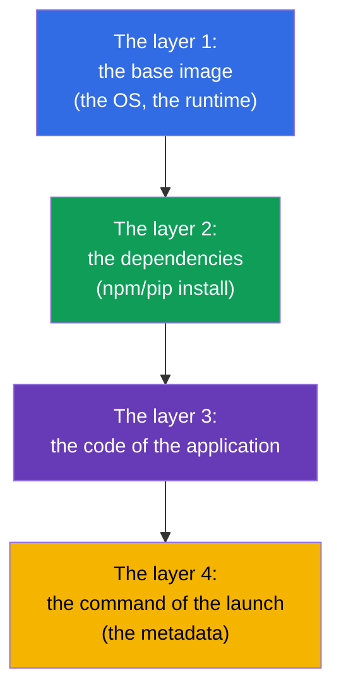
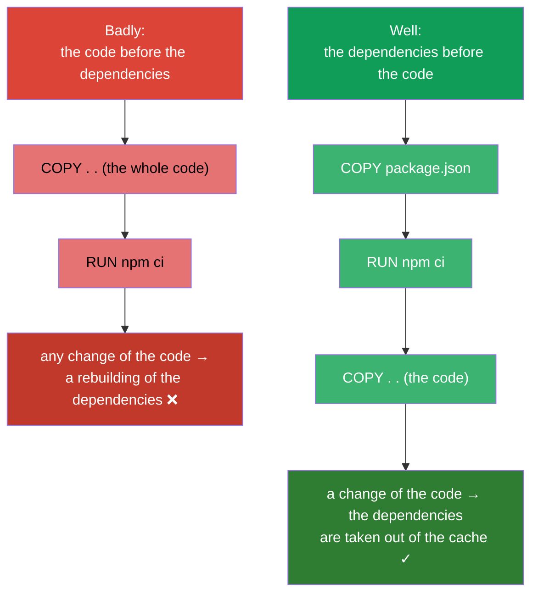
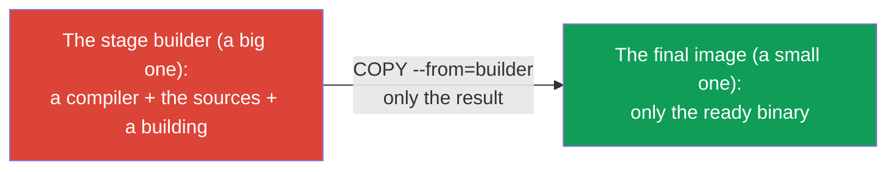
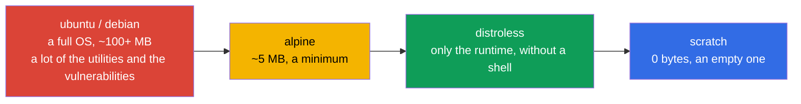
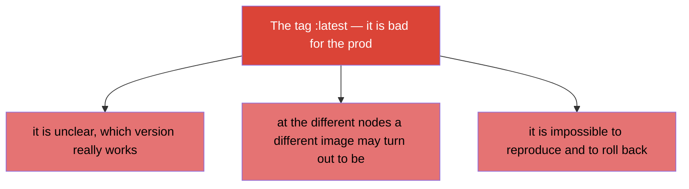

[Русская версия](ru.md) · [Versión en español](es.md) · [Version française](fr.md) · [Deutsche Version](de.md) · [ქართული ვერსია](ge.md) · [繁體中文版](tw.md) · [日本語版](jp.md)

# Chapter 23. The images of the containers: a building, a Dockerfile, an optimization

> 🟩 **The chapter is for the CKAD** (the domain Application Design and Build). On the CKA a building of the
> images is not asked, but an understanding of the images is useful to everyone.
>
> **What comes next.** We have launched the containers out of the ready images a lot (`nginx`, `busybox`).
> Now let us figure out, what an image consists of, how to build it out of a Dockerfile and how to make it
> small and safe. The CKAD in the domain Design and Build checks an ability "to determine,
> to build and to modify an image". An understanding of the layers and of the optimization directly influences the
> speed of the rollout, the cost of the storage and the safety.

## 23.1. What an image and the layers are

**An image of a container** is the file system of an application, its dependencies and the metadata
(what to launch), packed together. An image consists of **the layers (layers)**: every
layer is a set of the changes of the file system, imposed over the previous one.



The key properties of the layers:

- **The layers are cached and reused.** If a base layer has not changed, upon a building it
  is taken out of the cache - the building is faster and there is less traffic.
- **The layers are common between the images.** If two images are based on one base one, the layer is stored
  once.
- **An image is unchangeable (immutable).** A launched container adds over the image a thin
  **writable layer**; upon a deletion of the container it disappears. The image itself does not change.

## 23.2. A Dockerfile: the recipe of an image

**A Dockerfile** is a text file with the instructions of the building. Every instruction (usually) creates
a layer.

```dockerfile
FROM node:20-alpine           # a base image
WORKDIR /app                  # a working directory
COPY package*.json ./         # at first the dependencies (for the cache)
RUN npm ci --production        # an installation of the dependencies — a separate layer
COPY . .                      # then the code of the application
EXPOSE 3000                   # it documents a port
USER node                     # a launch from under an unprivileged user
CMD ["node", "server.js"]     # what to launch
```

The main instructions:

| The instruction | The purpose |
|-----------|-----------|
| `FROM` | a base image (with what to start) |
| `RUN` | to execute a command upon the building (it creates a layer) |
| `COPY` / `ADD` | to copy the files into an image |
| `WORKDIR` | to set a working directory |
| `ENV` | an environment variable in an image |
| `EXPOSE` | to document a port (it does not open it) |
| `USER` | from under which user to launch |
| `ENTRYPOINT` / `CMD` | what and with which arguments to launch (the chapter 17) |

## 23.3. The order of the instructions and the cache of the layers

The most important practical skill is **a correct order of the instructions for the sake of the cache**. Docker
caches the layers from top to bottom and rebuilds everything, beginning from the first changed instruction.
It means, what changes rarely is put higher, what changes often - lower.



The classical trick (it is seen in the example above): at first `COPY package.json` + `RUN install`,
then `COPY . .` with the code. Then upon a change of only the code the layer of the dependencies is taken out of the
cache, and the building goes many times faster.

## 23.4. A multi-stage build: the small images

The big images are pulled slowly, are stored expensively and carry more vulnerabilities.
**A multi-stage build** allows to build an application in a "fat" image (with a compiler, the
instruments), and to put into the final image only the result - without anything extra.

```dockerfile
# The stage of the building — here there is a compiler and all the needed
FROM golang:1.22 AS builder
WORKDIR /src
COPY . .
RUN go build -o /app/server .

# The final stage — only the binary, without a compiler
FROM alpine:3.20
COPY --from=builder /app/server /server
CMD ["/server"]
```



The result: the final image contains only the executable file and a minimum of the environment - instead of
the hundreds of the megabytes of the compiler and of the dependencies of the building.

## 23.5. A choice of the base image: the size and the safety

A base image determines the size and the surface of an attack. A reference point from a "heavy" one to a "light" one:



| The base image | The size | The pluses | The minuses |
|---------------|--------|-------|--------|
| `ubuntu`/`debian` | a big one | it is habitual, everything is there | a lot of the extra, of the vulnerabilities |
| `alpine` | ~5 MB | a compact one | another libc (musl), sometimes an incompatibility |
| `distroless` | a small one | only the runtime, there is no shell - it is safer | it is more difficult to debug (there is no `sh`) |
| `scratch` | 0 | an absolute minimum | it suits only the static binaries (Go) |

A smaller image = a faster rollout, less space, a smaller surface of an attack. The reverse side of
distroless/scratch is an absence of the `sh` for a debugging (here a `kubectl debug` with the
ephemeral containers helps out, the chapter 29).

## 23.6. The tag of an image and the imagePullPolicy

**A tag** identifies a version of an image: `nginx:1.27`. A separate topic is the tag `latest` and
the policy of the downloading.



The `imagePullPolicy` determines, when to pull an image:

| The value | The behaviour | By default when |
|----------|-----------|--------------------|
| `IfNotPresent` | to pull only if it is not there locally | for the images with a concrete tag |
| `Always` | to pull upon every start | for the tag `latest` or without a tag |
| `Never` | never to pull (only a local one) | - |

The rule of the prod: **always a concrete tag** (better - an unchangeable digest `@sha256:...`),
never a `latest`, in order to know for sure and to reproduce, what is launched.

## 23.7. The registries of the images and a private access

The images are stored in **the registries**: Docker Hub, GitHub Container Registry, the cloud ones (ECR,
GCR, ACR), the private ones (Harbor). The public ones are pulled without an authentication, for the private ones an
`imagePullSecret` is needed (the chapter 19):

```bash
kubectl create secret docker-registry regcred \
  --docker-server=registry.example.com \
  --docker-username=user --docker-password=pass
```

```yaml
spec:
  imagePullSecrets:
  - name: regcred
  containers:
  - name: app
    image: registry.example.com/myapp:1.0
```

If a pod falls into an `ImagePullBackOff` (the chapter 4) - the reason is usually here: a typo in the
name/the tag, there is no access to the private registry or an imagePullSecret is absent.

## 23.8. How this is applied in the production

- **The small images are the norm.** In the prod they strive for the minimal images (a multi-stage +
  alpine/distroless): a faster rollout and an autoscaling, less cost of the storage and of the traffic,
  fewer vulnerabilities. The enormous images slow down the whole conveyor of the delivery.
- **The unchangeable tags/a digest.** The prod is deployed by a concrete version or a digest, and not
  by a `latest` - otherwise it is unclear, what really works, and it is impossible to reproduce an
  incident or to roll back.
- **A scanning of the vulnerabilities.** The images in the CI are run through the scanners (Trivy, Grype) and
  a deploy with the critical CVE is forbidden. A smaller base image = fewer findings.
- **A non-root in an image.** In a Dockerfile they set a `USER` (an unprivileged one), so that
  an application would not work from under root (it echoes with the SecurityContext, the chapter 20).
- **The private registries and a signing.** The prod images are stored in the private registries, they are often
  signed (cosign) and the signature is checked upon an admission (admission), so that an unknown image
  would not get into a cluster.

## 23.9. A mini glossary

- **An image (image)** - the packed FS of an application + the dependencies + the metadata of the launch.
- **A layer (layer)** - a set of the changes of the FS; the layers are cached and reused.
- **A Dockerfile** - the instructions of the building of an image.
- **A base image** - a base image (`FROM`), with which a building begins.
- **A multi-stage build** - a building in one image, the final - only the result.
- **distroless / scratch** - the minimal base images without anything extra/an empty one.
- **A tag / a digest** - a version of an image / an unchangeable hash of the content.
- **An imagePullPolicy** - when to pull an image (IfNotPresent/Always/Never).
- **A registry** - a storage of the images; a private one requires an imagePullSecret.

## 23.10. The summary of the chapter

- An image consists of the cacheable reusable layers; an image is unchangeable, a container only
  adds a thin writable layer.
- A Dockerfile is the recipe of a building; the key instructions: FROM, RUN, COPY, WORKDIR, ENV, USER,
  ENTRYPOINT/CMD.
- The order of the instructions is important for the cache: what changes rarely is higher, the code is lower (the dependencies - before
  a COPY of the code).
- A multi-stage build gives a small final image (only the result, without the instruments
  of the building).
- A base image is chosen by the size/the safety: ubuntu → alpine → distroless → scratch.
- In the prod - a concrete tag/digest, not a `latest`; the `imagePullPolicy` manages the downloading.
- The private registries require an imagePullSecret; the errors of the access → an ImagePullBackOff.

## 23.11. How this will come in handy: on the exam and in the real work

**On the exam (the CKAD).** The domain Design and Build checks an ability to work with the images:
to understand a Dockerfile, to set a command/a user, to figure out the tags and the imagePullPolicy,
to diagnose an ImagePullBackOff. Although the building itself is rarely done on the exam, an understanding of the
images is needed for many tasks.

**In the real work.** The size and the structure of an image directly influence the speed of the delivery,
the cost and the safety. A multi-stage, the minimal base images, the unchangeable tags,
a scanning and a non-root are the standard of a mature conveyor. An understanding of the layers and of the cache accelerates a
building many times over.

## 23.12. Self-check questions

1. What does an image consist of and why are the layers cached and reused?
2. Why is it worth doing a `COPY package.json` + install before a `COPY` of the whole code?
3. What does a multi-stage build give and how does it reduce the final image?
4. In what are distroless/scratch safer than ubuntu and what minuses do they have?
5. Why is a `latest` a bad choice for the prod? What to use instead of it?
6. How is the `imagePullPolicy` connected with the tag of an image?
7. What is needed in order to pull an image out of a private registry, and why does an
   ImagePullBackOff arise?

## Practice

We have taken apart, what a container is made of. In the chapter 24 there is the last topic of the part 4: the volumes for
the applications (an emptyDir and the ephemeral ones), which have already been mentioned in the patterns. The work with the images
is drilled in the labs on the design of the applications.

🧪 Lab 107 (the images of the containers): [tasks/cka/labs/107](../../labs/107/README.MD)

🎮 Killercoda (in a browser, no setup): [Create Dockerfile with Args and Run](https://killercoda.com/chadmcrowell/course/ckad/dockerfile) · [Create a custom nginx container image](https://killercoda.com/chadmcrowell/course/ckad/nginx-custom)

---
[Contents](../README.md) · [Chapter 22](../22/README.md) · [Chapter 24](../24/README.md)
