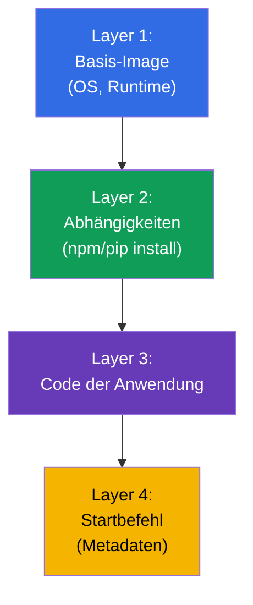
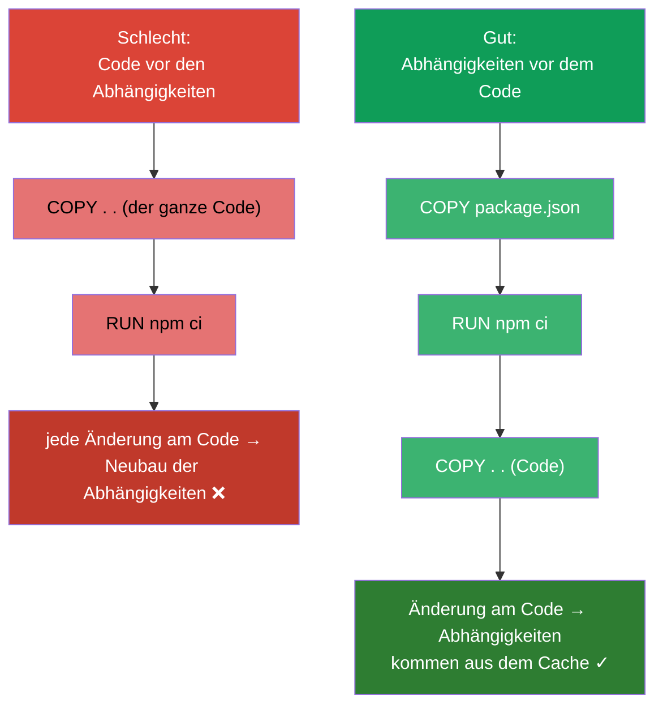
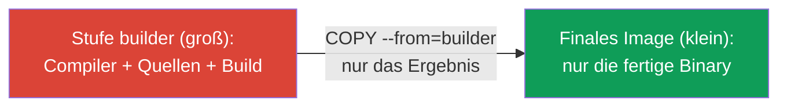
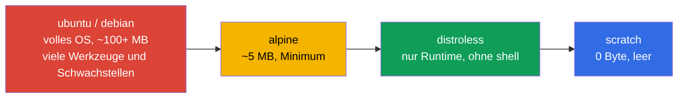
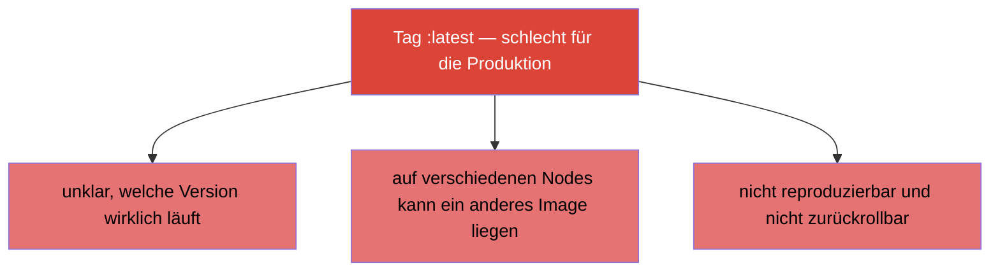

[Русская версия](ru.md) · [Eng version](README.md) · [Versión en español](es.md) · [Version française](fr.md) · [ქართული ვერსია](ge.md) · [繁體中文版](tw.md) · [日本語版](jp.md)

# Kapitel 23. Container-Images: Build, Dockerfile, Optimierung

> 🟩 **Kapitel für CKAD** (Domäne Application Design and Build). Bei CKA wird der Bau von
> Images nicht gefragt, aber das Verständnis von Images ist für alle nützlich.
>
> **Was kommt.** Wir haben viele Container aus fertigen Images gestartet (`nginx`,
> `busybox`). Jetzt sehen wir uns an, woraus ein Image besteht, wie man es aus einem
> Dockerfile baut und wie man es klein und sicher macht. CKAD prüft in der Domäne Design
> and Build die Fähigkeit, „ein Image zu definieren, zu bauen und zu modifizieren“. Das
> Verständnis von Layern und Optimierung wirkt sich direkt auf die Rollout-Geschwindigkeit,
> die Speicherkosten und die Sicherheit aus.

## 23.1. Was ein Image ist und was Layer sind

Ein **Container-Image** ist das Dateisystem einer Anwendung, ihre Abhängigkeiten und
Metadaten (was zu starten ist), zusammen verpackt. Ein Image besteht aus **Layern
(layers)**: jeder Layer ist eine Menge von Änderungen am Dateisystem, die über den
vorherigen gelegt wird.



Zentrale Eigenschaften von Layern:

- **Layer werden gecacht und wiederverwendet.** Wenn sich der Basis-Layer nicht geändert
  hat, wird er beim Build aus dem Cache genommen - schnellerer Build und weniger Traffic.
- **Layer sind zwischen Images gemeinsam.** Wenn zwei Images auf demselben Basis-Image
  beruhen, wird der Layer nur einmal gespeichert.
- **Ein Image ist unveränderlich (immutable).** Ein laufender Container legt über das Image
  einen dünnen **beschreibbaren Layer**; beim Löschen des Containers verschwindet er. Das
  Image selbst ändert sich nicht.

## 23.2. Dockerfile: das Rezept für ein Image

Ein **Dockerfile** ist eine Textdatei mit Build-Anweisungen. Jede Anweisung erzeugt (in
der Regel) einen Layer.

```dockerfile
FROM node:20-alpine           # Basis-Image
WORKDIR /app                  # Arbeitsverzeichnis
COPY package*.json ./         # zuerst die Abhängigkeiten (für den Cache)
RUN npm ci --production        # Installation der Abhängigkeiten — ein eigener Layer
COPY . .                      # danach der Code der Anwendung
EXPOSE 3000                   # dokumentiert den Port
USER node                     # Start als unprivilegierter Benutzer
CMD ["node", "server.js"]     # was gestartet wird
```

Die wichtigsten Anweisungen:

| Anweisung | Zweck |
|-----------|-----------|
| `FROM` | Basis-Image (womit man beginnt) |
| `RUN` | einen Befehl beim Build ausführen (erzeugt einen Layer) |
| `COPY` / `ADD` | Dateien in das Image kopieren |
| `WORKDIR` | Arbeitsverzeichnis festlegen |
| `ENV` | Umgebungsvariable im Image |
| `EXPOSE` | einen Port dokumentieren (öffnet ihn nicht) |
| `USER` | als welcher Benutzer gestartet wird |
| `ENTRYPOINT` / `CMD` | was mit welchen Argumenten gestartet wird (Kapitel 17) |

## 23.3. Reihenfolge der Anweisungen und Layer-Cache

Die wichtigste praktische Fähigkeit ist die **richtige Reihenfolge der Anweisungen
zugunsten des Cache**. Docker cacht die Layer von oben nach unten und baut alles ab der
ersten geänderten Anweisung neu. Also legt man selten Wechselndes nach oben und häufig
Wechselndes nach unten.



Der klassische Trick (im Beispiel oben zu sehen): zuerst `COPY package.json` + `RUN
install`, dann `COPY . .` mit dem Code. Ändert sich nur der Code, kommt der Layer mit den
Abhängigkeiten aus dem Cache, und der Build läuft um ein Vielfaches schneller.

## 23.4. Multi-stage build: kleine Images

Große Images werden langsam gezogen, sind teuer zu speichern und tragen mehr
Schwachstellen. Ein **Multi-stage build** erlaubt es, die Anwendung in einem „fetten“ Image
zu bauen (mit Compiler und Werkzeugen) und in das finale Image nur das Ergebnis zu legen -
ohne Überflüssiges.

```dockerfile
# Build-Stufe — hier gibt es den Compiler und alles Nötige
FROM golang:1.22 AS builder
WORKDIR /src
COPY . .
RUN go build -o /app/server .

# Finale Stufe — nur die Binary, ohne Compiler
FROM alpine:3.20
COPY --from=builder /app/server /server
CMD ["/server"]
```



Ergebnis: das finale Image enthält nur die ausführbare Datei und ein Minimum an Umgebung -
statt hunderter Megabyte Compiler und Build-Abhängigkeiten.

## 23.5. Wahl des Basis-Image: Größe und Sicherheit

Das Basis-Image bestimmt Größe und Angriffsfläche. Als Orientierung von „schwer“ zu
„leicht“:



| Basis-Image | Größe | Vorteile | Nachteile |
|---------------|--------|-------|--------|
| `ubuntu`/`debian` | groß | gewohnt, alles vorhanden | viel Überflüssiges, Schwachstellen |
| `alpine` | ~5 MB | kompakt | andere libc (musl), manchmal Inkompatibilität |
| `distroless` | klein | nur Runtime, keine shell - sicherer | schwerer zu debuggen (kein `sh`) |
| `scratch` | 0 | absolutes Minimum | passt nur zu statischen Binaries (Go) |

Kleineres Image = schnellerer Rollout, weniger Platz, kleinere Angriffsfläche. Die Kehrseite
von distroless/scratch ist das Fehlen von `sh` zum Debuggen (hier hilft `kubectl debug` mit
Ephemeral-Containern, Kapitel 29).

## 23.6. Image-Tag und imagePullPolicy

Der **Tag** identifiziert die Version des Image: `nginx:1.27`. Ein Thema für sich sind der
Tag `latest` und die Pull-Policy.



`imagePullPolicy` bestimmt, wann das Image gezogen wird:

| Wert | Verhalten | Standard wann |
|----------|-----------|--------------------|
| `IfNotPresent` | nur ziehen, wenn es lokal nicht vorhanden ist | für Images mit konkretem Tag |
| `Always` | bei jedem Start ziehen | für den Tag `latest` oder ohne Tag |
| `Never` | niemals ziehen (nur lokal) | - |

Regel für die Produktion: **immer ein konkreter Tag** (besser noch ein unveränderlicher
Digest `@sha256:...`), niemals `latest`, damit man genau weiß und reproduzieren kann, was
läuft.

## 23.7. Image-Registries und privater Zugriff

Images werden in **Registries** gespeichert: Docker Hub, GitHub Container Registry, in der
Cloud (ECR, GCR, ACR), privat (Harbor). Öffentliche werden ohne Authentifizierung gezogen,
für private braucht man ein `imagePullSecret` (Kapitel 19):

```bash
kubectl create secret docker-registry regcred \
  --docker-server=registry.example.com \
  --docker-username=user --docker-password=pass
```

```yaml
spec:
  imagePullSecrets:
  - name: regcred
  containers:
  - name: app
    image: registry.example.com/myapp:1.0
```

Wenn ein Pod in `ImagePullBackOff` (Kapitel 4) landet, liegt die Ursache meist hier: ein
Tippfehler im Namen/Tag, kein Zugriff auf die private Registry oder ein fehlendes
imagePullSecret.

## 23.8. Wie man das in der Produktion anwendet

- **Kleine Images sind die Norm.** In der Produktion strebt man minimale Images an
  (multi-stage + alpine/distroless): schnellerer Rollout und Autoscaling, geringere Kosten
  für Speicher und Traffic, weniger Schwachstellen. Riesige Images bremsen die gesamte
  Delivery-Pipeline.
- **Unveränderliche Tags/Digest.** Die Produktion wird nach einer konkreten Version oder
  einem Digest ausgerollt, nicht nach `latest` - sonst ist unklar, was wirklich läuft, und
  ein Vorfall lässt sich nicht reproduzieren oder zurückrollen.
- **Scannen von Schwachstellen.** Images werden in der CI durch Scanner geschickt (Trivy,
  Grype) und ein Deployment mit kritischen CVE wird verboten. Kleineres Basis-Image =
  weniger Funde.
- **Non-root im Image.** Im Dockerfile setzt man `USER` (unprivilegiert), damit die
  Anwendung nicht als root läuft (überschneidet sich mit dem SecurityContext, Kapitel 20).
- **Private Registries und Signatur.** Prod-Images werden in privaten Registries
  gespeichert, oft signiert (cosign) und die Signatur beim Zulassen (admission) geprüft,
  damit kein unbekanntes Image in den Cluster gelangt.

## 23.9. Mini-Glossar

- **Image** - verpacktes Dateisystem der Anwendung + Abhängigkeiten + Start-Metadaten.
- **Layer** - eine Menge von Änderungen am Dateisystem; Layer werden gecacht und
  wiederverwendet.
- **Dockerfile** - Anweisungen zum Bau eines Image.
- **Base image** - das Basis-Image (`FROM`), mit dem der Build beginnt.
- **Multi-stage build** - Build in einem Image, im Finale nur das Ergebnis.
- **distroless / scratch** - minimale Basis-Images ohne Überflüssiges/leer.
- **Tag / Digest** - Version des Image / unveränderlicher Hash des Inhalts.
- **imagePullPolicy** - wann das Image gezogen wird (IfNotPresent/Always/Never).
- **Registry** - Speicher für Images; eine private verlangt ein imagePullSecret.

## 23.10. Zusammenfassung des Kapitels

- Ein Image besteht aus cachebaren, wiederverwendbaren Layern; das Image ist
  unveränderlich, der Container legt nur einen dünnen beschreibbaren Layer darüber.
- Das Dockerfile ist das Build-Rezept; die zentralen Anweisungen: FROM, RUN, COPY, WORKDIR,
  ENV, USER, ENTRYPOINT/CMD.
- Die Reihenfolge der Anweisungen ist für den Cache wichtig: selten Wechselndes nach oben,
  Code nach unten (Abhängigkeiten vor dem COPY des Codes).
- Ein Multi-stage build ergibt ein kleines finales Image (nur das Ergebnis, ohne
  Build-Werkzeuge).
- Das Basis-Image wählt man nach Größe/Sicherheit: ubuntu → alpine → distroless → scratch.
- In der Produktion ein konkreter Tag/Digest, nicht `latest`; `imagePullPolicy` steuert das
  Ziehen.
- Private Registries verlangen ein imagePullSecret; Zugriffsfehler → ImagePullBackOff.

## 23.11. Wofür das nützlich ist: in der Prüfung und in der echten Arbeit

**In der Prüfung (CKAD).** Die Domäne Design and Build prüft die Arbeit mit Images: ein
Dockerfile verstehen, Befehl/Benutzer setzen, mit Tags und imagePullPolicy klarkommen,
ImagePullBackOff diagnostizieren. Auch wenn man in der Prüfung selten selbst baut, ist das
Verständnis von Images für viele Aufgaben nötig.

**In der echten Arbeit.** Größe und Struktur eines Image wirken sich direkt auf die
Liefergeschwindigkeit, die Kosten und die Sicherheit aus. Multi-stage, minimale
Basis-Images, unveränderliche Tags, Scannen und Non-root sind der Standard einer reifen
Pipeline. Das Verständnis von Layern und Cache beschleunigt den Build um ein Vielfaches.

## 23.12. Fragen zur Selbstüberprüfung

1. Woraus besteht ein Image und warum werden Layer gecacht und wiederverwendet?
2. Warum sollte man `COPY package.json` + install vor dem `COPY` des ganzen Codes machen?
3. Was bringt ein Multi-stage build und wie verkleinert er das finale Image?
4. Wodurch sind distroless/scratch sicherer als ubuntu und welche Nachteile haben sie?
5. Warum ist `latest` eine schlechte Wahl für die Produktion? Was nutzt man stattdessen?
6. Wie hängt `imagePullPolicy` mit dem Tag des Image zusammen?
7. Was braucht man, um ein Image aus einer privaten Registry zu ziehen, und warum entsteht
   ImagePullBackOff?

## Praxis

Wir haben uns angesehen, woraus ein Container gemacht ist. In Kapitel 24 kommt das letzte
Thema von Teil 4: Volumes für Anwendungen (emptyDir und ephemere), die in den Patterns
schon erwähnt wurden. Die Arbeit mit Images wird in den Labs zum Design von Anwendungen
geübt.

🧪 Lab 107 (Container-Images): [tasks/cka/labs/107](../../labs/107/README_DE.MD)

---
[Inhalt](../README_DE.md) · [Kapitel 22](../22/de.md) · [Kapitel 24](../24/de.md)
