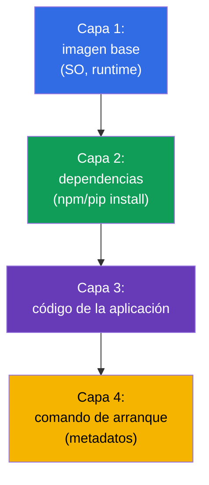
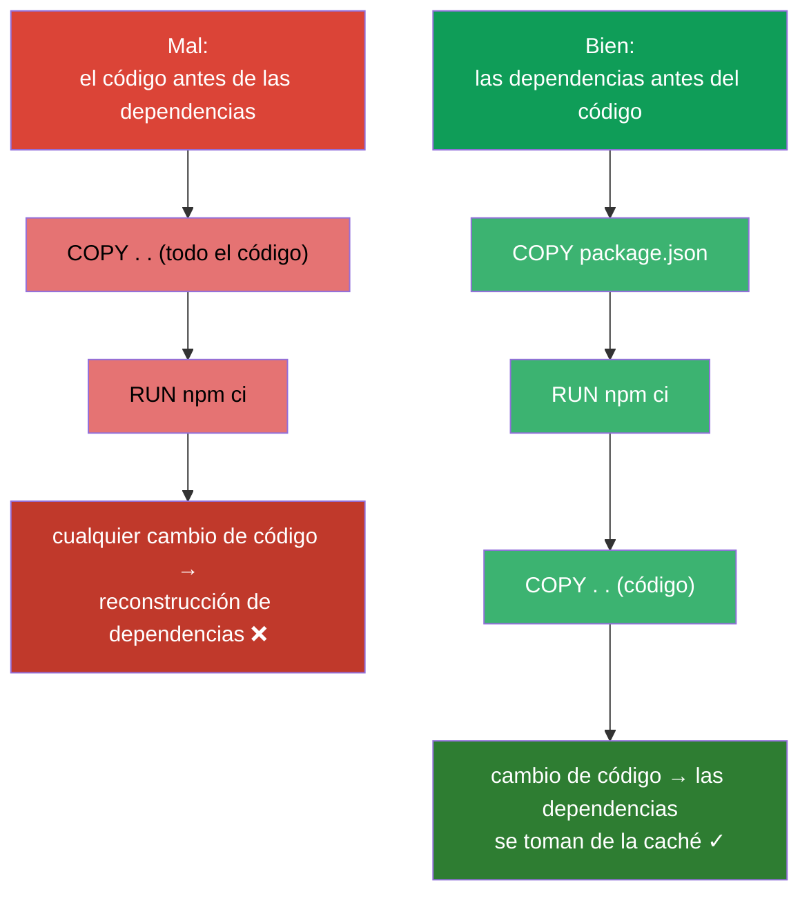
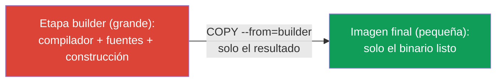
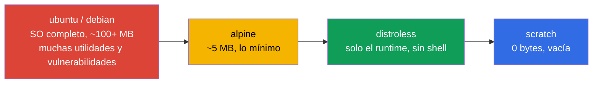
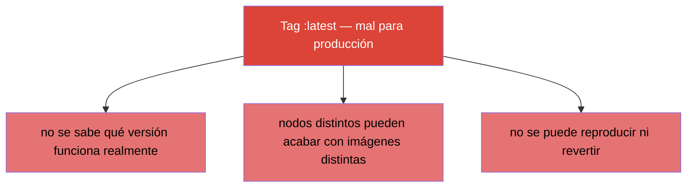

[Русская версия](ru.md) · [Eng version](README.md) · [Version française](fr.md) · [Deutsche Version](de.md) · [ქართული ვერსია](ge.md) · [繁體中文版](tw.md) · [日本語版](jp.md)

# Capítulo 23. Imágenes de contenedores: construcción, Dockerfile, optimización

> 🟩 **Capítulo para CKAD** (dominio Application Design and Build). En CKA no se pregunta
> por la construcción de imágenes, pero entender las imágenes le sirve a todo el mundo.
>
> **Qué viene ahora.** Hemos arrancado muchos contenedores desde imágenes ya listas (`nginx`,
> `busybox`). Ahora veremos de qué está hecha una imagen, cómo construirla desde un Dockerfile
> y cómo dejarla pequeña y segura. CKAD, en el dominio Design and Build, comprueba la
> capacidad de «definir, construir y modificar una imagen». Entender las capas y la
> optimización influye directamente en la velocidad de despliegue, el coste de
> almacenamiento y la seguridad.

## 23.1. Qué es una imagen y qué son las capas

Una **imagen de contenedor** es el sistema de ficheros de la aplicación, sus dependencias y
los metadatos (qué arrancar) empaquetados juntos. La imagen está formada por **capas
(layers)**: cada capa es un conjunto de cambios del sistema de ficheros superpuesto sobre el
anterior.



Propiedades clave de las capas:

- **Las capas se cachean y se reutilizan.** Si la capa base no ha cambiado, en la construcción
  se toma de la caché: construcción más rápida y menos tráfico.
- **Las capas son comunes entre imágenes.** Si dos imágenes se basan en la misma base, la capa
  se guarda una sola vez.
- **La imagen es inmutable (immutable).** Un contenedor en marcha añade sobre la imagen una
  fina **capa escribible**; al borrar el contenedor, desaparece. La imagen en sí no cambia.

## 23.2. Dockerfile: la receta de la imagen

Un **Dockerfile** es un fichero de texto con las instrucciones de construcción. Cada
instrucción (normalmente) crea una capa.

```dockerfile
FROM node:20-alpine           # imagen base
WORKDIR /app                  # directorio de trabajo
COPY package*.json ./         # primero las dependencias (para la caché)
RUN npm ci --production        # instalación de dependencias — una capa aparte
COPY . .                      # después el código de la aplicación
EXPOSE 3000                   # documenta el puerto
USER node                     # arranque con un usuario no privilegiado
CMD ["node", "server.js"]     # qué arrancar
```

Instrucciones principales:

| Instrucción | Para qué sirve |
|-----------|-----------|
| `FROM` | imagen base (por dónde empezar) |
| `RUN` | ejecutar un comando durante la construcción (crea una capa) |
| `COPY` / `ADD` | copiar ficheros a la imagen |
| `WORKDIR` | fijar el directorio de trabajo |
| `ENV` | variable de entorno en la imagen |
| `EXPOSE` | documentar un puerto (no lo abre) |
| `USER` | con qué usuario arrancar |
| `ENTRYPOINT` / `CMD` | qué arrancar y con qué argumentos (capítulo 17) |

## 23.3. Orden de las instrucciones y caché de capas

La habilidad práctica más importante es el **orden correcto de las instrucciones para
aprovechar la caché**. Docker cachea las capas de arriba abajo y reconstruye todo a partir de
la primera instrucción que ha cambiado. Es decir, lo que cambia poco se pone arriba y lo que
cambia a menudo, abajo.



El truco clásico (visible en el ejemplo de arriba): primero `COPY package.json` + `RUN
install`, después `COPY . .` con el código. Así, cuando solo cambia el código, la capa de
dependencias se toma de la caché y la construcción va muchísimo más rápido.

## 23.4. Multi-stage build: imágenes pequeñas

Las imágenes grandes se descargan despacio, se almacenan caro y arrastran más
vulnerabilidades. El **multi-stage build** permite compilar la aplicación en una imagen
«gorda» (con compilador y herramientas) y poner en la imagen final solo el resultado, sin
nada de más.

```dockerfile
# Etapa de construcción — aquí están el compilador y todo lo necesario
FROM golang:1.22 AS builder
WORKDIR /src
COPY . .
RUN go build -o /app/server .

# Etapa final — solo el binario, sin compilador
FROM alpine:3.20
COPY --from=builder /app/server /server
CMD ["/server"]
```



Resultado: la imagen final contiene solo el ejecutable y un entorno mínimo, en lugar de
cientos de megabytes de compilador y dependencias de construcción.

## 23.5. Elección de la imagen base: tamaño y seguridad

La imagen base determina el tamaño y la superficie de ataque. Referencia de lo «pesado» a lo
«ligero»:



| Imagen base | Tamaño | Ventajas | Inconvenientes |
|---------------|--------|-------|--------|
| `ubuntu`/`debian` | grande | familiar, está todo | mucho de sobra, vulnerabilidades |
| `alpine` | ~5 MB | compacta | otra libc (musl), a veces incompatibilidades |
| `distroless` | pequeña | solo el runtime, sin shell - más segura | más difícil de depurar (no hay `sh`) |
| `scratch` | 0 | el mínimo absoluto | solo sirve para binarios estáticos (Go) |

Imagen más pequeña = despliegue más rápido, menos espacio, menor superficie de ataque. La
contrapartida de distroless/scratch es la ausencia de `sh` para depurar (aquí ayuda `kubectl
debug` con contenedores ephemeral, capítulo 29).

## 23.6. Tag de la imagen e imagePullPolicy

El **tag** identifica la versión de la imagen: `nginx:1.27`. Un tema aparte son el tag
`latest` y la política de descarga.



`imagePullPolicy` determina cuándo descargar la imagen:

| Valor | Comportamiento | Por defecto cuando |
|----------|-----------|--------------------|
| `IfNotPresent` | descargar solo si no está en local | para imágenes con un tag concreto |
| `Always` | descargar en cada arranque | para el tag `latest` o sin tag |
| `Never` | nunca descargar (solo la local) | - |

Regla de producción: **siempre un tag concreto** (mejor aún, un digest inmutable
`@sha256:...`), nunca `latest`, para saber con exactitud y poder reproducir qué está en
marcha.

## 23.7. Registros de imágenes y acceso privado

Las imágenes se guardan en **registros**: Docker Hub, GitHub Container Registry, los de nube
(ECR, GCR, ACR), privados (Harbor). Los públicos se descargan sin autenticación; para los
privados hace falta un `imagePullSecret` (capítulo 19):

```bash
kubectl create secret docker-registry regcred \
  --docker-server=registry.example.com \
  --docker-username=user --docker-password=pass
```

```yaml
spec:
  imagePullSecrets:
  - name: regcred
  containers:
  - name: app
    image: registry.example.com/myapp:1.0
```

Si un Pod cae en `ImagePullBackOff` (capítulo 4), la causa suele estar aquí: una errata en el
nombre/tag, falta de acceso al registro privado o ausencia de imagePullSecret.

## 23.8. Cómo se aplica esto en producción

- **Las imágenes pequeñas son la norma.** En producción se busca imágenes mínimas
  (multi-stage + alpine/distroless): despliegue y autoescalado más rápidos, menor coste de
  almacenamiento y tráfico, menos vulnerabilidades. Las imágenes enormes ralentizan toda la
  cadena de entrega.
- **Tags/digest inmutables.** Producción se despliega por una versión concreta o por digest,
  no por `latest`, porque si no no se sabe qué funciona realmente y es imposible reproducir un
  incidente o revertir.
- **Escaneo de vulnerabilidades.** En CI las imágenes se pasan por escáneres (Trivy, Grype) y
  se prohíbe el despliegue con CVE críticos. Imagen base más pequeña = menos hallazgos.
- **Non-root en la imagen.** En el Dockerfile se fija `USER` (no privilegiado) para que la
  aplicación no funcione como root (se solapa con SecurityContext, capítulo 20).
- **Registros privados y firma.** Las imágenes de producción se guardan en registros privados,
  a menudo se firman (cosign) y se comprueba la firma en la admisión (admission), para que al
  clúster no llegue una imagen desconocida.

## 23.9. Mini-glosario

- **Imagen (image)** - el FS de la aplicación empaquetado + dependencias + metadatos de
  arranque.
- **Capa (layer)** - conjunto de cambios del FS; las capas se cachean y se reutilizan.
- **Dockerfile** - instrucciones de construcción de la imagen.
- **Base image** - imagen base (`FROM`) con la que empieza la construcción.
- **Multi-stage build** - construcción en una imagen, final solo con el resultado.
- **distroless / scratch** - imágenes base mínimas sin nada de sobra / vacía.
- **Tag / digest** - versión de la imagen / hash inmutable del contenido.
- **imagePullPolicy** - cuándo descargar la imagen (IfNotPresent/Always/Never).
- **Registro** - almacén de imágenes; el privado exige imagePullSecret.

## 23.10. Resumen del capítulo

- La imagen está formada por capas cacheables y reutilizables; la imagen es inmutable y el
  contenedor solo añade una fina capa escribible.
- El Dockerfile es la receta de construcción; instrucciones clave: FROM, RUN, COPY, WORKDIR,
  ENV, USER, ENTRYPOINT/CMD.
- El orden de las instrucciones importa para la caché: lo que cambia poco arriba, el código
  abajo (las dependencias antes del COPY del código).
- El multi-stage build da una imagen final pequeña (solo el resultado, sin herramientas de
  construcción).
- La imagen base se elige por tamaño/seguridad: ubuntu → alpine → distroless → scratch.
- En producción, tag/digest concreto, no `latest`; `imagePullPolicy` gobierna la descarga.
- Los registros privados exigen imagePullSecret; los errores de acceso → ImagePullBackOff.

## 23.11. Para qué te servirá: en el examen y en el trabajo real

**En el examen (CKAD).** El dominio Design and Build comprueba la capacidad de trabajar con
imágenes: entender un Dockerfile, fijar el comando/usuario, manejarse con los tags e
imagePullPolicy, diagnosticar ImagePullBackOff. Aunque la construcción en sí se hace pocas
veces en el examen, entender las imágenes hace falta para muchas tareas.

**En el trabajo real.** El tamaño y la estructura de la imagen influyen directamente en la
velocidad de entrega, el coste y la seguridad. Multi-stage, imágenes base mínimas, tags
inmutables, escaneo y non-root son el estándar de una cadena madura. Entender las capas y la
caché acelera la construcción muchas veces.

## 23.12. Preguntas de autoevaluación

1. ¿De qué está formada una imagen y por qué las capas se cachean y se reutilizan?
2. ¿Por qué conviene hacer `COPY package.json` + install antes del `COPY` de todo el código?
3. ¿Qué aporta el multi-stage build y cómo reduce la imagen final?
4. ¿Por qué distroless/scratch son más seguras que ubuntu y qué inconvenientes tienen?
5. ¿Por qué `latest` es una mala elección para producción? ¿Qué usar en su lugar?
6. ¿Cómo se relaciona `imagePullPolicy` con el tag de la imagen?
7. ¿Qué hace falta para descargar una imagen de un registro privado y por qué aparece
   ImagePullBackOff?

## Práctica

Hemos visto de qué está hecho un contenedor. En el capítulo 24 viene el último tema de la
parte 4: los volúmenes para aplicaciones (emptyDir y efímeros), que ya se mencionaron en los
patrones. El trabajo con imágenes se practica en los laboratorios de diseño de aplicaciones.

🧪 Laboratorio 107 (imágenes de contenedores): [tasks/cka/labs/107](../../labs/107/README_ES.MD)

🎮 Killercoda (en el navegador, sin instalación): [Create Dockerfile with Args and Run](https://killercoda.com/chadmcrowell/course/ckad/dockerfile) · [Create a custom nginx container image](https://killercoda.com/chadmcrowell/course/ckad/nginx-custom)

---
[Índice](../README_ES.md) · [Capítulo 22](../22/es.md) · [Capítulo 24](../24/es.md)
