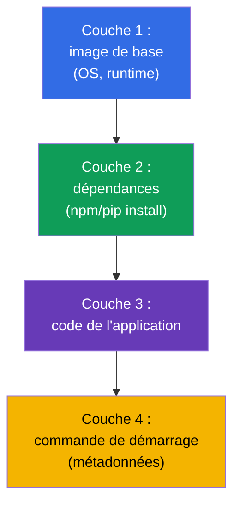
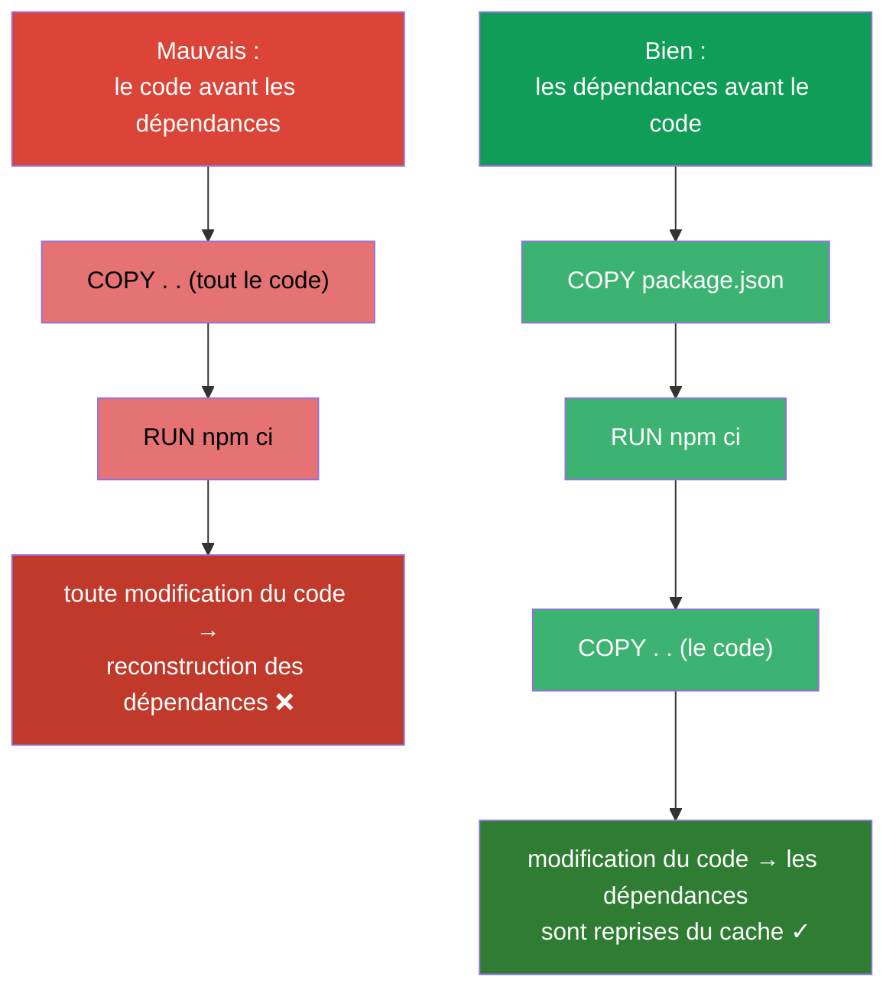
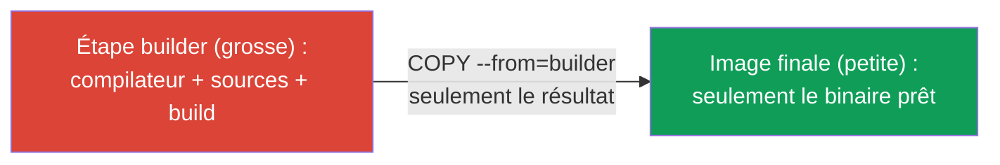
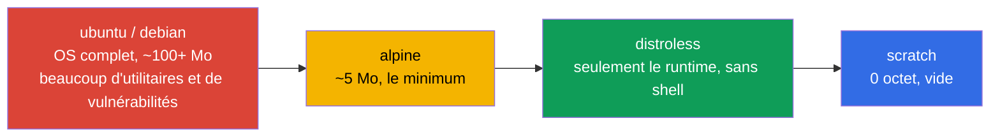
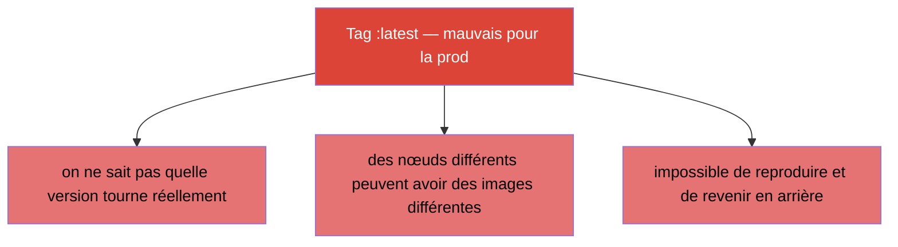

[Русская версия](ru.md) · [Eng version](README.md) · [Versión en español](es.md) · [Deutsche Version](de.md) · [ქართული ვერსია](ge.md)

# Chapitre 23. Images de conteneurs : build, Dockerfile, optimisation

> 🟩 **Chapitre orienté CKAD** (domaine Application Design and Build). Au CKA la
> construction d'images n'est pas demandée, mais comprendre les images est utile à tous.
>
> **Ce qui suit.** Nous avons beaucoup lancé de conteneurs à partir d'images prêtes à
> l'emploi (`nginx`, `busybox`). Voyons maintenant de quoi une image est faite, comment la
> construire depuis un Dockerfile et comment la rendre petite et sûre. Le CKAD, dans le
> domaine Design and Build, vérifie la capacité à « définir, construire et modifier une
> image ». Comprendre les couches et l'optimisation influe directement sur la vitesse de
> déploiement, le coût de stockage et la sécurité.

## 23.1. Qu'est-ce qu'une image et des couches

Une **image de conteneur**, c'est le système de fichiers d'une application, ses dépendances
et ses métadonnées (quoi lancer) empaquetés ensemble. L'image est composée de **couches
(layers)** : chaque couche est un ensemble de modifications du système de fichiers,
superposé à la précédente.



Propriétés clés des couches :

- **Les couches sont mises en cache et réutilisées.** Si la couche de base n'a pas changé,
  elle est reprise du cache lors du build - build plus rapide et moins de trafic.
- **Les couches sont communes à plusieurs images.** Si deux images reposent sur la même
  base, la couche n'est stockée qu'une seule fois.
- **L'image est immuable (immutable).** Un conteneur lancé ajoute par-dessus l'image une
  fine **couche inscriptible** ; à la suppression du conteneur, elle disparaît. L'image
  elle-même ne change pas.

## 23.2. Dockerfile : la recette de l'image

Un **Dockerfile** est un fichier texte contenant les instructions de build. Chaque
instruction crée (généralement) une couche.

```dockerfile
FROM node:20-alpine           # image de base
WORKDIR /app                  # répertoire de travail
COPY package*.json ./         # d'abord les dépendances (pour le cache)
RUN npm ci --production        # installation des dépendances - une couche à part
COPY . .                      # ensuite le code de l'application
EXPOSE 3000                   # documente le port
USER node                     # démarrage sous un utilisateur non privilégié
CMD ["node", "server.js"]     # quoi lancer
```

Principales instructions :

| Instruction | Rôle |
|-----------|-----------|
| `FROM` | image de base (par quoi commencer) |
| `RUN` | exécuter une commande au build (crée une couche) |
| `COPY` / `ADD` | copier des fichiers dans l'image |
| `WORKDIR` | définir le répertoire de travail |
| `ENV` | variable d'environnement dans l'image |
| `EXPOSE` | documenter un port (ne l'ouvre pas) |
| `USER` | sous quel utilisateur lancer |
| `ENTRYPOINT` / `CMD` | quoi lancer et avec quels arguments (chapitre 17) |

## 23.3. Ordre des instructions et cache des couches

La compétence pratique la plus importante, c'est le **bon ordre des instructions au service
du cache**. Docker met les couches en cache de haut en bas et reconstruit tout à partir de
la première instruction modifiée. Autrement dit, ce qui change rarement se place plus haut,
ce qui change souvent - plus bas.



L'astuce classique (visible dans l'exemple ci-dessus) : d'abord `COPY package.json` +
`RUN install`, puis `COPY . .` avec le code. Ainsi, quand seul le code change, la couche des
dépendances est reprise du cache et le build va bien plus vite.

## 23.4. Multi-stage build : des images petites

Les grosses images se téléchargent lentement, coûtent cher à stocker et portent davantage de
vulnérabilités. Le **multi-stage build** permet de compiler l'application dans une image
« grasse » (avec compilateur et outils) et de ne mettre dans l'image finale que le résultat -
sans le superflu.

```dockerfile
# Étape de build — ici on a le compilateur et tout le nécessaire
FROM golang:1.22 AS builder
WORKDIR /src
COPY . .
RUN go build -o /app/server .

# Étape finale — seulement le binaire, sans compilateur
FROM alpine:3.20
COPY --from=builder /app/server /server
CMD ["/server"]
```



Résultat : l'image finale ne contient que l'exécutable et un environnement minimal - au lieu
de centaines de mégaoctets de compilateur et de dépendances de build.

## 23.5. Choix de l'image de base : taille et sécurité

L'image de base détermine la taille et la surface d'attaque. Un repère, du « lourd » au
« léger » :



| Image de base | Taille | Avantages | Inconvénients |
|---------------|--------|-------|--------|
| `ubuntu`/`debian` | grande | familier, tout y est | beaucoup de superflu et de vulnérabilités |
| `alpine` | ~5 Mo | compacte | autre libc (musl), parfois des incompatibilités |
| `distroless` | petite | seulement le runtime, pas de shell - plus sûr | plus difficile à déboguer (pas de `sh`) |
| `scratch` | 0 | le minimum absolu | ne convient qu'aux binaires statiques (Go) |

Image plus petite = déploiement plus rapide, moins de place, surface d'attaque réduite. La
contrepartie de distroless/scratch, c'est l'absence de `sh` pour le débogage (là, `kubectl
debug` avec des conteneurs ephemeral vient à la rescousse, chapitre 29).

## 23.6. Tag de l'image et imagePullPolicy

Le **tag** identifie la version de l'image : `nginx:1.27`. Un sujet à part : le tag `latest`
et la politique de téléchargement.



`imagePullPolicy` définit quand télécharger l'image :

| Valeur | Comportement | Par défaut quand |
|----------|-----------|--------------------|
| `IfNotPresent` | télécharger seulement si absente en local | pour les images avec un tag précis |
| `Always` | télécharger à chaque démarrage | pour le tag `latest` ou sans tag |
| `Never` | ne jamais télécharger (local uniquement) | - |

Règle de la prod : **toujours un tag précis** (mieux encore - un digest immuable
`@sha256:...`), jamais `latest`, afin de savoir exactement et de pouvoir reproduire ce qui
tourne.

## 23.7. Registres d'images et accès privé

Les images sont stockées dans des **registres** : Docker Hub, GitHub Container Registry, les
registres cloud (ECR, GCR, ACR), les privés (Harbor). Les publics se téléchargent sans
authentification ; pour les privés il faut un `imagePullSecret` (chapitre 19) :

```bash
kubectl create secret docker-registry regcred \
  --docker-server=registry.example.com \
  --docker-username=user --docker-password=pass
```

```yaml
spec:
  imagePullSecrets:
  - name: regcred
  containers:
  - name: app
    image: registry.example.com/myapp:1.0
```

Si un pod tombe en `ImagePullBackOff` (chapitre 4), la cause est généralement là : faute de
frappe dans le nom/tag, pas d'accès au registre privé ou imagePullSecret manquant.

## 23.8. Comment cela s'applique en production

- **Les petites images sont la norme.** En prod on vise des images minimales (multi-stage +
  alpine/distroless) : déploiement et autoscaling plus rapides, coût de stockage et de trafic
  réduit, moins de vulnérabilités. Les images énormes ralentissent toute la chaîne de
  livraison.
- **Tags immuables / digests.** La prod se déploie sur une version précise ou un digest, pas
  sur `latest` - sinon on ne sait pas ce qui tourne réellement et il devient impossible de
  reproduire un incident ou de revenir en arrière.
- **Analyse des vulnérabilités.** En CI, les images passent par des scanners (Trivy, Grype)
  et le déploiement est interdit en cas de CVE critique. Image de base plus petite = moins de
  découvertes.
- **Non-root dans l'image.** Dans le Dockerfile on définit `USER` (non privilégié) pour que
  l'application ne tourne pas en root (à rapprocher du SecurityContext, chapitre 20).
- **Registres privés et signature.** Les images de prod sont conservées dans des registres
  privés, souvent signées (cosign) et leur signature est vérifiée à l'admission, pour qu'une
  image inconnue n'entre pas dans le cluster.

## 23.9. Mini-glossaire

- **Image** - le FS empaqueté de l'application + dépendances + métadonnées de démarrage.
- **Couche (layer)** - ensemble de modifications du FS ; les couches sont mises en cache et réutilisées.
- **Dockerfile** - les instructions de build de l'image.
- **Base image** - image de base (`FROM`) par laquelle commence le build.
- **Multi-stage build** - build dans une image, le final ne garde que le résultat.
- **distroless / scratch** - images de base minimales, sans superflu / vides.
- **Tag / digest** - version de l'image / hash immuable du contenu.
- **imagePullPolicy** - quand télécharger l'image (IfNotPresent/Always/Never).
- **Registre** - stockage d'images ; un registre privé exige un imagePullSecret.

## 23.10. Bilan du chapitre

- Une image est faite de couches réutilisables mises en cache ; l'image est immuable, le
  conteneur ne fait qu'ajouter une fine couche inscriptible.
- Le Dockerfile est la recette du build ; instructions clés : FROM, RUN, COPY, WORKDIR, ENV,
  USER, ENTRYPOINT/CMD.
- L'ordre des instructions compte pour le cache : ce qui change rarement plus haut, le code
  plus bas (les dépendances avant le COPY du code).
- Le multi-stage build donne une petite image finale (seulement le résultat, sans les outils
  de build).
- L'image de base se choisit selon la taille/la sécurité : ubuntu → alpine → distroless →
  scratch.
- En prod - un tag précis ou un digest, pas `latest` ; `imagePullPolicy` pilote le
  téléchargement.
- Les registres privés exigent un imagePullSecret ; les erreurs d'accès → ImagePullBackOff.

## 23.11. À quoi cela sert : à l'examen et dans le travail réel

**À l'examen (CKAD).** Le domaine Design and Build vérifie la capacité à travailler avec les
images : comprendre un Dockerfile, définir la commande/l'utilisateur, s'y retrouver avec les
tags et imagePullPolicy, diagnostiquer un ImagePullBackOff. Même si le build lui-même est
rarement demandé à l'examen, comprendre les images est nécessaire pour beaucoup d'exercices.

**Dans le travail réel.** La taille et la structure de l'image influent directement sur la
vitesse de livraison, le coût et la sécurité. Multi-stage, images de base minimales, tags
immuables, scan et non-root sont le standard d'une chaîne mature. Comprendre les couches et
le cache accélère le build de plusieurs fois.

## 23.12. Questions d'auto-évaluation

1. De quoi une image est-elle faite et pourquoi les couches sont-elles mises en cache et réutilisées ?
2. Pourquoi faut-il faire `COPY package.json` + install avant le `COPY` de tout le code ?
3. Qu'apporte le multi-stage build et comment réduit-il l'image finale ?
4. En quoi distroless/scratch sont-ils plus sûrs qu'ubuntu et quels sont leurs inconvénients ?
5. Pourquoi `latest` est-il un mauvais choix pour la prod ? Que faut-il utiliser à la place ?
6. Quel est le lien entre `imagePullPolicy` et le tag de l'image ?
7. Que faut-il pour télécharger une image depuis un registre privé, et pourquoi survient un
   ImagePullBackOff ?

## Pratique

Nous avons vu de quoi un conteneur est fait. Au chapitre 24 vient le dernier sujet de la
partie 4 : les volumes pour les applications (emptyDir et éphémères), déjà évoqués dans les
patterns. Le travail sur les images se pratique dans les TP sur la conception des
applications.

🧪 TP 107 (images de conteneurs) : [tasks/cka/labs/107](../../labs/107/README_FR.MD)

---
[Sommaire](../README_FR.md) · [Chapitre 22](../22/fr.md) · [Chapitre 24](../24/fr.md)
