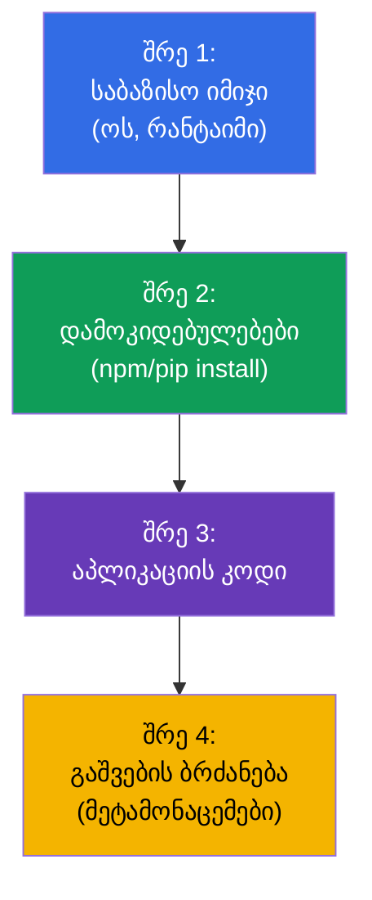
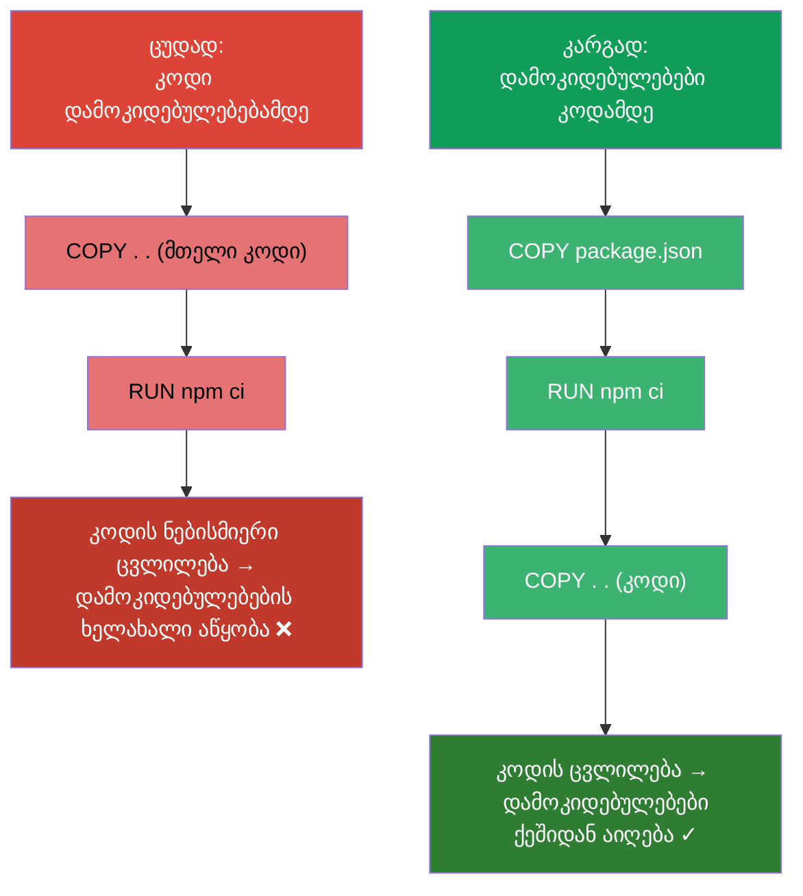
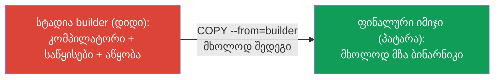
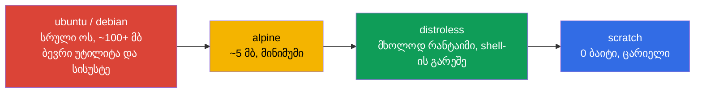
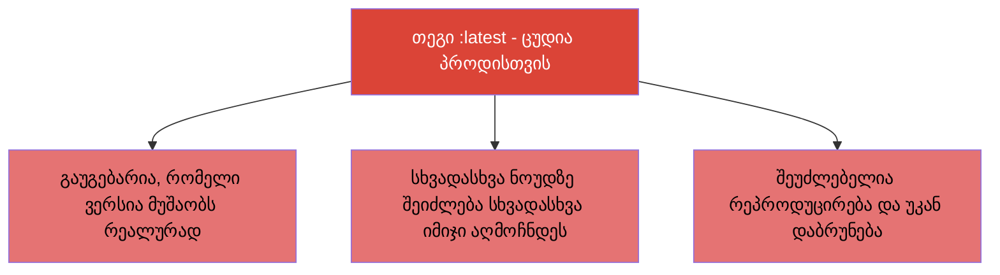

[Русская версия](ru.md) · [Eng version](README.md) · [Versión en español](es.md) · [Version française](fr.md) · [Deutsche Version](de.md)

# თავი 23. კონტეინერების იმიჯები: აწყობა, Dockerfile, ოპტიმიზაცია

> 🟩 **თავი CKAD-სთვის** (დომენი Application Design and Build). CKA-ზე იმიჯების აწყობას არ
> კითხავენ, მაგრამ იმიჯების გაგება ყველასთვის სასარგებლოა.
>
> **რა იქნება შემდეგ.** ბევრჯერ გავუშვით კონტეინერები მზა იმიჯებიდან (`nginx`, `busybox`).
> ახლა გავარკვევთ, რისგან შედგება იმიჯი, როგორ ავაწყოთ იგი Dockerfile-იდან და როგორ გავხადოთ
> პატარა და უსაფრთხო. CKAD დომენ Design and Build-ში ამოწმებს უნარს „განსაზღვრო,
> ააწყო და შეცვალო იმიჯი“. შრეებისა და ოპტიმიზაციის გაგება პირდაპირ მოქმედებს
> გამოშვების სიჩქარეზე, შენახვის ღირებულებასა და უსაფრთხოებაზე.

## 23.1. რა არის იმიჯი და შრეები

**კონტეინერის იმიჯი** - ეს არის ერთად შეფუთული აპლიკაციის ფაილური სისტემა, მისი
დამოკიდებულებები და მეტამონაცემები (რა უნდა გაეშვას). იმიჯი შედგება **შრეებისგან (layers)**: ყოველი
შრე - ეს არის ფაილური სისტემის ცვლილებების ნაკრები, დადებული წინაზე.



შრეების საკვანძო თვისებები:

- **შრეები ქეშირდება და ხელახლა გამოიყენება.** თუ საბაზისო შრე არ შეცვლილა, აწყობისას იგი
  ქეშიდან აიღება - აწყობა უფრო სწრაფია და ტრაფიკი ნაკლები.
- **შრეები საერთოა იმიჯებს შორის.** თუ ორი იმიჯი ერთსა და იმავე საბაზისოზეა დაფუძნებული, შრე ინახება
  ერთხელ.
- **იმიჯი უცვლელია (immutable).** გაშვებული კონტეინერი იმიჯს ზემოდან ამატებს თხელ
  **ჩაწერად შრეს**; კონტეინერის წაშლისას იგი ქრება. თავად იმიჯი არ იცვლება.

## 23.2. Dockerfile: იმიჯის რეცეპტი

**Dockerfile** - ტექსტური ფაილი აწყობის ინსტრუქციებით. ყოველი ინსტრუქცია (ჩვეულებრივ) ქმნის
შრეს.

```dockerfile
FROM node:20-alpine           # საბაზისო იმიჯი
WORKDIR /app                  # სამუშაო კატალოგი
COPY package*.json ./         # თავიდან დამოკიდებულებები (ქეშისთვის)
RUN npm ci --production        # დამოკიდებულებების დაყენება - ცალკე შრე
COPY . .                      # შემდეგ აპლიკაციის კოდი
EXPOSE 3000                   # ადოკუმენტირებს პორტს
USER node                     # გაშვება არაპრივილეგირებული მომხმარებლისგან
CMD ["node", "server.js"]     # რა უნდა გაეშვას
```

ძირითადი ინსტრუქციები:

| ინსტრუქცია | დანიშნულება |
|-----------|-----------|
| `FROM` | საბაზისო იმიჯი (რითი დაიწყოს) |
| `RUN` | ბრძანების შესრულება აწყობისას (ქმნის შრეს) |
| `COPY` / `ADD` | ფაილების კოპირება იმიჯში |
| `WORKDIR` | სამუშაო კატალოგის მითითება |
| `ENV` | გარემოს ცვლადი იმიჯში |
| `EXPOSE` | პორტის დოკუმენტირება (არ ხსნის მას) |
| `USER` | რომელი მომხმარებლისგან გაეშვას |
| `ENTRYPOINT` / `CMD` | რა და რომელი არგუმენტებით გაეშვას (თავი 17) |

## 23.3. ინსტრუქციების რიგი და შრეების ქეში

უმნიშვნელოვანესი პრაქტიკული უნარი - **ინსტრუქციების სწორი რიგი ქეშის გულისთვის**. Docker
ქეშირებს შრეებს ზემოდან ქვემოთ და თავიდან აწყობს ყველაფერს პირველი შეცვლილი ინსტრუქციიდან.
ესე იგი, იშვიათად ცვალებადს დებენ ზემოთ, ხშირად ცვალებადს - ქვემოთ.



კლასიკური ხერხი (ჩანს ზემოთ მოცემულ მაგალითში): თავიდან `COPY package.json` + `RUN install`,
შემდეგ `COPY . .` კოდით. მაშინ მხოლოდ კოდის შეცვლისას დამოკიდებულებების შრე ქეშიდან აიღება,
და აწყობა რამდენჯერმე უფრო სწრაფად მიდის.

## 23.4. Multi-stage build: პატარა იმიჯები

დიდი იმიჯები ნელა იზიდება, ძვირად ინახება და მეტ სისუსტეს ატარებს.
**Multi-stage build** საშუალებას იძლევა ააწყო აპლიკაცია „მსუყე“ იმიჯში (კომპილატორით,
ინსტრუმენტებით), ხოლო ფინალურ იმიჯში ჩადო მხოლოდ შედეგი - ზედმეტის გარეშე.

```dockerfile
# აწყობის სტადია - აქ არის კომპილატორი და ყველაფერი საჭირო
FROM golang:1.22 AS builder
WORKDIR /src
COPY . .
RUN go build -o /app/server .

# ფინალური სტადია - მხოლოდ ბინარნიკი, კომპილატორის გარეშე
FROM alpine:3.20
COPY --from=builder /app/server /server
CMD ["/server"]
```



შედეგი: ფინალური იმიჯი შეიცავს მხოლოდ შესრულებად ფაილსა და გარემოს მინიმუმს - აწყობის
კომპილატორისა და დამოკიდებულებების ასეულობით მეგაბაიტის ნაცვლად.

## 23.5. საბაზისო იმიჯის არჩევა: ზომა და უსაფრთხოება

საბაზისო იმიჯი განსაზღვრავს ზომასა და შეტევის ზედაპირს. ორიენტირი „მძიმედან“ „მსუბუქისკენ“:



| საბაზისო იმიჯი | ზომა | პლიუსები | მინუსები |
|---------------|--------|-------|--------|
| `ubuntu`/`debian` | დიდი | ჩვეული, ყველაფერი არის | ბევრი ზედმეტი, სისუსტეები |
| `alpine` | ~5 მბ | კომპაქტური | სხვა libc (musl), ხანდახან შეუთავსებლობა |
| `distroless` | პატარა | მხოლოდ რანტაიმი, არ არის shell - უფრო უსაფრთხო | უფრო რთულია გამართვა (არ არის `sh`) |
| `scratch` | 0 | აბსოლუტური მინიმუმი | მოსახერხებელია მხოლოდ სტატიკური ბინარნიკებისთვის (Go) |

უფრო პატარა იმიჯი = უფრო სწრაფი გამოშვება, ნაკლები ადგილი, ნაკლები შეტევის ზედაპირი. უკუმხარე
distroless/scratch-ის - `sh`-ის არარსებობა გამართვისთვის (აქ გვშველის `kubectl debug`
ephemeral-კონტეინერებით, თავი 29).

## 23.6. იმიჯის თეგი და imagePullPolicy

**თეგი** აიდენტიფიცირებს იმიჯის ვერსიას: `nginx:1.27`. ცალკე თემაა თეგი `latest` და
ჩამოწერის პოლიტიკა.



`imagePullPolicy` განსაზღვრავს, როდის ეზიდოს იმიჯი:

| მნიშვნელობა | ქცევა | ნაგულისხმევია როდის |
|----------|-----------|--------------------|
| `IfNotPresent` | ზიდოს მხოლოდ მაშინ, თუ ლოკალურად არ არის | კონკრეტული თეგის მქონე იმიჯებისთვის |
| `Always` | ზიდოს ყოველ სტარტზე | თეგ `latest`-ისთვის ან თეგის გარეშე |
| `Never` | არასოდეს არ ზიდოს (მხოლოდ ლოკალური) | - |

პროდის წესი: **ყოველთვის კონკრეტული თეგი** (უკეთესია - უცვლელი digest `@sha256:...`),
არასოდეს `latest`, რომ ზუსტად იცოდე და რეპროდუცირებადი იყოს, რა არის გაშვებული.

## 23.7. იმიჯების რეესტრები და პრივატული წვდომა

იმიჯები ინახება **რეესტრებში**: Docker Hub, GitHub Container Registry, ღრუბლოვანი (ECR,
GCR, ACR), პრივატული (Harbor). საჯაროები იზიდება აუთენტიფიკაციის გარეშე, პრივატულებისთვის საჭიროა
`imagePullSecret` (თავი 19):

```bash
kubectl create secret docker-registry regcred \
  --docker-server=registry.example.com \
  --docker-username=user --docker-password=pass
```

```yaml
spec:
  imagePullSecrets:
  - name: regcred
  containers:
  - name: app
    image: registry.example.com/myapp:1.0
```

თუ Pod ვარდება `ImagePullBackOff`-ში (თავი 4) - მიზეზი ჩვეულებრივ აქ არის: შეცდომა
სახელში/თეგში, არ არის წვდომა პრივატულ რეესტრთან ან არ არსებობს imagePullSecret.

## 23.8. როგორ იყენებენ ამას პროდაქშენში

- **პატარა იმიჯები - ნორმაა.** პროდში მიისწრაფვიან მინიმალური იმიჯებისკენ (multi-stage +
  alpine/distroless): უფრო სწრაფი გამოშვება და ავტოსკეილინგი, ნაკლები შენახვისა და ტრაფიკის ღირებულება,
  ნაკლები სისუსტე. უზარმაზარი იმიჯები ანელებს მიწოდების მთელ კონვეიერს.
- **უცვლელი თეგები/digest.** პროდს ავითარებენ კონკრეტული ვერსიით ან digest-ით, და არა
  `latest`-ით - წინააღმდეგ შემთხვევაში გაუგებარია, რა მუშაობს რეალურად, და შეუძლებელია ინციდენტის
  რეპროდუცირება ან უკან დაბრუნება.
- **სისუსტეების სკანირება.** იმიჯებს CI-ში ატარებენ სკანერებში (Trivy, Grype) და
  კრიტიკული CVE-ებით დეპლოის კრძალავენ. უფრო პატარა საბაზისო იმიჯი = ნაკლები აღმოჩენა.
- **Non-root იმიჯში.** Dockerfile-ში მიუთითებენ `USER`-ს (არაპრივილეგირებულს), რომ
  აპლიკაცია არ იმუშაოს root-ისგან (გადაიძახება SecurityContext-თან, თავი 20).
- **პრივატული რეესტრები და ხელმოწერა.** პროდ-იმიჯებს ინახავენ პრივატულ რეესტრებში, ხშირად
  აწერენ ხელს (cosign) და ამოწმებენ ხელმოწერას დაშვებისას (admission), რომ კლასტერში არ
  მოხვდეს უცნობი იმიჯი.

## 23.9. მინი-ლექსიკონი

- **იმიჯი (image)** - შეფუთული აპლიკაციის ფს + დამოკიდებულებები + გაშვების მეტამონაცემები.
- **შრე (layer)** - ფს-ის ცვლილებების ნაკრები; შრეები ქეშირდება და ხელახლა გამოიყენება.
- **Dockerfile** - იმიჯის აწყობის ინსტრუქციები.
- **Base image** - საბაზისო იმიჯი (`FROM`), რომლითაც იწყება აწყობა.
- **Multi-stage build** - აწყობა ერთ იმიჯში, ფინალი - მხოლოდ შედეგი.
- **distroless / scratch** - მინიმალური საბაზისო იმიჯები ზედმეტის გარეშე/ცარიელი.
- **თეგი / digest** - იმიჯის ვერსია / შიგთავსის უცვლელი ჰეში.
- **imagePullPolicy** - როდის ეზიდოს იმიჯი (IfNotPresent/Always/Never).
- **რეესტრი** - იმიჯების საცავი; პრივატული მოითხოვს imagePullSecret-ს.

## 23.10. თავის შეჯამება

- იმიჯი შედგება ქეშირებადი, ხელახლა გამოყენებადი შრეებისგან; იმიჯი უცვლელია, კონტეინერი მხოლოდ
  ამატებს თხელ ჩაწერად შრეს.
- Dockerfile - აწყობის რეცეპტი; საკვანძო ინსტრუქციები: FROM, RUN, COPY, WORKDIR, ENV, USER,
  ENTRYPOINT/CMD.
- ინსტრუქციების რიგი მნიშვნელოვანია ქეშისთვის: იშვიათად ცვალებადი ზემოთ, კოდი ქვემოთ (დამოკიდებულებები -
  კოდის COPY-მდე).
- Multi-stage build იძლევა პატარა ფინალურ იმიჯს (მხოლოდ შედეგი, აწყობის ინსტრუმენტების
  გარეშე).
- საბაზისო იმიჯს ირჩევენ ზომის/უსაფრთხოების მიხედვით: ubuntu → alpine → distroless → scratch.
- პროდში - კონკრეტული თეგი/digest, არა `latest`; `imagePullPolicy` მართავს ჩამოწერას.
- პრივატული რეესტრები მოითხოვს imagePullSecret-ს; წვდომის შეცდომები → ImagePullBackOff.

## 23.11. როგორ გამოგადგებათ: გამოცდაზე და რეალურ სამუშაოში

**გამოცდაზე (CKAD).** დომენი Design and Build ამოწმებს იმიჯებთან მუშაობის უნარს:
გაიგო Dockerfile, მიუთითო ბრძანება/მომხმარებელი, გაერკვიო თეგებსა და imagePullPolicy-ში,
დიაგნოსტიკა გაუკეთო ImagePullBackOff-ს. თუმცა თავად აწყობას გამოცდაზე იშვიათად აკეთებენ, იმიჯების
გაგება საჭიროა ბევრი დავალებისთვის.

**რეალურ სამუშაოში.** იმიჯის ზომა და სტრუქტურა პირდაპირ მოქმედებს მიწოდების სიჩქარეზე,
ღირებულებასა და უსაფრთხოებაზე. Multi-stage, მინიმალური საბაზისო იმიჯები, უცვლელი თეგები,
სკანირება და non-root - მოწიფული კონვეიერის სტანდარტია. შრეებისა და ქეშის გაგება რამდენჯერმე აჩქარებს
აწყობას.

## 23.12. თვითშემოწმების კითხვები

1. რისგან შედგება იმიჯი და რატომ ქეშირდება და ხელახლა გამოიყენება შრეები?
2. რატომ ღირს `COPY package.json` + install გაკეთდეს მთელი კოდის `COPY`-მდე?
3. რას იძლევა multi-stage build და როგორ ამცირებს იგი ფინალურ იმიჯს?
4. რითი არის distroless/scratch უფრო უსაფრთხო, ვიდრე ubuntu, და რა მინუსები აქვთ მათ?
5. რატომ არის `latest` ცუდი არჩევანი პროდისთვის? რა გამოვიყენოთ მის ნაცვლად?
6. როგორ არის `imagePullPolicy` დაკავშირებული იმიჯის თეგთან?
7. რა არის საჭირო, რომ იმიჯი ჩამოიწერო პრივატული რეესტრიდან, და რატომ ჩნდება
   ImagePullBackOff?

## პრაქტიკა

გავარჩიეთ, რისგან არის გაკეთებული კონტეინერი. თავ 24-ში - ნაწილი 4-ის ბოლო თემა: ტომები
აპლიკაციებისთვის (emptyDir და ეფემერული), რომლებიც უკვე ვახსენეთ პატერნებში. იმიჯებთან მუშაობა
მუშავდება აპლიკაციების დიზაინის ლაბებში.

🧪 ლაბი 107 (კონტეინერების იმიჯები): [tasks/cka/labs/107](../../labs/107/README_GE.MD)

---
[სარჩევი](../README_GE.md) · [თავი 22](../22/ge.md) · [თავი 24](../24/ge.md)
